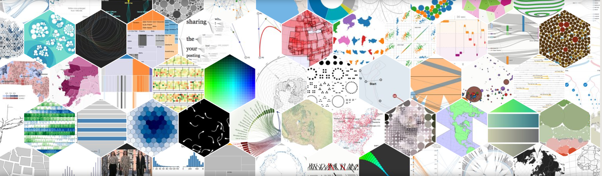
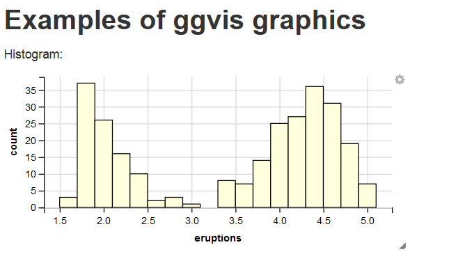
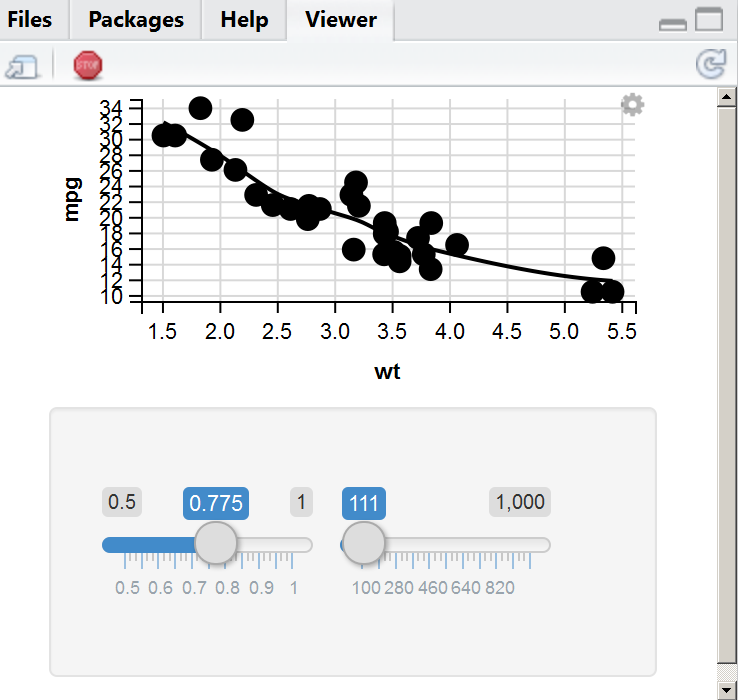
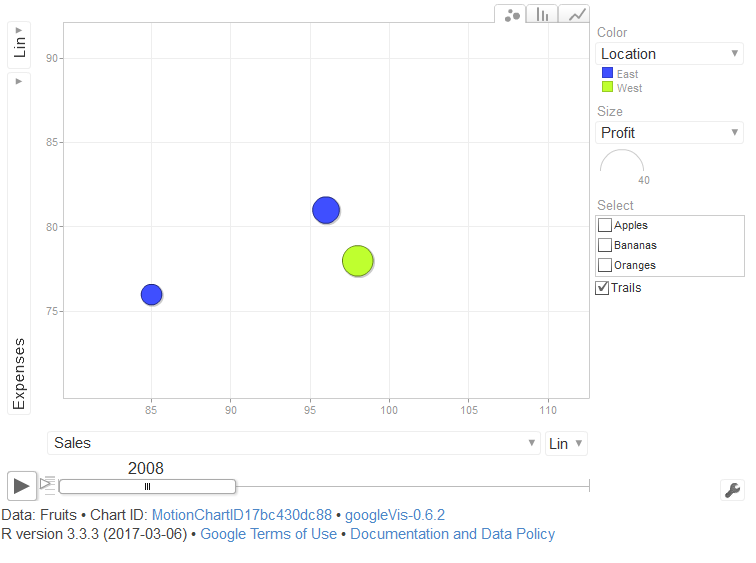
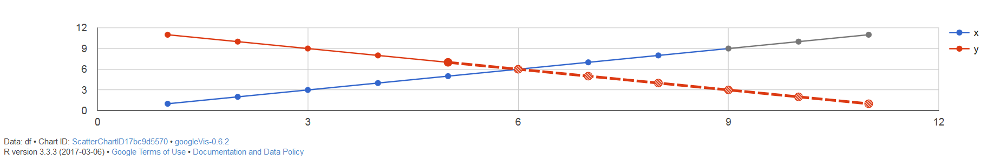
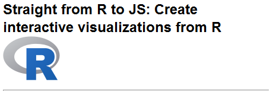
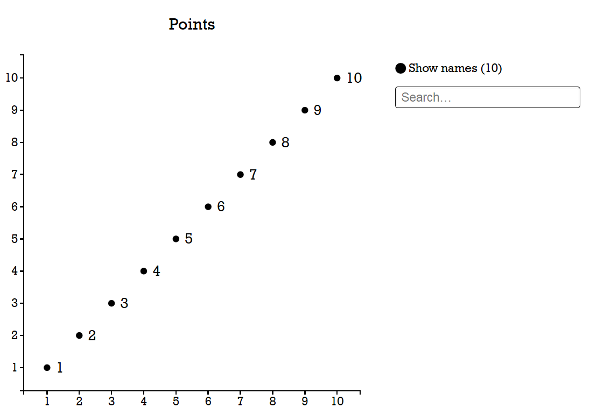
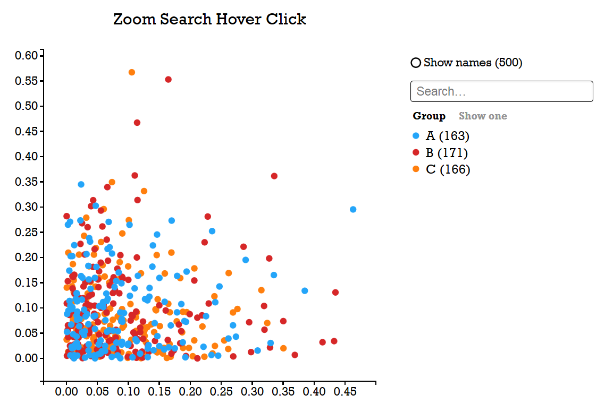
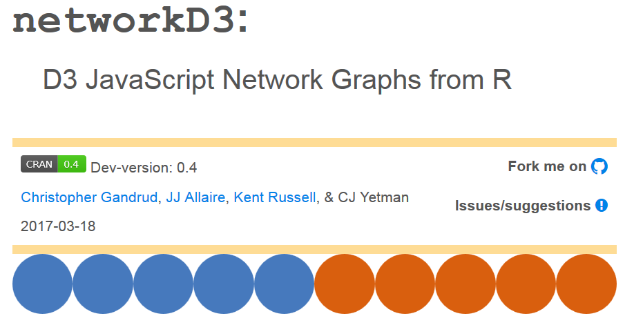

```{r, include=FALSE}
knitr::opts_chunk$set(echo = TRUE,message=F,warning=F,eval=F)
```

## JavaScript - Data-Driven Documents 



- D3 ist eine der mächtigsten unter der Vielzahl aktuell verfügbarer JavaScript-Bibliotheken zur Datenvisualisierung.

- [Big Data im Netz visualisieren](http://t3n.de/magazin/javascript-bibliothek-d3-237224/)
- [Möglichkeiten mit der JS D3 Bibliothek](http://christopheviau.com/d3list/gallery.html)
- [Die Power von R und D3.js zusammen bringen](https://www.ae.be/blog-en/combining-the-power-of-r-and-d3-js/)
- [5 Interaktive R Visualisierungen mit `D3`, `ggplot2` und RStudio](http://moderndata.plot.ly/interactive-r-visualizations-with-d3-ggplot2-rstudio/)
- [Das D3 Netzwerk](http://christophergandrud.github.io/d3Network/)


## [gigvis](https://github.com/rstudio/ggvis)

```{r,eval=F}
install.packages("ggvis")
```


```{r}
library("ggvis")
library(dplyr)
```

- [Übersicht zu ggvis](http://ggvis.rstudio.com/)



## [Kochbuch für ggvis](http://ggvis.rstudio.com/cookbook.html)

```{r}
mtcars %>% ggvis(~wt, ~mpg) %>% layer_points()
```

## Plots mit Gruppierung

```{r}
mtcars %>% 
  ggvis(~wt, ~mpg, fill = ~factor(cyl)) %>% 
  layer_points() %>% 
  group_by(cyl) %>% 
  layer_model_predictions(model = "lm")
```

## Interaktive Graphiken mit `ggvis`

```{r,eval=F}
mtcars %>%
  ggvis(~wt, ~mpg) %>%
  layer_smooths(span = input_slider(0.5, 1, value = 1)) %>%
  layer_points(size := input_slider(100, 1000, value = 100))
```

- [ggvis - Interaktivität](http://ggvis.rstudio.com/interactivity.html)



## [googleVis](https://cran.r-project.org/web/packages/googleVis/index.html)

```{r,eval=F}
install.packages("googleVis")
```


```{r}
library(googleVis)
```

- Das Paket `googleVis` bietet eine Schnittstelle zur [Google Charts API](https://developers.google.com/chart/)
- [Einführung in `googleVis`](https://cran.r-project.org/web/packages/googleVis/vignettes/googleVis.pdf)
- [Tutorial für `googleVis`](http://decastillo.github.io/googleVis_Tutorial/#1)
- Inspiration durch Hans Rosling: [No more boring data](https://youtu.be/hVimVzgtD6w)

## Ein Datensatz mit Früchten

```{r}
library(DT)
datatable(Fruits)
```


## Beispiel mit `googleVis`

```{r,eval=F}
plot(gvisMotionChart(Fruits, "Fruit", "Year", options = list(width = 600, height = 400)))
```




## Ein weiterer Beispieldatensatz

```{r}
df <- data.frame(year=1:11, x=1:11,
                 x.scope=c(rep(TRUE, 8), rep(FALSE, 3)),
                 y=11:1, y.html.tooltip=LETTERS[11:1],                 
                 y.certainty=c(rep(TRUE, 5), rep(FALSE, 6)),
                 y.emphasis=c(rep(FALSE, 4), rep(TRUE, 7)))
```

## Ein weiteres Beispiel für `googleVis`

```{r,eval=F}
plot(gvisScatterChart(df,options=list(lineWidth=2)))
```



## [Click me](http://rclickme.com/)

```{r,eval=F}
install.packages("devtools")
library(devtools)

install_github("clickme", "nachocab")
```




## Einfaches Beispiel mit `clickme`

```{r,eval=F}
library(clickme)
clickme("points", 1:10)
```




## Ein weiteres `clickme` Beispiel

```{r,eval=F}
n <- 500
clickme("points",
    x = rbeta(n, 1, 10), y = rbeta(n, 1, 10),
    names = sample(letters, n, r = T),
    color_groups = sample(LETTERS[1:3], n, r = T),
    title = "Zoom Search Hover Click")
```



## [Das Paket `networkD3`](https://christophergandrud.github.io/networkD3/)

```{r,eval=F}
install.packages("networkD3")
```



- der Vorgänger [d3Network ](http://christophergandrud.github.io/d3Network/)

## Ein Beispiel mit `networkD3`


```{r}
library(networkD3)
src <- c("A", "A", "A", "A","B", "B", "C", "C", "D")
target <- c("B", "C", "D", "J","E", "F", "G", "H", "I")
networkData <- data.frame(src, target)
simpleNetwork(networkData)
```


## Zeitreihen interaktiv darstellen mit `dygraphs` 

- [HTML widgets in R](http://www.htmlwidgets.org/showcase_leaflet.html)

```{r}
library(dygraphs)
dygraph(nhtemp, main = "New Haven Temperatures") %>% 
  dyRangeSelector(dateWindow = c("1920-01-01", "1960-01-01"))
```


## Das Paket `threejs`

- [Introducing JS](https://www.opencpu.org/posts/js-release-0-1/)

```{r,eval=F}
install.packages("threejs")
```

```{r,results='asis'}
library(threejs)
z <- seq(-10, 10, 0.01)
x <- cos(z)
y <- sin(z)
scatterplot3js(x,y,z, color=rainbow(length(z)))
```


## Links

- [Google Charts](https://developers.google.com/chart/interactive/docs/gallery/geochart)

- [Three little circles](https://bost.ocks.org/mike/circles/)

- [Wie schreibt man gute html widgets](http://deanattali.com/blog/htmlwidgets-tips/)

- [Die widgets exportieren](https://github.com/timelyportfolio/exportwidget)

- [R wie Javascript programmieren](https://blog.semicolonsoftware.de/programming-r-like-its-javascript-python/)

- [Mit Javascript in R arbeiten](https://cran.r-project.org/web/packages/js/vignettes/intro.html)

- [Paket rbokeh](http://hafen.github.io/rbokeh/)

- [ Interaktive Graphiken mit SVG](http://timelyportfolio.github.io/gridSVG_intro/)

- [HTMLwidgets](http://www.htmlwidgets.org/develop_intro.html)

- [Rook](https://cran.r-project.org/web/packages/Rook/index.html) - Tools um Webapplikationen mit R zu erstellen

```{r,eval=F}
install.packages("Rook")
```

