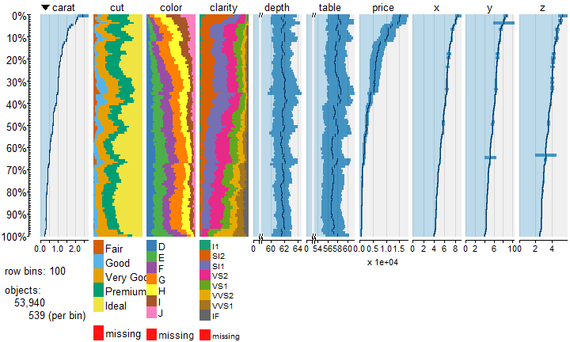

# R and D3
Jan-Philipp Kolb  
7 Februar 2017  


## 

- [R Interactive Graphics with SVG](http://timelyportfolio.github.io/gridSVG_intro/)

## [tabplotd3](https://cran.r-project.org/web/packages/tabplotd3/index.html)


```r
# install.packages("tabplotd3")
library(tabplotd3)
```

```
## Loading required package: tabplot
```

```
## Loading required package: bit
```

```
## Attaching package bit
```

```
## package:bit (c) 2008-2012 Jens Oehlschlaegel (GPL-2)
```

```
## creators: bit bitwhich
```

```
## coercion: as.logical as.integer as.bit as.bitwhich which
```

```
## operator: ! & | xor != ==
```

```
## querying: print length any all min max range sum summary
```

```
## bit access: length<- [ [<- [[ [[<-
```

```
## for more help type ?bit
```

```
## 
## Attaching package: 'bit'
```

```
## The following object is masked from 'package:base':
## 
##     xor
```

```
## Loading required package: ff
```

```
## Attaching package ff
```

```
## - getOption("fftempdir")=="D:/Temp/RtmpK6OkKJ"
```

```
## - getOption("ffextension")=="ff"
```

```
## - getOption("ffdrop")==TRUE
```

```
## - getOption("fffinonexit")==TRUE
```

```
## - getOption("ffpagesize")==65536
```

```
## - getOption("ffcaching")=="mmnoflush"  -- consider "ffeachflush" if your system stalls on large writes
```

```
## - getOption("ffbatchbytes")==84934656 -- consider a different value for tuning your system
```

```
## - getOption("ffmaxbytes")==4246732800 -- consider a different value for tuning your system
```

```
## 
## Attaching package: 'ff'
```

```
## The following objects are masked from 'package:bit':
## 
##     clone, clone.default, clone.list
```

```
## The following objects are masked from 'package:utils':
## 
##     write.csv, write.csv2
```

```
## The following objects are masked from 'package:base':
## 
##     is.factor, is.ordered
```

```
## Loading required package: ffbase
```

```
## 
## Attaching package: 'ffbase'
```

```
## The following objects are masked from 'package:ff':
## 
##     [.ff, [.ffdf, [<-.ff, [<-.ffdf
```

```
## The following objects are masked from 'package:base':
## 
##     %in%, table
```

```r
require(ggplot2)
```

```
## Loading required package: ggplot2
```

```r
data(diamonds)
tableplot(diamonds)
```

<!-- -->

