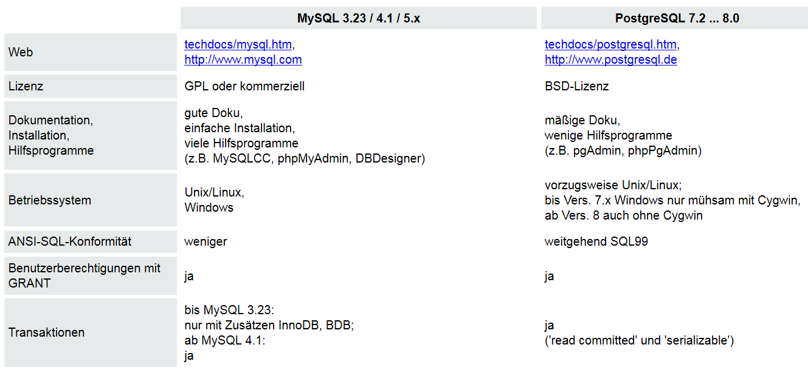
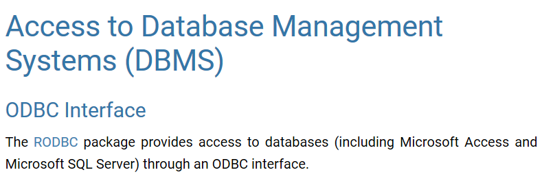

```{r setup, include=FALSE}
knitr::opts_chunk$set(echo = FALSE)
```

## [Was sind Datenbanken?](https://de.wikipedia.org/wiki/Datenbank)

- Eine Datenbank, auch Datenbanksystem (DBS) genannt, ist ein System zur elektronischen Datenverwaltung. 
- Die wesentliche Aufgabe eines DBS ist es, große Datenmengen effizient, widerspruchsfrei und dauerhaft zu speichern.

## [Wann sollte man R um Datenbanken ergänzen?](https://cran.r-project.org/web/packages/dplyr/vignettes/databases.html)

- Wenn ein Datensatz in den Arbeitsspeicher passt, gibt es keinen Grund eine Datenbank zu nutzen.

Man nutzt die Schnittstelle zu Datenbanken,...

- weil die Daten bereits in einer Datenbank vorgehalten werden
- oder weil der Datensatz nicht in den Arbeitsspeicher passt

## Die drei großen Open-Source Datenbanken

- sqlite, mysql and postgresql
- für alle drei gibt es Anbindungen in R
- und auf diese Anbindungen soll in der Folge der Fokus liegen


## [Was ist der Unterschied zwischen SQL und NoSQL](https://www.r-bloggers.com/database-interfaces/)


## [Vergleich zwischen MySQL und PostgreSQL](http://www.torsten-horn.de/techdocs/sql.htm)




## [Quick-R zur Integration von Datenbanken](http://www.statmethods.net/input/dbinterface.html)



## CouchDB

- [zur Interaktion mit CouchDB kann das Paket `sofa` verwendet werden](https://github.com/ropensci/sofa)

```{r,eval=F}
install.packages("jsonlite")
devtools::install_github("ropensci/sofa")
```

```{r,eval=F}
library("sofa")
```


## [`RMySQL`](https://cran.r-project.org/web/packages/RMySQL/index.html)

```{r,eval=F}
install.packages("RMySQL")
```

## Links

- [Datenbanken in R](https://cran.r-project.org/web/packages/dplyr/vignettes/databases.html)

- [Database basics - dplyr and DBI](https://shiny.rstudio.com/articles/overview.html)

- [Frühe Entwicklung zu Integration von Datenbanken](https://cran.r-project.org/web/packages/DBI/vignettes/DBI-proposal.html)