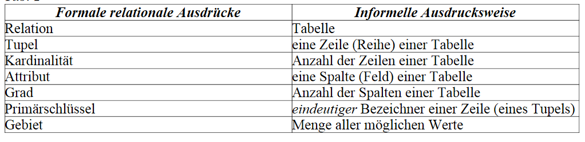
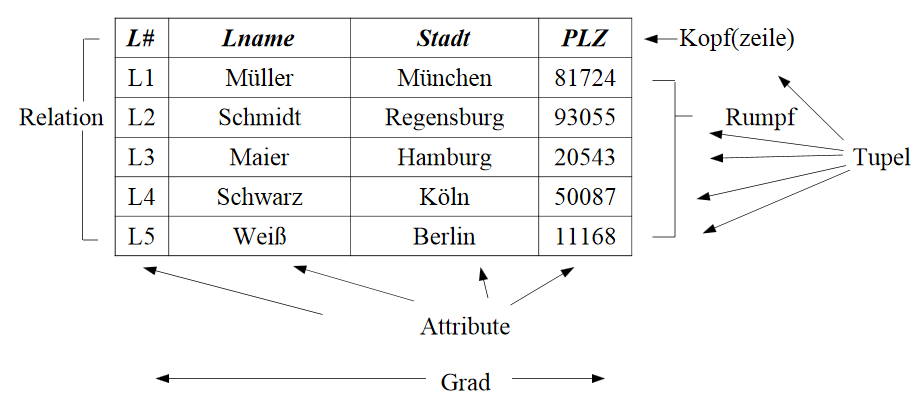
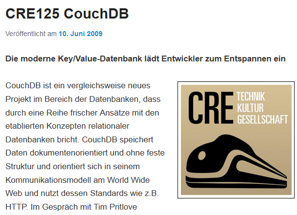
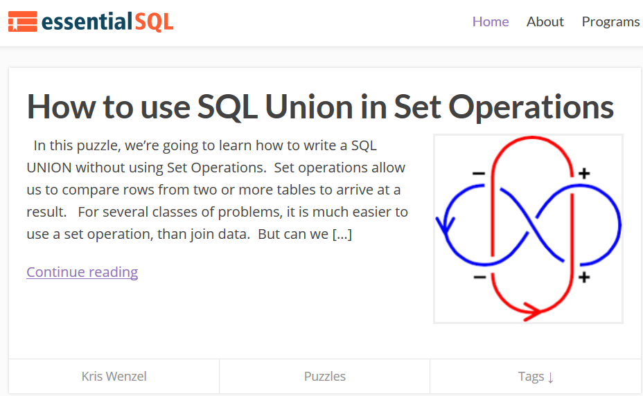

```{r, include=FALSE}
knitr::opts_chunk$set(echo = T)
```

## [Was sind Datenbanken?](https://de.wikipedia.org/wiki/Datenbank)

- Eine Datenbank, auch Datenbanksystem (DBS) genannt, ist ein System zur elektronischen Datenverwaltung. 
- Die wesentliche Aufgabe eines DBS ist es, große Datenmengen effizient, widerspruchsfrei und dauerhaft zu speichern.

## [Wann sollte man R um Datenbanken ergänzen?](https://cran.r-project.org/web/packages/dplyr/vignettes/databases.html)

- Wenn ein Datensatz in den Arbeitsspeicher passt, gibt es keinen Grund eine Datenbank zu nutzen.
- die Nutzung von Schnittstellen zu Datenbanken macht den Code nur komplizierter und langsamer


Man nutzt die Schnittstelle zu Datenbanken,...

- weil die Daten bereits in einer Datenbank vorgehalten werden
- oder weil der Datensatz nicht in den Arbeitsspeicher passt


## Die drei großen Open-Source Datenbanken

- [SQLite](https://www.sqlite.org/), [MySQL](https://www.mysql.com/de/) und [PostgreSQL](https://www.postgresql.org/)
- für alle drei gibt es Anbindungen in R

```{r,eval=F}
install.packages("RSQLite")
install.packages("RMySQL")
install.packages("RpostgreSQL")
```


- in der Folge liegt der Fokus vor allem auf SQLite und PostgreSQL

## [SQLite](https://www.sqlite.org/)


- [SQLite](https://de.wikipedia.org/wiki/SQLite) - Open Source Programmbibliothek mit relationalem Datenbanksystem 
- [SQLite ist eine schlanke Datenbank](https://chemnitzer.linux-tage.de/2015/media/vortraege/folien/144_sqlite.pdf) und man muss nichts weiter installieren um sie zu nutzen. 
- SQLite ist schon in R und Python integriert


## [MySQL Datenbank](https://de.wikipedia.org/wiki/MySQL)


- Grundlage für dynamische Webauftritte
- am meisten verbreitetes Datenbanksystem
- allerdings schwieriger zu konfigurieren als die anderen SQL Datenbanken SQLite und PostgreSQL

## [PostgreSQL](http://www.postgresql.de/)


- [PostgreSQL](https://de.wikipedia.org/wiki/PostgreSQL) ist in den meisten Linux-Distributionen enthalten.
- Bietet eine Schnittstellen zu vielen Programmiersprachen

## [Vergleich zwischen MySQL und PostgreSQL](http://www.torsten-horn.de/techdocs/sql.htm)


## [Beispiel zu relationalen Datenbanken](https://ab.inf.uni-tuebingen.de/teaching/ss03/asa/db_intro.pdf)





## [Was ist der Unterschied zwischen SQL und NoSQL](https://www.r-bloggers.com/database-interfaces/)


- [NoSQL steht für not only SQL](https://www.consol.de/presse/presse-meldungen/details/was-sie-schon-immer-ueber-nosql-wissen-wollten/)

- Key-Value-Stores (bspw. [CouchDB](https://de.wikipedia.org/wiki/CouchDB), MongoDB) und Speicherung unstrukturierter Daten wird durch Schema Evolution ermöglicht

- mit NoSQL lassen sich deutlich gößere Datenmengen händeln

- Horizontale Skalierbarkeit - wichtig bei Daten wie Video, Audio oder Bild-Dateien

- NoSQL-Bewegung ist nicht proprietär an einen Hersteller gebunden

## [MongoDB](https://de.wikipedia.org/wiki/MongoDB)

- MongoDB - kann sehr schnell und einfach installiert und benutzt werden.
- Schema-freie, dokumentenorientierte NoSQL-Datenbank
- kann Sammlungen von JSON-ähnlichen Dokumenten verwalten

## [CouchDB](https://de.wikipedia.org/wiki/CouchDB)

-  dokumentenorientierte Datenbank
- [zur Interaktion mit CouchDB kann das Paket `sofa` verwendet werden](https://github.com/ropensci/sofa)

### [Podcast zu CouchDB](https://cre.fm/cre125-couchdb)



## [Quick-R zur Integration von Datenbanken](http://www.statmethods.net/input/dbinterface.html)


## SQL lernen...

- [...mit W3School](https://www.w3schools.com/sql/default.asp)

- [...mit SQLzoo](http://sqlzoo.net/)

- [...SQL lernen mit tutorialspoint](http://www.tutorialspoint.com/sql/)

- [... mit Beispielen von sql tutorial](http://www.sql-tutorial.ru/en/book_database_airport.html)


## [Weitergehendes Lernen](https://www.essentialsql.com/)




## Weitere Resourcen

- [10 einfache Schritte um SQL zu verstehen](https://blog.jooq.org/2016/03/17/10-easy-steps-to-a-complete-understanding-of-sql/)

- [Abfrage planen](http://www.sqlite.org/queryplanner.html)

- [Video um NoSQL zu verstehen](https://www.youtube.com/watch?v=TvRDOLiadtg&list=PLxcWHsmHykmWlXorl8rm-2Ux4HP1sFkub)
