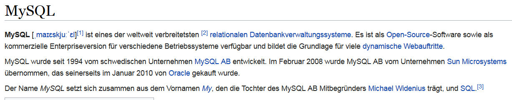

# Datenbanken Allgemein
Jan-Philipp Kolb  
9 Mai 2017  

## [Was sind Datenbanken?](https://de.wikipedia.org/wiki/Datenbank)

- Eine Datenbank, auch Datenbanksystem (DBS) genannt, ist ein System zur elektronischen Datenverwaltung. 
- Die wesentliche Aufgabe eines DBS ist es, große Datenmengen effizient, widerspruchsfrei und dauerhaft zu speichern.

## [Wann sollte man R um Datenbanken ergänzen?](https://cran.r-project.org/web/packages/dplyr/vignettes/databases.html)

- Wenn ein Datensatz in den Arbeitsspeicher passt, gibt es keinen Grund eine Datenbank zu nutzen.

Man nutzt die Schnittstelle zu Datenbanken,...

- weil die Daten bereits in einer Datenbank vorgehalten werden
- oder weil der Datensatz nicht in den Arbeitsspeicher passt

## Die drei großen Open-Source Datenbanken

- sqlite, mysql and postgresql
- für alle drei gibt es Anbindungen in R
- und auf diese Anbindungen soll in der Folge der Fokus liegen

## [sqlite](https://www.sqlite.org/)

- [SQLite](https://de.wikipedia.org/wiki/SQLite) - Open Source Programmbibliothek mit relationalem Datenbanksystem 
- [es ist eine schlanke Datenbank](https://chemnitzer.linux-tage.de/2015/media/vortraege/folien/144_sqlite.pdf)

## [mysql Datenbank](https://de.wikipedia.org/wiki/MySQL)

- Grundlage für dynamische Webauftritte
- am meisten verbreitete Datenbanksystem

## [PostgreSQL](http://www.postgresql.de/)

- [PostgreSQL](https://de.wikipedia.org/wiki/PostgreSQL) ist in den meisten Linux-Distributionen enthalten.
- Schnittstellen zu vielen Programmiersprachen

## [Vergleich zwischen MySQL und PostgreSQL](http://www.torsten-horn.de/techdocs/sql.htm)

## [Was ist der Unterschied zwischen SQL und NoSQL](https://www.r-bloggers.com/database-interfaces/)

- [NoSQL steht für not only SQL](https://www.consol.de/presse/presse-meldungen/details/was-sie-schon-immer-ueber-nosql-wissen-wollten/)

- Key-Value-Stores (bspw. [CouchDB](https://de.wikipedia.org/wiki/CouchDB), MongoDB) und Speicherung unstrukturierter Daten wird durch Schema Evolution ermöglicht

- mit NoSQL lassen sich deutlich gößere Datenmengen händeln

- Horizontale Skalierbarkeit - wichtig bei Daten wie Video, Audio oder Bild-Dateien

- NoSQL-Bewegung ist nicht proprietär an einen Hersteller gebunden

## [MongoDB](https://de.wikipedia.org/wiki/MongoDB)

- MongoDB - sehr schnell und einfach installiert und benutzt.
-  Schema-freie, dokumentenorientierte NoSQL-Datenbank
- kann Sammlungen von JSON-ähnlichen Dokumenten verwalten

## [Quick-R zur Integration von Datenbanken](http://www.statmethods.net/input/dbinterface.html)

## CouchDB

- [zur Interaktion mit CouchDB kann das Paket `sofa` verwendet werden](https://github.com/ropensci/sofa)

## [`RMySQL`](https://cran.r-project.org/web/packages/RMySQL/index.html)

## Links

- [Datenbanken in R](https://cran.r-project.org/web/packages/dplyr/vignettes/databases.html)

- [Database basics - dplyr and DBI](https://shiny.rstudio.com/articles/overview.html)

- [Frühe Entwicklung zu Integration von Datenbanken](https://cran.r-project.org/web/packages/DBI/vignettes/DBI-proposal.html)
