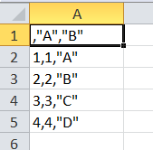
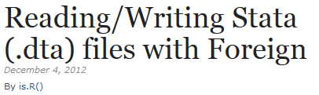

```{r, include=FALSE}
knitr::opts_chunk$set(echo = TRUE,eval=T)
```

## Die Exportformate von R

-  In R werden offene Dateiformate bevorzugt
-  Genauso wie `read.X()` Funktionen stehen viele `write.X()` Funktionen zur Verfügung
-  Das eigene Format von R sind sog. Workspaces (`.RData`)

## Beispieldatensatz erzeugen

```{r}
A <- c(1,2,3,4)
B <- c("A","B","C","D")

mydata <- data.frame(A,B)
```


```{r,eval=F,echo=F}
library(knitr)
kable(mydata)
```


## Überblick Daten Import/Export

- wenn mit R weitergearbeitet wird, eignet sich das `.RData` Format am Besten:

```{r,eval=F}
save(mydata, file="mydata.RData")
```

## Daten in `.csv` Format abspeichern

```{r,eval=F}
write.csv(mydata,file="mydata.csv") 
```

- Wenn mit Deutschem Excel weitergearbeitet werden soll, eignet sich  `write.csv2` besser

```{r,eval=F}
write.csv2(mydata,file="mydata.csv") 
```

- Sonst sieht das Ergebnis so aus:



## [Das Paket `xlsx`](http://www.sthda.com/english/wiki/r-xlsx-package-a-quick-start-guide-to-manipulate-excel-files-in-r#read-an-excel-file)


```{r,eval=F}
library(xlsx)
write.xlsx(mydata,file="mydata.xlsx") 
```

## [Das Paket `foreign`](https://www.r-bloggers.com/readingwriting-stata-dta-files-with-foreign/)



- Funktionen im Paket `foreign`


## Daten in stata Format abspeichern

```{r,eval=F}
library(foreign)
write.dta(mydata,file="data/mydata.dta") 
```

## Das Paket `rio`

```{r,eval=F}
install.packages("rio")
```


## [Daten als .sav abspeichern (SPSS)](https://cran.r-project.org/web/packages/rio/vignettes/rio.html)

```{r,eval=F}
library("rio")
# create file to convert

export(mtcars, "data/mtcars.sav")
```


## Dateiformate konvertieren

```{r,eval=F}
export(mtcars, "data/mtcars.dta")

# convert Stata to SPSS
convert("data/mtcars.dta", "data/mtcars.sav")
```


## Links Export

- [Quick R](http://www.statmethods.net/input/exportingdata.html) für das Exportieren von Daten:

- Hilfe zum Export auf dem [cran Server](http://cran.r-project.org/doc/manuals/r-release/R-data.pdf)

- [Daten aus R heraus bekommen](https://www.stat.ubc.ca/~jenny/STAT545A/block05_getNumbersOut.html)