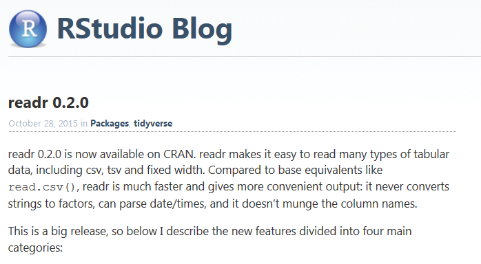

# Datenimport
Jan-Philipp Kolb  
8 Mai 2017  


## Dateiformate in R

-  Von R werden quelloffene, nicht-proprietäre Formate bevorzugt
-  Es können aber auch Formate von anderen Statistik Software Paketen eingelesen werden
-  R-user speichern Objekte gerne in sog. Workspaces ab
-  Auch hier jedoch gilt: (fast) alles andere ist möglich

## Formate - base package

R unterstützt von Haus aus schon einige wichtige Formate:
		
-  CSV (Comma Separated Values): `read.csv()`
-  FWF (Fixed With Format): `read.fwf()`
-  Tab-getrennte Werte: `read.delim()`


## Datenimport leicht gemacht mit Rstudio


## CSV aus dem Web einladen

- Datensatz:

<https://data.montgomerycountymd.gov/api/views/6rqk-pdub/rows.csv?accessType=DOWNLOAD>

- [Datenimport mit Rstudio](https://support.rstudio.com/hc/en-us/articles/218611977-Importing-Data-with-RStudio)


## Der Arbeitsspeicher

So findet man heraus, in welchem Verzeichnis man sich gerade befindet


```r
getwd()
```

So kann man das Arbeitsverzeichnis ändern:

Man erzeugt ein Objekt in dem man den Pfad abspeichert:


```r
main.path <- "C:/" # Beispiel für Windows
main.path <- "/users/Name/" # Beispiel für Mac
main.path <- "/home/user/" # Beispiel für Linux
```

Und ändert dann den Pfad mit setwd()


```r
setwd(main.path)
```

Bei Windows ist es wichtig Slashs anstelle von Backslashs zu verwenden.

## Alternative - Arbeitsspeicher


## Das Paket `readr`


```r
install.packages("readr")
```


```r
library(readr)
```

- [`readr` auf dem Rstudio Blogg](https://blog.rstudio.org/2015/10/28/readr-0-2-0/)




## Import von Excel-Daten

-  `library(readr)` ist für den Import von fremden Datenformaten hilfreich
-  Wenn Excel-Daten vorliegen - als .csv abspeichern
- Diese lassen sich auch ohne das Paket `foreign` einlesen.


```r
library(readr)
rows <- read_csv("https://data.montgomerycountymd.gov/api/views/6rqk-pdub/rows.csv?accessType=DOWNLOAD")
```


## `.csv`-Daten aus dem Web importieren - zweites Beispiel


```r
url <- "https://raw.githubusercontent.com/Japhilko/GeoData/master/2015/data/whcSites.csv"

whcSites <- read_csv(url) 
```

```
## Warning: Missing column names filled in: 'X1' [1]
```

```
## Parsed with column specification:
## cols(
##   .default = col_character(),
##   X1 = col_integer(),
##   unique_number = col_integer(),
##   id_no = col_integer(),
##   date_inscribed = col_integer(),
##   longitude = col_double(),
##   latitude = col_double(),
##   area_hectares = col_double(),
##   C1 = col_integer(),
##   C2 = col_integer(),
##   C3 = col_integer(),
##   C4 = col_integer(),
##   C5 = col_integer(),
##   C6 = col_integer(),
##   N7 = col_integer(),
##   N8 = col_integer(),
##   N9 = col_integer(),
##   N10 = col_integer(),
##   transboundary = col_integer()
## )
```

```
## See spec(...) for full column specifications.
```


```r
head(whcSites)
```

```
## # A tibble: 6 × 36
##      X1 unique_number id_no rev_bis
##   <int>         <int> <int>   <chr>
## 1     1           230   208     Rev
## 2     2           234   211     Rev
## 3     3          1590   569     Bis
## 4     4          1563   570     ter
## 5     5           111   102    <NA>
## 6     6           209   188    <NA>
## # ... with 32 more variables: name_en <chr>, name_fr <chr>,
## #   short_description_en <chr>, short_description_fr <chr>,
## #   justification_en <chr>, justification_fr <chr>, date_inscribed <int>,
## #   secondary_dates <chr>, danger_list <chr>, longitude <dbl>,
## #   latitude <dbl>, area_hectares <dbl>, C1 <int>, C2 <int>, C3 <int>,
## #   C4 <int>, C5 <int>, C6 <int>, N7 <int>, N8 <int>, N9 <int>, N10 <int>,
## #   criteria_txt <chr>, category <chr>, category_short <chr>,
## #   states_name_en <chr>, states_name_fr <chr>, name_en.1 <chr>,
## #   name_fr.1 <chr>, iso_code <chr>, udnp_code <chr>, transboundary <int>
```

## Das Paket `haven`


```r
install.packages("haven")
```


```r
library(haven)
```

- [`haven`auf dem Rstudio Blogg](https://blog.rstudio.org/2016/10/04/haven-1-0-0/)


## SPSS Dateien einlesen

- Zunächst muss wieder der Pfad zum Arbeitsverzeichnis angeben werden.
- SPSS-Dateien können auch direkt aus dem Internet geladen werden:


```r
install.packages("haven")
```


```r
library(haven)
mtcars <- read_sav("https://github.com/Japhilko/RInterfaces/raw/master/data/mtcars.sav")
```

## stata Dateien einlesen


```r
library(haven)
oecd <- read_dta("https://github.com/Japhilko/IntroR/raw/master/2017/data/oecd.dta")
```


## Links

- [Quick-R - Import Data](http://www.statmethods.net/input/importingdata.html)

- [Datenimport bei R-bloggers](https://www.r-bloggers.com/importing-data-into-r-part-ii/)

- [Importing Data into R](https://thepracticalr.wordpress.com/2016/09/23/importing-data-into-r/)

- [Mapping von Arbeitslosendaten in den USA](https://www.r-bloggers.com/mapping-unemployment-data-2016/)

- [Das Paket readr](https://www.r-bloggers.com/readrproblems-returns-tidy-data/)
