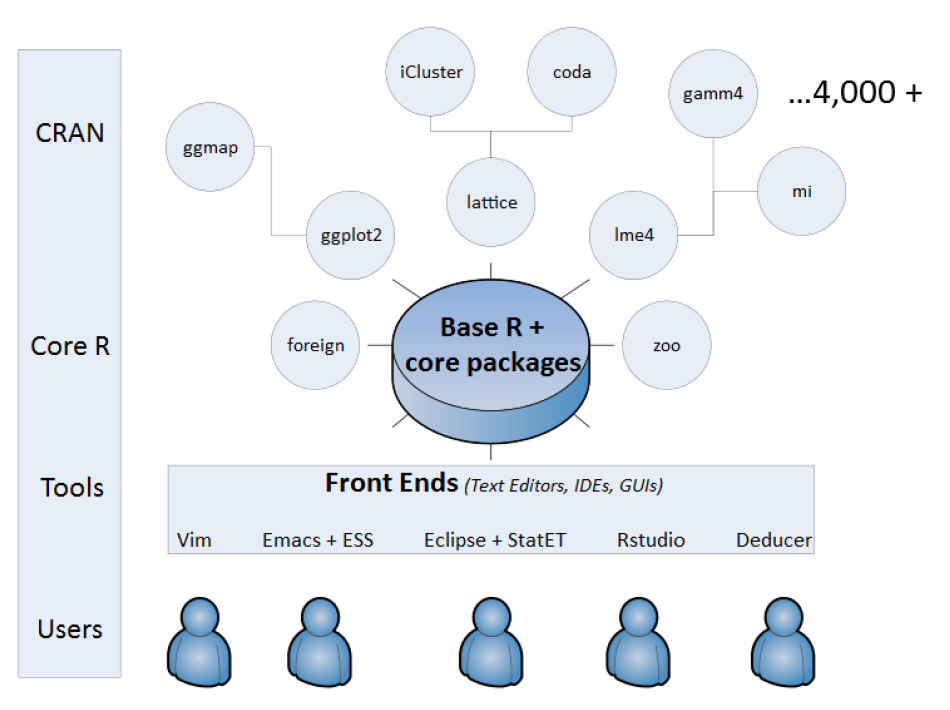

```{r setup, include=FALSE}
knitr::opts_chunk$set(echo = FALSE)
```

## Warum R




## Nachteile von R

1. Daten werden oft anderswo erfasst
2. Nicht jeder ist bereit mit R zu arbeiten 
3. R ist manchmal zu langsam
4. Nicht auf jedem Rechner ist R installiert


## Was folgt daraus

1. Schnittstelle zu SPSS/Stata/Excel zum Import von Daten
2. Schnittstelle zu Word


## Die Nutzung von Schnittstellen beim Import

- Interaktion mit SPSS, Stata


## Darstellung von Ergebnissen


## Was ist unter reproduzierbaren Forschungsergebnissen zu verstehen?


## [Schnittstellen zu Javascript](https://github.com/FrissAnalytics/shinyJsTutorials)

- [shiny Javascript Tutorial](https://www.r-bloggers.com/shiny-javascript-tutorials/)

```{r}

```

## [Warum die Schnittstelle zu C?](http://dirk.eddelbuettel.com/papers/rcpp_workshop_introduction_user2012.pdf)


