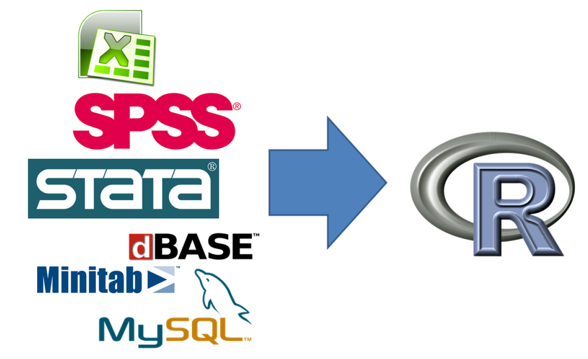

```{r setup, include=FALSE}
knitr::opts_chunk$set(echo = FALSE)
```

# Warum R?

## Gründe für die Nutzung von R

- Als Weg kreativ zu sein ...
- Graphiken, Graphiken, Graphiken
- In Kombination mit anderen Programmen nutzbar
- Zur Verbindung von Datenstrukturen
- Zum Automatisieren
- Um die Intelligenz anderer Leute zu nutzen ;-)
- ...


## Warum R?


## Gründe

- R ist [frei verfügbar](http://www.inside-r.org/why-use-r). Es kann umsonst [runtergeladen](http://mirrors.softliste.de/cran/) werden.

- R ist eine Skriptsprache 
- Gute Möglichkeiten für die [Visualisierung](http://research.stowers-institute.org/efg/R/) ([Link](http://www.sr.bham.ac.uk/~ajrs/R/r-gallery.html) )

- R wird immer [populärer](https://twitter.com/josiahjdavis/status/559778930476220418)

- [Popularität von R](http://blog.revolutionanalytics.com/popularity/)

## Übersicht - warum R


## Nachteile von R

1. Daten werden oft anderswo erfasst
2. Nicht jeder ist bereit mit R zu arbeiten 
3. Nicht auf jedem Rechner ist R installiert
4. R ist manchmal zu langsam
5. Schwierigkeiten bei der Arbeit mit großen Datenmengen

## Was folgt daraus

1. Schnittstelle zu SPSS/Stata/Excel zum Import von Daten
2. Schnittstelle zu Word
3. Möglichkeit HTML Präsentationen zu erzeugen
4. Nutzung von C++
5. Nutzung von Datenbanken

# Warum die Nutzung von Schnittstellen?

## Die Nutzung von Schnittstellen beim Import/Export

- Interaktion mit SPSS, Stata



## [Reproducible Research](http://www.statsmakemecry.com/smmctheblog/the-time-for-reproducible-research-is-now)


## [Was wird bei Wikipedia unter Reproduibility verstanden?](https://en.wikipedia.org/wiki/Reproducibility)


## Darstellung von Ergebnissen

- Mit der Schnittstelle zu Javascript lassen sich interaktive Graphiken erzeugen
- Diese kann man auf Websites, in Präsentationen oder in Dashboards verwenden


## [Warum die Schnittstelle zu C++?](http://dirk.eddelbuettel.com/papers/rcpp_workshop_introduction_user2012.pdf)

- [Wenn Schnelligkeit wichtig ist, bietet sich C++ an](http://www.stat.berkeley.edu/scf/paciorek-cppWorkshop.pdf)
- [Dies ist kann bspw. der Fall sein, wenn sich Schleifen nicht vermeiden lassen](https://www.r-bloggers.com/calling-c-from-r-using-rcpp/)
- [Man wird bei der Programmierung durch RStudio unterstützt](https://support.rstudio.com/hc/en-us/articles/200486088-Using-Rcpp-with-RStudio)
- Es gibt eine [Rcpp Galerie](http://gallery.rcpp.org/), wo man sich Anregungen holen kann

## Die Nutzung von Datenbanken

- Wenn große Datenmengen anfallen, kann die zusätzliche Nutzung von Datenbanken sinnvoll sein
- In R bestehen Schnittstellen sowohl zu relationalen als auch nicht relationalen Datenbanken

# Nutzung der Unterlagen auf GitHub

## Wie wird das Github Verzeichnis genutzt
