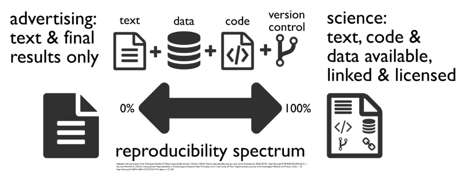

```{r setup, include=FALSE}
knitr::opts_chunk$set(echo = FALSE)
```

## Warum R?


## Nachteile von R

1. Daten werden oft anderswo erfasst
2. Nicht jeder ist bereit mit R zu arbeiten 
3. R ist manchmal zu langsam
4. Nicht auf jedem Rechner ist R installiert


## Was folgt daraus

1. Schnittstelle zu SPSS/Stata/Excel zum Import von Daten
2. Schnittstelle zu Word
3. Nutzung von C++

## Die Nutzung von Schnittstellen beim Import

- Interaktion mit SPSS, Stata


## [Reproducible Research](http://www.statsmakemecry.com/smmctheblog/the-time-for-reproducible-research-is-now)


## [Was wird bei Wikipedia unter Reproduibility verstanden?](https://en.wikipedia.org/wiki/Reproducibility)




## Darstellung von Ergebnissen

- Mit der Schnittstelle zu Javascript lassen sich interaktive Graphiken erzeugen
- Diese kann man auf Websites, in Präsentationen oder in Dashboards verwenden


## Was ist unter reproduzierbaren Forschungsergebnissen zu verstehen?


## [Schnittstellen zu Javascript](https://github.com/FrissAnalytics/shinyJsTutorials)

- [shiny Javascript Tutorial](https://www.r-bloggers.com/shiny-javascript-tutorials/)

```{r}

```

## [Warum die Schnittstelle zu C?](http://dirk.eddelbuettel.com/papers/rcpp_workshop_introduction_user2012.pdf)

## [Was ist CSS?](https://de.wikipedia.org/wiki/Cascading_Style_Sheets)


- Stylesheet-Sprache für elektronische Dokumente
- eine der Kernsprachen des World Wide Webs.
- CSS wurde entworfen, um Darstellungsvorgaben weitgehend von den Inhalten zu trennen

# Nutzung

## Wie wird das Github Verzeichnis genutzt
