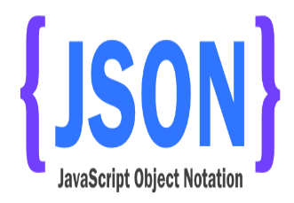

```{r, include=FALSE}
knitr::opts_chunk$set(echo = TRUE)
```

## [Was sind API's?](https://de.wikipedia.org/wiki/Programmierschnittstelle)


## [Programmierschnittstellen](http://www.gruenderszene.de/lexikon/begriffe/application-programming-interface-api)

- Relevanz hat der Begriff der API vor allem durch seine Verwendung von Webdiensten erhalten.
- APIs dienen also zum Austausch und der Weiterverarbeitung von Daten und Inhalten zwischen verschiedenen Webseiten, Programmen und Content-Anbietern.


## Bedeutung

- es ist unter anderem möglich Daten von Programmierschnittstellen zu beziehen
- diese Daten sind allerdings nicht als `.xlsx`, `.csv`, `.dta` oder ähnliches abgespeichert sondern in einem der folgenden Formate: `.json`, `.xml` etc.


## JavaScript Object Notation


<!--


-->

## [GeoJSON](http://cannoneyed.github.io/geojson/)


## [OpenStreetMap Daten](https://rstudio.github.io/leaflet/json.html)

