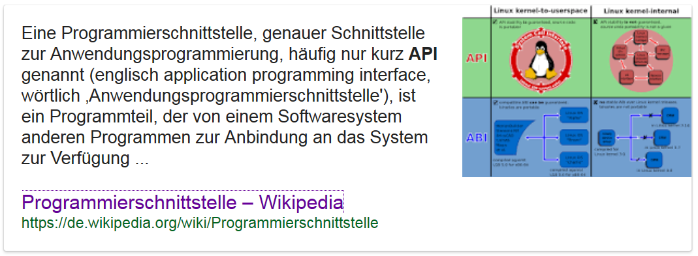
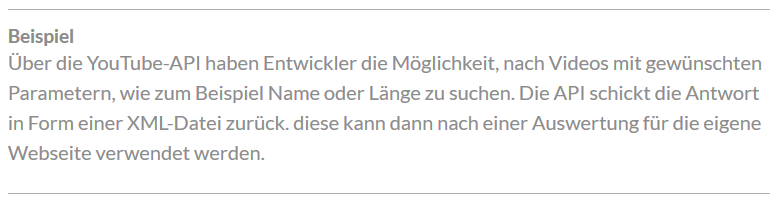
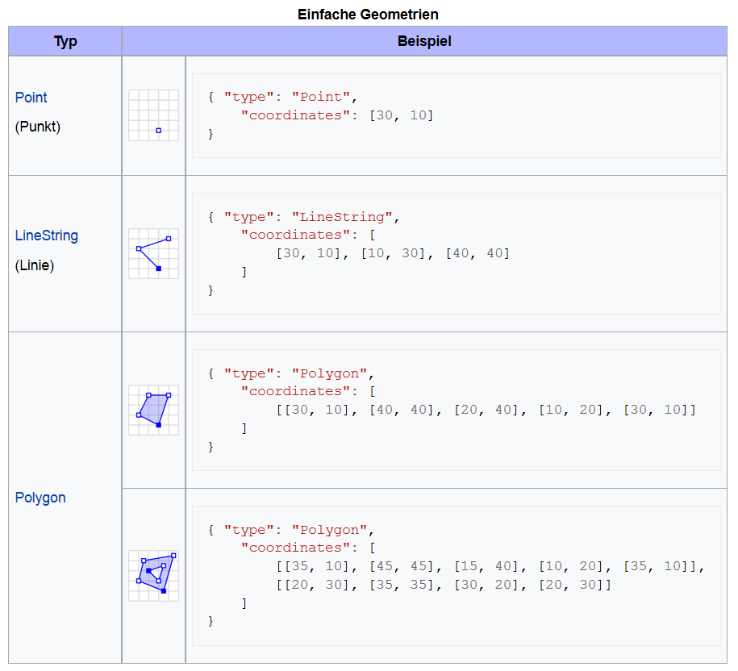

```{r, include=FALSE}
knitr::opts_chunk$set(echo = TRUE)
```

## [Was sind API's?](https://de.wikipedia.org/wiki/Programmierschnittstelle)



## [Programmierschnittstellen](http://www.gruenderszene.de/lexikon/begriffe/application-programming-interface-api)

- Relevanz hat der Begriff der API vor allem durch seine Verwendung von Webdiensten erhalten.
- APIs dienen also zum Austausch und der Weiterverarbeitung von Daten und Inhalten zwischen verschiedenen Webseiten, Programmen und Content-Anbietern.



## Bedeutung

- es ist unter anderem möglich Daten von Programmierschnittstellen zu beziehen
- diese Daten sind allerdings nicht als `.xlsx`, `.csv`, `.dta` oder ähnliches abgespeichert sondern in einem der folgenden Formate: `.json`, `.xml` etc.


## JavaScript Object Notation


<!--


-->

## Das GeoJSON Format

- GeoJSON ist ein offenes Format um geografische Daten nach der Simple-Feature-Access-Spezifikation zu repräsentieren. 
- Dafür wird die JavaScript Object Notation verwendet.

Die Struktur der Daten kann man sich mit einem [JSON Viewer anschauen](http://jsonviewer.stack.hu/)


## [GeoJSON](http://cannoneyed.github.io/geojson/)


- [GeoJSON](https://de.wikipedia.org/wiki/GeoJSON) ist ein offenes Format um geografische Daten nach der Simple-Feature-Access-Spezifikation zu repräsentieren.
- [Simple Feature Access](https://de.wikipedia.org/wiki/Simple_Feature_Access) ist eine Spezifikation des Open Geospatial Consortium, welche eine allgemein gültige Architektur für geografische Daten und deren Geometrien definiert.
- Die Spezifikation beschreibt einerseits die Speicherung und den Zugriff auf Geometrien und andererseits verschiedene räumliche Operatoren.

## [OpenStreetMap Daten](https://rstudio.github.io/leaflet/json.html)


## [Beispiele für GeoJSON](https://de.wikipedia.org/wiki/GeoJSON)


