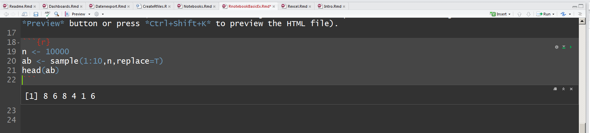
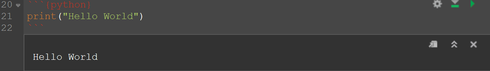
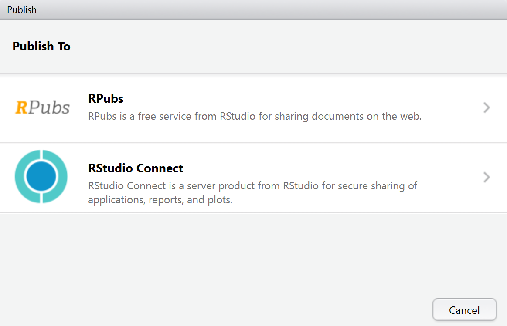

```{r setup, include=FALSE}
knitr::opts_chunk$set(echo = TRUE)
```

## Notebooks

- [Warum R Notebook nutzen](https://news.ycombinator.com/item?id=12683625)

# Rnotebooks

## Ein Rnotebook anlegen


## Rnotebook - erste Schritte

- Es lassen sich so genannte Chunks einfügen
- In diesen Chunks wird ganz normaler R-code geschrieben




## Python Code integrieren

- Ebenso lässt sich [Python code implementieren](https://support.rstudio.com/hc/en-us/articles/233066128-Do-Notebooks-support-other-languages-)




```{python}
import sys
print(sys.version)
```

## Datenaustausch mittels `feather`

```{r,eval=F}
install.packages("feather")
```

## Das Paket `feather`

```{python,eval=F}
import pandas
import feather

# Read flights data and select flights to O'Hare
flights = pandas.read_csv("flights.csv")
flights = flights[flights['dest'] == "ORD"]

# Select carrier and delay columns and drop rows with missing values
flights = flights[['carrier', 'dep_delay', 'arr_delay']]
flights = flights.dropna()
print flights.head(10)

# Write to feather file for reading from R
feather.write_dataframe(flights, "flights.feather")
```


## [LaTeX Code integieren](https://blog.rstudio.org/2016/10/05/r-notebooks/)

- LaTeX code wird mit zwei Dollarzeichen gekennzeichnet


## Notebook veröffentlichen


## Notebook veröffentlichen




## Links

- [knitr Language Engines](http://rmarkdown.rstudio.com/authoring_knitr_engines.html)

- [More engines](https://yihui.name/knitr/demo/engines/)

- [Andere Programmiersprachen einbinden](http://rmarkdown.rstudio.com/authoring_knitr_engines.html)

- [Video - Einführung in Rnotebook](https://www.rstudio.com/resources/webinars/introducing-notebooks-with-r-markdown/)

- [R Notebooks](http://rmarkdown.rstudio.com/r_notebooks.html)