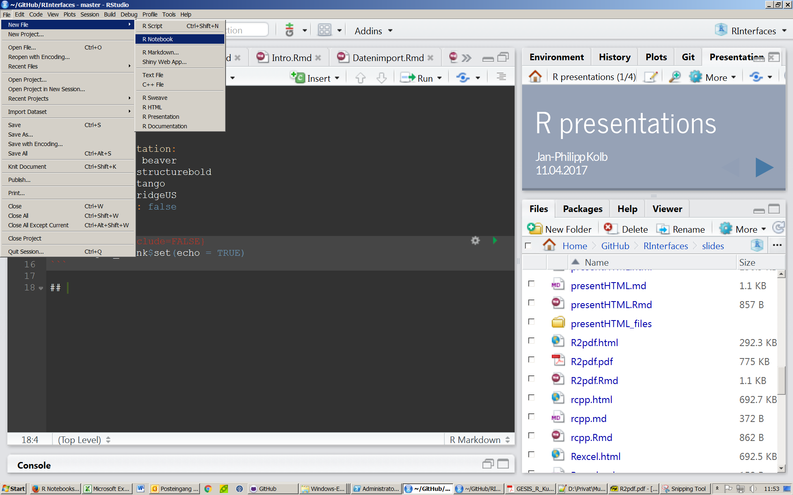
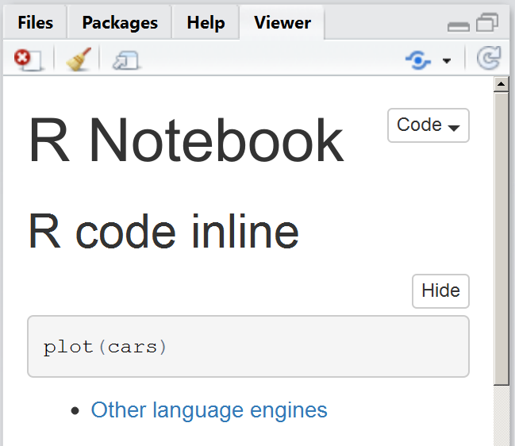
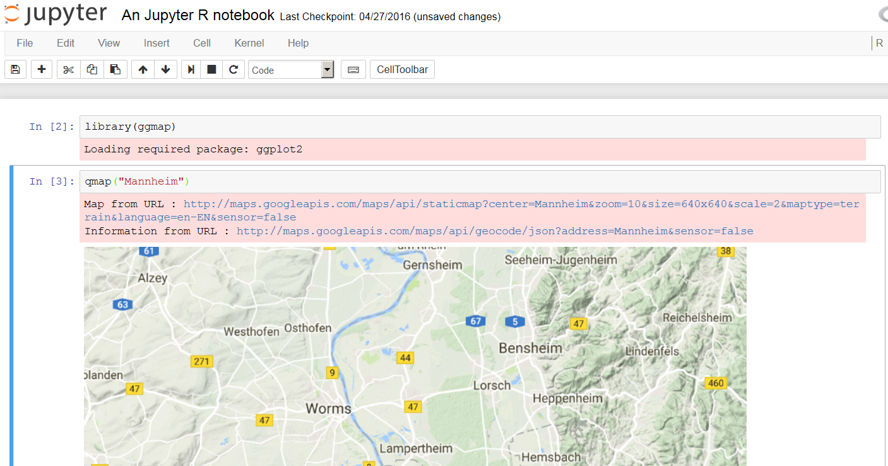
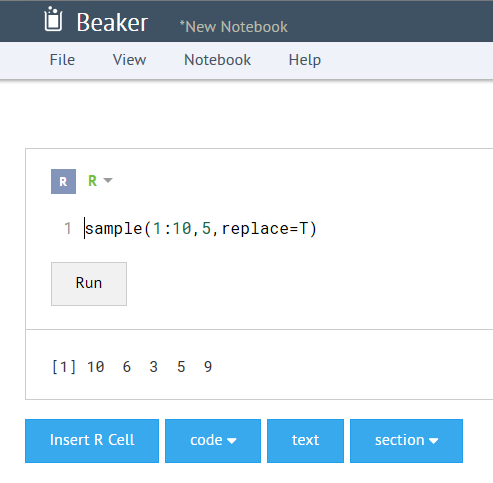

# Notebooks
Jan-Philipp Kolb  
8 Mai 2017  


## Notebooks

- [Warum R Notebook nutzen](https://news.ycombinator.com/item?id=12683625)


# Rnotebooks

## Ein Rnotebook anlegen



## Rnotebook - erste Schritte

- Es lassen sich so genannte Chunks einfügen
- In diesen Chunks wird ganz normaler R-code geschrieben


## Python Code integrieren

- Ebenso lässt sich [Python code implementieren](https://support.rstudio.com/hc/en-us/articles/233066128-Do-Notebooks-support-other-languages-)


```python
import sys
print(sys.version)
```

```
## 3.5.2 (v3.5.2:4def2a2901a5, Jun 25 2016, 22:01:18) [MSC v.1900 32 bit (Intel)]
```

## [LaTeX Code integieren](https://blog.rstudio.org/2016/10/05/r-notebooks/)

- LaTeX code wird mit zwei Dollarzeichen gekennzeichnet


## Notebook veröffentlichen I



## Notebook veröffentlichen II


# Andere Notebooks

## [Jupyter Notebook](http://jupyter.readthedocs.io/en/latest/install.html)


- Anaconda installieren
- folgenden Befehl in die Eingabeaufforderung eingeben
- Diese findet man bei windows wenn man cmd in Suche eingibt.

```
jupyter notebook
```
## Start Jupyter Notebook


## Beispiel Eingabe Code




# Beaker Notebook

## Beaker Notebook

- Auch bei Beaker kann man R-code einbauen


## Beaker starten

- [Beaker installieren](http://beakernotebook.com/getting-started) ...
- ... und mit `beaker.command.bat` starten




## Links

- [knitr Language Engines](http://rmarkdown.rstudio.com/authoring_knitr_engines.html)

- [More engines](https://yihui.name/knitr/demo/engines/)

- [Andere Programmiersprachen können eingebunden werden](http://rmarkdown.rstudio.com/authoring_knitr_engines.html)

- [Video - Einführung in Rnotebook](https://www.rstudio.com/resources/webinars/introducing-notebooks-with-r-markdown/)

- [R Notebooks](http://rmarkdown.rstudio.com/r_notebooks.html)

- [IPython vs knitr, or Python vs R](https://yihui.name/en/2012/11/ipython-vs-knitr/)
