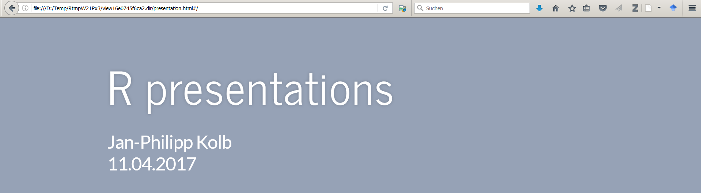
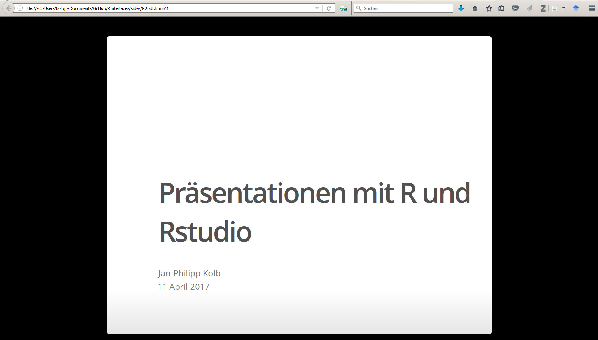
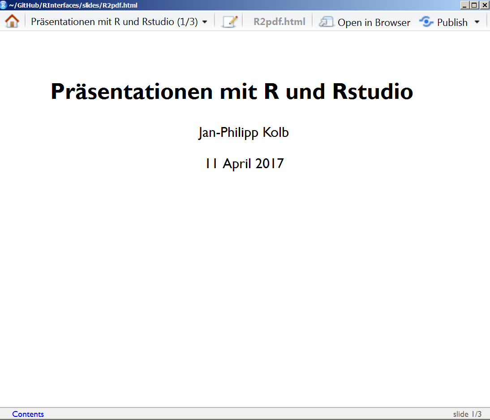

```{r setup, include=FALSE}
knitr::opts_chunk$set(echo = TRUE)
library(knitr)

```

## [Presentations with Rpres](https://rstudio-pubs-static.s3.amazonaws.com/27777_55697c3a476640caa0ad2099fe914ae5.html#/)



## ioslides presentations



- [Presentations with ioslides](http://rmarkdown.rstudio.com/ioslides_presentation_format.html)


## slidy presentations




## beamer presentations


## Beamer Options


## Beamer Themes


## Links

- [Keine Beschriftung der Graphiken](http://stackoverflow.com/questions/38514954/removing-figure-text-in-rmarkdown)