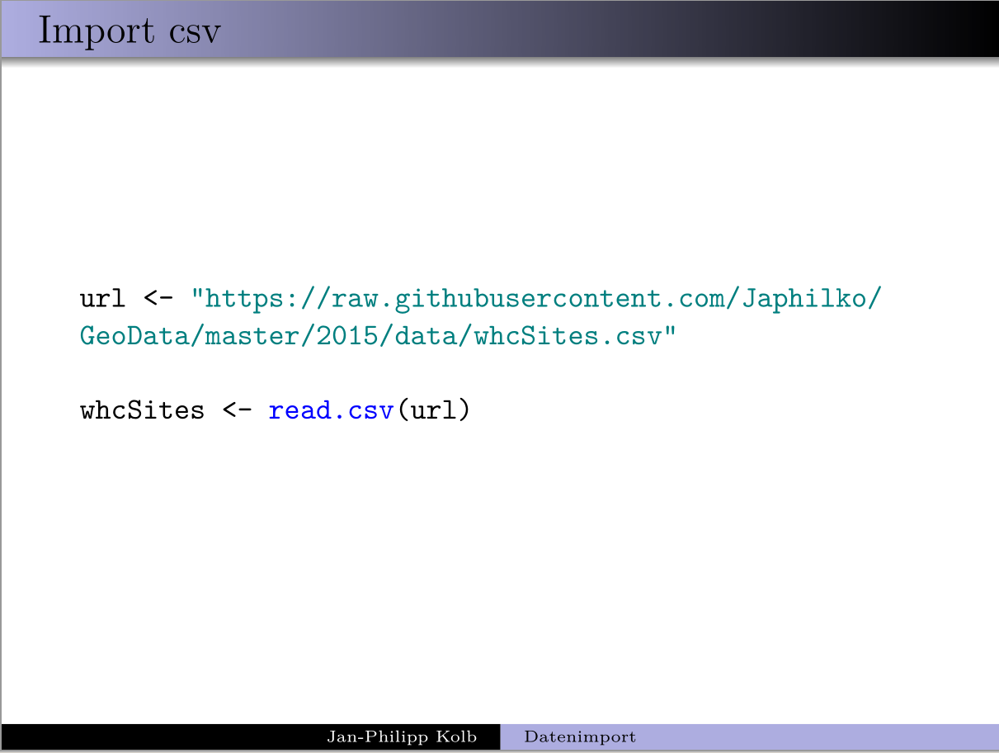
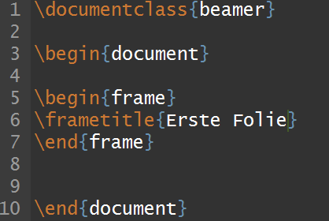
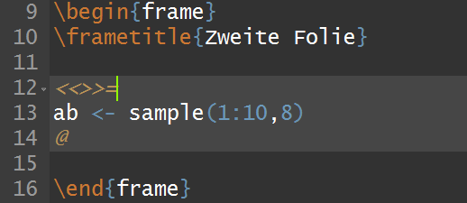

```{r setup, include=FALSE}
knitr::opts_chunk$set(echo = TRUE)
library(knitr)

```

# Präsentationen mit Rmarkdown

## beamer Präsentationen



## Beamer Optionen


## Beamer Themen


## Wie man das im Header des Dokuments angibt

```
---
title: "Intro - Erste Schritte"
author: "Jan-Philipp Kolb"
date: "10 April 2017"
output:
  beamer_presentation: 
    colortheme: beaver
    theme: CambridgeUS
---
```


## Inhaltsverzeichnis


## Optionen für die Graphikeinbindung

- *fig_caption: false*, wenn man keine Bildunterschriften haben möchte


## Referenzen für R-Pakete

```{r}
citation("knitr")
```


# Präsentationen mit Sweave

## Das Dokument erstellen


## Sweave Präsentation

- Ganz normaler LaTeX Code wird verwendet



## Chunks bei Sweave

- Auch hier kann R-code verwendet werden



## [Chunk Optionen](http://k-baeumchen.fuhlbrueck.net/R-und-LaTeX.html)

- Auch bei Sweave Chunks können Optionen mitgegeben werden


## Inline Code

```
\Sexpr{}.
```


## Links

- [optionen für Beamer Präsentationen](http://rmarkdown.rstudio.com/beamer_presentation_format.html)

- [Keine Beschriftung der Graphiken:](http://stackoverflow.com/questions/38514954/removing-figure-text-in-rmarkdown)

Oben im header muss Folgendes spezifiziert werden:

```
fig_caption: false
```


- [LaTeX](https://www.r-bloggers.com/from-openoffice-noob-to-control-freak-a-love-story-with-r-latex-and-knitr/)