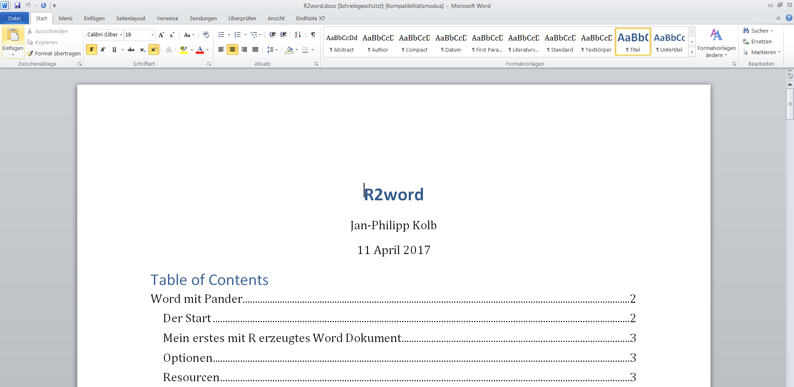

```{r setup, include=FALSE}
knitr::opts_chunk$set(echo = TRUE)
```

# Ein Markdown Dokument mit Rstudio erzeugen

## Der Start


## Mein erstes mit R erzeugtes Word Dokument


## Erstes Beispiel



# Das Arbeiten mit Markdown

## Rmarkdown - erste Schritte

Markdown ist eine sehr einfache Syntax, die es Benutzern erlaubt, aus einfachen Textdateien gut gelayoutete Dokumente zu erstellen.

```
**fettes Beispiel**
*kursives Beispiel*
~~durchgestrichen~~
- Aufzählungspunkt
```

**fettes Beispiel**

*kursives Beispiel*

~~durchgestrichen~~

- Aufzählungspunkt

## Weitere Markdown Befehle

```
### Überschrift Ebene 3
#### Überschrift Ebene 4
[Meine Github Seite](https://github.com/Japhilko)
```

### Überschrift Ebene 3

#### Überschrift Ebene 4

[Meine Github Seite](https://github.com/Japhilko)

## Weitere Markdown Befehle

```

```


## Chunks erste Schritte

- Es lassen sich so genannte Chunks einfügen
- In diesen Chunks wird ganz normaler R-code geschrieben


## Inline Code


```{r}
n=100
```

Ein inline Codeblock: `r n`

## Chunk Optionen

- [Man kann den Chunks Optionen mitgeben](https://yihui.name/knitr/options/)

```{r,echo=F}
library(knitr)
chunk_names <- c("eval","warining")
chunk_descr <- c("Soll Rcode evaluiert werden?","Sollen Warnings angezeigt werden?")
dat_chunks <- data.frame(Argument=chunk_names,Beschreibung=chunk_descr)
kable(dat_chunks)
```


## Optionen


## Resourcen

- Interview - [Ein Word Dokument mit wenig Aufwand schreiben](https://www.r-statistics.com/2013/03/write-ms-word-document-using-r-with-as-little-overhead-as-possible/)

- [pander: Ein R Pandoc Wrapper](http://rapporter.github.io/pander/)

- [Ein Schummelzettel](https://www.rstudio.com/wp-content/uploads/2015/06/rmarkdown-german.pdf)

- [Einführung in Markdown](https://github.com/ctreffe/r-space/wiki/R-Markdown-Intro)

- [Warum TeX besser als Word ist](http://factorgrad.blogspot.de/2010/07/why-latex-is-superior-to-ms-word.html)

- [LaTeX](https://www.r-bloggers.com/from-openoffice-noob-to-control-freak-a-love-story-with-r-latex-and-knitr/)