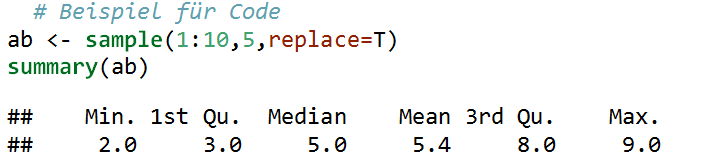

# Word Dokumente mit R und Rstudio erstellen
Jan-Philipp Kolb  
08 Mai 2017  


# Ein Markdown Dokument mit Rstudio erzeugen

## Der Start


## Mein erstes mit R erzeugtes Word Dokument


## Erstes Beispiel


# Das Arbeiten mit Markdown

## Rmarkdown - erste Schritte

Markdown ist eine sehr einfache Syntax, die es Benutzern erlaubt, aus einfachen Textdateien gut gelayoutete Dokumente zu erstellen.

```
**fettes Beispiel**
*kursives Beispiel*
~~durchgestrichen~~
- Aufzählungspunkt
```

**fettes Beispiel**

*kursives Beispiel*

~~durchgestrichen~~

- Aufzählungspunkt

## Weitere Markdown Befehle

```
### Überschrift Ebene 3
#### Überschrift Ebene 4
[Meine Github Seite](https://github.com/Japhilko)
```

### Überschrift Ebene 3

#### Überschrift Ebene 4

[Meine Github Seite](https://github.com/Japhilko)

## Weitere Markdown Befehle

- So kann man Bilder einbinden:
- Man kann entweder einen Link angeben:

```

```

- oder einen (Unterordner) in dem das Bild liegt:

```

```

- in den eckigen Klammern steht die Bildunterschrift
- alle gängigen Formate (.png, .jpeg,.gif) können so eingebunden werden
- Man kann auch noch weitere Optionen spezifizieren (Größe, Breite etc.) - dazu später mehr

## Chunks - Erste Schritte

- Es lassen sich so genannte Chunks einfügen
- In diesen Chunks wird ganz normaler R-code geschrieben


## Button um Chunks einzufügen

- Die default Version eines Chunks ist R
- Man hat aber auch die Möglichkeit andere Programmiersprachen einzubinden


## Inline Code


```r
n=100
```

Ein inline Codeblock: 100

## Chunk Optionen

- [Man kann den Chunks Optionen mitgeben:](https://yihui.name/knitr/options/)


Argument   Beschreibung                        
---------  ------------------------------------
eval       Soll Rcode evaluiert werden?        
warning    Sollen Warnings angezeigt werden?   
cache      Soll der Output gespeichert werden? 

- Bei eval kann ein logischer Wert angegeben werden oder eine/mehrere Nummer(n)  


## Optionen


## Optionen für Word Output


## Code Hervorhebung

- pygments Hervorhebung




- tango


## Das Paket `knitr`


```r
install.packages("knitr")
```


```r
library("knitr")
```

- Das Paket knitr enthält zahlreiche wichtige Funktionen
- Beispiel: Befehl `kable` um Tabellen zu erzeugen

## Eine Tabelle mit `kable` erzeugen


```r
a <- runif(10)
b <- rnorm(10)
ab <- cbind(a,b)
kable(ab)
```

         a            b
----------  -----------
 0.1061843   -2.0059615
 0.3342730    1.1832309
 0.2655926    0.0968433
 0.8611333    0.8225426
 0.7360256   -0.3359971
 0.7494480    0.3347100
 0.5286680   -0.0496741
 0.3156101    0.1571316
 0.1817877   -0.1840199
 0.4846891   -0.6741750

## [Vorlagen verwenden](http://rmarkdown.rstudio.com/articles_docx.html)

- Formatvorlagen können verändert werden

1. Ein Word Dokument mit Rmarkdown erstellen
2. Das Dokument in Word öffnen und Format verändern 
3. Vorlage als Referenz angeben


## Resourcen

- Interview - [Ein Word Dokument mit wenig Aufwand schreiben](https://www.r-statistics.com/2013/03/write-ms-word-document-using-r-with-as-little-overhead-as-possible/)

- [pander: Ein R Pandoc Wrapper](http://rapporter.github.io/pander/)

- [Ein Schummelzettel](https://www.rstudio.com/wp-content/uploads/2015/06/rmarkdown-german.pdf)

- [Einführung in Markdown](https://github.com/ctreffe/r-space/wiki/R-Markdown-Intro)

- [Warum TeX besser als Word ist](http://factorgrad.blogspot.de/2010/07/why-latex-is-superior-to-ms-word.html)
