# R Schnittstellen
Jan-Philipp Kolb  
28 April 2017  


# Einführung und Motivation


## Pluspunkte von R

- Als Weg kreativ zu sein ...
- Graphiken, Graphiken, Graphiken
- In Kombination mit anderen Programmen nutzbar
- Zur Verbindung von Datenstrukturen
- Zum Automatisieren
- Um die Intelligenz anderer Leute zu nutzen ;-)
- ...


## Warum R?


## Gründe

- R ist [frei verfügbar](http://www.inside-r.org/why-use-r). Es kann umsonst [runtergeladen](http://mirrors.softliste.de/cran/) werden.

- R ist eine Skriptsprache 
- Gute Möglichkeiten für die [Visualisierung](http://research.stowers-institute.org/efg/R/) ([Link](http://www.sr.bham.ac.uk/~ajrs/R/r-gallery.html) )

- R wird immer [populärer](https://twitter.com/josiahjdavis/status/559778930476220418)

- [Popularität von R](http://blog.revolutionanalytics.com/popularity/)

## Übersicht - warum R


## Nachteile von R

1. Daten werden oft anderswo erfasst
2. Nicht jeder ist bereit mit R zu arbeiten 
3. Nicht auf jedem Rechner ist R installiert
4. R ist manchmal zu langsam
5. Schwierigkeiten bei der Arbeit mit großen Datenmengen

## Was folgt daraus

1. Schnittstelle zu SPSS/Stata/Excel zum Import von Daten
2. Schnittstelle zu Word
3. Möglichkeit HTML Präsentationen zu erzeugen
4. Nutzung von C++
5. Nutzung von Datenbanken

# Warum die Nutzung von Schnittstellen?

## Die Nutzung von Schnittstellen beim Import/Export

- Interaktion mit Excel, SPSS, Stata, ...


## [Reproducible Research](http://www.statsmakemecry.com/smmctheblog/the-time-for-reproducible-research-is-now)


## [Was wird bei Wikipedia unter Reproducability verstanden?](https://en.wikipedia.org/wiki/Reproducibility)


## Darstellung von Ergebnissen

- Mit der Schnittstelle zu Javascript lassen sich interaktive Graphiken erzeugen
- Diese kann man auf Websites, in Präsentationen oder in Dashboards verwenden


## [Warum die Schnittstelle zu C++?](http://dirk.eddelbuettel.com/papers/rcpp_workshop_introduction_user2012.pdf)

- [Wenn Schnelligkeit wichtig ist, bietet sich C++ an](http://www.stat.berkeley.edu/scf/paciorek-cppWorkshop.pdf)
- [Dies ist kann bspw. der Fall sein, wenn sich Schleifen nicht vermeiden lassen](https://www.r-bloggers.com/calling-c-from-r-using-rcpp/)
- [Man wird bei der Programmierung durch RStudio unterstützt](https://support.rstudio.com/hc/en-us/articles/200486088-Using-Rcpp-with-RStudio)
- Es gibt eine [Rcpp Galerie](http://gallery.rcpp.org/), wo man sich Anregungen holen kann

## Die Nutzung von Datenbanken

- Wenn große Datenmengen anfallen, kann die zusätzliche Nutzung von Datenbanken sinnvoll sein
- In R bestehen Schnittstellen sowohl zu relationalen als auch nicht relationalen Datenbanken

# Nutzung der Unterlagen auf GitHub

## Wie wird das Github Verzeichnis genutzt

-   Die folgende Seite ist die Startseite für den Kurs:

<https://github.com/Japhilko/RInterfaces>

- Es lohnt sich immer wieder zu dieser Seite zurückzukehren, weil hier alle relevanten Dokumente verlinkt sind.

- Grundsätzlich kann man der Veranstalung am Besten mit dem [kompletten File](https://github.com/Japhilko/RInterfaces/blob/master/slides/RInterfaces_all2g.md) folgen. Wenn Teile heruntergeladen werden sollen, bietet es sich an, das entsprechende pdf herunterzuladen.

## Informationen audrucken

-   Zum Ausdrucken eignen sich die pdf-Dateien besser. 

-   Diese können mit dem Raw Button heruntergeladen werden. 


## Weitere Dateien herunterladen

- Begleitend zu den Folien wird meistens auch ein R-File angeboten. 

- Hier können Sie entweder das gesamte R-File herunterladen und in R ausführen oder einzelne Befehle per Copy/Paste übernehmen.

- Vereinzelt sind auch Datensätze vorhanden. 

- `.csv` Dateien können direkt von R eingelesen werden (wie das geht werde ich noch zeigen).

- Wenn die `.csv` Dateien heruntergeladen werden sollen auch den Raw Button verwenden.

- Alle anderen Dateien (bspw. `.RData`) auch mittels Raw Button herunterladen.

## Organisatorisches


- Zusätzlich gibt es für jedes Kapitel eine Aufgabe, da man nur durch eigenes Trainieren auf der Lernkurve vorankommt.
- Die Quellen sind als Link meist in der Überschrift hinterlegt.
- Die Links sind nur im HTML Dokument zu sehen aber auch in der pdf vorhanden.

## Links und Quellen


Wen Github näher interessiert:

- [Hello World](https://guides.github.com/activities/hello-world/)

- [Understanding the GitHub flow](https://guides.github.com/introduction/flow/)


# Datenimport


## Dateiformate in R

-  Von R werden quelloffene, nicht-proprietäre Formate bevorzugt
-  Es können aber auch Formate von anderen Statistik Software Paketen eingelesen werden
-  R-user speichern Objekte gerne in sog. Workspaces ab
-  Auch hier jedoch gilt: (fast) alles andere ist möglich

## Formate - base package

R unterstützt von Haus aus schon einige wichtige Formate:
		
-  CSV (Comma Separated Values): `read.csv()`
-  FWF (Fixed With Format): `read.fwf()`
-  Tab-getrennte Werte: `read.delim()`


## Datenimport leicht gemacht mit Rstudio


## CSV aus dem Web einladen

- Datensatz:

<https://data.montgomerycountymd.gov/api/views/6rqk-pdub/rows.csv?accessType=DOWNLOAD>

- [Datenimport mit Rstudio](https://support.rstudio.com/hc/en-us/articles/218611977-Importing-Data-with-RStudio)


## Der Arbeitsspeicher

So findet man heraus, in welchem Verzeichnis man sich gerade befindet


```r
getwd()
```

So kann man das Arbeitsverzeichnis ändern:

Man erzeugt ein Objekt in dem man den Pfad abspeichert:


```r
main.path <- "C:/" # Beispiel für Windows
main.path <- "/users/Name/" # Beispiel für Mac
main.path <- "/home/user/" # Beispiel für Linux
```

Und ändert dann den Pfad mit setwd()


```r
setwd(main.path)
```

Bei Windows ist es wichtig Slashs anstelle von Backslashs zu verwenden.

## Alternative - Arbeitsspeicher


## Import von Excel-Daten

-  `library(foreign)` ist für den Import von fremden Datenformaten hilfreich
-  Wenn Excel-Daten vorliegen - als .csv abspeichern
- Diese lassen sich auch ohne das Paket `foreign` einlesen.
-  Dann kann `read.csv()` genutzt werden um die Daten einzulesen.
- Bei Deutschen Daten kann es sein, dass man `read.csv2()` wegen der Komma-Separierung braucht.


```r
library(foreign)
?read.csv
?read.csv2
```

## CSV Dateien einlesen

Zunächst muss das Arbeitsverzeichnis gesetzt werden, in dem sich die Daten befinden:


```r
Dat <- read.csv("schuldaten_export.csv")
```

Wenn es sich um Deutsche Daten handelt:


```r
Dat <- read.csv2("schuldaten_export.csv")
```


## `.csv`-Daten aus dem Web importieren


```r
url <- "https://raw.githubusercontent.com/Japhilko/
GeoData/master/2015/data/whcSites.csv"

whcSites <- read.csv(url) 
```


```r
head(whcSites)
```

```
##   X unique_number id_no rev_bis
## 1 1           230   208     Rev
## 2 2           234   211     Rev
## 3 3          1590   569     Bis
## 4 4          1563   570     ter
## 5 5           111   102    <NA>
## 6 6           209   188    <NA>
##                                                               name_en
## 1 Cultural Landscape and Archaeological Remains of the Bamiyan Valley
## 2                           Minaret and Archaeological Remains of Jam
## 3                          Historic Centres of Berat and Gjirokastra 
## 4                                                             Butrint
## 5                                             Al Qal'a of Beni Hammad
## 6                                                        M'Zab Valley
##                                                                 name_fr
## 1 Paysage culturel et vestiges archéologiques de la vallée de Bamiyan
## 2                           Minaret et vestiges archéologiques de Djam
## 3                       Centres historiques de Berat et de Gjirokastra 
## 4                                                               Butrint
## 5                                            La Kalâa des Béni Hammad
## 6                                                      Vallée du M'Zab
##                                                                                                                                                                                                                                                                                                                                                                                                                                                                                                                                                                                                                                                                                                                                                                                                                                short_description_en
## 1                                                                                                                                                                                                                                                                           <p>The cultural landscape and archaeological remains of the Bamiyan Valley represent the artistic and religious developments which from the 1st to the 13th centuries characterized ancient Bakhtria, integrating various cultural influences into the Gandhara school of Buddhist art. The area contains numerous Buddhist monastic ensembles and sanctuaries, as well as fortified edifices from the Islamic period. The site is also testimony to the tragic destruction by the Taliban of the two standing Buddha statues, which shook the world in March 2001.</p>
## 2                                                                                                                                                                                                                                                                                                                                                                 <p>The 65m-tall Minaret of Jam is a graceful, soaring structure, dating back to the 12th century. Covered in elaborate brickwork with a blue tile inscription at the top, it is noteworthy for the quality of its architecture and decoration, which represent the culmination of an architectural and artistic tradition in this region. Its impact is heightened by its dramatic setting, a deep river valley between towering mountains in the heart of the Ghur province.</p>
## 3 <p>Berat and Gjirokastra are inscribed as rare examples of an architectural character typical of the Ottoman period. Located in central Albania, Berat bears witness to the coexistence of various religious and cultural communities down the centuries. It features a castle, locally known as the Kala, most of which was built in the 13th century, although its origins date back to the 4th century BC. The citadel area numbers many Byzantine churches, mainly from the 13th century, as well as several mosques built under the Ottoman era which&nbsp;began&nbsp;in 1417. Gjirokastra, in the Drinos river valley in southern Albania, features a series of outstanding two-story&nbsp;houses which were developed in the 17th century. The town also retains a bazaar, an 18th-century mosque and two churches of the same period.</p>
## 4                                                                                                                                                                                                                                                                                                                                                                                                               <p>Inhabited since prehistoric times, Butrint has been the site of a Greek colony, a Roman city and a bishopric. Following a period of prosperity under Byzantine administration, then a brief occupation by the Venetians, the city was abandoned in the late Middle Ages after marshes formed in the area. The present archaeological site is a repository of ruins representing each period in the city&rsquo;s development.</p>
## 5                                                                                                                                                                                                                                                                                                                                                                                                                                                                                                                                       <p>In a mountainous site of extraordinary beauty, the ruins of the first capital of the Hammadid emirs, founded in 1007 and demolished in 1152, provide an authentic picture of a fortified Muslim city. The mosque, whose prayer room has 13 aisles with eight bays, is one of the largest in Algeria.</p>
## 6                                                                                                                                                                                                                                                                                                                                                                                                           <p>A traditional human habitat, created in the 10th century by the Ibadites around their five <em>ksour</em> (fortified cities), has been preserved intact in the M&rsquo;Zab valley. Simple, functional and perfectly adapted to the environment, the architecture of M&rsquo;Zab was designed for community living, while respecting the structure of the family. It is a source of inspiration for today&rsquo;s urban planners.</p>
##                                                                                                                                                                                                                                                                                                                                                                                                                                                                                                                                                                                                                                                                                                                                                                                                                                                                                                                                                                                                                                                                                                                                      short_description_fr
## 1                                                                                                                                                                                                                                                                                                                                                                                                                                                        <p>Le paysage culturel et les vestiges arch&eacute;ologiques de la vall&eacute;e de Bamiyan illustrent les d&eacute;veloppements artistiques et religieux qui, du Ier au XIIIe si&egrave;cle, ont caract&eacute;ris&eacute; l&rsquo;ancienne Bactriane, int&eacute;grant diverses influences culturelles pour former l&rsquo;&eacute;cole d&rsquo;art bouddhique du Gandhara. Le site contient plusieurs ensembles monastiques et sanctuaires bouddhistes, ainsi que des &eacute;difices fortifi&eacute;s de la p&eacute;riode islamique. Il t&eacute;moigne &eacute;galement de la tragique destruction des deux bouddhas debout par les taliban, qui &eacute;branla le monde en mars 2001.</p>
## 2                                                                                                                                                                                                                                                                                                                                                                                                                                                                                                                                                                                           <p>Haut de 65m, le minaret de Djam est une construction gracieuse et élancée datant du XIIe siècle. Recouvert d’une décoration complexe en briques et portant une inscription de tuiles bleues au sommet, il est remarquable par la qualité de son architecture et de ses motifs décoratifs, qui représentent l’apogée d’une tradition artistique propre à cette région. Son impact est renforcé par un environnement spectaculaire : une vallée profonde qui s’ouvre entre d’imposantes montagnes au cœur de la province du Ghor.</p>
## 3 <p>Berat et Gjirokastra sont inscrites en tant que rares exemples d'un style architectural typique de la p&eacute;riode ottomane. Situ&eacute;e dans le centre de l'Albanie, Berat porte le t&eacute;moignage de la coexistence de diff&eacute;rentes communaut&eacute;s religieuses et culturelles au fil des si&egrave;cles. Elle comprend un ch&acirc;teau, localement appel&eacute; le Kala, dont la majeure partie fut construite au XIIIe si&egrave;cle, bien que ses origines remontent au IVe si&egrave;cle avant JC. Le quartier de la citadelle compte de nombreuses &eacute;glises byzantines, dont plusieurs du XIII&egrave;me si&egrave;cle, ainsi que plusieurs mosqu&eacute;es construites sous l'&egrave;re ottomane qui d&eacute;buta en 1417. Gjirokastra, dans la vall&eacute;e de la rivi&egrave;re Drinos au sud de l'Albanie, comprend une s&eacute;rie de remarquables maisons &agrave; deux &eacute;tages, qui se d&eacute;velopp&egrave;rent au XVIIe si&egrave;cle. La ville comprend &eacute;galement un bazar, une mosqu&eacute;e du XVIIIe si&egrave;cle ainsi que deux &eacute;glises de la m&ecirc;me &eacute;poque.</p>
## 4                                                                                                                                                                                                                                                                                                                                                                                                                                                            <p>Habit&eacute; depuis les temps pr&eacute;historiques, le site de Butrint fut successivement le si&egrave;ge d&rsquo;une colonie grecque, d&rsquo;une ville romaine, puis d&rsquo;un &eacute;v&ecirc;ch&eacute;. Apr&egrave;s une &eacute;poque de prosp&eacute;rit&eacute; sous l&rsquo;administration de Byzance, puis une br&egrave;ve occupation v&eacute;nitienne, la ville fut abandonn&eacute;e par sa population &agrave; la fin du Moyen &Acirc;ge &agrave; cause de la pr&eacute;sence de mar&eacute;cages voisins. Le site arch&eacute;ologique actuel est un conservatoire des ruines repr&eacute;sentatives de chaque p&eacute;riode du d&eacute;veloppement de la ville.</p>
## 5                                                                                                                                                                                                                                                                                                                                                                                                                                                                                                                                                                                                                                                                                                        <p>Dans un site montagneux d&rsquo;une saisissante beaut&eacute;, les ruines de la premi&egrave;re capitale des &eacute;mirs hammadides, fond&eacute;e en 1007 et d&eacute;mantel&eacute;e en 1152, nous restituent l&rsquo;image authentique d&rsquo;une ville musulmane fortifi&eacute;e. Sa mosqu&eacute;e, avec sa salle de pri&egrave;re de 13 nefs &agrave; 8 trav&eacute;es, est l&rsquo;une des plus grandes d&rsquo;Alg&eacute;rie.</p>
## 6                                                                                                                                                                                                                                                                                                                                                                                                                                                                                                                                                                                            <p>Le paysage de la vall&eacute;e du M&rsquo;Zab, cr&eacute;&eacute; au Xe si&egrave;cle par les Ibadites autour de leurs cinq <em>ksour</em>, ou villages fortifi&eacute;s, semble &ecirc;tre rest&eacute; intact. Simple, fonctionnelle et parfaitement adapt&eacute;e &agrave; l&rsquo;environnement, l&rsquo;architecture du M&rsquo;Zab a &eacute;t&eacute; con&ccedil;ue pour la vie en communaut&eacute;, tout en respectant les structures familiales. C&rsquo;est une source d&rsquo;inspiration pour les urbanistes d&rsquo;aujourd&rsquo;hui.</p>
##                                                                                                                                                                                                                                                                                                                                                                                                                                                                                                                                                                                                                                                                                                                                                                                                                                                                                                                                                                                                                                                                                                                                                                                                                                                                                               justification_en
## 1 <p><em>Criterion (i):</em> The Buddha statues and the cave art in Bamiyan Valley are an outstanding representation of the Gandharan school in Buddhist art in the Central Asian region.</p>\n\n\n<p><em>Criterion (ii)</em> : The artistic and architectural remains of Bamiyan Valley, and an important Buddhist centre on the Silk Road, are an exceptional testimony to the interchange of Indian, Hellenistic, Roman, Sasanian influences as the basis for the development of a particular artistic expression in the Gandharan school. To this can be added the Islamic influence in a later period.</p>\n\n\n<p><em>Criterion (iii):</em> The Bamiyan Valley bears an exceptional testimony to a cultural tradition in the Central Asian region, which has disappeared.</p>\n\n\n<p><em>Criterion (iv):</em> The Bamiyan Valley is an outstanding example of a cultural landscape which illustrates a significant period in Buddhism.</p>\n\n\n<p><em>Criterion (vi):</em> The Bamiyan Valley is the most monumental expression of the western Buddhism. It was an important centre of pilgrimage over many centuries. Due to their symbolic values, the monuments have suffered at different times of their existence, including the deliberate destruction in 2001, which shook the whole world.</p>
## 2                                                                                                                                                                                                                                                                                                                                                                                                                                                                                                                                                                                                                                <p><em>Criterion (ii):</em> The innovative architecture and decoration of the Minaret of Jam played a significant role in the development of the arts and architecture of the Indian sub-continent and beyond.</p>\n\n\n<p><em>Criterion (iii): </em>The Minaret of Jam and its associated archaeological remains constitute exceptional testimony to the power and quality of the Ghurid civilization that dominated its region in the 12th and 13th centuries.</p>\n\n\n<p><em>Criterion (iv): </em>The Minaret of Jam is an outstanding example of Islamic architecture and ornamentation in this region and played a significant role in their further dissemination.</p>
## 3                                                                                                                                                                                                                                                                                                                                                                                                                                                                                                                                                                                                                                                                                                                                                                                                                                                                                                                                                                                                                                                                                                                                                                                                                                                                                                         <NA>
## 4                                                                                                                                                                                                                                                                                                                                                                                                                                                                                                                                                                                                                                                                                                                                                                                                                                                                                                                                                                                                                                                                                                                                                                                                                                                                                                         <NA>
## 5                                                                                                                                                                                                                                                                                                                                                                                                                                                                                                                                                                                                                                                                                                                                                                                                                                                                                                                                                                                                                                                                                                                                                                                                                                                                                                         <NA>
## 6                                                                                                                                                                                                                                                                                                                                                                                                                                                                                                                                                                                                                                                                                                                                                                                                                                                                                                                                                                                                                                                                                                                                                                                                                                                                                                         <NA>
##                                                                                                                                                                                                                                                                                                                                                                                                                                                                                                                                                                                                                                                                                                                                                                                                                                                                                                                                                                                                                                                                                                                                                                                                                                                                                                                                                                                                                                                                                                                                                                                                                                       justification_fr
## 1 <p><em>Crit&egrave;re (i):</em> Les statues de Bouddha et l&rsquo;art rupestre de la vall&eacute;e de Bamyan sont une repr&eacute;sentation exceptionnelle de l&rsquo;&eacute;cole du Gandhara dans l&rsquo;art bouddhique de la r&eacute;gion d&rsquo;Asie centrale.</p>\n\n\n<p><em>Crit&egrave;re (ii):</em> Les vestiges artistiques et architecturaux de la vall&eacute;e de Bamyan, important centre bouddhiste sur la Route de la Soie, sont un t&eacute;moignage exceptionnel de l&rsquo;&eacute;change des influences indiennes, hell&eacute;nistiques, romaines et sassanides qui ont servi de fondations &agrave; une expression artistique particuli&egrave;re de l&rsquo;&eacute;cole du Gandhara. &Agrave; cela s&rsquo;ajoute une influence islamique ult&eacute;rieure.</p>\n\n\n<p><em>Crit&egrave;re (iii):</em> La vall&eacute;e de Bamyan est un t&eacute;moignage exceptionnel d&rsquo;une tradition culturelle d&rsquo;Asie centrale aujourd&rsquo;hui disparue.</p>\n\n\n<p><em>Crit&egrave;re (iv):</em> La vall&eacute;e de Bamyan est un exemple exceptionnel de paysage culturel illustrant une p&eacute;riode significative du bouddhisme.</p>\n\n\n<p><em>Crit&egrave;re (vi):</em> La vall&eacute;e de Bamyan est l&rsquo;expression monumentale la plus importante du Bouddhisme occidental. Ce fut un centre de p&egrave;lerinage essentiel sur plusieurs si&egrave;cles. Les monuments, en raison de leurs valeurs symboliques, ont souffert &agrave; diff&eacute;rentes p&eacute;riodes de leur histoire, notamment lors de la destruction d&eacute;lib&eacute;r&eacute;e de 2001, qui secoua le monde entier.</p>
## 2                                                                                                                                                                                                                                                                                                                                                                                                                                                                                                                                                                                                                                                                                                                                                                                                                                                                                                                                                            <p><em>Critère (ii)</em> : L'architecture et la décoration innovatrices du Minaret de Djam ont joué un rôle significatif dans le développement des arts et de l'architecture du sous-continent indien et au-delà.</p>\n\n\n<p><em>Critère (iii)</em> : Le minaret de Djam et ses vestiges archéologiques associés constituent un témoignage exceptionnel de la puissance et de la qualité de la civilisation ghoride qui domina cette région aux XIIe et XIIIe siècles.</p>\n\n\n<p><em>Critère (iv)</em> : Le minaret de Djam est un exemple exceptionnel de l’architecture et de l’ornementation islamiques dans la région et joua un rôle dans leur diffusion.</p>
## 3                                                                                                                                                                                                                                                                                                                                                                                                                                                                                                                                                                                                                                                                                                                                                                                                                                                                                                                                                                                                                                                                                                                                                                                                                                                                                                                                                                                                                                                                                                                                                                                                                                                 <NA>
## 4                                                                                                                                                                                                                                                                                                                                                                                                                                                                                                                                                                                                                                                                                                                                                                                                                                                                                                                                                                                                                                                                                                                                                                                                                                                                                                                                                                                                                                                                                                                                                                                                                                                 <NA>
## 5                                                                                                                                                                                                                                                                                                                                                                                                                                                                                                                                                                                                                                                                                                                                                                                                                                                                                                                                                                                                                                                                                                                                                                                                                                                                                                                                                                                                                                                                                                                                                                                                                                                 <NA>
## 6                                                                                                                                                                                                                                                                                                                                                                                                                                                                                                                                                                                                                                                                                                                                                                                                                                                                                                                                                                                                                                                                                                                                                                                                                                                                                                                                                                                                                                                                                                                                                                                                                                                 <NA>
##   date_inscribed secondary_dates danger_list longitude latitude
## 1           2003            <NA>      Y 2003  67.82525 34.84694
## 2           2002            <NA>      Y 2002  64.51606 34.39656
## 3           2005            2008        <NA>  20.13333 40.06944
## 4           1992            1999        <NA>  20.02611 39.75111
## 5           1980            <NA>        <NA>   4.78684 35.81844
## 6           1982            <NA>        <NA>   3.68333 32.48333
##   area_hectares C1 C2 C3 C4 C5 C6 N7 N8 N9 N10         criteria_txt
## 1      158.9265  1  1  1  1  0  1  0  0  0   0 (i)(ii)(iii)(iv)(vi)
## 2       70.0000  0  1  1  1  0  0  0  0  0   0        (ii)(iii)(iv)
## 3       58.9000  0  0  1  1  0  0  0  0  0   0            (iii)(iv)
## 4            NA  0  0  1  0  0  0  0  0  0   0                (iii)
## 5      150.0000  0  0  1  0  0  0  0  0  0   0                (iii)
## 6      665.0300  0  1  1  0  1  0  0  0  0   0         (ii)(iii)(v)
##   category category_short states_name_en states_name_fr
## 1 Cultural              C    Afghanistan    Afghanistan
## 2 Cultural              C    Afghanistan    Afghanistan
## 3 Cultural              C        Albania        Albanie
## 4 Cultural              C        Albania        Albanie
## 5 Cultural              C        Algeria       Algérie
## 6 Cultural              C        Algeria       Algérie
##                  name_en.1                   name_fr.1 iso_code udnp_code
## 1     Asia and the Pacific           Asie et pacifique       af       afg
## 2     Asia and the Pacific           Asie et pacifique       af       afg
## 3 Europe and North America Europe et Amérique du nord       al       alb
## 4 Europe and North America Europe et Amérique du nord       al       alb
## 5              Arab States               États arabes       dz       dza
## 6              Arab States               États arabes       dz       dza
##   transboundary
## 1             0
## 2             0
## 3             0
## 4             0
## 5             0
## 6             0
```


## SPSS Dateien einlesen

Dateien können auch direkt aus dem Internet geladen werden:


```r
link<- "http://www.statistik.at/web_de/static/
mz_2013_sds_-_datensatz_080469.sav"

?read.spss
Dat <- read.spss(link,to.data.frame=T)
```

## stata Dateien einlesen


```r
MZ02 <- read.dta("MZ02.dta")
```

- Einführung in Import mit R ([is.R](http://is-r.tumblr.com/post/37181850668/reading-writing-stata-dta-files-with-foreign))


## Links

- [Quick-R - Import Data](http://www.statmethods.net/input/importingdata.html)

- [Datenimport bei R-bloggers](https://www.r-bloggers.com/importing-data-into-r-part-ii/)

- [Importing Data into R](https://thepracticalr.wordpress.com/2016/09/23/importing-data-into-r/)

- [Mapping von Arbeitslosendaten in den USA](https://www.r-bloggers.com/mapping-unemployment-data-2016/)

- [Das Paket readr](https://www.r-bloggers.com/readrproblems-returns-tidy-data/)

# R und Excel


## Das Paket `xlsx`

- Eine wichtige Datenquelle - [Eurostat](http://appsso.eurostat.ec.europa.eu/nui/setupDownloads.do)


```r
library("xlsx")
dat <- read.xlsx("cult_emp_sex.xls",1)
```

## [Einige Schritte um R und Excel zu verbinden](http://www.milanor.net/blog/steps-connect-r-excel-xlconnect/)

- [Die Excel-Verbindung](https://www.r-bloggers.com/r-the-excel-connection/)


```r
install.packages("XLConnect")
```


```r
library("XLConnect")
```

](figure/XLconnect.PNG)

## [Eine Excel Datei aus R erzeugen](http://www.milanor.net/blog/steps-connect-r-excel-xlconnect/)


```r
fileXls <- "data/newFile.xlsx"
unlink(fileXls, recursive = FALSE, force = FALSE)
exc <- loadWorkbook(fileXls, create = TRUE)
createSheet(exc,'Input')
saveWorkbook(exc)
```

## Das Arbeitsblatt mit Daten befüllen


```r
input <- data.frame('inputType'=c('Day','Month'),'inputValue'=c(2,5))
writeWorksheet(exc, input, sheet = "input", startRow = 1, startCol = 2)
saveWorkbook(exc)
```

## [BERT - Eine weitere Verbindung zwischen R und Excel](https://www.r-bloggers.com/bert-a-newcomer-in-the-r-excel-connection/)

- [Schnellstart mit Excel](https://bert-toolkit.com/bert-quick-start)

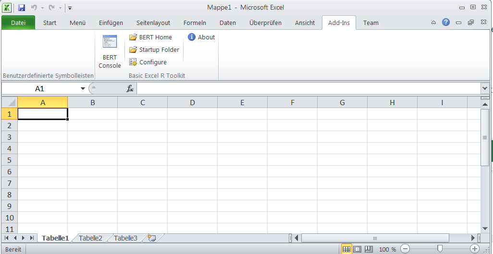


```r
myFunction <- function(){
 aa <- rnorm(200)
 bb <- rnorm(200)
 res <- lm(aa~bb)$res
 return(res)
}
```


## Link `BERT`

- [BERT: a newcomer in the R Excel connection](https://www.r-bloggers.com/bert-a-newcomer-in-the-r-excel-connection/)

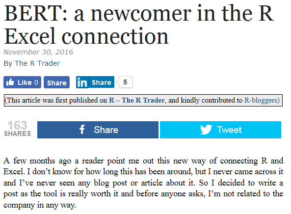

## Das Paket readxl

- [readxl](https://www.r-bloggers.com/get-data-out-of-excel-and-into-r-with-readxl/)


```r
install.packages("readxl")
```


```r
library(readxl)
```

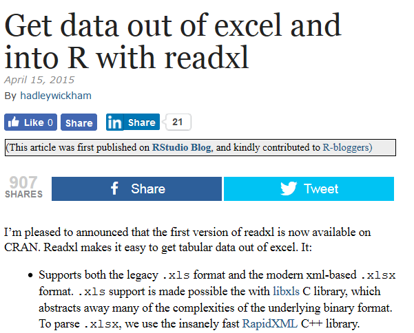


# Präsentation von Daten - Reproducible Research


## [CRAN Taskview zu reproducible research](https://cran.r-project.org/web/views/ReproducibleResearch.html)

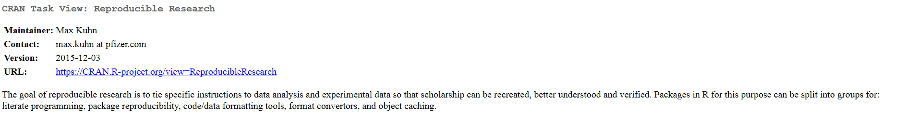


## Resourcen

- [Reproducible Research
with R and RStudio](https://englianhu.files.wordpress.com/2016/01/reproducible-research-with-r-and-studio-2nd-edition.pdf)

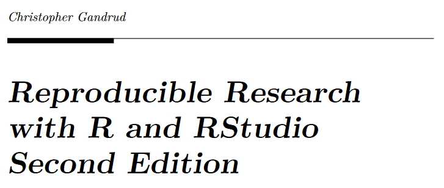

- [A crash course in reproducible research in R](http://t-redactyl.io/blog/2016/10/a-crash-course-in-reproducible-research-in-r.html)


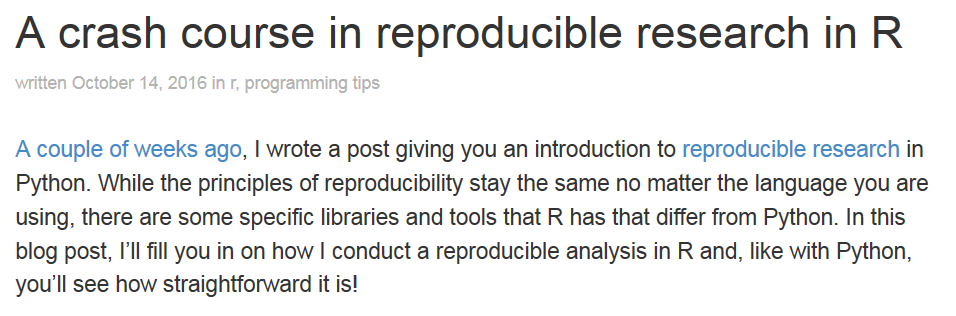


# Word Dokumente mit R erstellen


## Ein Markdown Dokument mit Rstudio erzeugen


## Mein erstes mit R erzeugtes Word Dokument

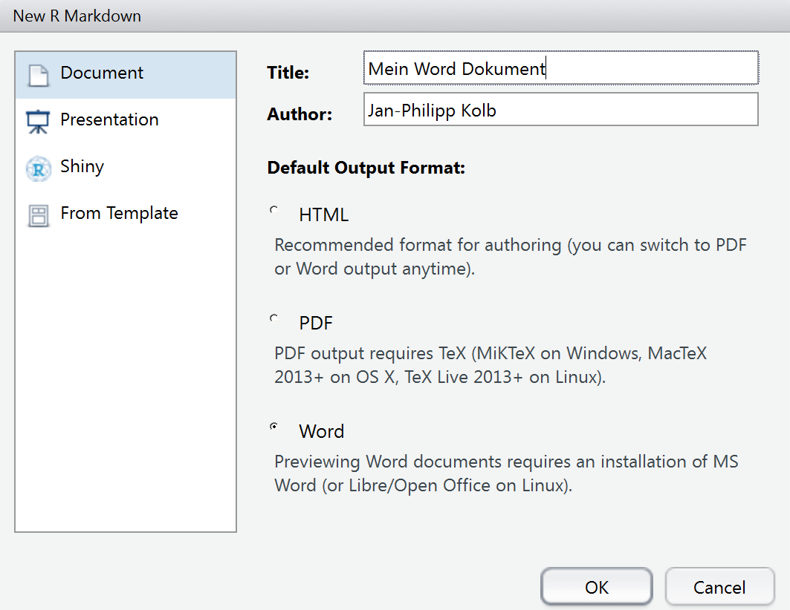

## Erstes Beispiel

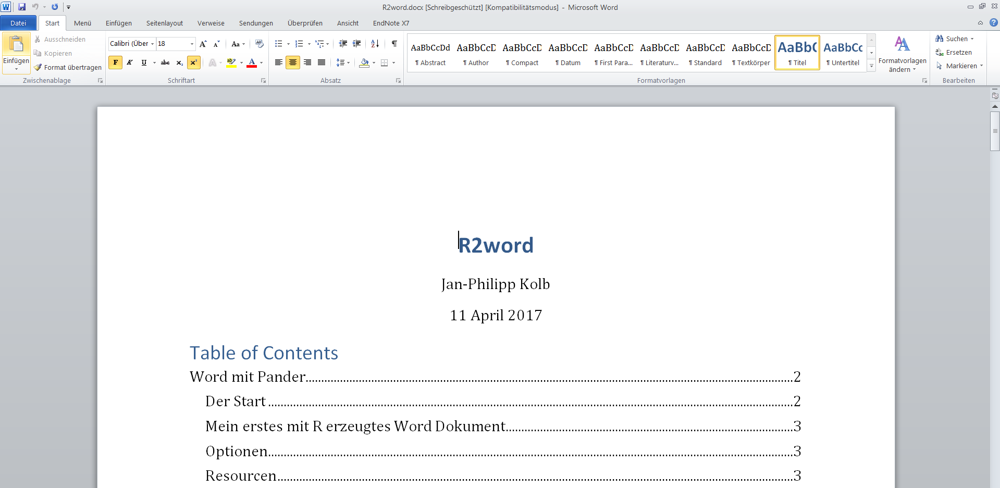

# Das Arbeiten mit Markdown

## Rmarkdown - erste Schritte

Markdown ist eine sehr einfache Syntax, die es Benutzern erlaubt, aus einfachen Textdateien gut gelayoutete Dokumente zu erstellen.

```
**fettes Beispiel**
*kursives Beispiel*
~~durchgestrichen~~
- Aufzählungspunkt
```

**fettes Beispiel**

*kursives Beispiel*

~~durchgestrichen~~

- Aufzählungspunkt

## Weitere Markdown Befehle

```
### Überschrift Ebene 3
#### Überschrift Ebene 4
[Meine Github Seite](https://github.com/Japhilko)
```

### Überschrift Ebene 3

#### Überschrift Ebene 4

[Meine Github Seite](https://github.com/Japhilko)

## Weitere Markdown Befehle

- So kann man Bilder einbinden:
- Man kann entweder einen Link angeben:

```

```

- oder einen (Unterordner) in dem das Bild liegt:

```

```

- in den eckigen Klammern steht die Bildunterschrift
- alle gängigen Formate (.png, .jpeg,.gif) können so eingebunden werden
- Man kann auch noch weitere Optionen spezifizieren (Größe, Breite etc.) - dazu später mehr

## Chunks - Erste Schritte

- Es lassen sich so genannte Chunks einfügen
- In diesen Chunks wird ganz normaler R-code geschrieben

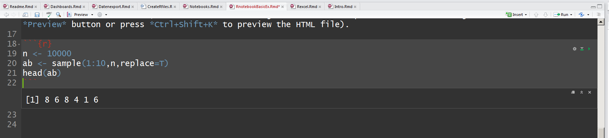

## Button um Chunks einzufügen

- Die default Version eines Chunks ist R
- Man hat aber auch die Möglichkeit andere Programmiersprachen einzubinden

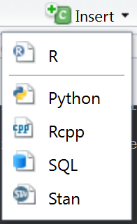

## Inline Code

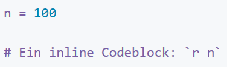


```r
n=100
```

Ein inline Codeblock: 100

## Chunk Optionen

- [Man kann den Chunks Optionen mitgeben:](https://yihui.name/knitr/options/)


Argument   Beschreibung                        
---------  ------------------------------------
eval       Soll Rcode evaluiert werden?        
warning    Sollen Warnings angezeigt werden?   
cache      Soll der Output gespeichert werden? 

- Bei eval kann ein logischer Wert angegeben werden oder eine/mehrere Nummer(n)  


## Optionen


## Optionen für Word Output

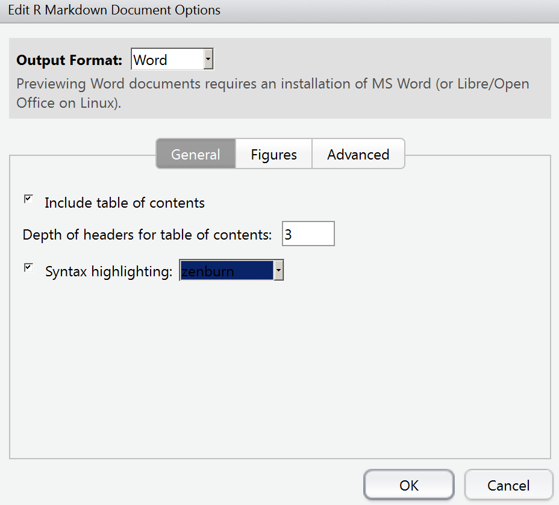

## Code Hervorhebung

- pygments Hervorhebung

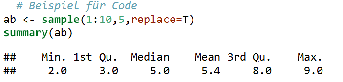


- tango

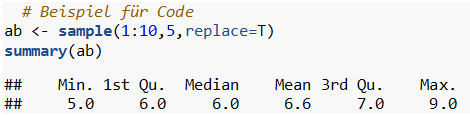


## Das Paket `knitr`


```r
install.packages("knitr")
```


```r
library("knitr")
```

- Das Paket knitr enthält zahlreiche wichtige Funktionen
- Beispiel: Befehl `kable` um Tabellen zu erzeugen

## Eine Tabelle mit `kable` erzeugen


```r
a <- runif(10)
b <- rnorm(10)
ab <- cbind(a,b)
kable(ab)
```

         a            b
----------  -----------
 0.0868167    1.2522672
 0.5268304   -1.2578475
 0.8213497    0.5172868
 0.9764472   -0.7753841
 0.2586538   -0.5456345
 0.1328233    1.1389485
 0.4995480   -0.2662771
 0.6607372   -0.1834718
 0.1354297    0.2096799
 0.1812247   -0.8159881

## [Vorlagen verwenden](http://rmarkdown.rstudio.com/articles_docx.html)

- Formatvorlagen können verändert werden

1. Ein Word Dokument mit Rmarkdown erstellen
2. Das Dokument in Word öffnen und Format verändern 
3. Vorlage als Referenz angeben

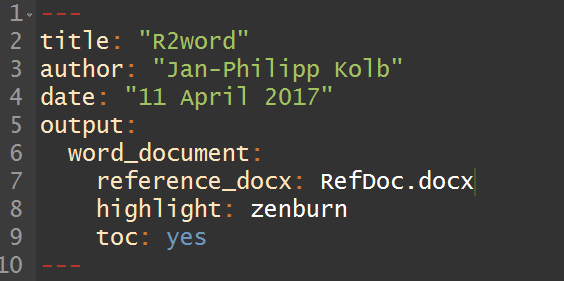


## Resourcen

- Interview - [Ein Word Dokument mit wenig Aufwand schreiben](https://www.r-statistics.com/2013/03/write-ms-word-document-using-r-with-as-little-overhead-as-possible/)

- [pander: Ein R Pandoc Wrapper](http://rapporter.github.io/pander/)

- [Ein Schummelzettel](https://www.rstudio.com/wp-content/uploads/2015/06/rmarkdown-german.pdf)

- [Einführung in Markdown](https://github.com/ctreffe/r-space/wiki/R-Markdown-Intro)

- [Warum TeX besser als Word ist](http://factorgrad.blogspot.de/2010/07/why-latex-is-superior-to-ms-word.html)


#	PDF Dokumente und Präsentationen mit LaTeX, Beamer und Sweave


## Präsentationen mit Rmarkdown - beamer Präsentationen

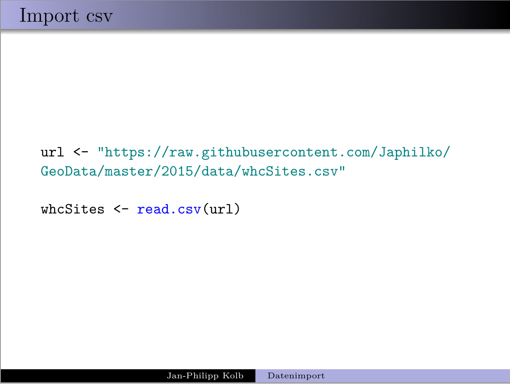

## Beamer Optionen

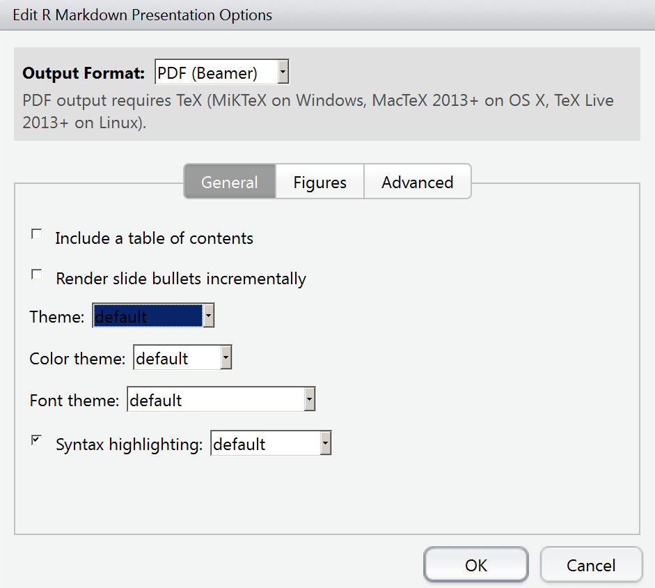

## Beamer Themen


## Chunks einfügen

- Auch hier lassen sich natürlich Chunks einfügen
- Wenn `cache=T` angegeben ist, wird das Ergebnis des Chunks abgespeichert
- Es ist sinnvoll die Chunks zu benennen, dann findet man auch das Ergebnis einfacher

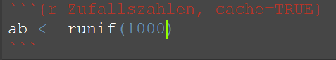

## Ergebnis - Cache

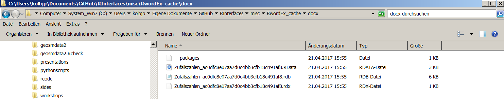

## Wie man das im Header des Dokuments angibt

```
---
title: "Intro - Erste Schritte"
author: "Jan-Philipp Kolb"
date: "10 April 2017"
output:
  beamer_presentation: 
    colortheme: beaver
    theme: CambridgeUS
---
```

## Inhaltsverzeichnis I

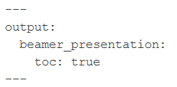

## Inhaltsverzeichnis II

```
output: 
  beamer_presentation: 
    toc: yes
```


## Optionen für die Graphikeinbindung

- *fig_caption: false*, wenn man keine Bildunterschriften haben möchte

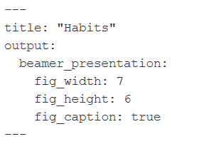

## Präsentationen mit Sweave

- Das Dokument erstellen

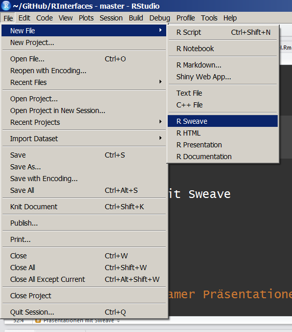

## Sweave Präsentation

- Ganz normaler LaTeX Code wird verwendet

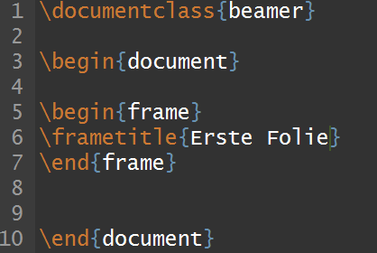

## Chunks bei Sweave

- Auch hier kann R-code verwendet werden

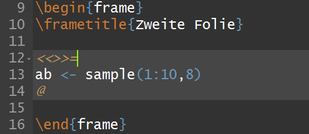

## [Chunk Optionen](http://k-baeumchen.fuhlbrueck.net/R-und-LaTeX.html)

- Auch bei Sweave Chunks können Optionen mitgegeben werden

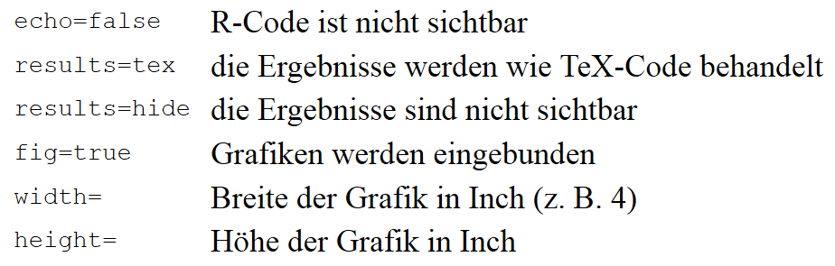

## Inline Code

- Manchmal braucht man das Ergebnis direkt auf der Folie

```
\Sexpr{}
```

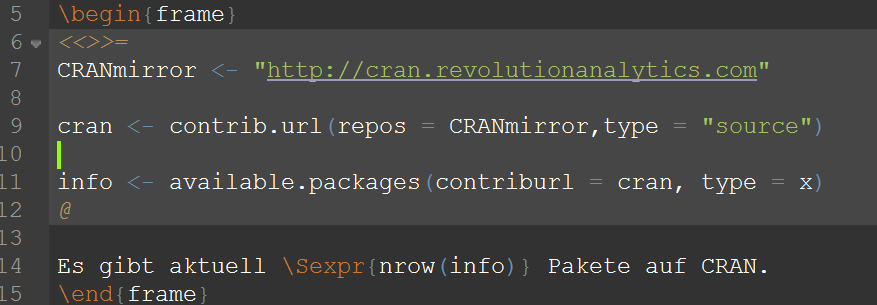

## Inline Code - das Ergebnis

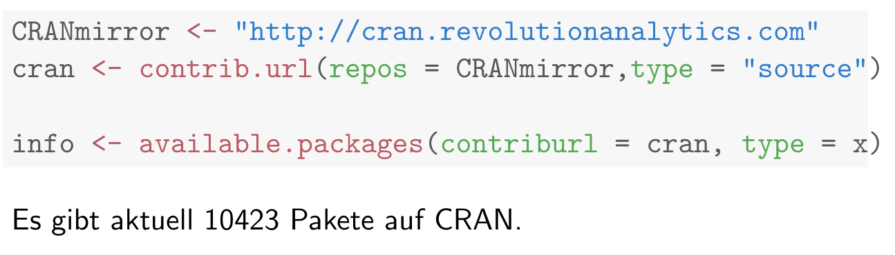


## PDF Paper mit R

- Mit R ist es möglich Berichte oder Paper zu erzeugen
- Dies eignet sich besonders gut, wenn man viel Code hat oder einen Bericht sehr oft erzeugen muss
- Literatur lässt sich am Besten mit einem bibtex file einbauen


## [Jabref](http://www.jabref.org/)

- Literaturverwaltungssystem

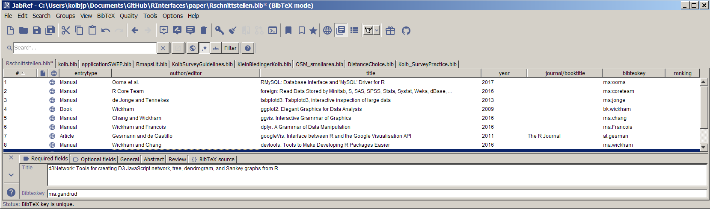

## Referenz mit R bekommen

- Mit dem Befehl `citation()` bekommt man sehr schnell die Referenz


```r
install.packages("RMySQL")
```


```r
citation("RMySQL")
```

```
## 
## To cite package 'RMySQL' in publications use:
## 
##   Jeroen Ooms, David James, Saikat DebRoy, Hadley Wickham and
##   Jeffrey Horner (2017). RMySQL: Database Interface and 'MySQL'
##   Driver for R. R package version 0.10.11.
##   https://CRAN.R-project.org/package=RMySQL
## 
## A BibTeX entry for LaTeX users is
## 
##   @Manual{,
##     title = {RMySQL: Database Interface and 'MySQL' Driver for R},
##     author = {Jeroen Ooms and David James and Saikat DebRoy and Hadley Wickham and Jeffrey Horner},
##     year = {2017},
##     note = {R package version 0.10.11},
##     url = {https://CRAN.R-project.org/package=RMySQL},
##   }
```

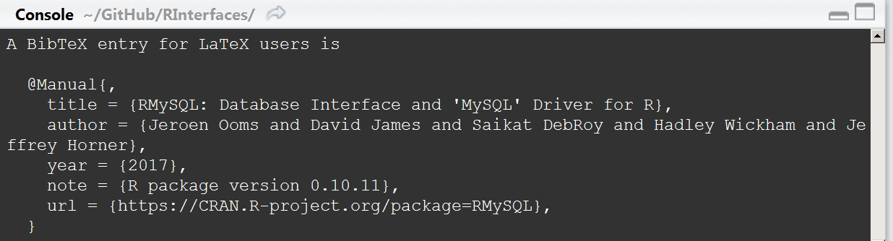


## Das bibtex file einbinden I

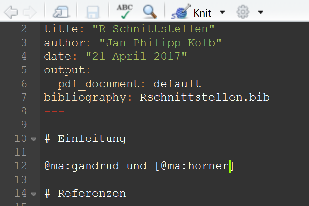

## Das bibtex file einbinden II

```
---
title: "R Schnittstellen"
author: "Jan-Philipp Kolb"
date: "21 April 2017"
output: 
  pdf_document: default
bibliography: Rschnittstellen.bib
---
```


## Das Ergebnis

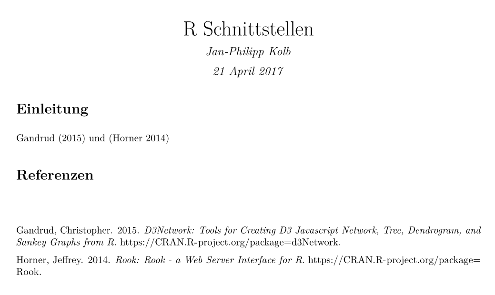


## Links

- [Optionen für Beamer Präsentationen](http://rmarkdown.rstudio.com/beamer_presentation_format.html)

- [Wie R und LaTeX zusammen funktionieren](https://www.r-bloggers.com/from-openoffice-noob-to-control-freak-a-love-story-with-r-latex-and-knitr/)


# HTML Dokumente, Präsentationen und Dashboards mit Rmarkdown


## [Präsentationen - Rpres der einfachste Weg](https://rstudio-pubs-static.s3.amazonaws.com/27777_55697c3a476640caa0ad2099fe914ae5.html#/)


## Eine erste Präsentation


## Erste Daten eintragen

- Für Vergessliche:


```r
date()
```

```
## [1] "Tue May 02 22:22:03 2017"
```

## Eine Folie mit Formel

- Die Formel kann wie in LaTeX eingegeben werden

```
$$
\begin{equation}\label{eq2}
t_{i}=\sum\limits_{k=1}^{M_{i}}{y_{ik}}=M_{i}\bar{Y}_{i}. 
\end{equation}
$$
```


## Zwei Spalten

```
Folie mit zwei Spalten
====================================
Erste Spalte
***
Zweite Spalte
```

## Folienübergänge

```
transition: rotate
```


## [Weitere mögliche Folienübergänge](https://support.rstudio.com/hc/en-us/articles/200714013-Slide-Transitions-and-Navigation)


-    none
-    linear
-    rotate
-    fade
-    zoom
-    concave

## Folientypen

```
Ein neues Kapitel einfügen
====================================
type: section
```

```
Anderer Folientyp
====================================
type: prompt
```


```
Noch ein anderer Folientyp
====================================
type: alert
```

## [Die Schriftart wechseln](https://support.rstudio.com/hc/en-us/articles/200532307)

- Die [CSS Schrifttypen](https://www.w3schools.com/cssref/css_websafe_fonts.asp) können verwendet werden

```
Meine Präsentation
========================================
author: Jan-Philipp Kolb
font-family: 'Impact'
```

## Schrifttypen können auch importiert werden


```
Meine Präsentation
========================================
author: Jan-Philipp Kolb
font-import: http://fonts.googleapis.com/css?family=Risque
font-family: 'Risque'
```

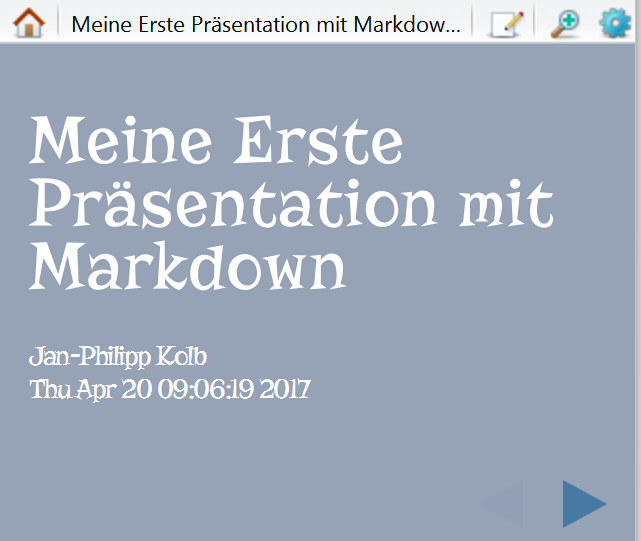

## Kleineren Text

Normale Schriftgröße

```
<small>This sentence will appear smaller.</small>
```

## Die Präsentation anschauen

- Das Ergebnis ist hier zu sehen:

<http://rpubs.com/Japhilko82/FirstRpubs>


# Eine ioslides Präsentation

## Eine ioslides Präsentation


## [ioslides - Der Start](http://rmarkdown.rstudio.com/ioslides_presentation_format.html) 


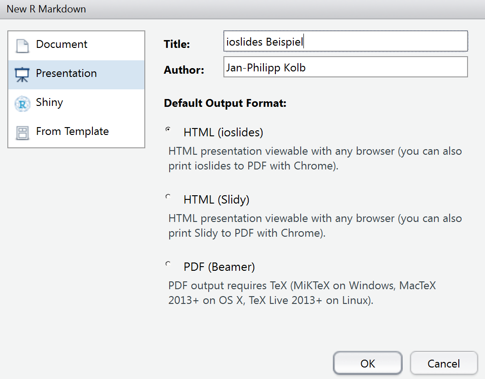


## Weitere Dinge tun 


- Ein Bild einbinden

```

```

## Ein Logo hinzu

```
---
title: "ioslides Beispiel"
author: "Jan-Philipp Kolb"
date: "20 April 2017"
output: 
  ioslides_presentation:
    logo: figure/Rlogo.png
---
```


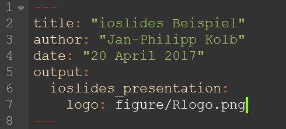

# Eine slidy Präsentation


## slidy Präsentationen


## [Was ist CSS?](https://de.wikipedia.org/wiki/Cascading_Style_Sheets)


- Stylesheet-Sprache für elektronische Dokumente
- eine der Kernsprachen des World Wide Webs.
- CSS wurde entworfen, um Darstellungsvorgaben weitgehend von den Inhalten zu trennen


## Cascading Style Files

- [Custom CSS](http://rmarkdown.rstudio.com/html_document_format.html#custom_css)

- [CSS](https://en.wikipedia.org/wiki/Cascading_Style_Sheets)

- [CSS pro tipps](https://github.com/AllThingsSmitty/css-protips#use-a-css-reset)

## knitr Engines

- [knitr Language Engines](http://rmarkdown.rstudio.com/authoring_knitr_engines.html)

- [slidify](http://slidify.org/)

## Tabellen

- Quelle: [R Studio, and Presentations, and Git! Oh my!](https://www.r-bloggers.com/r-studio-and-presentations-and-git-oh-my/)


```r
library(knitr)
a <- data.frame(a=1:10,b=10:1)
kable(table(a))
```


  1    2    3    4    5    6    7    8    9   10
---  ---  ---  ---  ---  ---  ---  ---  ---  ---
  0    0    0    0    0    0    0    0    0    1
  0    0    0    0    0    0    0    0    1    0
  0    0    0    0    0    0    0    1    0    0
  0    0    0    0    0    0    1    0    0    0
  0    0    0    0    0    1    0    0    0    0
  0    0    0    0    1    0    0    0    0    0
  0    0    0    1    0    0    0    0    0    0
  0    0    1    0    0    0    0    0    0    0
  0    1    0    0    0    0    0    0    0    0
  1    0    0    0    0    0    0    0    0    0


## Das CSS ändern

Um den Präsentationstyp zu ändern kann man das CSS verändern

- [Cascading Style Sheets](https://de.wikipedia.org/wiki/Cascading_Style_Sheets) (CSS)

- Bspw. lässt sich die [Farbe (HTML)](http://tomheller.de/html-farben.html) ändern.
- [Man kann eine andere Schriftart wählen](https://www.mediaevent.de/css/font-family.html)
- [Es gibt zahlreiche Möglichkeiten der Schriftformatierung](https://wiki.selfhtml.org/wiki/CSS/Eigenschaften/Schriftformatierung)
- [Daneben gibt es viele weitere Dinge, die sich mit dem CSS steuern lassen](https://www.w3.org/TR/WCAG20-TECHS/C22.html)

# HTML Dokumente

## Ein HTML Dokument erzeugen


## Ein Template verwenden

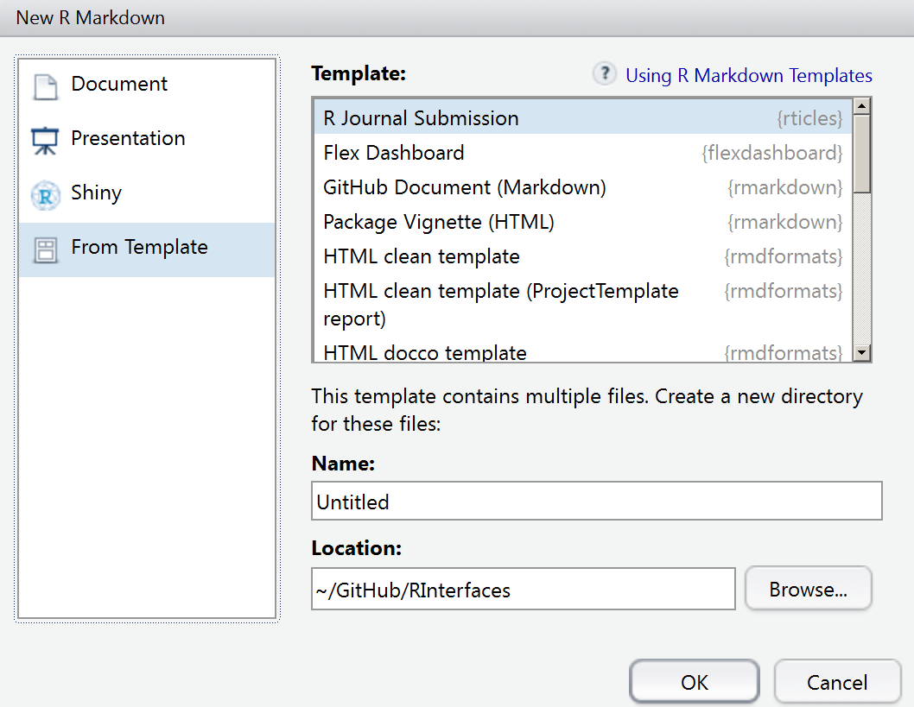

## [Weitere Vorlagen nutzen](http://rmarkdown.rstudio.com/developer_document_templates.html)

- Es gibt viele Formate - [manche müssen erst aktiviert werden](https://blog.rstudio.org/2016/03/21/r-markdown-custom-formats/:


```r
install.packages("rticles")
install.packages("rmdformats")
install.packages("ProjectTemplate")
```

## [Beispiele für Templates](https://github.com/juba/rmdformats)


# Dashboards

## [Beispiel R-Pakete](https://gallery.shinyapps.io/cran-gauge/)


## [Paket installieren](https://blog.rstudio.org/2016/05/17/flexdashboard-easy-interactive-dashboards-for-r/)


```r
install.packages("flexdashboard", type = "source")
```

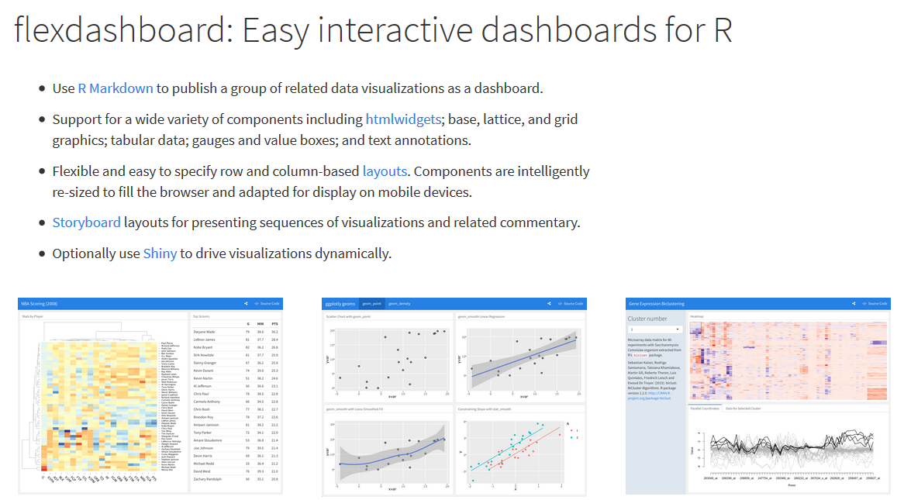

## Ein Dashboard erstellen mit Rstudio


## [Gallerie](http://rmarkdown.rstudio.com/gallery.html)


```r
install.packages("highcharter", type = "source")
```

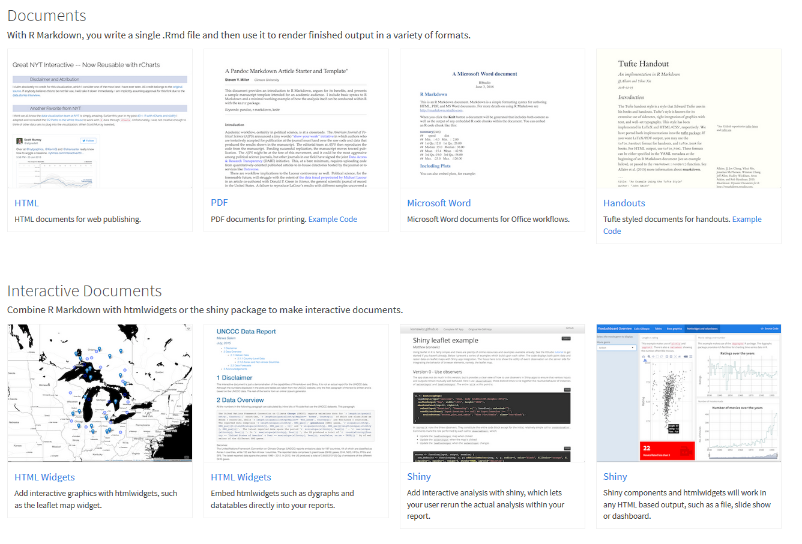

## Links 

- [Verschiedene Markdown Dokumente zusammen fügen](http://stackoverflow.com/questions/25824795/how-to-combine-two-rmarkdown-rmd-files-into-a-single-output)

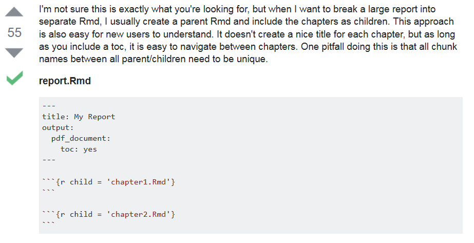


- [Verschiedene CSS Fonts](http://www.cssfontstack.com/)

# Notebooks zur Integration von anderen Programmiersprachen (Python,LaTeX,Julia)


## Notebooks

- [Warum R Notebook nutzen](https://news.ycombinator.com/item?id=12683625)


# Rnotebooks

## Ein Rnotebook anlegen

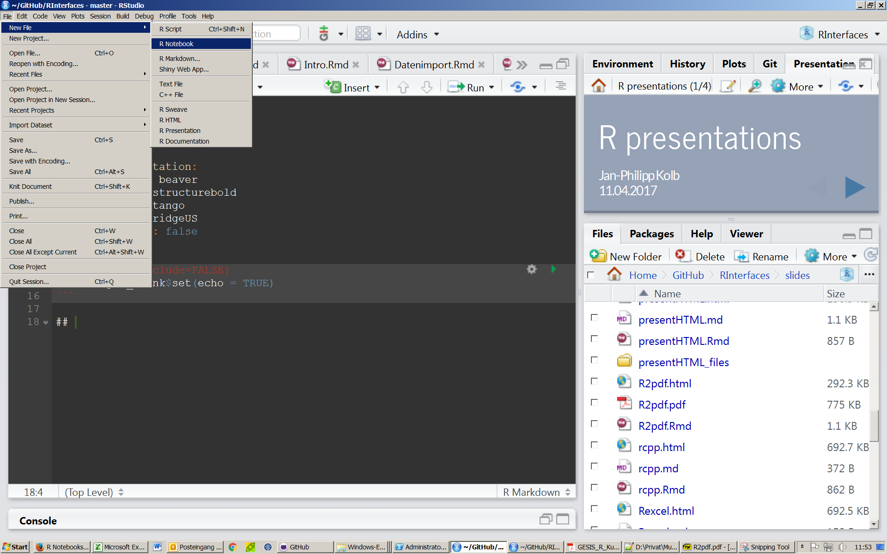

## Rnotebook - erste Schritte

- Es lassen sich so genannte Chunks einfügen
- In diesen Chunks wird ganz normaler R-code geschrieben


## Python Code integrieren

- Ebenso lässt sich [Python code implementieren](https://support.rstudio.com/hc/en-us/articles/233066128-Do-Notebooks-support-other-languages-)


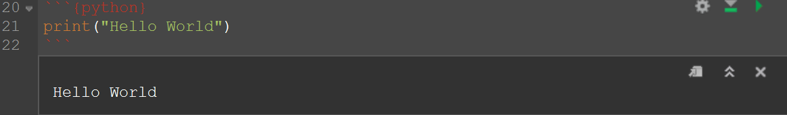


```python
import sys
print(sys.version)
```

```
## 2.7.10 (default, May 23 2015, 09:44:00) [MSC v.1500 64 bit (AMD64)]
```

## [LaTeX Code integieren](https://blog.rstudio.org/2016/10/05/r-notebooks/)

- LaTeX code wird mit zwei Dollarzeichen gekennzeichnet

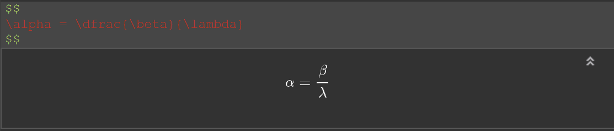


## Notebook veröffentlichen I

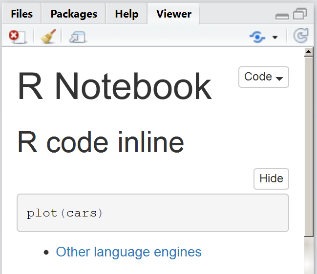

## Notebook veröffentlichen II

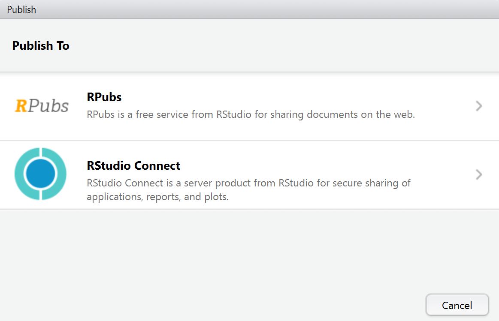

# Andere Notebooks

## [Jupyter Notebook](http://jupyter.readthedocs.io/en/latest/install.html)


- [Anaconda installieren](https://docs.continuum.io/anaconda/install)
- folgenden Befehl in die Eingabeaufforderung eingeben
- Bei Windows findet man diese, wenn man `cmd` in Suche eingibt.

```
jupyter notebook
```
## Start Jupyter Notebook

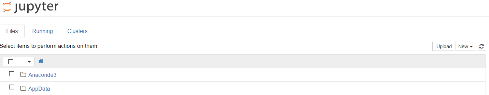

## Beispiel Eingabe Code

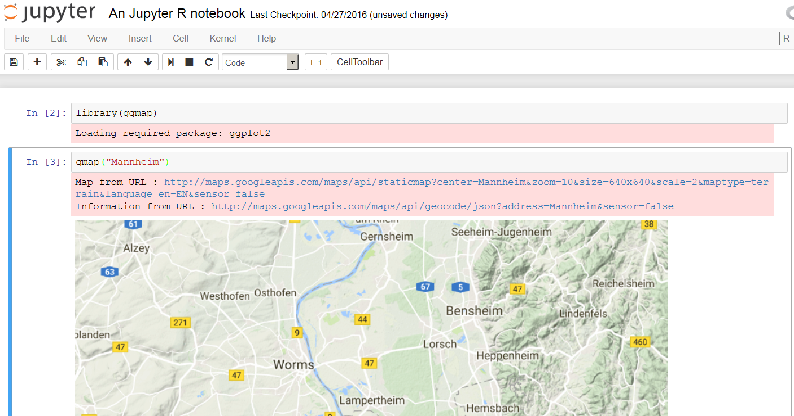


# Beaker Notebook

## Beaker Notebook

- Auch bei Beaker kann man R-code einbauen

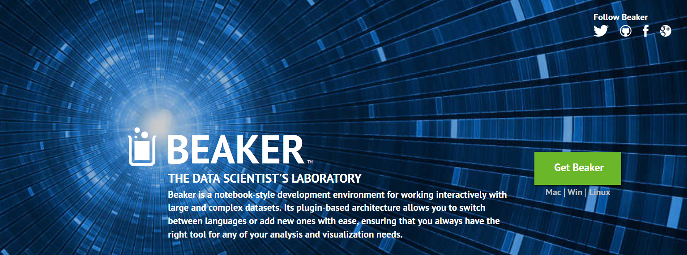

## Beaker starten

- [Beaker installieren](http://beakernotebook.com/getting-started) ...
- ... und mit `beaker.command.bat` starten

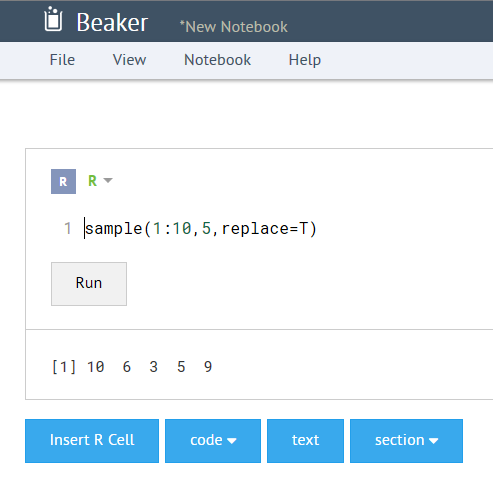


## Links

- [knitr Language Engines](http://rmarkdown.rstudio.com/authoring_knitr_engines.html)

- [More engines](https://yihui.name/knitr/demo/engines/)

- [Andere Programmiersprachen können eingebunden werden](http://rmarkdown.rstudio.com/authoring_knitr_engines.html)

- [Video - Einführung in Rnotebook](https://www.rstudio.com/resources/webinars/introducing-notebooks-with-r-markdown/)

- [R Notebooks](http://rmarkdown.rstudio.com/r_notebooks.html)

- [IPython vs knitr, or Python vs R](https://yihui.name/en/2012/11/ipython-vs-knitr/)

- [Datacamp Tutorial - Jupyter Notebook](https://www.datacamp.com/community/tutorials/tutorial-jupyter-notebook#gs.kZqvIvI)

- [Better interactive data science with Beaker and Rodeo](https://blog.dominodatalab.com/interactive-data-science/)

- [Knit directly to jupyter notebooks from RStudio](https://www.r-bloggers.com/knit-directly-to-jupyter-notebooks-from-rstudio/)

- [Python-Markdown](https://pythonhosted.org/Markdown/)

- [Podcast](https://talkpython.fm/episodes/show/96/exploring-awesome-python)


## Aufgabe: Bearbeiten Sie ein Notebook weiter

