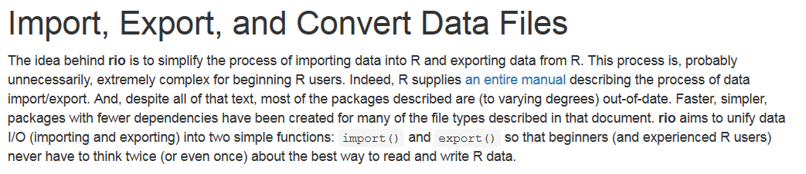

# R Schnittstellen
Jan-Philipp Kolb  
8 Mai 2017  


# Einführung und Motivation


## Pluspunkte von R

- Als Weg kreativ zu sein ...
- Graphiken, Graphiken, Graphiken
- In Kombination mit anderen Programmen nutzbar
- Zur Verbindung von Datenstrukturen
- Zum Automatisieren
- Um die Intelligenz anderer Leute zu nutzen ;-)
- ...


## Warum R?


## Gründe

- R ist [frei verfügbar](http://www.inside-r.org/why-use-r). Es kann umsonst [runtergeladen](http://mirrors.softliste.de/cran/) werden.

- R ist eine Skriptsprache 
- Gute Möglichkeiten für die [Visualisierung](http://research.stowers-institute.org/efg/R/) ([Link](http://www.sr.bham.ac.uk/~ajrs/R/r-gallery.html) )

- R wird immer [populärer](https://twitter.com/josiahjdavis/status/559778930476220418)

- [Popularität von R](http://blog.revolutionanalytics.com/popularity/)

## Übersicht - warum R


## Nachteile von R

1. Daten werden oft anderswo erfasst
2. Nicht jeder ist bereit mit R zu arbeiten 
3. Nicht auf jedem Rechner ist R installiert
4. R ist manchmal zu langsam
5. Schwierigkeiten bei der Arbeit mit großen Datenmengen

## Was folgt daraus

1. Schnittstelle zu SPSS/Stata/Excel zum Import von Daten
2. Schnittstelle zu Word
3. Möglichkeit HTML Präsentationen zu erzeugen
4. Nutzung von C++
5. Nutzung von Datenbanken

# Warum die Nutzung von Schnittstellen?

## Die Nutzung von Schnittstellen beim Import/Export

- Interaktion mit Excel, SPSS, Stata, ...


## [Reproducible Research](http://www.statsmakemecry.com/smmctheblog/the-time-for-reproducible-research-is-now)


## [Was wird bei Wikipedia unter Reproducability verstanden?](https://en.wikipedia.org/wiki/Reproducibility)


## Darstellung von Ergebnissen

- Mit der Schnittstelle zu Javascript lassen sich interaktive Graphiken erzeugen
- Diese kann man auf Websites, in Präsentationen oder in Dashboards verwenden


## [Warum die Schnittstelle zu C++?](http://dirk.eddelbuettel.com/papers/rcpp_workshop_introduction_user2012.pdf)

- [Wenn Schnelligkeit wichtig ist, bietet sich C++ an](http://www.stat.berkeley.edu/scf/paciorek-cppWorkshop.pdf)
- [Dies ist kann bspw. der Fall sein, wenn sich Schleifen nicht vermeiden lassen](https://www.r-bloggers.com/calling-c-from-r-using-rcpp/)
- [Man wird bei der Programmierung durch RStudio unterstützt](https://support.rstudio.com/hc/en-us/articles/200486088-Using-Rcpp-with-RStudio)
- Es gibt eine [Rcpp Galerie](http://gallery.rcpp.org/), wo man sich Anregungen holen kann

## Die Nutzung von Datenbanken

- Wenn große Datenmengen anfallen, kann die zusätzliche Nutzung von Datenbanken sinnvoll sein
- In R bestehen Schnittstellen sowohl zu relationalen als auch nicht relationalen Datenbanken

# Nutzung der Unterlagen auf GitHub

## Wie wird das Github Verzeichnis genutzt

-   Die folgende Seite ist die Startseite für den Kurs:

<https://github.com/Japhilko/RInterfaces>

- Es lohnt sich immer wieder zu dieser Seite zurückzukehren, weil hier alle relevanten Dokumente verlinkt sind.

- Grundsätzlich kann man der Veranstalung am Besten mit dem [kompletten File](https://github.com/Japhilko/RInterfaces/blob/master/slides/RInterfaces_all2g.md) folgen. Wenn Teile heruntergeladen werden sollen, bietet es sich an, das entsprechende pdf herunterzuladen.

## Informationen audrucken

-   Zum Ausdrucken eignen sich die pdf-Dateien besser. 

-   Diese können mit dem Raw Button heruntergeladen werden. 


## Weitere Dateien herunterladen

- Begleitend zu den Folien wird meistens auch ein R-File angeboten. 

- Hier können Sie entweder das gesamte R-File herunterladen und in R ausführen oder einzelne Befehle per Copy/Paste übernehmen.

- Vereinzelt sind auch Datensätze vorhanden. 

- `.csv` Dateien können direkt von R eingelesen werden (wie das geht werde ich noch zeigen).

- Wenn die `.csv` Dateien heruntergeladen werden sollen auch den Raw Button verwenden.

- Alle anderen Dateien (bspw. `.RData`) auch mittels Raw Button herunterladen.

## Organisatorisches


- Zusätzlich gibt es für jedes Kapitel eine Aufgabe, da man nur durch eigenes Trainieren auf der Lernkurve vorankommt.
- Die Quellen sind als Link meist in der Überschrift hinterlegt.
- Die Links sind nur im HTML Dokument zu sehen aber auch in der pdf vorhanden.

## Links und Quellen


Wen Github näher interessiert:

- [Hello World](https://guides.github.com/activities/hello-world/)

- [Understanding the GitHub flow](https://guides.github.com/introduction/flow/)


# Datenimport


## Dateiformate in R

-  Von R werden quelloffene, nicht-proprietäre Formate bevorzugt
-  Es können aber auch Formate von anderen Statistik Software Paketen eingelesen werden
-  R-user speichern Objekte gerne in sog. Workspaces ab
-  Auch hier jedoch gilt: (fast) alles andere ist möglich

## Formate - base package

R unterstützt von Haus aus schon einige wichtige Formate:
		
-  CSV (Comma Separated Values): `read.csv()`
-  FWF (Fixed With Format): `read.fwf()`
-  Tab-getrennte Werte: `read.delim()`


## Datenimport leicht gemacht mit Rstudio


## CSV aus dem Web einladen

- Datensatz:

<https://data.montgomerycountymd.gov/api/views/6rqk-pdub/rows.csv?accessType=DOWNLOAD>

- [Datenimport mit Rstudio](https://support.rstudio.com/hc/en-us/articles/218611977-Importing-Data-with-RStudio)


## Der Arbeitsspeicher

So findet man heraus, in welchem Verzeichnis man sich gerade befindet


```r
getwd()
```

So kann man das Arbeitsverzeichnis ändern:

Man erzeugt ein Objekt in dem man den Pfad abspeichert:


```r
main.path <- "C:/" # Beispiel für Windows
main.path <- "/users/Name/" # Beispiel für Mac
main.path <- "/home/user/" # Beispiel für Linux
```

Und ändert dann den Pfad mit setwd()


```r
setwd(main.path)
```

Bei Windows ist es wichtig Slashs anstelle von Backslashs zu verwenden.

## Alternative - Arbeitsspeicher


## Das Paket `readr`


```r
install.packages("readr")
```


```r
library(readr)
```

- [`readr` auf dem Rstudio Blogg](https://blog.rstudio.org/2015/10/28/readr-0-2-0/)


## Import von Excel-Daten

-  `library(readr)` ist für den Import von fremden Datenformaten hilfreich
-  Wenn Excel-Daten vorliegen - als .csv abspeichern
- Diese lassen sich auch ohne das Paket `foreign` einlesen.


```r
library(readr)
rows <- read_csv("https://data.montgomerycountymd.gov/api/views/6rqk-pdub/rows.csv?accessType=DOWNLOAD")
```


## `.csv`-Daten aus dem Web importieren - zweites Beispiel


```r
url <- "https://raw.githubusercontent.com/Japhilko/
GeoData/master/2015/data/whcSites.csv"

whcSites <- read_csv(url) 
```


```r
head(whcSites)
```

```
##   https://raw.githubusercontent.com/Japhilko/
## 1       GeoData/master/2015/data/whcSites.csv
```

## Das Paket `haven`


```r
install.packages("haven")
```


```r
library(haven)
```

- [`haven`auf dem Rstudio Blogg](https://blog.rstudio.org/2016/10/04/haven-1-0-0/)


## SPSS Dateien einlesen

- Zunächst muss wieder der Pfad zum Arbeitsverzeichnis angeben werden.
- SPSS-Dateien können auch direkt aus dem Internet geladen werden:


```r
install.packages("haven")
```


```r
library(haven)
mtcars <- read_sav("https://github.com/Japhilko/RInterfaces/raw/master/data/mtcars.sav")
```

## stata Dateien einlesen


```r
library(haven)
oecd <- read_dta("https://github.com/Japhilko/IntroR/raw/master/2017/data/oecd.dta")
```


## Links

- [Quick-R - Import Data](http://www.statmethods.net/input/importingdata.html)

- [Datenimport bei R-bloggers](https://www.r-bloggers.com/importing-data-into-r-part-ii/)

- [Importing Data into R](https://thepracticalr.wordpress.com/2016/09/23/importing-data-into-r/)

- [Mapping von Arbeitslosendaten in den USA](https://www.r-bloggers.com/mapping-unemployment-data-2016/)

- [Das Paket readr](https://www.r-bloggers.com/readrproblems-returns-tidy-data/)

# Datenexport


# Export Allgemein

## R's Exportformate

-  In R werden offene Dateiformate bevorzugt
-  Als Äquivalenz zu den `read.X()` Funktionen stehen viele `write.X()` Funktionen zur Verfügung
-  Das eigene Format von R sind sog. Workspaces (`.RData`)

## Beispieldatensatz erzeugen


```r
A <- c(1,2,3,4)
B <- c("A","B","C","D")

mydata <- data.frame(A,B)
```


## Überblick Daten Import/Export


```r
save(mydata, file="mydata.RData")
```

## Daten in `.csv` Format abspeichern


```r
write.csv(mydata,file="mydata.csv") 
```


## [Das Paket `xlsx`](http://www.sthda.com/english/wiki/r-xlsx-package-a-quick-start-guide-to-manipulate-excel-files-in-r#read-an-excel-file)


```r
library(xlsx)
write.xlsx(mydata,file="mydata.xlsx") 
```

## [Das Paket `foreign`](https://www.r-bloggers.com/readingwriting-stata-dta-files-with-foreign/)


## Daten in stata Format abspeichern


```r
library(foreign)
write.dta(mydata,file="data/mydata.dta") 
```

## Das Paket `rio`


```r
install.packages("rio")
```



## [Daten als .sav abspeichern (SPSS)](https://cran.r-project.org/web/packages/rio/vignettes/rio.html)


```r
library("rio")
# create file to convert

export(mtcars, "data/mtcars.sav")
```


## Dateiformate konvertieren


```r
export(mtcars, "data/mtcars.dta")

# convert Stata to SPSS
convert("data/mtcars.dta", "data/mtcars.sav")
```


## Links Export

- [Quick R](http://www.statmethods.net/input/exportingdata.html) für das Exportieren von Daten:

- Hilfe zum Export auf dem [cran Server](http://cran.r-project.org/doc/manuals/r-release/R-data.pdf)

- [Daten aus R heraus bekommen](https://www.stat.ubc.ca/~jenny/STAT545A/block05_getNumbersOut.html)

# R und Excel


# Präsentation von Daten - Reproducible Research


# Word Dokumente mit R erstellen


#	PDF Dokumente und Präsentationen mit LaTeX, Beamer und Sweave


# HTML Dokumente, Präsentationen und Dashboards mit Rmarkdown


# Notebooks zur Integration von anderen Programmiersprachen (Python,LaTeX,Julia)


## Aufgabe: Bearbeiten Sie ein Notebook weiter

