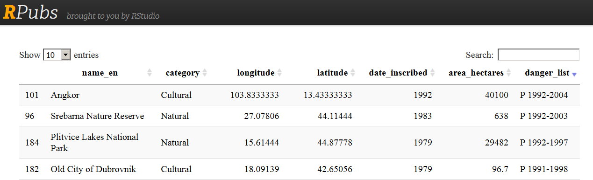
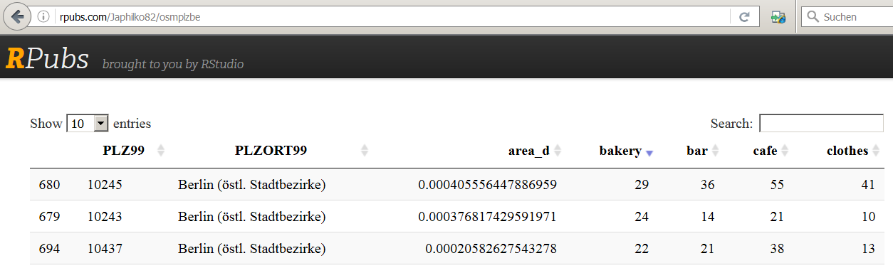
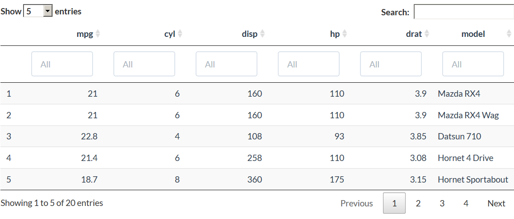
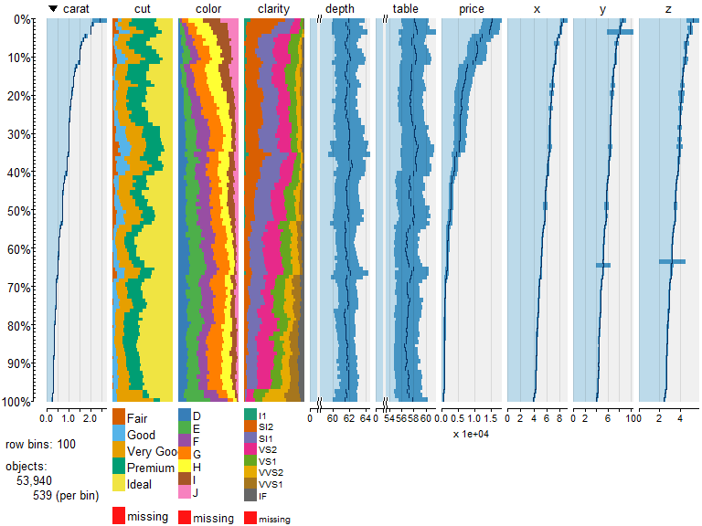
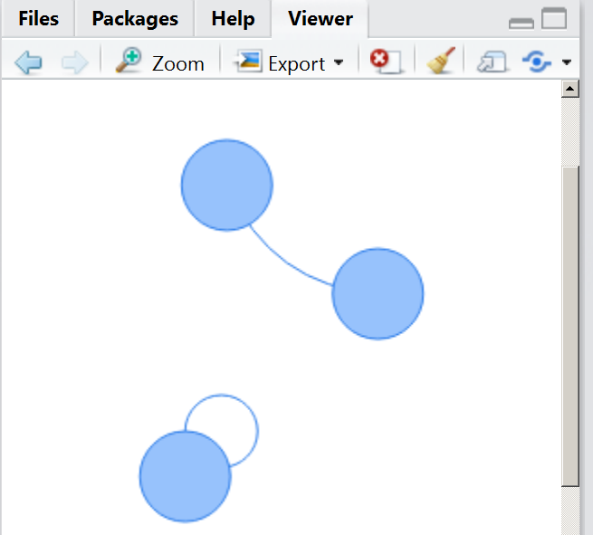

# Zweiter Teil
Jan-Philipp Kolb  
28 April 2017  


#	Interaktive Karten mit dem Javascript Paket leaflet


## Die Daten - Weltkulturerbe


```r
url <- "https://raw.githubusercontent.com/Japhilko/
GeoData/master/2015/data/whcSites.csv"

whcSites <- read.csv(url) 
```


```r
library(knitr)
whcSitesDat <- with(whcSites,data.frame(name_en,
                                        category))
kable(head(whcSitesDat))
```


name_en                                                               category 
--------------------------------------------------------------------  ---------
Cultural Landscape and Archaeological Remains of the Bamiyan Valley   Cultural 
Minaret and Archaeological Remains of Jam                             Cultural 
Historic Centres of Berat and Gjirokastra                             Cultural 
Butrint                                                               Cultural 
Al Qal'a of Beni Hammad                                               Cultural 
M'Zab Valley                                                          Cultural 

## Weitere Variablen WHC Datensatz


```r
whcSitesDat2 <- with(whcSites,data.frame(name_en,category,longitude,latitude,date_inscribed,area_hectares,danger_list))
```


```r
library('DT')
datatable(whcSitesDat2)
```

## Das Ergebnis bei Rpubs

<http://rpubs.com/Japhilko82/WHCdata>




## Notwendige Pakete

[magrittr](https://cran.r-project.org/web/packages/magrittr/index.html) - für den Pipe Operator in R:


```r
library("magrittr")
```


[leaflet](https://rstudio.github.io/leaflet/) - um  interaktive Karten mit der JavaScript Bibliothek 'Leaflet' zu erzeugen


```r
library("leaflet")
```


## Eine interaktive Karte erstellen


```r
m <- leaflet() %>%
  addTiles() %>%  # Add default OpenStreetMap map tiles
  addMarkers(lng=whcSites$lon, 
             lat=whcSites$lat, 
             popup=whcSites$name_en)
m
```

## Die Karte zeigen

 

## Farbe hinzu


```r
whcSites$color <- "red"
whcSites$color[whcSites$category=="Cultural"] <- "blue"
whcSites$color[whcSites$category=="Mixed"] <- "orange"
```

## Eine Karte mit Farbe erzeugen


```r
m1 <- leaflet() %>%
  addTiles() %>%  
  addCircles(lng=whcSites$lon, 
             lat=whcSites$lat, 
             popup=whcSites$name_en,
             color=whcSites$color)
```

## Die Karte zeigen

 

## [Die Karte abspeichern](http://www.r-bloggers.com/interactive-mapping-with-leaflet-in-r-2/)

<!--

-->

## [Layers ein- und ausblenden](https://rstudio.github.io/leaflet/showhide.html)


```r
leaflet() %>%
  addTiles() %>%
  addMarkers(data = coffee_shops, group = "Food & Drink") %>%
  addMarkers(data = restaurants, group = "Food & Drink") %>%
  addMarkers(data = restrooms, group = "Restrooms")
```

## [Karte mit Polygonen erzeugen](https://rstudio.github.io/leaflet/map_widget.html)


```r
library(sp)
Sr1 = Polygon(cbind(c(2, 4, 4, 1, 2), c(2, 3, 5, 4, 2)))
Sr2 = Polygon(cbind(c(5, 4, 2, 5), c(2, 3, 2, 2)))
Sr3 = Polygon(cbind(c(4, 4, 5, 10, 4), c(5, 3, 2, 5, 5)))
Sr4 = Polygon(cbind(c(5, 6, 6, 5, 5), c(4, 4, 3, 3, 4)), hole = TRUE)
Srs1 = Polygons(list(Sr1), "s1")
Srs2 = Polygons(list(Sr2), "s2")
Srs3 = Polygons(list(Sr4, Sr3), "s3/4")
SpP = SpatialPolygons(list(Srs1, Srs2, Srs3), 1:3)
leaflet(height = "300px") %>% addPolygons(data = SpP)
```

<!--html_preserve--><div id="htmlwidget-f9489554bb700923e07f" style="width:768px;height:300px;" class="leaflet html-widget"></div>
<script type="application/json" data-for="htmlwidget-f9489554bb700923e07f">{"x":{"calls":[{"method":"addPolygons","args":[[[{"lng":[2,1,4,4,2],"lat":[2,4,5,3,2]}],[{"lng":[5,2,4,5],"lat":[2,2,3,2]}],[{"lng":[4,10,5,4,4],"lat":[5,5,2,3,5]},{"lng":[5,5,6,6,5],"lat":[4,3,3,4,4]}]],null,null,{"lineCap":null,"lineJoin":null,"clickable":true,"pointerEvents":null,"className":"","stroke":true,"color":"#03F","weight":5,"opacity":0.5,"fill":true,"fillColor":"#03F","fillOpacity":0.2,"dashArray":null,"smoothFactor":1,"noClip":false},null]}],"limits":{"lat":[2,5],"lng":[1,10]}},"evals":[],"jsHooks":[]}</script><!--/html_preserve-->

## Beispiel US Staaten


```r
library(maps)
mapStates = map("state", fill = TRUE, plot = FALSE)
leaflet(data = mapStates) %>% addTiles() %>%
  addPolygons(fillColor = topo.colors(10, alpha = NULL), stroke = FALSE)
```

<!--html_preserve--><div id="htmlwidget-0df58b01db3e89072d80" style="width:768px;height:576px;" class="leaflet html-widget"></div>
<script type="application/json" data-for="htmlwidget-0df58b01db3e89072d80">{"x":{"calls":[{"method":"addTiles","args":["http://{s}.tile.openstreetmap.org/{z}/{x}/{y}.png",null,null,{"minZoom":0,"maxZoom":18,"maxNativeZoom":null,"tileSize":256,"subdomains":"abc","errorTileUrl":"","tms":false,"continuousWorld":false,"noWrap":false,"zoomOffset":0,"zoomReverse":false,"opacity":1,"zIndex":null,"unloadInvisibleTiles":null,"updateWhenIdle":null,"detectRetina":false,"reuseTiles":false,"attribution":"&copy; <a href=\"http://openstreetmap.org\">OpenStreetMap\u003c/a> contributors, <a href=\"http://creativecommons.org/licenses/by-sa/2.0/\">CC-BY-SA\u003c/a>"}]},{"method":"addPolygons","args":[[[{"lng":[-87.4620056152344,-87.4849319458008,-87.525032043457,-87.53076171875,-87.5708694458008,-87.5880584716797,-87.5937881469727,-87.5937881469727,-87.6740036010742,-87.8115158081055,-87.8802642822266,-87.9203720092773,-87.9547500610352,-88.0063171386719,-88.0177764892578,-88.0120468139648,-87.9948577880859,-87.9547500610352,-87.9031829833984,-87.8286972045898,-87.8000564575195,-87.8000564575195,-87.8172378540039,-87.8401565551758,-87.8516235351562,-87.8745346069336,-87.9031829833984,-87.9261016845703,-87.9318313598633,-87.9432907104492,-87.9203720092773,-87.9146423339844,-87.9261016845703,-87.9203720092773,-87.9490203857422,-87.989128112793,-88.0063171386719,-88.0177764892578,-88.0349655151367,-88.0464248657227,-88.0521545410156,-88.0521545410156,-88.063606262207,-88.0693435668945,-88.0808029174805,-88.0808029174805,-88.0979919433594,-88.1094436645508,-88.1151809692383,-88.1094436645508,-88.1209106445312,-88.1209106445312,-88.1266403198242,-88.1323699951172,-88.1438293457031,-88.161018371582,-88.172477722168,-88.1896591186523,-88.2240447998047,-88.2354965209961,-88.2870635986328,-88.3157119750977,-88.3329010009766,-88.35009765625,-88.3902053833008,-88.4073867797852,-88.4188461303711,-88.430305480957,-88.4532241821289,-88.4646835327148,-88.4761428833008,-88.430305480957,-88.430305480957,-88.3902053833008,-88.35009765625,-88.3386306762695,-88.2985305786133,-88.2756042480469,-88.2526931762695,-88.2068557739258,-88.2068557739258,-88.1839370727539,-88.166748046875,-88.1495513916016,-88.1094436645508,-88.1323699951172,-88.166748046875,-88.1896591186523,-88.1839370727539,-87.989128112793,-87.6052474975586,-87.2270965576172,-87.2041702270508,-86.8260269165039,-86.7801895141602,-86.3103637695312,-85.8519973754883,-85.6113510131836,-85.5884399414062,-85.5426025390625,-85.5254058837891,-85.4681167602539,-85.4280090332031,-85.4050903320312,-85.3936309814453,-85.3477935791016,-85.3134155273438,-85.2962265014648,-85.2446594238281,-85.2389297485352,-85.1930923461914,-85.1930923461914,-85.1701812744141,-85.1472549438477,-85.1300735473633,-85.1300735473633,-85.1243438720703,-85.1014175415039,-85.1014175415039,-85.0670394897461,-85.0498580932617,-85.0097503662109,-84.9868316650391,-84.992561340332,-84.9753723144531,-84.9810943603516,-85.004020690918,-84.9753723144531,-84.9238052368164,-84.9008865356445,-84.9295349121094,-84.9524536132812,-84.9696426391602,-84.992561340332,-85.0498580932617,-85.0613098144531,-85.0613098144531,-85.0613098144531,-85.0613098144531,-85.0613098144531,-85.0613098144531,-85.0785064697266,-85.1071472167969,-85.1415252685547,-85.1358032226562,-85.1358032226562,-85.1300735473633,-85.1186065673828,-85.0785064697266,-85.0613098144531,-85.0613098144531,-85.0842361450195,-85.0842361450195,-85.0956954956055,-85.0956954956055,-85.1014175415039,-85.1243438720703,-85.1243438720703,-85.1128768920898,-85.1128768920898,-85.0899658203125,-85.0441284179688,-85.0383987426758,-85.0326690673828,-85.0326690673828,-85.0154800415039,-85.0154800415039,-85.4967651367188,-85.5196762084961,-86.0467987060547,-86.2014999389648,-86.3905715942383,-86.705696105957,-86.7973709106445,-87.1812591552734,-87.6052474975586,-87.6052474975586,-87.610969543457,-87.6338958740234,-87.6396255493164,-87.6338958740234,-87.610969543457,-87.5479507446289,-87.4906539916992,-87.4620056152344,-87.4505462646484,-87.4218978881836,-87.4104385375977,-87.4104385375977,-87.4333572387695,-87.4620056152344,-87.4677352905273,-87.4620056152344,-87.44482421875,-87.3989868164062,-87.3932571411133,-87.4047164916992,-87.4218978881836,-87.439094543457,-87.439094543457,-87.4505462646484,-87.4620056152344],"lat":[30.3896808624268,30.3724918365479,30.3724918365479,30.3323860168457,30.3266544342041,30.3266544342041,30.3094673156738,30.286548614502,30.275089263916,30.2579021453857,30.2464408874512,30.2464408874512,30.2464408874512,30.2407131195068,30.2521705627441,30.269359588623,30.275089263916,30.275089263916,30.2808208465576,30.286548614502,30.286548614502,30.3266544342041,30.3438453674316,30.3839530944824,30.4011421203613,30.4125995635986,30.4240608215332,30.4469795227051,30.4928131103516,30.527193069458,30.5615692138672,30.5844879150391,30.6188640594482,30.670431137085,30.6990776062012,30.7907524108887,30.7964820861816,30.802209854126,30.7907524108887,30.7563762664795,30.727725982666,30.7105388641357,30.6876201629639,30.6818885803223,30.6303253173828,30.6131362915039,30.6074066162109,30.5959453582764,30.5844879150391,30.5558376312256,30.4813556671143,30.4412479400635,30.3896808624268,30.3610343933105,30.3438453674316,30.3381156921387,30.3381156921387,30.3553047180176,30.3782234191895,30.3954105377197,30.4011421203613,30.4011421203613,30.4011421203613,30.4240608215332,30.4125995635986,30.7334575653076,30.9970169067383,31.123067855835,31.432466506958,31.6960258483887,31.8908290863037,32.22314453125,32.3090896606445,32.5783805847168,32.9221534729004,32.985179901123,33.2831192016602,33.5294914245605,33.7357559204102,34.0623397827148,34.0795288085938,34.3144416809082,34.4634094238281,34.5837326049805,34.8988571166992,34.9045906066895,34.9504280090332,34.996265411377,35.0134506225586,35.0134506225586,35.0077209472656,35.0019912719727,35.0019912719727,34.996265411377,34.9905319213867,34.9905319213867,34.9848022460938,34.9790725708008,34.8415641784668,34.6181106567383,34.5837326049805,34.2628746032715,34.0795288085938,33.9592094421387,33.907642364502,33.6612701416016,33.4951095581055,33.4320907592773,33.1169624328613,33.1054992675781,32.8705902099609,32.8591270446777,32.8419418334961,32.7903747558594,32.7674560546875,32.7502670288086,32.733081817627,32.67578125,32.6356735229492,32.6070289611816,32.5554618835449,32.5268173217773,32.4981651306152,32.4695167541504,32.4236831665039,32.3778457641602,32.3377380371094,32.3090896606445,32.2804412841797,32.2517929077148,32.2346076965332,32.228874206543,32.2002258300781,32.1830368041992,32.1601181030273,32.1200141906738,32.1028251647949,32.085636138916,32.0627174377441,32.0283432006836,31.9939613342285,31.9595851898193,31.9366664886475,31.8679141998291,31.7876968383789,31.7762393951416,31.7304019927979,31.6845645904541,31.6158123016357,31.5585174560547,31.5241374969482,31.4783000946045,31.4439239501953,31.4095478057861,31.3407917022705,31.3006839752197,31.2834949493408,31.254846572876,31.1918201446533,31.174633026123,31.1402568817139,31.1116065979004,31.0944194793701,31.0772304534912,31.0371246337891,31.0027484893799,30.9970169067383,31.0084743499756,31.0084743499756,31.0084743499756,31.0084743499756,31.0084743499756,31.0084743499756,31.0084743499756,31.0084743499756,31.0084743499756,30.9569110870361,30.9339923858643,30.8996162414551,30.8766975402832,30.8595085144043,30.8423175811768,30.7735633850098,30.721996307373,30.7105388641357,30.6990776062012,30.6761589050293,30.6475124359131,30.6188640594482,30.5844879150391,30.5443801879883,30.527193069458,30.5100040435791,30.4928131103516,30.4584369659424,30.4469795227051,30.4297866821289,30.4297866821289,30.4240608215332,30.4183292388916,30.4011421203613,30.3896808624268]}],[{"lng":[-114.637390136719,-114.643127441406,-114.603019714355,-114.574363708496,-114.585830688477,-114.597282409668,-114.608741760254,-114.625938415527,-114.666046142578,-114.660308837891,-114.666046142578,-114.671775817871,-114.683235168457,-114.700416564941,-114.700416564941,-114.688957214355,-114.711875915527,-114.734802246094,-114.734802246094,-114.757713317871,-114.734802246094,-114.700416564941,-114.643127441406,-114.557182312012,-114.488426208496,-114.396751403809,-114.327995300293,-114.310813903809,-114.264976501465,-114.201942443848,-114.13892364502,-114.116004943848,-114.08162689209,-114.052978515625,-114.047248840332,-114.041519165039,-113.823799133301,-113.537322998047,-113.279487609863,-113.004470825195,-112.907066345215,-112.729446411133,-112.540374755859,-112.414321899414,-112.208053588867,-111.950225830078,-111.686668395996,-111.411643981934,-111.319969177246,-111.25121307373,-111.125160217285,-110.844413757324,-110.75846862793,-110.683990478516,-110.546478271484,-110.30583190918,-110.088104248047,-110.00789642334,-109.933410644531,-109.715682983398,-109.41202545166,-109.148460388184,-109.039596557617,-109.04532623291,-109.051063537598,-109.051063537598,-109.056785583496,-109.051063537598,-109.056785583496,-109.056785583496,-109.056785583496,-109.234405517578,-109.624015808105,-109.996437072754,-110.351669311523,-110.477722167969,-110.632415771484,-110.987655639648,-111.119430541992,-111.297050476074,-111.388725280762,-111.629364013672,-112.036163330078,-112.32837677002,-112.66641998291,-112.929977416992,-113.187812805176,-113.348236083984,-113.468559265137,-113.743583679199,-114.035797119141,-114.316543579102,-114.700416564941,-114.809280395508,-114.797813415527,-114.769172668457,-114.734802246094,-114.688957214355,-114.654586791992,-114.59156036377,-114.551452636719,-114.522804260254,-114.47696685791,-114.47696685791,-114.482696533203,-114.539993286133,-114.660308837891,-114.700416564941,-114.711875915527,-114.688957214355,-114.740524291992,-114.71760559082,-114.729064941406,-114.688957214355,-114.648849487305,-114.637390136719,-114.608741760254,-114.62020111084,-114.568641662598,-114.557182312012,-114.528533935547,-114.539993286133,-114.522804260254,-114.539993286133,-114.539993286133,-114.517074584961,-114.454048156738,-114.471237182617,-114.448318481445,-114.41967010498,-114.396751403809,-114.299346923828,-114.230598449707,-114.190490722656,-114.133193969727,-114.13892364502,-114.16756439209,-114.287887573242,-114.373832702637,-114.402488708496,-114.41967010498,-114.448318481445,-114.574363708496,-114.551452636719,-114.545722961426,-114.568641662598,-114.608741760254,-114.63166809082,-114.637390136719],"lat":[35.0191802978516,35.1051216125488,35.1223106384277,35.1796112060547,35.2369041442871,35.2827415466309,35.3572273254395,35.4087905883789,35.4546279907227,35.5004653930664,35.5405731201172,35.6093292236328,35.6666221618652,35.712459564209,35.7926750183105,35.8843460083008,35.9129943847656,35.9588317871094,36.0161285400391,36.0619659423828,36.1078033447266,36.1192588806152,36.1421775817871,36.153636932373,36.1364479064941,36.1364479064941,36.1135292053223,36.0447769165039,36.0275840759277,36.021858215332,36.0390472412109,36.0963401794434,36.1364479064941,36.2109336853027,36.8411865234375,36.9958839416504,36.9958839416504,37.0016136169434,37.0016136169434,37.0016136169434,36.9958839416504,37.0016136169434,36.9958839416504,36.9958839416504,36.9958839416504,37.0016136169434,37.0016136169434,37.0016136169434,37.0016136169434,36.9958839416504,36.9958839416504,37.0016136169434,36.9958839416504,36.9958839416504,36.9958839416504,37.0016136169434,37.0016136169434,37.0016136169434,36.9958839416504,36.9958839416504,36.9958839416504,36.9958839416504,36.9958839416504,35.9989395141602,34.9504280090332,34.5722732543945,33.7758636474609,33.2029037475586,32.7789154052734,32.4236831665039,31.3522510528564,31.3522510528564,31.3465213775635,31.3522510528564,31.3522510528564,31.3522510528564,31.3522510528564,31.3465213775635,31.3579788208008,31.4152774810791,31.4439239501953,31.5184097290039,31.6501884460449,31.7418632507324,31.8392658233643,31.9252090454102,32.0054244995117,32.0569877624512,32.097095489502,32.1887702941895,32.2747116088867,32.3606567382812,32.4809799194336,32.5153541564941,32.5783805847168,32.6700553894043,32.733081817627,32.7445373535156,32.7388076782227,32.7388076782227,32.7617263793945,32.8247528076172,32.8763198852539,32.9336166381836,32.996639251709,33.0424728393555,33.0539360046387,33.0825843811035,33.134147644043,33.2659301757812,33.3117637634277,33.3576011657715,33.4034385681152,33.4320907592773,33.455005645752,33.4836540222168,33.5008430480957,33.5294914245605,33.5466804504395,33.5753288269043,33.6326217651367,33.6956481933594,33.7300262451172,33.7815933227539,33.9248313903809,33.9649391174316,33.9993171691895,34.0165023803711,34.039421081543,34.0795288085938,34.1139068603516,34.1540107727051,34.1998481750488,34.2456855773926,34.2628746032715,34.2972526550293,34.3373603820801,34.4233016967773,34.4691390991211,34.5894622802734,34.6123809814453,34.7097816467285,34.807186126709,34.8358345031738,34.8472938537598,34.8644828796387,34.8874015808105,34.9618835449219,35.0191802978516]}],[{"lng":[-94.051025390625,-94.051025390625,-94.056755065918,-94.0796661376953,-94.0911254882812,-94.1197738647461,-94.1484298706055,-94.1541595458984,-94.1885375976562,-94.2057189941406,-94.2229080200195,-94.2286376953125,-94.2400970458984,-94.2630157470703,-94.2802047729492,-94.2973937988281,-94.3088531494141,-94.3661499023438,-94.4005279541016,-94.40625,-94.4234466552734,-94.4520874023438,-94.4635543823242,-94.4750137329102,-94.4807434082031,-94.4979248046875,-94.4921951293945,-94.4921951293945,-94.4864654541016,-94.4807434082031,-94.4692840576172,-94.4578247070312,-94.4406356811523,-94.4463577270508,-94.4807434082031,-94.503662109375,-94.5609588623047,-94.5724105834961,-94.6239776611328,-94.0853958129883,-94.0796661376953,-93.8905944824219,-93.873405456543,-93.598388671875,-93.5926513671875,-93.3348236083984,-93.3233642578125,-93.3061752319336,-93.3004455566406,-92.8478088378906,-92.8420791625977,-92.773323059082,-92.7675933837891,-92.5498733520508,-92.1602630615234,-92.1316146850586,-91.6732482910156,-91.4669799804688,-91.4612503051758,-91.421142578125,-91.415412902832,-91.146125793457,-90.7908935546875,-90.5731735229492,-90.2236633300781,-90.1720962524414,-90.1377182006836,-90.1262588500977,-90.1033401489258,-90.0689697265625,-90.0689697265625,-90.0918807983398,-90.1205368041992,-90.1377182006836,-90.1892852783203,-90.1892852783203,-90.2637710571289,-90.3783645629883,-90.3840942382812,-90.2981491088867,-89.971565246582,-89.9658279418945,-89.7939453125,-89.7538375854492,-89.7194595336914,-89.7137298583984,-89.6850814819336,-89.6564407348633,-89.6507034301758,-89.6621704101562,-89.7080078125,-89.7366485595703,-89.7366485595703,-89.7309188842773,-89.7309188842773,-89.7423782348633,-89.7824859619141,-89.799674987793,-89.799674987793,-89.8283233642578,-89.9085388183594,-89.9371871948242,-89.9429168701172,-89.9371871948242,-89.9142684936523,-89.8741607666016,-89.8627014160156,-89.8684310913086,-89.8970794677734,-89.9028091430664,-89.9085388183594,-89.9085388183594,-89.9142684936523,-89.9600982666016,-89.983024597168,-89.9944839477539,-90.0116653442383,-90.0288619995117,-90.0460433959961,-90.0689697265625,-90.0804214477539,-90.0861511230469,-90.0976104736328,-90.1205368041992,-90.1262588500977,-90.1377182006836,-90.16064453125,-90.1835556030273,-90.1892852783203,-90.1892852783203,-90.1663665771484,-90.1491775512695,-90.1090774536133,-90.1033401489258,-90.0918807983398,-90.0976104736328,-90.0976104736328,-90.0861511230469,-90.0689697265625,-90.057502746582,-90.0689697265625,-90.0746994018555,-90.0632400512695,-90.0861511230469,-90.1033401489258,-90.1205368041992,-90.1491775512695,-90.1778259277344,-90.1950149536133,-90.2064743041992,-90.2179336547852,-90.2580413818359,-90.2695007324219,-90.2866897583008,-90.2809600830078,-90.2637710571289,-90.252311706543,-90.24658203125,-90.2580413818359,-90.2866897583008,-90.3153381347656,-90.3497161865234,-90.4127349853516,-90.424201965332,-90.429931640625,-90.429931640625,-90.4471206665039,-90.4585723876953,-90.4757690429688,-90.5216064453125,-90.5330657958984,-90.5445175170898,-90.5330657958984,-90.4814987182617,-90.4700393676758,-90.4643020629883,-90.4643020629883,-90.4814987182617,-90.4929504394531,-90.5330657958984,-90.5559768676758,-90.5731735229492,-90.5674438476562,-90.5330657958984,-90.5330657958984,-90.5387878417969,-90.5617141723633,-90.5731735229492,-90.5674438476562,-90.5788955688477,-90.607551574707,-90.6533889770508,-90.6763000488281,-90.7164077758789,-90.7393264770508,-90.7507858276367,-90.7450561523438,-90.7221374511719,-90.7393264770508,-90.7679748535156,-90.7966232299805,-90.8195419311523,-90.8367309570312,-90.8596496582031,-90.8997573852539,-90.9112091064453,-90.9112091064453,-90.8940277099609,-90.8310012817383,-90.8195419311523,-90.8310012817383,-90.8653717041016,-90.9226684570312,-90.962776184082,-90.9799728393555,-90.9455871582031,-90.9284057617188,-90.9284057617188,-90.9455871582031,-90.962776184082,-90.9799728393555,-90.9857025146484,-91.0086135864258,-91.0429916381836,-91.0601806640625,-91.0716400146484,-91.0716400146484,-91.0544509887695,-91.0487213134766,-91.0601806640625,-91.06591796875,-91.0544509887695,-91.06591796875,-91.0945587158203,-91.1346664428711,-91.1403961181641,-91.1346664428711,-91.0773696899414,-91.06591796875,-91.0773696899414,-91.1117477416992,-91.1403961181641,-91.1862335205078,-91.2034225463867,-91.2206115722656,-91.2091522216797,-91.2034225463867,-91.1747741699219,-91.1633148193359,-91.1690444946289,-91.2148818969727,-91.23779296875,-91.2320709228516,-91.2148818969727,-91.2091522216797,-91.2263412475586,-91.2320709228516,-91.2263412475586,-91.2091522216797,-91.1862335205078,-91.1690444946289,-91.146125793457,-91.1346664428711,-91.1346664428711,-91.1633148193359,-91.1862335205078,-91.1862335205078,-91.1805038452148,-91.1633148193359,-91.1403961181641,-91.1117477416992,-91.0945587158203,-91.0773696899414,-91.0716400146484,-91.0945587158203,-91.1289367675781,-91.1633148193359,-91.1690444946289,-91.157585144043,-91.1232070922852,-91.1117477416992,-91.1002883911133,-91.0888290405273,-91.0716400146484,-91.0544509887695,-91.0487213134766,-91.0429916381836,-91.0601806640625,-91.0716400146484,-91.0773696899414,-91.0888290405273,-91.1289367675781,-91.1690444946289,-91.1805038452148,-91.1862335205078,-91.1403961181641,-91.1346664428711,-91.146125793457,-91.1862335205078,-91.1919555664062,-91.2893676757812,-91.4440612792969,-91.4669799804688,-92.062858581543,-92.0857772827148,-92.7274856567383,-92.9910507202148,-93.2374267578125,-93.4895248413086,-93.5239028930664,-93.8332977294922,-94.051025390625],"lat":[33.0367469787598,33.3003082275391,33.5753288269043,33.586784362793,33.5982437133789,33.5925178527832,33.586784362793,33.586784362793,33.6097030639648,33.6154365539551,33.6097030639648,33.5982437133789,33.5753288269043,33.586784362793,33.586784362793,33.5753288269043,33.5695991516113,33.5753288269043,33.5695991516113,33.5753288269043,33.5982437133789,33.5982437133789,33.6154365539551,33.6326217651367,33.6555404663086,33.6669998168945,33.6784591674805,33.9649391174316,34.211311340332,34.5321655273438,34.7498931884766,34.9848022460938,35.397331237793,35.4431686401367,35.6551666259766,35.7640266418457,36.1135292053223,36.1765556335449,36.5088691711426,36.5031394958496,36.4974136352539,36.5031394958496,36.4974136352539,36.5031394958496,36.4974136352539,36.5031394958496,36.4974136352539,36.5031394958496,36.4974136352539,36.5031394958496,36.5031394958496,36.5031394958496,36.5031394958496,36.5031394958496,36.4974136352539,36.4974136352539,36.5031394958496,36.4974136352539,36.4974136352539,36.4974136352539,36.5031394958496,36.5031394958496,36.5031394958496,36.5088691711426,36.5088691711426,36.5031394958496,36.474494934082,36.4057388305664,36.4000091552734,36.3885498046875,36.3484420776367,36.2854156494141,36.2739562988281,36.2166595458984,36.1994743347168,36.1765556335449,36.1307182312012,36.0046691894531,36.0046691894531,35.9989395141602,35.9989395141602,36.0046691894531,36.0046691894531,36.0046691894531,36.0046691894531,35.987476348877,35.9702911376953,35.9473724365234,35.9244537353516,35.9129943847656,35.9072647094727,35.901538848877,35.8786201477051,35.8557014465332,35.8327827453613,35.8213195800781,35.8041305541992,35.7926750183105,35.7754859924316,35.7640266418457,35.7468376159668,35.7353782653809,35.706729888916,35.6895408630371,35.6666221618652,35.6666221618652,35.6551666259766,35.6437034606934,35.5978660583496,35.5749473571777,35.5520324707031,35.534839630127,35.5233840942383,35.5176544189453,35.5176544189453,35.4947357177734,35.4374389648438,35.4202499389648,35.4087905883789,35.4145202636719,35.4259834289551,35.4718170166016,35.4775466918945,35.4718170166016,35.448902130127,35.4374389648438,35.4259834289551,35.4145202636719,35.397331237793,35.3858757019043,35.3686828613281,35.3686828613281,35.397331237793,35.3686828613281,35.3629570007324,35.3457679748535,35.3056564331055,35.254093170166,35.2197151184082,35.1967964172363,35.1796112060547,35.1624183654785,35.1395034790039,35.1108551025391,35.0879364013672,35.082202911377,35.082202911377,35.0879364013672,35.082202911377,35.0592842102051,35.0420989990234,35.0363693237305,35.0363693237305,35.0249099731445,34.996265411377,34.9618835449219,34.944694519043,34.9332389831543,34.9217758178711,34.8931312561035,34.8759384155273,34.8587532043457,34.8415641784668,34.8301048278809,34.812915802002,34.7899971008301,34.7728080749512,34.7556190490723,34.7556190490723,34.7613487243652,34.7613487243652,34.7327003479004,34.7327003479004,34.7155113220215,34.6983222961426,34.6754035949707,34.6582183837891,34.6582183837891,34.6696739196777,34.6868667602539,34.6754035949707,34.6410293579102,34.6181106567383,34.5837326049805,34.5608139038086,34.5550842285156,34.5264358520508,34.5149765014648,34.4462203979492,34.4233016967773,34.4003829956055,34.3889274597168,34.3831977844238,34.3889274597168,34.3831977844238,34.360279083252,34.3316307067871,34.3087120056152,34.2972526550293,34.2972526550293,34.2915229797363,34.2628746032715,34.2456855773926,34.2399559020996,34.2456855773926,34.2342300415039,34.211311340332,34.2055816650391,34.1941223144531,34.1826629638672,34.1540107727051,34.1540107727051,34.1712036132812,34.1712036132812,34.1540107727051,34.1253662109375,34.1081771850586,34.0737991333008,34.039421081543,34.0222358703613,33.9993171691895,33.9821281433105,33.9821281433105,34.0165023803711,34.0165023803711,34.0107727050781,33.9821281433105,33.9592094421387,33.9248313903809,33.907642364502,33.8847236633301,33.8388862609863,33.8102378845215,33.7930526733398,33.770133972168,33.7414855957031,33.7357559204102,33.7242965698242,33.6956481933594,33.6899185180664,33.6841888427734,33.6899185180664,33.7242965698242,33.7300262451172,33.7128372192383,33.6899185180664,33.6727294921875,33.638355255127,33.6211624145508,33.6039733886719,33.5925178527832,33.5753288269043,33.5466804504395,33.5294914245605,33.5180282592773,33.4951095581055,33.4721946716309,33.455005645752,33.455005645752,33.4779243469238,33.4951095581055,33.5008430480957,33.4893836975098,33.4721946716309,33.455005645752,33.4263572692871,33.4034385681152,33.3919792175293,33.3919792175293,33.4034385681152,33.437816619873,33.443546295166,33.443546295166,33.4263572692871,33.3977088928223,33.3747901916504,33.3576011657715,33.3404159545898,33.3232269287109,33.2544708251953,33.2487411499023,33.2544708251953,33.2773895263672,33.2831192016602,33.2888450622559,33.2773895263672,33.2544708251953,33.2315521240234,33.2143630981445,33.1914443969727,33.1685256958008,33.1456069946289,33.1456069946289,33.134147644043,33.1169624328613,33.0768547058105,33.0596656799316,33.0424728393555,33.002368927002,32.996639251709,33.002368927002,33.002368927002,33.002368927002,33.002368927002,33.002368927002,33.0138282775879,33.0195579528809,33.0195579528809,33.0195579528809,33.0195579528809,33.0252876281738,33.0367469787598]}],[{"lng":[-120.006011962891,-120.006011962891,-120.006011962891,-119.994552612305,-120.006011962891,-120.006011962891,-120.006011962891,-120.006011962891,-119.994552612305,-119.868492126465,-119.57056427002,-119.329917907715,-119.140846252441,-118.418922424316,-117.84595489502,-117.181335449219,-115.897903442383,-115.674446105957,-114.637390136719,-114.63166809082,-114.608741760254,-114.568641662598,-114.545722961426,-114.551452636719,-114.574363708496,-114.448318481445,-114.41967010498,-114.402488708496,-114.373832702637,-114.287887573242,-114.16756439209,-114.13892364502,-114.133193969727,-114.190490722656,-114.230598449707,-114.299346923828,-114.396751403809,-114.41967010498,-114.448318481445,-114.471237182617,-114.454048156738,-114.517074584961,-114.539993286133,-114.539993286133,-114.522804260254,-114.539993286133,-114.528533935547,-114.557182312012,-114.568641662598,-114.62020111084,-114.608741760254,-114.637390136719,-114.648849487305,-114.688957214355,-114.729064941406,-114.71760559082,-114.740524291992,-114.688957214355,-114.711875915527,-114.700416564941,-114.660308837891,-114.539993286133,-114.482696533203,-114.47696685791,-114.47696685791,-114.522804260254,-114.551452636719,-114.59156036377,-114.654586791992,-114.688957214355,-114.734802246094,-116.10417175293,-117.112571716309,-117.112571716309,-117.112571716309,-117.124031066895,-117.158409118652,-117.164138793945,-117.152671813965,-117.101119995117,-117.083923339844,-117.083923339844,-117.09538269043,-117.124031066895,-117.146949768066,-117.158409118652,-117.181335449219,-117.198516845703,-117.209983825684,-117.227165222168,-117.232887268066,-117.209983825684,-117.204246520996,-117.209983825684,-117.227165222168,-117.25008392334,-117.255813598633,-117.232887268066,-117.227165222168,-117.244346618652,-117.25008392334,-117.284454345703,-117.318840026855,-117.353210449219,-117.404777526855,-117.43342590332,-117.473533630371,-117.525100708008,-117.565208435059,-117.582405090332,-117.645416259766,-117.679801940918,-117.71418762207,-117.742828369141,-117.78865814209,-117.834503173828,-117.868873596191,-117.891799926758,-117.931907653809,-118.006393432617,-118.057945251465,-118.080871582031,-118.092330932617,-118.138160705566,-118.172546386719,-118.206932067871,-118.235572814941,-118.235572814941,-118.247032165527,-118.281402587891,-118.304328918457,-118.327247619629,-118.36735534668,-118.390266418457,-118.390266418457,-118.373077392578,-118.36735534668,-118.390266418457,-118.441833496094,-118.45329284668,-118.481941223145,-118.533508300781,-118.659568786621,-118.728317260742,-118.774147033691,-118.808532714844,-118.928855895996,-118.94603729248,-118.991882324219,-119.026252746582,-119.054893493652,-119.100738525391,-119.15803527832,-119.198135375977,-119.226783752441,-119.238243103027,-119.329917907715,-119.392951965332,-119.438781738281,-119.490348815918,-119.536178588867,-119.582023620605,-119.667961120605,-119.72526550293,-119.776832580566,-119.839851379395,-119.885696411133,-119.948707580566,-119.994552612305,-120.06330871582,-120.126335144043,-120.275299072266,-120.401344299316,-120.43000793457,-120.464370727539,-120.498756408691,-120.567512512207,-120.607620239258,-120.619079589844,-120.584693908691,-120.584693908691,-120.613342285156,-120.607620239258,-120.573234558105,-120.60188293457,-120.613342285156,-120.63053894043,-120.619079589844,-120.619079589844,-120.60188293457,-120.596153259277,-120.619079589844,-120.653450012207,-120.687828063965,-120.693557739258,-120.71647644043,-120.762321472168,-120.813873291016,-120.853981018066,-120.853981018066,-120.825332641602,-120.813873291016,-120.796691894531,-120.785232543945,-120.813873291016,-120.84253692627,-120.848258972168,-120.888366699219,-120.96858215332,-121.002960205078,-121.071716308594,-121.12328338623,-121.163391113281,-121.214958190918,-121.249328613281,-121.272247314453,-121.272247314453,-121.306617736816,-121.33528137207,-121.375381469727,-121.40975189209,-121.444137573242,-121.46704864502,-121.495704650879,-121.53581237793,-121.570182800293,-121.62174987793,-121.667594909668,-121.696243286133,-121.730606079102,-121.782180786133,-121.828018188477,-121.86238861084,-121.86238861084,-121.86238861084,-121.891036987305,-121.896774291992,-121.931144714355,-121.931144714355,-121.908233642578,-121.91968536377,-121.931144714355,-121.913955688477,-121.891036987305,-121.850929260254,-121.83374786377,-121.793640136719,-121.770713806152,-121.759254455566,-121.764991760254,-121.770713806152,-121.764991760254,-121.799362182617,-121.83374786377,-121.885314941406,-121.908233642578,-121.925422668457,-121.954063415527,-121.971252441406,-122.011360168457,-122.034278869629,-122.103034973145,-122.160339355469,-122.211891174316,-122.234817504883,-122.257736206055,-122.292106628418,-122.303565979004,-122.320762634277,-122.337951660156,-122.37232208252,-122.389518737793,-122.383781433105,-122.37232208252,-122.378059387207,-122.400978088379,-122.418167114258,-122.418167114258,-122.429626464844,-122.469734191895,-122.486915588379,-122.486915588379,-122.486915588379,-122.458267211914,-122.458267211914,-122.469734191895,-122.458267211914,-122.469734191895,-122.48119354248,-122.48119354248,-122.458267211914,-122.446807861328,-122.41242980957,-122.400978088379,-122.383781433105,-122.343673706055,-122.343673706055,-122.337951660156,-122.320762634277,-122.343673706055,-122.360870361328,-122.360870361328,-122.349411010742,-122.332214355469,-122.337951660156,-122.343673706055,-122.309303283691,-122.251998901367,-122.217628479004,-122.194709777832,-122.154602050781,-122.11449432373,-122.091567993164,-122.080123901367,-122.062927246094,-122.045738220215,-122.005630493164,-121.971252441406,-121.948341369629,-121.954063415527,-121.954063415527,-121.999908447266,-122.045738220215,-122.07438659668,-122.091567993164,-122.11449432373,-122.143142700195,-122.188980102539,-122.24055480957,-122.274917602539,-122.269195556641,-122.274917602539,-122.274917602539,-122.274917602539,-122.303565979004,-122.332214355469,-122.360870361328,-122.378059387207,-122.366592407227,-122.349411010742,-122.337951660156,-122.337951660156,-122.292106628418,-122.263458251953,-122.246276855469,-122.217628479004,-122.234817504883,-122.154602050781,-122.125953674316,-122.137413024902,-122.177520751953,-122.217628479004,-122.251998901367,-122.251998901367,-122.28638458252,-122.309303283691,-122.349411010742,-122.37232208252,-122.395240783691,-122.418167114258,-122.423889160156,-122.44108581543,-122.469734191895,-122.498374938965,-122.48119354248,-122.463996887207,-122.469734191895,-122.48119354248,-122.48119354248,-122.469734191895,-122.44108581543,-122.429626464844,-122.429626464844,-122.458267211914,-122.463996887207,-122.458267211914,-122.446807861328,-122.423889160156,-122.406700134277,-122.406700134277,-122.418167114258,-122.44108581543,-122.458267211914,-122.469734191895,-122.458267211914,-122.452545166016,-122.458267211914,-122.486915588379,-122.504104614258,-122.532760620117,-122.549942016602,-122.595779418945,-122.618698120117,-122.635879516602,-122.647346496582,-122.658805847168,-122.670265197754,-122.716094970703,-122.756202697754,-122.77912902832,-122.830696105957,-122.876525878906,-122.882263183594,-122.887985229492,-122.922370910645,-122.93383026123,-122.945289611816,-122.968200683594,-122.985397338867,-122.97966003418,-122.951011657715,-122.939552307129,-122.945289611816,-122.962478637695,-122.939552307129,-122.916633605957,-122.887985229492,-122.876525878906,-122.887985229492,-122.928092956543,-122.945289611816,-122.968200683594,-122.996841430664,-123.031227111816,-123.054153442383,-123.088516235352,-123.140090942383,-123.208839416504,-123.271865844727,-123.323440551758,-123.357818603516,-123.409370422363,-123.455215454102,-123.478141784668,-123.495323181152,-123.535430908203,-123.569801330566,-123.58699798584,-123.64429473877,-123.690124511719,-123.718780517578,-123.707321166992,-123.684394836426,-123.67293548584,-123.73023223877,-123.787536621094,-123.804718017578,-123.810455322266,-123.787536621094,-123.758888244629,-123.764610290527,-123.758888244629,-123.776069641113,-123.804718017578,-123.804718017578,-123.856285095215,-123.902114868164,-123.913581848145,-123.947959899902,-123.976608276367,-123.999526977539,-124.028175354004,-124.045356750488,-124.074005126953,-124.079742431641,-124.12557220459,-124.154220581055,-124.200065612793,-124.25163269043,-124.303199768066,-124.349029541016,-124.354751586914,-124.331848144531,-124.343307495117,-124.383415222168,-124.37767791748,-124.331848144531,-124.286003112793,-124.211524963379,-124.154220581055,-124.114112854004,-124.091201782227,-124.12557220459,-124.154220581055,-124.142761230469,-124.131309509277,-124.091201782227,-124.079742431641,-124.091201782227,-124.056823730469,-124.045356750488,-124.03963470459,-124.03963470459,-124.056823730469,-124.068283081055,-124.074005126953,-124.03963470459,-124.056823730469,-124.09693145752,-124.108390808105,-124.131309509277,-124.154220581055,-124.188606262207,-124.222984313965,-124.234436035156,-124.222984313965,-124.200065612793,-124.188606262207,-124.18286895752,-123.844825744629,-123.546890258789,-123.237487792969,-122.303565979004,-121.472785949707,-120.888366699219,-120.006011962891],"lat":[42.0092658996582,41.2013931274414,39.7002449035645,39.4424133300781,39.3163642883301,39.1616630554199,39.1158256530762,39.0642623901367,38.9897766113281,38.9095611572266,38.6975708007812,38.5314140319824,38.3996315002441,37.8839683532715,37.4771690368652,36.9844245910645,36.0046691894531,35.8327827453613,35.0191802978516,34.9618835449219,34.8874015808105,34.8644828796387,34.8472938537598,34.8358345031738,34.807186126709,34.7097816467285,34.6123809814453,34.5894622802734,34.4691390991211,34.4233016967773,34.3373603820801,34.2972526550293,34.2628746032715,34.2456855773926,34.1998481750488,34.1540107727051,34.1139068603516,34.0795288085938,34.039421081543,34.0165023803711,33.9993171691895,33.9649391174316,33.9248313903809,33.7815933227539,33.7300262451172,33.6956481933594,33.6326217651367,33.5753288269043,33.5466804504395,33.5294914245605,33.5008430480957,33.4836540222168,33.455005645752,33.4320907592773,33.4034385681152,33.3576011657715,33.3117637634277,33.2659301757812,33.134147644043,33.0825843811035,33.0539360046387,33.0424728393555,32.996639251709,32.9336166381836,32.8763198852539,32.8247528076172,32.7617263793945,32.7388076782227,32.7388076782227,32.7445373535156,32.733081817627,32.6242179870605,32.538272857666,32.5955696105957,32.6184883117676,32.6414070129395,32.6643257141113,32.681510925293,32.6872444152832,32.6414070129395,32.6299476623535,32.6528625488281,32.6872444152832,32.7044296264648,32.7216186523438,32.733081817627,32.733081817627,32.7044296264648,32.6986999511719,32.7101631164551,32.7502670288086,32.7674560546875,32.7846450805664,32.7961044311523,32.8075637817383,32.8247528076172,32.853401184082,32.8763198852539,32.9164276123047,32.990909576416,33.0310173034668,33.1054992675781,33.1513366699219,33.2143630981445,33.2659301757812,33.3117637634277,33.3404159545898,33.3747901916504,33.4034385681152,33.4320907592773,33.4607353210449,33.4836540222168,33.5065727233887,33.5409469604492,33.586784362793,33.6211624145508,33.6326217651367,33.6326217651367,33.6612701416016,33.7242965698242,33.7529449462891,33.7644004821777,33.7758636474609,33.7873191833496,33.7930526733398,33.7758636474609,33.7758636474609,33.7529449462891,33.7357559204102,33.7357559204102,33.7472152709961,33.7529449462891,33.7644004821777,33.7815933227539,33.8045082092285,33.8274269104004,33.8560752868652,33.9133720397949,33.9821281433105,34.0107727050781,34.0279655456543,34.039421081543,34.0508804321289,34.039421081543,34.03369140625,34.039421081543,34.0680732727051,34.0795288085938,34.090991973877,34.1196365356445,34.1196365356445,34.1139068603516,34.1540107727051,34.2285003662109,34.2686042785645,34.2915229797363,34.3201713562012,34.3660087585449,34.4061164855957,34.4175758361816,34.4347648620605,34.4404945373535,34.4175758361816,34.4290351867676,34.4347648620605,34.4290351867676,34.4404945373535,34.4634094238281,34.4691390991211,34.4691390991211,34.4748725891113,34.4691390991211,34.4634094238281,34.4748725891113,34.5149765014648,34.5550842285156,34.5722732543945,34.5837326049805,34.629566192627,34.6868667602539,34.7441596984863,34.7842674255371,34.8243751525879,34.8644828796387,34.8988571166992,34.9160461425781,34.93896484375,34.9618835449219,35.0134506225586,35.0535583496094,35.1280403137207,35.1681480407715,35.1853370666504,35.1910667419434,35.1738777160645,35.1738777160645,35.2082557678223,35.2311744689941,35.2827415466309,35.3113899230957,35.3457679748535,35.3457679748535,35.3343086242676,35.3400382995605,35.4030647277832,35.4431686401367,35.4660873413086,35.4660873413086,35.4718170166016,35.5061950683594,35.5749473571777,35.6322479248047,35.6494331359863,35.6838111877441,35.706729888916,35.7468376159668,35.7869453430176,35.7984046936035,35.8327827453613,35.8614273071289,35.8843460083008,35.9187240600586,35.9817504882812,36.021858215332,36.0447769165039,36.0963401794434,36.165096282959,36.1937408447266,36.2223930358887,36.2281227111816,36.2510414123535,36.2911491394043,36.3197937011719,36.3484420776367,36.3828201293945,36.4630317687988,36.4974136352539,36.5260581970215,36.5375213623047,36.5432472229004,36.5776252746582,36.5833549499512,36.6234588623047,36.6406517028809,36.6349220275879,36.6291923522949,36.6578407287598,36.7208671569824,36.7781600952148,36.8411865234375,36.8526458740234,36.8812942504883,36.9099426269531,36.9500503540039,36.9729652404785,36.9844245910645,36.9672393798828,36.9672393798828,36.9786949157715,36.9672393798828,36.9672393798828,36.9844245910645,37.0188026428223,37.0531806945801,37.0932884216309,37.1104774475098,37.1219329833984,37.1448516845703,37.1563148498535,37.1906890869141,37.2193412780762,37.2594451904297,37.3110122680664,37.3568496704102,37.4084129333496,37.4198760986328,37.4485206604004,37.4886283874512,37.5058174133301,37.517276763916,37.5516510009766,37.5745697021484,37.6146774291992,37.6318664550781,37.6490592956543,37.6719779968262,37.7006225585938,37.7178115844727,37.7636489868164,37.7865676879883,37.7922973632812,37.7922973632812,37.8152160644531,37.8037567138672,37.8037567138672,37.8037567138672,37.7865676879883,37.7636489868164,37.7350006103516,37.7292709350586,37.7178115844727,37.7006225585938,37.6777038574219,37.660514831543,37.6375961303711,37.6146774291992,37.6032218933105,37.5917587280273,37.5745697021484,37.5516510009766,37.5344657897949,37.523006439209,37.5058174133301,37.5000877380371,37.4828987121582,37.4714393615723,37.4599800109863,37.4599800109863,37.4771690368652,37.4771690368652,37.4943580627441,37.5058174133301,37.5287322998047,37.5459251403809,37.5917587280273,37.6490592956543,37.7006225585938,37.7350006103516,37.7636489868164,37.7922973632812,37.832405090332,37.8495941162109,37.8725128173828,37.9011573791504,37.9183502197266,37.9298057556152,37.9355354309082,37.964183807373,37.969913482666,37.9928321838379,38.0157508850098,38.0272064208984,38.0272064208984,38.0272064208984,38.0501251220703,38.0615882873535,38.0615882873535,38.0558586120605,38.0501251220703,38.0673141479492,38.0787773132324,38.0959625244141,38.113151550293,38.1417999267578,38.1532592773438,38.1417999267578,38.1589889526367,38.1761779785156,38.1819076538086,38.1647186279297,38.1417999267578,38.1360702514648,38.1417999267578,38.1417999267578,38.1246147155762,38.1246147155762,38.0787773132324,38.0558586120605,38.0272064208984,38.0214805603027,38.0100212097168,38.0042877197266,37.9871025085449,37.9813690185547,37.964183807373,37.9469947814941,37.9298057556152,37.9126167297363,37.9011573791504,37.8839683532715,37.8782386779785,37.8954315185547,37.9011573791504,37.8954315185547,37.8725128173828,37.8495941162109,37.8381309509277,37.8438606262207,37.8495941162109,37.8667793273926,37.8839683532715,37.8954315185547,37.9183502197266,37.9298057556152,37.9298057556152,37.9183502197266,37.9298057556152,37.9527244567871,37.969913482666,37.9985618591309,38.0272064208984,38.0386695861816,38.0501251220703,38.0730438232422,38.0558586120605,38.0214805603027,38.0100212097168,38.0042877197266,38.0214805603027,38.0558586120605,38.113151550293,38.1417999267578,38.1876373291016,38.2220153808594,38.2277450561523,38.1990966796875,38.1876373291016,38.1990966796875,38.2392044067383,38.2735786437988,38.3022308349609,38.3136863708496,38.3308792114258,38.3308792114258,38.3824424743652,38.4454689025879,38.4970321655273,38.5199508666992,38.5428695678711,38.5944366455078,38.6574630737305,38.7147598266602,38.7319450378418,38.7548637390137,38.7777824401855,38.8064308166504,38.8293495178223,38.8637275695801,38.8866424560547,38.9324798583984,38.9611320495605,38.9955062866211,39.0413436889648,39.0757217407227,39.1616630554199,39.2762565612793,39.3450126647949,39.4366874694824,39.4997100830078,39.5627365112305,39.6200332641602,39.6658706665039,39.7002449035645,39.7518119812012,39.8091087341309,39.8606719970703,39.8721351623535,39.91796875,39.9523468017578,39.9752655029297,40.0096435546875,40.0325622558594,40.0497512817383,40.0898551940918,40.1242332458496,40.1471519470215,40.1643409729004,40.1987190246582,40.238826751709,40.2617454528809,40.2961235046387,40.3190422058105,40.37060546875,40.4164428710938,40.4508171081543,40.5195732116699,40.6227073669434,40.7029228210449,40.8117828369141,40.9091873168945,40.9836730957031,41.0409660339355,41.0982627868652,41.1555557250977,41.1842079162598,41.2128524780273,41.1899375915527,41.2128524780273,41.281608581543,41.3446350097656,41.4076614379883,41.453498840332,41.4649543762207,41.5107917785645,41.5279808044434,41.5508995056152,41.5508995056152,41.5852737426758,41.6253814697266,41.6826820373535,41.722785949707,41.7628936767578,41.7800827026367,41.8087310791016,41.8488388061523,41.8946723937988,41.9405097961426,41.9748878479004,42.0035362243652,42.0092658996582,42.0092658996582,42.0092658996582,42.0092658996582,42.0092658996582,42.0207252502441,42.0092658996582]}],[{"lng":[-102.055244445801,-102.060966491699,-102.055244445801,-102.055244445801,-102.055244445801,-102.055244445801,-102.049514770508,-102.049514770508,-102.049514770508,-102.043785095215,-102.043785095215,-102.049514770508,-102.049514770508,-102.124000549316,-102.278694152832,-102.484962463379,-102.748519897461,-102.886032104492,-103.00634765625,-103.086570739746,-103.166786193848,-103.390235900879,-103.636604309082,-103.877243041992,-104.014755249023,-104.112167358398,-104.398643493652,-104.799713134766,-105.103378295898,-105.240882873535,-105.389862060547,-105.601844787598,-105.72216796875,-106.008651733398,-106.472747802734,-106.598793029785,-106.908195495605,-107.274887084961,-107.441047668457,-107.458229064941,-107.549903869629,-107.916603088379,-108.271835327148,-108.392158508301,-108.489555358887,-108.690093994141,-108.919281005859,-109.039596557617,-109.051063537598,-109.04532623291,-109.051063537598,-109.056785583496,-109.056785583496,-109.062515258789,-109.056785583496,-109.056785583496,-109.056785583496,-109.051063537598,-109.056785583496,-107.922332763672,-107.309265136719,-106.856628417969,-106.32950592041,-106.203460693359,-106.209190368652,-105.286720275879,-104.942947387695,-104.060592651367,-103.573585510254,-103.373046875,-102.656845092773,-102.616744995117,-102.060966491699,-102.060966491699,-102.066696166992,-102.060966491699,-102.066696166992,-102.066696166992,-102.055244445801],"lat":[40.0096435546875,40.0039138793945,39.5799255371094,39.5684623718262,39.1330184936523,39.0528030395508,38.6918411254883,38.6116256713867,38.2563934326172,37.7350006103516,37.6490592956543,37.3854942321777,37.0016136169434,36.9844245910645,36.9844245910645,36.9844245910645,36.9844245910645,36.9844245910645,37.0016136169434,36.9958839416504,36.9844245910645,36.9844245910645,36.9844245910645,36.9844245910645,36.9844245910645,36.9844245910645,36.9844245910645,36.9844245910645,36.9844245910645,36.9844245910645,36.9844245910645,36.9844245910645,36.9844245910645,36.9844245910645,36.9844245910645,36.9844245910645,36.9844245910645,36.9958839416504,36.9844245910645,36.9958839416504,36.9958839416504,36.9958839416504,36.9958839416504,36.9958839416504,37.0016136169434,36.9958839416504,36.9958839416504,36.9958839416504,37.6318664550781,37.8667793273926,38.1532592773438,38.5084953308105,39.3621978759766,39.4997100830078,39.6544075012207,40.2216377258301,40.6570854187012,40.9951286315918,40.9893989562988,41.0180473327637,41.0180473327637,41.0123176574707,41.0065879821777,41.0065879821777,41.0123176574707,41.0065879821777,41.0123176574707,41.0065879821777,41.0065879821777,41.0065879821777,41.0065879821777,41.0065879821777,41.000862121582,40.7487602233887,40.7029228210449,40.691463470459,40.4393615722656,40.3476905822754,40.0096435546875]}],[{"lng":[-73.4990234375,-73.040657043457,-73.0120086669922,-72.8172073364258,-72.8172073364258,-72.7599105834961,-72.7484512329102,-72.5536422729492,-72.502082824707,-72.1296615600586,-72.1010055541992,-71.8030776977539,-71.7858810424805,-71.7801513671875,-71.7801513671875,-71.7801513671875,-71.7801513671875,-71.7858810424805,-71.8087997436523,-71.8374481201172,-71.8431777954102,-71.8489074707031,-71.8431777954102,-71.9806900024414,-72.0036087036133,-72.049446105957,-72.0838241577148,-72.1067352294922,-72.1239318847656,-72.146842956543,-72.1697692871094,-72.1984100341797,-72.2098770141602,-72.2385177612305,-72.2786254882812,-72.3015441894531,-72.324462890625,-72.3588409423828,-72.3817520141602,-72.3817520141602,-72.3760299682617,-72.3874816894531,-72.4046783447266,-72.4505157470703,-72.4791564941406,-72.5307312011719,-72.5822982788086,-72.6281356811523,-72.6510467529297,-72.6796951293945,-72.7026138305664,-72.7312622070312,-72.782829284668,-72.8229370117188,-72.8687744140625,-72.8974227905273,-72.9146118164062,-72.9489898681641,-72.9719009399414,-72.9890975952148,-73.0234680175781,-73.0693054199219,-73.0979537963867,-73.1094131469727,-73.1151428222656,-73.1266021728516,-73.1495208740234,-73.1838989257812,-73.2125473022461,-73.2411956787109,-73.2641143798828,-73.2813034057617,-73.3615188598633,-73.3901672363281,-73.4016265869141,-73.4245376586914,-73.4474639892578,-73.4818420410156,-73.5104827880859,-73.5162124633789,-73.5620498657227,-73.6308059692383,-73.6709136962891,-73.7224807739258,-73.5391311645508,-73.4990234375,-73.5620498657227,-73.5563201904297,-73.5448608398438,-73.5334091186523,-73.4990234375],"lat":[42.049373626709,42.043643951416,42.043643951416,42.0379104614258,42.0092658996582,42.0035362243652,42.0379104614258,42.0321846008301,42.0379104614258,42.0379104614258,42.0321846008301,42.0379104614258,42.0092658996582,41.722785949707,41.6425743103027,41.602466583252,41.4592247009277,41.4305801391602,41.4305801391602,41.419116973877,41.401927947998,41.3904724121094,41.3446350097656,41.3331756591797,41.3159866333008,41.3102569580078,41.3159866333008,41.3159866333008,41.3045272827148,41.3045272827148,41.3159866333008,41.3159866333008,41.2987976074219,41.2987976074219,41.281608581543,41.27587890625,41.281608581543,41.3274459838867,41.3102569580078,41.2987976074219,41.281608581543,41.270149230957,41.2586898803711,41.27587890625,41.270149230957,41.2586898803711,41.2586898803711,41.270149230957,41.270149230957,41.270149230957,41.2586898803711,41.2586898803711,41.2586898803711,41.2586898803711,41.2529640197754,41.2472305297852,41.2987976074219,41.2987976074219,41.2586898803711,41.2300453186035,41.2013931274414,41.1956634521484,41.1842079162598,41.1727447509766,41.1555557250977,41.144100189209,41.144100189209,41.1612892150879,41.1612892150879,41.144100189209,41.1211814880371,41.1154518127441,41.1211814880371,41.1211814880371,41.1154518127441,41.0868034362793,41.0696144104004,41.0466995239258,41.0466995239258,41.0295066833496,41.0180473327637,41.0123176574707,41.0237808227539,41.1097183227539,41.1956634521484,41.2185821533203,41.3045272827148,41.3675537109375,41.5337104797363,41.6769485473633,42.049373626709]}],[{"lng":[-75.8023147583008,-75.76220703125,-75.7450256347656,-75.7335586547852,-75.7049179077148,-75.6819915771484,-75.6418838500977,-75.6189727783203,-75.5616760253906,-75.5272979736328,-75.4757308959961,-75.4413528442383,-75.4127044677734,-75.4241638183594,-75.4413528442383,-75.5272979736328,-75.5215682983398,-75.5559387207031,-75.5788650512695,-75.5903244018555,-75.5960464477539,-75.5903244018555,-75.5845947265625,-75.5788650512695,-75.5845947265625,-75.5903244018555,-75.5903244018555,-75.5845947265625,-75.5559387207031,-75.5387573242188,-75.5215682983398,-75.492919921875,-75.4585418701172,-75.4356231689453,-75.4184341430664,-75.4012451171875,-75.3955154418945,-75.3955154418945,-75.4012451171875,-75.3955154418945,-75.3668670654297,-75.3324890136719,-75.3210296630859,-75.315299987793,-75.315299987793,-75.2981185913086,-75.2866516113281,-75.2408142089844,-75.2064437866211,-75.1835174560547,-75.1548767089844,-75.1319580078125,-75.0918502807617,-75.0803909301758,-75.0632019042969,-75.0574645996094,-75.0517425537109,-75.0632019042969,-75.0861206054688,-75.0918502807617,-75.1147689819336,-75.1262283325195,-75.1319580078125,-75.1319580078125,-75.1606063842773,-75.1319580078125,-75.1204986572266,-75.1262283325195,-75.1319580078125,-75.1548767089844,-75.1892471313477,-75.2236251831055,-75.217903137207,-75.2121734619141,-75.1892471313477,-75.1663360595703,-75.1434097290039,-75.1319580078125,-75.1147689819336,-75.1033020019531,-75.0918502807617,-75.0689315795898,-75.0517425537109,-75.0574645996094,-75.3496780395508,-75.6934509277344,-75.7049179077148,-75.7220993041992,-75.7335586547852,-75.756477355957,-75.767936706543,-75.7736663818359,-75.7793960571289,-75.8023147583008],"lat":[39.7288932800293,39.7288932800293,39.7575416564941,39.780460357666,39.7976493835449,39.8148345947266,39.8320274353027,39.8377532958984,39.8434867858887,39.8492164611816,39.8377532958984,39.8262977600098,39.8033790588379,39.8091087341309,39.786190032959,39.6773262023926,39.6773262023926,39.6715965270996,39.6544075012207,39.6372184753418,39.6028442382812,39.5741958618164,39.5512771606445,39.5283584594727,39.5168991088867,39.4825248718262,39.4596061706543,39.4366874694824,39.4137687683105,39.3851165771484,39.3679313659668,39.3450126647949,39.322093963623,39.2934455871582,39.2647972106934,39.2304191589355,39.1960411071777,39.155933380127,39.1043701171875,39.0642623901367,39.0413436889648,39.0012359619141,38.9725875854492,38.9439430236816,38.9095611572266,38.8923759460449,38.880916595459,38.8522682189941,38.8178901672363,38.7949714660645,38.7892417907715,38.7777824401855,38.7777824401855,38.7663230895996,38.686107635498,38.6574630737305,38.6460037231445,38.6402702331543,38.6402702331543,38.6689224243164,38.686107635498,38.6918411254883,38.6746520996094,38.6631889343262,38.6574630737305,38.6402702331543,38.6288146972656,38.6116256713867,38.6001663208008,38.5944366455078,38.6001663208008,38.6001663208008,38.5715179443359,38.565788269043,38.56005859375,38.565788269043,38.5772514343262,38.5715179443359,38.565788269043,38.56005859375,38.565788269043,38.565788269043,38.5084953308105,38.4569244384766,38.4569244384766,38.4626579284668,38.56005859375,38.6517333984375,38.8293495178223,39.1330184936523,39.2361526489258,39.2934455871582,39.3679313659668,39.7288932800293]}],[{"lng":[-77.1373062133789,-77.0628280639648,-77.0169906616211,-76.9310455322266,-77.0513610839844,-77.0513610839844,-77.0628280639648,-77.0742797851562,-77.0971984863281,-77.1373062133789],"lat":[38.9439430236816,38.9955062866211,38.9725875854492,38.8923759460449,38.8064308166504,38.8293495178223,38.8637275695801,38.8866424560547,38.9095611572266,38.9439430236816]}],[{"lng":[-85.0154800415039,-84.998291015625,-84.9753723144531,-84.9467239379883,-84.9409942626953,-84.9467239379883,-84.9409942626953,-84.9066162109375,-84.8779678344727,-84.8665084838867,-84.3737640380859,-84.3107452392578,-84.087287902832,-84.0128021240234,-83.7606964111328,-83.5945434570312,-83.3825454711914,-83.2851486206055,-83.1247100830078,-82.7064590454102,-82.6033248901367,-82.460090637207,-82.2137145996094,-82.2251739501953,-82.2423629760742,-82.2309036254883,-82.2137145996094,-82.2079849243164,-82.2079849243164,-82.1793365478516,-82.1621475219727,-82.1220397949219,-82.0876617431641,-82.0475616455078,-82.0475616455078,-82.0360946655273,-82.0303649902344,-82.0246353149414,-82.0303649902344,-82.0475616455078,-82.0532913208008,-82.0532913208008,-82.0475616455078,-82.0246353149414,-82.0246353149414,-82.0131759643555,-81.9845275878906,-81.9730682373047,-81.9616165161133,-81.9444198608398,-81.9272384643555,-81.8928527832031,-81.8756713867188,-81.835563659668,-81.8011856079102,-81.7725372314453,-81.7496185302734,-81.7324295043945,-81.6923217773438,-81.6694030761719,-81.652214050293,-81.6350326538086,-81.6006546020508,-81.554817199707,-81.5376205444336,-81.5261611938477,-81.5089797973633,-81.5032501220703,-81.4803237915039,-81.4631423950195,-81.4516830444336,-81.4516830444336,-81.4631423950195,-81.4688720703125,-81.4746017456055,-81.4574127197266,-81.4574127197266,-81.4516830444336,-81.4516830444336,-81.4402160644531,-81.4344940185547,-81.4402160644531,-81.4574127197266,-81.4516830444336,-81.4402160644531,-81.4230346679688,-81.4001083374023,-81.3886566162109,-81.371467590332,-81.3657379150391,-81.3542709350586,-81.3313598632812,-81.2912521362305,-81.2797927856445,-81.2912521362305,-81.2683334350586,-81.2511444091797,-81.2511444091797,-81.2454147338867,-81.2339553833008,-81.2110366821289,-81.199577331543,-81.199577331543,-81.1594696044922,-81.1079025268555,-81.0849838256836,-81.0849838256836,-80.9933090209961,-80.9703979492188,-80.9589385986328,-80.9589385986328,-80.9474716186523,-80.930290222168,-80.9073715209961,-80.9016342163086,-80.9016342163086,-80.8558044433594,-80.7870483398438,-80.7583999633789,-80.7641296386719,-80.7813186645508,-80.8271560668945,-80.8443450927734,-80.8500747680664,-80.8156967163086,-80.7813186645508,-80.7182922363281,-80.6438140869141,-80.5922470092773,-80.5234909057617,-80.477653503418,-80.4432754516602,-80.4146270751953,-80.3802490234375,-80.3573303222656,-80.3344116210938,-80.3286819458008,-80.3286819458008,-80.3114929199219,-80.2713851928711,-80.2427444458008,-80.2140884399414,-80.196907043457,-80.2083587646484,-80.2083587646484,-80.1797103881836,-80.1510696411133,-80.1338729858398,-80.1166915893555,-80.0937728881836,-80.0823059082031,-80.0708541870117,-80.0536651611328,-80.0479354858398,-80.0421981811523,-80.0479354858398,-80.0593948364258,-80.0765838623047,-80.0880355834961,-80.0880355834961,-80.0995025634766,-80.1109619140625,-80.1224136352539,-80.1281433105469,-80.1281433105469,-80.1338729858398,-80.1396102905273,-80.1281433105469,-80.1281433105469,-80.1281433105469,-80.1338729858398,-80.1453399658203,-80.1625213623047,-80.1682510375977,-80.1682510375977,-80.1625213623047,-80.1739807128906,-80.1854476928711,-80.196907043457,-80.2026290893555,-80.2083587646484,-80.2198181152344,-80.2541961669922,-80.2656555175781,-80.2771224975586,-80.3000335693359,-80.3114929199219,-80.3229598999023,-80.3229598999023,-80.3229598999023,-80.3344116210938,-80.3516006469727,-80.3573303222656,-80.3458709716797,-80.3286819458008,-80.3286819458008,-80.3344116210938,-80.3859786987305,-80.3917083740234,-80.4031677246094,-80.4260864257812,-80.4375457763672,-80.4432754516602,-80.471923828125,-80.4891128540039,-80.5005722045898,-80.5177612304688,-80.5578689575195,-80.5865097045898,-80.5979766845703,-80.5922470092773,-80.6094360351562,-80.6323471069336,-80.6781845092773,-80.7125625610352,-80.7927780151367,-80.8271560668945,-80.8500747680664,-80.8959121704102,-80.9474716186523,-80.9646682739258,-80.9933090209961,-81.0448837280273,-81.0849838256836,-81.1079025268555,-81.1308212280273,-81.1651992797852,-81.1766586303711,-81.1823959350586,-81.1766586303711,-81.1651992797852,-81.1422882080078,-81.1193618774414,-81.102180480957,-81.0792541503906,-81.0506134033203,-81.0219650268555,-80.9933090209961,-80.9589385986328,-80.9360198974609,-80.924560546875,-80.930290222168,-80.924560546875,-80.918830871582,-80.918830871582,-80.930290222168,-80.9646682739258,-80.9818572998047,-80.9875793457031,-80.9990463256836,-81.0162353515625,-81.0219650268555,-81.0620727539062,-81.0735244750977,-81.102180480957,-81.1136322021484,-81.1537399291992,-81.1709289550781,-81.1766586303711,-81.19384765625,-81.2167663574219,-81.2224960327148,-81.2110366821289,-81.2167663574219,-81.2454147338867,-81.2511444091797,-81.2855224609375,-81.3141708374023,-81.3313598632812,-81.3600082397461,-81.382926940918,-81.4115753173828,-81.4631423950195,-81.5032501220703,-81.5261611938477,-81.5433578491211,-81.5662689208984,-81.5777282714844,-81.6121063232422,-81.6350326538086,-81.652214050293,-81.6751327514648,-81.6923217773438,-81.7095108032227,-81.7209701538086,-81.7496185302734,-81.7839965820312,-81.824104309082,-81.8470230102539,-81.8527450561523,-81.8527450561523,-81.8527450561523,-81.8527450561523,-81.8756713867188,-81.8756713867188,-81.8756713867188,-81.8871307373047,-81.9157791137695,-81.9329605102539,-81.9673461914062,-81.9902572631836,-82.007453918457,-82.007453918457,-81.9845275878906,-81.9902572631836,-82.0189056396484,-82.0475616455078,-82.0590133666992,-82.0647430419922,-82.0647430419922,-82.0762023925781,-82.0933990478516,-82.09912109375,-82.0933990478516,-82.0819320678711,-82.0647430419922,-82.0762023925781,-82.0933990478516,-82.1105804443359,-82.104850769043,-82.0933990478516,-82.0475616455078,-82.0360946655273,-82.0360946655273,-82.0475616455078,-82.0762023925781,-82.09912109375,-82.1163101196289,-82.1277694702148,-82.1506881713867,-82.1678771972656,-82.2366333007812,-82.2538223266602,-82.2595520019531,-82.2595520019531,-82.2423629760742,-82.1736068725586,-82.1621475219727,-82.1621475219727,-82.1736068725586,-82.2022552490234,-82.2137145996094,-82.2366333007812,-82.2480926513672,-82.2652740478516,-82.282470703125,-82.2939300537109,-82.3340377807617,-82.3454895019531,-82.3626861572266,-82.3855972290039,-82.4085235595703,-82.4257049560547,-82.4658126831055,-82.4772720336914,-82.4772720336914,-82.4715423583984,-82.4830017089844,-82.5173797607422,-82.5460357666016,-82.5632171630859,-82.5632171630859,-82.5689468383789,-82.6033248901367,-82.6262435913086,-82.6720733642578,-82.6778106689453,-82.6663513183594,-82.6606216430664,-82.6548919677734,-82.6319732666016,-82.5861358642578,-82.5804061889648,-82.5861358642578,-82.5918655395508,-82.5975952148438,-82.5918655395508,-82.5689468383789,-82.5632171630859,-82.5632171630859,-82.557487487793,-82.5402984619141,-82.5173797607422,-82.5001983642578,-82.4772720336914,-82.4715423583984,-82.4772720336914,-82.4772720336914,-82.4658126831055,-82.4314346313477,-82.3855972290039,-82.3913269042969,-82.3970565795898,-82.4085235595703,-82.4142532348633,-82.4085235595703,-82.4314346313477,-82.4371643066406,-82.4486236572266,-82.460090637207,-82.4658126831055,-82.4830017089844,-82.4772720336914,-82.4830017089844,-82.4944610595703,-82.5116500854492,-82.5231094360352,-82.5402984619141,-82.5402984619141,-82.5402984619141,-82.5402984619141,-82.5632171630859,-82.6033248901367,-82.6205139160156,-82.6377029418945,-82.6548919677734,-82.6606216430664,-82.6778106689453,-82.6835403442383,-82.6949996948242,-82.7007293701172,-82.7064590454102,-82.7064590454102,-82.7179107666016,-82.729377746582,-82.729377746582,-82.7179107666016,-82.6720733642578,-82.6548919677734,-82.6319732666016,-82.6262435913086,-82.6377029418945,-82.6377029418945,-82.6319732666016,-82.6319732666016,-82.6377029418945,-82.6377029418945,-82.6377029418945,-82.6434326171875,-82.6606216430664,-82.6835403442383,-82.6949996948242,-82.7007293701172,-82.7179107666016,-82.735107421875,-82.7522964477539,-82.7580184936523,-82.7694854736328,-82.7752151489258,-82.7866744995117,-82.8038558959961,-82.8095855712891,-82.8210525512695,-82.8267822265625,-82.8439636230469,-82.8496932983398,-82.8496932983398,-82.8325119018555,-82.8038558959961,-82.7866744995117,-82.7866744995117,-82.7866744995117,-82.7981262207031,-82.7981262207031,-82.7752151489258,-82.740837097168,-82.735107421875,-82.729377746582,-82.729377746582,-82.7179107666016,-82.7064590454102,-82.7007293701172,-82.6835403442383,-82.6778106689453,-82.6892700195312,-82.6778106689453,-82.6663513183594,-82.6606216430664,-82.6606216430664,-82.6720733642578,-82.6720733642578,-82.6663513183594,-82.6548919677734,-82.6377029418945,-82.6377029418945,-82.6548919677734,-82.6548919677734,-82.6434326171875,-82.6434326171875,-82.6434326171875,-82.6663513183594,-82.6835403442383,-82.6949996948242,-82.6949996948242,-82.6949996948242,-82.6892700195312,-82.6778106689453,-82.6548919677734,-82.6377029418945,-82.6262435913086,-82.6205139160156,-82.6319732666016,-82.6548919677734,-82.6949996948242,-82.7121887207031,-82.7236480712891,-82.7236480712891,-82.735107421875,-82.7465667724609,-82.740837097168,-82.740837097168,-82.7465667724609,-82.7580184936523,-82.7924041748047,-82.8038558959961,-82.8095855712891,-82.8038558959961,-82.7981262207031,-82.8095855712891,-82.8496932983398,-82.8840713500977,-82.9757461547852,-83.010124206543,-83.0445022583008,-83.0674209594727,-83.0731506347656,-83.0731506347656,-83.0674209594727,-83.0903396606445,-83.1189880371094,-83.1419067382812,-83.1533660888672,-83.1648254394531,-83.1648254394531,-83.187744140625,-83.2106552124023,-83.2335815429688,-83.2507629394531,-83.2679595947266,-83.2794189453125,-83.2966003417969,-83.3080596923828,-83.3137969970703,-83.3309783935547,-83.3481674194336,-83.37109375,-83.3882751464844,-83.3997344970703,-83.3940048217773,-83.3997344970703,-83.4112014770508,-83.4112014770508,-83.4513092041016,-83.4856796264648,-83.4914093017578,-83.5085983276367,-83.5257873535156,-83.5487060546875,-83.5658950805664,-83.5945434570312,-83.6002731323242,-83.6002731323242,-83.5830841064453,-83.5773468017578,-83.5945434570312,-83.6231842041016,-83.6575698852539,-83.6976776123047,-83.7435073852539,-83.7778930664062,-83.8122711181641,-83.8294525146484,-83.9440460205078,-83.9841537475586,-84.0299835205078,-84.0758209228516,-84.1044769287109,-84.1331253051758,-84.1560363769531,-84.1789627075195,-84.2133331298828,-84.2305297851562,-84.2477111816406,-84.2763671875,-84.2763671875,-84.2820892333984,-84.3050079345703,-84.3393859863281,-84.3565826416016,-84.3909530639648,-84.3909530639648,-84.368034362793,-84.368034362793,-84.4024124145508,-84.4196014404297,-84.4310607910156,-84.4081420898438,-84.3737640380859,-84.3508453369141,-84.3451156616211,-84.3565826416016,-84.368034362793,-84.3737640380859,-84.4138717651367,-84.4367904663086,-84.4539794921875,-84.4654388427734,-84.4826202392578,-84.4998168945312,-84.5227355957031,-84.5341949462891,-84.5628433227539,-84.6258697509766,-84.7175445556641,-84.8092193603516,-84.8550491333008,-84.8836975097656,-84.8951568603516,-84.9008865356445,-84.8951568603516,-84.8836975097656,-84.9008865356445,-84.9180755615234,-84.9467239379883,-84.9467239379883,-84.9639129638672,-84.9868316650391,-84.998291015625,-85.0097503662109,-85.0212020874023,-85.0613098144531,-85.1243438720703,-85.1701812744141,-85.1930923461914,-85.2160186767578,-85.2389297485352,-85.2618560791016,-85.2962265014648,-85.3191452026367,-85.3420639038086,-85.3649826049805,-85.3821716308594,-85.3993606567383,-85.4337310791016,-85.445198059082,-85.456657409668,-85.450927734375,-85.450927734375,-85.4394683837891,-85.4280090332031,-85.4108200073242,-85.4050903320312,-85.4050903320312,-85.4108200073242,-85.4050903320312,-85.3821716308594,-85.3649826049805,-85.3477935791016,-85.3306045532227,-85.3248748779297,-85.3306045532227,-85.3535232543945,-85.3764419555664,-85.3936309814453,-85.3936309814453,-85.4108200073242,-85.450927734375,-85.4853057861328,-85.5082244873047,-85.5254058837891,-85.5254058837891,-85.6858367919922,-85.6915664672852,-85.6915664672852,-85.6743850708008,-85.63427734375,-85.5196762084961,-85.5024948120117,-85.4967651367188,-85.5139465332031,-85.5254058837891,-85.5483322143555,-85.5655136108398,-85.5941619873047,-85.6170806884766,-85.6571884155273,-85.6801071166992,-85.7030258178711,-85.7316741943359,-85.7030258178711,-85.7030258178711,-85.6858367919922,-85.6858367919922,-85.6972961425781,-85.72021484375,-85.7316741943359,-85.7431335449219,-85.7545928955078,-85.7775115966797,-85.8061599731445,-85.8233489990234,-85.8462677001953,-85.8691864013672,-85.8691864013672,-85.8519973754883,-85.8290786743164,-85.8004302978516,-85.7832412719727,-85.7832412719727,-85.7775115966797,-85.7545928955078,-85.7545928955078,-85.7545928955078,-85.7488632202148,-85.7545928955078,-85.7775115966797,-85.8749160766602,-85.9494018554688,-85.9895095825195,-86.0353469848633,-86.1556625366211,-86.2645263671875,-86.3390045166016,-86.4020385742188,-86.436408996582,-86.4765167236328,-86.4937133789062,-86.5108947753906,-86.5108947753906,-86.5051651000977,-86.4765167236328,-86.4306793212891,-86.4020385742188,-86.3733901977539,-86.350471496582,-86.3332824707031,-86.3218231201172,-86.3046340942383,-86.2874450683594,-86.2473373413086,-86.2072296142578,-86.1671295166016,-86.1442031860352,-86.1384735107422,-86.1384735107422,-86.1613922119141,-86.1957702636719,-86.2358779907227,-86.2473373413086,-86.2587966918945,-86.2874450683594,-86.2988967895508,-86.3332824707031,-86.361930847168,-86.4020385742188,-86.4249496459961,-86.4421463012695,-86.4536056518555,-86.4650573730469,-86.4707870483398,-86.4822463989258,-86.5051651000977,-86.5108947753906,-86.5051651000977,-86.5108947753906,-86.5280838012695,-86.5567321777344,-86.5681915283203,-86.5853805541992,-86.6082992553711,-86.62548828125,-86.6770553588867,-86.7572708129883,-86.803108215332,-86.8775863647461,-86.9520797729492,-87.0265579223633,-87.078125,-87.1182327270508,-87.1411514282227,-87.1640701293945,-87.1812591552734,-87.1869888305664,-87.1869888305664,-87.1755294799805,-87.158332824707,-87.1239624023438,-87.078125,-87.0552062988281,-87.0208282470703,-86.986457824707,-86.9749908447266,-86.9749908447266,-86.9807205200195,-87.0036392211914,-87.0150985717773,-87.0150985717773,-87.0150985717773,-87.0208282470703,-87.0322952270508,-87.0494766235352,-87.072395324707,-87.078125,-87.0895843505859,-87.1067733764648,-87.1239624023438,-87.1239624023438,-87.1182327270508,-87.1296920776367,-87.1468811035156,-87.1697998046875,-87.1869888305664,-87.2041702270508,-87.1984481811523,-87.1869888305664,-87.1755294799805,-87.1812591552734,-87.1984481811523,-87.2213668823242,-87.261474609375,-87.2958450317383,-87.3073120117188,-87.3130416870117,-87.3187713623047,-87.3359527587891,-87.3817901611328,-87.3932571411133,-87.4047164916992,-87.4104385375977,-87.439094543457,-87.4906539916992,-87.5078430175781,-87.5135726928711,-87.5135726928711,-87.4677352905273,-87.4620056152344,-87.4620056152344,-87.4505462646484,-87.439094543457,-87.439094543457,-87.4218978881836,-87.4047164916992,-87.3932571411133,-87.3989868164062,-87.44482421875,-87.4620056152344,-87.4677352905273,-87.4620056152344,-87.4333572387695,-87.4104385375977,-87.4104385375977,-87.4218978881836,-87.4505462646484,-87.4620056152344,-87.4906539916992,-87.5479507446289,-87.610969543457,-87.6338958740234,-87.6396255493164,-87.6338958740234,-87.610969543457,-87.6052474975586,-87.6052474975586,-87.1812591552734,-86.7973709106445,-86.705696105957,-86.3905715942383,-86.2014999389648,-86.0467987060547,-85.5196762084961,-85.4967651367188,-85.0154800415039],"lat":[30.9970169067383,30.9626407623291,30.9225311279297,30.8996162414551,30.8881549835205,30.8595085144043,30.7850227355957,30.7449150085449,30.727725982666,30.7162666320801,30.6876201629639,30.6876201629639,30.6761589050293,30.670431137085,30.6589698791504,30.6475124359131,30.6303253173828,30.6303253173828,30.6188640594482,30.590217590332,30.5844879150391,30.5730266571045,30.5615692138672,30.5386505126953,30.527193069458,30.5100040435791,30.4928131103516,30.4698944091797,30.3954105377197,30.3724918365479,30.3610343933105,30.3610343933105,30.3553047180176,30.3610343933105,30.3839530944824,30.4412479400635,30.5157318115234,30.5558376312256,30.5844879150391,30.6188640594482,30.7048072814941,30.7334575653076,30.7506446838379,30.7678337097168,30.7907524108887,30.7964820861816,30.7907524108887,30.7964820861816,30.8079414367676,30.8251285552979,30.8251285552979,30.8308601379395,30.8079414367676,30.7907524108887,30.7907524108887,30.7678337097168,30.7735633850098,30.7621040344238,30.7334575653076,30.7449150085449,30.7449150085449,30.727725982666,30.721996307373,30.7162666320801,30.6876201629639,30.6876201629639,30.6761589050293,30.670431137085,30.6761589050293,30.6818885803223,30.6818885803223,30.670431137085,30.6417827606201,30.6188640594482,30.5959453582764,30.5672988891602,30.5558376312256,30.5329189300537,30.5157318115234,30.4870853424072,30.4584369659424,30.4125995635986,30.3896808624268,30.3724918365479,30.3667621612549,30.3724918365479,30.3896808624268,30.3839530944824,30.3209266662598,30.2464408874512,30.1891460418701,30.0974750518799,29.9656925201416,29.9198551177979,29.8797492980957,29.8625602722168,29.833911895752,29.7880764007568,29.7250518798828,29.7021331787109,29.6906719207764,29.6734828948975,29.6448383331299,29.5531635284424,29.4328422546387,29.381275177002,29.3583564758301,29.2036590576172,29.1635513305664,29.1177139282227,29.0604190826416,29.0546894073486,29.0546894073486,29.0432319641113,29.0145816802979,28.9687442779541,28.8942623138428,28.8083171844482,28.7624797821045,28.7452907562256,28.7452907562256,28.7853984832764,28.7853984832764,28.7739410400391,28.6536197662354,28.5332984924316,28.338493347168,28.1666049957275,28.0692024230957,27.9259624481201,27.8514785766602,27.7941818237305,27.7196979522705,27.6509437561035,27.6108360290527,27.5478115081787,27.5077037811279,27.4675979614258,27.433219909668,27.353006362915,27.2957096099854,27.2556018829346,27.1983070373535,27.1696586608887,27.1524696350098,27.1410102844238,27.1352806091309,27.1180934906006,27.0779857635498,27.0149612426758,26.9576644897461,26.911828994751,26.8316135406494,26.7628574371338,26.6826438903809,26.6081600189209,26.516487121582,26.4018955230713,26.3159523010254,26.2815742492676,26.1669826507568,26.1211471557617,26.0924968719482,26.0523910522461,26.006555557251,25.9607181549072,25.9034233093262,25.8518562316895,25.8174781799316,25.7945594787598,25.7831001281738,25.7773704528809,25.7831001281738,25.8002891540527,25.8232078552246,25.8575859069824,25.8575859069824,25.8518562316895,25.8346672058105,25.7888298034668,25.754451751709,25.7372646331787,25.7200756072998,25.6971569061279,25.6398601531982,25.6284008026123,25.616943359375,25.5997543334961,25.5653781890869,25.5481872558594,25.5252685546875,25.4966220855713,25.4622459411621,25.4221363067627,25.3934898376465,25.3705711364746,25.3533821105957,25.3304634094238,25.301815032959,25.290355682373,25.2731685638428,25.238790512085,25.2216014862061,25.233060836792,25.227331161499,25.2044143676758,25.2044143676758,25.233060836792,25.238790512085,25.233060836792,25.2044143676758,25.1929550170898,25.1929550170898,25.1814956665039,25.158576965332,25.158576965332,25.1757640838623,25.1814956665039,25.1814956665039,25.1471176147461,25.1413879394531,25.1356582641602,25.1413879394531,25.1299285888672,25.1356582641602,25.158576965332,25.2044143676758,25.238790512085,25.2674388885498,25.301815032959,25.3190059661865,25.3247337341309,25.3190059661865,25.301815032959,25.2731685638428,25.2445201873779,25.233060836792,25.2216014862061,25.233060836792,25.2445201873779,25.2559795379639,25.2788963317871,25.2960872650146,25.3132743835449,25.3247337341309,25.3304634094238,25.3247337341309,25.3247337341309,25.3304634094238,25.3533821105957,25.3591117858887,25.3591117858887,25.3820304870605,25.3820304870605,25.3763008117676,25.3820304870605,25.3992195129395,25.4221363067627,25.4737033843994,25.4908924102783,25.5138111114502,25.5252685546875,25.5481872558594,25.5596466064453,25.5711059570312,25.5882949829102,25.6570510864258,25.685697555542,25.7028865814209,25.7659111022949,25.8002891540527,25.8289375305176,25.8633155822754,25.8805046081543,25.8862323760986,25.9091510772705,25.9091510772705,25.8976917266846,25.9148826599121,25.9091510772705,25.9148826599121,25.9206104278564,25.9148826599121,25.9148826599121,25.9206104278564,25.9377994537354,26.0008239746094,26.132604598999,26.2357368469238,26.2930335998535,26.3274116516113,26.3732471466064,26.3961658477783,26.4133548736572,26.4305419921875,26.4534606933594,26.4534606933594,26.4420013427734,26.447732925415,26.4878387451172,26.4878387451172,26.5107574462891,26.522216796875,26.5394058227539,26.5508651733398,26.5508651733398,26.5508651733398,26.5623245239258,26.585241317749,26.6253490447998,26.648265838623,26.6654567718506,26.6883735656738,26.7342109680176,26.7628574371338,26.7972354888916,26.8602619171143,26.8889102935791,26.911828994751,26.9232883453369,26.9347457885742,26.9462051391602,26.9576644897461,26.974853515625,26.980583190918,26.969123840332,26.9633941650391,26.9633941650391,26.9633941650391,26.9633941650391,26.9576644897461,26.9977703094482,27.0035018920898,26.9977703094482,26.974853515625,26.9576644897461,26.8831787109375,26.8545322418213,26.8201541900635,26.8144245147705,26.8201541900635,26.8258838653564,26.8258838653564,26.8201541900635,26.8430728912354,26.8373432159424,26.8545322418213,26.8946380615234,26.9404754638672,26.9519348144531,26.969123840332,26.9977703094482,27.0321483612061,27.0779857635498,27.100902557373,27.1180934906006,27.1524696350098,27.1811180114746,27.2269535064697,27.3014392852783,27.3472747802734,27.3873825073242,27.4103012084961,27.433219909668,27.4504070281982,27.4618663787842,27.4733257293701,27.5134334564209,27.5306224822998,27.5306224822998,27.5306224822998,27.5248928070068,27.5363521575928,27.5764579772949,27.5821895599365,27.5936470031738,27.6051063537598,27.6222953796387,27.6452121734619,27.6566715240479,27.6681308746338,27.6738624572754,27.6853218078613,27.7025089263916,27.7139682769775,27.7254276275635,27.7483444213867,27.7598037719727,27.7712631225586,27.7827224731445,27.8457489013672,27.8629379272461,27.874397277832,27.885856628418,27.9145030975342,27.943151473999,27.948881149292,27.9603404998779,27.9603404998779,27.954610824585,27.9316940307617,27.9087753295898,27.8686676025391,27.8514785766602,27.8400192260742,27.8457489013672,27.8514785766602,27.874397277832,27.8973159790039,27.9316940307617,27.9603404998779,27.9775295257568,27.9889888763428,28.006175994873,28.017635345459,28.0119075775146,28.0119075775146,28.0233669281006,28.0405540466309,28.0462837219238,28.0405540466309,28.0004482269287,27.9775295257568,27.9660701751709,27.9603404998779,27.9374217987061,27.9316940307617,27.9202346801758,27.8915843963623,27.885856628418,27.874397277832,27.8629379272461,27.8572082519531,27.8342895507812,27.8056411743164,27.7884540557861,27.7769947052002,27.7483444213867,27.7254276275635,27.7196979522705,27.7196979522705,27.7311573028564,27.7426166534424,27.7483444213867,27.7540760040283,27.7655353546143,27.7769947052002,27.8342895507812,27.8457489013672,27.8514785766602,27.8514785766602,27.8342895507812,27.8342895507812,27.8400192260742,27.8686676025391,27.9030437469482,27.9259624481201,27.9603404998779,28.0119075775146,28.0520133972168,28.0921211242676,28.1264991760254,28.1723346710205,28.1895236968994,28.2124404907227,28.2697372436523,28.2754669189453,28.3041152954102,28.3442230224609,28.3728713989258,28.395788192749,28.4187068939209,28.4416255950928,28.458812713623,28.4760036468506,28.5161094665527,28.5275688171387,28.5504856109619,28.5848636627197,28.6192417144775,28.6421604156494,28.6593475341797,28.6708087921143,28.6994533538818,28.716646194458,28.7395648956299,28.7567520141602,28.7739410400391,28.7853984832764,28.8025875091553,28.8083171844482,28.8140468597412,28.8255062103271,28.8369655609131,28.8426971435547,28.859884262085,28.8656120300293,28.8656120300293,28.8656120300293,28.8770732879639,28.8885307312012,28.8999919891357,28.9229106903076,28.9400997161865,28.9572868347168,28.9687442779541,28.9973945617676,29.0088520050049,29.0317707061768,29.0546894073486,29.0661506652832,29.0718765258789,29.0833377838135,29.0890693664551,29.0947952270508,29.1177139282227,29.1406326293945,29.1520938873291,29.169282913208,29.1750087738037,29.1750087738037,29.1864700317383,29.1864700317383,29.1979274749756,29.2093887329102,29.2265777587891,29.2437648773193,29.2609539031982,29.2896022796631,29.2953338623047,29.2953338623047,29.306791305542,29.3354396820068,29.364086151123,29.3984661102295,29.4213809967041,29.4385738372803,29.444299697876,29.444299697876,29.444299697876,29.4385738372803,29.4557609558105,29.4729499816895,29.4958686828613,29.5015983581543,29.5130558013916,29.5245132446289,29.5359745025635,29.5760822296143,29.5932693481445,29.6276454925537,29.6734828948975,29.684944152832,29.6964015960693,29.7250518798828,29.7307777404785,29.7250518798828,29.7307777404785,29.765157699585,29.7766151428223,29.7938041687012,29.8109931945801,29.822452545166,29.833911895752,29.8511028289795,29.8625602722168,29.896936416626,29.9370441436768,29.9599628448486,29.9886112213135,29.9886112213135,29.9943428039551,30.0802822113037,30.1032009124756,30.1146621704102,30.1089324951172,30.1032009124756,30.0917434692383,30.0917434692383,30.0974750518799,30.1146621704102,30.1146621704102,30.1146621704102,30.1146621704102,30.0860137939453,30.074556350708,30.074556350708,30.074556350708,30.0688247680664,30.0401763916016,30.0229873657227,29.9943428039551,29.9886112213135,29.9886112213135,29.9886112213135,29.9828815460205,29.9714241027832,29.9599628448486,29.9485054016113,29.9313163757324,29.9198551177979,29.9083976745605,29.9083976745605,29.9141254425049,29.9313163757324,29.9370441436768,29.9370441436768,29.9313163757324,29.9198551177979,29.9255867004395,29.9255867004395,29.9198551177979,29.8797492980957,29.8453712463379,29.7995338439941,29.7766151428223,29.759428024292,29.759428024292,29.765157699585,29.7938041687012,29.8052654266357,29.816722869873,29.816722869873,29.8109931945801,29.7880764007568,29.7766151428223,29.7766151428223,29.765157699585,29.7422389984131,29.7365093231201,29.7365093231201,29.7422389984131,29.7422389984131,29.7422389984131,29.7250518798828,29.7078590393066,29.7078590393066,29.7078590393066,29.7078590393066,29.6964015960693,29.684944152832,29.684944152832,29.6906719207764,29.7365093231201,29.7823467254639,29.816722869873,29.8453712463379,29.8682899475098,29.8797492980957,29.896936416626,29.9026679992676,29.9026679992676,29.822452545166,29.7880764007568,29.7479705810547,29.7193202972412,29.7078590393066,29.7250518798828,29.759428024292,29.7995338439941,29.8453712463379,29.8797492980957,29.9026679992676,29.9370441436768,29.9542350769043,29.9656925201416,29.9714241027832,29.9828815460205,29.9943428039551,30.0058002471924,30.0344486236572,30.1146621704102,30.1318511962891,30.1433086395264,30.1433086395264,30.1318511962891,30.074556350708,30.074556350708,30.0860137939453,30.1032009124756,30.1490383148193,30.1547698974609,30.1547698974609,30.1433086395264,30.1490383148193,30.1719570159912,30.1719570159912,30.1834144592285,30.212064743042,30.2292518615723,30.2521705627441,30.2636299133301,30.275089263916,30.275089263916,30.269359588623,30.269359588623,30.2808208465576,30.3151969909668,30.3266544342041,30.3266544342041,30.3037395477295,30.2980079650879,30.275089263916,30.2579021453857,30.2464408874512,30.2464408874512,30.269359588623,30.269359588623,30.2521705627441,30.2407131195068,30.2407131195068,30.2292518615723,30.2063331604004,30.1547698974609,30.1490383148193,30.1547698974609,30.2235221862793,30.2636299133301,30.286548614502,30.3094673156738,30.3438453674316,30.3782234191895,30.3954105377197,30.4011421203613,30.4125995635986,30.4183292388916,30.4183292388916,30.4297866821289,30.4469795227051,30.4469795227051,30.4469795227051,30.4412479400635,30.4469795227051,30.4355182647705,30.4412479400635,30.4527053833008,30.4527053833008,30.4469795227051,30.4469795227051,30.4469795227051,30.4355182647705,30.4240608215332,30.4297866821289,30.4355182647705,30.4527053833008,30.4756240844727,30.4985427856445,30.5157318115234,30.5157318115234,30.5157318115234,30.5042743682861,30.4985427856445,30.5042743682861,30.5100040435791,30.4928131103516,30.4928131103516,30.4928131103516,30.5042743682861,30.5157318115234,30.5329189300537,30.5329189300537,30.5329189300537,30.5157318115234,30.5042743682861,30.4870853424072,30.4813556671143,30.4870853424072,30.4813556671143,30.4584369659424,30.4584369659424,30.4469795227051,30.4469795227051,30.4469795227051,30.4469795227051,30.4355182647705,30.4297866821289,30.4125995635986,30.4011421203613,30.3954105377197,30.3839530944824,30.3839530944824,30.3839530944824,30.3896808624268,30.3954105377197,30.4011421203613,30.4183292388916,30.4240608215332,30.4355182647705,30.4355182647705,30.4469795227051,30.4756240844727,30.4813556671143,30.4985427856445,30.5100040435791,30.5157318115234,30.5329189300537,30.5501117706299,30.5730266571045,30.5844879150391,30.5844879150391,30.5615692138672,30.5157318115234,30.4928131103516,30.4870853424072,30.4870853424072,30.4928131103516,30.5100040435791,30.5386505126953,30.5501117706299,30.5615692138672,30.5844879150391,30.590217590332,30.590217590332,30.5672988891602,30.5501117706299,30.5157318115234,30.4870853424072,30.4584369659424,30.4412479400635,30.4240608215332,30.4011421203613,30.4011421203613,30.3839530944824,30.3724918365479,30.3724918365479,30.3667621612549,30.3610343933105,30.3438453674316,30.3381156921387,30.3323860168457,30.3151969909668,30.3151969909668,30.3266544342041,30.3323860168457,30.3553047180176,30.3610343933105,30.3896808624268,30.4011421203613,30.4183292388916,30.4240608215332,30.4297866821289,30.4297866821289,30.4469795227051,30.4584369659424,30.4928131103516,30.5100040435791,30.527193069458,30.5443801879883,30.5844879150391,30.6188640594482,30.6475124359131,30.6761589050293,30.6990776062012,30.7105388641357,30.721996307373,30.7735633850098,30.8423175811768,30.8595085144043,30.8766975402832,30.8996162414551,30.9339923858643,30.9569110870361,31.0084743499756,31.0084743499756,31.0084743499756,31.0084743499756,31.0084743499756,31.0084743499756,31.0084743499756,31.0084743499756,31.0084743499756,30.9970169067383]}],[{"lng":[-80.8901824951172,-80.8500747680664,-80.8443450927734,-80.8500747680664,-80.8844528198242,-80.930290222168,-80.9532089233398,-80.9646682739258,-80.9589385986328,-80.9474716186523,-80.9875793457031,-81.0105056762695,-81.0391464233398,-81.0964508056641,-81.1079025268555,-81.1136322021484,-81.0907211303711,-81.0849838256836,-81.0735244750977,-81.0391464233398,-81.0391464233398,-81.0448837280273,-81.0735244750977,-81.0849838256836,-81.1079025268555,-81.1250915527344,-81.1422882080078,-81.1766586303711,-81.199577331543,-81.1823959350586,-81.1823959350586,-81.1709289550781,-81.1365585327148,-81.1308212280273,-81.1308212280273,-81.1365585327148,-81.1537399291992,-81.1651992797852,-81.19384765625,-81.2053070068359,-81.2282333374023,-81.2511444091797,-81.2740631103516,-81.2855224609375,-81.2855224609375,-81.2740631103516,-81.2568740844727,-81.2454147338867,-81.2110366821289,-81.199577331543,-81.19384765625,-81.19384765625,-81.2053070068359,-81.2282333374023,-81.2454147338867,-81.2511444091797,-81.2912521362305,-81.3027114868164,-81.3199005126953,-81.3256301879883,-81.3256301879883,-81.3256301879883,-81.3428192138672,-81.4058456420898,-81.4287643432617,-81.4402160644531,-81.4459457397461,-81.4230346679688,-81.4001083374023,-81.4001083374023,-81.4115753173828,-81.4287643432617,-81.4402160644531,-81.4459457397461,-81.4402160644531,-81.4402160644531,-81.4516830444336,-81.4746017456055,-81.5089797973633,-81.5204315185547,-81.5318908691406,-81.5433578491211,-81.5318908691406,-81.5261611938477,-81.5376205444336,-81.5261611938477,-81.5032501220703,-81.4860534667969,-81.4803237915039,-81.4688720703125,-81.4402160644531,-81.4344940185547,-81.4230346679688,-81.4115753173828,-81.4058456420898,-81.4001083374023,-81.4001083374023,-81.4058456420898,-81.4230346679688,-81.4402160644531,-81.4574127197266,-81.4746017456055,-81.4975204467773,-81.5089797973633,-81.5089797973633,-81.4975204467773,-81.4746017456055,-81.4574127197266,-81.4459457397461,-81.4516830444336,-81.4803237915039,-81.4975204467773,-81.5032501220703,-81.5032501220703,-81.5147094726562,-81.5204315185547,-81.5204315185547,-81.4860534667969,-81.4860534667969,-81.5089797973633,-81.554817199707,-81.6006546020508,-81.6350326538086,-81.652214050293,-81.6694030761719,-81.6923217773438,-81.7324295043945,-81.7496185302734,-81.7725372314453,-81.8011856079102,-81.835563659668,-81.8756713867188,-81.8928527832031,-81.9272384643555,-81.9444198608398,-81.9616165161133,-81.9730682373047,-81.9845275878906,-82.0131759643555,-82.0246353149414,-82.0246353149414,-82.0475616455078,-82.0532913208008,-82.0532913208008,-82.0475616455078,-82.0303649902344,-82.0246353149414,-82.0303649902344,-82.0360946655273,-82.0475616455078,-82.0475616455078,-82.0876617431641,-82.1220397949219,-82.1621475219727,-82.1793365478516,-82.2079849243164,-82.2079849243164,-82.2137145996094,-82.2309036254883,-82.2423629760742,-82.2251739501953,-82.2137145996094,-82.460090637207,-82.6033248901367,-82.7064590454102,-83.1247100830078,-83.2851486206055,-83.3825454711914,-83.5945434570312,-83.7606964111328,-84.0128021240234,-84.087287902832,-84.3107452392578,-84.3737640380859,-84.8665084838867,-84.8779678344727,-84.9066162109375,-84.9409942626953,-84.9467239379883,-84.9409942626953,-84.9467239379883,-84.9753723144531,-84.998291015625,-85.0154800415039,-85.0154800415039,-85.0326690673828,-85.0326690673828,-85.0383987426758,-85.0441284179688,-85.0899658203125,-85.1128768920898,-85.1128768920898,-85.1243438720703,-85.1243438720703,-85.1014175415039,-85.0956954956055,-85.0956954956055,-85.0842361450195,-85.0842361450195,-85.0613098144531,-85.0613098144531,-85.0785064697266,-85.1186065673828,-85.1300735473633,-85.1358032226562,-85.1358032226562,-85.1415252685547,-85.1071472167969,-85.0785064697266,-85.0613098144531,-85.0613098144531,-85.0613098144531,-85.0613098144531,-85.0613098144531,-85.0613098144531,-85.0498580932617,-84.992561340332,-84.9696426391602,-84.9524536132812,-84.9295349121094,-84.9008865356445,-84.9238052368164,-84.9753723144531,-85.004020690918,-84.9810943603516,-84.9753723144531,-84.992561340332,-84.9868316650391,-85.0097503662109,-85.0498580932617,-85.0670394897461,-85.1014175415039,-85.1014175415039,-85.1243438720703,-85.1300735473633,-85.1300735473633,-85.1472549438477,-85.1701812744141,-85.1930923461914,-85.1930923461914,-85.2389297485352,-85.2446594238281,-85.2962265014648,-85.3134155273438,-85.3477935791016,-85.3936309814453,-85.4050903320312,-85.4280090332031,-85.4681167602539,-85.5254058837891,-85.5426025390625,-85.5884399414062,-85.6113510131836,-85.456657409668,-85.3649826049805,-85.273307800293,-84.992561340332,-84.8264007568359,-84.7748336791992,-84.6315994262695,-84.3279266357422,-84.3221969604492,-84.3221969604492,-84.1445846557617,-84.0185317993164,-83.9497756958008,-83.5830841064453,-83.5143280029297,-83.1361770629883,-83.1075286865234,-83.1304473876953,-83.1419067382812,-83.182014465332,-83.3080596923828,-83.3252563476562,-83.3538970947266,-83.365364074707,-83.365364074707,-83.3481674194336,-83.3137969970703,-83.2736892700195,-83.2450408935547,-83.2049331665039,-83.182014465332,-83.1590957641602,-83.1075286865234,-83.0616912841797,-83.00439453125,-82.9585647583008,-82.9012603759766,-82.8726196289062,-82.8554229736328,-82.8382339477539,-82.8210525512695,-82.7866744995117,-82.7522964477539,-82.740837097168,-82.735107421875,-82.7236480712891,-82.6892700195312,-82.6663513183594,-82.6377029418945,-82.6205139160156,-82.6033248901367,-82.5918655395508,-82.5632171630859,-82.5517578125,-82.5059280395508,-82.4887313842773,-82.4658126831055,-82.4142532348633,-82.3684158325195,-82.3053817749023,-82.288200378418,-82.2652740478516,-82.2480926513672,-82.2194366455078,-82.2022552490234,-82.1736068725586,-82.1564178466797,-82.1163101196289,-82.0933990478516,-82.0418243408203,-82.0017242431641,-81.9845275878906,-81.9272384643555,-81.9272384643555,-81.9329605102539,-81.9444198608398,-81.9386901855469,-81.9444198608398,-81.9329605102539,-81.8699417114258,-81.8470230102539,-81.8527450561523,-81.8470230102539,-81.8126373291016,-81.7839965820312,-81.7610778808594,-81.7725372314453,-81.7610778808594,-81.7381591796875,-81.6808700561523,-81.6292953491211,-81.554817199707,-81.5089797973633,-81.4860534667969,-81.4975204467773,-81.4746017456055,-81.4574127197266,-81.4516830444336,-81.4230346679688,-81.4173049926758,-81.4115753173828,-81.4230346679688,-81.4230346679688,-81.4058456420898,-81.4058456420898,-81.4115753173828,-81.3943862915039,-81.3600082397461,-81.3370895385742,-81.2912521362305,-81.199577331543,-81.19384765625,-81.1823959350586,-81.1594696044922,-81.1365585327148,-81.1250915527344,-81.1308212280273,-81.1422882080078,-81.1594696044922,-81.1537399291992,-81.1365585327148,-81.1250915527344,-81.0907211303711,-81.0506134033203,-80.9990463256836,-80.9646682739258,-80.924560546875,-80.8901824951172],"lat":[32.0397987365723,32.0283432006836,32.0168800354004,31.9939613342285,31.9710464477539,31.9595851898193,31.9538555145264,31.9423980712891,31.9252090454102,31.9022903442383,31.8793716430664,31.8736419677734,31.885103225708,31.8908290863037,31.8793716430664,31.8621845245361,31.8564529418945,31.8335342407227,31.8335342407227,31.8278045654297,31.8163471221924,31.8048877716064,31.7876968383789,31.7762393951416,31.7418632507324,31.7304019927979,31.7475910186768,31.7533206939697,31.7304019927979,31.7246723175049,31.6845645904541,31.6731071472168,31.6902942657471,31.6845645904541,31.6559181213379,31.6158123016357,31.5814323425293,31.5585174560547,31.575704574585,31.5814323425293,31.569974899292,31.5585174560547,31.5585174560547,31.5413246154785,31.5241374969482,31.5184097290039,31.5184097290039,31.5298671722412,31.5355987548828,31.5355987548828,31.5241374969482,31.5126800537109,31.4897613525391,31.4668426513672,31.4095478057861,31.3980865478516,31.4152774810791,31.4095478057861,31.4038162231445,31.3808975219727,31.3522510528564,31.3350601196289,31.3236026763916,31.3407917022705,31.3407917022705,31.3236026763916,31.3236026763916,31.3064136505127,31.2663078308105,31.2605762481689,31.2491188049316,31.2319278717041,31.2090129852295,31.2032814025879,31.1459865570068,31.1345252990723,31.1287956237793,31.1287956237793,31.1631755828857,31.180362701416,31.1860942840576,31.180362701416,31.1631755828857,31.1517143249512,31.1287956237793,31.117338180542,31.1058807373047,31.0944194793701,31.0600433349609,31.0313930511475,31.0485820770264,31.0657730102539,31.1058807373047,31.1116065979004,31.1058807373047,31.0886878967285,31.0657730102539,31.0371246337891,31.0199356079102,31.0199356079102,31.0084743499756,30.9970169067383,30.9970169067383,30.9912872314453,30.9740982055664,30.9626407623291,30.9683685302734,30.9683685302734,30.9626407623291,30.9454498291016,30.9225311279297,30.8996162414551,30.8824234008789,30.8595085144043,30.8423175811768,30.8251285552979,30.8079414367676,30.7792911529541,30.7621040344238,30.727725982666,30.7162666320801,30.721996307373,30.727725982666,30.7449150085449,30.7449150085449,30.7334575653076,30.7621040344238,30.7735633850098,30.7678337097168,30.7907524108887,30.7907524108887,30.8079414367676,30.8308601379395,30.8251285552979,30.8251285552979,30.8079414367676,30.7964820861816,30.7907524108887,30.7964820861816,30.7907524108887,30.7678337097168,30.7506446838379,30.7334575653076,30.7048072814941,30.6188640594482,30.5844879150391,30.5558376312256,30.5157318115234,30.4412479400635,30.3839530944824,30.3610343933105,30.3553047180176,30.3610343933105,30.3610343933105,30.3724918365479,30.3954105377197,30.4698944091797,30.4928131103516,30.5100040435791,30.527193069458,30.5386505126953,30.5615692138672,30.5730266571045,30.5844879150391,30.590217590332,30.6188640594482,30.6303253173828,30.6303253173828,30.6475124359131,30.6589698791504,30.670431137085,30.6761589050293,30.6876201629639,30.6876201629639,30.7162666320801,30.727725982666,30.7449150085449,30.7850227355957,30.8595085144043,30.8881549835205,30.8996162414551,30.9225311279297,30.9626407623291,30.9970169067383,31.0027484893799,31.0371246337891,31.0772304534912,31.0944194793701,31.1116065979004,31.1402568817139,31.174633026123,31.1918201446533,31.254846572876,31.2834949493408,31.3006839752197,31.3407917022705,31.4095478057861,31.4439239501953,31.4783000946045,31.5241374969482,31.5585174560547,31.6158123016357,31.6845645904541,31.7304019927979,31.7762393951416,31.7876968383789,31.8679141998291,31.9366664886475,31.9595851898193,31.9939613342285,32.0283432006836,32.0627174377441,32.085636138916,32.1028251647949,32.1200141906738,32.1601181030273,32.1830368041992,32.2002258300781,32.228874206543,32.2346076965332,32.2517929077148,32.2804412841797,32.3090896606445,32.3377380371094,32.3778457641602,32.4236831665039,32.4695167541504,32.4981651306152,32.5268173217773,32.5554618835449,32.6070289611816,32.6356735229492,32.67578125,32.733081817627,32.7502670288086,32.7674560546875,32.7903747558594,32.8419418334961,32.8591270446777,32.8705902099609,33.1054992675781,33.1169624328613,33.4320907592773,33.4951095581055,33.6612701416016,33.907642364502,33.9592094421387,34.0795288085938,34.2628746032715,34.5837326049805,34.6181106567383,34.8415641784668,34.9790725708008,34.9790725708008,34.9790725708008,34.9790725708008,34.9790725708008,34.9848022460938,34.9848022460938,34.9848022460938,34.9848022460938,34.996265411377,34.9905319213867,34.9790725708008,34.9790725708008,34.9790725708008,34.9905319213867,34.9905319213867,34.996265411377,34.9905319213867,34.9618835449219,34.93896484375,34.9160461425781,34.812915802002,34.7899971008301,34.7441596984863,34.7269744873047,34.7040557861328,34.6754035949707,34.663948059082,34.6181106567383,34.6181106567383,34.6123809814453,34.6009216308594,34.5837326049805,34.5264358520508,34.4977912902832,34.486328125,34.4806022644043,34.4748725891113,34.4634094238281,34.4347648620605,34.3717384338379,34.348819732666,34.3029823303223,34.2571449279785,34.211311340332,34.1883926391602,34.1654739379883,34.1368255615234,34.1196365356445,34.0795288085938,34.0623397827148,34.0508804321289,34.0222358703613,33.9592094421387,33.9477462768555,33.9133720397949,33.890453338623,33.8789939880371,33.8618049621582,33.8331565856934,33.7873191833496,33.7758636474609,33.7529449462891,33.7300262451172,33.6899185180664,33.6498107910156,33.6154365539551,33.5982437133789,33.5925178527832,33.586784362793,33.5466804504395,33.5180282592773,33.4951095581055,33.4607353210449,33.449275970459,33.4320907592773,33.4034385681152,33.3862533569336,33.3633346557617,33.3404159545898,33.317497253418,33.2716598510742,33.2487411499023,33.2315521240234,33.2143630981445,33.2200927734375,33.2029037475586,33.1742553710938,33.1570663452148,33.12841796875,33.1054992675781,33.0883102416992,33.0424728393555,33.0195579528809,32.996639251709,32.9336166381836,32.9164276123047,32.8877792358398,32.853401184082,32.8419418334961,32.7789154052734,32.7388076782227,32.7216186523438,32.7044296264648,32.67578125,32.6528625488281,32.6356735229492,32.6070289611816,32.5783805847168,32.5726509094238,32.5554618835449,32.4809799194336,32.4637908935547,32.4236831665039,32.3778457641602,32.3434677124023,32.3205490112305,32.2976303100586,32.228874206543,32.1830368041992,32.1601181030273,32.1314735412598,32.1142845153809,32.097095489502,32.091365814209,32.085636138916,32.0684471130371,32.0512619018555,32.0397987365723]}],[{"lng":[-117.026634216309,-117.026634216309,-117.026634216309,-116.98078918457,-116.952140808105,-116.934959411621,-116.957878112793,-116.957878112793,-116.923492431641,-116.906311035156,-116.917770385742,-116.952140808105,-117.003707885742,-117.04955291748,-117.09538269043,-117.158409118652,-117.204246520996,-117.204246520996,-117.204246520996,-117.22144317627,-117.232887268066,-117.209983825684,-117.204246520996,-117.141227722168,-117.078201293945,-117.038093566895,-116.992248535156,-116.94068145752,-116.917770385742,-116.88338470459,-116.85474395752,-116.831817626953,-116.820358276367,-116.849021911621,-116.843284606934,-116.791709899902,-116.774528503418,-116.745880126953,-116.717239379883,-116.68285369873,-116.671394348145,-116.665672302246,-116.55680847168,-116.545349121094,-116.465133666992,-116.470855712891,-116.522422790527,-116.545349121094,-116.579719543457,-116.654205322266,-116.700035095215,-116.745880126953,-116.774528503418,-116.80891418457,-116.843284606934,-116.89485168457,-116.929229736328,-116.952140808105,-116.923492431641,-116.957878112793,-116.963600158691,-117.032356262207,-117.032356262207,-117.026634216309,-117.026634216309,-117.032356262207,-117.032356262207,-117.032356262207,-117.032356262207,-117.032356262207,-117.026634216309,-117.020896911621,-116.877662658691,-116.568260192871,-116.213035583496,-116.041145324707,-116.041145324707,-116.046867370605,-116.041145324707,-116.029685974121,-115.915084838867,-115.869255065918,-115.840606689453,-115.783317565918,-115.73747253418,-115.73747253418,-115.69164276123,-115.708824157715,-115.73747253418,-115.65153503418,-115.657257080078,-115.73747253418,-115.571319580078,-115.542663574219,-115.49683380127,-115.32494354248,-115.296295166016,-115.158790588379,-115.067115783691,-115.027008056641,-114.952522277832,-114.929595947266,-114.929595947266,-114.889488220215,-114.843658447266,-114.769172668457,-114.78636932373,-114.751983642578,-114.666046142578,-114.637390136719,-114.63166809082,-114.63166809082,-114.585830688477,-114.528533935547,-114.454048156738,-114.396751403809,-114.339454650879,-114.322273254395,-114.345184326172,-114.345184326172,-114.396751403809,-114.373832702637,-114.436859130859,-114.459777832031,-114.436859130859,-114.442588806152,-114.505615234375,-114.505615234375,-114.454048156738,-114.459777832031,-114.499885559082,-114.459777832031,-114.408210754395,-114.408210754395,-114.373832702637,-114.465507507324,-114.528533935547,-114.539993286133,-114.517074584961,-114.499885559082,-114.494155883789,-114.562911987305,-114.539993286133,-114.465507507324,-114.448318481445,-114.333724975586,-114.264976501465,-114.230598449707,-114.161834716797,-114.070167541504,-113.989959716797,-113.932655334473,-113.881088256836,-113.863906860352,-113.806610107422,-113.789413452148,-113.818069458008,-113.760772705078,-113.749305725098,-113.760772705078,-113.720664978027,-113.697746276855,-113.57169342041,-113.51439666748,-113.445648193359,-113.439910888672,-113.491485595703,-113.445648193359,-113.388343811035,-113.359703063965,-113.353973388672,-113.313865661621,-113.227920532227,-113.136245727539,-113.056030273438,-113.078948974609,-113.015922546387,-113.02165222168,-112.964363098145,-112.895599365234,-112.844032287598,-112.815391540527,-112.82112121582,-112.792472839355,-112.717987060547,-112.448699951172,-112.402862548828,-112.345565795898,-112.339836120605,-112.242431640625,-112.173675537109,-112.110649108887,-112.059089660645,-111.864280700684,-111.806983947754,-111.658012390137,-111.623634338379,-111.583526611328,-111.480400085449,-111.468940734863,-111.514778137207,-111.497589111328,-111.480400085449,-111.480400085449,-111.474670410156,-111.434562683105,-111.405914306641,-111.382995605469,-111.337158203125,-111.268402099609,-111.228302001953,-111.239753723145,-111.222564697266,-111.142356872559,-111.125160217285,-111.090789794922,-111.056411743164,-111.062141418457,-111.056411743164,-111.062141418457,-111.050682067871,-111.056411743164,-111.056411743164,-111.050682067871,-111.491851806641,-111.5205078125,-112.110649108887,-112.173675537109,-113.015922546387,-114.047248840332,-114.305076599121,-115.061378479004,-117.026634216309],"lat":[42.0092658996582,43.682300567627,43.7911643981934,43.8828392028809,43.9573211669922,44.0088882446289,44.0547218322754,44.0891036987305,44.123477935791,44.1463966369629,44.1979637145996,44.2208824157715,44.2552604675293,44.2323417663574,44.2724494934082,44.2609901428223,44.2839088439941,44.306827545166,44.3354759216309,44.3583946228027,44.3927688598633,44.438606262207,44.4959030151367,44.5531959533691,44.6792488098145,44.7480049133301,44.770923614502,44.7823829650879,44.8167572021484,44.8396759033203,44.8855133056641,44.9485397338867,44.9886474609375,44.9943771362305,45.023021697998,45.0688591003418,45.0860481262207,45.1146965026855,45.1719932556152,45.2350196838379,45.2693939208984,45.3152313232422,45.4642028808594,45.5043067932129,45.6131706237793,45.6475486755371,45.6991119384766,45.7621383666992,45.7850570678711,45.796516418457,45.8366241455078,45.807975769043,45.8538131713867,45.8824615478516,45.9168395996094,45.9684028625488,45.9970512390137,46.0658073425293,46.1689414978027,46.2090454101562,46.2778015136719,46.3408241271973,46.386661529541,46.4267692565918,46.5356330871582,47.1315078735352,47.2518310546875,47.3606910705566,47.9680252075195,48.0482406616211,48.838924407959,48.9936180114746,48.9936180114746,48.9878921508789,48.9936180114746,48.9936180114746,48.4894180297852,48.2201271057129,47.9966735839844,47.9565696716309,47.8419761657715,47.8133277893066,47.7560348510742,47.744571685791,47.6872787475586,47.6357116699219,47.607063293457,47.5669555664062,47.5440368652344,47.4752807617188,47.4580955505371,47.4237174987793,47.3606910705566,47.3377723693848,47.286205291748,47.2460975646973,47.2002639770508,47.1085891723633,47.0111885070801,46.9653511047363,46.9309730529785,46.9080543518066,46.8507614135742,46.8049240112305,46.7934608459473,46.7418975830078,46.6903305053711,46.6903305053711,46.7361679077148,46.713249206543,46.6731414794922,46.6444969177246,46.6273040771484,46.6330337524414,46.6330337524414,46.6616821289062,46.6616821289062,46.6330337524414,46.5642776489258,46.5127143859863,46.4955253601074,46.4267692565918,46.2720718383789,46.2548828125,46.2090454101562,46.1689414978027,46.1574783325195,46.128833770752,46.0944519042969,46.071533203125,46.0371589660645,45.9913215637207,45.9741325378418,45.9225692749023,45.8767318725586,45.8480834960938,45.8137054443359,45.7678680419922,45.7334899902344,45.6933860778809,45.6590042114258,45.6246299743652,45.5616035461426,45.5558738708496,45.5272254943848,45.4584693908691,45.475658416748,45.532958984375,45.532958984375,45.6131706237793,45.7048416137695,45.6991119384766,45.6418151855469,45.6303596496582,45.6131706237793,45.5845222473145,45.5444145202637,45.5214958190918,45.4928512573242,45.4584693908691,45.355339050293,45.2980422973633,45.1318855285645,45.1204261779785,45.0574035644531,44.9657287597656,44.9370803833008,44.8683242797852,44.8282203674316,44.8110313415527,44.7823829650879,44.7938385009766,44.8224868774414,44.765193939209,44.6391410827637,44.6047668457031,44.5188217163086,44.4787139892578,44.4214210510254,44.4099578857422,44.3698501586914,44.3813133239746,44.4214210510254,44.4729843139648,44.5073585510254,44.4787139892578,44.450065612793,44.4615249633789,44.5360107421875,44.576114654541,44.5302772521973,44.5417404174805,44.5360107421875,44.5646591186523,44.5245513916016,44.5531959533691,44.5646591186523,44.5646591186523,44.5474662780762,44.5531959533691,44.6219520568848,44.6620597839355,44.6849784851074,44.7193565368652,44.7250862121582,44.7250862121582,44.7480049133301,44.765193939209,44.7422752380371,44.6620597839355,44.6391410827637,44.6104927062988,44.587574005127,44.5417404174805,44.5073585510254,44.4901733398438,44.4901733398438,44.1406669616699,43.985969543457,43.5046844482422,43.2926902770996,43.0233993530273,42.5191993713379,41.9978065490723,41.9978065490723,42.0035362243652,42.0035362243652,41.9978065490723,41.9978065490723,42.0035362243652,42.0092658996582,42.0092658996582,42.0092658996582]}],[{"lng":[-90.6419219970703,-90.4184646606445,-89.9142684936523,-89.8455123901367,-89.3928756713867,-89.3756866455078,-88.9402389526367,-88.7740783691406,-88.699592590332,-88.3042602539062,-88.2011184692383,-87.8000564575195,-87.8000564575195,-87.8000564575195,-87.8115158081055,-87.8286972045898,-87.8286972045898,-87.8172378540039,-87.7885894775391,-87.7714080810547,-87.7427520751953,-87.6740036010742,-87.6625442504883,-87.6396255493164,-87.6281661987305,-87.6052474975586,-87.5823287963867,-87.5536804199219,-87.53076171875,-87.525032043457,-87.525032043457,-87.525032043457,-87.53076171875,-87.525032043457,-87.53076171875,-87.53076171875,-87.53076171875,-87.536491394043,-87.53076171875,-87.536491394043,-87.536491394043,-87.5823287963867,-87.610969543457,-87.6052474975586,-87.6052474975586,-87.5937881469727,-87.5937881469727,-87.610969543457,-87.6338958740234,-87.6740036010742,-87.6568069458008,-87.5937881469727,-87.5765991210938,-87.5708694458008,-87.53076171875,-87.525032043457,-87.536491394043,-87.5479507446289,-87.5193023681641,-87.4963836669922,-87.5193023681641,-87.5479507446289,-87.5937881469727,-87.6281661987305,-87.6338958740234,-87.6625442504883,-87.6740036010742,-87.6797332763672,-87.7255706787109,-87.7484817504883,-87.7427520751953,-87.7542190551758,-87.794319152832,-87.8172378540039,-87.8286972045898,-87.8344268798828,-87.8745346069336,-87.8974609375,-87.9203720092773,-87.9432907104492,-87.9432907104492,-87.9719390869141,-87.9948577880859,-87.989128112793,-87.9662094116211,-87.9318313598633,-87.9203720092773,-87.9432907104492,-87.9662094116211,-88.0349655151367,-88.0235061645508,-88.0349655151367,-88.0349655151367,-88.0808029174805,-88.1037216186523,-88.0922622680664,-88.0521545410156,-88.0808029174805,-88.0464248657227,-88.0235061645508,-88.0464248657227,-88.0979919433594,-88.1438293457031,-88.161018371582,-88.161018371582,-88.1266403198242,-88.1037216186523,-88.0808029174805,-88.0865325927734,-88.1151809692383,-88.1839370727539,-88.2641525268555,-88.344367980957,-88.3730087280273,-88.4016571044922,-88.4474945068359,-88.4704132080078,-88.4818725585938,-88.4876022338867,-88.5105209350586,-88.516242980957,-88.5047912597656,-88.4532241821289,-88.4474945068359,-88.4532241821289,-88.4704132080078,-88.4990615844727,-88.5506286621094,-88.5850067138672,-88.6422958374023,-88.7339706420898,-88.7511672973633,-88.8141860961914,-88.8542938232422,-88.9345092773438,-88.9746170043945,-89.0147171020508,-89.0605545043945,-89.0949325561523,-89.1121292114258,-89.1464996337891,-89.1808776855469,-89.1923370361328,-89.1751480102539,-89.1980667114258,-89.2439041137695,-89.2668228149414,-89.2897415161133,-89.2840118408203,-89.2610931396484,-89.2782821655273,-89.3012008666992,-89.3298492431641,-89.3527679443359,-89.3871459960938,-89.3928756713867,-89.4043350219727,-89.4444427490234,-89.4559020996094,-89.4673538208008,-89.5017395019531,-89.5131912231445,-89.5074615478516,-89.4730911254883,-89.4329833984375,-89.4215240478516,-89.4444427490234,-89.5074615478516,-89.518928527832,-89.518928527832,-89.5017395019531,-89.5131912231445,-89.5475692749023,-89.6449737548828,-89.6564407348633,-89.6736221313477,-89.7194595336914,-89.8397827148438,-89.9028091430664,-89.9314575195312,-89.983024597168,-89.983024597168,-89.9429168701172,-89.9371871948242,-89.9543762207031,-90.0002059936523,-90.1205368041992,-90.16064453125,-90.1950149536133,-90.2064743041992,-90.252311706543,-90.3038787841797,-90.3726272583008,-90.3783645629883,-90.3955535888672,-90.3669052124023,-90.3439865112305,-90.3038787841797,-90.2637710571289,-90.24658203125,-90.2007522583008,-90.1835556030273,-90.1835556030273,-90.1950149536133,-90.1892852783203,-90.1778259277344,-90.1434478759766,-90.1205368041992,-90.1205368041992,-90.1434478759766,-90.1892852783203,-90.240852355957,-90.2695007324219,-90.3153381347656,-90.3726272583008,-90.4070129394531,-90.4528427124023,-90.4929504394531,-90.5445175170898,-90.5674438476562,-90.6018142700195,-90.6361923217773,-90.6705703735352,-90.6763000488281,-90.69921875,-90.7164077758789,-90.69921875,-90.7221374511719,-90.7278671264648,-90.7221374511719,-90.7450561523438,-90.7622451782227,-90.8138122558594,-90.8940277099609,-90.9341354370117,-90.9799728393555,-91.0372619628906,-91.06591796875,-91.1060180664062,-91.1633148193359,-91.1862335205078,-91.2836303710938,-91.335205078125,-91.3523941040039,-91.3638458251953,-91.3810424804688,-91.4497909545898,-91.4555206298828,-91.4440612792969,-91.421142578125,-91.4669799804688,-91.4841690063477,-91.5013580322266,-91.4956283569336,-91.4898986816406,-91.4669799804688,-91.4383392333984,-91.415412902832,-91.4096832275391,-91.3867721557617,-91.3925018310547,-91.3925018310547,-91.3753051757812,-91.415412902832,-91.415412902832,-91.3753051757812,-91.3523941040039,-91.3065567016602,-91.2664489746094,-91.1862335205078,-91.146125793457,-91.1117477416992,-91.1117477416992,-91.1002883911133,-91.0888290405273,-91.0429916381836,-90.9742431640625,-90.9513168334961,-90.9455871582031,-90.9513168334961,-90.9570465087891,-90.9857025146484,-91.0200805664062,-91.0544509887695,-91.0888290405273,-91.0888290405273,-91.06591796875,-91.0601806640625,-91.06591796875,-91.0372619628906,-91.0143432617188,-90.9857025146484,-90.9284057617188,-90.8768310546875,-90.8367309570312,-90.7737045288086,-90.7164077758789,-90.6533889770508,-90.607551574707,-90.5445175170898,-90.4585723876953,-90.4127349853516,-90.3554458618164,-90.3439865112305,-90.3267974853516,-90.3210678100586,-90.3038787841797,-90.2695007324219,-90.240852355957,-90.1892852783203,-90.1778259277344,-90.16064453125,-90.16064453125,-90.1491775512695,-90.1377182006836,-90.1491775512695,-90.16064453125,-90.1778259277344,-90.24658203125,-90.3267974853516,-90.3726272583008,-90.4070129394531,-90.4184646606445,-90.4184646606445,-90.4528427124023,-90.4814987182617,-90.6419219970703,-90.6476516723633,-90.6419219970703],"lat":[42.507740020752,42.507740020752,42.502010345459,42.507740020752,42.502010345459,42.502010345459,42.496280670166,42.502010345459,42.502010345459,42.502010345459,42.507740020752,42.502010345459,42.4733619689941,42.4332542419434,42.3702278137207,42.324390411377,42.2785568237305,42.2327194213867,42.1926116943359,42.1582374572754,42.1238555908203,42.0665626525879,42.043643951416,41.9978065490723,41.9405097961426,41.854564666748,41.7800827026367,41.7514343261719,41.7399749755859,41.4649543762207,41.2930679321289,41.1670188903809,41.0180473327637,40.7315711975098,40.4794692993164,40.4737358093262,40.1471519470215,39.8664054870605,39.608570098877,39.471061706543,39.3564720153809,39.333553314209,39.3049049377441,39.2819862365723,39.2647972106934,39.2476081848145,39.2246894836426,39.190315246582,39.1731262207031,39.1444778442383,39.1215591430664,39.0814514160156,39.0642623901367,39.0012359619141,38.9725875854492,38.9496688842773,38.9095611572266,38.8522682189941,38.8007011413574,38.737678527832,38.703296661377,38.686107635498,38.6689224243164,38.6345443725586,38.5944366455078,38.565788269043,38.5428695678711,38.5084953308105,38.4798431396484,38.4683876037598,38.4397392272949,38.4110908508301,38.3709869384766,38.3423347473145,38.3022308349609,38.2907676696777,38.2964973449707,38.2735786437988,38.2907676696777,38.2964973449707,38.2563934326172,38.2392044067383,38.2334747314453,38.1990966796875,38.1761779785156,38.1704483032227,38.1589889526367,38.1303405761719,38.0845031738281,38.0443954467773,38.0157508850098,37.9469947814941,37.9126167297363,37.9068870544434,37.9011573791504,37.8839683532715,37.8610496520996,37.832405090332,37.8209419250488,37.7922973632812,37.7636489868164,37.7292709350586,37.7006225585938,37.6719779968262,37.6318664550781,37.5860328674316,37.5459251403809,37.5058174133301,37.4943580627441,37.4828987121582,37.4771690368652,37.4599800109863,37.4370613098145,37.4313316345215,37.4313316345215,37.4256019592285,37.4084129333496,37.3854942321777,37.3339309692383,37.3052825927734,37.2766342163086,37.2537155151367,37.2021484375,37.1677703857422,37.1333961486816,37.0875587463379,37.0818290710449,37.0875587463379,37.0990142822266,37.1333961486816,37.1563148498535,37.1677703857422,37.1964225769043,37.2193412780762,37.2365264892578,37.2422561645508,37.2365264892578,37.2193412780762,37.1906890869141,37.1448516845703,37.1219329833984,37.070369720459,37.0417213439941,37.0016136169434,37.0302619934082,37.070369720459,37.0932884216309,37.0875587463379,37.058910369873,37.0245323181152,37.0073432922363,37.0073432922363,37.0188026428223,37.0417213439941,37.0818290710449,37.1162071228027,37.1448516845703,37.1792297363281,37.2193412780762,37.2594451904297,37.2709045410156,37.2880935668945,37.3167419433594,37.3339309692383,37.3625793457031,37.379768371582,37.4370613098145,37.5344657897949,37.5631141662598,37.5803031921387,37.6490592956543,37.6719779968262,37.6891632080078,37.7464599609375,37.7751083374023,37.8037567138672,37.8209419250488,37.8896980285645,37.8782386779785,37.8954315185547,37.9183502197266,37.9355354309082,37.9527244567871,37.969913482666,37.969913482666,37.969913482666,38.0272064208984,38.0730438232422,38.0787773132324,38.0845031738281,38.1188812255859,38.1704483032227,38.2162857055664,38.2449340820312,38.3308792114258,38.3824424743652,38.4053611755371,38.428279876709,38.5027618408203,38.5428695678711,38.5829772949219,38.6173553466797,38.6517333984375,38.686107635498,38.737678527832,38.7720527648926,38.7777824401855,38.8007011413574,38.8293495178223,38.8579978942871,38.8866424560547,38.9210243225098,38.9267539978027,38.9267539978027,38.9439430236816,38.9496688842773,38.9611320495605,38.9267539978027,38.8866424560547,38.869457244873,38.8579978942871,38.880916595459,38.9152946472168,38.9382133483887,38.9955062866211,39.0528030395508,39.1100997924805,39.1444778442383,39.1788520812988,39.2189598083496,39.2361526489258,39.2647972106934,39.3106346130371,39.3679313659668,39.4023056030273,39.4137687683105,39.4424133300781,39.4538726806641,39.5111694335938,39.5684623718262,39.5971145629883,39.6830558776855,39.7117042541504,39.7346229553223,39.7575416564941,39.7976493835449,39.8549423217773,39.8835906982422,39.91796875,39.9408874511719,40.0096435546875,40.0382919311523,40.1586112976074,40.2101783752441,40.2502861022949,40.2789344787598,40.3476905822754,40.376335144043,40.3820648193359,40.3935241699219,40.4221725463867,40.4450912475586,40.496654510498,40.5539512634277,40.5654106140137,40.5883293151855,40.6112480163574,40.6227073669434,40.6227073669434,40.6341667175293,40.6570854187012,40.680004119873,40.7086524963379,40.7544898986816,40.8232421875,40.8748092651367,40.9321060180664,40.966480255127,41.0696144104004,41.0810737609863,41.1154518127441,41.1555557250977,41.1784744262695,41.2013931274414,41.2300453186035,41.270149230957,41.3102569580078,41.3274459838867,41.3446350097656,41.4076614379883,41.4305801391602,41.4305801391602,41.4305801391602,41.4477653503418,41.453498840332,41.4592247009277,41.4592247009277,41.4649543762207,41.4993362426758,41.5222511291504,41.5394401550293,41.5623550415039,41.596736907959,41.6196556091309,41.6941375732422,41.722785949707,41.7571640014648,41.7800827026367,41.7915420532227,41.8201904296875,41.8373794555664,41.8946723937988,41.9347801208496,41.9634284973145,42.0092658996582,42.0379104614258,42.1009368896484,42.1353187561035,42.175422668457,42.2040710449219,42.2269897460938,42.2499084472656,42.2957458496094,42.3358535766602,42.3702278137207,42.3874168395996,42.4733619689941,42.507740020752,42.507740020752]}],[{"lng":[-88.0235061645508,-88.0464248657227,-88.0808029174805,-88.0521545410156,-88.0922622680664,-88.1037216186523,-88.0808029174805,-88.0349655151367,-88.0349655151367,-88.0235061645508,-88.0349655151367,-87.9662094116211,-87.9432907104492,-87.9203720092773,-87.9318313598633,-87.9662094116211,-87.989128112793,-87.9948577880859,-87.9719390869141,-87.9432907104492,-87.9432907104492,-87.9203720092773,-87.8974609375,-87.8745346069336,-87.8344268798828,-87.8286972045898,-87.8172378540039,-87.794319152832,-87.7542190551758,-87.7427520751953,-87.7484817504883,-87.7255706787109,-87.6797332763672,-87.6740036010742,-87.6625442504883,-87.6338958740234,-87.6281661987305,-87.5937881469727,-87.5479507446289,-87.5193023681641,-87.4963836669922,-87.5193023681641,-87.5479507446289,-87.536491394043,-87.525032043457,-87.53076171875,-87.5708694458008,-87.5765991210938,-87.5937881469727,-87.6568069458008,-87.6740036010742,-87.6338958740234,-87.610969543457,-87.5937881469727,-87.5937881469727,-87.6052474975586,-87.6052474975586,-87.610969543457,-87.5823287963867,-87.536491394043,-87.536491394043,-87.53076171875,-87.536491394043,-87.53076171875,-87.53076171875,-87.53076171875,-87.525032043457,-87.53076171875,-87.525032043457,-87.525032043457,-87.525032043457,-87.53076171875,-87.4906539916992,-87.4677352905273,-87.4333572387695,-87.3989868164062,-87.3474197387695,-87.3073120117188,-87.2213668823242,-87.1812591552734,-87.078125,-87.0036392211914,-86.9291534423828,-86.8718566894531,-86.8202972412109,-86.5223541259766,-86.2358779907227,-86.0582580566406,-85.7545928955078,-85.6629180908203,-85.2962265014648,-85.2102813720703,-84.8321304321289,-84.8034820556641,-84.7977523803711,-84.7977523803711,-84.7977523803711,-84.8034820556641,-84.8034820556641,-84.8034820556641,-84.8092193603516,-84.81494140625,-84.8092193603516,-84.81494140625,-84.81494140625,-84.820671081543,-84.820671081543,-84.820671081543,-84.820671081543,-84.820671081543,-84.820671081543,-84.820671081543,-84.8722381591797,-84.8951568603516,-84.8894271850586,-84.8607788085938,-84.8550491333008,-84.8550491333008,-84.8836975097656,-84.8722381591797,-84.820671081543,-84.7977523803711,-84.8092193603516,-84.8321304321289,-84.8321304321289,-84.8092193603516,-84.81494140625,-84.8264007568359,-84.9066162109375,-84.998291015625,-85.0383987426758,-85.0613098144531,-85.1529846191406,-85.181640625,-85.1988220214844,-85.2332000732422,-85.267578125,-85.2904968261719,-85.3363342285156,-85.3535232543945,-85.3879013061523,-85.4280090332031,-85.456657409668,-85.456657409668,-85.4394683837891,-85.4280090332031,-85.450927734375,-85.4738388061523,-85.5139465332031,-85.5884399414062,-85.6170806884766,-85.628547668457,-85.6399993896484,-85.6571884155273,-85.7374038696289,-85.7775115966797,-85.8061599731445,-85.8405380249023,-85.8577270507812,-85.8921051025391,-85.9150238037109,-85.9150238037109,-85.9150238037109,-85.9322052001953,-85.9608612060547,-85.9895095825195,-86.0238800048828,-86.0467987060547,-86.0639877319336,-86.1040954589844,-86.1442031860352,-86.1957702636719,-86.2358779907227,-86.2645263671875,-86.2759857177734,-86.2759857177734,-86.2931747436523,-86.2988967895508,-86.3218231201172,-86.3332824707031,-86.3733901977539,-86.3848419189453,-86.3676605224609,-86.3275527954102,-86.3848419189453,-86.4536056518555,-86.4707870483398,-86.4765167236328,-86.4478759765625,-86.4536056518555,-86.4879837036133,-86.5108947753906,-86.533821105957,-86.5166244506836,-86.533821105957,-86.5911102294922,-86.6025695800781,-86.631217956543,-86.6541366577148,-86.6541366577148,-86.6541366577148,-86.6827850341797,-86.7114334106445,-86.7343521118164,-86.7916412353516,-86.803108215332,-86.8489456176758,-86.889045715332,-86.9291534423828,-86.9807205200195,-87.0093688964844,-87.0265579223633,-87.0609359741211,-87.083854675293,-87.1010437011719,-87.1239624023438,-87.1411514282227,-87.1640701293945,-87.2328262329102,-87.3015823364258,-87.3130416870117,-87.341682434082,-87.3817901611328,-87.439094543457,-87.4562759399414,-87.4734649658203,-87.4906539916992,-87.53076171875,-87.5536804199219,-87.5765991210938,-87.6052474975586,-87.610969543457,-87.5995178222656,-87.5995178222656,-87.610969543457,-87.6396255493164,-87.6625442504883,-87.6854629516602,-87.6797332763672,-87.7026443481445,-87.7255706787109,-87.794319152832,-87.8172378540039,-87.8401565551758,-87.8745346069336,-87.8974609375,-87.9146423339844,-87.9203720092773,-87.9203720092773,-87.9089126586914,-87.9031829833984,-87.9089126586914,-87.9203720092773,-87.9432907104492,-87.9547500610352,-88.0005874633789,-88.0235061645508],"lat":[37.7922973632812,37.8209419250488,37.832405090332,37.8610496520996,37.8839683532715,37.9011573791504,37.9068870544434,37.9126167297363,37.9469947814941,38.0157508850098,38.0443954467773,38.0845031738281,38.1303405761719,38.1589889526367,38.1704483032227,38.1761779785156,38.1990966796875,38.2334747314453,38.2392044067383,38.2563934326172,38.2964973449707,38.2907676696777,38.2735786437988,38.2964973449707,38.2907676696777,38.3022308349609,38.3423347473145,38.3709869384766,38.4110908508301,38.4397392272949,38.4683876037598,38.4798431396484,38.5084953308105,38.5428695678711,38.565788269043,38.5944366455078,38.6345443725586,38.6689224243164,38.686107635498,38.703296661377,38.737678527832,38.8007011413574,38.8522682189941,38.9095611572266,38.9496688842773,38.9725875854492,39.0012359619141,39.0642623901367,39.0814514160156,39.1215591430664,39.1444778442383,39.1731262207031,39.190315246582,39.2246894836426,39.2476081848145,39.2647972106934,39.2819862365723,39.3049049377441,39.333553314209,39.3564720153809,39.471061706543,39.608570098877,39.8664054870605,40.1471519470215,40.4737358093262,40.4794692993164,40.7315711975098,41.0180473327637,41.1670188903809,41.2930679321289,41.4649543762207,41.7399749755859,41.7170562744141,41.6884078979492,41.6597633361816,41.6425743103027,41.6311111450195,41.6311111450195,41.6311111450195,41.6425743103027,41.6654891967773,41.6884078979492,41.7170562744141,41.7457046508789,41.7686233520508,41.7686233520508,41.7686233520508,41.7686233520508,41.7686233520508,41.7743530273438,41.7800827026367,41.7800827026367,41.7800827026367,41.7800827026367,41.7113265991211,41.5394401550293,41.4305801391602,41.281608581543,41.2586898803711,40.9951286315918,40.9321060180664,40.7373008728027,40.5654106140137,40.3534164428711,40.3133087158203,40.0153732299805,39.9294281005859,39.7346229553223,39.5741958618164,39.5283584594727,39.3106346130371,39.1158256530762,39.0814514160156,39.0470733642578,39.0298881530762,39.0069694519043,38.9840507507324,38.9611320495605,38.9324798583984,38.9095611572266,38.8923759460449,38.875186920166,38.8637275695801,38.8579978942871,38.8350791931152,38.8007011413574,38.7892417907715,38.7777824401855,38.7777824401855,38.7777824401855,38.7605972290039,38.7491340637207,38.6975708007812,38.686107635498,38.6975708007812,38.703296661377,38.737678527832,38.7434043884277,38.7434043884277,38.737678527832,38.7319450378418,38.7204895019531,38.6803817749023,38.6460037231445,38.5829772949219,38.5428695678711,38.5256805419922,38.5084953308105,38.4626579284668,38.4511985778809,38.428279876709,38.3996315002441,38.3709869384766,38.3251495361328,38.2735786437988,38.2907676696777,38.285041809082,38.2563934326172,38.2162857055664,38.1819076538086,38.1417999267578,38.1016960144043,38.0787773132324,38.0386695861816,38.0100212097168,38.0157508850098,38.0100212097168,37.9928321838379,37.9871025085449,38.0157508850098,38.0157508850098,38.0272064208984,38.0443954467773,38.0615882873535,38.0959625244141,38.1417999267578,38.1704483032227,38.1933670043945,38.1990966796875,38.1990966796875,38.1933670043945,38.1704483032227,38.1532592773438,38.1360702514648,38.1188812255859,38.1360702514648,38.1303405761719,38.113151550293,38.0730438232422,38.0501251220703,38.0501251220703,38.0443954467773,38.0042877197266,37.9584541320801,37.9355354309082,37.9355354309082,37.8725128173828,37.8495941162109,37.8667793273926,37.8896980285645,37.9183502197266,37.9183502197266,37.9068870544434,37.9126167297363,37.9813690185547,37.9928321838379,37.9871025085449,37.9584541320801,37.9527244567871,37.9355354309082,37.9183502197266,37.9068870544434,37.8495941162109,37.7922973632812,37.7922973632812,37.7922973632812,37.8266754150391,37.8381309509277,37.8495941162109,37.8954315185547,37.9068870544434,37.9126167297363,37.9298057556152,37.9355354309082,37.9412651062012,37.9298057556152,37.9240760803223,37.9240760803223,37.9355354309082,37.964183807373,37.964183807373,37.9298057556152,37.9011573791504,37.8782386779785,37.8495941162109,37.832405090332,37.832405090332,37.8438606262207,37.8839683532715,37.9068870544434,37.9068870544434,37.8896980285645,37.8896980285645,37.9011573791504,37.9240760803223,37.9240760803223,37.9068870544434,37.8896980285645,37.8667793273926,37.8495941162109,37.832405090332,37.8037567138672,37.7922973632812,37.7922973632812,37.7865676879883,37.7922973632812,37.7922973632812]}],[{"lng":[-91.2263412475586,-91.2263412475586,-91.2034225463867,-91.1690444946289,-91.15185546875,-91.0716400146484,-91.0601806640625,-91.0716400146484,-91.1403961181641,-91.1747741699219,-91.1805038452148,-91.1747741699219,-91.15185546875,-91.1289367675781,-91.0888290405273,-91.0716400146484,-91.0601806640625,-91.0086135864258,-90.9570465087891,-90.8997573852539,-90.8768310546875,-90.8195419311523,-90.7507858276367,-90.69921875,-90.6648406982422,-90.6591110229492,-90.6419219970703,-90.6476516723633,-90.6419219970703,-90.4814987182617,-90.4528427124023,-90.4184646606445,-90.4184646606445,-90.4070129394531,-90.3726272583008,-90.3267974853516,-90.24658203125,-90.1778259277344,-90.16064453125,-90.1491775512695,-90.1377182006836,-90.1491775512695,-90.16064453125,-90.16064453125,-90.1778259277344,-90.1892852783203,-90.240852355957,-90.2695007324219,-90.3038787841797,-90.3210678100586,-90.3267974853516,-90.3439865112305,-90.3554458618164,-90.4127349853516,-90.4585723876953,-90.5445175170898,-90.607551574707,-90.6533889770508,-90.7164077758789,-90.7737045288086,-90.8367309570312,-90.8768310546875,-90.9284057617188,-90.9857025146484,-91.0143432617188,-91.0372619628906,-91.06591796875,-91.0601806640625,-91.06591796875,-91.0888290405273,-91.0888290405273,-91.0544509887695,-91.0200805664062,-90.9857025146484,-90.9570465087891,-90.9513168334961,-90.9455871582031,-90.9513168334961,-90.9742431640625,-91.0429916381836,-91.0888290405273,-91.1002883911133,-91.1117477416992,-91.1117477416992,-91.146125793457,-91.1862335205078,-91.2664489746094,-91.3065567016602,-91.3523941040039,-91.3753051757812,-91.415412902832,-91.415412902832,-91.3753051757812,-91.3925018310547,-91.3925018310547,-91.3867721557617,-91.4096832275391,-91.415412902832,-91.4898986816406,-91.5242767333984,-91.5873031616211,-91.6159515380859,-91.6675186157227,-91.7018966674805,-91.9368057250977,-92.1717224121094,-92.3436126708984,-92.6300888061523,-92.6873779296875,-93.0999145507812,-93.3749313354492,-93.5697402954102,-93.7760009765625,-94.0166473388672,-94.2400970458984,-94.4807434082031,-94.6354370117188,-94.9161911010742,-95.2026672363281,-95.3745574951172,-95.7527084350586,-95.76416015625,-95.769889831543,-95.7928161621094,-95.8329238891602,-95.8615646362305,-95.8730316162109,-95.867301940918,-95.8443756103516,-95.8558349609375,-95.8271942138672,-95.8271942138672,-95.8214645385742,-95.8386535644531,-95.8730316162109,-95.8730316162109,-95.8730316162109,-95.8558349609375,-95.8730316162109,-95.8844833374023,-95.8902130126953,-95.9016723632812,-95.9016723632812,-95.8787612915039,-95.8730316162109,-95.8787612915039,-95.9016723632812,-95.9245986938477,-95.9303207397461,-95.9245986938477,-95.9245986938477,-95.9303207397461,-95.9360504150391,-95.947509765625,-95.9990768432617,-96.0048141479492,-96.0162658691406,-96.0449142456055,-96.0850219726562,-96.0792922973633,-96.0506439208984,-96.0506439208984,-96.0678329467773,-96.0964813232422,-96.125129699707,-96.125129699707,-96.1194000244141,-96.0907516479492,-96.1022109985352,-96.0964813232422,-96.130859375,-96.1652374267578,-96.1537780761719,-96.1537780761719,-96.1652374267578,-96.1824264526367,-96.222526550293,-96.2282638549805,-96.2626342773438,-96.2798309326172,-96.2970123291016,-96.3371200561523,-96.3428497314453,-96.3428497314453,-96.319938659668,-96.319938659668,-96.3485794067383,-96.3428497314453,-96.3485794067383,-96.405876159668,-96.4116134643555,-96.405876159668,-96.394416809082,-96.3886871337891,-96.3886871337891,-96.394416809082,-96.4345245361328,-96.4402542114258,-96.4689025878906,-96.4689025878906,-96.4689025878906,-96.4746322631836,-96.5605773925781,-96.58349609375,-96.6064147949219,-96.6064147949219,-96.5949554443359,-96.5605773925781,-96.5204696655273,-96.5204696655273,-96.5204696655273,-96.4975509643555,-96.4975509643555,-96.4975509643555,-96.5147399902344,-96.4459838867188,-96.4402542114258,-96.4345245361328,-96.4345245361328,-96.4402542114258,-96.4517135620117,-96.4574508666992,-96.4689025878906,-96.4975509643555,-96.5319290161133,-96.5548477172852,-96.5605773925781,-96.5720367431641,-96.5548477172852,-96.5319290161133,-96.5147399902344,-96.5090103149414,-96.5376586914062,-96.5720367431641,-96.5949554443359,-96.58349609375,-96.4287948608398,-96.0449142456055,-95.8615646362305,-95.4662322998047,-95.3917388916016,-94.9161911010742,-94.8646240234375,-94.4520874023438,-94.2630157470703,-93.9765396118164,-93.6442260742188,-93.4952545166016,-93.0598068237305,-93.0254287719727,-92.5498733520508,-92.4581985473633,-92.0800476074219,-91.7248153686523,-91.6044921875,-91.2263412475586],"lat":[43.4989547729492,43.4531211853027,43.4302024841309,43.413013458252,43.3614463806152,43.2984199523926,43.2640419006348,43.2411231994629,43.1666412353516,43.1265296936035,43.080696105957,43.08642578125,42.9947547912598,42.9202690124512,42.8744316101074,42.7884902954102,42.7541122436523,42.7311935424805,42.7025451660156,42.6910858154297,42.6796264648438,42.6681671142578,42.6452484130859,42.6108741760254,42.5707626342773,42.5421180725098,42.507740020752,42.507740020752,42.4733619689941,42.3874168395996,42.3702278137207,42.3358535766602,42.2957458496094,42.2499084472656,42.2269897460938,42.2040710449219,42.175422668457,42.1353187561035,42.1009368896484,42.0379104614258,42.0092658996582,41.9634284973145,41.9347801208496,41.8946723937988,41.8373794555664,41.8201904296875,41.7915420532227,41.7800827026367,41.7571640014648,41.722785949707,41.6941375732422,41.6196556091309,41.596736907959,41.5623550415039,41.5394401550293,41.5222511291504,41.4993362426758,41.4649543762207,41.4592247009277,41.4592247009277,41.453498840332,41.4477653503418,41.4305801391602,41.4305801391602,41.4305801391602,41.4076614379883,41.3446350097656,41.3274459838867,41.3102569580078,41.270149230957,41.2300453186035,41.2013931274414,41.1784744262695,41.1555557250977,41.1154518127441,41.0810737609863,41.0696144104004,40.966480255127,40.9321060180664,40.8748092651367,40.8232421875,40.7544898986816,40.7086524963379,40.680004119873,40.6570854187012,40.6341667175293,40.6227073669434,40.6227073669434,40.6112480163574,40.5883293151855,40.5654106140137,40.5539512634277,40.496654510498,40.4450912475586,40.4221725463867,40.3935241699219,40.3820648193359,40.376335144043,40.4164428710938,40.4737358093262,40.5081176757812,40.5654106140137,40.5654106140137,40.6169776916504,40.6169776916504,40.6169776916504,40.6112480163574,40.6055183410645,40.6055183410645,40.6055183410645,40.5997886657715,40.5997886657715,40.5997886657715,40.5997886657715,40.5940628051758,40.5940628051758,40.5940628051758,40.5997886657715,40.6055183410645,40.6055183410645,40.6112480163574,40.6055183410645,40.6398963928223,40.6628150939941,40.691463470459,40.7201080322266,40.7487602233887,40.7659454345703,40.8117828369141,40.8518905639648,40.9091873168945,40.9321060180664,40.949291229248,40.9722099304199,41.0295066833496,41.0466995239258,41.0753440856934,41.0982627868652,41.1326370239258,41.1612892150879,41.1784744262695,41.2185821533203,41.2586898803711,41.2930679321289,41.3102569580078,41.3159866333008,41.3274459838867,41.3389053344727,41.3503646850586,41.3618240356445,41.3847427368164,41.419116973877,41.4420356750488,41.4592247009277,41.4878730773926,41.5050621032715,41.5337104797363,41.5337104797363,41.5508995056152,41.5680885314941,41.602466583252,41.6196556091309,41.6196556091309,41.6196556091309,41.6368446350098,41.6654891967773,41.7170562744141,41.7514343261719,41.7800827026367,41.8259201049805,41.8602981567383,41.9175910949707,41.9462394714355,41.9691581726074,41.9863471984863,42.0035362243652,42.0035362243652,42.0321846008301,42.055103302002,42.0665626525879,42.1181259155273,42.1467742919922,42.1582374572754,42.175422668457,42.1983413696289,42.2098007202148,42.2441787719727,42.2499084472656,42.2670974731445,42.3301200866699,42.3530387878418,42.3816909790039,42.3988761901855,42.4160652160645,42.4389839172363,42.4619026184082,42.4733619689941,42.4733619689941,42.507740020752,42.5306549072266,42.5478477478027,42.5707626342773,42.6681671142578,42.6853561401367,42.7025451660156,42.7369194030762,42.777027130127,42.817138671875,42.8744316101074,42.9030799865723,42.9259986877441,42.9431838989258,42.9832916259766,43.0119400024414,43.0291290283203,43.0520477294922,43.080696105957,43.1036148071289,43.1208038330078,43.1494483947754,43.1781005859375,43.2010192871094,43.218204498291,43.2239379882812,43.2239379882812,43.2353935241699,43.2583122253418,43.2812309265137,43.2984199523926,43.3098793029785,43.3385276794434,43.3786354064941,43.3958206176758,43.4244728088379,43.4531211853027,43.4989547729492,43.4932289123535,43.4989547729492,43.5046844482422,43.5046844482422,43.5046844482422,43.5046844482422,43.5046844482422,43.5046844482422,43.5046844482422,43.5104141235352,43.5104141235352,43.5104141235352,43.5104141235352,43.5104141235352,43.5104141235352,43.5046844482422,43.5046844482422,43.5104141235352,43.5104141235352,43.4989547729492]}],[{"lng":[-94.6354370117188,-95.0078659057617,-95.0880737304688,-95.4203948974609,-95.5292510986328,-95.8042678833008,-95.9761581420898,-96.0105361938477,-96.5319290161133,-96.7439270019531,-97.1736373901367,-97.4658508300781,-97.8096237182617,-98.1132888793945,-98.3539352416992,-98.5430145263672,-99.0128326416016,-99.4769287109375,-99.5514144897461,-100.009780883789,-100.084266662598,-100.622848510742,-100.937973022461,-101.069755554199,-101.556770324707,-102.01513671875,-102.049514770508,-102.049514770508,-102.043785095215,-102.043785095215,-102.049514770508,-102.049514770508,-102.049514770508,-102.055244445801,-102.055244445801,-102.055244445801,-102.055244445801,-102.060966491699,-102.055244445801,-101.40779876709,-101.316131591797,-100.760360717773,-100.731712341309,-100.181671142578,-99.6316299438477,-99.6316299438477,-99.1675338745117,-99.0701293945312,-98.7148971557617,-98.5143661499023,-98.2794494628906,-97.947135925293,-97.8153610229492,-97.3741760253906,-96.9043502807617,-96.8126754760742,-96.4574508666992,-96.2397232055664,-96.0219955444336,-95.7985458374023,-95.3516311645508,-95.3344497680664,-95.3000717163086,-95.2485046386719,-95.2255859375,-95.1797485351562,-95.1281814575195,-95.0479736328125,-95.0250473022461,-95.0021362304688,-94.9792098999023,-94.9505615234375,-94.8932723999023,-94.8875427246094,-94.8932723999023,-94.9276504516602,-94.8703536987305,-94.9104614257812,-94.9792098999023,-94.9792098999023,-95.036506652832,-95.0594329833984,-95.0766143798828,-95.1109924316406,-95.1109924316406,-95.0651550292969,-94.9849395751953,-94.956298828125,-94.9391021728516,-94.8932723999023,-94.8932723999023,-94.85888671875,-94.8130569458008,-94.767219543457,-94.7328414916992,-94.6812744140625,-94.6411743164062,-94.6067962646484,-94.583869934082,-94.5953369140625,-94.6125183105469,-94.6182479858398,-94.6125183105469,-94.6182479858398,-94.6125183105469,-94.6239776611328,-94.6239776611328,-94.6297073364258,-94.6297073364258,-94.6297073364258,-94.6354370117188,-94.6354370117188,-94.6354370117188],"lat":[37.0245323181152,37.0130767822266,37.0130767822266,37.0130767822266,37.0188026428223,37.0130767822266,37.0130767822266,37.0073432922363,37.0016136169434,36.9958839416504,36.9958839416504,37.0016136169434,36.9958839416504,36.9958839416504,36.9958839416504,37.0016136169434,37.0016136169434,36.9958839416504,36.9958839416504,36.9958839416504,37.0016136169434,37.0016136169434,37.0016136169434,37.0016136169434,37.0016136169434,36.9958839416504,37.0016136169434,37.3854942321777,37.6490592956543,37.7350006103516,38.2563934326172,38.6116256713867,38.6918411254883,39.0528030395508,39.1330184936523,39.5684623718262,39.5799255371094,40.0039138793945,40.0096435546875,40.0039138793945,40.0096435546875,40.0096435546875,40.0039138793945,40.0039138793945,40.0039138793945,39.9981803894043,39.9981803894043,40.0039138793945,40.0039138793945,40.0039138793945,40.0039138793945,40.0096435546875,40.0039138793945,40.0039138793945,40.0039138793945,40.0039138793945,40.0039138793945,39.9981803894043,40.0039138793945,40.0039138793945,40.0153732299805,40.0210990905762,40.0096435546875,39.9695358276367,39.9408874511719,39.9122428894043,39.8721351623535,39.8835906982422,39.9065093994141,39.9122428894043,39.9294281005859,39.8721351623535,39.8664054870605,39.8320274353027,39.7976493835449,39.786190032959,39.7575416564941,39.7518119812012,39.7518119812012,39.7117042541504,39.6715965270996,39.6372184753418,39.6028442382812,39.5570068359375,39.5398178100586,39.5054397583008,39.46533203125,39.4252243041992,39.4023056030273,39.3851165771484,39.333553314209,39.2762565612793,39.2132339477539,39.1960411071777,39.1788520812988,39.1960411071777,39.1673965454102,39.155933380127,39.155933380127,39.138744354248,39.0528030395508,38.8465385437012,38.737678527832,38.4798431396484,38.3939018249512,38.0615882873535,38.0443954467773,37.6777038574219,37.65478515625,37.3740386962891,37.345386505127,37.064640045166,37.0245323181152]}],[{"lng":[-82.5689468383789,-82.5746765136719,-82.5804061889648,-82.5861358642578,-82.5804061889648,-82.5689468383789,-82.5632171630859,-82.5746765136719,-82.5861358642578,-82.5861358642578,-82.5804061889648,-82.5975952148438,-82.6147842407227,-82.6205139160156,-82.6147842407227,-82.5517578125,-82.4772720336914,-82.4658126831055,-82.4715423583984,-82.4830017089844,-82.4830017089844,-82.4658126831055,-82.4486236572266,-82.4257049560547,-82.4085235595703,-82.3970565795898,-82.3569488525391,-82.3168487548828,-82.3111114501953,-82.3111114501953,-82.2939300537109,-82.2538223266602,-82.2137145996094,-82.1907958984375,-82.1736068725586,-82.1678771972656,-82.1564178466797,-82.1334991455078,-82.1334991455078,-82.1392288208008,-82.1220397949219,-82.0876617431641,-82.0647430419922,-82.0189056396484,-81.9673461914062,-82.1621475219727,-82.2423629760742,-82.2939300537109,-82.3225784301758,-82.3569488525391,-82.4085235595703,-82.4830017089844,-82.5402984619141,-82.5517578125,-82.6892700195312,-82.7121887207031,-82.7121887207031,-82.7121887207031,-82.740837097168,-82.7522964477539,-82.7580184936523,-82.8038558959961,-82.8325119018555,-82.8554229736328,-82.8554229736328,-82.8496932983398,-82.8611602783203,-82.8668899536133,-82.8840713500977,-82.9585647583008,-82.9986724853516,-83.0387725830078,-83.0788803100586,-83.1075286865234,-83.1189880371094,-83.1419067382812,-83.193473815918,-83.3882751464844,-83.4455718994141,-83.4914093017578,-83.5601654052734,-83.6174621582031,-83.646110534668,-83.6632919311523,-83.6804885864258,-83.7549667358398,-84.0242614746094,-84.2133331298828,-84.723274230957,-84.7862930297852,-84.9639129638672,-85.2847671508789,-85.2962265014648,-85.450927734375,-85.7545928955078,-85.9665832519531,-86.1900405883789,-86.3848419189453,-86.4536056518555,-86.4994354248047,-86.533821105957,-86.5624618530273,-86.5968399047852,-86.6713256835938,-86.7630004882812,-87.0666656494141,-87.1182327270508,-87.3244934082031,-87.6453552246094,-87.6797332763672,-87.8344268798828,-87.8344268798828,-87.8516235351562,-87.9432907104492,-88.063606262207,-88.0521545410156,-88.0406951904297,-88.0406951904297,-88.0464248657227,-88.063606262207,-88.4818725585938,-88.5219802856445,-88.8141860961914,-88.8485641479492,-89.335578918457,-89.4043350219727,-89.3986053466797,-89.4043350219727,-89.3298492431641,-89.2954788208008,-89.249641418457,-89.2209854125977,-89.1923370361328,-89.1694259643555,-89.1694259643555,-89.1636962890625,-89.152229309082,-89.1464996337891,-89.1293182373047,-89.1121292114258,-89.1063919067383,-89.1121292114258,-89.1121292114258,-89.1350402832031,-89.1464996337891,-89.1407699584961,-89.0892105102539,-89.0892105102539,-89.0892105102539,-89.0834808349609,-89.1063919067383,-89.1350402832031,-89.1751480102539,-89.1923370361328,-89.1808776855469,-89.1464996337891,-89.1121292114258,-89.0949325561523,-89.0605545043945,-89.0147171020508,-88.9746170043945,-88.9345092773438,-88.8542938232422,-88.8141860961914,-88.7511672973633,-88.7339706420898,-88.6422958374023,-88.5850067138672,-88.5506286621094,-88.4990615844727,-88.4704132080078,-88.4532241821289,-88.4474945068359,-88.4532241821289,-88.5047912597656,-88.516242980957,-88.5105209350586,-88.4876022338867,-88.4818725585938,-88.4704132080078,-88.4474945068359,-88.4016571044922,-88.3730087280273,-88.344367980957,-88.2641525268555,-88.1839370727539,-88.1151809692383,-88.0865325927734,-88.0808029174805,-88.1037216186523,-88.1266403198242,-88.161018371582,-88.161018371582,-88.1438293457031,-88.0979919433594,-88.0464248657227,-88.0235061645508,-88.0005874633789,-87.9547500610352,-87.9432907104492,-87.9203720092773,-87.9089126586914,-87.9031829833984,-87.9089126586914,-87.9203720092773,-87.9203720092773,-87.9146423339844,-87.8974609375,-87.8745346069336,-87.8401565551758,-87.8172378540039,-87.794319152832,-87.7255706787109,-87.7026443481445,-87.6797332763672,-87.6854629516602,-87.6625442504883,-87.6396255493164,-87.610969543457,-87.5995178222656,-87.5995178222656,-87.610969543457,-87.6052474975586,-87.5765991210938,-87.5536804199219,-87.53076171875,-87.4906539916992,-87.4734649658203,-87.4562759399414,-87.439094543457,-87.3817901611328,-87.341682434082,-87.3130416870117,-87.3015823364258,-87.2328262329102,-87.1640701293945,-87.1411514282227,-87.1239624023438,-87.1010437011719,-87.083854675293,-87.0609359741211,-87.0265579223633,-87.0093688964844,-86.9807205200195,-86.9291534423828,-86.889045715332,-86.8489456176758,-86.803108215332,-86.7916412353516,-86.7343521118164,-86.7114334106445,-86.6827850341797,-86.6541366577148,-86.6541366577148,-86.6541366577148,-86.631217956543,-86.6025695800781,-86.5911102294922,-86.533821105957,-86.5166244506836,-86.533821105957,-86.5108947753906,-86.4879837036133,-86.4536056518555,-86.4478759765625,-86.4765167236328,-86.4707870483398,-86.4536056518555,-86.3848419189453,-86.3275527954102,-86.3676605224609,-86.3848419189453,-86.3733901977539,-86.3332824707031,-86.3218231201172,-86.2988967895508,-86.2931747436523,-86.2759857177734,-86.2759857177734,-86.2645263671875,-86.2358779907227,-86.1957702636719,-86.1442031860352,-86.1040954589844,-86.0639877319336,-86.0467987060547,-86.0238800048828,-85.9895095825195,-85.9608612060547,-85.9322052001953,-85.9150238037109,-85.9150238037109,-85.9150238037109,-85.8921051025391,-85.8577270507812,-85.8405380249023,-85.8061599731445,-85.7775115966797,-85.7374038696289,-85.6571884155273,-85.6399993896484,-85.628547668457,-85.6170806884766,-85.5884399414062,-85.5139465332031,-85.4738388061523,-85.450927734375,-85.4280090332031,-85.4394683837891,-85.456657409668,-85.456657409668,-85.4280090332031,-85.3879013061523,-85.3535232543945,-85.3363342285156,-85.2904968261719,-85.267578125,-85.2332000732422,-85.1988220214844,-85.181640625,-85.1529846191406,-85.0613098144531,-85.0383987426758,-84.998291015625,-84.9066162109375,-84.8264007568359,-84.81494140625,-84.8092193603516,-84.8321304321289,-84.8321304321289,-84.8092193603516,-84.7977523803711,-84.820671081543,-84.8722381591797,-84.8836975097656,-84.8550491333008,-84.8550491333008,-84.8607788085938,-84.8894271850586,-84.8951568603516,-84.8722381591797,-84.820671081543,-84.7805633544922,-84.7461853027344,-84.7118072509766,-84.6659698486328,-84.6258697509766,-84.5685653686523,-84.5112762451172,-84.4768981933594,-84.4539794921875,-84.4310607910156,-84.4196014404297,-84.3909530639648,-84.3451156616211,-84.3107452392578,-84.2992782592773,-84.2820892333984,-84.2534408569336,-84.2305297851562,-84.2305297851562,-84.2305297851562,-84.1560363769531,-84.087287902832,-84.0529098510742,-83.9669647216797,-83.9268569946289,-83.9039459228516,-83.8695602416992,-83.8351821899414,-83.7664337158203,-83.7091293334961,-83.6690216064453,-83.646110534668,-83.6174621582031,-83.5257873535156,-83.4455718994141,-83.37109375,-83.3195266723633,-83.2908706665039,-83.2507629394531,-83.1992034912109,-83.1361770629883,-83.1017990112305,-83.0158538818359,-82.9241790771484,-82.8898010253906,-82.8668899536133,-82.8496932983398,-82.8439636230469,-82.7981262207031,-82.7007293701172,-82.6377029418945,-82.6147842407227,-82.5861358642578,-82.5746765136719,-82.5689468383789],"lat":[38.428279876709,38.4397392272949,38.428279876709,38.3595237731934,38.3366050720215,38.3022308349609,38.2793121337891,38.2563934326172,38.2392044067383,38.2162857055664,38.1876373291016,38.1761779785156,38.1647186279297,38.1532592773438,38.1303405761719,38.0730438232422,37.9928321838379,37.969913482666,37.9584541320801,37.9355354309082,37.9240760803223,37.9068870544434,37.9011573791504,37.8954315185547,37.8495941162109,37.8152160644531,37.7865676879883,37.7636489868164,37.7464599609375,37.7178115844727,37.6891632080078,37.65478515625,37.6204071044922,37.6433258056641,37.6433258056641,37.6146774291992,37.5974884033203,37.5917587280273,37.5803031921387,37.5631141662598,37.5516510009766,37.5459251403809,37.5401954650879,37.5459251403809,37.5401954650879,37.3912239074707,37.3511199951172,37.3052825927734,37.2766342163086,37.2651748657227,37.2537155151367,37.2307968139648,37.2136077880859,37.1964225769043,37.1333961486816,37.1219329833984,37.0990142822266,37.0417213439941,37.0417213439941,37.0245323181152,37.0188026428223,37.0073432922363,37.0016136169434,36.9786949157715,36.9615058898926,36.9385871887207,36.9156684875488,36.8984832763672,36.892749786377,36.8641052246094,36.8583755493164,36.8526458740234,36.8354568481445,36.755241394043,36.74951171875,36.7437858581543,36.7380523681641,36.6750297546387,36.6635704040527,36.6578407287598,36.6349220275879,36.617733001709,36.6005439758301,36.5948143005371,36.5833549499512,36.5833549499512,36.5833549499512,36.5833549499512,36.612003326416,36.612003326416,36.6234588623047,36.6291923522949,36.6291923522949,36.6234588623047,36.6234588623047,36.6349220275879,36.6406517028809,36.6521110534668,36.6578407287598,36.6521110534668,36.6349220275879,36.6349220275879,36.6521110534668,36.6521110534668,36.6406517028809,36.6406517028809,36.6406517028809,36.6406517028809,36.6349220275879,36.6406517028809,36.6406517028809,36.6578407287598,36.6635704040527,36.6692962646484,36.6750297546387,36.6349220275879,36.5948143005371,36.5604400634766,36.5088691711426,36.5031394958496,36.5088691711426,36.5031394958496,36.5088691711426,36.5031394958496,36.5031394958496,36.5031394958496,36.4974136352539,36.5031394958496,36.6406517028809,36.617733001709,36.5776252746582,36.5661659240723,36.5718955993652,36.5833549499512,36.6291923522949,36.6521110534668,36.6750297546387,36.6750297546387,36.7094039916992,36.7437858581543,36.7437858581543,36.7724304199219,36.7896194458008,36.8068084716797,36.8125381469727,36.8411865234375,36.892749786377,36.927131652832,36.9672393798828,36.9672393798828,36.9844245910645,36.9958839416504,37.0016136169434,37.0417213439941,37.070369720459,37.1219329833984,37.1448516845703,37.1906890869141,37.2193412780762,37.2365264892578,37.2422561645508,37.2365264892578,37.2193412780762,37.1964225769043,37.1677703857422,37.1563148498535,37.1333961486816,37.0990142822266,37.0875587463379,37.0818290710449,37.0875587463379,37.1333961486816,37.1677703857422,37.2021484375,37.2537155151367,37.2766342163086,37.3052825927734,37.3339309692383,37.3854942321777,37.4084129333496,37.4256019592285,37.4313316345215,37.4313316345215,37.4370613098145,37.4599800109863,37.4771690368652,37.4828987121582,37.4943580627441,37.5058174133301,37.5459251403809,37.5860328674316,37.6318664550781,37.6719779968262,37.7006225585938,37.7292709350586,37.7636489868164,37.7922973632812,37.7922973632812,37.7865676879883,37.7922973632812,37.7922973632812,37.8037567138672,37.832405090332,37.8495941162109,37.8667793273926,37.8896980285645,37.9068870544434,37.9240760803223,37.9240760803223,37.9011573791504,37.8896980285645,37.8896980285645,37.9068870544434,37.9068870544434,37.8839683532715,37.8438606262207,37.832405090332,37.832405090332,37.8495941162109,37.8782386779785,37.9011573791504,37.9298057556152,37.964183807373,37.964183807373,37.9355354309082,37.9240760803223,37.9240760803223,37.9298057556152,37.9412651062012,37.9355354309082,37.9298057556152,37.9126167297363,37.9068870544434,37.8954315185547,37.8495941162109,37.8381309509277,37.8266754150391,37.7922973632812,37.7922973632812,37.7922973632812,37.8495941162109,37.9068870544434,37.9183502197266,37.9355354309082,37.9527244567871,37.9584541320801,37.9871025085449,37.9928321838379,37.9813690185547,37.9126167297363,37.9068870544434,37.9183502197266,37.9183502197266,37.8896980285645,37.8667793273926,37.8495941162109,37.8725128173828,37.9355354309082,37.9355354309082,37.9584541320801,38.0042877197266,38.0443954467773,38.0501251220703,38.0501251220703,38.0730438232422,38.113151550293,38.1303405761719,38.1360702514648,38.1188812255859,38.1360702514648,38.1532592773438,38.1704483032227,38.1933670043945,38.1990966796875,38.1990966796875,38.1933670043945,38.1704483032227,38.1417999267578,38.0959625244141,38.0615882873535,38.0443954467773,38.0272064208984,38.0157508850098,38.0157508850098,37.9871025085449,37.9928321838379,38.0100212097168,38.0157508850098,38.0100212097168,38.0386695861816,38.0787773132324,38.1016960144043,38.1417999267578,38.1819076538086,38.2162857055664,38.2563934326172,38.285041809082,38.2907676696777,38.2735786437988,38.3251495361328,38.3709869384766,38.3996315002441,38.428279876709,38.4511985778809,38.4626579284668,38.5084953308105,38.5256805419922,38.5428695678711,38.5829772949219,38.6460037231445,38.6803817749023,38.7204895019531,38.7319450378418,38.737678527832,38.7434043884277,38.7434043884277,38.737678527832,38.703296661377,38.6975708007812,38.686107635498,38.6975708007812,38.7491340637207,38.7605972290039,38.7777824401855,38.7777824401855,38.7777824401855,38.7892417907715,38.8007011413574,38.8350791931152,38.8579978942871,38.8637275695801,38.875186920166,38.8923759460449,38.9095611572266,38.9324798583984,38.9611320495605,38.9840507507324,39.0069694519043,39.0298881530762,39.0470733642578,39.0814514160156,39.1158256530762,39.1330184936523,39.1330184936523,39.1100997924805,39.0929069519043,39.0814514160156,39.0871810913086,39.1043701171875,39.1215591430664,39.1215591430664,39.1100997924805,39.0814514160156,39.0642623901367,39.0413436889648,39.0241546630859,39.0012359619141,38.9725875854492,38.9324798583984,38.8923759460449,38.869457244873,38.8350791931152,38.8121604919434,38.7949714660645,38.7949714660645,38.8007011413574,38.7777824401855,38.7720527648926,38.7605972290039,38.7204895019531,38.6746520996094,38.6631889343262,38.6517333984375,38.6631889343262,38.6975708007812,38.7147598266602,38.6918411254883,38.6746520996094,38.6402702331543,38.6230850219727,38.6402702331543,38.6460037231445,38.6402702331543,38.686107635498,38.7204895019531,38.7605972290039,38.7548637390137,38.6975708007812,38.6689224243164,38.6173553466797,38.5944366455078,38.565788269043,38.5199508666992,38.4855766296387,38.4511985778809,38.4397392272949,38.428279876709]}],[{"lng":[-94.051025390625,-93.8332977294922,-93.5239028930664,-93.4895248413086,-93.2374267578125,-92.9910507202148,-92.7274856567383,-92.0857772827148,-92.062858581543,-91.4669799804688,-91.4440612792969,-91.2893676757812,-91.1919555664062,-91.2091522216797,-91.2148818969727,-91.2034225463867,-91.1805038452148,-91.146125793457,-91.1289367675781,-91.1117477416992,-91.0773696899414,-91.0888290405273,-91.1060180664062,-91.15185546875,-91.157585144043,-91.146125793457,-91.1174774169922,-91.0716400146484,-91.0716400146484,-91.0716400146484,-91.0945587158203,-91.1346664428711,-91.146125793457,-91.146125793457,-91.1289367675781,-91.1002883911133,-91.0544509887695,-91.0258102416992,-91.0200805664062,-91.0258102416992,-91.0601806640625,-91.06591796875,-91.0372619628906,-91.0028839111328,-91.0086135864258,-91.0258102416992,-91.0945587158203,-91.1174774169922,-91.1174774169922,-91.1002883911133,-91.0716400146484,-91.0372619628906,-91.0258102416992,-91.0200805664062,-90.9742431640625,-90.9226684570312,-90.9112091064453,-90.9284057617188,-90.9513168334961,-90.962776184082,-90.9857025146484,-91.1002883911133,-91.1174774169922,-91.1403961181641,-91.1690444946289,-91.1747741699219,-91.1690444946289,-91.1232070922852,-91.1002883911133,-91.0258102416992,-91.0143432617188,-90.9857025146484,-90.9570465087891,-90.9742431640625,-91.0028839111328,-91.0200805664062,-91.0429916381836,-91.06591796875,-91.1117477416992,-91.1289367675781,-91.1289367675781,-91.1117477416992,-91.0945587158203,-91.1117477416992,-91.157585144043,-91.1862335205078,-91.2091522216797,-91.2320709228516,-91.23779296875,-91.2320709228516,-91.2263412475586,-91.2721786499023,-91.3065567016602,-91.3294677734375,-91.3466644287109,-91.3523941040039,-91.3294677734375,-91.2836303710938,-91.2664489746094,-91.3180084228516,-91.3638458251953,-91.3867721557617,-91.4039535522461,-91.3982238769531,-91.4096832275391,-91.4727172851562,-91.4898986816406,-91.5013580322266,-91.4898986816406,-91.4326095581055,-91.415412902832,-91.415412902832,-91.4326095581055,-91.5013580322266,-91.5128173828125,-91.4898986816406,-91.4669799804688,-91.4727172851562,-91.5070877075195,-91.5471954345703,-91.5586547851562,-91.5586547851562,-91.5242767333984,-91.5300064086914,-91.5643844604492,-91.610221862793,-91.6331405639648,-91.6274108886719,-91.6044921875,-91.610221862793,-91.6159515380859,-91.610221862793,-91.5873031616211,-91.5701141357422,-91.6216812133789,-91.6274108886719,-91.610221862793,-91.1862335205078,-91.0601806640625,-90.8539199829102,-90.5674438476562,-90.5617141723633,-90.3497161865234,-90.2695007324219,-89.8397827148438,-89.7538375854492,-89.7309188842773,-89.7251892089844,-89.7652969360352,-89.7824859619141,-89.8054046630859,-89.8225936889648,-89.8340530395508,-89.8340530395508,-89.8054046630859,-89.788215637207,-89.7710266113281,-89.702278137207,-89.6850814819336,-89.6793518066406,-89.6679000854492,-89.6621704101562,-89.6335144042969,-89.6392440795898,-89.6335144042969,-89.6106033325195,-89.604866027832,-89.5762252807617,-89.5475692749023,-89.5991363525391,-89.6507034301758,-89.7080078125,-89.7767562866211,-89.8168640136719,-89.8512420654297,-89.8913497924805,-89.9085388183594,-89.9371871948242,-89.977294921875,-89.9944839477539,-90.0002059936523,-90.0059356689453,-90.0288619995117,-90.0460433959961,-90.0746994018555,-90.0861511230469,-90.1205368041992,-90.1663665771484,-90.2064743041992,-90.24658203125,-90.2695007324219,-90.2981491088867,-90.3153381347656,-90.3382568359375,-90.3439865112305,-90.3497161865234,-90.3497161865234,-90.3726272583008,-90.4012832641602,-90.424201965332,-90.435661315918,-90.435661315918,-90.424201965332,-90.4184646606445,-90.3955535888672,-90.3611755371094,-90.2981491088867,-90.2637710571289,-90.1434478759766,-90.1205368041992,-90.0918807983398,-90.057502746582,-90.0231323242188,-89.983024597168,-89.9543762207031,-89.9199905395508,-89.9142684936523,-89.9028091430664,-89.8856201171875,-89.8684310913086,-89.8512420654297,-89.8455123901367,-89.8225936889648,-89.799674987793,-89.788215637207,-89.7710266113281,-89.7652969360352,-89.7423782348633,-89.7366485595703,-89.7423782348633,-89.7423782348633,-89.7309188842773,-89.7137298583984,-89.6850814819336,-89.6679000854492,-89.6507034301758,-89.6507034301758,-89.6793518066406,-89.6850814819336,-89.6850814819336,-89.702278137207,-89.7194595336914,-89.7194595336914,-89.7137298583984,-89.7366485595703,-89.7767562866211,-89.8054046630859,-89.8283233642578,-89.8455123901367,-89.8512420654297,-89.8397827148438,-89.8225936889648,-89.7767562866211,-89.7423782348633,-89.7194595336914,-89.6908111572266,-89.6507034301758,-89.6277847290039,-89.5991363525391,-89.5876770019531,-89.5876770019531,-89.5704956054688,-89.5418472290039,-89.5074615478516,-89.5017395019531,-89.4845504760742,-89.4559020996094,-89.3986053466797,-89.3584976196289,-89.3298492431641,-89.2381744384766,-89.2152633666992,-89.1980667114258,-89.1923370361328,-89.2209854125977,-89.2267150878906,-89.2209854125977,-89.1808776855469,-89.1751480102539,-89.1980667114258,-89.2209854125977,-89.2209854125977,-89.2095336914062,-89.2152633666992,-89.1751480102539,-89.1636962890625,-89.1751480102539,-89.2095336914062,-89.25537109375,-89.2840118408203,-89.3012008666992,-89.3012008666992,-89.3183898925781,-89.3871459960938,-89.4043350219727,-89.4387130737305,-89.4444427490234,-89.4387130737305,-89.4559020996094,-89.4730911254883,-89.518928527832,-89.5418472290039,-89.5475692749023,-89.5647659301758,-89.5991363525391,-89.6163330078125,-89.6220626831055,-89.604866027832,-89.604866027832,-89.5934066772461,-89.5704956054688,-89.5532989501953,-89.524658203125,-89.5361175537109,-89.518928527832,-89.4788208007812,-89.4501724243164,-89.4329833984375,-89.4157943725586,-89.3871459960938,-89.335578918457,-89.335578918457,-89.34130859375,-89.335578918457,-89.3241195678711,-89.2668228149414,-89.249641418457,-89.2267150878906,-89.2209854125977,-89.2095336914062,-89.2038040161133,-89.1751480102539,-89.1579666137695,-89.1121292114258,-89.072021484375,-89.0376434326172,-89.0261840820312,-89.0319137573242,-89.072021484375,-89.0433731079102,-89.0376434326172,-89.066291809082,-89.0834808349609,-89.1121292114258,-89.1407699584961,-89.1579666137695,-89.1694259643555,-89.1636962890625,-89.152229309082,-89.1636962890625,-89.1808776855469,-89.2095336914062,-89.2381744384766,-89.25537109375,-89.2782821655273,-89.3298492431641,-89.3527679443359,-89.3756866455078,-89.3986053466797,-89.4100646972656,-89.4043350219727,-89.3756866455078,-89.3527679443359,-89.34130859375,-89.335578918457,-89.3584976196289,-89.3871459960938,-89.4100646972656,-89.4444427490234,-89.4501724243164,-89.4788208007812,-89.4960098266602,-89.5131912231445,-89.530387878418,-89.5590286254883,-89.5876770019531,-89.6277847290039,-89.6449737548828,-89.6621704101562,-89.6793518066406,-89.6908111572266,-89.7652969360352,-89.8225936889648,-89.8397827148438,-89.8455123901367,-89.8512420654297,-89.8627014160156,-89.8970794677734,-89.9314575195312,-89.9658279418945,-89.9944839477539,-90.0345916748047,-90.0517730712891,-90.0345916748047,-90.0288619995117,-90.0517730712891,-90.0517730712891,-90.0345916748047,-90.0288619995117,-90.0632400512695,-90.0746994018555,-90.0746994018555,-90.0689697265625,-90.0231323242188,-90.0174026489258,-90.0231323242188,-90.0804214477539,-90.1090774536133,-90.1778259277344,-90.2293930053711,-90.24658203125,-90.2637710571289,-90.2809600830078,-90.3096084594727,-90.3267974853516,-90.3439865112305,-90.3669052124023,-90.4012832641602,-90.4184646606445,-90.429931640625,-90.4700393676758,-90.4757690429688,-90.4986801147461,-90.5445175170898,-90.5559768676758,-90.5788955688477,-90.5903549194336,-90.5788955688477,-90.5846252441406,-90.5731735229492,-90.5674438476562,-90.5731735229492,-90.6247329711914,-90.6648406982422,-90.6763000488281,-90.6820297241211,-90.7221374511719,-90.7565155029297,-90.8138122558594,-90.8539199829102,-90.9226684570312,-90.9570465087891,-90.9857025146484,-91.0372619628906,-91.0544509887695,-91.0716400146484,-91.1117477416992,-91.1289367675781,-91.1289367675781,-91.1403961181641,-91.157585144043,-91.1690444946289,-91.2034225463867,-91.2206115722656,-91.2263412475586,-91.23779296875,-91.2779006958008,-91.2893676757812,-91.2893676757812,-91.3237380981445,-91.3466644287109,-91.3810424804688,-91.3982238769531,-91.421142578125,-91.4383392333984,-91.4440612792969,-91.4612503051758,-91.5357360839844,-91.5529251098633,-91.5471954345703,-91.5357360839844,-91.5357360839844,-91.5586547851562,-91.5701141357422,-91.6044921875,-91.6331405639648,-91.6503295898438,-91.6617889404297,-91.6503295898438,-91.6388702392578,-91.6388702392578,-91.6331405639648,-91.6159515380859,-91.598762512207,-91.598762512207,-91.6159515380859,-91.6503295898438,-91.7133560180664,-91.7649230957031,-91.8222122192383,-91.8565902709961,-91.873779296875,-91.8795166015625,-91.8795166015625,-91.8795166015625,-91.8508605957031,-91.8508605957031,-91.8565902709961,-91.8795166015625,-91.9024276733398,-91.9368057250977,-91.9654541015625,-91.9826431274414,-91.9941024780273,-91.9941024780273,-92.0170211791992,-92.1029663085938,-92.1373443603516,-92.1488037109375,-92.14306640625,-92.1488037109375,-92.2003707885742,-92.2118301391602,-92.1946411132812,-92.1717224121094,-92.1373443603516,-92.1258850097656,-92.1316146850586,-92.1316146850586,-92.1258850097656,-92.0972290039062,-92.0685882568359,-92.0456695556641,-92.0456695556641,-92.0685882568359,-92.0743179321289,-92.2118301391602,-92.246208190918,-92.2920455932617,-92.3321533203125,-92.3837203979492,-92.4753875732422,-92.6128997802734,-92.6644668579102,-92.8019714355469,-92.9051055908203,-92.9795913696289,-93.0254287719727,-93.0712661743164,-93.0941772460938,-93.1113739013672,-93.151481628418,-93.2030487060547,-93.2431564331055,-93.3004455566406,-93.3462829589844,-93.3692016601562,-93.4952545166016,-93.5640106201172,-93.6098480224609,-93.6614074707031,-93.7072448730469,-93.7588119506836,-93.8046493530273,-93.8447570800781,-93.8848648071289,-93.9077835083008,-93.9307022094727,-93.9307022094727,-93.9077835083008,-93.861946105957,-93.8332977294922,-93.8046493530273,-93.7989196777344,-93.7645416259766,-93.7416305541992,-93.7129745483398,-93.7244338989258,-93.7015228271484,-93.684326171875,-93.6900634765625,-93.678596496582,-93.7129745483398,-93.7473526000977,-93.7588119506836,-93.7530822753906,-93.7301635742188,-93.7301635742188,-93.7187042236328,-93.7301635742188,-93.7416305541992,-93.7301635742188,-93.7187042236328,-93.7015228271484,-93.7015228271484,-93.7015228271484,-93.6671371459961,-93.6499557495117,-93.598388671875,-93.5811920166016,-93.5754699707031,-93.5640106201172,-93.5754699707031,-93.5640106201172,-93.5468139648438,-93.5468139648438,-93.5582809448242,-93.5697402954102,-93.5811920166016,-93.5640106201172,-93.5468139648438,-93.5353622436523,-93.5468139648438,-93.5640106201172,-93.5525512695312,-93.5468139648438,-93.5754699707031,-93.6098480224609,-93.6098480224609,-93.6270294189453,-93.6499557495117,-93.678596496582,-93.6957931518555,-93.7015228271484,-93.684326171875,-93.6671371459961,-93.6614074707031,-93.7015228271484,-93.7187042236328,-93.7530822753906,-93.7416305541992,-93.7301635742188,-93.7473526000977,-93.7760009765625,-93.7989196777344,-93.8218383789062,-93.8447570800781,-93.8390274047852,-93.8275680541992,-93.8218383789062,-93.8390274047852,-93.8390274047852,-93.8275680541992,-93.8103790283203,-93.7989196777344,-93.8161087036133,-93.8332977294922,-93.8332977294922,-93.8447570800781,-93.873405456543,-93.873405456543,-93.9077835083008,-93.9593505859375,-94.0109176635742,-94.056755065918,-94.051025390625,-94.051025390625,-94.051025390625,-94.051025390625,-94.051025390625],"lat":[33.0367469787598,33.0252876281738,33.0195579528809,33.0195579528809,33.0195579528809,33.0195579528809,33.0138282775879,33.002368927002,33.002368927002,33.002368927002,33.002368927002,33.002368927002,32.996639251709,32.9794540405273,32.9278831481934,32.9106979370117,32.8992347717285,32.9164276123047,32.9450721740723,32.9565353393555,32.9393424987793,32.9221534729004,32.8877792358398,32.8247528076172,32.7961044311523,32.7674560546875,32.7502670288086,32.7502670288086,32.7388076782227,32.7101631164551,32.7044296264648,32.6872444152832,32.6700553894043,32.6127548217773,32.6070289611816,32.6242179870605,32.6356735229492,32.6299476623535,32.6184883117676,32.5955696105957,32.5726509094238,32.5611915588379,32.538272857666,32.5096244812012,32.4924354553223,32.4809799194336,32.532543182373,32.5268173217773,32.5038986206055,32.4752464294434,32.4637908935547,32.4580612182617,32.4465980529785,32.3835716247559,32.3549270629883,32.3434677124023,32.3320083618164,32.3033599853516,32.2747116088867,32.228874206543,32.22314453125,32.2174186706543,32.2174186706543,32.2174186706543,32.2116889953613,32.1658515930176,32.1486625671387,32.1314735412598,32.1257438659668,32.1658515930176,32.1944999694824,32.1887702941895,32.1715812683105,32.1486625671387,32.1314735412598,32.1085548400879,32.085636138916,32.0741806030273,32.0741806030273,32.0741806030273,32.0627174377441,32.0455284118652,32.0168800354004,32.0054244995117,31.9882354736328,31.9423980712891,31.9194793701172,31.8965606689453,31.8793716430664,31.8621845245361,31.8449954986572,31.8449954986572,31.8564529418945,31.8449954986572,31.8392658233643,31.7991580963135,31.7876968383789,31.7762393951416,31.7590503692627,31.7475910186768,31.7475910186768,31.7246723175049,31.6960258483887,31.6616497039795,31.632999420166,31.6444568634033,31.632999420166,31.6158123016357,31.6043510437012,31.6043510437012,31.5871620178223,31.569974899292,31.5585174560547,31.5355987548828,31.4840297698975,31.4496536254883,31.4267349243164,31.3980865478516,31.4038162231445,31.4210052490234,31.3980865478516,31.3694400787354,31.3350601196289,31.2834949493408,31.2663078308105,31.2663078308105,31.2663078308105,31.2433891296387,31.2032814025879,31.174633026123,31.1459865570068,31.1287956237793,31.0944194793701,31.0657730102539,31.0199356079102,31.0084743499756,30.9970169067383,30.9970169067383,30.9970169067383,30.9970169067383,30.9970169067383,30.9970169067383,30.9970169067383,31.0027484893799,31.0027484893799,31.0027484893799,30.979829788208,30.9626407623291,30.8824234008789,30.8193988800049,30.7792911529541,30.739185333252,30.7048072814941,30.670431137085,30.6532440185547,30.5558376312256,30.5386505126953,30.4813556671143,30.4527053833008,30.4297866821289,30.4125995635986,30.3724918365479,30.3438453674316,30.2980079650879,30.286548614502,30.2407131195068,30.2235221862793,30.2006072998047,30.1834144592285,30.1834144592285,30.1948757171631,30.2063331604004,30.2235221862793,30.2464408874512,30.2464408874512,30.275089263916,30.2808208465576,30.2808208465576,30.275089263916,30.2808208465576,30.3094673156738,30.3266544342041,30.3381156921387,30.3438453674316,30.3782234191895,30.3782234191895,30.3839530944824,30.4011421203613,30.4011421203613,30.3954105377197,30.3724918365479,30.3381156921387,30.3266544342041,30.3209266662598,30.3151969909668,30.2980079650879,30.275089263916,30.2579021453857,30.2292518615723,30.212064743042,30.1834144592285,30.1604995727539,30.1433086395264,30.1146621704102,30.1032009124756,30.0860137939453,30.0802822113037,30.0688247680664,30.0516376495361,30.0516376495361,30.0516376495361,30.0516376495361,30.0573673248291,30.0688247680664,30.0917434692383,30.1146621704102,30.1318511962891,30.1604995727539,30.1719570159912,30.1719570159912,30.1604995727539,30.1318511962891,30.1261196136475,30.1261196136475,30.1261196136475,30.1547698974609,30.1719570159912,30.1719570159912,30.1719570159912,30.1433086395264,30.1318511962891,30.1261196136475,30.1547698974609,30.1662273406982,30.1719570159912,30.1662273406982,30.1547698974609,30.1318511962891,30.1089324951172,30.1032009124756,30.0974750518799,30.0860137939453,30.0688247680664,30.0516376495361,30.0516376495361,30.0688247680664,30.0630950927734,30.0516376495361,30.0115299224854,29.9886112213135,29.9714241027832,29.9599628448486,29.9485054016113,29.9370441436768,29.9198551177979,29.8797492980957,29.8797492980957,29.8912086486816,29.9141254425049,29.9542350769043,29.9886112213135,30.0229873657227,30.0459060668945,30.0573673248291,30.0860137939453,30.0860137939453,30.074556350708,30.0688247680664,30.0688247680664,30.0802822113037,30.1604995727539,30.1719570159912,30.1662273406982,30.1604995727539,30.1261196136475,30.1089324951172,30.0974750518799,30.0917434692383,30.0802822113037,30.0573673248291,30.0287189483643,30.0058002471924,29.9828815460205,29.9542350769043,29.9485054016113,29.9370441436768,29.9141254425049,29.9026679992676,29.8912086486816,29.8797492980957,29.8568305969238,29.822452545166,29.8109931945801,29.8109931945801,29.8052654266357,29.759428024292,29.7365093231201,29.7021331787109,29.6906719207764,29.684944152832,29.6906719207764,29.6792144775391,29.6505641937256,29.6448383331299,29.6391067504883,29.6276454925537,29.6104583740234,29.5760822296143,29.5474319458008,29.5245132446289,29.5073261260986,29.4729499816895,29.4557609558105,29.4213809967041,29.4041938781738,29.4099235534668,29.4099235534668,29.3984661102295,29.3984661102295,29.3927364349365,29.3583564758301,29.3354396820068,29.312520980835,29.301061630249,29.301061630249,29.312520980835,29.2896022796631,29.301061630249,29.306791305542,29.301061630249,29.2666835784912,29.2666835784912,29.2265777587891,29.2208461761475,29.2208461761475,29.2208461761475,29.2036590576172,29.1864700317383,29.1750087738037,29.1463642120361,29.1291751861572,29.1005268096924,29.1005268096924,29.1177139282227,29.1177139282227,29.1119842529297,29.0718765258789,29.0546894073486,29.0260429382324,29.0145816802979,29.0145816802979,29.0375003814697,29.1005268096924,29.1005268096924,29.0947952270508,29.0145816802979,28.9973945617676,28.9802055358887,28.9802055358887,28.9973945617676,29.0145816802979,29.0375003814697,29.0546894073486,29.0718765258789,29.1119842529297,29.1291751861572,29.1406326293945,29.1635513305664,29.1750087738037,29.2036590576172,29.2437648773193,29.2666835784912,29.2666835784912,29.2437648773193,29.2552242279053,29.2724151611328,29.2781429290771,29.2896022796631,29.3411674499512,29.3297100067139,29.3239803314209,29.3297100067139,29.3411674499512,29.3755474090576,29.4500312805176,29.4614887237549,29.4672183990479,29.4614887237549,29.4786796569824,29.4786796569824,29.4786796569824,29.5073261260986,29.4786796569824,29.4672183990479,29.4385738372803,29.4213809967041,29.4041938781738,29.381275177002,29.3583564758301,29.3468990325928,29.3297100067139,29.306791305542,29.2896022796631,29.2552242279053,29.2437648773193,29.2380352020264,29.1864700317383,29.1750087738037,29.1177139282227,29.1005268096924,29.1005268096924,29.1864700317383,29.2093887329102,29.2265777587891,29.2896022796631,29.306791305542,29.2953338623047,29.2437648773193,29.2151165008545,29.2093887329102,29.2208461761475,29.2781429290771,29.306791305542,29.312520980835,29.312520980835,29.3297100067139,29.3182487487793,29.301061630249,29.2781429290771,29.2666835784912,29.2437648773193,29.2437648773193,29.2265777587891,29.1979274749756,29.1807403564453,29.1406326293945,29.1406326293945,29.1291751861572,29.1062564849854,29.1234455108643,29.1750087738037,29.2036590576172,29.2093887329102,29.2093887329102,29.2208461761475,29.2208461761475,29.2265777587891,29.2609539031982,29.301061630249,29.3526287078857,29.3755474090576,29.3927364349365,29.3984661102295,29.4099235534668,29.4385738372803,29.4500312805176,29.4557609558105,29.4729499816895,29.5015983581543,29.5015983581543,29.5073261260986,29.5302448272705,29.5302448272705,29.5359745025635,29.5474319458008,29.5646209716797,29.5646209716797,29.5359745025635,29.5474319458008,29.5588932037354,29.5818119049072,29.6047306060791,29.6391067504883,29.6505641937256,29.6505641937256,29.6448383331299,29.6448383331299,29.6505641937256,29.6792144775391,29.7021331787109,29.7193202972412,29.7365093231201,29.7536964416504,29.759428024292,29.765157699585,29.7766151428223,29.7766151428223,29.765157699585,29.765157699585,29.7536964416504,29.7422389984131,29.7422389984131,29.7536964416504,29.765157699585,29.7995338439941,29.816722869873,29.833911895752,29.8511028289795,29.8511028289795,29.8453712463379,29.8396415710449,29.8511028289795,29.8511028289795,29.8396415710449,29.816722869873,29.7995338439941,29.765157699585,29.7422389984131,29.7479705810547,29.765157699585,29.7766151428223,29.765157699585,29.7536964416504,29.7250518798828,29.7078590393066,29.7078590393066,29.7078590393066,29.6964015960693,29.6734828948975,29.6505641937256,29.6448383331299,29.6448383331299,29.6391067504883,29.6333770751953,29.621919631958,29.6047306060791,29.5932693481445,29.5818119049072,29.5588932037354,29.5646209716797,29.5703506469727,29.5818119049072,29.5932693481445,29.6104583740234,29.6620254516602,29.7021331787109,29.7479705810547,29.759428024292,29.765157699585,29.7880764007568,29.7938041687012,29.8052654266357,29.8109931945801,29.8052654266357,29.7995338439941,29.8109931945801,29.7995338439941,29.7995338439941,29.7938041687012,29.7938041687012,29.7880764007568,29.7766151428223,29.765157699585,29.7479705810547,29.7365093231201,29.7766151428223,29.7766151428223,29.7995338439941,29.822452545166,29.8511028289795,29.8797492980957,29.9255867004395,29.9599628448486,29.9771499633789,30.0172576904297,30.0401763916016,30.0688247680664,30.0917434692383,30.137580871582,30.2006072998047,30.2235221862793,30.2464408874512,30.2808208465576,30.3209266662598,30.3323860168457,30.4011421203613,30.4183292388916,30.4412479400635,30.4584369659424,30.5042743682861,30.5443801879883,30.5844879150391,30.6016750335693,30.6131362915039,30.6303253173828,30.6532440185547,30.6876201629639,30.727725982666,30.8079414367676,30.8365898132324,30.8537788391113,30.8824234008789,30.8996162414551,30.9168033599854,30.9339923858643,30.9511795043945,30.9683685302734,30.979829788208,30.9970169067383,31.0142059326172,31.0256633758545,31.0485820770264,31.0657730102539,31.1058807373047,31.1459865570068,31.2032814025879,31.1975517272949,31.2204704284668,31.2433891296387,31.2663078308105,31.2892265319824,31.3006839752197,31.3121452331543,31.3236026763916,31.3407917022705,31.3694400787354,31.3808975219727,31.4210052490234,31.4611110687256,31.4783000946045,31.5069484710693,31.5184097290039,31.5298671722412,31.5298671722412,31.5413246154785,31.5814323425293,31.5986232757568,31.6158123016357,31.627269744873,31.6387310028076,31.6501884460449,31.6731071472168,31.6845645904541,31.6960258483887,31.7132129669189,31.7304019927979,31.7590503692627,31.7876968383789,31.8048877716064,31.8278045654297,31.8564529418945,31.8908290863037,31.9366664886475,31.9882354736328,32.0168800354004,32.2116889953613,32.4064903259277,32.7101631164551,32.8992347717285,33.0367469787598]}],[{"lng":[-70.7373657226562,-70.7717514038086,-70.8003921508789,-70.8118591308594,-70.8233108520508,-70.8175811767578,-70.8175811767578,-70.8290405273438,-70.8576965332031,-70.9321746826172,-70.966552734375,-70.972282409668,-70.966552734375,-70.960823059082,-70.960823059082,-70.972282409668,-70.972282409668,-71.0181198120117,-71.0754165649414,-71.0410385131836,-71.0123901367188,-70.972282409668,-70.9379043579102,-70.9207153320312,-70.9035263061523,-70.8748779296875,-70.8404998779297,-70.8290405273438,-70.8233108520508,-70.8175811767578,-70.8118591308594,-70.7946624755859,-70.7602920532227,-70.6628799438477,-70.6399688720703,-70.6285095214844,-70.6399688720703,-70.6972579956055,-70.7201843261719,-70.7144546508789,-70.691535949707,-70.5884017944336,-70.5597534179688,-70.5425643920898,-70.4967269897461,-70.4738082885742,-70.4337005615234,-70.3993301391602,-70.3935928344727,-70.4107818603516,-70.3993301391602,-70.3878631591797,-70.3592224121094,-70.3076553344727,-70.2790069580078,-70.2618179321289,-70.2675476074219,-70.3019180297852,-70.3076553344727,-70.2732772827148,-70.2446212768555,-70.2560806274414,-70.2961883544922,-70.2675476074219,-70.238899230957,-70.2159805297852,-70.2045135498047,-70.1873321533203,-70.1414947509766,-70.0956573486328,-70.0727386474609,-70.0498199462891,-70.0383605957031,-70.0326309204102,-70.0269012451172,-69.9925308227539,-69.7003173828125,-69.4654006958008,-69.2705993652344,-69.2419509887695,-69.2132949829102,-69.1789245605469,-69.1445465087891,-69.0815200805664,-69.0528717041016,-69.0471496582031,-69.0643310546875,-69.0528717041016,-69.0070343017578,-68.9210968017578,-68.8695297241211,-68.7663955688477,-68.6804504394531,-68.6288833618164,-68.5773162841797,-68.525749206543,-68.4111633300781,-68.3939666748047,-68.3882446289062,-68.3767852783203,-68.2736511230469,-68.1991653442383,-68.1590576171875,-67.9986343383789,-67.9413299560547,-67.8954925537109,-67.8725814819336,-67.8267440795898,-67.792366027832,-67.7751770019531,-67.7694473266602,-67.7751770019531,-67.7637176513672,-67.7637176513672,-67.7751770019531,-67.792366027832,-67.792366027832,-67.7694473266602,-67.7637176513672,-67.792366027832,-67.8095550537109,-67.803825378418,-67.7809066772461,-67.7579879760742,-67.7293472290039,-67.6949615478516,-67.6720428466797,-67.6491241455078,-67.5746383666992,-67.523078918457,-67.4600524902344,-67.4371337890625,-67.4199447631836,-67.4142150878906,-67.4314041137695,-67.4772415161133,-67.4829711914062,-67.4829711914062,-67.4543228149414,-67.4256744384766,-67.4199447631836,-67.4485931396484,-67.4600524902344,-67.4314041137695,-67.3798370361328,-67.345458984375,-67.3110809326172,-67.2595138549805,-67.2423248291016,-67.2079467773438,-67.1735687255859,-67.1162719726562,-67.0818939208984,-67.1105499267578,-67.1162719726562,-67.0647125244141,-67.0647125244141,-67.0818939208984,-67.1220016479492,-67.1850357055664,-67.1907653808594,-67.156379699707,-67.1391983032227,-67.1105499267578,-67.0933609008789,-67.0818939208984,-67.070442199707,-67.0246047973633,-67.0074157714844,-67.0188751220703,-67.0188751220703,-67.0417938232422,-67.0818939208984,-67.1048202514648,-67.156379699707,-67.1850357055664,-67.2136764526367,-67.2365951538086,-67.2709808349609,-67.2996215820312,-67.2996215820312,-67.3053512573242,-67.3339996337891,-67.3626480102539,-67.3855667114258,-67.3798370361328,-67.3912963867188,-67.4084854125977,-67.4314041137695,-67.4428558349609,-67.4314041137695,-67.4543228149414,-67.4715118408203,-67.4944305419922,-67.5058898925781,-67.5459976196289,-67.5689086914062,-67.5803680419922,-67.5746383666992,-67.5918350219727,-67.620475769043,-67.6605834960938,-67.6835098266602,-67.7293472290039,-67.7407989501953,-67.7637176513672,-67.7637176513672,-67.7751770019531,-67.803825378418,-67.8324737548828,-67.8496627807617,-67.8553848266602,-67.8783111572266,-67.8725814819336,-67.8840408325195,-67.9069595336914,-67.9069595336914,-67.9241485595703,-67.9527969360352,-67.9814376831055,-67.9928970336914,-67.9871673583984,-68.0043640136719,-68.0158233642578,-67.9986343383789,-68.0502014160156,-68.0502014160156,-68.0845718383789,-68.0903091430664,-68.0845718383789,-68.1304092407227,-68.1074905395508,-68.1304092407227,-68.1705169677734,-68.1934356689453,-68.2048950195312,-68.2335433959961,-68.245002746582,-68.245002746582,-68.2621917724609,-68.2793807983398,-68.2965698242188,-68.3137588500977,-68.3194885253906,-68.3137588500977,-68.3538589477539,-68.3767852783203,-68.4111633300781,-68.428352355957,-68.4512710571289,-68.4570007324219,-68.4340744018555,-68.4570007324219,-68.4799118041992,-68.4856414794922,-68.52001953125,-68.5429458618164,-68.5601272583008,-68.5945053100586,-68.5773162841797,-68.5945053100586,-68.5887832641602,-68.5658569335938,-68.5429458618164,-68.5601272583008,-68.5887832641602,-68.6518020629883,-68.6632614135742,-68.6861801147461,-68.703369140625,-68.7320175170898,-68.7663955688477,-68.8236923217773,-68.8408813476562,-68.8408813476562,-68.8236923217773,-68.7950439453125,-68.8007659912109,-68.7835845947266,-68.7549362182617,-68.703369140625,-68.703369140625,-68.7262878417969,-68.7205581665039,-68.7434768676758,-68.7721252441406,-68.8007659912109,-68.8236923217773,-68.8122329711914,-68.7778549194336,-68.7778549194336,-68.7950439453125,-68.8064956665039,-68.8236923217773,-68.8523330688477,-68.880989074707,-68.9440078735352,-68.978385925293,-69.0013122558594,-69.0013122558594,-68.978385925293,-68.9898452758789,-68.9955825805664,-69.0356826782227,-69.0586013793945,-69.0757904052734,-69.0929794311523,-69.1101684570312,-69.1216278076172,-69.1216278076172,-69.0929794311523,-69.0987091064453,-69.1216278076172,-69.156005859375,-69.161735534668,-69.161735534668,-69.1846542358398,-69.2132949829102,-69.2362213134766,-69.2591323852539,-69.2820587158203,-69.2935180664062,-69.2591323852539,-69.2534027099609,-69.2935180664062,-69.3278961181641,-69.3565444946289,-69.3680038452148,-69.3909149169922,-69.3737335205078,-69.3794555664062,-69.3966445922852,-69.4138412475586,-69.42529296875,-69.4539489746094,-69.4654006958008,-69.4711303710938,-69.4997863769531,-69.5112380981445,-69.5226974487305,-69.5398941040039,-69.5456161499023,-69.614372253418,-69.608642578125,-69.6258316040039,-69.6544799804688,-69.6831283569336,-69.7003173828125,-69.7346954345703,-69.7518768310547,-69.786262512207,-69.8149108886719,-69.8320922851562,-69.8149108886719,-69.8378219604492,-69.8550186157227,-69.872200012207,-69.872200012207,-69.8893890380859,-69.8893890380859,-69.883659362793,-69.9008560180664,-69.9294967651367,-69.9753341674805,-69.9810638427734,-69.9925308227539,-70.0211715698242,-70.0727386474609,-70.1243057250977,-70.1644058227539,-70.2045135498047,-70.2159805297852,-70.2217102050781,-70.2560806274414,-70.2675476074219,-70.2847290039062,-70.2503509521484,-70.2217102050781,-70.2331695556641,-70.2675476074219,-70.324836730957,-70.3592224121094,-70.3878631591797,-70.3878631591797,-70.3764038085938,-70.3878631591797,-70.4165115356445,-70.4451675415039,-70.4680786132812,-70.508186340332,-70.5368347167969,-70.5712051391602,-70.6055908203125,-70.6227798461914,-70.6514282226562,-70.6628799438477,-70.6686172485352,-70.6972579956055,-70.7373657226562],"lat":[43.08642578125,43.1036148071289,43.1208038330078,43.1322631835938,43.1609115600586,43.2010192871094,43.2411231994629,43.2525825500488,43.2755012512207,43.3385276794434,43.3900947570801,43.4302024841309,43.4874954223633,43.5104141235352,43.5619812011719,43.5906295776367,43.7911643981934,44.2953681945801,45.3152313232422,45.3209609985352,45.349609375,45.355339050293,45.349609375,45.3209609985352,45.2693939208984,45.2579383850098,45.2636680603027,45.2751235961914,45.3324203491211,45.4011764526367,45.4183654785156,45.4298248291016,45.4183654785156,45.3954467773438,45.4011764526367,45.4126319885254,45.4183654785156,45.475658416748,45.5214958190918,45.5444145202637,45.5673332214355,45.6590042114258,45.6647338867188,45.676197052002,45.6819229125977,45.7048416137695,45.7220306396484,45.7449493408203,45.7621383666992,45.7850570678711,45.8137054443359,45.8423538208008,45.8595428466797,45.8710021972656,45.8939208984375,45.9512138366699,45.9626770019531,45.9798622131348,46.0371589660645,46.071533203125,46.1517486572266,46.1632080078125,46.2033157348633,46.2548828125,46.2835311889648,46.3179054260254,46.3408241271973,46.3522872924805,46.3752059936523,46.3981246948242,46.4267692565918,46.4726066589355,46.5413627624512,46.5642776489258,46.6158447265625,46.713249206543,47.0111885070801,47.2460975646973,47.4351768493652,47.4580955505371,47.4695510864258,47.4695510864258,47.4580955505371,47.4466361999512,47.4466361999512,47.429443359375,47.3320426940918,47.2632865905762,47.2346420288086,47.2002639770508,47.2059936523438,47.2460975646973,47.2632865905762,47.2632865905762,47.2976684570312,47.3091239929199,47.2976684570312,47.3033981323242,47.3549613952637,47.3606910705566,47.3721504211426,47.3606910705566,47.3377723693848,47.2346420288086,47.1945343017578,47.1372375488281,47.1200485229492,47.0914001464844,47.0627517700195,47.0111885070801,46.6559524536133,46.1803970336914,45.9626770019531,45.934024810791,45.9053764343262,45.8767318725586,45.8538131713867,45.8366241455078,45.8251647949219,45.80224609375,45.7392234802246,45.7048416137695,45.6819229125977,45.676197052002,45.676197052002,45.6876525878906,45.6475486755371,45.6303596496582,45.6074409484863,45.5902519226074,45.6074409484863,45.6017112731934,45.5787925720215,45.5214958190918,45.4985771179199,45.4928512573242,45.475658416748,45.4642028808594,45.4069061279297,45.3839874267578,45.3610687255859,45.2865867614746,45.2751235961914,45.2407493591309,45.1662635803223,45.1490745544434,45.1605339050293,45.2006416320801,45.1891822814941,45.1777229309082,45.1719932556152,45.1261558532715,45.0917778015137,45.0631294250488,45.0459403991699,44.9886474609375,44.9542694091797,44.9313507080078,44.9313507080078,44.9313507080078,44.8740577697754,44.8683242797852,44.8568649291992,44.8740577697754,44.8740577697754,44.8568649291992,44.8339500427246,44.8396759033203,44.8396759033203,44.8167572021484,44.7823829650879,44.770923614502,44.765193939209,44.7480049133301,44.6849784851074,44.6620597839355,44.6563301086426,44.6334114074707,44.6506004333496,44.6448707580566,44.6677894592285,44.6907081604004,44.7021675109863,44.7021675109863,44.6964378356934,44.6620597839355,44.627685546875,44.6047668457031,44.6104927062988,44.6104927062988,44.6448707580566,44.6506004333496,44.6448707580566,44.6104927062988,44.6219520568848,44.6334114074707,44.6391410827637,44.6104927062988,44.570384979248,44.5417404174805,44.5360107421875,44.5531959533691,44.5531959533691,44.5130920410156,44.5188217163086,44.5302772521973,44.570384979248,44.576114654541,44.5646591186523,44.5646591186523,44.570384979248,44.5474662780762,44.5302772521973,44.4959030151367,44.4729843139648,44.450065612793,44.4271469116211,44.4214210510254,44.450065612793,44.4557952880859,44.4729843139648,44.4901733398438,44.4901733398438,44.4672546386719,44.4042282104492,44.3927688598633,44.3583946228027,44.3354759216309,44.3641204833984,44.3985023498535,44.4271469116211,44.450065612793,44.4729843139648,44.4615249633789,44.4901733398438,44.5130920410156,44.5130920410156,44.4959030151367,44.4729843139648,44.4615249633789,44.4729843139648,44.4959030151367,44.5073585510254,44.4959030151367,44.4672546386719,44.438606262207,44.438606262207,44.4099578857422,44.4099578857422,44.4214210510254,44.4328765869141,44.4615249633789,44.4901733398438,44.4787139892578,44.438606262207,44.4156875610352,44.4042282104492,44.3985023498535,44.3927688598633,44.3641204833984,44.3354759216309,44.312557220459,44.2953681945801,44.2839088439941,44.2552604675293,44.2552604675293,44.2781791687012,44.2609901428223,44.2609901428223,44.306827545166,44.312557220459,44.318286895752,44.318286895752,44.3297462463379,44.3469314575195,44.3526649475098,44.3526649475098,44.3813133239746,44.3985023498535,44.3927688598633,44.3813133239746,44.3927688598633,44.4099578857422,44.4328765869141,44.438606262207,44.438606262207,44.4099578857422,44.4156875610352,44.438606262207,44.4901733398438,44.5245513916016,44.5531959533691,44.5646591186523,44.5646591186523,44.4672546386719,44.450065612793,44.450065612793,44.4328765869141,44.4156875610352,44.3927688598633,44.3641204833984,44.318286895752,44.2953681945801,44.2609901428223,44.2151527404785,44.1979637145996,44.1578559875488,44.1406669616699,44.123477935791,44.1062927246094,44.0891036987305,44.0547218322754,44.0432662963867,44.0318031311035,44.0203475952148,44.0088882446289,43.997428894043,43.985969543457,43.9401321411133,43.9286766052246,43.9344024658203,43.9630508422852,43.985969543457,43.997428894043,43.997428894043,43.997428894043,43.9745101928711,43.9745101928711,43.985969543457,44.0260772705078,44.0432662963867,44.0432662963867,44.0318031311035,43.99169921875,43.985969543457,43.9172134399414,43.9114837646484,43.8942947387695,43.854190826416,43.8484573364258,43.854190826416,43.8942947387695,43.9286766052246,43.859920501709,43.8427314758301,43.8427314758301,43.859920501709,43.8828392028809,43.8885650634766,43.8885650634766,43.8828392028809,43.8255424499512,43.8026237487793,43.7453269958496,43.7052192687988,43.7052192687988,43.7166786193848,43.7395973205566,43.7625160217285,43.8026237487793,43.8427314758301,43.859920501709,43.854190826416,43.8198127746582,43.8484573364258,43.854190826416,43.8484573364258,43.8140830993652,43.8026237487793,43.7739753723145,43.7625160217285,43.7453269958496,43.7281379699707,43.7109489440918,43.682300567627,43.6593856811523,43.6307373046875,43.5906295776367,43.5677108764648,43.5562515258789,43.5505218505859,43.544792175293,43.4932289123535,43.4760398864746,43.4302024841309,43.413013458252,43.3958206176758,43.3614463806152,43.3385276794434,43.3385276794434,43.3385276794434,43.2926902770996,43.2239379882812,43.1666412353516,43.1322631835938,43.0978851318359,43.0749664306641,43.0635108947754,43.08642578125]}],[{"lng":[-77.7159957885742,-77.756103515625,-77.750373840332,-77.750373840332,-77.761833190918,-77.7847518920898,-77.7904815673828,-77.7847518920898,-77.7732849121094,-77.7790145874023,-77.7904815673828,-77.8191223144531,-77.8363189697266,-77.8535079956055,-77.8649597167969,-77.8592300415039,-77.8363189697266,-77.8305892944336,-77.8535079956055,-77.8706893920898,-77.8936157226562,-77.9050674438477,-77.9279937744141,-77.9509048461914,-78.0082015991211,-78.0425796508789,-78.1113357543945,-78.1342544555664,-78.1915512084961,-78.2259292602539,-78.2431182861328,-78.2545776367188,-78.2774887084961,-78.3004150390625,-78.3233261108398,-78.3519744873047,-78.3978118896484,-78.4264678955078,-78.4379196166992,-78.4493789672852,-78.4436492919922,-78.4321899414062,-78.4436492919922,-78.4608383178711,-78.4608383178711,-78.47802734375,-78.47802734375,-78.483757019043,-78.5009460449219,-78.5467834472656,-78.6098098754883,-78.6499176025391,-78.7014846801758,-78.7415924072266,-78.7587814331055,-78.7473220825195,-78.7473220825195,-78.7645034790039,-78.7759628295898,-78.8046112060547,-78.8160705566406,-78.8218002319336,-78.8447189331055,-78.8676376342773,-78.9134750366211,-78.9593124389648,-78.9822311401367,-79.0166091918945,-79.0509872436523,-79.0624465942383,-79.0910873413086,-79.1025543212891,-79.1254730224609,-79.1426620483398,-79.2171401977539,-79.2515258789062,-79.2687072753906,-79.2859039306641,-79.3030853271484,-79.3317413330078,-79.3661117553711,-79.4004898071289,-79.4577865600586,-79.4921646118164,-79.4978942871094,-79.4004898071289,-78.9134750366211,-78.7988891601562,-78.3806304931641,-78.3290634155273,-78.0941467285156,-77.4696273803711,-77.4467010498047,-77.2289810180664,-77.0055236816406,-76.7935333251953,-76.5700836181641,-76.2377624511719,-76.1059875488281,-75.8023147583008,-75.7793960571289,-75.7736663818359,-75.767936706543,-75.756477355957,-75.7335586547852,-75.7220993041992,-75.7049179077148,-75.6934509277344,-75.3496780395508,-75.0574645996094,-75.0574645996094,-75.0746612548828,-75.0918502807617,-75.0918502807617,-75.0861206054688,-75.0918502807617,-75.1033020019531,-75.1548767089844,-75.1720657348633,-75.2007141113281,-75.217903137207,-75.2751922607422,-75.2465515136719,-75.2293548583984,-75.2236251831055,-75.2121734619141,-75.1892471313477,-75.1892471313477,-75.2007141113281,-75.2236251831055,-75.2408142089844,-75.2465515136719,-75.2694625854492,-75.2809219360352,-75.2866516113281,-75.2981185913086,-75.3324890136719,-75.3611373901367,-75.6189727783203,-75.6418838500977,-75.6590805053711,-75.6934509277344,-75.7278289794922,-75.7392883300781,-75.7736663818359,-75.7908630371094,-75.8080444335938,-75.8252334594727,-75.8424224853516,-75.8596115112305,-75.8596115112305,-75.8653411865234,-75.8939895629883,-75.8882598876953,-75.8768005371094,-75.8538818359375,-75.8137741088867,-75.7736663818359,-75.7736663818359,-75.7793960571289,-75.8538818359375,-75.8710708618164,-75.8825302124023,-75.8538818359375,-75.7965927124023,-75.7793960571289,-75.7851257324219,-75.8023147583008,-75.8252334594727,-75.8710708618164,-75.8939895629883,-75.939826965332,-75.945556640625,-75.945556640625,-75.9340972900391,-75.9111785888672,-75.8596115112305,-75.8424224853516,-75.8424224853516,-75.8596115112305,-75.8825302124023,-75.9111785888672,-75.9111785888672,-75.8997192382812,-75.8939895629883,-75.8997192382812,-75.9111785888672,-75.9283676147461,-75.939826965332,-75.939826965332,-75.9570159912109,-75.9684753417969,-76.0085754394531,-76.0085754394531,-75.9856643676758,-75.9971237182617,-76.0085754394531,-76.0372314453125,-76.0429611206055,-76.0429611206055,-76.0486831665039,-76.0486831665039,-76.0544128417969,-76.0716094970703,-76.0945205688477,-76.1288986206055,-76.1518249511719,-76.1632843017578,-76.1919250488281,-76.2091217041016,-76.2492294311523,-76.2664108276367,-76.3065185546875,-76.3065185546875,-76.2606811523438,-76.2492294311523,-76.1919250488281,-76.1747360229492,-76.1747360229492,-76.21484375,-76.2377624511719,-76.2664108276367,-76.2835998535156,-76.2835998535156,-76.2664108276367,-76.2492294311523,-76.21484375,-76.1690063476562,-76.1346282958984,-76.1059875488281,-76.0601501464844,-76.0544128417969,-76.0601501464844,-76.0830688476562,-76.123176574707,-76.1518249511719,-76.1518249511719,-76.1346282958984,-76.1174468994141,-76.1174468994141,-76.1346282958984,-76.1690063476562,-76.1861953735352,-76.2033920288086,-76.220573425293,-76.2320327758789,-76.2492294311523,-76.2778701782227,-76.3007888793945,-76.3122482299805,-76.3408966064453,-76.3408966064453,-76.3179779052734,-76.3065185546875,-76.2835998535156,-76.2721405029297,-76.2549514770508,-76.220573425293,-76.2033920288086,-76.1861953735352,-76.1747360229492,-76.1861953735352,-76.1690063476562,-76.1919250488281,-76.2091217041016,-76.2033920288086,-76.220573425293,-76.21484375,-76.2091217041016,-76.1690063476562,-76.1632843017578,-76.1575546264648,-76.1747360229492,-76.1690063476562,-76.1460876464844,-76.1288986206055,-76.1174468994141,-76.1174468994141,-76.1460876464844,-76.1575546264648,-76.2033920288086,-76.2091217041016,-76.220573425293,-76.2320327758789,-76.2377624511719,-76.2664108276367,-76.2664108276367,-76.2434997558594,-76.2033920288086,-76.1690063476562,-76.1690063476562,-76.1690063476562,-76.1288986206055,-76.1174468994141,-76.1117172241211,-76.123176574707,-76.1059875488281,-76.0028533935547,-75.9799346923828,-75.9627380371094,-75.9627380371094,-76.0200424194336,-76.0085754394531,-75.9684753417969,-75.945556640625,-75.9054489135742,-75.8997192382812,-75.8939895629883,-75.9054489135742,-75.8997192382812,-75.8768005371094,-75.8825302124023,-75.9226379394531,-75.9799346923828,-75.9971237182617,-76.0028533935547,-75.9856643676758,-75.9684753417969,-75.9684753417969,-76.0028533935547,-76.0315017700195,-76.0544128417969,-76.0716094970703,-76.0887908935547,-76.1117172241211,-76.1346282958984,-76.1403579711914,-76.1174468994141,-76.1117172241211,-76.1174468994141,-76.1403579711914,-76.1632843017578,-76.1919250488281,-76.2091217041016,-76.2091217041016,-76.21484375,-76.2377624511719,-76.2549514770508,-76.2664108276367,-76.2778701782227,-76.2778701782227,-76.2721405029297,-76.2778701782227,-76.2835998535156,-76.3065185546875,-76.3122482299805,-76.3179779052734,-76.3351669311523,-76.3523559570312,-76.3638153076172,-76.3695449829102,-76.3638153076172,-76.3523559570312,-76.3867340087891,-76.403923034668,-76.4153747558594,-76.4153747558594,-76.398193359375,-76.403923034668,-76.4211120605469,-76.4497604370117,-76.4612121582031,-76.4383010864258,-76.4383010864258,-76.4554901123047,-76.4955978393555,-76.5185165405273,-76.5414276123047,-76.5586242675781,-76.5872650146484,-76.6044616699219,-76.6159210205078,-76.6216430664062,-76.6044616699219,-76.5872650146484,-76.5872650146484,-76.5414276123047,-76.5299758911133,-76.4955978393555,-76.4841384887695,-76.4440307617188,-76.4268417358398,-76.4325714111328,-76.4497604370117,-76.5013198852539,-76.5127868652344,-76.5013198852539,-76.4784088134766,-76.4383010864258,-76.4268417358398,-76.4268417358398,-76.4440307617188,-76.4841384887695,-76.4955978393555,-76.5127868652344,-76.4784088134766,-76.4669494628906,-76.4726791381836,-76.4841384887695,-76.5185165405273,-76.5299758911133,-76.5471572875977,-76.5357055664062,-76.5357055664062,-76.5528869628906,-76.5700836181641,-76.5700836181641,-76.5185165405273,-76.5127868652344,-76.5185165405273,-76.5414276123047,-76.5586242675781,-76.575813293457,-76.5700836181641,-76.5528869628906,-76.5471572875977,-76.5414276123047,-76.5414276123047,-76.5471572875977,-76.5299758911133,-76.5414276123047,-76.5414276123047,-76.5185165405273,-76.5013198852539,-76.4669494628906,-76.4211120605469,-76.392463684082,-76.392463684082,-76.403923034668,-76.4268417358398,-76.4554901123047,-76.4784088134766,-76.4841384887695,-76.5414276123047,-76.5586242675781,-76.5815353393555,-76.6101913452148,-76.6273727416992,-76.6388320922852,-76.6617584228516,-76.6789398193359,-76.6789398193359,-76.6846694946289,-76.6617584228516,-76.5643539428711,-76.5299758911133,-76.5070495605469,-76.4841384887695,-76.4554901123047,-76.4211120605469,-76.398193359375,-76.3867340087891,-76.3867340087891,-76.403923034668,-76.403923034668,-76.398193359375,-76.3695449829102,-76.3408966064453,-76.3408966064453,-76.3523559570312,-76.3408966064453,-76.3351669311523,-76.3408966064453,-76.3466262817383,-76.3752746582031,-76.3867340087891,-76.398193359375,-76.4325714111328,-76.4440307617188,-76.4383010864258,-76.4383010864258,-76.4612121582031,-76.4726791381836,-76.4841384887695,-76.4841384887695,-76.5013198852539,-76.5185165405273,-76.5528869628906,-76.5700836181641,-76.5700836181641,-76.5987243652344,-76.6216430664062,-76.6560287475586,-76.673210144043,-76.6789398193359,-76.7305068969727,-76.7419738769531,-76.7534255981445,-76.7706146240234,-76.7935333251953,-76.8049926757812,-76.8279037475586,-76.8336410522461,-76.856559753418,-76.8622894287109,-76.8794784545898,-76.8794784545898,-76.8794784545898,-76.8622894287109,-76.8622894287109,-76.8794784545898,-76.9023971557617,-76.9253158569336,-76.9310455322266,-76.9768829345703,-76.9768829345703,-77.0112533569336,-77.028450012207,-77.0456314086914,-77.0570907592773,-77.0685577392578,-77.0857391357422,-77.0742797851562,-77.1143951416016,-77.1487655639648,-77.2232513427734,-77.2518997192383,-77.2690887451172,-77.2862777709961,-77.3149261474609,-77.3263778686523,-77.3263778686523,-77.3263778686523,-77.3149261474609,-77.2920074462891,-77.2805404663086,-77.2633590698242,-77.2461700439453,-77.2289810180664,-77.1774139404297,-77.1545028686523,-77.1487655639648,-77.1373062133789,-77.0914688110352,-77.0800094604492,-77.0570907592773,-77.0570907592773,-77.0628280639648,-77.0513610839844,-76.9310455322266,-77.0169906616211,-77.0628280639648,-77.1373062133789,-77.1831436157227,-77.2232513427734,-77.2518997192383,-77.2633590698242,-77.2862777709961,-77.3493041992188,-77.4295196533203,-77.481086730957,-77.5211944580078,-77.5441055297852,-77.5441055297852,-77.5326461791992,-77.5039978027344,-77.4696273803711,-77.4638900756836,-77.4753570556641,-77.4982681274414,-77.5326461791992,-77.5555648803711,-77.6128616333008,-77.6415100097656,-77.6873474121094,-77.7159957885742],"lat":[39.327823638916,39.3564720153809,39.3908500671387,39.4023056030273,39.4137687683105,39.4252243041992,39.4424133300781,39.471061706543,39.4825248718262,39.4997100830078,39.4997100830078,39.4997100830078,39.5054397583008,39.5226287841797,39.5455436706543,39.5512771606445,39.5741958618164,39.5856552124023,39.608570098877,39.6142997741699,39.6142997741699,39.5971145629883,39.5971145629883,39.6028442382812,39.6028442382812,39.6200332641602,39.6658706665039,39.6773262023926,39.6830558776855,39.6715965270996,39.6544075012207,39.6372184753418,39.6257629394531,39.6257629394531,39.6314888000488,39.6372184753418,39.6142997741699,39.6257629394531,39.6257629394531,39.6142997741699,39.5971145629883,39.5856552124023,39.5741958618164,39.5684623718262,39.5512771606445,39.5398178100586,39.5283584594727,39.5226287841797,39.5111694335938,39.5226287841797,39.5283584594727,39.5398178100586,39.5512771606445,39.5741958618164,39.5856552124023,39.6142997741699,39.6314888000488,39.6372184753418,39.6314888000488,39.6142997741699,39.5856552124023,39.5627365112305,39.5570068359375,39.5398178100586,39.4939804077148,39.4481430053711,39.4424133300781,39.4538726806641,39.471061706543,39.471061706543,39.471061706543,39.4596061706543,39.4309539794922,39.4137687683105,39.3793907165527,39.3621978759766,39.3450126647949,39.327823638916,39.3163642883301,39.3106346130371,39.2934455871582,39.2705268859863,39.2304191589355,39.2075004577637,39.7231636047363,39.7346229553223,39.7288932800293,39.7288932800293,39.7288932800293,39.7231636047363,39.7231636047363,39.7288932800293,39.7288932800293,39.7288932800293,39.7288932800293,39.7288932800293,39.7288932800293,39.7288932800293,39.7288932800293,39.7288932800293,39.3679313659668,39.2934455871582,39.2361526489258,39.1330184936523,38.8293495178223,38.6517333984375,38.56005859375,38.4626579284668,38.4569244384766,38.4569244384766,38.428279876709,38.4053611755371,38.3881721496582,38.3652534484863,38.3308792114258,38.3136863708496,38.285041809082,38.1990966796875,38.1246147155762,38.0730438232422,38.0272064208984,38.0386695861816,38.0673141479492,38.1016960144043,38.1188812255859,38.1532592773438,38.1990966796875,38.2220153808594,38.2334747314453,38.2392044067383,38.2334747314453,38.2162857055664,38.1876373291016,38.1532592773438,38.113151550293,38.107421875,38.0959625244141,38.0272064208984,37.9985618591309,37.964183807373,37.964183807373,37.964183807373,37.969913482666,37.9469947814941,37.9584541320801,37.9584541320801,37.9527244567871,37.9240760803223,37.9183502197266,37.9240760803223,37.9527244567871,37.9584541320801,37.964183807373,37.9928321838379,38.0100212097168,38.0157508850098,38.0272064208984,38.0558586120605,38.0673141479492,38.0730438232422,38.0615882873535,38.0673141479492,38.0730438232422,38.113151550293,38.1246147155762,38.1360702514648,38.1417999267578,38.1532592773438,38.1532592773438,38.1360702514648,38.1417999267578,38.1303405761719,38.1360702514648,38.1417999267578,38.1761779785156,38.1990966796875,38.2105560302734,38.2277450561523,38.2392044067383,38.2449340820312,38.2334747314453,38.2392044067383,38.2563934326172,38.2907676696777,38.3136863708496,38.3308792114258,38.3251495361328,38.3136863708496,38.2907676696777,38.250659942627,38.2392044067383,38.2449340820312,38.2907676696777,38.3022308349609,38.3251495361328,38.3366050720215,38.3366050720215,38.3136863708496,38.3022308349609,38.285041809082,38.2678527832031,38.2449340820312,38.2334747314453,38.2392044067383,38.2563934326172,38.2793121337891,38.2964973449707,38.3251495361328,38.3480682373047,38.3595237731934,38.3595237731934,38.3652534484863,38.4397392272949,38.4569244384766,38.4855766296387,38.5256805419922,38.5256805419922,38.5314140319824,38.5371398925781,38.56005859375,38.56005859375,38.5428695678711,38.5715179443359,38.5944366455078,38.6173553466797,38.6230850219727,38.6173553466797,38.6173553466797,38.6001663208008,38.5772514343262,38.5715179443359,38.5772514343262,38.6001663208008,38.6173553466797,38.6288146972656,38.6517333984375,38.6689224243164,38.6803817749023,38.7204895019531,38.7319450378418,38.7319450378418,38.7147598266602,38.6918411254883,38.686107635498,38.686107635498,38.7204895019531,38.7319450378418,38.7319450378418,38.737678527832,38.737678527832,38.7319450378418,38.7491340637207,38.7777824401855,38.8178901672363,38.8350791931152,38.8350791931152,38.8350791931152,38.7949714660645,38.7777824401855,38.7777824401855,38.8064308166504,38.8293495178223,38.8522682189941,38.869457244873,38.875186920166,38.9210243225098,38.9382133483887,38.9496688842773,38.9668617248535,38.9783172607422,38.9897766113281,39.0012359619141,39.0241546630859,39.0413436889648,39.0757217407227,39.0814514160156,39.0929069519043,39.1100997924805,39.1215591430664,39.1215591430664,39.1043701171875,39.0757217407227,39.0642623901367,39.0642623901367,39.1158256530762,39.1444778442383,39.1616630554199,39.2132339477539,39.2647972106934,39.2877159118652,39.3049049377441,39.322093963623,39.3163642883301,39.327823638916,39.333553314209,39.3507423400879,39.3621978759766,39.3507423400879,39.3564720153809,39.3621978759766,39.3793907165527,39.3908500671387,39.4252243041992,39.4366874694824,39.4596061706543,39.4538726806641,39.4538726806641,39.4596061706543,39.471061706543,39.4939804077148,39.5111694335938,39.5168991088867,39.5226287841797,39.4825248718262,39.471061706543,39.4882507324219,39.5168991088867,39.5570068359375,39.5799255371094,39.5627365112305,39.5512771606445,39.5684623718262,39.5627365112305,39.5512771606445,39.5168991088867,39.5054397583008,39.4939804077148,39.46533203125,39.4481430053711,39.4252243041992,39.4023056030273,39.3965797424316,39.4023056030273,39.4023056030273,39.3736610412598,39.3621978759766,39.3564720153809,39.3736610412598,39.3793907165527,39.3736610412598,39.3621978759766,39.333553314209,39.327823638916,39.322093963623,39.327823638916,39.333553314209,39.3679313659668,39.3736610412598,39.3679313659668,39.3621978759766,39.3450126647949,39.327823638916,39.3106346130371,39.3163642883301,39.3163642883301,39.3106346130371,39.2934455871582,39.2762565612793,39.2590675354004,39.2590675354004,39.2647972106934,39.2590675354004,39.2246894836426,39.2132339477539,39.2075004577637,39.2246894836426,39.2246894836426,39.2533378601074,39.2647972106934,39.2705268859863,39.2705268859863,39.2647972106934,39.2533378601074,39.2476081848145,39.2361526489258,39.2132339477539,39.2017707824707,39.155933380127,39.1444778442383,39.1215591430664,39.1158256530762,39.0986404418945,39.0757217407227,39.0642623901367,39.0929069519043,39.0814514160156,39.0585327148438,39.0356140136719,39.0298881530762,39.0241546630859,38.9897766113281,38.9783172607422,38.9897766113281,38.9955062866211,38.9897766113281,38.9496688842773,38.9210243225098,38.9038352966309,38.9038352966309,38.9324798583984,38.9324798583984,38.9210243225098,38.9038352966309,38.8866424560547,38.8637275695801,38.8522682189941,38.8350791931152,38.8350791931152,38.8293495178223,38.8007011413574,38.7949714660645,38.7777824401855,38.7605972290039,38.7491340637207,38.7319450378418,38.7147598266602,38.6975708007812,38.6689224243164,38.6230850219727,38.6058959960938,38.5715179443359,38.5428695678711,38.5142250061035,38.4798431396484,38.4397392272949,38.3996315002441,38.3709869384766,38.3595237731934,38.3251495361328,38.3251495361328,38.3308792114258,38.3423347473145,38.3709869384766,38.4110908508301,38.428279876709,38.428279876709,38.4397392272949,38.4569244384766,38.4798431396484,38.4855766296387,38.4855766296387,38.4741172790527,38.4569244384766,38.428279876709,38.3652534484863,38.3423347473145,38.3079605102539,38.2964973449707,38.2964973449707,38.3022308349609,38.2964973449707,38.285041809082,38.2735786437988,38.2563934326172,38.2334747314453,38.1990966796875,38.1704483032227,38.1417999267578,38.1303405761719,38.113151550293,38.0845031738281,38.0673141479492,38.0501251220703,38.0501251220703,38.0558586120605,38.0787773132324,38.107421875,38.113151550293,38.1417999267578,38.1761779785156,38.1876373291016,38.1990966796875,38.1990966796875,38.1589889526367,38.1417999267578,38.1417999267578,38.1589889526367,38.1417999267578,38.1589889526367,38.1819076538086,38.1990966796875,38.2105560302734,38.2162857055664,38.2220153808594,38.2392044067383,38.2678527832031,38.2678527832031,38.2334747314453,38.2220153808594,38.2220153808594,38.250659942627,38.2793121337891,38.3079605102539,38.3423347473145,38.3480682373047,38.3423347473145,38.3366050720215,38.3136863708496,38.285041809082,38.2678527832031,38.2563934326172,38.2735786437988,38.2793121337891,38.3136863708496,38.3366050720215,38.3824424743652,38.4454689025879,38.4511985778809,38.4511985778809,38.428279876709,38.416820526123,38.4053611755371,38.3824424743652,38.3595237731934,38.3595237731934,38.3308792114258,38.3251495361328,38.3251495361328,38.3423347473145,38.3709869384766,38.4053611755371,38.428279876709,38.4741172790527,38.5027618408203,38.5314140319824,38.5428695678711,38.5829772949219,38.6001663208008,38.6058959960938,38.6230850219727,38.6402702331543,38.6689224243164,38.6803817749023,38.6975708007812,38.703296661377,38.7204895019531,38.737678527832,38.7777824401855,38.8064308166504,38.8923759460449,38.9725875854492,38.9955062866211,38.9439430236816,38.9668617248535,38.9725875854492,38.9840507507324,39.0012359619141,39.0356140136719,39.0585327148438,39.0642623901367,39.0929069519043,39.1158256530762,39.138744354248,39.155933380127,39.1731262207031,39.1960411071777,39.2189598083496,39.2304191589355,39.2476081848145,39.2533378601074,39.2705268859863,39.2762565612793,39.3106346130371,39.3106346130371,39.322093963623,39.327823638916]}],[{"lng":[-70.4508895874023,-70.4566192626953,-70.4566192626953,-70.4680786132812,-70.508186340332,-70.5654830932617,-70.6170425415039,-70.6800765991211,-70.7087173461914,-70.7373657226562,-70.7430953979492,-70.777473449707,-70.8003921508789,-70.8175811767578,-70.8290405273438,-70.8290405273438,-70.8233108520508,-70.8061294555664,-70.777473449707,-70.7430953979492,-70.6972579956055,-70.6399688720703,-70.6170425415039,-70.6113128662109,-70.6170425415039,-70.6113128662109,-70.5941314697266,-70.5654830932617,-70.5482940673828,-70.5482940673828,-70.5311050415039,-70.4967269897461,-70.4852676391602,-70.4680786132812,-70.4566192626953,-70.4508895874023],"lat":[41.401927947998,41.3904724121094,41.3732833862305,41.3560943603516,41.3560943603516,41.3446350097656,41.3446350097656,41.3446350097656,41.3389053344727,41.3389053344727,41.3274459838867,41.3102569580078,41.3045272827148,41.3102569580078,41.3274459838867,41.3446350097656,41.3560943603516,41.3503646850586,41.3446350097656,41.3732833862305,41.4305801391602,41.4706840515137,41.4764175415039,41.4706840515137,41.4477653503418,41.4477653503418,41.4477653503418,41.453498840332,41.4420356750488,41.401927947998,41.3904724121094,41.3904724121094,41.401927947998,41.419116973877,41.419116973877,41.401927947998]}],[{"lng":[-73.4990234375,-73.504753112793,-73.4761047363281,-73.4188079833984,-73.3787002563477,-73.3500595092773,-73.3156814575195,-73.2755737304688,-73.2813034057617,-73.0292053222656,-72.9260635375977,-72.4734268188477,-72.2843551635742,-71.9348526000977,-71.9004745483398,-71.7457733154297,-71.3447036743164,-71.3103332519531,-71.2816772460938,-71.2644958496094,-71.23583984375,-71.2186584472656,-71.1957321166992,-71.1957321166992,-71.1957321166992,-71.1785507202148,-71.144172668457,-71.0868759155273,-71.0696792602539,-71.0410385131836,-71.0123901367188,-70.9092559814453,-70.8863372802734,-70.8404998779297,-70.8462295532227,-70.8576965332031,-70.8576965332031,-70.8347702026367,-70.8175811767578,-70.8233108520508,-70.783203125,-70.7717514038086,-70.7717514038086,-70.7201843261719,-70.7029876708984,-70.6972579956055,-70.7144546508789,-70.7602920532227,-70.8462295532227,-70.8748779296875,-70.8863372802734,-70.8806076049805,-70.8576965332031,-70.8576965332031,-70.8691482543945,-70.9379043579102,-70.972282409668,-70.9952011108398,-71.0009307861328,-71.0066604614258,-71.0009307861328,-71.0238418579102,-71.0467681884766,-71.0467681884766,-71.0467681884766,-71.0410385131836,-71.0467681884766,-71.0410385131836,-71.0353088378906,-71.0238418579102,-70.9894714355469,-70.960823059082,-70.9264450073242,-70.9149856567383,-70.9092559814453,-70.8978042602539,-70.8748779296875,-70.8462295532227,-70.788932800293,-70.7316436767578,-70.7259140014648,-70.7316436767578,-70.7201843261719,-70.6628799438477,-70.6456985473633,-70.6399688720703,-70.6170425415039,-70.6170425415039,-70.6227798461914,-70.6456985473633,-70.6514282226562,-70.6743469238281,-70.6858062744141,-70.7029876708984,-70.691535949707,-70.6628799438477,-70.6456985473633,-70.6055908203125,-70.5654830932617,-70.5540237426758,-70.5482940673828,-70.5368347167969,-70.513916015625,-70.4795379638672,-70.4107818603516,-70.336296081543,-70.2560806274414,-70.1758728027344,-70.0899276733398,-70.0498199462891,-70.0269012451172,-70.0211715698242,-70.0269012451172,-70.0498199462891,-70.0841979980469,-70.0899276733398,-70.0899276733398,-70.0841979980469,-70.1071166992188,-70.1357650756836,-70.1644058227539,-70.1816024780273,-70.1987915039062,-70.2159805297852,-70.2331695556641,-70.2503509521484,-70.2503509521484,-70.2331695556641,-70.2102432250977,-70.1644058227539,-70.1243057250977,-70.0841979980469,-70.0326309204102,-69.9982528686523,-69.9466934204102,-69.9524230957031,-69.9638748168945,-69.9753341674805,-69.9466934204102,-69.9466934204102,-69.9581451416016,-69.9696044921875,-69.9581451416016,-69.9466934204102,-69.9638748168945,-69.9810638427734,-69.9925308227539,-69.9982528686523,-70.0154418945312,-70.0498199462891,-70.0956573486328,-70.1300354003906,-70.1586761474609,-70.1873321533203,-70.2102432250977,-70.2503509521484,-70.2790069580078,-70.336296081543,-70.3534927368164,-70.3878631591797,-70.4279708862305,-70.4394302368164,-70.4623489379883,-70.4909973144531,-70.6628799438477,-70.6628799438477,-70.6456985473633,-70.6514282226562,-70.6285095214844,-70.6227798461914,-70.6456985473633,-70.6743469238281,-70.6972579956055,-70.7259140014648,-70.7430953979492,-70.7717514038086,-70.788932800293,-70.8175811767578,-70.8404998779297,-70.8519668579102,-70.8748779296875,-70.8920669555664,-70.9149856567383,-70.960823059082,-70.960823059082,-70.9550933837891,-70.960823059082,-70.9952011108398,-70.9952011108398,-71.0066604614258,-71.0639572143555,-71.0811462402344,-71.1097869873047,-71.1384429931641,-71.1556243896484,-71.1613540649414,-71.1670913696289,-71.2014617919922,-71.2644958496094,-71.3217849731445,-71.3389739990234,-71.3447036743164,-71.3504409790039,-71.3790817260742,-71.3848114013672,-71.3905410766602,-71.4936752319336,-71.7858810424805,-71.8030776977539,-72.1010055541992,-72.1296615600586,-72.502082824707,-72.5536422729492,-72.7484512329102,-72.7599105834961,-72.8172073364258,-72.8172073364258,-73.0120086669922,-73.040657043457,-73.4990234375],"lat":[42.049373626709,42.0952110290527,42.175422668457,42.324390411377,42.4561729431152,42.5134658813477,42.5994110107422,42.7025451660156,42.7426528930664,42.7369194030762,42.7369194030762,42.7311935424805,42.7254638671875,42.7140045166016,42.7140045166016,42.7025451660156,42.6968154907227,42.6968154907227,42.7140045166016,42.7254638671875,42.7311935424805,42.7311935424805,42.7369194030762,42.759838104248,42.7884902954102,42.8056755065918,42.811408996582,42.8056755065918,42.811408996582,42.8572463989258,42.8687019348145,42.8744316101074,42.8744316101074,42.8572463989258,42.817138671875,42.811408996582,42.7942199707031,42.759838104248,42.7197341918945,42.6968154907227,42.6853561401367,42.6796264648438,42.6452484130859,42.639518737793,42.6223297119141,42.5879554748535,42.5707626342773,42.5593032836914,42.5535736083984,42.5421180725098,42.5249290466309,42.5134658813477,42.502010345459,42.496280670166,42.4733619689941,42.4561729431152,42.4504432678223,42.4332542419434,42.4160652160645,42.3988761901855,42.3759574890137,42.3816909790039,42.3759574890137,42.358772277832,42.3473091125488,42.3358535766602,42.3129348754883,42.3014755249023,42.2785568237305,42.2613677978516,42.2384490966797,42.2269897460938,42.2327194213867,42.2441787719727,42.2556381225586,42.2900161743164,42.2670974731445,42.2499084472656,42.2384490966797,42.2040710449219,42.18115234375,42.1525039672852,42.1353187561035,42.1124000549316,42.0952110290527,42.0379104614258,42.0264549255371,42.0092658996582,42.0092658996582,42.0092658996582,42.0264549255371,42.0321846008301,42.0321846008301,41.9978065490723,41.9748878479004,41.9519729614258,41.9462394714355,41.9462394714355,41.9347801208496,41.906135559082,41.8259201049805,41.7972717285156,41.7800827026367,41.7571640014648,41.734245300293,41.722785949707,41.7399749755859,41.7628936767578,41.7800827026367,41.7972717285156,41.8259201049805,41.8488388061523,41.911865234375,41.9233207702637,41.9175910949707,41.9290542602539,41.9634284973145,41.9978065490723,42.0207252502441,42.0379104614258,42.049373626709,42.049373626709,42.0379104614258,42.0264549255371,42.0321846008301,42.049373626709,42.0665626525879,42.0837478637695,42.0894813537598,42.0837478637695,42.0665626525879,42.055103302002,42.0092658996582,41.9634284973145,41.854564666748,41.8316459655762,41.8259201049805,41.8087310791016,41.7972717285156,41.7686233520508,41.7457046508789,41.722785949707,41.6769485473633,41.6425743103027,41.596736907959,41.5852737426758,41.591007232666,41.6425743103027,41.6540298461914,41.6654891967773,41.6597633361816,41.6540298461914,41.6597633361816,41.6654891967773,41.6540298461914,41.6311111450195,41.6425743103027,41.6311111450195,41.6253814697266,41.6311111450195,41.6253814697266,41.6196556091309,41.5795478820801,41.5508995056152,41.5451698303223,41.591007232666,41.6311111450195,41.6884078979492,41.7113265991211,41.722785949707,41.734245300293,41.7399749755859,41.7457046508789,41.7399749755859,41.7170562744141,41.6654891967773,41.6483001708984,41.6311111450195,41.6196556091309,41.596736907959,41.596736907959,41.6081924438477,41.6081924438477,41.5795478820801,41.5623550415039,41.5337104797363,41.5279808044434,41.5337104797363,41.5165214538574,41.5050621032715,41.4993362426758,41.5451698303223,41.5394401550293,41.6540298461914,41.6884078979492,41.7170562744141,41.7457046508789,41.7514343261719,41.7571640014648,41.7743530273438,41.7972717285156,41.8144607543945,41.911865234375,41.911865234375,41.9863471984863,42.0264549255371,42.0264549255371,42.0092658996582,42.0379104614258,42.0321846008301,42.0379104614258,42.0379104614258,42.0321846008301,42.0379104614258,42.0035362243652,42.0092658996582,42.0379104614258,42.043643951416,42.043643951416,42.049373626709]}],[{"lng":[-70.061279296875,-70.0383605957031,-70.0211715698242,-70.0154418945312,-70.0440902709961,-70.0498199462891,-70.0326309204102,-70.0498199462891,-70.0440902709961,-70.0269012451172,-70.0154418945312,-69.9925308227539,-69.9867935180664,-69.9867935180664,-69.9696044921875,-69.9524230957031,-69.9524230957031,-69.9753341674805,-70.0211715698242,-70.0498199462891,-70.0956573486328,-70.1529541015625,-70.1816024780273,-70.2102432250977,-70.2102432250977,-70.1816024780273,-70.1529541015625,-70.1300354003906,-70.0899276733398,-70.061279296875],"lat":[41.27587890625,41.281608581543,41.2987976074219,41.3159866333008,41.3159866333008,41.3274459838867,41.3503646850586,41.3732833862305,41.3847427368164,41.3847427368164,41.3732833862305,41.3446350097656,41.3159866333008,41.3102569580078,41.2873382568359,41.27587890625,41.2586898803711,41.2529640197754,41.2415008544922,41.2415008544922,41.2529640197754,41.2586898803711,41.2586898803711,41.27587890625,41.281608581543,41.2873382568359,41.2930679321289,41.2930679321289,41.27587890625,41.27587890625]}],[{"lng":[-90.4127349853516,-90.3783645629883,-90.3153381347656,-90.2809600830078,-90.2007522583008,-90.1377182006836,-90.0746994018555,-90.0231323242188,-89.9543762207031,-89.9028091430664,-89.8741607666016,-89.8397827148438,-89.788215637207,-89.7366485595703,-89.6736221313477,-89.6106033325195,-89.5704956054688,-89.518928527832,-89.4730911254883,-89.4272537231445,-89.3871459960938,-89.3298492431641,-89.2439041137695,-89.2038040161133,-89.1751480102539,-89.152229309082,-89.1235885620117,-89.0834808349609,-89.0319137573242,-88.9860763549805,-88.9345092773438,-88.9287796020508,-88.9115905761719,-88.9001312255859,-88.8600234985352,-88.8256454467773,-88.802734375,-88.7626266479492,-88.7339706420898,-88.6938629150391,-88.6480255126953,-88.625114440918,-88.5735473632812,-88.5448989868164,-88.5105209350586,-88.4818725585938,-88.430305480957,-88.3902053833008,-88.344367980957,-88.2698745727539,-88.2068557739258,-88.1380996704102,-88.0808029174805,-88.0005874633789,-87.9432907104492,-87.9031829833984,-87.8516235351562,-87.8344268798828,-87.7484817504883,-87.719841003418,-87.719841003418,-87.7427520751953,-87.7656784057617,-87.7714080810547,-87.7885894775391,-87.8859939575195,-87.9490203857422,-87.9547500610352,-87.9432907104492,-87.9547500610352,-88.063606262207,-88.1323699951172,-88.172477722168,-88.2068557739258,-88.2297668457031,-88.2297668457031,-88.2412261962891,-88.2412261962891,-88.2927932739258,-88.3329010009766,-88.3558197021484,-88.35009765625,-88.3730087280273,-88.3902053833008,-88.4131164550781,-88.4188461303711,-88.441764831543,-88.430305480957,-88.430305480957,-88.4188461303711,-88.441764831543,-88.441764831543,-88.4589538574219,-88.4532241821289,-88.4704132080078,-88.4589538574219,-88.430305480957,-88.4016571044922,-88.3672790527344,-88.3672790527344,-88.3157119750977,-88.2584228515625,-88.2011184692383,-88.166748046875,-88.1438293457031,-88.1380996704102,-88.161018371582,-88.1896591186523,-88.2354965209961,-88.2641525268555,-88.2526931762695,-88.2354965209961,-88.2068557739258,-88.1782073974609,-88.161018371582,-88.0979919433594,-88.0464248657227,-88.0292358398438,-87.9490203857422,-87.9203720092773,-87.8401565551758,-87.8115158081055,-87.7885894775391,-87.7484817504883,-87.719841003418,-87.719841003418,-87.6854629516602,-87.6625442504883,-87.6510848999023,-87.5937881469727,-87.5823287963867,-87.5823287963867,-87.5765991210938,-87.536491394043,-87.5078430175781,-87.4906539916992,-87.4505462646484,-87.44482421875,-87.44482421875,-87.4047164916992,-87.3817901611328,-87.3932571411133,-87.3932571411133,-87.3760604858398,-87.3646011352539,-87.3244934082031,-87.3130416870117,-87.255744934082,-87.2156372070312,-87.1755294799805,-87.158332824707,-87.1296920776367,-87.1067733764648,-87.0609359741211,-87.0208282470703,-86.9749908447266,-86.9578018188477,-86.9520797729492,-86.9176940917969,-86.8661346435547,-86.8260269165039,-86.7744598388672,-86.7286224365234,-86.6827850341797,-86.6655960083008,-86.6541366577148,-86.6082992553711,-86.5968399047852,-86.5452728271484,-86.5051651000977,-86.4765167236328,-86.4478759765625,-86.4134979248047,-86.356201171875,-86.2587966918945,-86.1900405883789,-86.1384735107422,-86.1040954589844,-86.081184387207,-86.0238800048828,-85.9665832519531,-85.9379425048828,-85.9207534790039,-85.8691864013672,-85.8233489990234,-85.7717819213867,-85.6972961425781,-85.628547668457,-85.5655136108398,-85.5139465332031,-85.4394683837891,-85.3535232543945,-85.3019561767578,-85.2389297485352,-85.1930923461914,-85.1358032226562,-85.1128768920898,-85.0441284179688,-84.992561340332,-84.9639129638672,-84.9467239379883,-84.9696426391602,-84.998291015625,-85.0154800415039,-85.0326690673828,-85.0269317626953,-85.0269317626953,-85.0326690673828,-85.0269317626953,-84.9868316650391,-84.9467239379883,-84.9066162109375,-84.8321304321289,-84.81494140625,-84.7920227050781,-84.7519149780273,-84.723274230957,-84.7060775756836,-84.6831665039062,-84.6602401733398,-84.5972213745117,-84.5914916992188,-84.5742950439453,-84.545654296875,-84.5170059204102,-84.4711685180664,-84.4310607910156,-84.3966827392578,-84.3623046875,-84.3279266357422,-84.2820892333984,-84.2591705322266,-84.2248001098633,-84.2305297851562,-84.2018737792969,-84.2190704345703,-84.2419815063477,-84.2477111816406,-84.2248001098633,-84.1846923828125,-84.1388549804688,-84.1102066040039,-84.0586395263672,-84.0529098510742,-84.0471801757812,-84.0242614746094,-84.0070724487305,-83.9669647216797,-83.9383163452148,-83.90966796875,-83.90966796875,-83.9325866699219,-83.9669647216797,-83.9956130981445,-84.0242614746094,-84.0414505004883,-84.0643692016602,-84.0815582275391,-84.098747253418,-84.1388549804688,-84.1732330322266,-84.2018737792969,-84.2591705322266,-84.3050079345703,-84.3279266357422,-84.3508453369141,-84.3737640380859,-84.4081420898438,-84.4367904663086,-84.4482498168945,-84.4711685180664,-84.4883575439453,-84.5170059204102,-84.5341949462891,-84.6029510498047,-84.6487808227539,-84.6831665039062,-84.6717071533203,-84.7118072509766,-84.7118072509766,-84.7060775756836,-84.7175445556641,-84.7060775756836,-84.723274230957,-84.7519149780273,-84.7805633544922,-84.81494140625,-84.8264007568359,-84.8264007568359,-84.8722381591797,-84.9066162109375,-84.9295349121094,-84.9810943603516,-85.0383987426758,-85.1071472167969,-85.175910949707,-85.2045516967773,-85.2618560791016,-85.3134155273438,-85.3535232543945,-85.3936309814453,-85.4337310791016,-85.4967651367188,-85.5597839355469,-85.6170806884766,-85.6571884155273,-85.6915664672852,-85.7545928955078,-85.8118896484375,-85.8519973754883,-85.8749160766602,-85.8921051025391,-85.9207534790039,-86.0066909790039,-86.1040954589844,-86.1728515625,-86.2587966918945,-86.2702560424805,-86.3046340942383,-86.3103637695312,-86.3218231201172,-86.3218231201172,-86.3332824707031,-86.356201171875,-86.4020385742188,-86.4249496459961,-86.4707870483398,-86.5051651000977,-86.5166244506836,-86.5681915283203,-86.5796585083008,-86.6140289306641,-86.6082992553711,-86.619758605957,-86.6426773071289,-86.6598663330078,-86.7171630859375,-86.7171630859375,-86.7171630859375,-86.6713256835938,-86.6484069824219,-86.5911102294922,-86.5796585083008,-86.53955078125,-86.53955078125,-86.5510025024414,-86.5681915283203,-86.6025695800781,-86.6426773071289,-86.6770553588867,-86.705696105957,-86.7630004882812,-86.7801895141602,-86.7801895141602,-86.8202972412109,-86.8546752929688,-86.9119644165039,-86.9749908447266,-86.9692611694336,-86.9692611694336,-86.9749908447266,-86.9807205200195,-86.9348831176758,-86.9406204223633,-86.9635314941406,-87.0093688964844,-87.0265579223633,-87.078125,-87.0666656494141,-87.072395324707,-87.083854675293,-87.1239624023438,-87.1869888305664,-87.2328262329102,-87.255744934082,-87.2958450317383,-87.3703308105469,-87.4218978881836,-87.5135726928711,-87.5823287963867,-87.6052474975586,-87.5937881469727,-87.6281661987305,-87.6682739257812,-87.7026443481445,-87.7484817504883,-87.7484817504883,-87.7370223999023,-87.6969146728516,-87.6740036010742,-87.6969146728516,-87.7427520751953,-87.8344268798828,-87.8630752563477,-87.8974609375,-87.8745346069336,-87.8516235351562,-87.8229675292969,-87.8286972045898,-87.8344268798828,-87.8115158081055,-87.8057861328125,-87.8172378540039,-87.8344268798828,-87.8115158081055,-87.8057861328125,-87.8344268798828,-87.9031829833984,-87.977668762207,-88.0063171386719,-88.0235061645508,-88.0578842163086,-88.0865325927734,-88.1209106445312,-88.1438293457031,-88.1438293457031,-88.1094436645508,-88.0979919433594,-88.1266403198242,-88.1266403198242,-88.1323699951172,-88.161018371582,-88.1839370727539,-88.2584228515625,-88.344367980957,-88.3787384033203,-88.4131164550781,-88.4704132080078,-88.5448989868164,-88.613655090332,-88.6422958374023,-88.6652221679688,-88.6938629150391,-88.7454299926758,-88.8141860961914,-88.8600234985352,-88.9345092773438,-88.9918060302734,-89.0376434326172,-89.066291809082,-89.1063919067383,-89.34130859375,-89.6850814819336,-89.8856201171875,-89.9199905395508,-90.0918807983398,-90.1205368041992,-90.1319885253906,-90.1377182006836,-90.1720962524414,-90.2007522583008,-90.2179336547852,-90.240852355957,-90.2981491088867,-90.3153381347656,-90.3267974853516,-90.3382568359375,-90.3783645629883,-90.4070129394531,-90.4127349853516],"lat":[46.5585517883301,46.5642776489258,46.5929260253906,46.6158447265625,46.6330337524414,46.6444969177246,46.6559524536133,46.6788711547852,46.713249206543,46.7418975830078,46.7648162841797,46.7934608459473,46.8221130371094,46.8278427124023,46.833568572998,46.8278427124023,46.8278427124023,46.8507614135742,46.8507614135742,46.8450317382812,46.8507614135742,46.8622169494629,46.8965950012207,46.9195137023926,46.9596214294434,46.976806640625,46.9825401306152,46.9825401306152,46.9997253417969,46.9997253417969,47.0111885070801,47.0169143676758,47.0455627441406,47.0856704711914,47.0971336364746,47.1085891723633,47.1429672241211,47.154426574707,47.154426574707,47.1945343017578,47.2231788635254,47.2174530029297,47.2231788635254,47.2346420288086,47.2575607299805,47.291934967041,47.3492317199707,47.3778800964355,47.3950691223145,47.4122581481934,47.4409065246582,47.4580955505371,47.4638252258301,47.4638252258301,47.4695510864258,47.4752807617188,47.4638252258301,47.481014251709,47.4580955505371,47.4179878234863,47.4065284729004,47.3950691223145,47.3950691223145,47.4007987976074,47.3893394470215,47.3836097717285,47.3778800964355,47.3606910705566,47.343505859375,47.3263130187988,47.2690162658691,47.2289123535156,47.2174530029297,47.2002639770508,47.1773452758789,47.154426574707,47.1486968994141,47.1257781982422,47.0914001464844,47.0856704711914,47.0742149353027,47.0455627441406,46.9939994812012,46.9825401306152,46.9825401306152,46.9939994812012,46.9939994812012,46.9596214294434,46.9481620788574,46.9424324035645,46.9080543518066,46.8622169494629,46.833568572998,46.8049240112305,46.7648162841797,46.7476272583008,46.7762756347656,46.8049240112305,46.8278427124023,46.8622169494629,46.8794059753418,46.9080543518066,46.9424324035645,46.9596214294434,46.9596214294434,46.9424324035645,46.9195137023926,46.9080543518066,46.8622169494629,46.839298248291,46.8278427124023,46.8278427124023,46.8622169494629,46.8851356506348,46.8965950012207,46.9023246765137,46.9080543518066,46.9023246765137,46.9023246765137,46.9023246765137,46.8794059753418,46.8851356506348,46.8622169494629,46.8622169494629,46.8450317382812,46.8278427124023,46.833568572998,46.833568572998,46.8049240112305,46.7934608459473,46.7762756347656,46.7418975830078,46.7247085571289,46.701789855957,46.6616821289062,46.6330337524414,46.6330337524414,46.6215782165527,46.5986595153809,46.5871963500977,46.5700073242188,46.5528221130371,46.5356330871582,46.5127143859863,46.5012550354004,46.5012550354004,46.5012550354004,46.4955253601074,46.4955253601074,46.5012550354004,46.5127143859863,46.5127143859863,46.5127143859863,46.524169921875,46.5356330871582,46.5127143859863,46.4897956848145,46.4840660095215,46.4554176330566,46.4439582824707,46.4554176330566,46.4726066589355,46.4726066589355,46.4496879577637,46.4210395812988,46.4095802307129,46.4324989318848,46.4554176330566,46.4897956848145,46.5012550354004,46.5413627624512,46.5470886230469,46.5470886230469,46.575740814209,46.6215782165527,46.6559524536133,46.6674118041992,46.6559524536133,46.6559524536133,46.6731414794922,46.6731414794922,46.6731414794922,46.6903305053711,46.6846008300781,46.6788711547852,46.6731414794922,46.6846008300781,46.6903305053711,46.6788711547852,46.6731414794922,46.6846008300781,46.713249206543,46.7304382324219,46.7476272583008,46.7476272583008,46.7590866088867,46.7476272583008,46.7476272583008,46.7648162841797,46.7705421447754,46.7648162841797,46.7361679077148,46.70751953125,46.6788711547852,46.6330337524414,46.6043853759766,46.5413627624512,46.5184440612793,46.4897956848145,46.4668769836426,46.4726066589355,46.4496879577637,46.4439582824707,46.438232421875,46.4324989318848,46.438232421875,46.4439582824707,46.4554176330566,46.4726066589355,46.4726066589355,46.4554176330566,46.4267692565918,46.4153137207031,46.4153137207031,46.4210395812988,46.4324989318848,46.4439582824707,46.4554176330566,46.4554176330566,46.4554176330566,46.4439582824707,46.4095802307129,46.3637428283691,46.3064498901367,46.2376937866211,46.2205047607422,46.1975860595703,46.1861267089844,46.1689414978027,46.1632080078125,46.1632080078125,46.1460227966309,46.1116409301758,46.1001853942871,46.071533203125,46.0486145019531,46.0371589660645,46.0199699401855,46.0142402648926,45.9970512390137,45.9741325378418,45.9684028625488,45.9626770019531,45.9684028625488,45.9626770019531,45.9569435119629,45.9626770019531,45.9741325378418,45.985595703125,45.9798622131348,45.9741325378418,45.9741325378418,45.985595703125,45.9970512390137,45.9913215637207,45.985595703125,45.9913215637207,45.9970512390137,45.9970512390137,45.9913215637207,45.9913215637207,45.9798622131348,45.985595703125,46.0199699401855,46.0199699401855,46.0371589660645,46.0256996154785,45.9913215637207,45.9684028625488,45.9512138366699,45.928295135498,45.9111061096191,45.8710021972656,45.8538131713867,45.8595428466797,45.8710021972656,45.8824615478516,45.8996505737305,45.9225692749023,45.934024810791,45.9397583007812,45.9741325378418,46.0142402648926,46.0256996154785,46.0428886413574,46.0486145019531,46.0543479919434,46.0658073425293,46.0829963684082,46.0829963684082,46.0887260437012,46.0772666931152,46.0887260437012,46.0486145019531,45.9970512390137,45.9798622131348,45.9684028625488,45.9741325378418,45.9798622131348,45.9684028625488,45.9684028625488,45.9626770019531,45.9397583007812,45.9626770019531,45.9684028625488,45.9626770019531,45.9397583007812,45.9225692749023,45.9111061096191,45.8824615478516,45.8710021972656,45.8423538208008,45.8137054443359,45.7907867431641,45.7850570678711,45.7793273925781,45.7564086914062,45.7449493408203,45.7163047790527,45.7048416137695,45.676197052002,45.6647338867188,45.6360893249512,45.618896484375,45.618896484375,45.6303596496582,45.6590042114258,45.670467376709,45.6933860778809,45.7048416137695,45.7678680419922,45.7850570678711,45.8251647949219,45.8652687072754,45.8824615478516,45.8996505737305,45.9053764343262,45.8996505737305,45.8423538208008,45.8480834960938,45.8480834960938,45.8710021972656,45.8652687072754,45.807975769043,45.7678680419922,45.7277603149414,45.7163047790527,45.6991119384766,45.7277603149414,45.7506790161133,45.7850570678711,45.8308944702148,45.9053764343262,45.9168395996094,45.9168395996094,45.8767318725586,45.8423538208008,45.796516418457,45.7564086914062,45.7334899902344,45.7163047790527,45.7048416137695,45.6475486755371,45.5902519226074,45.5501441955566,45.4928512573242,45.3782577514648,45.3037757873535,45.217830657959,45.1662635803223,45.1261558532715,45.0975074768066,45.1089668273926,45.1204261779785,45.1548042297363,45.1834526062012,45.2063674926758,45.2407493591309,45.2980422973633,45.349609375,45.3782577514648,45.3610687255859,45.349609375,45.349609375,45.3782577514648,45.4069061279297,45.4527397155762,45.4928512573242,45.532958984375,45.5616035461426,45.5845222473145,45.6131706237793,45.6360893249512,45.6590042114258,45.676197052002,45.6876525878906,45.7220306396484,45.7564086914062,45.7735977172852,45.7907867431641,45.7907867431641,45.7850570678711,45.7907867431641,45.80224609375,45.8251647949219,45.8480834960938,45.8652687072754,45.8824615478516,45.9053764343262,45.9225692749023,45.928295135498,45.9397583007812,45.9569435119629,45.9626770019531,45.9684028625488,45.985595703125,45.9913215637207,45.9970512390137,46.0199699401855,46.0142402648926,45.9970512390137,45.9970512390137,46.0085105895996,46.0256996154785,46.0314292907715,46.0371589660645,46.0772666931152,46.1001853942871,46.123104095459,46.128833770752,46.1402893066406,46.1689414978027,46.249153137207,46.2835311889648,46.2835311889648,46.3236389160156,46.3350982666016,46.3408241271973,46.3923950195312,46.4496879577637,46.4840660095215,46.5012550354004,46.5069847106934,46.5127143859863,46.5127143859863,46.5299034118652,46.5413627624512,46.5356330871582,46.5413627624512,46.5585517883301]}],[{"lng":[-83.4455718994141,-83.7721633911133,-83.8867492675781,-84.368034362793,-84.4024124145508,-84.7977523803711,-84.8034820556641,-84.8321304321289,-85.2102813720703,-85.2962265014648,-85.6629180908203,-85.7545928955078,-86.0582580566406,-86.2358779907227,-86.5223541259766,-86.8202972412109,-86.7687301635742,-86.7343521118164,-86.6827850341797,-86.6369476318359,-86.6082992553711,-86.5911102294922,-86.5796585083008,-86.533821105957,-86.4478759765625,-86.3905715942383,-86.361930847168,-86.3160934448242,-86.2817153930664,-86.2645263671875,-86.2473373413086,-86.2244186401367,-86.2186889648438,-86.2244186401367,-86.2186889648438,-86.1843109130859,-86.1671295166016,-86.1728515625,-86.2072296142578,-86.1957702636719,-86.1900405883789,-86.1900405883789,-86.2072296142578,-86.2072296142578,-86.2129592895508,-86.2244186401367,-86.2416076660156,-86.253059387207,-86.3103637695312,-86.361930847168,-86.4478759765625,-86.436408996582,-86.436408996582,-86.4478759765625,-86.4822463989258,-86.5108947753906,-86.5166244506836,-86.4994354248047,-86.4421463012695,-86.4306793212891,-86.4192199707031,-86.4306793212891,-86.436408996582,-86.5051651000977,-86.4994354248047,-86.4879837036133,-86.4421463012695,-86.4192199707031,-86.4077682495117,-86.3676605224609,-86.3390045166016,-86.3160934448242,-86.253059387207,-86.2358779907227,-86.2358779907227,-86.2186889648438,-86.2129592895508,-86.2129592895508,-86.2358779907227,-86.2358779907227,-86.2186889648438,-86.1957702636719,-86.1442031860352,-86.0983657836914,-86.0697174072266,-86.0467987060547,-86.0525283813477,-86.0582580566406,-86.0525283813477,-86.0353469848633,-85.9952392578125,-85.9780426025391,-85.9436721801758,-85.9379425048828,-85.9150238037109,-85.8577270507812,-85.8290786743164,-85.7775115966797,-85.7488632202148,-85.6743850708008,-85.63427734375,-85.5998916625977,-85.5597839355469,-85.5254058837891,-85.5254058837891,-85.5254058837891,-85.5827102661133,-85.5827102661133,-85.5597839355469,-85.5597839355469,-85.5998916625977,-85.6056213378906,-85.5884399414062,-85.6113510131836,-85.6228179931641,-85.628547668457,-85.6170806884766,-85.5998916625977,-85.5884399414062,-85.5655136108398,-85.5426025390625,-85.5254058837891,-85.5139465332031,-85.4910354614258,-85.4681167602539,-85.4738388061523,-85.4795684814453,-85.4795684814453,-85.5024948120117,-85.5254058837891,-85.5483322143555,-85.5483322143555,-85.5426025390625,-85.5139465332031,-85.4795684814453,-85.450927734375,-85.4165496826172,-85.3936309814453,-85.3707122802734,-85.3592529296875,-85.3707122802734,-85.3764419555664,-85.3764419555664,-85.3477935791016,-85.2962265014648,-85.267578125,-85.2446594238281,-85.2332000732422,-85.181640625,-85.1472549438477,-85.1014175415039,-85.0383987426758,-84.9810943603516,-84.9467239379883,-84.9295349121094,-84.9295349121094,-84.9810943603516,-85.0212020874023,-85.0613098144531,-85.0785064697266,-85.0956954956055,-85.0956954956055,-85.0956954956055,-85.0670394897461,-85.0326690673828,-84.9868316650391,-84.9467239379883,-84.9409942626953,-84.9409942626953,-84.9696426391602,-84.9696426391602,-84.9295349121094,-84.8779678344727,-84.8264007568359,-84.7977523803711,-84.7691116333008,-84.7633819580078,-84.7461853027344,-84.7404556274414,-84.7060775756836,-84.6545104980469,-84.5628433227539,-84.4711685180664,-84.4196014404297,-84.368034362793,-84.3050079345703,-84.2763671875,-84.2477111816406,-84.2133331298828,-84.1732330322266,-84.1388549804688,-84.1159286499023,-84.1044769287109,-84.0815582275391,-84.0414505004883,-83.9841537475586,-83.9383163452148,-83.8982086181641,-83.7836151123047,-83.7148590087891,-83.6747589111328,-83.6231842041016,-83.5200576782227,-83.4971389770508,-83.4684906005859,-83.4112014770508,-83.3997344970703,-83.4054718017578,-83.4054718017578,-83.3882751464844,-83.3481674194336,-83.3137969970703,-83.3137969970703,-83.2679595947266,-83.2679595947266,-83.2908706665039,-83.3768157958984,-83.4226531982422,-83.4341125488281,-83.4513092041016,-83.4513092041016,-83.4341125488281,-83.3997344970703,-83.365364074707,-83.3309783935547,-83.3080596923828,-83.3023300170898,-83.2851486206055,-83.2794189453125,-83.3023300170898,-83.3023300170898,-83.3137969970703,-83.3195266723633,-83.3252563476562,-83.3309783935547,-83.3367080688477,-83.3481674194336,-83.37109375,-83.4054718017578,-83.4226531982422,-83.4455718994141,-83.4914093017578,-83.5200576782227,-83.5487060546875,-83.5601654052734,-83.5601654052734,-83.5773468017578,-83.5888137817383,-83.6002731323242,-83.6575698852539,-83.6747589111328,-83.6804885864258,-83.7091293334961,-83.7492370605469,-83.7893447875977,-83.8466415405273,-83.8867492675781,-83.9039459228516,-83.90966796875,-83.915397644043,-83.9383163452148,-83.9612350463867,-83.915397644043,-83.915397644043,-83.8867492675781,-83.8581085205078,-83.7950744628906,-83.7435073852539,-83.7205963134766,-83.7205963134766,-83.6919479370117,-83.6632919311523,-83.6289215087891,-83.5830841064453,-83.5544357299805,-83.5315170288086,-83.5028686523438,-83.4856796264648,-83.462760925293,-83.4513092041016,-83.4112014770508,-83.365364074707,-83.3367080688477,-83.2851486206055,-83.2335815429688,-83.1705474853516,-83.0731506347656,-83.0502319335938,-83.00439453125,-82.9814758300781,-82.9413681030273,-82.912727355957,-82.8668899536133,-82.8038558959961,-82.7522964477539,-82.7179107666016,-82.7007293701172,-82.6892700195312,-82.6548919677734,-82.6147842407227,-82.6033248901367,-82.5975952148438,-82.6033248901367,-82.5975952148438,-82.5746765136719,-82.5517578125,-82.5288391113281,-82.5288391113281,-82.5231094360352,-82.5173797607422,-82.5001983642578,-82.4944610595703,-82.4887313842773,-82.4543609619141,-82.4428939819336,-82.4715423583984,-82.5001983642578,-82.5173797607422,-82.5231094360352,-82.5231094360352,-82.5288391113281,-82.5632171630859,-82.6090545654297,-82.6262435913086,-82.6319732666016,-82.6606216430664,-82.6835403442383,-82.6720733642578,-82.6434326171875,-82.6434326171875,-82.6778106689453,-82.7007293701172,-82.7236480712891,-82.7752151489258,-82.8153228759766,-82.8153228759766,-82.7981262207031,-82.7981262207031,-82.8095855712891,-82.8611602783203,-82.8668899536133,-82.8668899536133,-82.8668899536133,-82.8668899536133,-82.8898010253906,-82.9241790771484,-82.9642868041992,-83.0273132324219,-83.0731506347656,-83.1075286865234,-83.1419067382812,-83.1419067382812,-83.1476364135742,-83.1705474853516,-83.1762847900391,-83.1705474853516,-83.1648254394531,-83.1762847900391,-83.193473815918,-83.2163848876953,-83.2335815429688,-83.2564926147461,-83.3080596923828,-83.3367080688477,-83.3596343994141,-83.3825454711914,-83.4112014770508,-83.4341125488281,-83.4398422241211,-83.4455718994141],"lat":[41.7514343261719,41.7399749755859,41.7399749755859,41.722785949707,41.722785949707,41.7113265991211,41.7800827026367,41.7800827026367,41.7800827026367,41.7800827026367,41.7743530273438,41.7686233520508,41.7686233520508,41.7686233520508,41.7686233520508,41.7686233520508,41.7972717285156,41.8373794555664,41.8488388061523,41.8774833679199,41.906135559082,41.9347801208496,41.9920768737793,42.049373626709,42.1582374572754,42.2269897460938,42.2441787719727,42.3014755249023,42.3702278137207,42.4160652160645,42.4733619689941,42.5421180725098,42.5822219848633,42.639518737793,42.6452484130859,42.6337890625,42.6567077636719,42.6738967895508,42.6968154907227,42.7426528930664,42.7713012695312,42.7999458312988,42.8515129089355,42.9374580383301,42.960376739502,43.0463180541992,43.1208038330078,43.1494483947754,43.2353935241699,43.3156089782715,43.4359283447266,43.4645767211914,43.4989547729492,43.533332824707,43.5848999023438,43.6250038146973,43.6593856811523,43.682300567627,43.7395973205566,43.7625160217285,43.8198127746582,43.8713760375977,43.9458656311035,44.0318031311035,44.0604553222656,44.0776405334473,44.0891036987305,44.117748260498,44.134937286377,44.175048828125,44.2208824157715,44.2953681945801,44.3641204833984,44.4156875610352,44.4901733398438,44.5245513916016,44.570384979248,44.5990333557129,44.6506004333496,44.6792488098145,44.6964378356934,44.7136268615723,44.7250862121582,44.7422752380371,44.765193939209,44.7823829650879,44.8339500427246,44.8855133056641,44.89697265625,44.9084320068359,44.9084320068359,44.9141616821289,44.9370803833008,44.9542694091797,44.9714584350586,44.9542694091797,44.9542694091797,44.9714584350586,45.040210723877,45.0860481262207,45.1548042297363,45.1662635803223,45.2063674926758,45.212100982666,45.1719932556152,45.1548042297363,45.1318855285645,45.1146965026855,45.0688591003418,45.040210723877,45.0058326721191,44.9886474609375,44.9542694091797,44.9141616821289,44.8568649291992,44.8053016662598,44.7938385009766,44.7823829650879,44.7938385009766,44.8396759033203,44.8855133056641,44.9542694091797,44.9829139709473,45.0001029968262,44.9943771362305,44.9714584350586,44.9428100585938,44.8797836303711,44.8511390686035,44.8339500427246,44.7995681762695,44.7823829650879,44.765193939209,44.770923614502,44.7823829650879,44.8282203674316,44.8683242797852,44.9256210327148,45.0115661621094,45.0631294250488,45.1261558532715,45.212100982666,45.2407493591309,45.2865867614746,45.3037757873535,45.3037757873535,45.3152313232422,45.343879699707,45.3610687255859,45.3782577514648,45.3839874267578,45.3782577514648,45.3782577514648,45.3782577514648,45.3954467773438,45.4069061279297,45.4183654785156,45.4470138549805,45.4642028808594,45.4871215820312,45.5214958190918,45.5616035461426,45.5902519226074,45.6131706237793,45.6418151855469,45.6647338867188,45.6876525878906,45.6933860778809,45.7163047790527,45.7449493408203,45.7564086914062,45.7564086914062,45.7506790161133,45.7449493408203,45.7506790161133,45.7678680419922,45.7850570678711,45.7907867431641,45.7907867431641,45.7850570678711,45.7564086914062,45.7220306396484,45.670467376709,45.6590042114258,45.6475486755371,45.6590042114258,45.6475486755371,45.6475486755371,45.6303596496582,45.6131706237793,45.5787925720215,45.532958984375,45.5157661437988,45.4985771179199,45.5043067932129,45.5043067932129,45.5043067932129,45.4871215820312,45.4298248291016,45.4126319885254,45.4011764526367,45.3782577514648,45.3610687255859,45.355339050293,45.3266944885254,45.2980422973633,45.2751235961914,45.2407493591309,45.212100982666,45.1891822814941,45.1662635803223,45.1318855285645,45.0917778015137,45.0516700744629,45.040210723877,45.040210723877,45.0631294250488,45.0688591003418,45.0459403991699,45.023021697998,44.9829139709473,44.9428100585938,44.89697265625,44.8683242797852,44.8396759033203,44.8053016662598,44.7766494750977,44.7250862121582,44.6964378356934,44.6620597839355,44.587574005127,44.5360107421875,44.5188217163086,44.4787139892578,44.3985023498535,44.3641204833984,44.3469314575195,44.318286895752,44.312557220459,44.2781791687012,44.2609901428223,44.2724494934082,44.2609901428223,44.2208824157715,44.1922340393066,44.1635856628418,44.1062927246094,44.0719146728516,44.0604553222656,44.0547218322754,44.0318031311035,44.0088882446289,44.0031585693359,44.0088882446289,43.997428894043,43.997428894043,43.9630508422852,43.9344024658203,43.9114837646484,43.8713760375977,43.8198127746582,43.7739753723145,43.722412109375,43.6994934082031,43.670841217041,43.6421928405762,43.6364669799805,43.6307373046875,43.6135482788086,43.5848999023438,43.5848999023438,43.5963592529297,43.6364669799805,43.670841217041,43.7052192687988,43.7166786193848,43.7109489440918,43.7166786193848,43.7395973205566,43.7567863464355,43.8255424499512,43.859920501709,43.9114837646484,43.9573211669922,43.985969543457,43.997428894043,44.0203475952148,44.0432662963867,44.0604553222656,44.0661849975586,44.0661849975586,44.0661849975586,44.0432662963867,44.0260772705078,44.0088882446289,43.9745101928711,43.9573211669922,43.9114837646484,43.8828392028809,43.8140830993652,43.7453269958496,43.6880302429199,43.6364669799805,43.5677108764648,43.5104141235352,43.4703102111816,43.407283782959,43.3499870300293,43.2812309265137,43.2067489624023,43.1895561218262,43.1781005859375,43.1093444824219,43.0405921936035,43.0062103271484,42.960376739502,42.9259986877441,42.8858909606934,42.811408996582,42.7483825683594,42.6738967895508,42.6166000366211,42.5764923095703,42.5650367736816,42.5764923095703,42.5879554748535,42.6051406860352,42.6223297119141,42.639518737793,42.6624374389648,42.6853561401367,42.6910858154297,42.6796264648438,42.6681671142578,42.6452484130859,42.628059387207,42.6108741760254,42.5879554748535,42.5764923095703,42.5421180725098,42.5134658813477,42.4848213195801,42.4619026184082,42.4447135925293,42.4046096801758,42.3759574890137,42.358772277832,42.3415832519531,42.324390411377,42.3014755249023,42.2499084472656,42.2155303955078,42.186882019043,42.1525039672852,42.1238555908203,42.0665626525879,42.049373626709,42.0321846008301,42.0207252502441,42.0092658996582,41.9806175231934,41.9691581726074,41.9519729614258,41.9175910949707,41.8946723937988,41.8774833679199,41.8488388061523,41.8087310791016,41.7800827026367,41.7514343261719]}],[{"lng":[-96.4287948608398,-96.4287948608398,-96.4287948608398,-96.4345245361328,-96.4345245361328,-96.4345245361328,-96.4345245361328,-96.4345245361328,-96.4345245361328,-96.4402542114258,-96.4402542114258,-96.4574508666992,-96.5147399902344,-96.577766418457,-96.6866302490234,-96.7210006713867,-96.7783050537109,-96.8126754760742,-96.8355941772461,-96.8413238525391,-96.8355941772461,-96.8241424560547,-96.7783050537109,-96.6522521972656,-96.5949554443359,-96.5720367431641,-96.5605773925781,-96.5548477172852,-96.5605773925781,-96.5663070678711,-96.5663070678711,-96.5491180419922,-96.5491180419922,-96.5376586914062,-96.5548477172852,-96.577766418457,-96.577766418457,-96.589225769043,-96.6236038208008,-96.675163269043,-96.7095413208008,-96.7210006713867,-96.7381973266602,-96.7783050537109,-96.7840347290039,-96.7783050537109,-96.772575378418,-96.7668380737305,-96.7553787231445,-96.8241424560547,-96.8184127807617,-96.8126754760742,-96.8126754760742,-96.8184127807617,-96.8184127807617,-96.8241424560547,-96.8298721313477,-96.8355941772461,-96.8298721313477,-96.8241424560547,-96.8241424560547,-96.8355941772461,-96.8355941772461,-96.8355941772461,-96.8413238525391,-96.847053527832,-96.847053527832,-96.858512878418,-96.8699798583984,-96.8814315795898,-96.9100875854492,-96.9329986572266,-96.9559173583984,-96.9902954101562,-97.0189437866211,-97.0361328125,-97.0475921630859,-97.0590515136719,-97.0647811889648,-97.0762405395508,-97.1335372924805,-97.1449966430664,-97.1392669677734,-97.1392669677734,-97.1392669677734,-97.1392669677734,-97.1507263183594,-97.1392669677734,-97.1392669677734,-97.1392669677734,-97.1449966430664,-97.1564559936523,-97.1564559936523,-97.1392669677734,-97.1106185913086,-97.0934295654297,-97.1106185913086,-97.127799987793,-97.1449966430664,-97.1793746948242,-97.1851043701172,-97.1908340454102,-97.225212097168,-97.225212097168,-96.3715057373047,-95.2943420410156,-95.1568298339844,-95.1511001586914,-95.1052627563477,-95.0537033081055,-95.0193252563477,-94.9849395751953,-94.9333801269531,-94.9047241210938,-94.8818130493164,-94.8417053222656,-94.8015975952148,-94.7958679199219,-94.7901382446289,-94.7614898681641,-94.7328414916992,-94.7213821411133,-94.6984634399414,-94.6755447387695,-94.6755447387695,-94.6755447387695,-94.68701171875,-94.6812744140625,-94.6698150634766,-94.6067962646484,-94.5208511352539,-94.4406356811523,-94.4005279541016,-94.3718795776367,-94.3317718505859,-94.2916641235352,-94.2515563964844,-94.234375,-94.1541595458984,-93.8447570800781,-93.8103790283203,-93.7874603271484,-93.7931900024414,-93.7702713012695,-93.4494171142578,-93.4379577636719,-93.409309387207,-93.2660675048828,-93.2374267578125,-93.1858520507812,-93.0712661743164,-93.0082397460938,-92.956672668457,-92.9222946166992,-92.8821868896484,-92.8019714355469,-92.7389526367188,-92.6873779296875,-92.6530075073242,-92.6186294555664,-92.6128997802734,-92.6701965332031,-92.6873779296875,-92.6873779296875,-92.6300888061523,-92.5727920532227,-92.5326843261719,-92.504035949707,-92.4467391967773,-92.4581985473633,-92.4524688720703,-92.4180908203125,-92.3665237426758,-92.2805786132812,-92.2863159179688,-92.2748489379883,-92.2576675415039,-92.2118301391602,-92.1545333862305,-92.0857772827148,-92.0685882568359,-92.0456695556641,-92.0170211791992,-92.0112915039062,-91.9883728027344,-91.9941024780273,-91.9769134521484,-91.9425354003906,-91.9081573486328,-91.8795166015625,-91.8451385498047,-91.7706451416016,-91.7534637451172,-91.7248153686523,-91.7018966674805,-91.6961669921875,-91.6904296875,-91.6732482910156,-91.6216812133789,-91.5643844604492,-91.5529251098633,-91.5185546875,-91.4898986816406,-91.4555206298828,-91.4096832275391,-91.3008270263672,-91.2263412475586,-91.1633148193359,-91.0716400146484,-91.0143432617188,-90.9914245605469,-90.9513168334961,-90.9054794311523,-90.8768310546875,-90.8367309570312,-90.8310012817383,-90.8138122558594,-90.7622451782227,-90.7565155029297,-90.7507858276367,-90.7221374511719,-90.6820297241211,-90.6247329711914,-90.5903549194336,-90.5617141723633,-90.4929504394531,-90.424201965332,-90.3096084594727,-90.2293930053711,-90.1720962524414,-90.1148071289062,-90.0632400512695,-90.0288619995117,-89.9944839477539,-89.9600982666016,-89.9142684936523,-89.8455123901367,-89.788215637207,-89.7538375854492,-89.6850814819336,-89.5590286254883,-89.4730911254883,-89.5876770019531,-89.6621704101562,-89.7710266113281,-89.8397827148438,-89.9543762207031,-90.1033401489258,-90.2122039794922,-90.3554458618164,-90.4929504394531,-90.704948425293,-90.7851638793945,-90.8424606323242,-90.9455871582031,-91.0028839111328,-91.0716400146484,-91.1403961181641,-91.2893676757812,-91.3982238769531,-91.5357360839844,-91.6159515380859,-91.7420043945312,-91.787841796875,-91.8336791992188,-91.9138870239258,-91.9998321533203,-92.0743179321289,-92.1258850097656,-92.1602630615234,-92.2003707885742,-92.2232818603516,-92.2748489379883,-92.3034973144531,-92.2920455932617,-92.2920455932617,-92.3034973144531,-92.3321533203125,-92.3607940673828,-92.4352798461914,-92.4639282226562,-92.5384140014648,-92.5785217285156,-92.6873779296875,-92.7332153320312,-92.7561340332031,-92.779052734375,-92.7847900390625,-92.8077011108398,-92.8478088378906,-92.8879165649414,-92.9051055908203,-92.9222946166992,-92.9108352661133,-92.779052734375,-92.7389526367188,-92.6816482543945,-92.6701965332031,-92.6873779296875,-92.7274856567383,-92.7504119873047,-92.7618637084961,-92.7847900390625,-92.7675933837891,-92.7905197143555,-92.779052734375,-92.8019714355469,-92.7905197143555,-92.7618637084961,-92.779052734375,-92.7618637084961,-92.7962493896484,-92.8019714355469,-92.7389526367188,-92.6759185791016,-92.6300888061523,-92.5899810791016,-92.5326843261719,-92.4352798461914,-92.3607940673828,-92.3378829956055,-92.320686340332,-92.2977752685547,-92.2519378662109,-92.0972290039062,-92.1029663085938,-92.0170211791992,-91.9425354003906,-91.9081573486328,-91.8795166015625,-91.8623199462891,-91.8336791992188,-91.8107528686523,-91.7248153686523,-91.6675186157227,-91.6044921875,-91.5471954345703,-91.4956283569336,-91.4383392333984,-91.3982238769531,-91.3581161499023,-91.3065567016602,-91.2893676757812,-91.2607192993164,-91.2435302734375,-91.2435302734375,-91.2549896240234,-91.2721786499023,-91.23779296875,-91.2492599487305,-91.2607192993164,-91.2263412475586,-91.2206115722656,-91.2263412475586,-91.6044921875,-91.7248153686523,-92.0800476074219,-92.4581985473633,-92.5498733520508,-93.0254287719727,-93.0598068237305,-93.4952545166016,-93.6442260742188,-93.9765396118164,-94.2630157470703,-94.4520874023438,-94.8646240234375,-94.9161911010742,-95.3917388916016,-95.4662322998047,-95.8615646362305,-96.0449142456055,-96.4287948608398],"lat":[43.4932289123535,43.854190826416,44.2036933898926,44.5474662780762,44.6391410827637,44.8167572021484,44.9771881103516,45.2636680603027,45.2923126220703,45.3152313232422,45.3266944885254,45.355339050293,45.3782577514648,45.4069061279297,45.4470138549805,45.4985771179199,45.5558738708496,45.5845222473145,45.5902519226074,45.6303596496582,45.6475486755371,45.670467376709,45.6876525878906,45.7621383666992,45.8194351196289,45.8480834960938,45.8767318725586,45.9111061096191,45.9397583007812,45.9741325378418,45.9970512390137,46.0314292907715,46.0543479919434,46.0887260437012,46.123104095459,46.1574783325195,46.249153137207,46.3236389160156,46.3580131530762,46.3981246948242,46.4496879577637,46.4840660095215,46.5700073242188,46.6330337524414,46.6674118041992,46.70751953125,46.7991943359375,46.8736763000488,46.9195137023926,46.9997253417969,47.034107208252,47.0512962341309,47.0856704711914,47.1200485229492,47.1486968994141,47.2059936523438,47.2403717041016,47.2747497558594,47.3205871582031,47.3606910705566,47.3893394470215,47.4351768493652,47.4924697875977,47.4981994628906,47.5325775146484,47.5554962158203,47.5841445922852,47.607063293457,47.6414413452148,47.6700897216797,47.7159233093262,47.7674903869629,47.8075981140137,47.8591651916504,47.882080078125,47.9279174804688,47.9622993469238,47.9966735839844,48.0367813110352,48.059700012207,48.1341819763184,48.1685600280762,48.191478729248,48.2315864562988,48.2774238586426,48.3232612609863,48.3690986633301,48.4092063903809,48.4550437927246,48.512336730957,48.5467147827148,48.5696334838867,48.5810890197754,48.6097373962402,48.6326560974121,48.6613082885742,48.6956825256348,48.7300605773926,48.7472496032715,48.8102722167969,48.8675727844238,48.8962173461914,48.9363250732422,48.9993515014648,48.9993515014648,48.9993515014648,49.0050811767578,49.3832321166992,49.3717727661133,49.3660430908203,49.3603172302246,49.3717727661133,49.3775024414062,49.3660430908203,49.3488540649414,49.3431243896484,49.3373985290527,49.297290802002,49.239990234375,49.1712379455566,49.1139450073242,49.0566444396973,48.9821624755859,48.9305953979492,48.8904876708984,48.8503799438477,48.8160057067871,48.787353515625,48.7644386291504,48.7357902526855,48.7128715515137,48.6899528503418,48.7014122009277,48.7071418762207,48.7071418762207,48.7014122009277,48.6899528503418,48.649845123291,48.649845123291,48.6383895874023,48.6211967468262,48.5982818603516,48.5352554321289,48.5066070556641,48.5581741333008,48.5925521850586,48.6040077209473,48.6383895874023,48.644115447998,48.644115447998,48.6269264221191,48.6269264221191,48.6326560974121,48.6211967468262,48.5982818603516,48.5753631591797,48.5581741333008,48.5581741333008,48.5581741333008,48.5581741333008,48.5066070556641,48.4951477050781,48.4779586791992,48.4550437927246,48.4550437927246,48.4550437927246,48.4493103027344,48.4493103027344,48.4092063903809,48.3690986633301,48.3404502868652,48.2888832092285,48.2315864562988,48.2545051574707,48.3175315856934,48.3404502868652,48.3519096374512,48.3576354980469,48.3576354980469,48.3633689880371,48.3633689880371,48.3576354980469,48.3404502868652,48.334716796875,48.3175315856934,48.2831535339355,48.2487754821777,48.2430458068848,48.2430458068848,48.2373161315918,48.2143974304199,48.202938079834,48.2086715698242,48.202938079834,48.191478729248,48.1685600280762,48.1341819763184,48.1169967651367,48.1055374145508,48.1055374145508,48.071159362793,48.0654296875,48.071159362793,48.0768890380859,48.059700012207,48.0768890380859,48.0998077392578,48.1399154663086,48.1857528686523,48.197208404541,48.2143974304199,48.2373161315918,48.2487754821777,48.2545051574707,48.2545051574707,48.2430458068848,48.191478729248,48.1685600280762,48.1399154663086,48.1169967651367,48.1055374145508,48.1112632751465,48.1227264404297,48.1284523010254,48.1284523010254,48.1055374145508,48.1112632751465,48.1169967651367,48.1112632751465,48.1227264404297,48.1169967651367,48.1112632751465,48.0883445739746,48.0654296875,48.0425109863281,48.0195922851562,47.9966735839844,48.0138626098633,48.0253219604492,48.0195922851562,48.0138626098633,48.0081329345703,47.9794883728027,47.933650970459,47.8878135681152,47.8706245422363,47.8362464904785,47.7904090881348,47.7674903869629,47.738842010498,47.6987342834473,47.607063293457,47.5841445922852,47.5383071899414,47.486743927002,47.4523620605469,47.4007987976074,47.3492317199707,47.2289123535156,47.1486968994141,47.0856704711914,47.0398330688477,46.9710807800293,46.9481620788574,46.9137840270996,46.8736763000488,46.833568572998,46.8049240112305,46.7648162841797,46.7418975830078,46.713249206543,46.6674118041992,46.6616821289062,46.6559524536133,46.4210395812988,46.1517486572266,46.071533203125,46.0543479919434,46.0256996154785,46.0256996154785,45.9913215637207,45.9798622131348,45.9512138366699,45.9111061096191,45.8939208984375,45.8652687072754,45.8423538208008,45.7850570678711,45.7564086914062,45.7334899902344,45.7048416137695,45.6418151855469,45.618896484375,45.5845222473145,45.5673332214355,45.5214958190918,45.4584693908691,45.4298248291016,45.4069061279297,45.3725280761719,45.3324203491211,45.2980422973633,45.2865867614746,45.217830657959,45.2006416320801,45.1318855285645,45.0745887756348,45.0459403991699,44.9542694091797,44.9141616821289,44.8683242797852,44.8282203674316,44.7537307739258,44.7136268615723,44.6907081604004,44.6506004333496,44.6047668457031,44.5818481445312,44.576114654541,44.5531959533691,44.5417404174805,44.5245513916016,44.4844436645508,44.4557952880859,44.4271469116211,44.4214210510254,44.3985023498535,44.3641204833984,44.3297462463379,44.2781791687012,44.2323417663574,44.1922340393066,44.175048828125,44.1406669616699,44.1005592346191,44.0661849975586,44.0318031311035,44.0146179199219,43.99169921875,43.9745101928711,43.9286766052246,43.8942947387695,43.854190826416,43.8427314758301,43.8026237487793,43.7854347229004,43.7281379699707,43.6880302429199,43.6307373046875,43.5963592529297,43.5562515258789,43.5104141235352,43.5104141235352,43.4989547729492,43.5104141235352,43.5104141235352,43.5046844482422,43.5046844482422,43.5104141235352,43.5104141235352,43.5104141235352,43.5104141235352,43.5104141235352,43.5104141235352,43.5046844482422,43.5046844482422,43.5046844482422,43.5046844482422,43.5046844482422,43.5046844482422,43.5046844482422,43.4989547729492,43.4932289123535]}],[{"lng":[-88.1896591186523,-88.166748046875,-88.1323699951172,-88.1094436645508,-88.1495513916016,-88.166748046875,-88.1839370727539,-88.2068557739258,-88.2068557739258,-88.2526931762695,-88.2756042480469,-88.2985305786133,-88.3386306762695,-88.35009765625,-88.3902053833008,-88.430305480957,-88.430305480957,-88.4761428833008,-88.4646835327148,-88.4532241821289,-88.430305480957,-88.4188461303711,-88.4073867797852,-88.3902053833008,-88.4131164550781,-88.4073867797852,-88.4131164550781,-88.4532241821289,-88.4818725585938,-88.5105209350586,-88.5448989868164,-88.5678176879883,-88.5792770385742,-88.5964660644531,-88.619384765625,-88.6480255126953,-88.7110595703125,-88.7568969726562,-88.7798080444336,-88.797004699707,-88.797004699707,-88.8141860961914,-88.8371047973633,-88.8600234985352,-88.8772125244141,-88.894401550293,-88.9058609008789,-88.882942199707,-88.882942199707,-88.9001312255859,-88.9516983032227,-88.9975357055664,-89.0548248291016,-89.1808776855469,-89.2668228149414,-89.2840118408203,-89.2954788208008,-89.3012008666992,-89.3126602172852,-89.335578918457,-89.3527679443359,-89.3584976196289,-89.3584976196289,-89.34130859375,-89.3986053466797,-89.4157943725586,-89.4387130737305,-89.4444427490234,-89.4673538208008,-89.5017395019531,-89.5475692749023,-89.5762252807617,-89.604866027832,-89.6106033325195,-89.6335144042969,-89.6392440795898,-89.6335144042969,-89.6621704101562,-89.6679000854492,-89.6793518066406,-89.6850814819336,-89.702278137207,-89.7710266113281,-89.788215637207,-89.8054046630859,-89.8340530395508,-89.8340530395508,-89.8225936889648,-89.8054046630859,-89.7824859619141,-89.7652969360352,-89.7251892089844,-89.7309188842773,-89.7538375854492,-89.8397827148438,-90.2695007324219,-90.3497161865234,-90.5617141723633,-90.5674438476562,-90.8539199829102,-91.0601806640625,-91.1862335205078,-91.610221862793,-91.6274108886719,-91.6216812133789,-91.5701141357422,-91.5873031616211,-91.610221862793,-91.6159515380859,-91.610221862793,-91.6044921875,-91.6274108886719,-91.6331405639648,-91.610221862793,-91.5643844604492,-91.5300064086914,-91.5242767333984,-91.5586547851562,-91.5586547851562,-91.5471954345703,-91.5070877075195,-91.4727172851562,-91.4669799804688,-91.4898986816406,-91.5128173828125,-91.5013580322266,-91.4326095581055,-91.415412902832,-91.415412902832,-91.4326095581055,-91.4898986816406,-91.5013580322266,-91.4898986816406,-91.4727172851562,-91.4096832275391,-91.3982238769531,-91.4039535522461,-91.3867721557617,-91.3638458251953,-91.3180084228516,-91.2664489746094,-91.2836303710938,-91.3294677734375,-91.3523941040039,-91.3466644287109,-91.3294677734375,-91.3065567016602,-91.2721786499023,-91.2263412475586,-91.2320709228516,-91.23779296875,-91.2320709228516,-91.2091522216797,-91.1862335205078,-91.157585144043,-91.1117477416992,-91.0945587158203,-91.1117477416992,-91.1289367675781,-91.1289367675781,-91.1117477416992,-91.06591796875,-91.0429916381836,-91.0200805664062,-91.0028839111328,-90.9742431640625,-90.9570465087891,-90.9857025146484,-91.0143432617188,-91.0258102416992,-91.1002883911133,-91.1232070922852,-91.1690444946289,-91.1747741699219,-91.1690444946289,-91.1403961181641,-91.1174774169922,-91.1002883911133,-90.9857025146484,-90.962776184082,-90.9513168334961,-90.9284057617188,-90.9112091064453,-90.9226684570312,-90.9742431640625,-91.0200805664062,-91.0258102416992,-91.0372619628906,-91.0716400146484,-91.1002883911133,-91.1174774169922,-91.1174774169922,-91.0945587158203,-91.0258102416992,-91.0086135864258,-91.0028839111328,-91.0372619628906,-91.06591796875,-91.0601806640625,-91.0258102416992,-91.0200805664062,-91.0258102416992,-91.0544509887695,-91.1002883911133,-91.1289367675781,-91.146125793457,-91.146125793457,-91.1346664428711,-91.0945587158203,-91.0716400146484,-91.0716400146484,-91.0716400146484,-91.1174774169922,-91.146125793457,-91.157585144043,-91.15185546875,-91.1060180664062,-91.0888290405273,-91.0773696899414,-91.1117477416992,-91.1289367675781,-91.146125793457,-91.1805038452148,-91.2034225463867,-91.2148818969727,-91.2091522216797,-91.1919555664062,-91.1862335205078,-91.146125793457,-91.1346664428711,-91.1403961181641,-91.1862335205078,-91.1805038452148,-91.1690444946289,-91.1289367675781,-91.0888290405273,-91.0773696899414,-91.0716400146484,-91.0601806640625,-91.0429916381836,-91.0487213134766,-91.0544509887695,-91.0716400146484,-91.0888290405273,-91.1002883911133,-91.1117477416992,-91.1232070922852,-91.157585144043,-91.1690444946289,-91.1633148193359,-91.1289367675781,-91.0945587158203,-91.0716400146484,-91.0773696899414,-91.0945587158203,-91.1117477416992,-91.1403961181641,-91.1633148193359,-91.1805038452148,-91.1862335205078,-91.1862335205078,-91.1633148193359,-91.1346664428711,-91.1346664428711,-91.146125793457,-91.1690444946289,-91.1862335205078,-91.2091522216797,-91.2263412475586,-91.2320709228516,-91.2263412475586,-91.2091522216797,-91.2148818969727,-91.2320709228516,-91.23779296875,-91.2148818969727,-91.1690444946289,-91.1633148193359,-91.1747741699219,-91.2034225463867,-91.2091522216797,-91.2206115722656,-91.2034225463867,-91.1862335205078,-91.1403961181641,-91.1117477416992,-91.0773696899414,-91.06591796875,-91.0773696899414,-91.1346664428711,-91.1403961181641,-91.1346664428711,-91.0945587158203,-91.06591796875,-91.0544509887695,-91.06591796875,-91.0601806640625,-91.0487213134766,-91.0544509887695,-91.0716400146484,-91.0716400146484,-91.0601806640625,-91.0429916381836,-91.0086135864258,-90.9857025146484,-90.9799728393555,-90.962776184082,-90.9455871582031,-90.9284057617188,-90.9284057617188,-90.9455871582031,-90.9799728393555,-90.962776184082,-90.9226684570312,-90.8653717041016,-90.8310012817383,-90.8195419311523,-90.8310012817383,-90.8940277099609,-90.9112091064453,-90.9112091064453,-90.8997573852539,-90.8596496582031,-90.8367309570312,-90.8195419311523,-90.7966232299805,-90.7679748535156,-90.7393264770508,-90.7221374511719,-90.7450561523438,-90.7507858276367,-90.7393264770508,-90.7164077758789,-90.6763000488281,-90.6533889770508,-90.607551574707,-90.5788955688477,-90.5674438476562,-90.5731735229492,-90.5617141723633,-90.5387878417969,-90.5330657958984,-90.5330657958984,-90.5674438476562,-90.5731735229492,-90.5559768676758,-90.5330657958984,-90.4929504394531,-90.4814987182617,-90.4643020629883,-90.4643020629883,-90.4700393676758,-90.4814987182617,-90.5330657958984,-90.5445175170898,-90.5330657958984,-90.5216064453125,-90.4757690429688,-90.4585723876953,-90.4471206665039,-90.429931640625,-90.429931640625,-90.424201965332,-90.4127349853516,-90.3497161865234,-90.3153381347656,-90.2866897583008,-90.2580413818359,-90.24658203125,-90.252311706543,-90.2637710571289,-90.2809600830078,-89.7251892089844,-89.6449737548828,-89.3527679443359,-89.1980667114258,-89.0204544067383,-88.8256454467773,-88.7912673950195,-88.3959274291992,-88.3672790527344,-88.1896591186523],"lat":[34.996265411377,34.9504280090332,34.9045906066895,34.8988571166992,34.5837326049805,34.4634094238281,34.3144416809082,34.0795288085938,34.0623397827148,33.7357559204102,33.5294914245605,33.2831192016602,32.985179901123,32.9221534729004,32.5783805847168,32.3090896606445,32.22314453125,31.8908290863037,31.6960258483887,31.432466506958,31.123067855835,30.9970169067383,30.7334575653076,30.4125995635986,30.4011421203613,30.3839530944824,30.3724918365479,30.3724918365479,30.3553047180176,30.3553047180176,30.3610343933105,30.3954105377197,30.4183292388916,30.4240608215332,30.4125995635986,30.3896808624268,30.3724918365479,30.3724918365479,30.3782234191895,30.3954105377197,30.4183292388916,30.4297866821289,30.4355182647705,30.4469795227051,30.4584369659424,30.4584369659424,30.4469795227051,30.4240608215332,30.4125995635986,30.4011421203613,30.4125995635986,30.4011421203613,30.4011421203613,30.3553047180176,30.3266544342041,30.3266544342041,30.3381156921387,30.3724918365479,30.3782234191895,30.3782234191895,30.3724918365479,30.3610343933105,30.3438453674316,30.3266544342041,30.2980079650879,30.2808208465576,30.2464408874512,30.2235221862793,30.212064743042,30.2006072998047,30.1834144592285,30.2006072998047,30.2235221862793,30.2407131195068,30.286548614502,30.2980079650879,30.3438453674316,30.3724918365479,30.4125995635986,30.4297866821289,30.4527053833008,30.4813556671143,30.5386505126953,30.5558376312256,30.6532440185547,30.670431137085,30.7048072814941,30.739185333252,30.7792911529541,30.8193988800049,30.8824234008789,30.9626407623291,30.979829788208,31.0027484893799,31.0027484893799,31.0027484893799,30.9970169067383,30.9970169067383,30.9970169067383,30.9970169067383,30.9970169067383,30.9970169067383,30.9970169067383,31.0084743499756,31.0199356079102,31.0657730102539,31.0944194793701,31.1287956237793,31.1459865570068,31.174633026123,31.2032814025879,31.2433891296387,31.2663078308105,31.2663078308105,31.2663078308105,31.2834949493408,31.3350601196289,31.3694400787354,31.3980865478516,31.4210052490234,31.4038162231445,31.3980865478516,31.4267349243164,31.4496536254883,31.4840297698975,31.5355987548828,31.5585174560547,31.569974899292,31.5871620178223,31.6043510437012,31.6043510437012,31.6158123016357,31.632999420166,31.6444568634033,31.632999420166,31.6616497039795,31.6960258483887,31.7246723175049,31.7475910186768,31.7475910186768,31.7590503692627,31.7762393951416,31.7876968383789,31.7991580963135,31.8392658233643,31.8449954986572,31.8564529418945,31.8449954986572,31.8449954986572,31.8621845245361,31.8793716430664,31.8965606689453,31.9194793701172,31.9423980712891,31.9882354736328,32.0054244995117,32.0168800354004,32.0455284118652,32.0627174377441,32.0741806030273,32.0741806030273,32.0741806030273,32.085636138916,32.1085548400879,32.1314735412598,32.1486625671387,32.1715812683105,32.1887702941895,32.1944999694824,32.1658515930176,32.1257438659668,32.1314735412598,32.1486625671387,32.1658515930176,32.2116889953613,32.2174186706543,32.2174186706543,32.2174186706543,32.22314453125,32.228874206543,32.2747116088867,32.3033599853516,32.3320083618164,32.3434677124023,32.3549270629883,32.3835716247559,32.4465980529785,32.4580612182617,32.4637908935547,32.4752464294434,32.5038986206055,32.5268173217773,32.532543182373,32.4809799194336,32.4924354553223,32.5096244812012,32.538272857666,32.5611915588379,32.5726509094238,32.5955696105957,32.6184883117676,32.6299476623535,32.6356735229492,32.6242179870605,32.6070289611816,32.6127548217773,32.6700553894043,32.6872444152832,32.7044296264648,32.7101631164551,32.7388076782227,32.7502670288086,32.7502670288086,32.7674560546875,32.7961044311523,32.8247528076172,32.8877792358398,32.9221534729004,32.9393424987793,32.9565353393555,32.9450721740723,32.9164276123047,32.8992347717285,32.9106979370117,32.9278831481934,32.9794540405273,32.996639251709,33.002368927002,33.0424728393555,33.0596656799316,33.0768547058105,33.1169624328613,33.134147644043,33.1456069946289,33.1456069946289,33.1685256958008,33.1914443969727,33.2143630981445,33.2315521240234,33.2544708251953,33.2773895263672,33.2888450622559,33.2831192016602,33.2773895263672,33.2544708251953,33.2487411499023,33.2544708251953,33.3232269287109,33.3404159545898,33.3576011657715,33.3747901916504,33.3977088928223,33.4263572692871,33.443546295166,33.443546295166,33.437816619873,33.4034385681152,33.3919792175293,33.3919792175293,33.4034385681152,33.4263572692871,33.455005645752,33.4721946716309,33.4893836975098,33.5008430480957,33.4951095581055,33.4779243469238,33.455005645752,33.455005645752,33.4721946716309,33.4951095581055,33.5180282592773,33.5294914245605,33.5466804504395,33.5753288269043,33.5925178527832,33.6039733886719,33.6211624145508,33.638355255127,33.6727294921875,33.6899185180664,33.7128372192383,33.7300262451172,33.7242965698242,33.6899185180664,33.6841888427734,33.6899185180664,33.6956481933594,33.7242965698242,33.7357559204102,33.7414855957031,33.770133972168,33.7930526733398,33.8102378845215,33.8388862609863,33.8847236633301,33.907642364502,33.9248313903809,33.9592094421387,33.9821281433105,34.0107727050781,34.0165023803711,34.0165023803711,33.9821281433105,33.9821281433105,33.9993171691895,34.0222358703613,34.039421081543,34.0737991333008,34.1081771850586,34.1253662109375,34.1540107727051,34.1712036132812,34.1712036132812,34.1540107727051,34.1540107727051,34.1826629638672,34.1941223144531,34.2055816650391,34.211311340332,34.2342300415039,34.2456855773926,34.2399559020996,34.2456855773926,34.2628746032715,34.2915229797363,34.2972526550293,34.2972526550293,34.3087120056152,34.3316307067871,34.360279083252,34.3831977844238,34.3889274597168,34.3831977844238,34.3889274597168,34.4003829956055,34.4233016967773,34.4462203979492,34.5149765014648,34.5264358520508,34.5550842285156,34.5608139038086,34.5837326049805,34.6181106567383,34.6410293579102,34.6754035949707,34.6868667602539,34.6696739196777,34.6582183837891,34.6582183837891,34.6754035949707,34.6983222961426,34.7155113220215,34.7327003479004,34.7327003479004,34.7613487243652,34.7613487243652,34.7556190490723,34.7556190490723,34.7728080749512,34.7899971008301,34.812915802002,34.8301048278809,34.8415641784668,34.8587532043457,34.8759384155273,34.8931312561035,34.9217758178711,34.9332389831543,34.944694519043,34.9618835449219,34.996265411377,34.9905319213867,34.996265411377,34.9905319213867,34.996265411377,34.9905319213867,34.996265411377,34.996265411377,34.996265411377,34.996265411377,34.996265411377]}],[{"lng":[-95.7527084350586,-95.3745574951172,-95.2026672363281,-94.9161911010742,-94.6354370117188,-94.4807434082031,-94.2400970458984,-94.0166473388672,-93.7760009765625,-93.5697402954102,-93.3749313354492,-93.0999145507812,-92.6873779296875,-92.6300888061523,-92.3436126708984,-92.1717224121094,-91.9368057250977,-91.7018966674805,-91.6675186157227,-91.6159515380859,-91.5873031616211,-91.5242767333984,-91.4898986816406,-91.415412902832,-91.4383392333984,-91.4669799804688,-91.4898986816406,-91.4956283569336,-91.5013580322266,-91.4841690063477,-91.4669799804688,-91.421142578125,-91.4440612792969,-91.4555206298828,-91.4497909545898,-91.3810424804688,-91.3638458251953,-91.3523941040039,-91.335205078125,-91.2836303710938,-91.1862335205078,-91.1633148193359,-91.1060180664062,-91.06591796875,-91.0372619628906,-90.9799728393555,-90.9341354370117,-90.8940277099609,-90.8138122558594,-90.7622451782227,-90.7450561523438,-90.7221374511719,-90.7278671264648,-90.7221374511719,-90.69921875,-90.7164077758789,-90.69921875,-90.6763000488281,-90.6705703735352,-90.6361923217773,-90.6018142700195,-90.5674438476562,-90.5445175170898,-90.4929504394531,-90.4528427124023,-90.4070129394531,-90.3726272583008,-90.3153381347656,-90.2695007324219,-90.240852355957,-90.1892852783203,-90.1434478759766,-90.1205368041992,-90.1205368041992,-90.1434478759766,-90.1778259277344,-90.1892852783203,-90.1950149536133,-90.1835556030273,-90.1835556030273,-90.2007522583008,-90.24658203125,-90.2637710571289,-90.3038787841797,-90.3439865112305,-90.3669052124023,-90.3955535888672,-90.3783645629883,-90.3726272583008,-90.3038787841797,-90.252311706543,-90.2064743041992,-90.1950149536133,-90.16064453125,-90.1205368041992,-90.0002059936523,-89.9543762207031,-89.9371871948242,-89.9429168701172,-89.983024597168,-89.983024597168,-89.9314575195312,-89.9028091430664,-89.8397827148438,-89.7194595336914,-89.6736221313477,-89.6564407348633,-89.6449737548828,-89.5475692749023,-89.5131912231445,-89.5017395019531,-89.518928527832,-89.518928527832,-89.5074615478516,-89.4444427490234,-89.4215240478516,-89.4329833984375,-89.4730911254883,-89.5074615478516,-89.5131912231445,-89.5017395019531,-89.4673538208008,-89.4559020996094,-89.4444427490234,-89.4043350219727,-89.3928756713867,-89.3871459960938,-89.3527679443359,-89.3298492431641,-89.3012008666992,-89.2782821655273,-89.2610931396484,-89.2840118408203,-89.2897415161133,-89.2668228149414,-89.2439041137695,-89.1980667114258,-89.1751480102539,-89.1350402832031,-89.1063919067383,-89.0834808349609,-89.0892105102539,-89.0892105102539,-89.0892105102539,-89.1407699584961,-89.1464996337891,-89.1350402832031,-89.1121292114258,-89.1121292114258,-89.1063919067383,-89.1121292114258,-89.1293182373047,-89.1464996337891,-89.152229309082,-89.1636962890625,-89.1694259643555,-89.1694259643555,-89.1923370361328,-89.2209854125977,-89.249641418457,-89.2954788208008,-89.3298492431641,-89.4043350219727,-89.4329833984375,-89.4501724243164,-89.4788208007812,-89.4673538208008,-89.4788208007812,-89.518928527832,-89.5475692749023,-89.5590286254883,-89.5361175537109,-89.5131912231445,-89.5131912231445,-89.5418472290039,-89.5475692749023,-89.5074615478516,-89.518928527832,-89.5361175537109,-89.5647659301758,-89.5876770019531,-89.604866027832,-89.6106033325195,-89.5532989501953,-89.5532989501953,-89.5704956054688,-89.6106033325195,-89.6621704101562,-89.6850814819336,-89.6736221313477,-89.6106033325195,-89.5991363525391,-89.604866027832,-89.6277847290039,-89.6507034301758,-89.6850814819336,-89.7080078125,-89.7194595336914,-89.7538375854492,-89.7939453125,-89.9658279418945,-89.971565246582,-90.2981491088867,-90.3840942382812,-90.3783645629883,-90.2637710571289,-90.1892852783203,-90.1892852783203,-90.1377182006836,-90.1205368041992,-90.0918807983398,-90.0689697265625,-90.0689697265625,-90.1033401489258,-90.1262588500977,-90.1377182006836,-90.1720962524414,-90.2236633300781,-90.5731735229492,-90.7908935546875,-91.146125793457,-91.415412902832,-91.421142578125,-91.4612503051758,-91.4669799804688,-91.6732482910156,-92.1316146850586,-92.1602630615234,-92.5498733520508,-92.7675933837891,-92.773323059082,-92.8420791625977,-92.8478088378906,-93.3004455566406,-93.3061752319336,-93.3233642578125,-93.3348236083984,-93.5926513671875,-93.598388671875,-93.873405456543,-93.8905944824219,-94.0796661376953,-94.0853958129883,-94.6239776611328,-94.6354370117188,-94.6297073364258,-94.6354370117188,-94.6354370117188,-94.6354370117188,-94.6354370117188,-94.6297073364258,-94.6297073364258,-94.6297073364258,-94.6239776611328,-94.6239776611328,-94.6125183105469,-94.6182479858398,-94.6125183105469,-94.6182479858398,-94.6125183105469,-94.5953369140625,-94.583869934082,-94.6067962646484,-94.6411743164062,-94.6812744140625,-94.7328414916992,-94.767219543457,-94.8130569458008,-94.85888671875,-94.8932723999023,-94.8932723999023,-94.9391021728516,-94.956298828125,-94.9849395751953,-95.0651550292969,-95.1109924316406,-95.1109924316406,-95.0766143798828,-95.0594329833984,-95.036506652832,-94.9792098999023,-94.9792098999023,-94.9104614257812,-94.8703536987305,-94.9276504516602,-94.8932723999023,-94.8875427246094,-94.8932723999023,-94.9505615234375,-94.9792098999023,-95.0021362304688,-95.0250473022461,-95.0479736328125,-95.1281814575195,-95.1797485351562,-95.2255859375,-95.2485046386719,-95.3000717163086,-95.3344497680664,-95.3401794433594,-95.4031982421875,-95.3917388916016,-95.414665222168,-95.4662322998047,-95.4834136962891,-95.5349807739258,-95.5636291503906,-95.6323852539062,-95.6209259033203,-95.6438446044922,-95.6896820068359,-95.7183303833008,-95.7527084350586,-95.76416015625,-95.7527084350586],"lat":[40.6112480163574,40.6055183410645,40.6055183410645,40.5997886657715,40.5940628051758,40.5940628051758,40.5940628051758,40.5997886657715,40.5997886657715,40.5997886657715,40.5997886657715,40.6055183410645,40.6055183410645,40.6055183410645,40.6112480163574,40.6169776916504,40.6169776916504,40.6169776916504,40.5654106140137,40.5654106140137,40.5081176757812,40.4737358093262,40.4164428710938,40.376335144043,40.3476905822754,40.2789344787598,40.2502861022949,40.2101783752441,40.1586112976074,40.0382919311523,40.0096435546875,39.9408874511719,39.91796875,39.8835906982422,39.8549423217773,39.7976493835449,39.7575416564941,39.7346229553223,39.7117042541504,39.6830558776855,39.5971145629883,39.5684623718262,39.5111694335938,39.4538726806641,39.4424133300781,39.4137687683105,39.4023056030273,39.3679313659668,39.3106346130371,39.2647972106934,39.2361526489258,39.2189598083496,39.1788520812988,39.1444778442383,39.1100997924805,39.0528030395508,38.9955062866211,38.9382133483887,38.9152946472168,38.880916595459,38.8579978942871,38.869457244873,38.8866424560547,38.9267539978027,38.9611320495605,38.9496688842773,38.9439430236816,38.9267539978027,38.9267539978027,38.9210243225098,38.8866424560547,38.8579978942871,38.8293495178223,38.8007011413574,38.7777824401855,38.7720527648926,38.737678527832,38.686107635498,38.6517333984375,38.6173553466797,38.5829772949219,38.5428695678711,38.5027618408203,38.428279876709,38.4053611755371,38.3824424743652,38.3308792114258,38.2449340820312,38.2162857055664,38.1704483032227,38.1188812255859,38.0845031738281,38.0787773132324,38.0730438232422,38.0272064208984,37.969913482666,37.969913482666,37.969913482666,37.9527244567871,37.9355354309082,37.9183502197266,37.8954315185547,37.8782386779785,37.8896980285645,37.8209419250488,37.8037567138672,37.7751083374023,37.7464599609375,37.6891632080078,37.6719779968262,37.6490592956543,37.5803031921387,37.5631141662598,37.5344657897949,37.4370613098145,37.379768371582,37.3625793457031,37.3339309692383,37.3167419433594,37.2880935668945,37.2709045410156,37.2594451904297,37.2193412780762,37.1792297363281,37.1448516845703,37.1162071228027,37.0818290710449,37.0417213439941,37.0188026428223,37.0073432922363,37.0073432922363,37.0245323181152,37.058910369873,37.0875587463379,37.0932884216309,37.070369720459,37.0302619934082,37.0016136169434,36.9958839416504,36.9844245910645,36.9672393798828,36.9672393798828,36.927131652832,36.892749786377,36.8411865234375,36.8125381469727,36.8068084716797,36.7896194458008,36.7724304199219,36.7437858581543,36.7437858581543,36.7094039916992,36.6750297546387,36.6750297546387,36.6521110534668,36.6291923522949,36.5833549499512,36.5718955993652,36.5661659240723,36.5776252746582,36.617733001709,36.6406517028809,36.5031394958496,36.474494934082,36.4573059082031,36.474494934082,36.5375213623047,36.5661659240723,36.5833549499512,36.5776252746582,36.5489768981934,36.5375213623047,36.5203285217285,36.5031394958496,36.4859504699707,36.440113067627,36.3885498046875,36.3713607788086,36.3599014282227,36.3656311035156,36.3484420776367,36.3427124023438,36.3255233764648,36.2796859741211,36.2624969482422,36.2453117370605,36.2567672729492,36.2624969482422,36.2338485717773,36.2166595458984,36.1880149841309,36.1708221435547,36.1421775817871,36.0963401794434,36.0619659423828,36.0619659423828,36.0333137512207,36.0046691894531,36.0046691894531,36.0046691894531,36.0046691894531,35.9989395141602,35.9989395141602,36.0046691894531,36.0046691894531,36.1307182312012,36.1765556335449,36.1994743347168,36.2166595458984,36.2739562988281,36.2854156494141,36.3484420776367,36.3885498046875,36.4000091552734,36.4057388305664,36.474494934082,36.5031394958496,36.5088691711426,36.5088691711426,36.5031394958496,36.5031394958496,36.5031394958496,36.4974136352539,36.4974136352539,36.4974136352539,36.5031394958496,36.4974136352539,36.4974136352539,36.5031394958496,36.5031394958496,36.5031394958496,36.5031394958496,36.5031394958496,36.4974136352539,36.5031394958496,36.4974136352539,36.5031394958496,36.4974136352539,36.5031394958496,36.4974136352539,36.5031394958496,36.4974136352539,36.5031394958496,36.5088691711426,36.6864852905273,36.7838897705078,37.0130767822266,37.0245323181152,37.064640045166,37.345386505127,37.3740386962891,37.65478515625,37.6777038574219,38.0443954467773,38.0615882873535,38.3939018249512,38.4798431396484,38.737678527832,38.8465385437012,39.0528030395508,39.138744354248,39.155933380127,39.155933380127,39.1673965454102,39.1960411071777,39.1788520812988,39.1960411071777,39.2132339477539,39.2762565612793,39.333553314209,39.3851165771484,39.4023056030273,39.4252243041992,39.46533203125,39.5054397583008,39.5398178100586,39.5570068359375,39.6028442382812,39.6372184753418,39.6715965270996,39.7117042541504,39.7518119812012,39.7518119812012,39.7575416564941,39.786190032959,39.7976493835449,39.8320274353027,39.8664054870605,39.8721351623535,39.9294281005859,39.9122428894043,39.9065093994141,39.8835906982422,39.8721351623535,39.9122428894043,39.9408874511719,39.9695358276367,40.0096435546875,40.0210990905762,40.0210990905762,40.0783996582031,40.1242332458496,40.1815299987793,40.2101783752441,40.2617454528809,40.2732048034668,40.3075790405273,40.3247718811035,40.3820648193359,40.4393615722656,40.5023880004883,40.5310363769531,40.5596809387207,40.5940628051758,40.6112480163574]}],[{"lng":[-104.049133300781,-104.049133300781,-104.049133300781,-104.049133300781,-104.049133300781,-104.049133300781,-104.043403625488,-104.043403625488,-104.043403625488,-104.049133300781,-104.043403625488,-104.049133300781,-104.054862976074,-104.157997131348,-104.341346740723,-104.581985473633,-104.782516479492,-104.925765991211,-105.02889251709,-105.08618927002,-105.189315795898,-105.36693572998,-105.693519592285,-105.911247253418,-106.020111083984,-106.237831115723,-106.346694946289,-106.690467834473,-107.028518676758,-107.332183837891,-107.584281921387,-107.779090881348,-107.905136108398,-108.283294677734,-108.615608215332,-108.787498474121,-108.993759155273,-109.268775939941,-109.492233276367,-109.732879638672,-109.813087463379,-109.996437072754,-111.044952392578,-111.056411743164,-111.090789794922,-111.125160217285,-111.142356872559,-111.222564697266,-111.239753723145,-111.228302001953,-111.268402099609,-111.337158203125,-111.382995605469,-111.405914306641,-111.434562683105,-111.474670410156,-111.480400085449,-111.480400085449,-111.497589111328,-111.514778137207,-111.468940734863,-111.480400085449,-111.583526611328,-111.623634338379,-111.658012390137,-111.806983947754,-111.864280700684,-112.059089660645,-112.110649108887,-112.173675537109,-112.242431640625,-112.339836120605,-112.345565795898,-112.402862548828,-112.448699951172,-112.717987060547,-112.792472839355,-112.82112121582,-112.815391540527,-112.844032287598,-112.895599365234,-112.964363098145,-113.02165222168,-113.015922546387,-113.078948974609,-113.056030273438,-113.136245727539,-113.227920532227,-113.313865661621,-113.353973388672,-113.359703063965,-113.388343811035,-113.445648193359,-113.491485595703,-113.439910888672,-113.445648193359,-113.51439666748,-113.57169342041,-113.697746276855,-113.720664978027,-113.760772705078,-113.749305725098,-113.760772705078,-113.818069458008,-113.789413452148,-113.806610107422,-113.863906860352,-113.881088256836,-113.932655334473,-113.989959716797,-114.070167541504,-114.161834716797,-114.230598449707,-114.264976501465,-114.333724975586,-114.448318481445,-114.465507507324,-114.539993286133,-114.562911987305,-114.494155883789,-114.499885559082,-114.517074584961,-114.539993286133,-114.528533935547,-114.465507507324,-114.373832702637,-114.408210754395,-114.408210754395,-114.459777832031,-114.499885559082,-114.459777832031,-114.454048156738,-114.505615234375,-114.505615234375,-114.442588806152,-114.436859130859,-114.459777832031,-114.436859130859,-114.373832702637,-114.396751403809,-114.345184326172,-114.345184326172,-114.322273254395,-114.339454650879,-114.396751403809,-114.454048156738,-114.528533935547,-114.585830688477,-114.63166809082,-114.63166809082,-114.637390136719,-114.666046142578,-114.751983642578,-114.78636932373,-114.769172668457,-114.843658447266,-114.889488220215,-114.929595947266,-114.929595947266,-114.952522277832,-115.027008056641,-115.067115783691,-115.158790588379,-115.296295166016,-115.32494354248,-115.49683380127,-115.542663574219,-115.571319580078,-115.73747253418,-115.657257080078,-115.65153503418,-115.73747253418,-115.708824157715,-115.69164276123,-115.73747253418,-115.73747253418,-115.783317565918,-115.840606689453,-115.869255065918,-115.915084838867,-116.029685974121,-116.041145324707,-116.046867370605,-116.041145324707,-116.041145324707,-115.846336364746,-115.485374450684,-115.004089355469,-114.723342895508,-114.603019714355,-114.333724975586,-114.17903137207,-114.064437866211,-113.92692565918,-113.577423095703,-113.101867675781,-112.534637451172,-112.196594238281,-112.093467712402,-111.858551025391,-111.583526611328,-111.377265930176,-111.25121307373,-111.119430541992,-110.890251159668,-110.735557556152,-110.51782989502,-110.139678955078,-109.744338989258,-109.475044250488,-109.314613342285,-109.073974609375,-108.793228149414,-108.501014709473,-108.231727600098,-108.094215393066,-107.876495361328,-107.681686401367,-107.441047668457,-107.274887084961,-107.183212280273,-107.057167053223,-106.868087768555,-106.638900756836,-106.438369750977,-106.23210144043,-106.100318908691,-106.008651733398,-105.848220825195,-105.619041442871,-105.389862060547,-105.160675048828,-105.057540893555,-104.948677062988,-104.753875732422,-104.501770019531,-104.249671936035,-104.049133300781],"lat":[48.9993515014648,48.6326560974121,48.386287689209,47.9852142333984,47.4007987976074,47.3320426940918,46.6444969177246,46.5356330871582,46.2720718383789,45.9397583007812,45.8767318725586,45.212100982666,45.0058326721191,45.0058326721191,45.0058326721191,45.0058326721191,45.0058326721191,45.0058326721191,45.0058326721191,45.0001029968262,45.0058326721191,45.0058326721191,45.0058326721191,45.0058326721191,45.0001029968262,45.0058326721191,45.0058326721191,45.0058326721191,45.0058326721191,45.0058326721191,45.0001029968262,45.0001029968262,44.9943771362305,45.0001029968262,44.9943771362305,45.0001029968262,44.9943771362305,45.0001029968262,45.0001029968262,45.0001029968262,44.9943771362305,44.9943771362305,44.9943771362305,44.4901733398438,44.4901733398438,44.5073585510254,44.5417404174805,44.587574005127,44.6104927062988,44.6391410827637,44.6620597839355,44.7422752380371,44.765193939209,44.7480049133301,44.7250862121582,44.7250862121582,44.7193565368652,44.6849784851074,44.6620597839355,44.6219520568848,44.5531959533691,44.5474662780762,44.5646591186523,44.5646591186523,44.5531959533691,44.5245513916016,44.5646591186523,44.5360107421875,44.5417404174805,44.5302772521973,44.576114654541,44.5360107421875,44.4615249633789,44.450065612793,44.4787139892578,44.5073585510254,44.4729843139648,44.4214210510254,44.3813133239746,44.3698501586914,44.4099578857422,44.4214210510254,44.4787139892578,44.5188217163086,44.6047668457031,44.6391410827637,44.765193939209,44.8224868774414,44.7938385009766,44.7823829650879,44.8110313415527,44.8282203674316,44.8683242797852,44.9370803833008,44.9657287597656,45.0574035644531,45.1204261779785,45.1318855285645,45.2980422973633,45.355339050293,45.4584693908691,45.4928512573242,45.5214958190918,45.5444145202637,45.5845222473145,45.6131706237793,45.6303596496582,45.6418151855469,45.6991119384766,45.7048416137695,45.6131706237793,45.532958984375,45.532958984375,45.475658416748,45.4584693908691,45.5272254943848,45.5558738708496,45.5616035461426,45.6246299743652,45.6590042114258,45.6933860778809,45.7334899902344,45.7678680419922,45.8137054443359,45.8480834960938,45.8767318725586,45.9225692749023,45.9741325378418,45.9913215637207,46.0371589660645,46.071533203125,46.0944519042969,46.128833770752,46.1574783325195,46.1689414978027,46.2090454101562,46.2548828125,46.2720718383789,46.4267692565918,46.4955253601074,46.5127143859863,46.5642776489258,46.6330337524414,46.6616821289062,46.6616821289062,46.6330337524414,46.6330337524414,46.6273040771484,46.6444969177246,46.6731414794922,46.713249206543,46.7361679077148,46.6903305053711,46.6903305053711,46.7418975830078,46.7934608459473,46.8049240112305,46.8507614135742,46.9080543518066,46.9309730529785,46.9653511047363,47.0111885070801,47.1085891723633,47.2002639770508,47.2460975646973,47.286205291748,47.3377723693848,47.3606910705566,47.4237174987793,47.4580955505371,47.4752807617188,47.5440368652344,47.5669555664062,47.607063293457,47.6357116699219,47.6872787475586,47.744571685791,47.7560348510742,47.8133277893066,47.8419761657715,47.9565696716309,47.9966735839844,48.2201271057129,48.4894180297852,48.9936180114746,48.9936180114746,48.9936180114746,48.9936180114746,48.9936180114746,48.9878921508789,48.9878921508789,48.9936180114746,48.9936180114746,48.9936180114746,48.9936180114746,48.9936180114746,48.9936180114746,48.9936180114746,48.9936180114746,48.9936180114746,48.9936180114746,48.9936180114746,48.9993515014648,48.9936180114746,48.9936180114746,48.9936180114746,48.9936180114746,48.9936180114746,48.9936180114746,48.9936180114746,48.9936180114746,48.9936180114746,48.9936180114746,48.9936180114746,48.9936180114746,48.9993515014648,48.9936180114746,48.9936180114746,48.9993515014648,48.9936180114746,48.9993515014648,48.9936180114746,48.9993515014648,48.9993515014648,48.9993515014648,48.9993515014648,48.9993515014648,49.0050811767578,48.9993515014648,48.9993515014648,49.0050811767578,49.0050811767578,48.9993515014648,49.0050811767578,49.0050811767578,49.0050811767578,48.9993515014648,48.9993515014648]}],[{"lng":[-104.060592651367,-103.510551452637,-103.00634765625,-102.794357299805,-102.078163146973,-101.230186462402,-100.20458984375,-99.5399627685547,-99.2649383544922,-98.5143661499023,-98.5029067993164,-98.47998046875,-98.4685287475586,-98.4570693969727,-98.4169616699219,-98.39404296875,-98.3367462158203,-98.3138275146484,-98.2909088134766,-98.2336120605469,-98.1820526123047,-98.1362152099609,-98.0789108276367,-98.02734375,-97.9700546264648,-97.9299468994141,-97.8955688476562,-97.8726501464844,-97.8440017700195,-97.8038940429688,-97.7695236206055,-97.7351455688477,-97.6893081665039,-97.6606521606445,-97.6320114135742,-97.5919036865234,-97.5231475830078,-97.4773101806641,-97.4372024536133,-97.4028244018555,-97.3627243041992,-97.3397979736328,-97.299690246582,-97.2366714477539,-97.225212097168,-97.2366714477539,-97.2194747924805,-97.1908340454102,-97.1621780395508,-97.1392669677734,-97.0991592407227,-97.0647811889648,-97.0132141113281,-96.9902954101562,-96.9788360595703,-96.9559173583984,-96.9215393066406,-96.8757019042969,-96.8413238525391,-96.8126754760742,-96.7954864501953,-96.7897567749023,-96.7381973266602,-96.7267379760742,-96.7152709960938,-96.6866302490234,-96.6522521972656,-96.6350631713867,-96.6064147949219,-96.577766418457,-96.5433883666992,-96.5204696655273,-96.5090103149414,-96.4803619384766,-96.4402542114258,-96.4345245361328,-96.394416809082,-96.3886871337891,-96.3886871337891,-96.394416809082,-96.405876159668,-96.4116134643555,-96.405876159668,-96.3485794067383,-96.3428497314453,-96.3485794067383,-96.319938659668,-96.319938659668,-96.3428497314453,-96.3428497314453,-96.3371200561523,-96.2970123291016,-96.2798309326172,-96.2626342773438,-96.2282638549805,-96.222526550293,-96.1824264526367,-96.1652374267578,-96.1537780761719,-96.1537780761719,-96.1652374267578,-96.130859375,-96.0964813232422,-96.1022109985352,-96.0907516479492,-96.1194000244141,-96.125129699707,-96.125129699707,-96.0964813232422,-96.0678329467773,-96.0506439208984,-96.0506439208984,-96.0792922973633,-96.0850219726562,-96.0449142456055,-96.0162658691406,-96.0048141479492,-95.9990768432617,-95.947509765625,-95.9360504150391,-95.9303207397461,-95.9245986938477,-95.9245986938477,-95.9303207397461,-95.9245986938477,-95.9016723632812,-95.8787612915039,-95.8730316162109,-95.8787612915039,-95.9016723632812,-95.9016723632812,-95.8902130126953,-95.8844833374023,-95.8730316162109,-95.8558349609375,-95.8730316162109,-95.8730316162109,-95.8730316162109,-95.8386535644531,-95.8214645385742,-95.8271942138672,-95.8271942138672,-95.8558349609375,-95.8443756103516,-95.867301940918,-95.8730316162109,-95.8615646362305,-95.8329238891602,-95.7928161621094,-95.769889831543,-95.76416015625,-95.7527084350586,-95.76416015625,-95.7527084350586,-95.7183303833008,-95.6896820068359,-95.6438446044922,-95.6209259033203,-95.6323852539062,-95.5636291503906,-95.5349807739258,-95.4834136962891,-95.4662322998047,-95.414665222168,-95.3917388916016,-95.4031982421875,-95.3401794433594,-95.3344497680664,-95.3516311645508,-95.7985458374023,-96.0219955444336,-96.2397232055664,-96.4574508666992,-96.8126754760742,-96.9043502807617,-97.3741760253906,-97.8153610229492,-97.947135925293,-98.2794494628906,-98.5143661499023,-98.7148971557617,-99.0701293945312,-99.1675338745117,-99.6316299438477,-99.6316299438477,-100.181671142578,-100.731712341309,-100.760360717773,-101.316131591797,-101.40779876709,-102.055244445801,-102.066696166992,-102.066696166992,-102.060966491699,-102.066696166992,-102.060966491699,-102.060966491699,-102.616744995117,-102.656845092773,-103.373046875,-103.573585510254,-104.060592651367,-104.060592651367,-104.060592651367,-104.060592651367,-104.054862976074,-104.060592651367,-104.060592651367],"lat":[43.0062103271484,42.9947547912598,42.9947547912598,42.9947547912598,42.9947547912598,42.9947547912598,42.9947547912598,42.9947547912598,42.9947547912598,42.9947547912598,42.9947547912598,42.9832916259766,42.954647064209,42.9431838989258,42.9317283630371,42.9202690124512,42.8916206359863,42.8744316101074,42.8858909606934,42.8572463989258,42.8400535583496,42.8056755065918,42.777027130127,42.7713012695312,42.7541122436523,42.7713012695312,42.7942199707031,42.8343276977539,42.8457832336426,42.8400535583496,42.8343276977539,42.8515129089355,42.8285942077637,42.8343276977539,42.8343276977539,42.8400535583496,42.8515129089355,42.8400535583496,42.8400535583496,42.8515129089355,42.8629722595215,42.8629722595215,42.8515129089355,42.8457832336426,42.8343276977539,42.817138671875,42.8056755065918,42.7999458312988,42.7884902954102,42.777027130127,42.759838104248,42.759838104248,42.7483825683594,42.7483825683594,42.7254638671875,42.7197341918945,42.7254638671875,42.7025451660156,42.7025451660156,42.7025451660156,42.6796264648438,42.6796264648438,42.6681671142578,42.639518737793,42.6108741760254,42.5822219848633,42.5707626342773,42.5650367736816,42.507740020752,42.5191993713379,42.496280670166,42.4848213195801,42.4733619689941,42.4733619689941,42.4733619689941,42.4733619689941,42.4619026184082,42.4389839172363,42.4160652160645,42.3988761901855,42.3816909790039,42.3530387878418,42.3301200866699,42.2670974731445,42.2499084472656,42.2441787719727,42.2098007202148,42.1983413696289,42.175422668457,42.1582374572754,42.1467742919922,42.1181259155273,42.0665626525879,42.055103302002,42.0321846008301,42.0035362243652,42.0035362243652,41.9863471984863,41.9691581726074,41.9462394714355,41.9175910949707,41.8602981567383,41.8259201049805,41.7800827026367,41.7514343261719,41.7170562744141,41.6654891967773,41.6368446350098,41.6196556091309,41.6196556091309,41.6196556091309,41.602466583252,41.5680885314941,41.5508995056152,41.5337104797363,41.5337104797363,41.5050621032715,41.4878730773926,41.4592247009277,41.4420356750488,41.419116973877,41.3847427368164,41.3618240356445,41.3503646850586,41.3389053344727,41.3274459838867,41.3159866333008,41.3102569580078,41.2930679321289,41.2586898803711,41.2185821533203,41.1784744262695,41.1612892150879,41.1326370239258,41.0982627868652,41.0753440856934,41.0466995239258,41.0295066833496,40.9722099304199,40.949291229248,40.9321060180664,40.9091873168945,40.8518905639648,40.8117828369141,40.7659454345703,40.7487602233887,40.7201080322266,40.691463470459,40.6628150939941,40.6398963928223,40.6055183410645,40.6112480163574,40.5940628051758,40.5596809387207,40.5310363769531,40.5023880004883,40.4393615722656,40.3820648193359,40.3247718811035,40.3075790405273,40.2732048034668,40.2617454528809,40.2101783752441,40.1815299987793,40.1242332458496,40.0783996582031,40.0210990905762,40.0210990905762,40.0153732299805,40.0039138793945,40.0039138793945,39.9981803894043,40.0039138793945,40.0039138793945,40.0039138793945,40.0039138793945,40.0039138793945,40.0096435546875,40.0039138793945,40.0039138793945,40.0039138793945,40.0039138793945,39.9981803894043,39.9981803894043,40.0039138793945,40.0039138793945,40.0039138793945,40.0096435546875,40.0096435546875,40.0039138793945,40.0096435546875,40.3476905822754,40.4393615722656,40.691463470459,40.7029228210449,40.7487602233887,41.000862121582,41.0065879821777,41.0065879821777,41.0065879821777,41.0065879821777,41.0065879821777,41.3962020874023,41.5623550415039,41.6998672485352,41.9978065490723,42.6108741760254,43.0062103271484]}],[{"lng":[-114.041519165039,-114.047248840332,-114.052978515625,-114.08162689209,-114.116004943848,-114.13892364502,-114.201942443848,-114.264976501465,-114.310813903809,-114.327995300293,-114.396751403809,-114.488426208496,-114.557182312012,-114.643127441406,-114.700416564941,-114.734802246094,-114.757713317871,-114.734802246094,-114.734802246094,-114.711875915527,-114.688957214355,-114.700416564941,-114.700416564941,-114.683235168457,-114.671775817871,-114.666046142578,-114.660308837891,-114.666046142578,-114.625938415527,-114.608741760254,-114.597282409668,-114.585830688477,-114.574363708496,-114.603019714355,-114.643127441406,-114.637390136719,-115.674446105957,-115.897903442383,-117.181335449219,-117.84595489502,-118.418922424316,-119.140846252441,-119.329917907715,-119.57056427002,-119.868492126465,-119.994552612305,-120.006011962891,-120.006011962891,-120.006011962891,-120.006011962891,-119.994552612305,-120.006011962891,-120.006011962891,-120.006011962891,-119.370025634766,-119.306999206543,-118.201194763184,-117.026634216309,-115.061378479004,-114.305076599121,-114.047248840332,-114.041519165039,-114.041519165039,-114.035797119141,-114.041519165039,-114.047248840332,-114.047248840332,-114.041519165039,-114.047248840332,-114.041519165039],"lat":[36.9958839416504,36.8411865234375,36.2109336853027,36.1364479064941,36.0963401794434,36.0390472412109,36.021858215332,36.0275840759277,36.0447769165039,36.1135292053223,36.1364479064941,36.1364479064941,36.153636932373,36.1421775817871,36.1192588806152,36.1078033447266,36.0619659423828,36.0161285400391,35.9588317871094,35.9129943847656,35.8843460083008,35.7926750183105,35.712459564209,35.6666221618652,35.6093292236328,35.5405731201172,35.5004653930664,35.4546279907227,35.4087905883789,35.3572273254395,35.2827415466309,35.2369041442871,35.1796112060547,35.1223106384277,35.1051216125488,35.0191802978516,35.8327827453613,36.0046691894531,36.9844245910645,37.4771690368652,37.8839683532715,38.3996315002441,38.5314140319824,38.6975708007812,38.9095611572266,38.9897766113281,39.0642623901367,39.1158256530762,39.1616630554199,39.3163642883301,39.4424133300781,39.7002449035645,41.2013931274414,42.0092658996582,42.0092658996582,42.0092658996582,42.0092658996582,42.0092658996582,42.0092658996582,42.0092658996582,42.0035362243652,41.0065879821777,40.1299629211426,39.9007797241211,39.5398178100586,38.6689224243164,38.5887069702148,38.1417999267578,37.6089515686035,36.9958839416504]}],[{"lng":[-72.4734268188477,-72.502082824707,-72.5307312011719,-72.5536422729492,-72.5307312011719,-72.5249938964844,-72.502082824707,-72.4734268188477,-72.4562454223633,-72.4676971435547,-72.4562454223633,-72.4390563964844,-72.4447860717773,-72.4505157470703,-72.4390563964844,-72.4161376953125,-72.4104080200195,-72.3817520141602,-72.3760299682617,-72.3473815917969,-72.318733215332,-72.3072738647461,-72.3015441894531,-72.2843551635742,-72.2385177612305,-72.2156066894531,-72.1926803588867,-72.1812210083008,-72.1812210083008,-72.1296615600586,-72.1124649047852,-72.1010055541992,-72.1067352294922,-72.0895538330078,-72.0608978271484,-72.0437164306641,-72.0379867553711,-72.049446105957,-72.0322570800781,-72.0265274047852,-72.0093383789062,-71.9921493530273,-71.9577713012695,-71.866096496582,-71.8374481201172,-71.8087997436523,-71.7744216918945,-71.7515029907227,-71.694206237793,-71.6483688354492,-71.6025314331055,-71.5910797119141,-71.5796203613281,-71.5624237060547,-71.5509719848633,-71.5681533813477,-71.6254577636719,-71.5910797119141,-71.5280532836914,-71.5280532836914,-71.5452423095703,-71.5337829589844,-71.5051345825195,-71.4879455566406,-71.4822158813477,-71.4363784790039,-71.4020004272461,-71.4077301025391,-71.4306488037109,-71.4020004272461,-71.3676223754883,-71.3160552978516,-71.2874069213867,-71.2644958496094,-71.230110168457,-71.1900024414062,-71.1498947143555,-71.1155166625977,-71.0754165649414,-71.0181198120117,-70.972282409668,-70.972282409668,-70.960823059082,-70.960823059082,-70.966552734375,-70.972282409668,-70.966552734375,-70.9321746826172,-70.8576965332031,-70.8290405273438,-70.8175811767578,-70.8175811767578,-70.8233108520508,-70.8118591308594,-70.8003921508789,-70.7717514038086,-70.7373657226562,-70.7545547485352,-70.7430953979492,-70.7316436767578,-70.7316436767578,-70.7717514038086,-70.8404998779297,-70.8863372802734,-70.9092559814453,-71.0123901367188,-71.0410385131836,-71.0696792602539,-71.0868759155273,-71.144172668457,-71.1785507202148,-71.1957321166992,-71.1957321166992,-71.1957321166992,-71.2186584472656,-71.23583984375,-71.2644958496094,-71.2816772460938,-71.3103332519531,-71.3447036743164,-71.7457733154297,-71.9004745483398,-71.9348526000977,-72.2843551635742,-72.4734268188477],"lat":[42.7311935424805,42.759838104248,42.7942199707031,42.8687019348145,42.9088096618652,42.9431838989258,42.9661026000977,42.9890213012695,43.0233993530273,43.0520477294922,43.0749664306641,43.1093444824219,43.1379928588867,43.2239379882812,43.269775390625,43.3213386535645,43.4244728088379,43.5505218505859,43.5677108764648,43.5963592529297,43.6250038146973,43.6364669799805,43.682300567627,43.7052192687988,43.7453269958496,43.7739753723145,43.8026237487793,43.8255424499512,43.859920501709,43.9286766052246,43.9573211669922,43.985969543457,44.0031585693359,44.0318031311035,44.0661849975586,44.0833740234375,44.1406669616699,44.1635856628418,44.2036933898926,44.2609901428223,44.2896385192871,44.312557220459,44.3297462463379,44.3354759216309,44.3412017822266,44.3583946228027,44.3870391845703,44.3985023498535,44.4214210510254,44.450065612793,44.4959030151367,44.5130920410156,44.5531959533691,44.5818481445312,44.5990333557129,44.6391410827637,44.7480049133301,44.7995681762695,44.891242980957,44.9256210327148,44.9829139709473,45.0001029968262,45.0115661621094,45.0516700744629,45.0688591003418,45.1318855285645,45.2006416320801,45.217830657959,45.2464752197266,45.2579383850098,45.2636680603027,45.2980422973633,45.3037757873535,45.3037757873535,45.2751235961914,45.2693939208984,45.2808570861816,45.3037757873535,45.3152313232422,44.2953681945801,43.7911643981934,43.5906295776367,43.5619812011719,43.5104141235352,43.4874954223633,43.4302024841309,43.3900947570801,43.3385276794434,43.2755012512207,43.2525825500488,43.2411231994629,43.2010192871094,43.1609115600586,43.1322631835938,43.1208038330078,43.1036148071289,43.08642578125,43.0520477294922,43.0405921936035,43.0233993530273,43.0062103271484,42.9718360900879,42.8572463989258,42.8744316101074,42.8744316101074,42.8687019348145,42.8572463989258,42.811408996582,42.8056755065918,42.811408996582,42.8056755065918,42.7884902954102,42.759838104248,42.7369194030762,42.7311935424805,42.7311935424805,42.7254638671875,42.7140045166016,42.6968154907227,42.6968154907227,42.7025451660156,42.7140045166016,42.7140045166016,42.7254638671875,42.7311935424805]}],[{"lng":[-74.7251586914062,-74.3756484985352,-74.2381362915039,-74.1922988891602,-73.9001007080078,-73.9115524291992,-73.9172821044922,-73.9402084350586,-73.9745788574219,-74.0032272338867,-74.0146865844727,-74.0318756103516,-74.0547943115234,-74.0777130126953,-74.0949020385742,-74.1464691162109,-74.1693878173828,-74.1808471679688,-74.2037658691406,-74.2209548950195,-74.2324142456055,-74.2438659667969,-74.2610626220703,-74.2897033691406,-74.2954406738281,-74.2782440185547,-74.2610626220703,-74.2094955444336,-74.2037658691406,-74.1922988891602,-74.140739440918,-74.0891723632812,-74.0662536621094,-74.0089569091797,-74.0204162597656,-74.0089569091797,-73.9917678833008,-73.9745788574219,-73.957389831543,-73.957389831543,-73.957389831543,-73.957389831543,-73.9745788574219,-74.0032272338867,-74.0089569091797,-74.0204162597656,-74.0318756103516,-74.0490646362305,-74.0547943115234,-74.0719833374023,-74.0891723632812,-74.0949020385742,-74.0891723632812,-74.0719833374023,-74.0719833374023,-74.0719833374023,-74.0891723632812,-74.1235504150391,-74.1178207397461,-74.1120910644531,-74.129280090332,-74.1521911621094,-74.1751174926758,-74.1751174926758,-74.1751174926758,-74.2037658691406,-74.2266845703125,-74.2438659667969,-74.3069000244141,-74.312629699707,-74.3183517456055,-74.3412780761719,-74.3641891479492,-74.3871154785156,-74.3928451538086,-74.398567199707,-74.3928451538086,-74.3756484985352,-74.398567199707,-74.4214859008789,-74.4615936279297,-74.5017013549805,-74.5532684326172,-74.581916809082,-74.6105651855469,-74.6621322631836,-74.7079696655273,-74.7423400878906,-74.7709884643555,-74.7824478149414,-74.8053741455078,-74.8397521972656,-74.8741226196289,-74.9199600219727,-74.9486083984375,-74.9600677490234,-74.9543380737305,-74.9371490478516,-74.9027709960938,-74.8913192749023,-74.8855895996094,-74.8855895996094,-74.9199600219727,-74.9600677490234,-74.9829864501953,-75.0001754760742,-75.0116348266602,-75.046012878418,-75.0689315795898,-75.0861206054688,-75.1033020019531,-75.1204986572266,-75.1491394042969,-75.1606063842773,-75.1720657348633,-75.2121734619141,-75.2293548583984,-75.2408142089844,-75.2694625854492,-75.2981185913086,-75.3267593383789,-75.3611373901367,-75.3955154418945,-75.4241638183594,-75.4642715454102,-75.5158386230469,-75.5158386230469,-75.5101013183594,-75.5043792724609,-75.5043792724609,-75.5272979736328,-75.5502166748047,-75.5387573242188,-75.5215682983398,-75.5272979736328,-75.4413528442383,-75.4241638183594,-75.4127044677734,-75.3668670654297,-75.3382263183594,-75.2809219360352,-75.2408142089844,-75.2064437866211,-75.1663360595703,-75.1491394042969,-75.1319580078125,-75.1204986572266,-75.1147689819336,-75.0746612548828,-75.046012878418,-74.9715270996094,-74.9142303466797,-74.862663269043,-74.8340148925781,-74.8053741455078,-74.765266418457,-74.7308807373047,-74.7366104125977,-74.7824478149414,-74.8168258666992,-74.8340148925781,-74.85693359375,-74.8741226196289,-74.8970413208008,-74.9199600219727,-74.9314270019531,-74.9657974243164,-75.0116348266602,-75.046012878418,-75.0632019042969,-75.0689315795898,-75.0689315795898,-75.0861206054688,-75.1204986572266,-75.1434097290039,-75.1720657348633,-75.2007141113281,-75.2064437866211,-75.2007141113281,-75.1835174560547,-75.1949768066406,-75.1835174560547,-75.1720657348633,-75.1319580078125,-75.1147689819336,-75.0975799560547,-75.0689315795898,-75.0689315795898,-75.0918502807617,-75.1147689819336,-75.1262283325195,-75.1319580078125,-75.1204986572266,-75.0689315795898,-75.0173645019531,-74.9829864501953,-74.9772567749023,-74.9543380737305,-74.9256896972656,-74.8913192749023,-74.8683929443359,-74.851203918457,-74.8110961914062,-74.7709884643555,-74.7251586914062],"lat":[41.3675537109375,41.2013931274414,41.144100189209,41.1269111633301,40.9951286315918,40.9091873168945,40.9034576416016,40.8919982910156,40.8461608886719,40.8232421875,40.8060531616211,40.7774085998535,40.7544898986816,40.691463470459,40.6628150939941,40.6570854187012,40.6513557434082,40.6513557434082,40.6227073669434,40.6112480163574,40.5825996398926,40.5539512634277,40.5310363769531,40.5195732116699,40.5081176757812,40.4851989746094,40.4680099487305,40.4508171081543,40.4450912475586,40.4336318969727,40.4336318969727,40.4336318969727,40.4221725463867,40.4049835205078,40.4508171081543,40.4680099487305,40.4508171081543,40.4336318969727,40.3935241699219,40.3362274169922,40.3018531799316,40.2674713134766,40.2216377258301,40.1586112976074,40.1070442199707,40.0325622558594,39.9523468017578,39.9122428894043,39.8377532958984,39.791919708252,39.780460357666,39.791919708252,39.8262977600098,39.9065093994141,39.9638061523438,40.0210990905762,40.0325622558594,39.9695358276367,39.9466171264648,39.923698425293,39.8492164611816,39.8148345947266,39.791919708252,39.7403526306152,39.7002449035645,39.6601371765137,39.6372184753418,39.6142997741699,39.5741958618164,39.5627365112305,39.5283584594727,39.5283584594727,39.5455436706543,39.5455436706543,39.5398178100586,39.5168991088867,39.5054397583008,39.4596061706543,39.4252243041992,39.3965797424316,39.3793907165527,39.3564720153809,39.2934455871582,39.2819862365723,39.2533378601074,39.2017707824707,39.155933380127,39.1043701171875,39.0470733642578,39.0069694519043,38.9783172607422,38.9496688842773,38.9324798583984,38.9267539978027,38.9324798583984,38.9439430236816,38.9783172607422,39.0069694519043,39.0585327148438,39.0871810913086,39.1215591430664,39.1444778442383,39.1673965454102,39.1731262207031,39.1731262207031,39.190315246582,39.2017707824707,39.2017707824707,39.2075004577637,39.2075004577637,39.1960411071777,39.1788520812988,39.190315246582,39.2075004577637,39.2361526489258,39.2533378601074,39.2705268859863,39.2877159118652,39.2934455871582,39.2934455871582,39.333553314209,39.3450126647949,39.3621978759766,39.4023056030273,39.4252243041992,39.4825248718262,39.5054397583008,39.5283584594727,39.5512771606445,39.5684623718262,39.5856552124023,39.608570098877,39.6372184753418,39.6773262023926,39.6773262023926,39.786190032959,39.8091087341309,39.8033790588379,39.8262977600098,39.8434867858887,39.8492164611816,39.8549423217773,39.8606719970703,39.8721351623535,39.8835906982422,39.9065093994141,39.9294281005859,39.9580764770508,39.9867248535156,39.9981803894043,40.0554809570312,40.0841255187988,40.095588684082,40.1070442199707,40.1299629211426,40.1356925964355,40.1471519470215,40.1643409729004,40.233097076416,40.244556427002,40.2674713134766,40.2903900146484,40.3075790405273,40.3247718811035,40.3362274169922,40.3591461181641,40.4049835205078,40.4164428710938,40.4279022216797,40.4450912475586,40.4794692993164,40.5539512634277,40.5654106140137,40.5768699645996,40.5768699645996,40.5768699645996,40.5940628051758,40.6169776916504,40.6456260681152,40.680004119873,40.7029228210449,40.7544898986816,40.7774085998535,40.7831344604492,40.7945976257324,40.8461608886719,40.8690795898438,40.8977279663086,40.9263725280762,40.9435653686523,40.9607543945312,40.9836730957031,41.000862121582,41.0295066833496,41.0524253845215,41.0810737609863,41.1039924621582,41.1211814880371,41.138370513916,41.1956634521484,41.2300453186035,41.270149230957,41.3102569580078,41.3389053344727,41.3675537109375]}],[{"lng":[-103.00634765625,-103.000625610352,-103.046455383301,-103.046455383301,-103.046455383301,-103.046455383301,-103.046455383301,-103.046455383301,-103.046455383301,-103.052185058594,-103.052185058594,-103.057914733887,-103.06364440918,-103.06364440918,-103.069381713867,-103.07511138916,-103.07511138916,-103.07511138916,-103.361587524414,-103.716819763184,-103.963188171387,-104.014755249023,-104.845550537109,-104.91429901123,-105.997192382812,-106.38680267334,-106.461288452148,-106.62744140625,-106.650367736816,-106.638900756836,-106.644630432129,-106.638900756836,-106.598793029785,-106.547225952148,-107.314994812012,-108.220268249512,-108.225997924805,-108.231727600098,-108.50675201416,-108.902084350586,-109.056785583496,-109.056785583496,-109.056785583496,-109.051063537598,-109.056785583496,-109.051063537598,-109.051063537598,-109.04532623291,-109.039596557617,-108.919281005859,-108.690093994141,-108.489555358887,-108.392158508301,-108.271835327148,-107.916603088379,-107.549903869629,-107.458229064941,-107.441047668457,-107.274887084961,-106.908195495605,-106.598793029785,-106.472747802734,-106.008651733398,-105.72216796875,-105.601844787598,-105.389862060547,-105.240882873535,-105.103378295898,-104.799713134766,-104.398643493652,-104.112167358398,-104.014755249023,-103.877243041992,-103.636604309082,-103.390235900879,-103.166786193848,-103.086570739746,-103.00634765625],"lat":[37.0016136169434,36.4802207946777,36.4802207946777,36.0447769165039,35.7296485900879,35.6093292236328,35.1738777160645,34.93896484375,34.7327003479004,34.3144416809082,34.2972526550293,33.8217010498047,33.5524101257324,33.3862533569336,32.9450721740723,32.5096244812012,32.0741806030273,31.9939613342285,31.9939613342285,31.9939613342285,31.9939613342285,31.9939613342285,31.9939613342285,31.9882354736328,31.9939613342285,31.9882354736328,31.9939613342285,31.9939613342285,31.9825038909912,31.948127746582,31.9022903442383,31.8679141998291,31.8220767974854,31.7819690704346,31.7876968383789,31.7876968383789,31.6731071472168,31.3522510528564,31.3465213775635,31.3465213775635,31.3522510528564,32.4236831665039,32.7789154052734,33.2029037475586,33.7758636474609,34.5722732543945,34.9504280090332,35.9989395141602,36.9958839416504,36.9958839416504,36.9958839416504,37.0016136169434,36.9958839416504,36.9958839416504,36.9958839416504,36.9958839416504,36.9958839416504,36.9844245910645,36.9958839416504,36.9844245910645,36.9844245910645,36.9844245910645,36.9844245910645,36.9844245910645,36.9844245910645,36.9844245910645,36.9844245910645,36.9844245910645,36.9844245910645,36.9844245910645,36.9844245910645,36.9844245910645,36.9844245910645,36.9844245910645,36.9844245910645,36.9844245910645,36.9958839416504,37.0016136169434]}],[{"lng":[-73.9287414550781,-73.9344787597656,-73.95166015625,-73.9631195068359,-73.9688491821289,-73.9745788574219,-74.0032272338867,-74.0204162597656,-74.0261535644531,-74.0032272338867,-73.9745788574219,-73.95166015625,-73.9344787597656,-73.9287414550781,-73.9344787597656,-73.9287414550781],"lat":[40.8060531616211,40.7888641357422,40.7774085998535,40.7544898986816,40.7373008728027,40.7258415222168,40.7143821716309,40.7086524963379,40.7201080322266,40.7659454345703,40.7945976257324,40.8347015380859,40.8404350280762,40.8347015380859,40.8232421875,40.8060531616211]}],[{"lng":[-79.7671813964844,-79.6984329223633,-79.5494613647461,-79.4348678588867,-79.4062194824219,-79.38330078125,-79.3489227294922,-79.3202743530273,-79.2859039306641,-79.2114181518555,-79.1598510742188,-79.1254730224609,-79.1025543212891,-79.0567169189453,-79.0452575683594,-79.0223388671875,-78.9936904907227,-78.9077453613281,-78.8733749389648,-78.8561782836914,-78.8848266601562,-78.9020156860352,-78.9020156860352,-78.9192123413086,-78.9478530883789,-78.9765014648438,-78.9822311401367,-79.0166091918945,-79.0166091918945,-79.0108795166016,-79.0280685424805,-79.0567169189453,-79.0567169189453,-79.0395278930664,-79.0166091918945,-79.0166091918945,-79.0166091918945,-79.0108795166016,-78.9707717895508,-78.8447189331055,-78.6728363037109,-78.5238647460938,-78.4608383178711,-78.4150009155273,-78.2660369873047,-78.208740234375,-78.1858139038086,-78.0941467285156,-78.0082015991211,-77.9394454956055,-77.8134002685547,-77.756103515625,-77.6873474121094,-77.6357803344727,-77.5956726074219,-77.5555648803711,-77.5383758544922,-77.5154647827148,-77.4868087768555,-77.4180526733398,-77.3722152709961,-77.3149261474609,-77.2117919921875,-77.0914688110352,-77.0055236816406,-76.9768829345703,-76.9425048828125,-76.9367752075195,-76.9138488769531,-76.8393707275391,-76.8164520263672,-76.7476959228516,-76.7190475463867,-76.7075881958008,-76.6846694946289,-76.6617584228516,-76.6388320922852,-76.6159210205078,-76.575813293457,-76.5185165405273,-76.5070495605469,-76.4955978393555,-76.4841384887695,-76.4497604370117,-76.403923034668,-76.3466262817383,-76.2835998535156,-76.2606811523438,-76.2320327758789,-76.2263031005859,-76.220573425293,-76.21484375,-76.2377624511719,-76.2434997558594,-76.2835998535156,-76.3065185546875,-76.3007888793945,-76.2778701782227,-76.2606811523438,-76.2320327758789,-76.2091217041016,-76.1632843017578,-76.1575546264648,-76.21484375,-76.1518249511719,-76.1632843017578,-76.1919250488281,-76.2091217041016,-76.2263031005859,-76.2492294311523,-76.2606811523438,-76.2664108276367,-76.2377624511719,-76.2434997558594,-76.2664108276367,-76.2835998535156,-76.3007888793945,-76.3065185546875,-76.3237075805664,-76.3752746582031,-76.3695449829102,-76.3466262817383,-76.3122482299805,-76.1575546264648,-76.0429611206055,-75.9799346923828,-75.9283676147461,-75.8252334594727,-75.8137741088867,-75.7908630371094,-75.7793960571289,-75.7908630371094,-75.7507553100586,-75.6476135253906,-75.4814605712891,-75.2866516113281,-75.217903137207,-75.0918502807617,-75.034553527832,-75.0059051513672,-74.9428787231445,-74.8970413208008,-74.8397521972656,-74.8110961914062,-74.7423400878906,-74.7251586914062,-74.6277542114258,-74.5074310302734,-74.3871154785156,-74.2094955444336,-74.0318756103516,-73.3615188598633,-73.3557891845703,-73.3443298339844,-73.3901672363281,-73.3901672363281,-73.3672485351562,-73.3615188598633,-73.3787002563477,-73.3844299316406,-73.3729705810547,-73.3729705810547,-73.3500595092773,-73.3328628540039,-73.3214111328125,-73.3271408081055,-73.3271408081055,-73.3271408081055,-73.3443298339844,-73.3958969116211,-73.4130783081055,-73.4188079833984,-73.4531860351562,-73.4245376586914,-73.4245376586914,-73.4130783081055,-73.3958969116211,-73.3901672363281,-73.3901672363281,-73.3729705810547,-73.3672485351562,-73.3729705810547,-73.3844299316406,-73.4016265869141,-73.4302673339844,-73.4245376586914,-73.4016265869141,-73.3844299316406,-73.3672485351562,-73.3443298339844,-73.3214111328125,-73.3042221069336,-73.2870254516602,-73.2755737304688,-73.2641143798828,-73.2583847045898,-73.2641143798828,-73.2583847045898,-73.2583847045898,-73.2698440551758,-73.2813034057617,-73.2755737304688,-73.2698440551758,-73.2755737304688,-73.2813034057617,-73.2813034057617,-73.2813034057617,-73.2755737304688,-73.2813034057617,-73.2813034057617,-73.2813034057617,-73.2755737304688,-73.3156814575195,-73.3500595092773,-73.3787002563477,-73.4188079833984,-73.4761047363281,-73.504753112793,-73.4990234375,-73.5334091186523,-73.5448608398438,-73.5563201904297,-73.5620498657227,-73.4990234375,-73.5391311645508,-73.7224807739258,-73.6709136962891,-73.688102722168,-73.6995544433594,-73.7224807739258,-73.7453918457031,-73.7625885009766,-73.8084259033203,-73.8256072998047,-73.8198852539062,-73.8198852539062,-73.8141555786133,-73.9058227539062,-73.9058227539062,-73.8943710327148,-73.9172821044922,-73.9115524291992,-73.9001007080078,-74.1922988891602,-74.2381362915039,-74.3756484985352,-74.7251586914062,-74.7366104125977,-74.7538070678711,-74.765266418457,-74.8282852172852,-74.85693359375,-74.8970413208008,-74.9371490478516,-74.9772567749023,-75.0001754760742,-75.0116348266602,-75.040283203125,-75.0632019042969,-75.0689315795898,-75.0632019042969,-75.0517425537109,-75.0746612548828,-75.1147689819336,-75.1147689819336,-75.1262283325195,-75.1548767089844,-75.1777954101562,-75.2293548583984,-75.2465515136719,-75.2694625854492,-75.2866516113281,-75.315299987793,-75.3554077148438,-75.4012451171875,-75.4757308959961,-76.1059875488281,-76.1460876464844,-76.5643539428711,-76.9367752075195,-76.9711532592773,-77.6128616333008,-77.761833190918,-78.208740234375,-78.3118667602539,-78.9249420166016,-79.0624465942383,-79.6182174682617,-79.7557220458984,-79.7671813964844],"lat":[42.2613677978516,42.2957458496094,42.358772277832,42.4275245666504,42.4504432678223,42.4733619689941,42.4905471801758,42.496280670166,42.5134658813477,42.5421180725098,42.5593032836914,42.5764923095703,42.6051406860352,42.6567077636719,42.6910858154297,42.7140045166016,42.7197341918945,42.7426528930664,42.759838104248,42.811408996582,42.8572463989258,42.9030799865723,42.9431838989258,42.960376739502,42.9661026000977,42.948917388916,42.9718360900879,42.9947547912598,43.0233993530273,43.0520477294922,43.080696105957,43.092155456543,43.1093444824219,43.1322631835938,43.1494483947754,43.1952857971191,43.2468566894531,43.2812309265137,43.2926902770996,43.3098793029785,43.3385276794434,43.3614463806152,43.3614463806152,43.3614463806152,43.3614463806152,43.3671760559082,43.3614463806152,43.3671760559082,43.3614463806152,43.3557167053223,43.3385276794434,43.3327980041504,43.2926902770996,43.2583122253418,43.2468566894531,43.2468566894531,43.2239379882812,43.2468566894531,43.2640419006348,43.2812309265137,43.2812309265137,43.2926902770996,43.2926902770996,43.2812309265137,43.2812309265137,43.2525825500488,43.2755012512207,43.2926902770996,43.2984199523926,43.2984199523926,43.3098793029785,43.3385276794434,43.3270683288574,43.3270683288574,43.3671760559082,43.3900947570801,43.407283782959,43.4187393188477,43.4473915100098,43.4473915100098,43.4531211853027,43.4760398864746,43.4989547729492,43.5218734741211,43.5218734741211,43.5104141235352,43.5104141235352,43.533332824707,43.5619812011719,43.5906295776367,43.6421928405762,43.682300567627,43.7281379699707,43.7682456970215,43.8140830993652,43.8370018005371,43.859920501709,43.8771095275879,43.8771095275879,43.859920501709,43.859920501709,43.9057579040527,43.9458656311035,43.9745101928711,44.0146179199219,44.0203475952148,44.0260772705078,44.0432662963867,44.0547218322754,44.0489959716797,44.0318031311035,44.0260772705078,44.0088882446289,43.9745101928711,43.9573211669922,43.9630508422852,43.9687843322754,44.0031585693359,44.0547218322754,44.0833740234375,44.1120223999023,44.1292114257812,44.1463966369629,44.2036933898926,44.2552604675293,44.2953681945801,44.3354759216309,44.3927688598633,44.4156875610352,44.450065612793,44.4787139892578,44.4959030151367,44.5417404174805,44.6047668457031,44.7193565368652,44.8568649291992,44.8797836303711,44.9313507080078,44.9485397338867,44.9714584350586,44.9886474609375,44.9943771362305,45.0115661621094,45.0115661621094,44.9943771362305,44.9943771362305,45.0001029968262,44.9943771362305,44.9943771362305,45.0001029968262,45.0001029968262,45.0115661621094,44.9657287597656,44.9428100585938,44.8683242797852,44.8339500427246,44.8053016662598,44.7823829650879,44.6849784851074,44.6104927062988,44.570384979248,44.5474662780762,44.5130920410156,44.4729843139648,44.4214210510254,44.3641204833984,44.306827545166,44.2724494934082,44.2323417663574,44.1922340393066,44.1693153381348,44.134937286377,44.0661849975586,44.0088882446289,43.9687843322754,43.9344024658203,43.8942947387695,43.854190826416,43.8140830993652,43.7911643981934,43.7739753723145,43.7453269958496,43.722412109375,43.6880302429199,43.6536560058594,43.5791664123535,43.5677108764648,43.5906295776367,43.6135482788086,43.6250038146973,43.6192779541016,43.6078186035156,43.5848999023438,43.5677108764648,43.5562515258789,43.544792175293,43.4874954223633,43.4531211853027,43.3843650817871,43.3156089782715,43.1895561218262,43.1609115600586,43.1093444824219,43.0749664306641,42.9947547912598,42.9431838989258,42.8973503112793,42.8400535583496,42.817138671875,42.7884902954102,42.7426528930664,42.7025451660156,42.5994110107422,42.5134658813477,42.4561729431152,42.324390411377,42.175422668457,42.0952110290527,42.049373626709,41.6769485473633,41.5337104797363,41.3675537109375,41.3045272827148,41.2185821533203,41.1956634521484,41.1097183227539,41.0237808227539,40.9722099304199,40.9550247192383,40.9378356933594,40.9149169921875,40.8977279663086,40.8862686157227,40.8690795898438,40.8576202392578,40.8232421875,40.8117828369141,40.8461608886719,40.8117828369141,40.8060531616211,40.9034576416016,40.9091873168945,40.9951286315918,41.1269111633301,41.144100189209,41.2013931274414,41.3675537109375,41.3904724121094,41.4133911132812,41.4305801391602,41.4305801391602,41.4305801391602,41.453498840332,41.4706840515137,41.4821434020996,41.4993362426758,41.5222511291504,41.5738182067871,41.596736907959,41.6081924438477,41.7113265991211,41.7399749755859,41.7571640014648,41.7800827026367,41.8144607543945,41.8316459655762,41.8488388061523,41.854564666748,41.8602981567383,41.8660278320312,41.8832168579102,41.9405097961426,41.9634284973145,42.0035362243652,42.0035362243652,42.0035362243652,42.0035362243652,42.0035362243652,42.0035362243652,41.9978065490723,41.9978065490723,42.0035362243652,42.0035362243652,41.9978065490723,42.0035362243652,42.0035362243652,42.0035362243652,42.0035362243652,42.0035362243652,42.2613677978516]}],[{"lng":[-74.2782440185547,-74.2037658691406,-74.0949020385742,-74.0605239868164,-74.0834426879883,-74.129280090332,-74.1636581420898,-74.1865768432617,-74.2324142456055,-74.2782440185547,-74.2954406738281,-74.2897033691406,-74.2610626220703,-74.2438659667969,-74.2324142456055,-74.2209548950195,-74.2037658691406,-74.1808471679688,-74.1693878173828,-74.1464691162109,-74.2782440185547],"lat":[40.4851989746094,40.6284370422363,40.6628150939941,40.6112480163574,40.5883293151855,40.5539512634277,40.5310363769531,40.5081176757812,40.4909286499023,40.4851989746094,40.5081176757812,40.5195732116699,40.5310363769531,40.5539512634277,40.5825996398926,40.6112480163574,40.6227073669434,40.6513557434082,40.6513557434082,40.6570854187012,40.4851989746094]}],[{"lng":[-72.4963531494141,-72.4562454223633,-72.4390563964844,-72.4161376953125,-72.3989486694336,-72.3932189941406,-72.3760299682617,-72.3473815917969,-72.3359222412109,-72.3130035400391,-72.2843551635742,-72.2671661376953,-72.2442474365234,-72.2156066894531,-72.1984100341797,-72.1812210083008,-72.1640396118164,-72.146842956543,-72.1010055541992,-72.0437164306641,-72.0093383789062,-71.9806900024414,-71.9291152954102,-71.8890151977539,-71.877555847168,-71.8832855224609,-71.9004745483398,-72.0265274047852,-72.1182022094727,-72.2442474365234,-72.3473815917969,-72.5536422729492,-72.8229370117188,-73.052116394043,-73.1667098999023,-73.2068176269531,-73.224006652832,-73.2182769775391,-73.1724395751953,-73.1380615234375,-72.9489898681641,-72.7656402587891,-72.6739654541016,-72.6567764282227,-72.6567764282227,-72.6796951293945,-72.7656402587891,-72.8057479858398,-72.8343887329102,-72.8859558105469,-72.9776306152344,-73.0177383422852,-73.04638671875,-73.0864944458008,-73.1208801269531,-73.1552505493164,-73.1609802246094,-73.1838989257812,-73.2526550292969,-73.2698440551758,-73.2984924316406,-73.3500595092773,-73.3672485351562,-73.4016265869141,-73.4646453857422,-73.4990234375,-73.5391311645508,-73.6537246704102,-73.688102722168,-73.7167510986328,-73.7683181762695,-73.8141555786133,-73.8542633056641,-73.8829040527344,-73.9115524291992,-73.9001007080078,-73.8657150268555,-73.8256072998047,-73.7912292480469,-73.7797775268555,-73.7797775268555,-73.7969665527344,-73.8313369750977,-73.8657150268555,-73.8943710327148,-73.9230117797852,-73.945930480957,-73.957389831543,-74.0032272338867,-74.0032272338867,-74.0089569091797,-74.0204162597656,-74.0261535644531,-74.0146865844727,-73.9917678833008,-73.9688491821289,-73.945930480957,-73.9115524291992,-73.8886413574219,-73.8657150268555,-73.8485336303711,-73.8313369750977,-73.8141555786133,-73.8084259033203,-73.7740478515625,-73.7625885009766,-73.7568588256836,-73.7339401245117,-73.7224807739258,-73.7224807739258,-73.7052917480469,-73.682373046875,-73.6651840209961,-73.6594543457031,-73.6594543457031,-73.6651840209961,-73.6308059692383,-73.5620498657227,-73.5334091186523,-73.5104827880859,-73.4818420410156,-73.493293762207,-73.4818420410156,-73.4646453857422,-73.4188079833984,-73.3901672363281,-73.3729705810547,-73.3500595092773,-73.235466003418,-73.2010879516602,-73.1724395751953,-73.1667098999023,-73.1323318481445,-73.0922241210938,-72.9661712646484,-72.8172073364258,-72.7026138305664,-72.6338577270508,-72.5765686035156,-72.502082824707,-72.4218673706055,-72.3416442871094,-72.3072738647461,-72.2614364624023,-72.2671661376953,-72.2900848388672,-72.3416442871094,-72.3588409423828,-72.3932189941406,-72.4218673706055,-72.4161376953125,-72.4505157470703,-72.4734268188477,-72.502082824707,-72.5307312011719,-72.5479125976562,-72.5651016235352,-72.588020324707,-72.6338577270508,-72.6338577270508,-72.6166687011719,-72.5708312988281,-72.5421905517578,-72.5364608764648,-72.5536422729492,-72.5078048706055,-72.4676971435547,-72.4963531494141],"lat":[40.8977279663086,40.9091873168945,40.9378356933594,40.9435653686523,40.9607543945312,40.9836730957031,41.000862121582,41.000862121582,41.0237808227539,41.000862121582,41.000862121582,41.0123176574707,41.0295066833496,41.0180473327637,41.0237808227539,41.0409660339355,41.0409660339355,41.0123176574707,41.0065879821777,41.0180473327637,41.0409660339355,41.0581550598145,41.0753440856934,41.0753440856934,41.0696144104004,41.0466995239258,41.0295066833496,40.9893989562988,40.9550247192383,40.9149169921875,40.8576202392578,40.8060531616211,40.7086524963379,40.6456260681152,40.6169776916504,40.6169776916504,40.6227073669434,40.6398963928223,40.6456260681152,40.6456260681152,40.7086524963379,40.7659454345703,40.7888641357422,40.8003273010254,40.8117828369141,40.8175163269043,40.7945976257324,40.7888641357422,40.7774085998535,40.7544898986816,40.7373008728027,40.7373008728027,40.7373008728027,40.7201080322266,40.7201080322266,40.7258415222168,40.7086524963379,40.697193145752,40.7029228210449,40.680004119873,40.680004119873,40.680004119873,40.6628150939941,40.6513557434082,40.6398963928223,40.6456260681152,40.6341667175293,40.6112480163574,40.6112480163574,40.5768699645996,40.5654106140137,40.5654106140137,40.5539512634277,40.548225402832,40.5539512634277,40.5654106140137,40.5768699645996,40.5883293151855,40.5940628051758,40.6112480163574,40.6227073669434,40.6398963928223,40.6341667175293,40.6341667175293,40.6227073669434,40.6112480163574,40.5825996398926,40.5654106140137,40.5825996398926,40.6055183410645,40.6227073669434,40.6456260681152,40.6628150939941,40.6742744445801,40.680004119873,40.697193145752,40.7201080322266,40.7716789245605,40.7659454345703,40.7544898986816,40.7602157592773,40.7774085998535,40.8003273010254,40.7831344604492,40.7716789245605,40.7774085998535,40.8003273010254,40.8003273010254,40.8060531616211,40.8347015380859,40.8461608886719,40.8404350280762,40.8175163269043,40.8232421875,40.8347015380859,40.8518905639648,40.8805389404297,40.9091873168945,40.9034576416016,40.8748092651367,40.8919982910156,40.9149169921875,40.9321060180664,40.9378356933594,40.9091873168945,40.9091873168945,40.9321060180664,40.9321060180664,40.9091873168945,40.9149169921875,40.9263725280762,40.9607543945312,40.9722099304199,40.9550247192383,40.9550247192383,40.966480255127,40.9722099304199,40.9893989562988,41.0123176574707,41.0581550598145,41.1097183227539,41.144100189209,41.1555557250977,41.144100189209,41.1326370239258,41.1211814880371,41.1269111633301,41.0982627868652,41.0810737609863,41.0696144104004,41.0295066833496,41.0237808227539,40.9951286315918,40.9836730957031,40.9836730957031,40.9722099304199,40.949291229248,40.9378356933594,40.9321060180664,40.9149169921875,40.9091873168945,40.9091873168945,40.8977279663086,40.8748092651367,40.8518905639648,40.8518905639648,40.8690795898438,40.8977279663086]}],[{"lng":[-75.8939895629883,-75.8596115112305,-75.8424224853516,-75.8252334594727,-75.8137741088867,-75.7793960571289,-75.7450256347656,-75.7278289794922,-75.7049179077148,-75.6819915771484,-75.6533508300781,-75.5903244018555,-75.5788650512695,-75.5674057006836,-75.5502166748047,-75.5387573242188,-75.5387573242188,-75.5502166748047,-75.5616760253906,-75.5731353759766,-75.5903244018555,-75.5960464477539,-75.6075134277344,-75.6361541748047,-75.6648101806641,-75.6877212524414,-75.6877212524414,-75.6991882324219,-75.7507553100586,-75.767936706543,-75.767936706543,-75.8195037841797,-75.8424224853516,-75.8596115112305,-75.8653411865234,-75.8825302124023,-75.8939895629883],"lat":[36.5547065734863,36.5547065734863,36.5088691711426,36.4515762329102,36.3885498046875,36.2911491394043,36.2052040100098,36.153636932373,36.1192588806152,36.0619659423828,36.021858215332,35.9473724365234,35.9072647094727,35.8786201477051,35.849967956543,35.8213195800781,35.8041305541992,35.7926750183105,35.7984046936035,35.8041305541992,35.84423828125,35.8671569824219,35.8900756835938,35.9359130859375,35.9702911376953,35.9932098388672,36.021858215332,36.0275840759277,36.0505027770996,36.1078033447266,36.165096282959,36.2796859741211,36.3770904541016,36.4171943664551,36.4630317687988,36.4974136352539,36.5547065734863]}],[{"lng":[-78.5582427978516,-78.6384506225586,-79.0567169189453,-79.4463272094727,-79.4463272094727,-79.6755065917969,-79.6927032470703,-79.9104232788086,-80.3229598999023,-80.5406723022461,-80.7813186645508,-80.7755966186523,-80.8615341186523,-80.9073715209961,-80.9417495727539,-81.0391464233398,-81.0563430786133,-81.0563430786133,-81.0448837280273,-81.0276870727539,-81.0219650268555,-81.3256301879883,-81.3657379150391,-81.7725372314453,-81.8699417114258,-81.9845275878906,-82.2194366455078,-82.276741027832,-82.3168487548828,-82.3626861572266,-82.3798751831055,-82.4027862548828,-82.4085235595703,-82.4428939819336,-82.4772720336914,-82.5001983642578,-82.5918655395508,-82.6434326171875,-82.6720733642578,-82.6949996948242,-82.7007293701172,-82.7007293701172,-82.7522964477539,-82.7694854736328,-82.7866744995117,-82.8038558959961,-82.8668899536133,-82.9872055053711,-83.00439453125,-83.1075286865234,-83.1361770629883,-83.5143280029297,-83.5830841064453,-83.9497756958008,-84.0185317993164,-84.1445846557617,-84.3221969604492,-84.3221969604492,-84.2935485839844,-84.2878189086914,-84.2419815063477,-84.2190704345703,-84.2076034545898,-84.1732330322266,-84.1273956298828,-84.093017578125,-84.0529098510742,-84.0242614746094,-84.0185317993164,-84.0242614746094,-84.0128021240234,-84.0128021240234,-84.0128021240234,-83.9841537475586,-83.9497756958008,-83.8982086181641,-83.8409118652344,-83.7893447875977,-83.7377853393555,-83.6804885864258,-83.6575698852539,-83.5945434570312,-83.5143280029297,-83.4914093017578,-83.4513092041016,-83.4283828735352,-83.3997344970703,-83.37109375,-83.3538970947266,-83.3252563476562,-83.2966003417969,-83.2794189453125,-83.2564926147461,-83.2221221923828,-83.1648254394531,-83.1075286865234,-83.0559616088867,-83.0215835571289,-82.9986724853516,-82.9642868041992,-82.9413681030273,-82.912727355957,-82.8955307006836,-82.912727355957,-82.9184494018555,-82.8898010253906,-82.8668899536133,-82.8267822265625,-82.8038558959961,-82.7866744995117,-82.7866744995117,-82.7522964477539,-82.6606216430664,-82.6377029418945,-82.6090545654297,-82.6205139160156,-82.6205139160156,-82.6090545654297,-82.5804061889648,-82.5460357666016,-82.5059280395508,-82.4830017089844,-82.4428939819336,-82.4085235595703,-82.4027862548828,-82.3855972290039,-82.3454895019531,-82.3168487548828,-82.276741027832,-82.2538223266602,-82.2194366455078,-82.1736068725586,-82.1506881713867,-82.1334991455078,-82.1163101196289,-82.0819320678711,-82.0475616455078,-82.0131759643555,-81.9787979125977,-81.9329605102539,-81.9272384643555,-81.8699417114258,-81.829833984375,-81.8011856079102,-81.7553482055664,-81.7152404785156,-81.7152404785156,-81.7209701538086,-81.7438888549805,-81.7209701538086,-81.6980514526367,-81.7037811279297,-81.7095108032227,-81.7037811279297,-81.6751327514648,-81.646484375,-81.3657379150391,-80.8844528198242,-80.8328857421875,-80.5979766845703,-80.4432754516602,-80.0937728881836,-80.0307464599609,-79.7098846435547,-79.4864349365234,-79.2171401977539,-79.1254730224609,-78.7988891601562,-78.7129440307617,-78.4436492919922,-78.3175964355469,-78.0425796508789,-77.8936157226562,-77.761833190918,-77.3378448486328,-77.1545028686523,-76.9195785522461,-76.5299758911133,-76.4898681640625,-76.3408966064453,-76.1117172241211,-76.0486831665039,-76.0429611206055,-76.0315017700195,-76.0429611206055,-76.0601501464844,-76.0773391723633,-76.0830688476562,-76.0773391723633,-76.0601501464844,-76.0486831665039,-76.0257720947266,-76.0200424194336,-76.0085754394531,-75.9856643676758,-75.9684753417969,-75.9856643676758,-75.9799346923828,-75.9627380371094,-75.939826965332,-75.9340972900391,-75.9226379394531,-75.9054489135742,-75.9054489135742,-75.8939895629883,-75.8825302124023,-75.8481521606445,-75.8252334594727,-75.8367004394531,-75.8252334594727,-75.8252334594727,-75.8080444335938,-75.8023147583008,-75.8080444335938,-75.8424224853516,-75.8596115112305,-75.8768005371094,-75.8939895629883,-75.9111785888672,-75.9054489135742,-75.939826965332,-75.945556640625,-75.9627380371094,-75.9856643676758,-75.9856643676758,-75.9684753417969,-75.9684753417969,-75.9799346923828,-75.9627380371094,-75.939826965332,-75.9340972900391,-75.939826965332,-75.9856643676758,-76.0544128417969,-76.0887908935547,-76.1059875488281,-76.1288986206055,-76.1632843017578,-76.1690063476562,-76.1861953735352,-76.1690063476562,-76.1460876464844,-76.1288986206055,-76.1346282958984,-76.0887908935547,-76.0601501464844,-76.0544128417969,-76.0601501464844,-76.0945205688477,-76.1346282958984,-76.1460876464844,-76.1632843017578,-76.1747360229492,-76.21484375,-76.2434997558594,-76.2664108276367,-76.2778701782227,-76.2721405029297,-76.2492294311523,-76.2492294311523,-76.2434997558594,-76.2263031005859,-76.220573425293,-76.2320327758789,-76.2606811523438,-76.3294372558594,-76.3638153076172,-76.3867340087891,-76.398193359375,-76.398193359375,-76.3580856323242,-76.3408966064453,-76.3408966064453,-76.3523559570312,-76.3810043334961,-76.4325714111328,-76.4554901123047,-76.4440307617188,-76.4383010864258,-76.4497604370117,-76.4784088134766,-76.5185165405273,-76.575813293457,-76.6159210205078,-76.6331024169922,-76.6617584228516,-76.6789398193359,-76.6846694946289,-76.6789398193359,-76.7018661499023,-76.7075881958008,-76.7018661499023,-76.673210144043,-76.6617584228516,-76.6617584228516,-76.6789398193359,-76.6961364746094,-76.7133178710938,-76.7305068969727,-76.7476959228516,-76.7476959228516,-76.7476959228516,-76.7247772216797,-76.7133178710938,-76.7075881958008,-76.7190475463867,-76.7305068969727,-76.7476959228516,-76.7476959228516,-76.7476959228516,-76.7362365722656,-76.7133178710938,-76.6903991699219,-76.6846694946289,-76.6903991699219,-76.7190475463867,-76.7305068969727,-76.7305068969727,-76.7247772216797,-76.6789398193359,-76.5528869628906,-76.5070495605469,-76.4669494628906,-76.4440307617188,-76.4153747558594,-76.398193359375,-76.3867340087891,-76.3867340087891,-76.3867340087891,-76.3752746582031,-76.3466262817383,-76.3122482299805,-76.3007888793945,-76.2835998535156,-76.2320327758789,-76.1460876464844,-76.0773391723633,-76.0372314453125,-76.0257720947266,-76.0544128417969,-76.0200424194336,-76.0315017700195,-76.0601501464844,-76.0773391723633,-76.0773391723633,-76.0544128417969,-76.0486831665039,-76.0486831665039,-76.0830688476562,-76.0945205688477,-76.0945205688477,-76.0601501464844,-76.0486831665039,-76.0544128417969,-76.0429611206055,-76.0544128417969,-76.1059875488281,-76.1460876464844,-76.1346282958984,-76.1117172241211,-76.0773391723633,-76.0315017700195,-76.0200424194336,-76.0200424194336,-76.0085754394531,-75.9856643676758,-75.9856643676758,-75.9742050170898,-75.9799346923828,-75.9742050170898,-75.9570159912109,-75.9340972900391,-75.8825302124023,-75.8882598876953,-75.8768005371094,-75.8538818359375,-75.8481521606445,-75.767936706543,-75.76220703125,-75.7335586547852,-75.7106475830078,-75.7049179077148,-75.7106475830078,-75.7278289794922,-75.7106475830078,-75.7106475830078,-75.7450256347656,-75.756477355957,-75.76220703125,-75.7392883300781,-75.7335586547852,-75.7392883300781,-75.7965927124023,-75.8252334594727,-75.8424224853516,-75.8653411865234,-75.8768005371094,-75.8997192382812,-75.9054489135742,-75.945556640625,-75.9570159912109,-75.9684753417969,-75.9856643676758,-76.0028533935547,-76.0200424194336,-76.0315017700195,-76.0544128417969,-76.0601501464844,-76.0601501464844,-76.0601501464844,-76.0773391723633,-76.1002502441406,-76.1288986206055,-76.1460876464844,-76.2033920288086,-76.2320327758789,-76.2549514770508,-76.2664108276367,-76.2893371582031,-76.3179779052734,-76.3351669311523,-76.3466262817383,-76.3466262817383,-76.3638153076172,-76.3752746582031,-76.392463684082,-76.3752746582031,-76.398193359375,-76.403923034668,-76.4153747558594,-76.4497604370117,-76.4726791381836,-76.5185165405273,-76.5414276123047,-76.5471572875977,-76.5357055664062,-76.4669494628906,-76.4669494628906,-76.4440307617188,-76.4784088134766,-76.4955978393555,-76.4955978393555,-76.4955978393555,-76.5127868652344,-76.5471572875977,-76.5872650146484,-76.6331024169922,-76.6617584228516,-76.673210144043,-76.6617584228516,-76.6331024169922,-76.5987243652344,-76.6159210205078,-76.5929946899414,-76.5987243652344,-76.6159210205078,-76.6331024169922,-76.673210144043,-76.6903991699219,-76.7075881958008,-76.7476959228516,-76.7935333251953,-76.7992630004883,-76.7935333251953,-76.8049926757812,-76.8164520263672,-76.8393707275391,-76.850830078125,-76.8622894287109,-76.9997940063477,-77.0169906616211,-77.0227203369141,-77.0227203369141,-76.9768829345703,-76.9768829345703,-76.9711532592773,-76.9310455322266,-76.9081268310547,-76.8909378051758,-76.8680114746094,-76.845100402832,-76.8221817016602,-76.8221817016602,-76.8164520263672,-76.7878036499023,-76.7534255981445,-76.7476959228516,-76.7476959228516,-76.7648849487305,-76.7648849487305,-76.7476959228516,-76.6903991699219,-76.6617584228516,-76.6502990722656,-76.6502990722656,-76.6331024169922,-76.6273727416992,-76.6101913452148,-76.5872650146484,-76.5643539428711,-76.5414276123047,-76.5070495605469,-76.4955978393555,-76.4784088134766,-76.4841384887695,-76.4898681640625,-76.5013198852539,-76.5357055664062,-76.5528869628906,-76.5185165405273,-76.5185165405273,-76.5299758911133,-76.5815353393555,-76.6044616699219,-76.6331024169922,-76.6388320922852,-76.6331024169922,-76.5987243652344,-76.5700836181641,-76.5528869628906,-76.5357055664062,-76.5299758911133,-76.5586242675781,-76.5643539428711,-76.5872650146484,-76.6101913452148,-76.6331024169922,-76.6502990722656,-76.6789398193359,-76.7018661499023,-76.7133178710938,-76.7476959228516,-76.7820739746094,-76.8107223510742,-76.8622894287109,-76.8852081298828,-76.9138488769531,-76.9310455322266,-76.9482345581055,-76.9768829345703,-76.9826126098633,-77.0341720581055,-77.0570907592773,-77.0685577392578,-77.0742797851562,-77.0685577392578,-77.0742797851562,-77.0857391357422,-77.0399017333984,-76.9711532592773,-76.9482345581055,-76.9310455322266,-76.8909378051758,-76.856559753418,-76.8279037475586,-76.7992630004883,-76.7820739746094,-76.7648849487305,-76.7419738769531,-76.7247772216797,-76.7075881958008,-76.6789398193359,-76.66748046875,-76.6617584228516,-76.66748046875,-76.6331024169922,-76.6273727416992,-76.6388320922852,-76.6502990722656,-76.6331024169922,-76.6101913452148,-76.5872650146484,-76.575813293457,-76.5528869628906,-76.5414276123047,-76.5471572875977,-76.5700836181641,-76.5643539428711,-76.5357055664062,-76.5127868652344,-76.4841384887695,-76.4841384887695,-76.4784088134766,-76.4612121582031,-76.4669494628906,-76.4497604370117,-76.4268417358398,-76.4211120605469,-76.4325714111328,-76.403923034668,-76.4153747558594,-76.4440307617188,-76.4497604370117,-76.4440307617188,-76.4211120605469,-76.398193359375,-76.392463684082,-76.3810043334961,-76.3695449829102,-76.3695449829102,-76.3466262817383,-76.3466262817383,-76.3237075805664,-76.3065185546875,-76.2835998535156,-76.2835998535156,-76.3065185546875,-76.3294372558594,-76.3237075805664,-76.3122482299805,-76.3351669311523,-76.3638153076172,-76.398193359375,-76.403923034668,-76.403923034668,-76.4497604370117,-76.4440307617188,-76.4440307617188,-76.4898681640625,-76.4955978393555,-76.5127868652344,-76.5471572875977,-76.5815353393555,-76.575813293457,-76.5700836181641,-76.5872650146484,-76.6101913452148,-76.6216430664062,-76.6216430664062,-76.6331024169922,-76.66748046875,-76.6617584228516,-76.673210144043,-76.7247772216797,-76.7476959228516,-76.7018661499023,-76.6903991699219,-76.7018661499023,-76.7133178710938,-76.8279037475586,-76.8909378051758,-77.0341720581055,-77.0685577392578,-77.0800094604492,-77.0800094604492,-77.0971984863281,-77.1086654663086,-77.125846862793,-77.1487655639648,-77.1487655639648,-77.1373062133789,-77.1201171875,-77.125846862793,-77.1430358886719,-77.1373062133789,-77.1430358886719,-77.1430358886719,-77.1659545898438,-77.1888732910156,-77.2060623168945,-77.2060623168945,-77.2404403686523,-77.2805404663086,-77.297737121582,-77.3206481933594,-77.3607635498047,-77.3722152709961,-77.3607635498047,-77.3263778686523,-77.3607635498047,-77.3493041992188,-77.3550338745117,-77.3836822509766,-77.4008712768555,-77.4065933227539,-77.4237899780273,-77.4352493286133,-77.4237899780273,-77.4123229980469,-77.4008712768555,-77.3779525756836,-77.3779525756836,-77.3836822509766,-77.4180526733398,-77.4237899780273,-77.4237899780273,-77.4123229980469,-77.3722152709961,-77.3550338745117,-77.3493041992188,-77.3550338745117,-77.4065933227539,-77.4925384521484,-77.5269165039062,-77.5441055297852,-77.6014022827148,-77.6988067626953,-77.7389144897461,-77.750373840332,-77.7732849121094,-77.8134002685547,-77.8477783203125,-77.8706893920898,-77.8764266967773,-77.8878860473633,-77.8936157226562,-77.8993377685547,-77.9050674438477,-77.9222640991211,-77.9222640991211,-77.9050674438477,-77.9165267944336,-77.9394454956055,-77.9509048461914,-77.9623641967773,-77.9910125732422,-78.0196685791016,-78.031120300293,-78.0483093261719,-78.0826873779297,-78.1285247802734,-78.1800918579102,-78.208740234375,-78.2545776367188,-78.3175964355469,-78.3462524414062,-78.3519744873047,-78.3634338378906,-78.3920822143555,-78.4264678955078,-78.4665756225586,-78.5066757202148,-78.5582427978516],"lat":[33.8675346374512,33.9477462768555,34.3029823303223,34.6123809814453,34.6181106567383,34.801456451416,34.807186126709,34.807186126709,34.812915802002,34.812915802002,34.8186454772949,34.9275093078613,35.0249099731445,35.082202911377,35.116584777832,35.0592842102051,35.082202911377,35.0993957519531,35.1108551025391,35.1337738037109,35.1624183654785,35.1738777160645,35.1738777160645,35.1910667419434,35.1910667419434,35.1967964172363,35.1967964172363,35.1967964172363,35.1910667419434,35.1967964172363,35.1967964172363,35.2082557678223,35.2082557678223,35.1738777160645,35.1853370666504,35.1738777160645,35.1395034790039,35.1280403137207,35.1280403137207,35.1337738037109,35.116584777832,35.0993957519531,35.0764770507812,35.0707473754883,35.082202911377,35.082202911377,35.0650177001953,35.0249099731445,35.0191802978516,34.9905319213867,34.996265411377,34.9905319213867,34.9905319213867,34.9790725708008,34.9790725708008,34.9790725708008,34.9905319213867,34.996265411377,35.2197151184082,35.2369041442871,35.265552520752,35.254093170166,35.2426338195801,35.2369041442871,35.2426338195801,35.254093170166,35.2827415466309,35.2942008972168,35.3113899230957,35.3343086242676,35.3514938354492,35.3686828613281,35.4087905883789,35.4259834289551,35.4603576660156,35.4947357177734,35.5291137695312,35.5405731201172,35.5634918212891,35.5749473571777,35.5749473571777,35.569221496582,35.5577583312988,35.569221496582,35.5978660583496,35.6207847595215,35.6265144348145,35.6437034606934,35.6551666259766,35.6666221618652,35.6666221618652,35.6780815124512,35.701000213623,35.7239189147949,35.7468376159668,35.7697563171387,35.7869453430176,35.7869453430176,35.7869453430176,35.8041305541992,35.8155937194824,35.8557014465332,35.8728866577148,35.8900756835938,35.9244537353516,35.9359130859375,35.9473724365234,35.9301834106445,35.9416427612305,35.9588317871094,35.9817504882812,36.0046691894531,36.0619659423828,36.0619659423828,36.0333137512207,36.0046691894531,35.9817504882812,35.9702911376953,35.9645576477051,35.9645576477051,35.9760208129883,35.9932098388672,36.0161285400391,36.0447769165039,36.0619659423828,36.0848846435547,36.1135292053223,36.1192588806152,36.1192588806152,36.1192588806152,36.1364479064941,36.1421775817871,36.1307182312012,36.1135292053223,36.1078033447266,36.1020698547363,36.1192588806152,36.1364479064941,36.2109336853027,36.2567672729492,36.2624969482422,36.3255233764648,36.3484420776367,36.3484420776367,36.3427124023438,36.3427124023438,36.3656311035156,36.3828201293945,36.4057388305664,36.440113067627,36.474494934082,36.5031394958496,36.5260581970215,36.5547065734863,36.5833549499512,36.5948143005371,36.5776252746582,36.5604400634766,36.5604400634766,36.5604400634766,36.5547065734863,36.5489768981934,36.5489768981934,36.5489768981934,36.5432472229004,36.5432472229004,36.5375213623047,36.5375213623047,36.5432472229004,36.5375213623047,36.5375213623047,36.5375213623047,36.5375213623047,36.5432472229004,36.5432472229004,36.5432472229004,36.5489768981934,36.5489768981934,36.5489768981934,36.5489768981934,36.5547065734863,36.5547065734863,36.5432472229004,36.5260581970215,36.5203285217285,36.5260581970215,36.5203285217285,36.5088691711426,36.4974136352539,36.4916839599609,36.4859504699707,36.4859504699707,36.4630317687988,36.4515762329102,36.4458465576172,36.4343872070312,36.4171943664551,36.3942794799805,36.3885498046875,36.4057388305664,36.4171943664551,36.4171943664551,36.4000091552734,36.3770904541016,36.3197937011719,36.2682304382324,36.2223930358887,36.2052040100098,36.1880149841309,36.153636932373,36.1307182312012,36.1078033447266,36.0963401794434,36.0848846435547,36.0963401794434,36.1307182312012,36.1708221435547,36.1880149841309,36.1994743347168,36.2281227111816,36.2453117370605,36.2854156494141,36.2911491394043,36.2911491394043,36.2682304382324,36.2510414123535,36.2338485717773,36.2109336853027,36.1937408447266,36.1765556335449,36.1708221435547,36.165096282959,36.1765556335449,36.2338485717773,36.2453117370605,36.2682304382324,36.2911491394043,36.2911491394043,36.2911491394043,36.2796859741211,36.2682304382324,36.2510414123535,36.2338485717773,36.2109336853027,36.1937408447266,36.1765556335449,36.159366607666,36.1421775817871,36.1421775817871,36.1421775817871,36.1364479064941,36.1192588806152,36.1307182312012,36.165096282959,36.1937408447266,36.1994743347168,36.1937408447266,36.1765556335449,36.165096282959,36.153636932373,36.1307182312012,36.1192588806152,36.1078033447266,36.1020698547363,36.1078033447266,36.1421775817871,36.159366607666,36.165096282959,36.159366607666,36.1364479064941,36.1192588806152,36.1078033447266,36.0963401794434,36.0906105041504,36.0848846435547,36.0906105041504,36.0848846435547,36.0619659423828,36.0505027770996,36.0275840759277,36.0161285400391,36.0046691894531,36.021858215332,36.0447769165039,36.0390472412109,36.0390472412109,36.0562324523926,36.0791511535645,36.1078033447266,36.1421775817871,36.1765556335449,36.2166595458984,36.2338485717773,36.2682304382324,36.2911491394043,36.302604675293,36.3197937011719,36.3369827270508,36.3427124023438,36.3369827270508,36.3312530517578,36.3140678405762,36.2911491394043,36.2739562988281,36.2567672729492,36.2338485717773,36.2223930358887,36.2109336853027,36.1937408447266,36.165096282959,36.0848846435547,36.0333137512207,36.0046691894531,35.9932098388672,35.9817504882812,35.9702911376953,35.9416427612305,35.9301834106445,35.9187240600586,35.9187240600586,35.9416427612305,35.9416427612305,35.9473724365234,35.9702911376953,35.9760208129883,35.9760208129883,35.9645576477051,35.9473724365234,35.9301834106445,35.9244537353516,35.9244537353516,35.9301834106445,35.9359130859375,35.9588317871094,35.9760208129883,35.9817504882812,35.9817504882812,35.9702911376953,35.9588317871094,35.9416427612305,35.9301834106445,35.8843460083008,35.8786201477051,35.8728866577148,35.8614273071289,35.849967956543,35.8041305541992,35.7926750183105,35.7869453430176,35.7754859924316,35.7640266418457,35.7525672912598,35.7468376159668,35.7296485900879,35.6952705383301,35.6780815124512,35.6952705383301,35.701000213623,35.6895408630371,35.6723518371582,35.6551666259766,35.6494331359863,35.6551666259766,35.6666221618652,35.712459564209,35.7411079406738,35.7812118530273,35.8155937194824,35.8671569824219,35.8843460083008,35.901538848877,35.9072647094727,35.901538848877,35.9301834106445,35.9359130859375,35.9416427612305,35.9645576477051,35.9187240600586,35.8843460083008,35.8327827453613,35.8213195800781,35.8098640441895,35.7754859924316,35.7411079406738,35.701000213623,35.6952705383301,35.701000213623,35.701000213623,35.6838111877441,35.6379737854004,35.6207847595215,35.5978660583496,35.569221496582,35.5634918212891,35.5864105224609,35.6093292236328,35.5978660583496,35.569221496582,35.534839630127,35.534839630127,35.5233840942383,35.4718170166016,35.4603576660156,35.4259834289551,35.4259834289551,35.4431686401367,35.4546279907227,35.448902130127,35.4145202636719,35.3801460266113,35.3686828613281,35.3686828613281,35.3514938354492,35.3343086242676,35.3457679748535,35.3686828613281,35.3686828613281,35.3457679748535,35.3572273254395,35.3916015625,35.4030647277832,35.3916015625,35.3572273254395,35.3514938354492,35.3572273254395,35.3858757019043,35.4259834289551,35.4431686401367,35.4431686401367,35.4145202636719,35.4087905883789,35.3858757019043,35.3858757019043,35.4603576660156,35.4832763671875,35.4947357177734,35.5061950683594,35.5291137695312,35.5520324707031,35.569221496582,35.569221496582,35.5577583312988,35.534839630127,35.5233840942383,35.534839630127,35.5233840942383,35.5520324707031,35.5520324707031,35.534839630127,35.5233840942383,35.5061950683594,35.4832763671875,35.4660873413086,35.4259834289551,35.4087905883789,35.3916015625,35.3916015625,35.4202499389648,35.4259834289551,35.4259834289551,35.4259834289551,35.4431686401367,35.4546279907227,35.4775466918945,35.4832763671875,35.4832763671875,35.4603576660156,35.4546279907227,35.4603576660156,35.5061950683594,35.5004653930664,35.4832763671875,35.4775466918945,35.4603576660156,35.4431686401367,35.4374389648438,35.4431686401367,35.4259834289551,35.4145202636719,35.4145202636719,35.4145202636719,35.4030647277832,35.3801460266113,35.3686828613281,35.3801460266113,35.3801460266113,35.3686828613281,35.3629570007324,35.3457679748535,35.3343086242676,35.3285751342773,35.3457679748535,35.3400382995605,35.3343086242676,35.3056564331055,35.2942008972168,35.2942008972168,35.3285751342773,35.3285751342773,35.3228492736816,35.3113899230957,35.3113899230957,35.3113899230957,35.2999305725098,35.2770118713379,35.2426338195801,35.2369041442871,35.2426338195801,35.2426338195801,35.2139854431152,35.1967964172363,35.1910667419434,35.2082557678223,35.1853370666504,35.1853370666504,35.1738777160645,35.1624183654785,35.1509590148926,35.1566925048828,35.1624183654785,35.1566925048828,35.1395034790039,35.1223106384277,35.1108551025391,35.0993957519531,35.0879364013672,35.0478286743164,35.0420989990234,35.0420989990234,35.0249099731445,35.0019912719727,35.0019912719727,34.9790725708008,34.9790725708008,35.0191802978516,35.0249099731445,35.0363693237305,35.0707473754883,35.0764770507812,35.0764770507812,35.0936660766602,35.1337738037109,35.1566925048828,35.1566925048828,35.1395034790039,35.116584777832,35.1051216125488,35.0936660766602,35.0707473754883,35.0134506225586,34.9848022460938,34.9618835449219,34.9561538696289,34.9332389831543,34.9332389831543,34.9275093078613,34.9160461425781,34.9045906066895,34.9160461425781,34.9332389831543,34.9504280090332,34.9561538696289,34.9561538696289,34.9332389831543,34.9045906066895,34.9045906066895,34.9275093078613,34.9561538696289,34.9618835449219,34.9790725708008,34.9790725708008,34.9504280090332,34.9275093078613,34.9217758178711,34.9275093078613,34.944694519043,34.9733467102051,35.0019912719727,35.0019912719727,34.9905319213867,34.9848022460938,35.0019912719727,35.0249099731445,35.0363693237305,35.0592842102051,35.0650177001953,35.0535583496094,35.0363693237305,35.0134506225586,34.996265411377,34.9790725708008,34.9618835449219,34.9504280090332,34.944694519043,34.9504280090332,34.9561538696289,34.944694519043,34.93896484375,34.93896484375,34.9618835449219,34.9790725708008,35.0134506225586,35.0191802978516,35.0019912719727,34.9790725708008,34.944694519043,34.93896484375,34.9332389831543,34.9160461425781,34.9045906066895,34.8988571166992,34.8759384155273,34.8759384155273,34.8472938537598,34.8415641784668,34.8301048278809,34.812915802002,34.801456451416,34.7785377502441,34.7441596984863,34.7269744873047,34.7212409973145,34.7327003479004,34.7670783996582,34.7842674255371,34.7899971008301,34.7899971008301,34.7441596984863,34.7327003479004,34.7327003479004,34.7556190490723,34.7899971008301,34.801456451416,34.7899971008301,34.7613487243652,34.7556190490723,34.7441596984863,34.7327003479004,34.7212409973145,34.7327003479004,34.7269744873047,34.6925926208496,34.6754035949707,34.6868667602539,34.7040557861328,34.7269744873047,34.7728080749512,34.7728080749512,34.7728080749512,34.7613487243652,34.7327003479004,34.7212409973145,34.7097816467285,34.6868667602539,34.663948059082,34.6467590332031,34.6352996826172,34.629566192627,34.629566192627,34.6181106567383,34.6009216308594,34.5837326049805,34.5608139038086,34.5608139038086,34.5608139038086,34.5894622802734,34.6066474914551,34.6181106567383,34.6410293579102,34.6696739196777,34.6868667602539,34.6983222961426,34.7097816467285,34.7212409973145,34.7556190490723,34.7556190490723,34.7498931884766,34.6925926208496,34.6754035949707,34.6754035949707,34.6582183837891,34.6410293579102,34.629566192627,34.6181106567383,34.6009216308594,34.5837326049805,34.5608139038086,34.5550842285156,34.5493545532227,34.5321655273438,34.5207099914551,34.4977912902832,34.4748725891113,34.4576835632324,34.4347648620605,34.4003829956055,34.3316307067871,34.2972526550293,34.2915229797363,34.2628746032715,34.1941223144531,34.1368255615234,34.0852584838867,34.039421081543,34.0050468444824,33.9763984680176,33.9649391174316,33.9649391174316,33.9763984680176,33.9935836791992,34.0623397827148,34.0795288085938,34.0852584838867,34.0222358703613,33.9821281433105,33.9477462768555,33.9248313903809,33.907642364502,33.896183013916,33.901912689209,33.901912689209,33.907642364502,33.9248313903809,33.9133720397949,33.901912689209,33.907642364502,33.9248313903809,33.9248313903809,33.907642364502,33.890453338623,33.8675346374512,33.8618049621582,33.8675346374512]}],[{"lng":[-76.0028533935547,-75.939826965332,-75.9283676147461,-75.9169082641602,-75.9111785888672,-75.9111785888672,-75.939826965332,-75.9684753417969,-75.9742050170898,-75.9742050170898,-75.9856643676758,-76.0028533935547],"lat":[36.5547065734863,36.5547065734863,36.5489768981934,36.5260581970215,36.5088691711426,36.4916839599609,36.4916839599609,36.4974136352539,36.5031394958496,36.5260581970215,36.5547065734863,36.5547065734863]}],[{"lng":[-104.049133300781,-104.043403625488,-104.043403625488,-104.043403625488,-104.049133300781,-104.049133300781,-104.049133300781,-104.049133300781,-104.049133300781,-104.049133300781,-102.931869506836,-102.01513671875,-101.493743896484,-100.187400817871,-99.5284957885742,-98.9956512451172,-97.9299468994141,-97.225212097168,-97.225212097168,-97.1908340454102,-97.1851043701172,-97.1793746948242,-97.1449966430664,-97.127799987793,-97.1106185913086,-97.0934295654297,-97.1106185913086,-97.1392669677734,-97.1564559936523,-97.1564559936523,-97.1449966430664,-97.1392669677734,-97.1392669677734,-97.1392669677734,-97.1507263183594,-97.1392669677734,-97.1392669677734,-97.1392669677734,-97.1392669677734,-97.1449966430664,-97.1335372924805,-97.0762405395508,-97.0647811889648,-97.0590515136719,-97.0475921630859,-97.0361328125,-97.0189437866211,-96.9902954101562,-96.9559173583984,-96.9329986572266,-96.9100875854492,-96.8814315795898,-96.8699798583984,-96.858512878418,-96.847053527832,-96.847053527832,-96.8413238525391,-96.8355941772461,-96.8355941772461,-96.8355941772461,-96.8241424560547,-96.8241424560547,-96.8298721313477,-96.8355941772461,-96.8298721313477,-96.8241424560547,-96.8184127807617,-96.8184127807617,-96.8126754760742,-96.8126754760742,-96.8184127807617,-96.8241424560547,-96.7553787231445,-96.7668380737305,-96.772575378418,-96.7783050537109,-96.7840347290039,-96.7783050537109,-96.7381973266602,-96.7210006713867,-96.7095413208008,-96.675163269043,-96.6236038208008,-96.589225769043,-96.577766418457,-96.577766418457,-96.5548477172852,-96.5376586914062,-96.5491180419922,-96.5491180419922,-96.5663070678711,-96.5663070678711,-96.5605773925781,-97.225212097168,-97.9757843017578,-97.9929733276367,-98.7206344604492,-99.0013809204102,-99.7118453979492,-99.8665466308594,-100.496795654297,-101.997947692871,-102.931869506836,-102.983436584473,-104.049133300781],"lat":[45.9397583007812,46.2720718383789,46.5356330871582,46.6444969177246,47.3320426940918,47.4007987976074,47.9852142333984,48.386287689209,48.6326560974121,48.9993515014648,49.0050811767578,49.0050811767578,48.9993515014648,48.9993515014648,48.9993515014648,48.9993515014648,49.0050811767578,48.9993515014648,48.9363250732422,48.8962173461914,48.8675727844238,48.8102722167969,48.7472496032715,48.7300605773926,48.6956825256348,48.6613082885742,48.6326560974121,48.6097373962402,48.5810890197754,48.5696334838867,48.5467147827148,48.512336730957,48.4550437927246,48.4092063903809,48.3690986633301,48.3232612609863,48.2774238586426,48.2315864562988,48.191478729248,48.1685600280762,48.1341819763184,48.059700012207,48.0367813110352,47.9966735839844,47.9622993469238,47.9279174804688,47.882080078125,47.8591651916504,47.8075981140137,47.7674903869629,47.7159233093262,47.6700897216797,47.6414413452148,47.607063293457,47.5841445922852,47.5554962158203,47.5325775146484,47.4981994628906,47.4924697875977,47.4351768493652,47.3893394470215,47.3606910705566,47.3205871582031,47.2747497558594,47.2403717041016,47.2059936523438,47.1486968994141,47.1200485229492,47.0856704711914,47.0512962341309,47.034107208252,46.9997253417969,46.9195137023926,46.8736763000488,46.7991943359375,46.70751953125,46.6674118041992,46.6330337524414,46.5700073242188,46.4840660095215,46.4496879577637,46.3981246948242,46.3580131530762,46.3236389160156,46.249153137207,46.1574783325195,46.123104095459,46.0887260437012,46.0543479919434,46.0314292907715,45.9970512390137,45.9741325378418,45.9397583007812,45.9397583007812,45.934024810791,45.9397583007812,45.934024810791,45.9397583007812,45.9397583007812,45.9397583007812,45.9397583007812,45.9397583007812,45.9397583007812,45.9397583007812,45.9397583007812]}],[{"lng":[-80.5177612304688,-80.5578689575195,-80.6208877563477,-80.6609954833984,-80.6667251586914,-80.6724548339844,-80.6208877563477,-80.6094360351562,-80.6266174316406,-80.6266174316406,-80.6266174316406,-80.6151580810547,-80.6151580810547,-80.6323471069336,-80.6609954833984,-80.6896514892578,-80.7068328857422,-80.7526702880859,-80.746940612793,-80.746940612793,-80.7641296386719,-80.7698593139648,-80.8099670410156,-80.8156967163086,-80.8042373657227,-80.8271560668945,-80.8271560668945,-80.8558044433594,-80.8386154174805,-80.8386154174805,-80.8615341186523,-80.8844528198242,-80.918830871582,-80.9875793457031,-81.0276870727539,-81.1079025268555,-81.1365585327148,-81.1651992797852,-81.2339553833008,-81.2969818115234,-81.3657379150391,-81.3886566162109,-81.4058456420898,-81.4516830444336,-81.4803237915039,-81.554817199707,-81.5662689208984,-81.5891952514648,-81.6636734008789,-81.6923217773438,-81.7037811279297,-81.7324295043945,-81.7496185302734,-81.7553482055664,-81.7725372314453,-81.824104309082,-81.824104309082,-81.7782669067383,-81.7839965820312,-81.7725372314453,-81.824104309082,-81.8470230102539,-81.8699417114258,-81.8985824584961,-81.9215087890625,-81.9329605102539,-81.9157791137695,-81.9100494384766,-81.9329605102539,-81.9902572631836,-82.0303649902344,-82.0819320678711,-82.1163101196289,-82.1392288208008,-82.1506881713867,-82.2194366455078,-82.2194366455078,-82.2022552490234,-82.2022552490234,-82.1965255737305,-82.2137145996094,-82.276741027832,-82.288200378418,-82.3283081054688,-82.4944610595703,-82.5689468383789,-82.5746765136719,-82.5861358642578,-82.6147842407227,-82.6377029418945,-82.7007293701172,-82.7981262207031,-82.8439636230469,-82.8496932983398,-82.8668899536133,-82.8898010253906,-82.9241790771484,-83.0158538818359,-83.1017990112305,-83.1361770629883,-83.1992034912109,-83.2507629394531,-83.2908706665039,-83.3195266723633,-83.37109375,-83.4455718994141,-83.5257873535156,-83.6174621582031,-83.646110534668,-83.6690216064453,-83.7091293334961,-83.7664337158203,-83.8351821899414,-83.8695602416992,-83.9039459228516,-83.9268569946289,-83.9669647216797,-84.0529098510742,-84.087287902832,-84.1560363769531,-84.2305297851562,-84.2305297851562,-84.2305297851562,-84.2534408569336,-84.2820892333984,-84.2992782592773,-84.3107452392578,-84.3451156616211,-84.3909530639648,-84.4196014404297,-84.4310607910156,-84.4539794921875,-84.4768981933594,-84.5112762451172,-84.5685653686523,-84.6258697509766,-84.6659698486328,-84.7118072509766,-84.7461853027344,-84.7805633544922,-84.820671081543,-84.820671081543,-84.820671081543,-84.820671081543,-84.820671081543,-84.820671081543,-84.820671081543,-84.81494140625,-84.81494140625,-84.8092193603516,-84.81494140625,-84.8092193603516,-84.8034820556641,-84.8034820556641,-84.8034820556641,-84.7977523803711,-84.7977523803711,-84.7977523803711,-84.4024124145508,-84.368034362793,-83.8867492675781,-83.7721633911133,-83.4455718994141,-83.4684906005859,-83.4971389770508,-83.4684906005859,-83.4341125488281,-83.3940048217773,-83.365364074707,-83.3481674194336,-83.3252563476562,-83.2851486206055,-83.2507629394531,-83.2106552124023,-83.1648254394531,-83.1247100830078,-83.0731506347656,-83.0330429077148,-82.9814758300781,-82.9413681030273,-82.8840713500977,-82.8554229736328,-82.8496932983398,-82.8038558959961,-82.7981262207031,-82.7866744995117,-82.729377746582,-82.7179107666016,-82.729377746582,-82.7580184936523,-82.9470977783203,-82.9757461547852,-82.9814758300781,-82.9413681030273,-82.9069976806641,-82.8668899536133,-82.8267822265625,-82.7809448242188,-82.740837097168,-82.7179107666016,-82.6949996948242,-82.6720733642578,-82.6377029418945,-82.5001983642578,-82.4658126831055,-82.3741455078125,-82.3512191772461,-82.288200378418,-82.1736068725586,-82.0590133666992,-81.9616165161133,-81.8814010620117,-81.8527450561523,-81.7782669067383,-81.7438888549805,-81.6694030761719,-81.5605392456055,-81.4803237915039,-81.3600082397461,-81.3370895385742,-81.2740631103516,-81.1594696044922,-81.102180480957,-81.0391464233398,-81.0047760009766,-80.9360198974609,-80.8271560668945,-80.7354888916016,-80.6438140869141,-80.5349426269531,-80.5292205810547,-80.5292205810547,-80.5234909057617,-80.5234909057617,-80.5177612304688,-80.5120315551758,-80.5120315551758,-80.5177612304688],"lat":[40.6456260681152,40.6398963928223,40.6341667175293,40.6169776916504,40.6055183410645,40.5883293151855,40.5023880004883,40.4680099487305,40.4336318969727,40.4107131958008,40.3820648193359,40.3362274169922,40.3133087158203,40.2789344787598,40.244556427002,40.1987190246582,40.1643409729004,40.0726699829102,40.044017791748,40.0382919311523,39.9752655029297,39.9408874511719,39.9294281005859,39.9122428894043,39.8893241882324,39.8606719970703,39.8262977600098,39.780460357666,39.7346229553223,39.7231636047363,39.7002449035645,39.6372184753418,39.6200332641602,39.5971145629883,39.5570068359375,39.4825248718262,39.46533203125,39.4481430053711,39.4023056030273,39.3851165771484,39.3621978759766,39.3679313659668,39.3965797424316,39.4137687683105,39.4080352783203,39.3564720153809,39.322093963623,39.2819862365723,39.2877159118652,39.2762565612793,39.2361526489258,39.2246894836426,39.190315246582,39.1158256530762,39.0929069519043,39.0871810913086,39.0585327148438,39.0241546630859,38.9840507507324,38.9439430236816,38.9496688842773,38.9496688842773,38.9038352966309,38.8923759460449,38.8923759460449,38.8923759460449,38.9267539978027,38.9611320495605,38.9897766113281,39.0069694519043,39.0298881530762,39.0012359619141,38.9725875854492,38.9152946472168,38.8522682189941,38.8121604919434,38.7777824401855,38.7319450378418,38.6803817749023,38.6173553466797,38.6058959960938,38.6001663208008,38.5887069702148,38.4683876037598,38.428279876709,38.428279876709,38.4397392272949,38.4511985778809,38.4855766296387,38.5199508666992,38.565788269043,38.5944366455078,38.6173553466797,38.6689224243164,38.6975708007812,38.7548637390137,38.7605972290039,38.7204895019531,38.686107635498,38.6402702331543,38.6460037231445,38.6402702331543,38.6230850219727,38.6402702331543,38.6746520996094,38.6918411254883,38.7147598266602,38.6975708007812,38.6631889343262,38.6517333984375,38.6631889343262,38.6746520996094,38.7204895019531,38.7605972290039,38.7720527648926,38.7777824401855,38.8007011413574,38.7949714660645,38.7949714660645,38.8121604919434,38.8350791931152,38.869457244873,38.8923759460449,38.9324798583984,38.9725875854492,39.0012359619141,39.0241546630859,39.0413436889648,39.0642623901367,39.0814514160156,39.1100997924805,39.1215591430664,39.1215591430664,39.1043701171875,39.0871810913086,39.0814514160156,39.0929069519043,39.1100997924805,39.1330184936523,39.1330184936523,39.1158256530762,39.3106346130371,39.5283584594727,39.5741958618164,39.7346229553223,39.9294281005859,40.0153732299805,40.3133087158203,40.3534164428711,40.5654106140137,40.7373008728027,40.9321060180664,40.9951286315918,41.2586898803711,41.281608581543,41.4305801391602,41.5394401550293,41.7113265991211,41.722785949707,41.722785949707,41.7399749755859,41.7399749755859,41.7514343261719,41.722785949707,41.6654891967773,41.6826820373535,41.6941375732422,41.6998672485352,41.6998672485352,41.7170562744141,41.7170562744141,41.6884078979492,41.6597633361816,41.6483001708984,41.6368446350098,41.6311111450195,41.6081924438477,41.5795478820801,41.5508995056152,41.5394401550293,41.5394401550293,41.5508995056152,41.596736907959,41.596736907959,41.5795478820801,41.5508995056152,41.5508995056152,41.5451698303223,41.5279808044434,41.5165214538574,41.4936027526855,41.4706840515137,41.4592247009277,41.4305801391602,41.4420356750488,41.4305801391602,41.4706840515137,41.4764175415039,41.4764175415039,41.4764175415039,41.4878730773926,41.4878730773926,41.4477653503418,41.3962020874023,41.3962020874023,41.4305801391602,41.4305801391602,41.4420356750488,41.4706840515137,41.5107917785645,41.5050621032715,41.4936027526855,41.4936027526855,41.4993362426758,41.5107917785645,41.5279808044434,41.602466583252,41.6425743103027,41.722785949707,41.7628936767578,41.7743530273438,41.7972717285156,41.8373794555664,41.8602981567383,41.8602981567383,41.871753692627,41.8946723937988,41.9290542602539,41.9519729614258,41.9691581726074,41.8373794555664,41.4993362426758,41.4821434020996,41.1326370239258,41.1269111633301,40.9091873168945,40.8576202392578,40.6456260681152]}],[{"lng":[-102.049514770508,-102.01513671875,-101.556770324707,-101.069755554199,-100.937973022461,-100.622848510742,-100.084266662598,-100.009780883789,-99.5514144897461,-99.4769287109375,-99.0128326416016,-98.5430145263672,-98.3539352416992,-98.1132888793945,-97.8096237182617,-97.4658508300781,-97.1736373901367,-96.7439270019531,-96.5319290161133,-96.0105361938477,-95.9761581420898,-95.8042678833008,-95.5292510986328,-95.4203948974609,-95.0880737304688,-95.0078659057617,-94.6354370117188,-94.6354370117188,-94.6297073364258,-94.6354370117188,-94.6239776611328,-94.5724105834961,-94.5609588623047,-94.503662109375,-94.4807434082031,-94.4463577270508,-94.4406356811523,-94.4578247070312,-94.4692840576172,-94.4807434082031,-94.4864654541016,-94.4921951293945,-94.4921951293945,-94.4979248046875,-94.5494995117188,-94.5781402587891,-94.6239776611328,-94.6469039916992,-94.6640853881836,-94.6640853881836,-94.6812744140625,-94.6984634399414,-94.7156524658203,-94.7328414916992,-94.7500305175781,-94.7844085693359,-94.7958679199219,-94.8302459716797,-94.8646240234375,-94.8989944458008,-94.956298828125,-94.9677581787109,-94.9906692504883,-95.0307769775391,-95.0708847045898,-95.0938110351562,-95.1109924316406,-95.1453704833984,-95.1625595092773,-95.2427749633789,-95.2656936645508,-95.2828826904297,-95.3000717163086,-95.3229904174805,-95.3688278198242,-95.4031982421875,-95.4375762939453,-95.4834136962891,-95.5292510986328,-95.5521774291992,-95.5636291503906,-95.5865478515625,-95.6209259033203,-95.6610336303711,-95.7011413574219,-95.7297897338867,-95.7469787597656,-95.7813568115234,-95.7928161621094,-95.7870864868164,-95.8271942138672,-95.8615646362305,-95.9188690185547,-95.9647064208984,-95.9818878173828,-95.9990768432617,-96.0678329467773,-96.1136703491211,-96.1537780761719,-96.1881561279297,-96.2110748291016,-96.2339935302734,-96.2626342773438,-96.2912902832031,-96.3142013549805,-96.3371200561523,-96.3657760620117,-96.3886871337891,-96.4230651855469,-96.4574508666992,-96.4803619384766,-96.5147399902344,-96.5261993408203,-96.5433883666992,-96.6236038208008,-96.6350631713867,-96.6121444702148,-96.589225769043,-96.5949554443359,-96.6121444702148,-96.6350631713867,-96.6407928466797,-96.66943359375,-96.6923599243164,-96.7152709960938,-96.7381973266602,-96.7668380737305,-96.8012161254883,-96.8413238525391,-96.8642501831055,-96.8814315795898,-96.8928909301758,-96.9158096313477,-96.9444580078125,-96.9902954101562,-96.9788360595703,-97.0361328125,-97.0590515136719,-97.0876998901367,-97.1106185913086,-97.1106185913086,-97.0819625854492,-97.0991592407227,-97.0991592407227,-97.1106185913086,-97.1392669677734,-97.1679077148438,-97.1965637207031,-97.2137451171875,-97.1908340454102,-97.1736373901367,-97.1851043701172,-97.2080154418945,-97.2366714477539,-97.2595825195312,-97.2767791748047,-97.305419921875,-97.3283386230469,-97.3913650512695,-97.4257431030273,-97.4543914794922,-97.4658508300781,-97.48876953125,-97.5174179077148,-97.5460662841797,-97.5632553100586,-97.5861740112305,-97.5976333618164,-97.6205444335938,-97.6549224853516,-97.6950378417969,-97.7179489135742,-97.7351455688477,-97.763786315918,-97.7809753417969,-97.8038940429688,-97.8325424194336,-97.8611907958984,-97.8841094970703,-97.9070281982422,-97.9528656005859,-97.9757843017578,-97.9757843017578,-97.9643249511719,-97.947135925293,-97.9643249511719,-97.9987030029297,-98.0445404052734,-98.0731811523438,-98.0961074829102,-98.1018371582031,-98.0846481323242,-98.0903778076172,-98.1132888793945,-98.130485534668,-98.1591262817383,-98.1820526123047,-98.210693359375,-98.2794494628906,-98.3252868652344,-98.3539352416992,-98.3825836181641,-98.39404296875,-98.4112319946289,-98.4226913452148,-98.4456100463867,-98.485710144043,-98.5086364746094,-98.5372848510742,-98.5544738769531,-98.5773849487305,-98.6060333251953,-98.6289596557617,-98.657600402832,-98.6919784545898,-98.7206344604492,-98.7492752075195,-98.7664642333984,-98.8008422851562,-98.8352203369141,-98.8810577392578,-98.9211654663086,-98.9498138427734,-98.9841842651367,-99.0128326416016,-99.0414886474609,-99.0930557250977,-99.1618041992188,-99.1904525756836,-99.2019119262695,-99.1904525756836,-99.1904525756836,-99.2133712768555,-99.2362899780273,-99.2649383544922,-99.293586730957,-99.3165054321289,-99.3336944580078,-99.3566131591797,-99.3738021850586,-99.38525390625,-99.390983581543,-99.4081802368164,-99.4310913085938,-99.4711990356445,-99.4998550415039,-99.562873840332,-99.574333190918,-99.5915222167969,-99.6087112426758,-99.6602783203125,-99.6889266967773,-99.7175750732422,-99.757682800293,-99.8092498779297,-99.8207092285156,-99.8493576049805,-99.8894577026367,-99.9181060791016,-99.9467620849609,-99.9868698120117,-99.9983291625977,-100.004051208496,-100.004051208496,-100.009780883789,-100.004051208496,-100.009780883789,-100.004051208496,-100.004051208496,-100.004051208496,-100.542633056641,-100.943710327148,-101.075485229492,-101.625526428223,-102.01513671875,-102.15837097168,-103.000625610352,-103.00634765625,-102.886032104492,-102.748519897461,-102.484962463379,-102.278694152832,-102.124000549316,-102.049514770508],"lat":[37.0016136169434,36.9958839416504,37.0016136169434,37.0016136169434,37.0016136169434,37.0016136169434,37.0016136169434,36.9958839416504,36.9958839416504,36.9958839416504,37.0016136169434,37.0016136169434,36.9958839416504,36.9958839416504,36.9958839416504,37.0016136169434,36.9958839416504,36.9958839416504,37.0016136169434,37.0073432922363,37.0130767822266,37.0130767822266,37.0188026428223,37.0130767822266,37.0130767822266,37.0130767822266,37.0245323181152,37.0130767822266,36.7838897705078,36.6864852905273,36.5088691711426,36.1765556335449,36.1135292053223,35.7640266418457,35.6551666259766,35.4431686401367,35.397331237793,34.9848022460938,34.7498931884766,34.5321655273438,34.211311340332,33.9649391174316,33.6784591674805,33.6669998168945,33.6612701416016,33.6899185180664,33.7071075439453,33.6956481933594,33.6956481933594,33.7242965698242,33.7300262451172,33.7185668945312,33.7357559204102,33.7300262451172,33.7472152709961,33.7529449462891,33.7758636474609,33.7758636474609,33.7758636474609,33.7930526733398,33.8503456115723,33.8789939880371,33.890453338623,33.8847236633301,33.896183013916,33.9191017150879,33.9420204162598,33.9649391174316,33.9763984680176,33.9821281433105,33.9592094421387,33.9133720397949,33.907642364502,33.9133720397949,33.901912689209,33.8847236633301,33.890453338623,33.901912689209,33.896183013916,33.9133720397949,33.9534797668457,33.9592094421387,33.9592094421387,33.9248313903809,33.907642364502,33.9191017150879,33.907642364502,33.9133720397949,33.896183013916,33.8675346374512,33.8675346374512,33.8675346374512,33.8675346374512,33.8675346374512,33.8388862609863,33.8503456115723,33.8560752868652,33.8331565856934,33.8217010498047,33.770133972168,33.7529449462891,33.7529449462891,33.7529449462891,33.7472152709961,33.7414855957031,33.6956481933594,33.6956481933594,33.7242965698242,33.7472152709961,33.770133972168,33.7644004821777,33.7644004821777,33.7873191833496,33.8102378845215,33.8217010498047,33.8446159362793,33.8503456115723,33.8675346374512,33.890453338623,33.8847236633301,33.8847236633301,33.907642364502,33.9133720397949,33.8847236633301,33.8331565856934,33.8217010498047,33.8331565856934,33.8618049621582,33.8618049621582,33.8446159362793,33.8560752868652,33.9477462768555,33.9649391174316,33.9534797668457,33.9534797668457,33.8847236633301,33.8331565856934,33.8446159362793,33.8560752868652,33.8503456115723,33.8274269104004,33.8102378845215,33.7987823486328,33.7529449462891,33.7242965698242,33.7128372192383,33.7185668945312,33.7529449462891,33.7930526733398,33.8217010498047,33.8446159362793,33.8675346374512,33.901912689209,33.9133720397949,33.901912689209,33.8618049621582,33.8618049621582,33.8675346374512,33.7987823486328,33.8102378845215,33.8331565856934,33.8789939880371,33.9133720397949,33.9133720397949,33.9248313903809,33.901912689209,33.907642364502,33.9420204162598,33.9763984680176,33.9821281433105,33.9821281433105,33.9763984680176,33.9534797668457,33.9420204162598,33.9248313903809,33.896183013916,33.8618049621582,33.8388862609863,33.8388862609863,33.8503456115723,33.8675346374512,33.9133720397949,33.9191017150879,33.9534797668457,33.9821281433105,33.9935836791992,34.0107727050781,33.9993171691895,34.0107727050781,34.039421081543,34.0852584838867,34.1196365356445,34.1368255615234,34.1482849121094,34.1540107727051,34.1310958862305,34.1196365356445,34.1196365356445,34.1253662109375,34.1540107727051,34.1654739379883,34.1540107727051,34.1425552368164,34.0852584838867,34.0852584838867,34.0680732727051,34.0623397827148,34.0737991333008,34.0967178344727,34.1425552368164,34.1540107727051,34.176929473877,34.1540107727051,34.1540107727051,34.1540107727051,34.1368255615234,34.1310958862305,34.1482849121094,34.1540107727051,34.1540107727051,34.1654739379883,34.1826629638672,34.211311340332,34.2227668762207,34.211311340332,34.2055816650391,34.2055816650391,34.211311340332,34.2227668762207,34.2456855773926,34.3087120056152,34.343090057373,34.343090057373,34.3660087585449,34.4003829956055,34.4118461608887,34.4233016967773,34.4462203979492,34.4576835632324,34.4462203979492,34.4404945373535,34.4003829956055,34.3774681091309,34.3774681091309,34.4118461608887,34.4175758361816,34.4175758361816,34.4118461608887,34.3774681091309,34.3717384338379,34.3831977844238,34.3774681091309,34.3889274597168,34.4347648620605,34.4748725891113,34.5035171508789,34.5207099914551,34.5493545532227,34.5608139038086,34.5608139038086,34.5608139038086,34.5608139038086,34.7498931884766,35.0306396484375,35.1796112060547,35.4145202636719,35.6150550842285,35.8786201477051,36.0447769165039,36.4916839599609,36.4916839599609,36.4916839599609,36.4859504699707,36.4916839599609,36.4916839599609,36.4916839599609,36.4802207946777,37.0016136169434,36.9844245910645,36.9844245910645,36.9844245910645,36.9844245910645,36.9844245910645,37.0016136169434]}],[{"lng":[-116.929229736328,-116.89485168457,-116.843284606934,-116.80891418457,-116.774528503418,-116.745880126953,-116.700035095215,-116.654205322266,-116.579719543457,-116.545349121094,-116.522422790527,-116.470855712891,-116.465133666992,-116.545349121094,-116.55680847168,-116.665672302246,-116.671394348145,-116.68285369873,-116.717239379883,-116.745880126953,-116.774528503418,-116.791709899902,-116.843284606934,-116.849021911621,-116.820358276367,-116.831817626953,-116.85474395752,-116.88338470459,-116.917770385742,-116.94068145752,-116.992248535156,-117.038093566895,-117.078201293945,-117.141227722168,-117.204246520996,-117.209983825684,-117.232887268066,-117.22144317627,-117.204246520996,-117.204246520996,-117.204246520996,-117.158409118652,-117.09538269043,-117.04955291748,-117.003707885742,-116.952140808105,-116.917770385742,-116.906311035156,-116.923492431641,-116.957878112793,-116.957878112793,-116.934959411621,-116.952140808105,-116.98078918457,-117.026634216309,-117.026634216309,-117.026634216309,-118.201194763184,-119.306999206543,-119.370025634766,-120.006011962891,-120.888366699219,-121.472785949707,-122.303565979004,-123.237487792969,-123.546890258789,-123.844825744629,-124.18286895752,-124.188606262207,-124.25163269043,-124.297462463379,-124.331848144531,-124.354751586914,-124.37767791748,-124.371955871582,-124.394859313965,-124.383415222168,-124.394859313965,-124.383415222168,-124.343307495117,-124.371955871582,-124.37767791748,-124.417785644531,-124.429244995117,-124.475074768066,-124.486534118652,-124.532379150391,-124.469352722168,-124.446426391602,-124.423522949219,-124.394859313965,-124.33757019043,-124.354751586914,-124.343307495117,-124.286003112793,-124.217247009277,-124.177139282227,-124.165679931641,-124.165679931641,-124.142761230469,-124.154220581055,-124.137031555176,-124.131309509277,-124.114112854004,-124.102653503418,-124.085464477539,-124.068283081055,-124.056823730469,-124.045356750488,-124.045356750488,-124.022438049316,-124.03963470459,-124.028175354004,-124.016716003418,-124.033897399902,-124.01099395752,-124.022438049316,-124.01099395752,-123.988067626953,-123.970886230469,-123.976608276367,-123.976608276367,-123.970886230469,-123.92504119873,-123.936500549316,-123.913581848145,-123.936500549316,-123.896392822266,-123.936500549316,-123.913581848145,-123.844825744629,-123.844825744629,-123.902114868164,-123.907852172852,-123.88493347168,-123.919319152832,-123.92504119873,-123.936500549316,-123.919319152832,-123.936500549316,-123.953681945801,-123.907852172852,-123.88493347168,-123.88493347168,-123.907852172852,-123.92504119873,-123.970886230469,-123.947959899902,-123.902114868164,-123.833366394043,-123.770347595215,-123.747428894043,-123.758888244629,-123.79899597168,-123.758888244629,-123.707321166992,-123.67293548584,-123.615646362305,-123.546890258789,-123.512512207031,-123.466682434082,-123.43229675293,-123.426574707031,-123.397926330566,-123.369270324707,-123.329162597656,-123.27759552002,-123.237487792969,-123.22029876709,-123.174468994141,-123.117164611816,-122.996841430664,-122.910903930664,-122.847877502441,-122.807769775391,-122.790588378906,-122.790588378906,-122.790588378906,-122.77912902832,-122.76766204834,-122.77912902832,-122.77912902832,-122.77912902832,-122.761940002441,-122.727554321289,-122.630157470703,-122.48119354248,-122.378059387207,-122.320762634277,-122.257736206055,-121.931144714355,-121.896774291992,-121.839469909668,-121.77645111084,-121.673316955566,-121.570182800293,-121.524353027344,-121.426940917969,-121.369644165039,-121.32381439209,-121.266510009766,-121.20922088623,-121.163391113281,-121.129005432129,-121.05451965332,-120.962852478027,-120.905548095703,-120.653450012207,-120.607620239258,-120.556045532227,-120.510215759277,-120.447189331055,-120.212272644043,-120.143516540527,-120.06330871582,-120.006011962891,-119.868492126465,-119.834121704102,-119.69660949707,-119.650772094727,-119.593482971191,-119.547637939453,-119.496070861816,-119.427322387695,-119.387214660645,-119.318458557129,-119.249710083008,-119.175216674805,-119.066360473633,-119.003326416016,-118.957496643066,-117.994934082031,-117.983474731445,-117.616775512695,-117.473533630371,-116.929229736328],"lat":[45.9970512390137,45.9684028625488,45.9168395996094,45.8824615478516,45.8538131713867,45.807975769043,45.8366241455078,45.796516418457,45.7850570678711,45.7621383666992,45.6991119384766,45.6475486755371,45.6131706237793,45.5043067932129,45.4642028808594,45.3152313232422,45.2693939208984,45.2350196838379,45.1719932556152,45.1146965026855,45.0860481262207,45.0688591003418,45.023021697998,44.9943771362305,44.9886474609375,44.9485397338867,44.8855133056641,44.8396759033203,44.8167572021484,44.7823829650879,44.770923614502,44.7480049133301,44.6792488098145,44.5531959533691,44.4959030151367,44.438606262207,44.3927688598633,44.3583946228027,44.3354759216309,44.306827545166,44.2839088439941,44.2609901428223,44.2724494934082,44.2323417663574,44.2552604675293,44.2208824157715,44.1979637145996,44.1463966369629,44.123477935791,44.0891036987305,44.0547218322754,44.0088882446289,43.9573211669922,43.8828392028809,43.7911643981934,43.682300567627,42.0092658996582,42.0092658996582,42.0092658996582,42.0092658996582,42.0092658996582,42.0207252502441,42.0092658996582,42.0092658996582,42.0092658996582,42.0092658996582,42.0092658996582,42.0035362243652,42.0321846008301,42.0665626525879,42.1009368896484,42.1639633178711,42.2384490966797,42.2613677978516,42.3014755249023,42.3415832519531,42.3816909790039,42.4447135925293,42.496280670166,42.5650367736816,42.628059387207,42.6567077636719,42.6968154907227,42.7369194030762,42.759838104248,42.8056755065918,42.8457832336426,42.9259986877441,42.954647064209,42.9947547912598,43.1093444824219,43.269775390625,43.3156089782715,43.3385276794434,43.3786354064941,43.4989547729492,43.6020851135254,43.6364669799805,43.665111541748,43.682300567627,43.7109489440918,43.8198127746582,43.8484573364258,43.9286766052246,44.0891036987305,44.1635856628418,44.2323417663574,44.2609901428223,44.312557220459,44.3927688598633,44.4328765869141,44.5130920410156,44.5818481445312,44.6506004333496,44.6907081604004,44.7250862121582,44.7823829650879,44.8282203674316,44.9198913574219,44.9714584350586,45.0058326721191,45.0344848632812,45.0688591003418,45.1834526062012,45.212100982666,45.2980422973633,45.3610687255859,45.4183654785156,45.4871215820312,45.5043067932129,45.475658416748,45.5157661437988,45.5902519226074,45.6246299743652,45.676197052002,45.7392234802246,45.7621383666992,45.8137054443359,45.8824615478516,45.9225692749023,45.9626770019531,45.9970512390137,46.0371589660645,46.0887260437012,46.1345596313477,46.1803970336914,46.2147750854492,46.2262344360352,46.2205047607422,46.1689414978027,46.1460227966309,46.1517486572266,46.1689414978027,46.1975860595703,46.2033157348633,46.2090454101562,46.1689414978027,46.1689414978027,46.1975860595703,46.2262344360352,46.2262344360352,46.2262344360352,46.1861267089844,46.1689414978027,46.1402893066406,46.1345596313477,46.1402893066406,46.1517486572266,46.1574783325195,46.1689414978027,46.1689414978027,46.1116409301758,46.071533203125,45.9798622131348,45.934024810791,45.8767318725586,45.8423538208008,45.8194351196289,45.7907867431641,45.7678680419922,45.7334899902344,45.7048416137695,45.6819229125977,45.6418151855469,45.6131706237793,45.5902519226074,45.5730628967285,45.5558738708496,45.532958984375,45.5444145202637,45.6418151855469,45.670467376709,45.6933860778809,45.6933860778809,45.6933860778809,45.7048416137695,45.7048416137695,45.6933860778809,45.6933860778809,45.6876525878906,45.670467376709,45.6475486755371,45.6017112731934,45.6074409484863,45.6475486755371,45.6418151855469,45.6418151855469,45.7277603149414,45.7392234802246,45.7277603149414,45.7048416137695,45.6876525878906,45.7334899902344,45.7735977172852,45.7907867431641,45.80224609375,45.8366241455078,45.8366241455078,45.8538131713867,45.8767318725586,45.9168395996094,45.9168395996094,45.8996505737305,45.9111061096191,45.9168395996094,45.934024810791,45.928295135498,45.9225692749023,45.9626770019531,45.9913215637207,45.9970512390137,46.0085105895996,45.9970512390137,46.0085105895996,46.0085105895996,45.9970512390137]}],[{"lng":[-79.7671813964844,-79.7557220458984,-79.6182174682617,-79.0624465942383,-78.9249420166016,-78.3118667602539,-78.208740234375,-77.761833190918,-77.6128616333008,-76.9711532592773,-76.9367752075195,-76.5643539428711,-76.1460876464844,-76.1059875488281,-75.4757308959961,-75.4012451171875,-75.3554077148438,-75.315299987793,-75.2866516113281,-75.2694625854492,-75.2465515136719,-75.2293548583984,-75.1777954101562,-75.1548767089844,-75.1262283325195,-75.1147689819336,-75.1147689819336,-75.0746612548828,-75.0517425537109,-75.0632019042969,-75.0689315795898,-75.0632019042969,-75.040283203125,-75.0116348266602,-75.0001754760742,-74.9772567749023,-74.9371490478516,-74.8970413208008,-74.85693359375,-74.8282852172852,-74.765266418457,-74.7538070678711,-74.7366104125977,-74.7251586914062,-74.7709884643555,-74.8110961914062,-74.851203918457,-74.8683929443359,-74.8913192749023,-74.9256896972656,-74.9543380737305,-74.9772567749023,-74.9829864501953,-75.0173645019531,-75.0689315795898,-75.1204986572266,-75.1319580078125,-75.1262283325195,-75.1147689819336,-75.0918502807617,-75.0689315795898,-75.0689315795898,-75.0975799560547,-75.1147689819336,-75.1319580078125,-75.1720657348633,-75.1835174560547,-75.1949768066406,-75.1835174560547,-75.2007141113281,-75.2064437866211,-75.2007141113281,-75.1720657348633,-75.1434097290039,-75.1204986572266,-75.0861206054688,-75.0689315795898,-75.0689315795898,-75.0632019042969,-75.046012878418,-75.0116348266602,-74.9657974243164,-74.9314270019531,-74.9199600219727,-74.8970413208008,-74.8741226196289,-74.85693359375,-74.8340148925781,-74.8168258666992,-74.7824478149414,-74.7366104125977,-74.7308807373047,-74.765266418457,-74.8053741455078,-74.8340148925781,-74.862663269043,-74.9142303466797,-74.9715270996094,-75.046012878418,-75.0746612548828,-75.1147689819336,-75.1204986572266,-75.1319580078125,-75.1491394042969,-75.1663360595703,-75.2064437866211,-75.2408142089844,-75.2809219360352,-75.3382263183594,-75.3668670654297,-75.4127044677734,-75.4413528442383,-75.4757308959961,-75.5272979736328,-75.5616760253906,-75.6189727783203,-75.6418838500977,-75.6819915771484,-75.7049179077148,-75.7335586547852,-75.7450256347656,-75.76220703125,-75.8023147583008,-76.1059875488281,-76.2377624511719,-76.5700836181641,-76.7935333251953,-77.0055236816406,-77.2289810180664,-77.4467010498047,-77.4696273803711,-78.0941467285156,-78.3290634155273,-78.3806304931641,-78.7988891601562,-78.9134750366211,-79.4004898071289,-79.4978942871094,-79.7557220458984,-79.8875045776367,-80.4088973999023,-80.5177612304688,-80.5177612304688,-80.5234909057617,-80.5177612304688,-80.5234909057617,-80.5177612304688,-80.5177612304688,-80.5120315551758,-80.5120315551758,-80.5177612304688,-80.5234909057617,-80.5234909057617,-80.5292205810547,-80.5292205810547,-80.5349426269531,-80.466194152832,-80.4318161010742,-80.3516006469727,-80.2427444458008,-80.2312850952148,-80.1911773681641,-80.1625213623047,-80.1281433105469,-80.0995025634766,-80.0880355834961,-80.0880355834961,-80.1166915893555,-80.0823059082031,-79.9791793823242,-79.8645858764648,-79.7671813964844],"lat":[42.2613677978516,42.0035362243652,42.0035362243652,42.0035362243652,42.0035362243652,42.0035362243652,41.9978065490723,42.0035362243652,42.0035362243652,41.9978065490723,41.9978065490723,42.0035362243652,42.0035362243652,42.0035362243652,42.0035362243652,42.0035362243652,42.0035362243652,41.9634284973145,41.9405097961426,41.8832168579102,41.8660278320312,41.8602981567383,41.854564666748,41.8488388061523,41.8316459655762,41.8144607543945,41.7800827026367,41.7571640014648,41.7399749755859,41.7113265991211,41.6081924438477,41.596736907959,41.5738182067871,41.5222511291504,41.4993362426758,41.4821434020996,41.4706840515137,41.453498840332,41.4305801391602,41.4305801391602,41.4305801391602,41.4133911132812,41.3904724121094,41.3675537109375,41.3389053344727,41.3102569580078,41.270149230957,41.2300453186035,41.1956634521484,41.138370513916,41.1211814880371,41.1039924621582,41.0810737609863,41.0524253845215,41.0295066833496,41.000862121582,40.9836730957031,40.9607543945312,40.9435653686523,40.9263725280762,40.8977279663086,40.8690795898438,40.8461608886719,40.7945976257324,40.7831344604492,40.7774085998535,40.7544898986816,40.7029228210449,40.680004119873,40.6456260681152,40.6169776916504,40.5940628051758,40.5768699645996,40.5768699645996,40.5768699645996,40.5654106140137,40.5539512634277,40.4794692993164,40.4450912475586,40.4279022216797,40.4164428710938,40.4049835205078,40.3591461181641,40.3362274169922,40.3247718811035,40.3075790405273,40.2903900146484,40.2674713134766,40.244556427002,40.233097076416,40.1643409729004,40.1471519470215,40.1356925964355,40.1299629211426,40.1070442199707,40.095588684082,40.0841255187988,40.0554809570312,39.9981803894043,39.9867248535156,39.9580764770508,39.9294281005859,39.9065093994141,39.8835906982422,39.8721351623535,39.8606719970703,39.8549423217773,39.8492164611816,39.8434867858887,39.8262977600098,39.8033790588379,39.8262977600098,39.8377532958984,39.8492164611816,39.8434867858887,39.8377532958984,39.8320274353027,39.8148345947266,39.7976493835449,39.780460357666,39.7575416564941,39.7288932800293,39.7288932800293,39.7288932800293,39.7288932800293,39.7288932800293,39.7288932800293,39.7288932800293,39.7288932800293,39.7288932800293,39.7288932800293,39.7231636047363,39.7231636047363,39.7288932800293,39.7288932800293,39.7288932800293,39.7346229553223,39.7231636047363,39.7288932800293,39.7288932800293,39.7231636047363,39.7231636047363,39.9523468017578,40.0153732299805,40.1643409729004,40.4049835205078,40.4794692993164,40.6456260681152,40.8576202392578,40.9091873168945,41.1269111633301,41.1326370239258,41.4821434020996,41.4993362426758,41.8373794555664,41.9691581726074,41.9863471984863,41.9978065490723,42.0207252502441,42.0665626525879,42.0894813537598,42.1009368896484,42.1238555908203,42.1582374572754,42.1639633178711,42.1639633178711,42.1525039672852,42.1238555908203,42.1238555908203,42.18115234375,42.2269897460938,42.2613677978516]}],[{"lng":[-71.8431777954102,-71.8489074707031,-71.8431777954102,-71.8374481201172,-71.8087997436523,-71.7858810424805,-71.7801513671875,-71.7801513671875,-71.7801513671875,-71.7801513671875,-71.7858810424805,-71.4936752319336,-71.3905410766602,-71.3848114013672,-71.3790817260742,-71.3504409790039,-71.3447036743164,-71.3389739990234,-71.3217849731445,-71.2644958496094,-71.2014617919922,-71.1670913696289,-71.1613540649414,-71.1556243896484,-71.1384429931641,-71.1097869873047,-71.1155166625977,-71.1613540649414,-71.1900024414062,-71.2014617919922,-71.2186584472656,-71.23583984375,-71.230110168457,-71.23583984375,-71.2587661743164,-71.2931365966797,-71.3217849731445,-71.3447036743164,-71.3160552978516,-71.3103332519531,-71.3160552978516,-71.3447036743164,-71.3676223754883,-71.3905410766602,-71.4077301025391,-71.419189453125,-71.4535675048828,-71.4478378295898,-71.424919128418,-71.4306488037109,-71.4650268554688,-71.4707565307617,-71.4707565307617,-71.4764785766602,-71.4936752319336,-71.5051345825195,-71.4994049072266,-71.5395126342773,-71.5509719848633,-71.6483688354492,-71.7515029907227,-71.7801513671875,-71.7973403930664,-71.8202590942383,-71.8603668212891,-71.8431777954102],"lat":[41.3446350097656,41.3904724121094,41.401927947998,41.419116973877,41.4305801391602,41.4305801391602,41.4592247009277,41.602466583252,41.6425743103027,41.722785949707,42.0092658996582,42.0264549255371,42.0264549255371,41.9863471984863,41.911865234375,41.911865234375,41.8144607543945,41.7972717285156,41.7743530273438,41.7571640014648,41.7514343261719,41.7457046508789,41.7170562744141,41.6884078979492,41.6540298461914,41.5394401550293,41.5050621032715,41.4821434020996,41.4649543762207,41.5107917785645,41.5165214538574,41.5050621032715,41.4649543762207,41.4420356750488,41.4305801391602,41.4305801391602,41.4305801391602,41.4649543762207,41.5222511291504,41.5795478820801,41.6253814697266,41.6540298461914,41.6540298461914,41.6540298461914,41.6368446350098,41.602466583252,41.5738182067871,41.5623550415039,41.4993362426758,41.4764175415039,41.4420356750488,41.4305801391602,41.401927947998,41.3732833862305,41.3732833862305,41.3904724121094,41.4248466491699,41.4076614379883,41.3847427368164,41.3560943603516,41.3389053344727,41.3274459838867,41.3159866333008,41.3045272827148,41.3102569580078,41.3446350097656]}],[{"lng":[-83.1075286865234,-83.00439453125,-82.9872055053711,-82.8668899536133,-82.8038558959961,-82.7866744995117,-82.7694854736328,-82.7522964477539,-82.7007293701172,-82.7007293701172,-82.6949996948242,-82.6720733642578,-82.6434326171875,-82.5918655395508,-82.5001983642578,-82.4772720336914,-82.4428939819336,-82.4085235595703,-82.4027862548828,-82.3798751831055,-82.3626861572266,-82.3168487548828,-82.276741027832,-82.2194366455078,-81.9845275878906,-81.8699417114258,-81.7725372314453,-81.3657379150391,-81.3256301879883,-81.0219650268555,-81.0276870727539,-81.0448837280273,-81.0563430786133,-81.0563430786133,-81.0391464233398,-80.9417495727539,-80.9073715209961,-80.8615341186523,-80.7755966186523,-80.7813186645508,-80.5406723022461,-80.3229598999023,-79.9104232788086,-79.6927032470703,-79.6755065917969,-79.4463272094727,-79.4463272094727,-79.0567169189453,-78.6384506225586,-78.5582427978516,-78.5926208496094,-78.6441879272461,-78.7129440307617,-78.7759628295898,-78.8504486083984,-78.9077453613281,-78.9707717895508,-78.9994201660156,-79.0166091918945,-79.0567169189453,-79.114013671875,-79.1312026977539,-79.1426620483398,-79.1770324707031,-79.2228698730469,-79.2400665283203,-79.2457962036133,-79.2400665283203,-79.2515258789062,-79.2572479248047,-79.2801742553711,-79.2859039306641,-79.2801742553711,-79.2687072753906,-79.2515258789062,-79.2171401977539,-79.1942291259766,-79.1884994506836,-79.1999588012695,-79.2114181518555,-79.2285995483398,-79.2457962036133,-79.2515258789062,-79.2457962036133,-79.2457962036133,-79.2687072753906,-79.2801742553711,-79.3145446777344,-79.3431930541992,-79.3603820800781,-79.3718490600586,-79.38330078125,-79.4062194824219,-79.4291381835938,-79.4520568847656,-79.4749755859375,-79.4978942871094,-79.5150833129883,-79.5380020141602,-79.5895614624023,-79.6411361694336,-79.6525955200195,-79.6525955200195,-79.6353988647461,-79.6353988647461,-79.6755065917969,-79.7098846435547,-79.744270324707,-79.7958297729492,-79.8244857788086,-79.8531265258789,-79.8645858764648,-79.8932342529297,-79.9104232788086,-79.9218826293945,-79.9218826293945,-79.9333419799805,-79.9448013305664,-79.9333419799805,-79.9046936035156,-79.8989639282227,-79.9046936035156,-79.9390716552734,-79.9677200317383,-79.9849090576172,-80.019287109375,-80.0765838623047,-80.1224136352539,-80.1453399658203,-80.1797103881836,-80.1854476928711,-80.2140884399414,-80.2198181152344,-80.2140884399414,-80.2140884399414,-80.2198181152344,-80.2599258422852,-80.2828521728516,-80.3057632446289,-80.3458709716797,-80.3687896728516,-80.3917083740234,-80.4260864257812,-80.4489974975586,-80.4432754516602,-80.5234909057617,-80.5406723022461,-80.5464096069336,-80.5464096069336,-80.5292205810547,-80.4948348999023,-80.477653503418,-80.477653503418,-80.4833831787109,-80.5120315551758,-80.5349426269531,-80.5635986328125,-80.5922470092773,-80.6151580810547,-80.6323471069336,-80.6552658081055,-80.6781845092773,-80.7412109375,-80.7641296386719,-80.7927780151367,-80.8042373657227,-80.8214263916016,-80.8271560668945,-80.8328857421875,-80.8214263916016,-80.7870483398438,-80.7755966186523,-80.7755966186523,-80.7870483398438,-80.7927780151367,-80.7813186645508,-80.7583999633789,-80.7354888916016,-80.7125625610352,-80.6896514892578,-80.6724548339844,-80.6724548339844,-80.7011032104492,-80.7354888916016,-80.7698593139648,-80.7927780151367,-80.8214263916016,-80.8328857421875,-80.8443450927734,-80.8500747680664,-80.8672637939453,-80.8844528198242,-80.8901824951172,-80.924560546875,-80.9646682739258,-80.9990463256836,-81.0506134033203,-81.0907211303711,-81.1250915527344,-81.1365585327148,-81.1537399291992,-81.1594696044922,-81.1422882080078,-81.1308212280273,-81.1250915527344,-81.1365585327148,-81.1594696044922,-81.1823959350586,-81.19384765625,-81.199577331543,-81.2912521362305,-81.3370895385742,-81.3600082397461,-81.3943862915039,-81.4115753173828,-81.4058456420898,-81.4058456420898,-81.4230346679688,-81.4230346679688,-81.4115753173828,-81.4173049926758,-81.4230346679688,-81.4516830444336,-81.4574127197266,-81.4746017456055,-81.4975204467773,-81.4860534667969,-81.5089797973633,-81.554817199707,-81.6292953491211,-81.6808700561523,-81.7381591796875,-81.7610778808594,-81.7725372314453,-81.7610778808594,-81.7839965820312,-81.8126373291016,-81.8470230102539,-81.8527450561523,-81.8470230102539,-81.8699417114258,-81.9329605102539,-81.9444198608398,-81.9386901855469,-81.9444198608398,-81.9329605102539,-81.9272384643555,-81.9272384643555,-81.9845275878906,-82.0017242431641,-82.0418243408203,-82.0933990478516,-82.1163101196289,-82.1564178466797,-82.1736068725586,-82.2022552490234,-82.2194366455078,-82.2480926513672,-82.2652740478516,-82.288200378418,-82.3053817749023,-82.3684158325195,-82.4142532348633,-82.4658126831055,-82.4887313842773,-82.5059280395508,-82.5517578125,-82.5632171630859,-82.5918655395508,-82.6033248901367,-82.6205139160156,-82.6377029418945,-82.6663513183594,-82.6892700195312,-82.7236480712891,-82.735107421875,-82.740837097168,-82.7522964477539,-82.7866744995117,-82.8210525512695,-82.8382339477539,-82.8554229736328,-82.8726196289062,-82.9012603759766,-82.9585647583008,-83.00439453125,-83.0616912841797,-83.1075286865234,-83.1590957641602,-83.182014465332,-83.2049331665039,-83.2450408935547,-83.2736892700195,-83.3137969970703,-83.3481674194336,-83.365364074707,-83.365364074707,-83.3538970947266,-83.3252563476562,-83.3080596923828,-83.182014465332,-83.1419067382812,-83.1304473876953,-83.1075286865234],"lat":[34.9905319213867,35.0191802978516,35.0249099731445,35.0650177001953,35.082202911377,35.082202911377,35.0707473754883,35.0764770507812,35.0993957519531,35.116584777832,35.1337738037109,35.1280403137207,35.1280403137207,35.1395034790039,35.1738777160645,35.1853370666504,35.1738777160645,35.2082557678223,35.2082557678223,35.1967964172363,35.1967964172363,35.1910667419434,35.1967964172363,35.1967964172363,35.1967964172363,35.1910667419434,35.1910667419434,35.1738777160645,35.1738777160645,35.1624183654785,35.1337738037109,35.1108551025391,35.0993957519531,35.082202911377,35.0592842102051,35.116584777832,35.082202911377,35.0249099731445,34.9275093078613,34.8186454772949,34.812915802002,34.812915802002,34.807186126709,34.807186126709,34.801456451416,34.6181106567383,34.6123809814453,34.3029823303223,33.9477462768555,33.8675346374512,33.8503456115723,33.8274269104004,33.7987823486328,33.7529449462891,33.7128372192383,33.6669998168945,33.6097030639648,33.5753288269043,33.5524101257324,33.5065727233887,33.443546295166,33.4034385681152,33.3747901916504,33.3346824645996,33.317497253418,33.3117637634277,33.3232269287109,33.3690643310547,33.3805198669434,33.3805198669434,33.3690643310547,33.3346824645996,33.3117637634277,33.2773895263672,33.2659301757812,33.2487411499023,33.2315521240234,33.2143630981445,33.1742553710938,33.1627998352051,33.1685256958008,33.1685256958008,33.1627998352051,33.1456069946289,33.134147644043,33.12841796875,33.1169624328613,33.0997734069824,33.0997734069824,33.0940437316895,33.0711250305176,33.0596656799316,33.0596656799316,33.0539360046387,33.0252876281738,33.0195579528809,33.0252876281738,33.0310173034668,33.0252876281738,32.9794540405273,32.9450721740723,32.9336166381836,32.9164276123047,32.8992347717285,32.8935089111328,32.8763198852539,32.8591270446777,32.8362083435059,32.7846450805664,32.7674560546875,32.7674560546875,32.7674560546875,32.8247528076172,32.8247528076172,32.8190231323242,32.7903747558594,32.7789154052734,32.7617263793945,32.7502670288086,32.7445373535156,32.733081817627,32.7216186523438,32.7044296264648,32.6471366882324,32.6414070129395,32.6414070129395,32.6242179870605,32.6242179870605,32.5955696105957,32.5955696105957,32.5955696105957,32.6070289611816,32.5955696105957,32.5783805847168,32.5669212341309,32.5554618835449,32.532543182373,32.5210838317871,32.5038986206055,32.4924354553223,32.5153541564941,32.5210838317871,32.5096244812012,32.4981651306152,32.5038986206055,32.5096244812012,32.5038986206055,32.4924354553223,32.4752464294434,32.4695167541504,32.4580612182617,32.4465980529785,32.4351425170898,32.4179534912109,32.4064903259277,32.3893051147461,32.3434677124023,32.3262786865234,32.3090896606445,32.3033599853516,32.3090896606445,32.3090896606445,32.3663864135742,32.3950347900391,32.4465980529785,32.4523277282715,32.4465980529785,32.4236831665039,32.3893051147461,32.3663864135742,32.3320083618164,32.3033599853516,32.2804412841797,32.2517929077148,32.2403335571289,32.228874206543,32.2403335571289,32.2632522583008,32.2689819335938,32.2517929077148,32.2460632324219,32.22314453125,32.1887702941895,32.1543922424316,32.1314735412598,32.1257438659668,32.1429328918457,32.1429328918457,32.1314735412598,32.1085548400879,32.097095489502,32.0741806030273,32.0397987365723,32.0512619018555,32.0684471130371,32.085636138916,32.091365814209,32.097095489502,32.1142845153809,32.1314735412598,32.1601181030273,32.1830368041992,32.228874206543,32.2976303100586,32.3205490112305,32.3434677124023,32.3778457641602,32.4236831665039,32.4637908935547,32.4809799194336,32.5554618835449,32.5726509094238,32.5783805847168,32.6070289611816,32.6356735229492,32.6528625488281,32.67578125,32.7044296264648,32.7216186523438,32.7388076782227,32.7789154052734,32.8419418334961,32.853401184082,32.8877792358398,32.9164276123047,32.9336166381836,32.996639251709,33.0195579528809,33.0424728393555,33.0883102416992,33.1054992675781,33.12841796875,33.1570663452148,33.1742553710938,33.2029037475586,33.2200927734375,33.2143630981445,33.2315521240234,33.2487411499023,33.2716598510742,33.317497253418,33.3404159545898,33.3633346557617,33.3862533569336,33.4034385681152,33.4320907592773,33.449275970459,33.4607353210449,33.4951095581055,33.5180282592773,33.5466804504395,33.586784362793,33.5925178527832,33.5982437133789,33.6154365539551,33.6498107910156,33.6899185180664,33.7300262451172,33.7529449462891,33.7758636474609,33.7873191833496,33.8331565856934,33.8618049621582,33.8789939880371,33.890453338623,33.9133720397949,33.9477462768555,33.9592094421387,34.0222358703613,34.0508804321289,34.0623397827148,34.0795288085938,34.1196365356445,34.1368255615234,34.1654739379883,34.1883926391602,34.211311340332,34.2571449279785,34.3029823303223,34.348819732666,34.3717384338379,34.4347648620605,34.4634094238281,34.4748725891113,34.4806022644043,34.486328125,34.4977912902832,34.5264358520508,34.5837326049805,34.6009216308594,34.6123809814453,34.6181106567383,34.6181106567383,34.663948059082,34.6754035949707,34.7040557861328,34.7269744873047,34.7441596984863,34.7899971008301,34.812915802002,34.9160461425781,34.93896484375,34.9618835449219,34.9905319213867]}],[{"lng":[-96.4345245361328,-96.4402542114258,-96.4803619384766,-96.5090103149414,-96.5204696655273,-96.5433883666992,-96.577766418457,-96.6064147949219,-96.6350631713867,-96.6522521972656,-96.6866302490234,-96.7152709960938,-96.7267379760742,-96.7381973266602,-96.7897567749023,-96.7954864501953,-96.8126754760742,-96.8413238525391,-96.8757019042969,-96.9215393066406,-96.9559173583984,-96.9788360595703,-96.9902954101562,-97.0132141113281,-97.0647811889648,-97.0991592407227,-97.1392669677734,-97.1621780395508,-97.1908340454102,-97.2194747924805,-97.2366714477539,-97.225212097168,-97.2366714477539,-97.299690246582,-97.3397979736328,-97.3627243041992,-97.4028244018555,-97.4372024536133,-97.4773101806641,-97.5231475830078,-97.5919036865234,-97.6320114135742,-97.6606521606445,-97.6893081665039,-97.7351455688477,-97.7695236206055,-97.8038940429688,-97.8440017700195,-97.8726501464844,-97.8955688476562,-97.9299468994141,-97.9700546264648,-98.02734375,-98.0789108276367,-98.1362152099609,-98.1820526123047,-98.2336120605469,-98.2909088134766,-98.3138275146484,-98.3367462158203,-98.39404296875,-98.4169616699219,-98.4570693969727,-98.4685287475586,-98.47998046875,-98.5029067993164,-98.5143661499023,-99.2649383544922,-99.5399627685547,-100.20458984375,-101.230186462402,-102.078163146973,-102.794357299805,-103.00634765625,-103.510551452637,-104.060592651367,-104.066329956055,-104.060592651367,-104.054862976074,-104.060592651367,-104.054862976074,-104.054862976074,-104.054862976074,-104.049133300781,-104.043403625488,-104.049133300781,-102.983436584473,-102.931869506836,-101.997947692871,-100.496795654297,-99.8665466308594,-99.7118453979492,-99.0013809204102,-98.7206344604492,-97.9929733276367,-97.9757843017578,-97.225212097168,-96.5605773925781,-96.5548477172852,-96.5605773925781,-96.5720367431641,-96.5949554443359,-96.6522521972656,-96.7783050537109,-96.8241424560547,-96.8355941772461,-96.8413238525391,-96.8355941772461,-96.8126754760742,-96.7783050537109,-96.7210006713867,-96.6866302490234,-96.577766418457,-96.5147399902344,-96.4574508666992,-96.4402542114258,-96.4402542114258,-96.4345245361328,-96.4345245361328,-96.4345245361328,-96.4345245361328,-96.4345245361328,-96.4345245361328,-96.4287948608398,-96.4287948608398,-96.4287948608398,-96.58349609375,-96.5949554443359,-96.5720367431641,-96.5376586914062,-96.5090103149414,-96.5147399902344,-96.5319290161133,-96.5548477172852,-96.5720367431641,-96.5605773925781,-96.5548477172852,-96.5319290161133,-96.4975509643555,-96.4689025878906,-96.4574508666992,-96.4517135620117,-96.4402542114258,-96.4345245361328,-96.4345245361328,-96.4402542114258,-96.4459838867188,-96.5147399902344,-96.4975509643555,-96.4975509643555,-96.4975509643555,-96.5204696655273,-96.5204696655273,-96.5204696655273,-96.5605773925781,-96.5949554443359,-96.6064147949219,-96.6064147949219,-96.58349609375,-96.5605773925781,-96.4746322631836,-96.4689025878906,-96.4689025878906,-96.4689025878906,-96.4402542114258,-96.4345245361328],"lat":[42.4733619689941,42.4733619689941,42.4733619689941,42.4733619689941,42.4848213195801,42.496280670166,42.5191993713379,42.507740020752,42.5650367736816,42.5707626342773,42.5822219848633,42.6108741760254,42.639518737793,42.6681671142578,42.6796264648438,42.6796264648438,42.7025451660156,42.7025451660156,42.7025451660156,42.7254638671875,42.7197341918945,42.7254638671875,42.7483825683594,42.7483825683594,42.759838104248,42.759838104248,42.777027130127,42.7884902954102,42.7999458312988,42.8056755065918,42.817138671875,42.8343276977539,42.8457832336426,42.8515129089355,42.8629722595215,42.8629722595215,42.8515129089355,42.8400535583496,42.8400535583496,42.8515129089355,42.8400535583496,42.8343276977539,42.8343276977539,42.8285942077637,42.8515129089355,42.8343276977539,42.8400535583496,42.8457832336426,42.8343276977539,42.7942199707031,42.7713012695312,42.7541122436523,42.7713012695312,42.777027130127,42.8056755065918,42.8400535583496,42.8572463989258,42.8858909606934,42.8744316101074,42.8916206359863,42.9202690124512,42.9317283630371,42.9431838989258,42.954647064209,42.9832916259766,42.9947547912598,42.9947547912598,42.9947547912598,42.9947547912598,42.9947547912598,42.9947547912598,42.9947547912598,42.9947547912598,42.9947547912598,42.9947547912598,43.0062103271484,43.4760398864746,43.4989547729492,43.8484573364258,44.134937286377,44.1807746887207,44.5818481445312,45.0058326721191,45.212100982666,45.8767318725586,45.9397583007812,45.9397583007812,45.9397583007812,45.9397583007812,45.9397583007812,45.9397583007812,45.9397583007812,45.9397583007812,45.934024810791,45.9397583007812,45.934024810791,45.9397583007812,45.9397583007812,45.9111061096191,45.8767318725586,45.8480834960938,45.8194351196289,45.7621383666992,45.6876525878906,45.670467376709,45.6475486755371,45.6303596496582,45.5902519226074,45.5845222473145,45.5558738708496,45.4985771179199,45.4470138549805,45.4069061279297,45.3782577514648,45.355339050293,45.3266944885254,45.3152313232422,45.2923126220703,45.2636680603027,44.9771881103516,44.8167572021484,44.6391410827637,44.5474662780762,44.2036933898926,43.854190826416,43.4932289123535,43.4989547729492,43.4531211853027,43.4244728088379,43.3958206176758,43.3786354064941,43.3385276794434,43.3098793029785,43.2984199523926,43.2812309265137,43.2583122253418,43.2353935241699,43.2239379882812,43.2239379882812,43.218204498291,43.2010192871094,43.1781005859375,43.1494483947754,43.1208038330078,43.1036148071289,43.080696105957,43.0520477294922,43.0291290283203,43.0119400024414,42.9832916259766,42.9431838989258,42.9259986877441,42.9030799865723,42.8744316101074,42.817138671875,42.777027130127,42.7369194030762,42.7025451660156,42.6853561401367,42.6681671142578,42.5707626342773,42.5478477478027,42.5306549072266,42.507740020752,42.4733619689941,42.4733619689941]}],[{"lng":[-89.7194595336914,-89.7080078125,-89.6850814819336,-89.6507034301758,-89.6277847290039,-89.604866027832,-89.5991363525391,-89.6106033325195,-89.6736221313477,-89.6850814819336,-89.6621704101562,-89.6106033325195,-89.5704956054688,-89.5532989501953,-89.5532989501953,-89.6106033325195,-89.604866027832,-89.5876770019531,-89.5647659301758,-89.5361175537109,-89.518928527832,-89.5074615478516,-89.5475692749023,-89.5418472290039,-89.5131912231445,-89.5131912231445,-89.5361175537109,-89.5590286254883,-89.5475692749023,-89.518928527832,-89.4788208007812,-89.4673538208008,-89.4788208007812,-89.4501724243164,-89.4329833984375,-89.4043350219727,-89.3986053466797,-89.4043350219727,-89.335578918457,-88.8485641479492,-88.8141860961914,-88.5219802856445,-88.4818725585938,-88.063606262207,-88.0464248657227,-88.0406951904297,-88.0406951904297,-88.0521545410156,-88.063606262207,-87.9432907104492,-87.8516235351562,-87.8344268798828,-87.8344268798828,-87.6797332763672,-87.6453552246094,-87.3244934082031,-87.1182327270508,-87.0666656494141,-86.7630004882812,-86.6713256835938,-86.5968399047852,-86.5624618530273,-86.533821105957,-86.4994354248047,-86.4536056518555,-86.3848419189453,-86.1900405883789,-85.9665832519531,-85.7545928955078,-85.450927734375,-85.2962265014648,-85.2847671508789,-84.9639129638672,-84.7862930297852,-84.723274230957,-84.2133331298828,-84.0242614746094,-83.7549667358398,-83.6804885864258,-83.6632919311523,-83.646110534668,-83.634651184082,-83.4742202758789,-82.9872055053711,-82.8382339477539,-82.5975952148438,-82.2939300537109,-81.9272384643555,-81.9043121337891,-81.824104309082,-81.652214050293,-81.646484375,-81.6751327514648,-81.7037811279297,-81.7095108032227,-81.7037811279297,-81.6980514526367,-81.7209701538086,-81.7438888549805,-81.7209701538086,-81.7152404785156,-81.7152404785156,-81.7553482055664,-81.8011856079102,-81.829833984375,-81.8699417114258,-81.9272384643555,-81.9329605102539,-81.9787979125977,-82.0131759643555,-82.0475616455078,-82.0819320678711,-82.1163101196289,-82.1334991455078,-82.1506881713867,-82.1736068725586,-82.2194366455078,-82.2538223266602,-82.276741027832,-82.3168487548828,-82.3454895019531,-82.3855972290039,-82.4027862548828,-82.4085235595703,-82.4428939819336,-82.4830017089844,-82.5059280395508,-82.5460357666016,-82.5804061889648,-82.6090545654297,-82.6205139160156,-82.6205139160156,-82.6090545654297,-82.6377029418945,-82.6606216430664,-82.7522964477539,-82.7866744995117,-82.7866744995117,-82.8038558959961,-82.8267822265625,-82.8668899536133,-82.8898010253906,-82.9184494018555,-82.912727355957,-82.8955307006836,-82.912727355957,-82.9413681030273,-82.9642868041992,-82.9986724853516,-83.0215835571289,-83.0559616088867,-83.1075286865234,-83.1648254394531,-83.2221221923828,-83.2564926147461,-83.2794189453125,-83.2966003417969,-83.3252563476562,-83.3538970947266,-83.37109375,-83.3997344970703,-83.4283828735352,-83.4513092041016,-83.4914093017578,-83.5143280029297,-83.5945434570312,-83.6575698852539,-83.6804885864258,-83.7377853393555,-83.7893447875977,-83.8409118652344,-83.8982086181641,-83.9497756958008,-83.9841537475586,-84.0128021240234,-84.0128021240234,-84.0128021240234,-84.0242614746094,-84.0185317993164,-84.0242614746094,-84.0529098510742,-84.093017578125,-84.1273956298828,-84.1732330322266,-84.2076034545898,-84.2190704345703,-84.2419815063477,-84.2878189086914,-84.2935485839844,-84.3221969604492,-84.3279266357422,-84.6315994262695,-84.7748336791992,-84.8264007568359,-84.992561340332,-85.273307800293,-85.3649826049805,-85.456657409668,-85.6113510131836,-85.8519973754883,-86.3103637695312,-86.7801895141602,-86.8260269165039,-87.2041702270508,-87.2270965576172,-87.6052474975586,-87.989128112793,-88.1839370727539,-88.1896591186523,-88.3672790527344,-88.3959274291992,-88.7912673950195,-88.8256454467773,-89.0204544067383,-89.1980667114258,-89.3527679443359,-89.6449737548828,-89.7251892089844,-90.2809600830078,-90.2866897583008,-90.2695007324219,-90.2580413818359,-90.2179336547852,-90.2064743041992,-90.1950149536133,-90.1778259277344,-90.1491775512695,-90.1205368041992,-90.1033401489258,-90.0861511230469,-90.0632400512695,-90.0746994018555,-90.0689697265625,-90.057502746582,-90.0689697265625,-90.0861511230469,-90.0976104736328,-90.0976104736328,-90.0918807983398,-90.1033401489258,-90.1090774536133,-90.1491775512695,-90.1663665771484,-90.1892852783203,-90.1892852783203,-90.1835556030273,-90.16064453125,-90.1377182006836,-90.1262588500977,-90.1205368041992,-90.0976104736328,-90.0861511230469,-90.0804214477539,-90.0689697265625,-90.0460433959961,-90.0288619995117,-90.0116653442383,-89.9944839477539,-89.983024597168,-89.9600982666016,-89.9142684936523,-89.9085388183594,-89.9085388183594,-89.9028091430664,-89.8970794677734,-89.8684310913086,-89.8627014160156,-89.8741607666016,-89.9142684936523,-89.9371871948242,-89.9429168701172,-89.9371871948242,-89.9085388183594,-89.8283233642578,-89.799674987793,-89.799674987793,-89.7824859619141,-89.7423782348633,-89.7309188842773,-89.7309188842773,-89.7366485595703,-89.7366485595703,-89.7080078125,-89.6621704101562,-89.6507034301758,-89.6564407348633,-89.6850814819336,-89.7137298583984,-89.7194595336914],"lat":[36.0046691894531,36.0333137512207,36.0619659423828,36.0619659423828,36.0963401794434,36.1421775817871,36.1708221435547,36.1880149841309,36.2166595458984,36.2338485717773,36.2624969482422,36.2567672729492,36.2453117370605,36.2624969482422,36.2796859741211,36.3255233764648,36.3427124023438,36.3484420776367,36.3656311035156,36.3599014282227,36.3713607788086,36.3885498046875,36.440113067627,36.4859504699707,36.5031394958496,36.5203285217285,36.5375213623047,36.5489768981934,36.5776252746582,36.5833549499512,36.5661659240723,36.5375213623047,36.474494934082,36.4573059082031,36.474494934082,36.5031394958496,36.4974136352539,36.5031394958496,36.5031394958496,36.5031394958496,36.5088691711426,36.5031394958496,36.5088691711426,36.5031394958496,36.5088691711426,36.5604400634766,36.5948143005371,36.6349220275879,36.6750297546387,36.6692962646484,36.6635704040527,36.6578407287598,36.6406517028809,36.6406517028809,36.6349220275879,36.6406517028809,36.6406517028809,36.6406517028809,36.6406517028809,36.6521110534668,36.6521110534668,36.6349220275879,36.6349220275879,36.6521110534668,36.6578407287598,36.6521110534668,36.6406517028809,36.6349220275879,36.6234588623047,36.6234588623047,36.6291923522949,36.6291923522949,36.6234588623047,36.612003326416,36.612003326416,36.5833549499512,36.5833549499512,36.5833549499512,36.5833549499512,36.5948143005371,36.6005439758301,36.6005439758301,36.5948143005371,36.5948143005371,36.5833549499512,36.5948143005371,36.5948143005371,36.6005439758301,36.617733001709,36.617733001709,36.617733001709,36.5948143005371,36.5833549499512,36.5547065734863,36.5260581970215,36.5031394958496,36.474494934082,36.440113067627,36.4057388305664,36.3828201293945,36.3656311035156,36.3427124023438,36.3427124023438,36.3484420776367,36.3484420776367,36.3255233764648,36.2624969482422,36.2567672729492,36.2109336853027,36.1364479064941,36.1192588806152,36.1020698547363,36.1078033447266,36.1135292053223,36.1307182312012,36.1421775817871,36.1364479064941,36.1192588806152,36.1192588806152,36.1192588806152,36.1135292053223,36.0848846435547,36.0619659423828,36.0447769165039,36.0161285400391,35.9932098388672,35.9760208129883,35.9645576477051,35.9645576477051,35.9702911376953,35.9817504882812,36.0046691894531,36.0333137512207,36.0619659423828,36.0619659423828,36.0046691894531,35.9817504882812,35.9588317871094,35.9416427612305,35.9301834106445,35.9473724365234,35.9359130859375,35.9244537353516,35.8900756835938,35.8728866577148,35.8557014465332,35.8155937194824,35.8041305541992,35.7869453430176,35.7869453430176,35.7869453430176,35.7697563171387,35.7468376159668,35.7239189147949,35.701000213623,35.6780815124512,35.6666221618652,35.6666221618652,35.6551666259766,35.6437034606934,35.6265144348145,35.6207847595215,35.5978660583496,35.569221496582,35.5577583312988,35.569221496582,35.5749473571777,35.5749473571777,35.5634918212891,35.5405731201172,35.5291137695312,35.4947357177734,35.4603576660156,35.4259834289551,35.4087905883789,35.3686828613281,35.3514938354492,35.3343086242676,35.3113899230957,35.2942008972168,35.2827415466309,35.254093170166,35.2426338195801,35.2369041442871,35.2426338195801,35.254093170166,35.265552520752,35.2369041442871,35.2197151184082,34.996265411377,34.9848022460938,34.9848022460938,34.9848022460938,34.9848022460938,34.9790725708008,34.9790725708008,34.9790725708008,34.9790725708008,34.9790725708008,34.9848022460938,34.9905319213867,34.9905319213867,34.996265411377,35.0019912719727,35.0019912719727,35.0077209472656,35.0134506225586,35.0134506225586,34.996265411377,34.996265411377,34.996265411377,34.996265411377,34.996265411377,34.9905319213867,34.996265411377,34.9905319213867,34.996265411377,34.9905319213867,34.996265411377,35.0249099731445,35.0363693237305,35.0363693237305,35.0420989990234,35.0592842102051,35.082202911377,35.0879364013672,35.082202911377,35.082202911377,35.0879364013672,35.1108551025391,35.1395034790039,35.1624183654785,35.1796112060547,35.1967964172363,35.2197151184082,35.254093170166,35.3056564331055,35.3457679748535,35.3629570007324,35.3686828613281,35.397331237793,35.3686828613281,35.3686828613281,35.3858757019043,35.397331237793,35.4145202636719,35.4259834289551,35.4374389648438,35.448902130127,35.4718170166016,35.4775466918945,35.4718170166016,35.4259834289551,35.4145202636719,35.4087905883789,35.4202499389648,35.4374389648438,35.4947357177734,35.5176544189453,35.5176544189453,35.5233840942383,35.534839630127,35.5520324707031,35.5749473571777,35.5978660583496,35.6437034606934,35.6551666259766,35.6666221618652,35.6666221618652,35.6895408630371,35.706729888916,35.7353782653809,35.7468376159668,35.7640266418457,35.7754859924316,35.7926750183105,35.8041305541992,35.8213195800781,35.8327827453613,35.8557014465332,35.8786201477051,35.901538848877,35.9072647094727,35.9129943847656,35.9244537353516,35.9473724365234,35.9702911376953,35.987476348877,36.0046691894531]}],[{"lng":[-94.4979248046875,-94.4807434082031,-94.4750137329102,-94.4635543823242,-94.4520874023438,-94.4234466552734,-94.40625,-94.4005279541016,-94.3661499023438,-94.3088531494141,-94.2973937988281,-94.2802047729492,-94.2630157470703,-94.2400970458984,-94.2286376953125,-94.2229080200195,-94.2057189941406,-94.1885375976562,-94.1541595458984,-94.1484298706055,-94.1197738647461,-94.0911254882812,-94.0796661376953,-94.056755065918,-94.051025390625,-94.051025390625,-94.051025390625,-94.051025390625,-94.051025390625,-94.051025390625,-94.056755065918,-94.0109176635742,-93.9593505859375,-93.9077835083008,-93.873405456543,-93.873405456543,-93.8447570800781,-93.8332977294922,-93.8332977294922,-93.8161087036133,-93.7989196777344,-93.8103790283203,-93.8275680541992,-93.8390274047852,-93.8390274047852,-93.8218383789062,-93.8275680541992,-93.8390274047852,-93.8447570800781,-93.8218383789062,-93.7989196777344,-93.7760009765625,-93.7473526000977,-93.7301635742188,-93.7416305541992,-93.7530822753906,-93.7187042236328,-93.7015228271484,-93.6614074707031,-93.6671371459961,-93.684326171875,-93.7015228271484,-93.6957931518555,-93.678596496582,-93.6499557495117,-93.6270294189453,-93.6098480224609,-93.6098480224609,-93.5754699707031,-93.5468139648438,-93.5525512695312,-93.5640106201172,-93.5468139648438,-93.5353622436523,-93.5468139648438,-93.5640106201172,-93.5811920166016,-93.5697402954102,-93.5582809448242,-93.5468139648438,-93.5468139648438,-93.5640106201172,-93.5754699707031,-93.5640106201172,-93.5754699707031,-93.5811920166016,-93.598388671875,-93.6499557495117,-93.6671371459961,-93.7015228271484,-93.7015228271484,-93.7015228271484,-93.7187042236328,-93.7301635742188,-93.7416305541992,-93.7301635742188,-93.7187042236328,-93.7301635742188,-93.7301635742188,-93.7530822753906,-93.7588119506836,-93.7473526000977,-93.7129745483398,-93.678596496582,-93.6900634765625,-93.684326171875,-93.7015228271484,-93.7244338989258,-93.7129745483398,-93.7416305541992,-93.7645416259766,-93.7989196777344,-93.8046493530273,-93.8332977294922,-93.861946105957,-93.9077835083008,-93.9307022094727,-93.9307022094727,-93.9077835083008,-93.8848648071289,-93.8447570800781,-93.873405456543,-94.0395584106445,-94.0682144165039,-94.3203125,-94.3604202270508,-94.3833389282227,-94.4291763305664,-94.4750137329102,-94.5323028564453,-94.6125183105469,-94.6812744140625,-94.7213821411133,-94.7500305175781,-94.767219543457,-94.7844085693359,-94.7844085693359,-94.767219543457,-94.7156524658203,-94.6812744140625,-94.6526260375977,-94.6354370117188,-94.6125183105469,-94.5953369140625,-94.5494995117188,-94.5265731811523,-94.5380325317383,-94.5666885375977,-94.6125183105469,-94.68701171875,-94.7557601928711,-94.778678894043,-94.7901382446289,-94.7844085693359,-94.767219543457,-94.7328414916992,-94.7099227905273,-94.6927337646484,-94.6984634399414,-94.7099227905273,-94.7385711669922,-94.7901382446289,-94.8474349975586,-94.8818130493164,-94.9104614257812,-94.9276504516602,-94.9677581787109,-94.9963989257812,-95.0193252563477,-95.0021362304688,-95.0307769775391,-95.036506652832,-95.0135955810547,-95.0135955810547,-95.0250473022461,-95.0021362304688,-94.9906692504883,-95.0078659057617,-95.0193252563477,-95.0193252563477,-95.0021362304688,-94.9677581787109,-94.9333801269531,-94.9333801269531,-94.962028503418,-94.962028503418,-94.9219207763672,-94.9104614257812,-94.9104614257812,-94.9161911010742,-94.9276504516602,-94.956298828125,-94.9734878540039,-95.0479736328125,-95.0766143798828,-95.1224517822266,-95.1396484375,-95.1568298339844,-95.1740188598633,-95.1740188598633,-95.1797485351562,-95.2083969116211,-95.231315612793,-95.231315612793,-95.2141265869141,-95.1682891845703,-95.1625595092773,-95.2026672363281,-95.2943420410156,-95.3573608398438,-95.4031982421875,-95.5521774291992,-95.6438446044922,-95.7469787597656,-95.8787612915039,-96.0048141479492,-96.125129699707,-96.2798309326172,-96.3371200561523,-96.3657760620117,-96.3829574584961,-96.3772354125977,-96.3543090820312,-96.3084716796875,-96.2397232055664,-96.1136703491211,-96.0563735961914,-96.0162658691406,-95.9933471679688,-95.9016723632812,-95.7813568115234,-95.7584381103516,-95.7584381103516,-95.7813568115234,-95.8157272338867,-95.8615646362305,-95.9188690185547,-95.9933471679688,-96.130859375,-96.1824264526367,-96.2339935302734,-96.2569046020508,-96.2569046020508,-96.1938858032227,-96.1881561279297,-96.1996154785156,-96.2397232055664,-96.2397232055664,-96.2110748291016,-96.2110748291016,-96.222526550293,-96.2454528808594,-96.2741012573242,-96.2798309326172,-96.2855606079102,-96.2970123291016,-96.319938659668,-96.3600387573242,-96.3829574584961,-96.405876159668,-96.4116134643555,-96.4402542114258,-96.4402542114258,-96.400146484375,-96.4517135620117,-96.4860916137695,-96.5032806396484,-96.4860916137695,-96.4631729125977,-96.4746322631836,-96.4918212890625,-96.5147399902344,-96.5261993408203,-96.5433883666992,-96.58349609375,-96.5949554443359,-96.6121444702148,-96.6522521972656,-96.66943359375,-96.6579818725586,-96.6407928466797,-96.6579818725586,-96.6579818725586,-96.6407928466797,-96.6006851196289,-96.577766418457,-96.5261993408203,-96.5147399902344,-96.5548477172852,-96.58349609375,-96.589225769043,-96.5548477172852,-96.5147399902344,-96.4689025878906,-96.4345245361328,-96.4746322631836,-96.4975509643555,-96.5147399902344,-96.5376586914062,-96.6178741455078,-96.6522521972656,-96.6866302490234,-96.6980895996094,-96.7152709960938,-96.7267379760742,-96.7381973266602,-96.772575378418,-96.7954864501953,-96.8012161254883,-96.8241424560547,-96.8355941772461,-96.8298721313477,-96.8012161254883,-96.7954864501953,-96.7954864501953,-96.8126754760742,-96.8355941772461,-96.858512878418,-96.8699798583984,-96.852783203125,-96.8298721313477,-96.8069458007812,-96.8012161254883,-96.8126754760742,-96.8069458007812,-96.8241424560547,-96.8757019042969,-96.9100875854492,-96.9444580078125,-96.9444580078125,-96.9272689819336,-96.9215393066406,-96.9444580078125,-96.9902954101562,-96.9845657348633,-96.9731063842773,-96.9616470336914,-96.9731063842773,-97.0017547607422,-97.0361328125,-97.041862487793,-97.0361328125,-97.0590515136719,-97.0762405395508,-97.1106185913086,-97.1220703125,-97.1449966430664,-97.1621780395508,-97.1908340454102,-97.2137451171875,-97.1908340454102,-97.1908340454102,-97.2022857666016,-97.2481231689453,-97.2653121948242,-97.2538528442383,-97.1392669677734,-97.1965637207031,-97.2309417724609,-97.2481231689453,-97.2710494995117,-97.2939605712891,-97.3168869018555,-97.3569869995117,-97.3913650512695,-97.4085540771484,-97.48876953125,-97.5116882324219,-97.5403366088867,-97.5689849853516,-97.5460662841797,-97.5174179077148,-97.4715805053711,-97.4429321289062,-97.4200134277344,-97.4028244018555,-97.4085540771484,-97.4142837524414,-97.4142837524414,-97.3856353759766,-97.3627243041992,-97.3627243041992,-97.3856353759766,-97.3970947265625,-97.3856353759766,-97.3684463500977,-97.3283386230469,-97.311149597168,-97.299690246582,-97.2939605712891,-97.3226165771484,-97.3455276489258,-97.3741760253906,-97.4028244018555,-97.4257431030273,-97.4658508300781,-97.48876953125,-97.5174179077148,-97.5517959594727,-97.5689849853516,-97.5403366088867,-97.5174179077148,-97.5116882324219,-97.5116882324219,-97.5288772583008,-97.5403366088867,-97.5345993041992,-97.5575256347656,-97.57470703125,-97.6205444335938,-97.6320114135742,-97.6148147583008,-97.6320114135742,-97.6549224853516,-97.6663818359375,-97.7007598876953,-97.7236862182617,-97.7809753417969,-97.7981643676758,-97.8038940429688,-97.763786315918,-97.763786315918,-97.7351455688477,-97.7351455688477,-97.7064895629883,-97.6950378417969,-97.7064895629883,-97.758056640625,-97.758056640625,-97.7236862182617,-97.6893081665039,-97.6492004394531,-97.6148147583008,-97.5919036865234,-97.5632553100586,-97.5345993041992,-97.5059585571289,-97.4773101806641,-97.4543914794922,-97.4543914794922,-97.4543914794922,-97.4715805053711,-97.494499206543,-97.5059585571289,-97.494499206543,-97.48876953125,-97.5002288818359,-97.5460662841797,-97.5575256347656,-97.5689849853516,-97.5575256347656,-97.5689849853516,-97.5689849853516,-97.5403366088867,-97.5116882324219,-97.494499206543,-97.4658508300781,-97.4543914794922,-97.4429321289062,-97.4543914794922,-97.4715805053711,-97.4543914794922,-97.4200134277344,-97.3913650512695,-97.3741760253906,-97.3741760253906,-97.3627243041992,-97.3397979736328,-97.3226165771484,-97.3340682983398,-97.3455276489258,-97.305419921875,-97.3168869018555,-97.3168869018555,-97.311149597168,-97.2825088500977,-97.2538528442383,-97.2309417724609,-97.2137451171875,-97.225212097168,-97.2538528442383,-97.2653121948242,-97.2538528442383,-97.2194747924805,-97.225212097168,-97.2080154418945,-97.1793746948242,-97.1851043701172,-97.1793746948242,-97.1564559936523,-97.1507263183594,-97.1679077148438,-97.2710494995117,-97.2939605712891,-97.2939605712891,-97.299690246582,-97.3340682983398,-97.3627243041992,-97.3741760253906,-97.3684463500977,-97.3741760253906,-97.3970947265625,-97.4142837524414,-97.4257431030273,-97.4486618041992,-97.4773101806641,-97.494499206543,-97.5231475830078,-97.6148147583008,-97.6492004394531,-97.677848815918,-97.7064895629883,-97.7351455688477,-97.7695236206055,-97.7924346923828,-97.8096237182617,-97.8268127441406,-97.8440017700195,-97.8669204711914,-97.9585952758789,-97.9815139770508,-97.9929733276367,-98.0158920288086,-98.0559997558594,-98.0789108276367,-98.1075592041016,-98.1247482299805,-98.1591262817383,-98.1763229370117,-98.1935043334961,-98.2221603393555,-98.2851791381836,-98.2851791381836,-98.2966384887695,-98.3080978393555,-98.3195571899414,-98.3310165405273,-98.3482055664062,-98.3653945922852,-98.388313293457,-98.4055023193359,-98.4112319946289,-98.4341506958008,-98.4513397216797,-98.4570693969727,-98.4685287475586,-98.4914474487305,-98.5086364746094,-98.5372848510742,-98.5601959228516,-98.5716552734375,-98.583122253418,-98.5945816040039,-98.6289596557617,-98.6404190063477,-98.669059753418,-98.7435455322266,-98.7492752075195,-98.7721939086914,-98.8065719604492,-98.8294906616211,-98.8638687133789,-98.9097061157227,-98.9326171875,-98.9670028686523,-98.9899215698242,-99.0472183227539,-99.0701293945312,-99.0987777709961,-99.1045074462891,-99.0987777709961,-99.1560745239258,-99.1560745239258,-99.1789932250977,-99.2019119262695,-99.2076416015625,-99.2763977050781,-99.3165054321289,-99.3451461791992,-99.3795318603516,-99.390983581543,-99.4024505615234,-99.4253616333008,-99.4540176391602,-99.4654693603516,-99.4482879638672,-99.4368209838867,-99.4425582885742,-99.4425582885742,-99.4941253662109,-99.5055847167969,-99.5399627685547,-99.5227661132812,-99.5055847167969,-99.5113067626953,-99.5055847167969,-99.4998550415039,-99.5342330932617,-99.5342330932617,-99.5456924438477,-99.6316299438477,-99.6545486450195,-99.6774673461914,-99.7175750732422,-99.751953125,-99.7863311767578,-99.7977828979492,-99.8264389038086,-99.8550872802734,-99.8722763061523,-99.8894577026367,-99.9295654296875,-99.9352951049805,-99.9524917602539,-99.9754028320312,-99.9983291625977,-100.021240234375,-100.055618286133,-100.084266662598,-100.135833740234,-100.181671142578,-100.198860168457,-100.227508544922,-100.273345947266,-100.29052734375,-100.301986694336,-100.319183349609,-100.324913024902,-100.330635070801,-100.342094421387,-100.370742797852,-100.376472473145,-100.365020751953,-100.370742797852,-100.399398803711,-100.422309875488,-100.428039550781,-100.422309875488,-100.439498901367,-100.456687927246,-100.468147277832,-100.508255004883,-100.525444030762,-100.525444030762,-100.55982208252,-100.582740783691,-100.594200134277,-100.588470458984,-100.622848510742,-100.645767211914,-100.662948608398,-100.685874938965,-100.691604614258,-100.71452331543,-100.760360717773,-100.789001464844,-100.806198120117,-100.806198120117,-100.834838867188,-100.869216918945,-100.903602600098,-100.960891723633,-101.023918151855,-101.05256652832,-101.075485229492,-101.104133605957,-101.155693054199,-101.201530456543,-101.241638183594,-101.25309753418,-101.235908508301,-101.230186462402,-101.247367858887,-101.26456451416,-101.270294189453,-101.281745910645,-101.304672241211,-101.316131591797,-101.304672241211,-101.304672241211,-101.321853637695,-101.350509643555,-101.361961364746,-101.390609741211,-101.40779876709,-101.436447143555,-101.459365844727,-101.46509552002,-101.516662597656,-101.539581298828,-101.533851623535,-101.551040649414,-101.579689025879,-101.614059448242,-101.659896850586,-101.728660583496,-101.751571655273,-101.797409057617,-101.820327758789,-101.934921264648,-101.963569641113,-102.049514770508,-102.221405029297,-102.272964477539,-102.324531555176,-102.364639282227,-102.381828308105,-102.399017333984,-102.462043762207,-102.502151489258,-102.52507019043,-102.547988891602,-102.576637268066,-102.62247467041,-102.65111541748,-102.674041748047,-102.708419799805,-102.742790222168,-102.742790222168,-102.76570892334,-102.771438598633,-102.782897949219,-102.811546325684,-102.811546325684,-102.828735351562,-102.828735351562,-102.834465026855,-102.880302429199,-102.897491455078,-102.903221130371,-102.880302429199,-102.908950805664,-102.937599182129,-102.989166259766,-103.012077331543,-103.035003662109,-103.07511138916,-103.10375213623,-103.115219116211,-103.132400512695,-103.161056518555,-103.195426940918,-103.258453369141,-103.287101745605,-103.338668823242,-103.350128173828,-103.373046875,-103.390235900879,-103.441802978516,-103.470443725586,-103.493370056152,-103.544929504395,-103.573585510254,-103.642333984375,-103.699630737305,-103.739738464355,-103.756927490234,-103.791305541992,-103.774116516113,-103.797035217285,-103.848602294922,-103.917350769043,-104.00902557373,-104.077781677246,-104.146537780762,-104.186645507812,-104.22102355957,-104.238212585449,-104.284042358398,-104.347076416016,-104.381454467773,-104.43302154541,-104.473129272461,-104.513229370117,-104.536148071289,-104.57625579834,-104.610633850098,-104.639282226562,-104.67366027832,-104.696578979492,-104.696578979492,-104.685119628906,-104.702308654785,-104.736679077148,-104.81689453125,-104.851280212402,-104.851280212402,-104.868461608887,-104.88565826416,-104.942947387695,-104.971603393555,-104.994514465332,-105.017433166504,-105.069000244141,-105.114837646484,-105.166404724121,-105.223701477051,-105.286720275879,-105.389862060547,-105.475799560547,-105.544555664062,-105.57893371582,-105.596122741699,-105.687789916992,-105.762283325195,-105.802391052246,-105.871139526367,-105.922706604004,-105.957084655762,-105.997192382812,-106.025840759277,-106.083137512207,-106.117515563965,-106.163352966309,-106.214920043945,-106.237831115723,-106.283668518066,-106.312316894531,-106.340965270996,-106.392532348633,-106.472747802734,-106.512855529785,-106.547225952148,-106.598793029785,-106.638900756836,-106.644630432129,-106.638900756836,-106.650367736816,-106.62744140625,-106.461288452148,-106.38680267334,-105.997192382812,-104.91429901123,-104.845550537109,-104.014755249023,-103.963188171387,-103.716819763184,-103.361587524414,-103.07511138916,-103.07511138916,-103.07511138916,-103.069381713867,-103.06364440918,-103.06364440918,-103.057914733887,-103.052185058594,-103.052185058594,-103.046455383301,-103.046455383301,-103.046455383301,-103.046455383301,-103.046455383301,-103.046455383301,-103.046455383301,-103.000625610352,-102.15837097168,-102.01513671875,-101.625526428223,-101.075485229492,-100.943710327148,-100.542633056641,-100.004051208496,-100.004051208496,-100.004051208496,-100.009780883789,-100.004051208496,-100.009780883789,-100.004051208496,-100.004051208496,-99.9983291625977,-99.9868698120117,-99.9467620849609,-99.9181060791016,-99.8894577026367,-99.8493576049805,-99.8207092285156,-99.8092498779297,-99.757682800293,-99.7175750732422,-99.6889266967773,-99.6602783203125,-99.6087112426758,-99.5915222167969,-99.574333190918,-99.562873840332,-99.4998550415039,-99.4711990356445,-99.4310913085938,-99.4081802368164,-99.390983581543,-99.38525390625,-99.3738021850586,-99.3566131591797,-99.3336944580078,-99.3165054321289,-99.293586730957,-99.2649383544922,-99.2362899780273,-99.2133712768555,-99.1904525756836,-99.1904525756836,-99.2019119262695,-99.1904525756836,-99.1618041992188,-99.0930557250977,-99.0414886474609,-99.0128326416016,-98.9841842651367,-98.9498138427734,-98.9211654663086,-98.8810577392578,-98.8352203369141,-98.8008422851562,-98.7664642333984,-98.7492752075195,-98.7206344604492,-98.6919784545898,-98.657600402832,-98.6289596557617,-98.6060333251953,-98.5773849487305,-98.5544738769531,-98.5372848510742,-98.5086364746094,-98.485710144043,-98.4456100463867,-98.4226913452148,-98.4112319946289,-98.39404296875,-98.3825836181641,-98.3539352416992,-98.3252868652344,-98.2794494628906,-98.210693359375,-98.1820526123047,-98.1591262817383,-98.130485534668,-98.1132888793945,-98.0903778076172,-98.0846481323242,-98.1018371582031,-98.0961074829102,-98.0731811523438,-98.0445404052734,-97.9987030029297,-97.9643249511719,-97.947135925293,-97.9643249511719,-97.9757843017578,-97.9757843017578,-97.9528656005859,-97.9070281982422,-97.8841094970703,-97.8611907958984,-97.8325424194336,-97.8038940429688,-97.7809753417969,-97.763786315918,-97.7351455688477,-97.7179489135742,-97.6950378417969,-97.6549224853516,-97.6205444335938,-97.5976333618164,-97.5861740112305,-97.5632553100586,-97.5460662841797,-97.5174179077148,-97.48876953125,-97.4658508300781,-97.4543914794922,-97.4257431030273,-97.3913650512695,-97.3283386230469,-97.305419921875,-97.2767791748047,-97.2595825195312,-97.2366714477539,-97.2080154418945,-97.1851043701172,-97.1736373901367,-97.1908340454102,-97.2137451171875,-97.1965637207031,-97.1679077148438,-97.1392669677734,-97.1106185913086,-97.0991592407227,-97.0991592407227,-97.0819625854492,-97.1106185913086,-97.1106185913086,-97.0876998901367,-97.0590515136719,-97.0361328125,-96.9788360595703,-96.9902954101562,-96.9444580078125,-96.9158096313477,-96.8928909301758,-96.8814315795898,-96.8642501831055,-96.8413238525391,-96.8012161254883,-96.7668380737305,-96.7381973266602,-96.7152709960938,-96.6923599243164,-96.66943359375,-96.6407928466797,-96.6350631713867,-96.6121444702148,-96.5949554443359,-96.589225769043,-96.6121444702148,-96.6350631713867,-96.6236038208008,-96.5433883666992,-96.5261993408203,-96.5147399902344,-96.4803619384766,-96.4574508666992,-96.4230651855469,-96.3886871337891,-96.3657760620117,-96.3371200561523,-96.3142013549805,-96.2912902832031,-96.2626342773438,-96.2339935302734,-96.2110748291016,-96.1881561279297,-96.1537780761719,-96.1136703491211,-96.0678329467773,-95.9990768432617,-95.9818878173828,-95.9647064208984,-95.9188690185547,-95.8615646362305,-95.8271942138672,-95.7870864868164,-95.7928161621094,-95.7813568115234,-95.7469787597656,-95.7297897338867,-95.7011413574219,-95.6610336303711,-95.6209259033203,-95.5865478515625,-95.5636291503906,-95.5521774291992,-95.5292510986328,-95.4834136962891,-95.4375762939453,-95.4031982421875,-95.3688278198242,-95.3229904174805,-95.3000717163086,-95.2828826904297,-95.2656936645508,-95.2427749633789,-95.1625595092773,-95.1453704833984,-95.1109924316406,-95.0938110351562,-95.0708847045898,-95.0307769775391,-94.9906692504883,-94.9677581787109,-94.956298828125,-94.8989944458008,-94.8646240234375,-94.8302459716797,-94.7958679199219,-94.7844085693359,-94.7500305175781,-94.7328414916992,-94.7156524658203,-94.6984634399414,-94.6812744140625,-94.6640853881836,-94.6640853881836,-94.6469039916992,-94.6239776611328,-94.5781402587891,-94.5494995117188,-94.4979248046875],"lat":[33.6669998168945,33.6555404663086,33.6326217651367,33.6154365539551,33.5982437133789,33.5982437133789,33.5753288269043,33.5695991516113,33.5753288269043,33.5695991516113,33.5753288269043,33.586784362793,33.586784362793,33.5753288269043,33.5982437133789,33.6097030639648,33.6154365539551,33.6097030639648,33.586784362793,33.586784362793,33.5925178527832,33.5982437133789,33.586784362793,33.5753288269043,33.3003082275391,33.0367469787598,32.8992347717285,32.7101631164551,32.4064903259277,32.2116889953613,32.0168800354004,31.9882354736328,31.9366664886475,31.8908290863037,31.8564529418945,31.8278045654297,31.8048877716064,31.7876968383789,31.7590503692627,31.7304019927979,31.7132129669189,31.6960258483887,31.6845645904541,31.6731071472168,31.6501884460449,31.6387310028076,31.627269744873,31.6158123016357,31.5986232757568,31.5814323425293,31.5413246154785,31.5298671722412,31.5298671722412,31.5184097290039,31.5069484710693,31.4783000946045,31.4611110687256,31.4210052490234,31.3808975219727,31.3694400787354,31.3407917022705,31.3236026763916,31.3121452331543,31.3006839752197,31.2892265319824,31.2663078308105,31.2433891296387,31.2204704284668,31.1975517272949,31.2032814025879,31.1459865570068,31.1058807373047,31.0657730102539,31.0485820770264,31.0256633758545,31.0142059326172,30.9970169067383,30.979829788208,30.9683685302734,30.9511795043945,30.9339923858643,30.9168033599854,30.8996162414551,30.8824234008789,30.8537788391113,30.8365898132324,30.8079414367676,30.727725982666,30.6876201629639,30.6532440185547,30.6303253173828,30.6131362915039,30.6016750335693,30.5844879150391,30.5443801879883,30.5042743682861,30.4584369659424,30.4412479400635,30.4183292388916,30.4011421203613,30.3323860168457,30.3209266662598,30.2808208465576,30.2464408874512,30.2235221862793,30.2006072998047,30.137580871582,30.0917434692383,30.0688247680664,30.0401763916016,30.0172576904297,29.9771499633789,29.9599628448486,29.9255867004395,29.8797492980957,29.8511028289795,29.822452545166,29.7995338439941,29.7766151428223,29.7766151428223,29.7365093231201,29.7365093231201,29.7078590393066,29.7078590393066,29.6104583740234,29.5932693481445,29.5875396728516,29.5760822296143,29.5588932037354,29.5359745025635,29.5015983581543,29.4614887237549,29.4213809967041,29.4099235534668,29.3984661102295,29.4099235534668,29.4213809967041,29.444299697876,29.4729499816895,29.5130558013916,29.5130558013916,29.5245132446289,29.5474319458008,29.5588932037354,29.5588932037354,29.5646209716797,29.5932693481445,29.6047306060791,29.5875396728516,29.5760822296143,29.5588932037354,29.5588932037354,29.5703506469727,29.5875396728516,29.621919631958,29.6792144775391,29.7823467254639,29.822452545166,29.8396415710449,29.8453712463379,29.816722869873,29.7995338439941,29.765157699585,29.7250518798828,29.6906719207764,29.6906719207764,29.7193202972412,29.7422389984131,29.7479705810547,29.7536964416504,29.7422389984131,29.7307777404785,29.7078590393066,29.6964015960693,29.6677532196045,29.6505641937256,29.6276454925537,29.5932693481445,29.5818119049072,29.5588932037354,29.5474319458008,29.5359745025635,29.5245132446289,29.5073261260986,29.4901371002197,29.4729499816895,29.4672183990479,29.4328422546387,29.3927364349365,29.3526287078857,29.3354396820068,29.3411674499512,29.3468990325928,29.2609539031982,29.2265777587891,29.2151165008545,29.2208461761475,29.2380352020264,29.232307434082,29.1979274749756,29.1635513305664,29.1520938873291,29.1291751861572,29.1062564849854,29.0947952270508,29.1119842529297,29.1005268096924,29.0432319641113,28.9859371185303,28.9458293914795,28.9229106903076,28.8426971435547,28.7853984832764,28.7281036376953,28.6650772094727,28.6192417144775,28.5562171936035,28.4760036468506,28.4301662445068,28.4129772186279,28.4301662445068,28.4358959197998,28.4760036468506,28.4817314147949,28.5275688171387,28.5848636627197,28.6135120391846,28.6421604156494,28.6650772094727,28.6822662353516,28.7452907562256,28.7624797821045,28.7853984832764,28.7853984832764,28.7853984832764,28.7567520141602,28.7452907562256,28.7109146118164,28.6364307403564,28.6192417144775,28.5905952453613,28.6135120391846,28.6307010650635,28.6307010650635,28.6421604156494,28.6536197662354,28.6478900909424,28.6650772094727,28.7452907562256,28.7682094573975,28.7682094573975,28.7223720550537,28.6994533538818,28.7281036376953,28.7452907562256,28.716646194458,28.6708087921143,28.6536197662354,28.6708087921143,28.7109146118164,28.7452907562256,28.7281036376953,28.6994533538818,28.6307010650635,28.6077823638916,28.5848636627197,28.5963230133057,28.6077823638916,28.6249713897705,28.6708087921143,28.6307010650635,28.6307010650635,28.6536197662354,28.6879959106445,28.6708087921143,28.7109146118164,28.7281036376953,28.7223720550537,28.7281036376953,28.6879959106445,28.6364307403564,28.6077823638916,28.5905952453613,28.5905952453613,28.5963230133057,28.6020526885986,28.5676765441895,28.5504856109619,28.5332984924316,28.5103797912598,28.4931907653809,28.4931907653809,28.5103797912598,28.5161094665527,28.4645442962646,28.4416255950928,28.4244365692139,28.4301662445068,28.407247543335,28.3671398162842,28.3499526977539,28.338493347168,28.3442230224609,28.3614120483398,28.4244365692139,28.4358959197998,28.4473533630371,28.4760036468506,28.4989204406738,28.5046501159668,28.4931907653809,28.470272064209,28.4473533630371,28.4244365692139,28.407247543335,28.407247543335,28.4301662445068,28.4358959197998,28.4187068939209,28.401517868042,28.3728713989258,28.3442230224609,28.3155746459961,28.2869262695312,28.2582778930664,28.2181720733643,28.1952533721924,28.1666049957275,28.1494159698486,28.1837940216064,28.2410907745361,28.2697372436523,28.2754669189453,28.2525482177734,28.2353591918945,28.2181720733643,28.1952533721924,28.1723346710205,28.1551456451416,28.1551456451416,28.1723346710205,28.2009811401367,28.2181720733643,28.2067127227783,28.1895236968994,28.1723346710205,28.1666049957275,28.1837940216064,28.1895236968994,28.1837940216064,28.1608753204346,28.1494159698486,28.1264991760254,28.0978488922119,28.0978488922119,28.0749320983887,27.8915843963623,27.8572082519531,27.8400192260742,27.8400192260742,27.8686676025391,27.880126953125,27.880126953125,27.874397277832,27.8915843963623,27.8973159790039,27.880126953125,27.8973159790039,27.8973159790039,27.8915843963623,27.8629379272461,27.8457489013672,27.8342895507812,27.8342895507812,27.8514785766602,27.8285598754883,27.8171005249023,27.7884540557861,27.7598037719727,27.7368869781494,27.7139682769775,27.7025089263916,27.6795902252197,27.6566715240479,27.6452121734619,27.6566715240479,27.6967792510986,27.7082386016846,27.6910495758057,27.6681308746338,27.6337547302246,27.5592708587646,27.4733257293701,27.4389476776123,27.3759250640869,27.3243579864502,27.3128986358643,27.2899799346924,27.2957096099854,27.3128986358643,27.3186283111572,27.3415470123291,27.3759250640869,27.421760559082,27.427490234375,27.421760559082,27.3931121826172,27.364465713501,27.3415470123291,27.3415470123291,27.3358173370361,27.3071689605713,27.3014392852783,27.3071689605713,27.3415470123291,27.3587341308594,27.3931121826172,27.4618663787842,27.4675979614258,27.4561386108398,27.4160308837891,27.3931121826172,27.364465713501,27.3415470123291,27.3186283111572,27.3014392852783,27.2899799346924,27.2785205841064,27.2670612335205,27.2498722076416,27.2441425323486,27.2498722076416,27.2556018829346,27.2498722076416,27.2326850891113,27.2441425323486,27.2556018829346,27.2670612335205,27.2556018829346,27.1983070373535,27.1524696350098,27.1295528411865,27.1180934906006,27.0951747894287,27.0665264129639,27.049337387085,27.0264205932617,27.0092296600342,26.9920425415039,26.969123840332,26.9290161132812,26.900369644165,26.8545322418213,26.8373432159424,26.8086948394775,26.7628574371338,26.6539974212646,26.6081600189209,26.5508651733398,26.527946472168,26.4878387451172,26.4190845489502,26.4133548736572,26.3904361724854,26.3617877960205,26.3044929504395,26.2873020172119,26.2987613677979,26.2873020172119,26.2701148986816,26.2300071716309,26.2128200531006,26.1669826507568,26.144063949585,26.1211471557617,26.1039562225342,26.1154155731201,26.1211471557617,26.1039562225342,26.0867691040039,26.069580078125,26.0409317016602,26.0008239746094,26.0122833251953,26.0294723510742,26.0409317016602,26.0122833251953,26.063850402832,26.0810375213623,26.0810375213623,26.0581207275391,25.9664478302002,25.9664478302002,25.9607181549072,25.9435291290283,25.9377994537354,25.9377994537354,25.9377994537354,25.9377994537354,25.9377994537354,25.9377994537354,25.9377994537354,25.9377994537354,25.9377994537354,25.9377994537354,25.9377994537354,25.9377994537354,25.9377994537354,25.9779052734375,26.0352020263672,26.0409317016602,26.0352020263672,26.0352020263672,26.0466613769531,26.0409317016602,26.063850402832,26.0523910522461,26.069580078125,26.069580078125,26.069580078125,26.0581207275391,26.069580078125,26.069580078125,26.0523910522461,26.0523910522461,26.069580078125,26.063850402832,26.0581207275391,26.069580078125,26.075309753418,26.075309753418,26.0982284545898,26.1211471557617,26.132604598999,26.132604598999,26.1211471557617,26.1211471557617,26.1669826507568,26.1669826507568,26.1669826507568,26.1727123260498,26.195629119873,26.195629119873,26.2013607025146,26.2242794036865,26.2357368469238,26.2242794036865,26.2242794036865,26.2471961975098,26.2529258728027,26.2414665222168,26.2471961975098,26.2586555480957,26.2586555480957,26.2414665222168,26.2471961975098,26.3102207183838,26.3274116516113,26.3388690948486,26.3503284454346,26.3675174713135,26.3732471466064,26.3675174713135,26.3789768218994,26.3847064971924,26.4018955230713,26.4133548736572,26.3961658477783,26.4076251983643,26.4305419921875,26.4821090698242,26.5508651733398,26.585241317749,26.6310787200928,26.659725189209,26.7055625915527,26.8488025665283,26.8659915924072,26.911828994751,26.9232883453369,26.9404754638672,26.980583190918,27.0035018920898,27.0321483612061,27.0607967376709,27.0951747894287,27.1238212585449,27.2154941558838,27.2384128570557,27.2727909088135,27.2957096099854,27.3071689605713,27.3415470123291,27.3701934814453,27.4103012084961,27.4504070281982,27.501974105835,27.5077037811279,27.5478115081787,27.5879173278809,27.6394844055176,27.6280250549316,27.6566715240479,27.6624031066895,27.6967792510986,27.7311573028564,27.7598037719727,27.7655353546143,27.7827224731445,27.8171005249023,27.8686676025391,27.9145030975342,27.948881149292,27.9660701751709,27.9660701751709,27.9832592010498,28.0348262786865,28.0863914489746,28.1264991760254,28.1494159698486,28.1723346710205,28.1952533721924,28.2238998413086,28.2582778930664,28.2869262695312,28.3155746459961,28.332763671875,28.3671398162842,28.401517868042,28.4301662445068,28.4530849456787,28.470272064209,28.4931907653809,28.5103797912598,28.5218391418457,28.5390281677246,28.5676765441895,28.5848636627197,28.5905952453613,28.6077823638916,28.6421604156494,28.6536197662354,28.6822662353516,28.7223720550537,28.8025875091553,28.8140468597412,28.854154586792,28.8828029632568,28.8885307312012,28.911449432373,28.9572868347168,29.0546894073486,29.0718765258789,29.1177139282227,29.1520938873291,29.1750087738037,29.2208461761475,29.2437648773193,29.2552242279053,29.2781429290771,29.306791305542,29.3354396820068,29.364086151123,29.444299697876,29.4500312805176,29.4729499816895,29.4786796569824,29.5073261260986,29.5073261260986,29.5359745025635,29.5531635284424,29.5932693481445,29.6104583740234,29.6161880493164,29.5932693481445,29.5703506469727,29.5646209716797,29.5818119049072,29.621919631958,29.6448383331299,29.6333770751953,29.6391067504883,29.6505641937256,29.7422389984131,29.7422389984131,29.7307777404785,29.7365093231201,29.765157699585,29.759428024292,29.759428024292,29.7823467254639,29.7938041687012,29.7766151428223,29.7536964416504,29.7536964416504,29.759428024292,29.765157699585,29.7823467254639,29.7823467254639,29.765157699585,29.8052654266357,29.7766151428223,29.8396415710449,29.8625602722168,29.8682899475098,29.8511028289795,29.765157699585,29.7536964416504,29.759428024292,29.7823467254639,29.7536964416504,29.7422389984131,29.759428024292,29.7365093231201,29.7365093231201,29.7365093231201,29.6620254516602,29.6333770751953,29.5932693481445,29.6047306060791,29.5760822296143,29.5359745025635,29.5245132446289,29.4786796569824,29.4500312805176,29.4156551361084,29.364086151123,29.3468990325928,29.2953338623047,29.2666835784912,29.2151165008545,29.2151165008545,29.1864700317383,29.169282913208,29.1635513305664,29.1119842529297,29.0890693664551,29.0489616394043,28.991662979126,28.9744758605957,28.9859371185303,28.9859371185303,28.9744758605957,28.9744758605957,29.0375003814697,29.0375003814697,29.0145816802979,29.0145816802979,29.0546894073486,29.0604190826416,29.1234455108643,29.1406326293945,29.1520938873291,29.1520938873291,29.1635513305664,29.1979274749756,29.2151165008545,29.2151165008545,29.2437648773193,29.2609539031982,29.2724151611328,29.2781429290771,29.2953338623047,29.3411674499512,29.381275177002,29.3984661102295,29.4500312805176,29.4786796569824,29.5073261260986,29.5187873840332,29.5302448272705,29.5875396728516,29.5932693481445,29.6276454925537,29.6505641937256,29.7823467254639,29.7938041687012,29.8625602722168,29.9083976745605,29.9943428039551,30.0802822113037,30.1433086395264,30.212064743042,30.2521705627441,30.3610343933105,30.3724918365479,30.4011421203613,30.4870853424072,30.5501117706299,30.5844879150391,30.6131362915039,30.6532440185547,30.664701461792,30.6761589050293,30.7162666320801,30.7506446838379,30.7792911529541,30.7964820861816,30.8480472564697,30.9168033599854,30.9683685302734,31.0199356079102,31.0657730102539,31.1287956237793,31.1517143249512,31.1918201446533,31.2663078308105,31.3006839752197,31.3465213775635,31.3808975219727,31.3808975219727,31.3808975219727,31.4095478057861,31.4381923675537,31.4611110687256,31.5126800537109,31.5585174560547,31.6100807189941,31.6731071472168,31.7475910186768,31.7418632507324,31.7533206939697,31.7819690704346,31.8220767974854,31.8679141998291,31.9022903442383,31.948127746582,31.9825038909912,31.9939613342285,31.9939613342285,31.9882354736328,31.9939613342285,31.9882354736328,31.9939613342285,31.9939613342285,31.9939613342285,31.9939613342285,31.9939613342285,31.9939613342285,32.0741806030273,32.5096244812012,32.9450721740723,33.3862533569336,33.5524101257324,33.8217010498047,34.2972526550293,34.3144416809082,34.7327003479004,34.93896484375,35.1738777160645,35.6093292236328,35.7296485900879,36.0447769165039,36.4802207946777,36.4802207946777,36.4916839599609,36.4916839599609,36.4916839599609,36.4859504699707,36.4916839599609,36.4916839599609,36.4916839599609,36.0447769165039,35.8786201477051,35.6150550842285,35.4145202636719,35.1796112060547,35.0306396484375,34.7498931884766,34.5608139038086,34.5608139038086,34.5608139038086,34.5608139038086,34.5493545532227,34.5207099914551,34.5035171508789,34.4748725891113,34.4347648620605,34.3889274597168,34.3774681091309,34.3831977844238,34.3717384338379,34.3774681091309,34.4118461608887,34.4175758361816,34.4175758361816,34.4118461608887,34.3774681091309,34.3774681091309,34.4003829956055,34.4404945373535,34.4462203979492,34.4576835632324,34.4462203979492,34.4233016967773,34.4118461608887,34.4003829956055,34.3660087585449,34.343090057373,34.343090057373,34.3087120056152,34.2456855773926,34.2227668762207,34.211311340332,34.2055816650391,34.2055816650391,34.211311340332,34.2227668762207,34.211311340332,34.1826629638672,34.1654739379883,34.1540107727051,34.1540107727051,34.1482849121094,34.1310958862305,34.1368255615234,34.1540107727051,34.1540107727051,34.1540107727051,34.176929473877,34.1540107727051,34.1425552368164,34.0967178344727,34.0737991333008,34.0623397827148,34.0680732727051,34.0852584838867,34.0852584838867,34.1425552368164,34.1540107727051,34.1654739379883,34.1540107727051,34.1253662109375,34.1196365356445,34.1196365356445,34.1310958862305,34.1540107727051,34.1482849121094,34.1368255615234,34.1196365356445,34.0852584838867,34.039421081543,34.0107727050781,33.9993171691895,34.0107727050781,33.9935836791992,33.9821281433105,33.9534797668457,33.9191017150879,33.9133720397949,33.8675346374512,33.8503456115723,33.8388862609863,33.8388862609863,33.8618049621582,33.896183013916,33.9248313903809,33.9420204162598,33.9534797668457,33.9763984680176,33.9821281433105,33.9821281433105,33.9763984680176,33.9420204162598,33.907642364502,33.901912689209,33.9248313903809,33.9133720397949,33.9133720397949,33.8789939880371,33.8331565856934,33.8102378845215,33.7987823486328,33.8675346374512,33.8618049621582,33.8618049621582,33.901912689209,33.9133720397949,33.901912689209,33.8675346374512,33.8446159362793,33.8217010498047,33.7930526733398,33.7529449462891,33.7185668945312,33.7128372192383,33.7242965698242,33.7529449462891,33.7987823486328,33.8102378845215,33.8274269104004,33.8503456115723,33.8560752868652,33.8446159362793,33.8331565856934,33.8847236633301,33.9534797668457,33.9534797668457,33.9649391174316,33.9477462768555,33.8560752868652,33.8446159362793,33.8618049621582,33.8618049621582,33.8331565856934,33.8217010498047,33.8331565856934,33.8847236633301,33.9133720397949,33.907642364502,33.8847236633301,33.8847236633301,33.890453338623,33.8675346374512,33.8503456115723,33.8446159362793,33.8217010498047,33.8102378845215,33.7873191833496,33.7644004821777,33.7644004821777,33.770133972168,33.7472152709961,33.7242965698242,33.6956481933594,33.6956481933594,33.7414855957031,33.7472152709961,33.7529449462891,33.7529449462891,33.7529449462891,33.770133972168,33.8217010498047,33.8331565856934,33.8560752868652,33.8503456115723,33.8388862609863,33.8675346374512,33.8675346374512,33.8675346374512,33.8675346374512,33.8675346374512,33.896183013916,33.9133720397949,33.907642364502,33.9191017150879,33.907642364502,33.9248313903809,33.9592094421387,33.9592094421387,33.9534797668457,33.9133720397949,33.896183013916,33.901912689209,33.890453338623,33.8847236633301,33.901912689209,33.9133720397949,33.907642364502,33.9133720397949,33.9592094421387,33.9821281433105,33.9763984680176,33.9649391174316,33.9420204162598,33.9191017150879,33.896183013916,33.8847236633301,33.890453338623,33.8789939880371,33.8503456115723,33.7930526733398,33.7758636474609,33.7758636474609,33.7758636474609,33.7529449462891,33.7472152709961,33.7300262451172,33.7357559204102,33.7185668945312,33.7300262451172,33.7242965698242,33.6956481933594,33.6956481933594,33.7071075439453,33.6899185180664,33.6612701416016,33.6669998168945]}],[{"lng":[-114.047248840332,-113.015922546387,-112.173675537109,-112.110649108887,-111.5205078125,-111.491851806641,-111.050682067871,-111.056411743164,-111.056411743164,-111.056411743164,-110.053733825684,-110.00789642334,-109.051063537598,-109.056785583496,-109.056785583496,-109.056785583496,-109.062515258789,-109.056785583496,-109.056785583496,-109.051063537598,-109.04532623291,-109.051063537598,-109.039596557617,-109.148460388184,-109.41202545166,-109.715682983398,-109.933410644531,-110.00789642334,-110.088104248047,-110.30583190918,-110.546478271484,-110.683990478516,-110.75846862793,-110.844413757324,-111.125160217285,-111.25121307373,-111.319969177246,-111.411643981934,-111.686668395996,-111.950225830078,-112.208053588867,-112.414321899414,-112.540374755859,-112.729446411133,-112.907066345215,-113.004470825195,-113.279487609863,-113.537322998047,-113.823799133301,-114.041519165039,-114.047248840332,-114.041519165039,-114.047248840332,-114.047248840332,-114.041519165039,-114.035797119141,-114.041519165039,-114.041519165039,-114.047248840332],"lat":[42.0035362243652,41.9978065490723,41.9978065490723,42.0035362243652,42.0035362243652,41.9978065490723,41.9978065490723,41.5795478820801,41.2300453186035,40.9951286315918,41.000862121582,41.000862121582,40.9951286315918,40.6570854187012,40.2216377258301,39.6544075012207,39.4997100830078,39.3621978759766,38.5084953308105,38.1532592773438,37.8667793273926,37.6318664550781,36.9958839416504,36.9958839416504,36.9958839416504,36.9958839416504,36.9958839416504,37.0016136169434,37.0016136169434,37.0016136169434,36.9958839416504,36.9958839416504,36.9958839416504,37.0016136169434,36.9958839416504,36.9958839416504,37.0016136169434,37.0016136169434,37.0016136169434,37.0016136169434,36.9958839416504,36.9958839416504,36.9958839416504,37.0016136169434,36.9958839416504,37.0016136169434,37.0016136169434,37.0016136169434,36.9958839416504,36.9958839416504,37.6089515686035,38.1417999267578,38.5887069702148,38.6689224243164,39.5398178100586,39.9007797241211,40.1299629211426,41.0065879821777,42.0035362243652]}],[{"lng":[-73.3615188598633,-73.1953582763672,-72.5651016235352,-71.8890151977539,-71.5051345825195,-71.5337829589844,-71.5452423095703,-71.5280532836914,-71.5280532836914,-71.5910797119141,-71.6254577636719,-71.5681533813477,-71.5509719848633,-71.5624237060547,-71.5796203613281,-71.5910797119141,-71.6025314331055,-71.6483688354492,-71.694206237793,-71.7515029907227,-71.7744216918945,-71.8087997436523,-71.8374481201172,-71.866096496582,-71.9577713012695,-71.9921493530273,-72.0093383789062,-72.0265274047852,-72.0322570800781,-72.049446105957,-72.0379867553711,-72.0437164306641,-72.0608978271484,-72.0895538330078,-72.1067352294922,-72.1010055541992,-72.1124649047852,-72.1296615600586,-72.1812210083008,-72.1812210083008,-72.1926803588867,-72.2156066894531,-72.2385177612305,-72.2843551635742,-72.3015441894531,-72.3072738647461,-72.318733215332,-72.3473815917969,-72.3760299682617,-72.3817520141602,-72.4104080200195,-72.4161376953125,-72.4390563964844,-72.4505157470703,-72.4447860717773,-72.4390563964844,-72.4562454223633,-72.4676971435547,-72.4562454223633,-72.4734268188477,-72.502082824707,-72.5249938964844,-72.5307312011719,-72.5536422729492,-72.5307312011719,-72.502082824707,-72.4734268188477,-72.9260635375977,-73.0292053222656,-73.2813034057617,-73.2813034057617,-73.2813034057617,-73.2755737304688,-73.2813034057617,-73.2813034057617,-73.2813034057617,-73.2755737304688,-73.2698440551758,-73.2755737304688,-73.2813034057617,-73.2698440551758,-73.2583847045898,-73.2583847045898,-73.2641143798828,-73.2583847045898,-73.2641143798828,-73.2755737304688,-73.2870254516602,-73.3042221069336,-73.3214111328125,-73.3443298339844,-73.3672485351562,-73.3844299316406,-73.4016265869141,-73.4245376586914,-73.4302673339844,-73.4016265869141,-73.3844299316406,-73.3729705810547,-73.3672485351562,-73.3729705810547,-73.3901672363281,-73.3901672363281,-73.3958969116211,-73.4130783081055,-73.4245376586914,-73.4245376586914,-73.4531860351562,-73.4188079833984,-73.4130783081055,-73.3958969116211,-73.3443298339844,-73.3271408081055,-73.3271408081055,-73.3271408081055,-73.3214111328125,-73.3328628540039,-73.3500595092773,-73.3729705810547,-73.3729705810547,-73.3844299316406,-73.3787002563477,-73.3615188598633,-73.3672485351562,-73.3901672363281,-73.3901672363281,-73.3443298339844,-73.3557891845703,-73.3615188598633],"lat":[45.0115661621094,45.0115661621094,45.0115661621094,45.023021697998,45.0115661621094,45.0001029968262,44.9829139709473,44.9256210327148,44.891242980957,44.7995681762695,44.7480049133301,44.6391410827637,44.5990333557129,44.5818481445312,44.5531959533691,44.5130920410156,44.4959030151367,44.450065612793,44.4214210510254,44.3985023498535,44.3870391845703,44.3583946228027,44.3412017822266,44.3354759216309,44.3297462463379,44.312557220459,44.2896385192871,44.2609901428223,44.2036933898926,44.1635856628418,44.1406669616699,44.0833740234375,44.0661849975586,44.0318031311035,44.0031585693359,43.985969543457,43.9573211669922,43.9286766052246,43.859920501709,43.8255424499512,43.8026237487793,43.7739753723145,43.7453269958496,43.7052192687988,43.682300567627,43.6364669799805,43.6250038146973,43.5963592529297,43.5677108764648,43.5505218505859,43.4244728088379,43.3213386535645,43.269775390625,43.2239379882812,43.1379928588867,43.1093444824219,43.0749664306641,43.0520477294922,43.0233993530273,42.9890213012695,42.9661026000977,42.9431838989258,42.9088096618652,42.8687019348145,42.7942199707031,42.759838104248,42.7311935424805,42.7369194030762,42.7369194030762,42.7426528930664,42.7884902954102,42.817138671875,42.8400535583496,42.8973503112793,42.9431838989258,42.9947547912598,43.0749664306641,43.1093444824219,43.1609115600586,43.1895561218262,43.3156089782715,43.3843650817871,43.4531211853027,43.4874954223633,43.544792175293,43.5562515258789,43.5677108764648,43.5848999023438,43.6078186035156,43.6192779541016,43.6250038146973,43.6135482788086,43.5906295776367,43.5677108764648,43.5791664123535,43.6536560058594,43.6880302429199,43.722412109375,43.7453269958496,43.7739753723145,43.7911643981934,43.8140830993652,43.854190826416,43.8942947387695,43.9344024658203,43.9687843322754,44.0088882446289,44.0661849975586,44.134937286377,44.1693153381348,44.1922340393066,44.2323417663574,44.2724494934082,44.306827545166,44.3641204833984,44.4214210510254,44.4729843139648,44.5130920410156,44.5474662780762,44.570384979248,44.6104927062988,44.6849784851074,44.7823829650879,44.8053016662598,44.8339500427246,44.8683242797852,44.9428100585938,44.9657287597656,45.0115661621094]}],[{"lng":[-75.6418838500977,-75.6189727783203,-75.3611373901367,-75.3955154418945,-75.4184341430664,-75.4298934936523,-75.4241638183594,-75.4356231689453,-75.4528121948242,-75.4470825195312,-75.4470825195312,-75.4814605712891,-75.498649597168,-75.5215682983398,-75.5616760253906,-75.5788650512695,-75.5845947265625,-75.5960464477539,-75.5903244018555,-75.6075134277344,-75.6132431030273,-75.6304321289062,-75.6476135253906,-75.670539855957,-75.6762619018555,-75.6934509277344,-75.7049179077148,-75.7106475830078,-75.7392883300781,-75.767936706543,-75.7908630371094,-75.8023147583008,-75.7965927124023,-75.8023147583008,-75.8137741088867,-75.8367004394531,-75.8538818359375,-75.8653411865234,-75.8825302124023,-75.8825302124023,-75.8997192382812,-75.9111785888672,-75.9340972900391,-75.9340972900391,-75.9283676147461,-75.939826965332,-75.9570159912109,-75.9742050170898,-76.0085754394531,-76.0028533935547,-75.9971237182617,-76.0143127441406,-76.0085754394531,-75.9913940429688,-75.9913940429688,-75.9913940429688,-75.9627380371094,-75.9570159912109,-75.9570159912109,-75.9799346923828,-75.9799346923828,-75.939826965332,-75.945556640625,-75.9340972900391,-75.9283676147461,-75.9283676147461,-75.9169082641602,-75.9111785888672,-75.8825302124023,-75.8710708618164,-75.8825302124023,-75.8768005371094,-75.8596115112305,-75.8538818359375,-75.8367004394531,-75.8252334594727,-75.8252334594727,-75.8195037841797,-75.8023147583008,-75.8080444335938,-75.7851257324219,-75.7736663818359,-75.7335586547852,-75.7106475830078,-75.7220993041992,-75.7049179077148,-75.6877212524414,-75.6819915771484,-75.6991882324219,-75.6991882324219,-75.7278289794922,-75.7278289794922,-75.7049179077148,-75.6533508300781,-75.6418838500977,-75.6418838500977],"lat":[37.964183807373,37.9985618591309,38.0272064208984,37.9928321838379,37.969913482666,37.9412651062012,37.9298057556152,37.9068870544434,37.8896980285645,37.8725128173828,37.8610496520996,37.8209419250488,37.7922973632812,37.7636489868164,37.7350006103516,37.7006225585938,37.6777038574219,37.6433258056641,37.6204071044922,37.5917587280273,37.5860328674316,37.5917587280273,37.5745697021484,37.5516510009766,37.523006439209,37.517276763916,37.4943580627441,37.4828987121582,37.4886283874512,37.4771690368652,37.4657135009766,37.4427947998047,37.3912239074707,37.3740386962891,37.3625793457031,37.3511199951172,37.3339309692383,37.3167419433594,37.2766342163086,37.2594451904297,37.2422561645508,37.2307968139648,37.1792297363281,37.1563148498535,37.1448516845703,37.1276664733887,37.1219329833984,37.1333961486816,37.2136077880859,37.2193412780762,37.2422561645508,37.2594451904297,37.2880935668945,37.3110122680664,37.3282012939453,37.3511199951172,37.3740386962891,37.3912239074707,37.4084129333496,37.4198760986328,37.4370613098145,37.4657135009766,37.4886283874512,37.5287322998047,37.5516510009766,37.5631141662598,37.5745697021484,37.5974884033203,37.6032218933105,37.6089515686035,37.6204071044922,37.6433258056641,37.65478515625,37.6719779968262,37.6777038574219,37.6948928833008,37.7178115844727,37.7235412597656,37.7464599609375,37.7751083374023,37.7808380126953,37.7751083374023,37.7693786621094,37.7751083374023,37.8037567138672,37.832405090332,37.832405090332,37.8438606262207,37.8725128173828,37.8896980285645,37.8954315185547,37.9126167297363,37.9240760803223,37.9298057556152,37.9412651062012,37.964183807373]}],[{"lng":[-75.2751922607422,-75.217903137207,-75.2465515136719,-75.303840637207,-75.315299987793,-75.3324890136719,-75.3382263183594,-75.3611373901367,-75.3668670654297,-75.3668670654297,-75.3611373901367,-75.3496780395508,-75.315299987793,-75.2923889160156,-75.2751922607422],"lat":[38.0386695861816,38.0272064208984,37.9928321838379,37.9412651062012,37.9298057556152,37.8725128173828,37.8495941162109,37.8495941162109,37.8667793273926,37.9011573791504,37.9298057556152,37.9469947814941,37.9871025085449,38.0042877197266,38.0386695861816]}],[{"lng":[-77.7159957885742,-77.6873474121094,-77.6415100097656,-77.6128616333008,-77.5555648803711,-77.5326461791992,-77.4982681274414,-77.4753570556641,-77.4638900756836,-77.4696273803711,-77.5039978027344,-77.5326461791992,-77.5441055297852,-77.5441055297852,-77.5211944580078,-77.481086730957,-77.4295196533203,-77.3493041992188,-77.2862777709961,-77.2633590698242,-77.2518997192383,-77.2232513427734,-77.1831436157227,-77.1373062133789,-77.0971984863281,-77.0742797851562,-77.0628280639648,-77.0513610839844,-77.0513610839844,-77.0628280639648,-77.0570907592773,-77.0570907592773,-77.0800094604492,-77.0914688110352,-77.1373062133789,-77.1487655639648,-77.1545028686523,-77.1774139404297,-77.2289810180664,-77.2461700439453,-77.2633590698242,-77.2805404663086,-77.2920074462891,-77.3149261474609,-77.3263778686523,-77.3263778686523,-77.3263778686523,-77.3149261474609,-77.2862777709961,-77.2690887451172,-77.2518997192383,-77.2232513427734,-77.1487655639648,-77.1143951416016,-77.0742797851562,-77.0570907592773,-77.0341720581055,-77.028450012207,-77.0513610839844,-77.0399017333984,-77.0341720581055,-77.0169906616211,-76.9826126098633,-76.9596862792969,-76.9654159545898,-76.9539566040039,-76.9367752075195,-76.8966674804688,-76.856559753418,-76.8164520263672,-76.7878036499023,-76.7534255981445,-76.7419738769531,-76.7190475463867,-76.7133178710938,-76.6903991699219,-76.6903991699219,-76.6789398193359,-76.6617584228516,-76.6502990722656,-76.6388320922852,-76.6273727416992,-76.6159210205078,-76.5987243652344,-76.5643539428711,-76.5528869628906,-76.5528869628906,-76.5414276123047,-76.5070495605469,-76.5013198852539,-76.4898681640625,-76.4440307617188,-76.3867340087891,-76.3580856323242,-76.3122482299805,-76.2606811523438,-76.2434997558594,-76.2377624511719,-76.2377624511719,-76.2492294311523,-76.2606811523438,-76.2721405029297,-76.3065185546875,-76.3294372558594,-76.3408966064453,-76.3466262817383,-76.3294372558594,-76.3351669311523,-76.3294372558594,-76.3179779052734,-76.3122482299805,-76.3179779052734,-76.3294372558594,-76.3294372558594,-76.3523559570312,-76.3523559570312,-76.3466262817383,-76.3351669311523,-76.3351669311523,-76.3466262817383,-76.3638153076172,-76.398193359375,-76.4383010864258,-76.4612121582031,-76.4784088134766,-76.4898681640625,-76.5070495605469,-76.5185165405273,-76.5299758911133,-76.5471572875977,-76.5643539428711,-76.5987243652344,-76.6159210205078,-76.6388320922852,-76.6846694946289,-76.7075881958008,-76.7247772216797,-76.7419738769531,-76.7878036499023,-76.8164520263672,-76.8336410522461,-76.856559753418,-76.9081268310547,-76.9367752075195,-76.9425048828125,-76.9425048828125,-76.9310455322266,-76.8794784545898,-76.856559753418,-76.8279037475586,-76.8107223510742,-76.7878036499023,-76.7706146240234,-76.7476959228516,-76.7247772216797,-76.7133178710938,-76.6961364746094,-76.6617584228516,-76.6159210205078,-76.5987243652344,-76.5872650146484,-76.5872650146484,-76.575813293457,-76.5586242675781,-76.5357055664062,-76.4898681640625,-76.4612121582031,-76.4383010864258,-76.403923034668,-76.3867340087891,-76.3408966064453,-76.3237075805664,-76.3065185546875,-76.3122482299805,-76.3179779052734,-76.3351669311523,-76.3752746582031,-76.4268417358398,-76.4497604370117,-76.4669494628906,-76.4612121582031,-76.4440307617188,-76.4153747558594,-76.3867340087891,-76.3523559570312,-76.3237075805664,-76.3122482299805,-76.3065185546875,-76.2721405029297,-76.2606811523438,-76.2549514770508,-76.2492294311523,-76.2549514770508,-76.2721405029297,-76.2778701782227,-76.2778701782227,-76.2721405029297,-76.2893371582031,-76.3007888793945,-76.3237075805664,-76.3237075805664,-76.3351669311523,-76.3466262817383,-76.3638153076172,-76.3867340087891,-76.398193359375,-76.4268417358398,-76.4383010864258,-76.4325714111328,-76.4612121582031,-76.4669494628906,-76.4669494628906,-76.4554901123047,-76.4383010864258,-76.4325714111328,-76.4383010864258,-76.4669494628906,-76.4726791381836,-76.4669494628906,-76.4497604370117,-76.398193359375,-76.392463684082,-76.3810043334961,-76.3752746582031,-76.3810043334961,-76.398193359375,-76.4325714111328,-76.4612121582031,-76.4841384887695,-76.5185165405273,-76.5471572875977,-76.5700836181641,-76.6502990722656,-76.6903991699219,-76.7075881958008,-76.7247772216797,-76.7763442993164,-76.7935333251953,-76.8107223510742,-76.8164520263672,-76.8164520263672,-76.7992630004883,-76.7820739746094,-76.7706146240234,-76.7476959228516,-76.7247772216797,-76.6903991699219,-76.66748046875,-76.6044616699219,-76.575813293457,-76.5357055664062,-76.4955978393555,-76.4612121582031,-76.4383010864258,-76.4268417358398,-76.4211120605469,-76.4153747558594,-76.398193359375,-76.392463684082,-76.3810043334961,-76.3638153076172,-76.3466262817383,-76.3237075805664,-76.3237075805664,-76.3237075805664,-76.3466262817383,-76.3408966064453,-76.3408966064453,-76.3237075805664,-76.3065185546875,-76.2893371582031,-76.2835998535156,-76.2721405029297,-76.2664108276367,-76.2721405029297,-76.2835998535156,-76.2835998535156,-76.3007888793945,-76.3408966064453,-76.3580856323242,-76.398193359375,-76.4153747558594,-76.4268417358398,-76.4669494628906,-76.4841384887695,-76.5013198852539,-76.5185165405273,-76.5471572875977,-76.5815353393555,-76.6216430664062,-76.6044616699219,-76.6044616699219,-76.6101913452148,-76.6159210205078,-76.6331024169922,-76.66748046875,-76.6961364746094,-76.7133178710938,-76.7419738769531,-76.7820739746094,-76.7992630004883,-76.8221817016602,-76.8393707275391,-76.856559753418,-76.8622894287109,-76.8622894287109,-76.8622894287109,-76.8852081298828,-76.8966674804688,-76.8966674804688,-76.9081268310547,-76.9138488769531,-76.9482345581055,-76.9768829345703,-76.9826126098633,-76.9768829345703,-76.9654159545898,-76.9310455322266,-76.9081268310547,-76.8852081298828,-76.8622894287109,-76.8279037475586,-76.7992630004883,-76.7763442993164,-76.7648849487305,-76.7476959228516,-76.7190475463867,-76.7018661499023,-76.6846694946289,-76.6789398193359,-76.673210144043,-76.66748046875,-76.673210144043,-76.673210144043,-76.6502990722656,-76.6331024169922,-76.5987243652344,-76.5929946899414,-76.5929946899414,-76.5815353393555,-76.5414276123047,-76.5185165405273,-76.4955978393555,-76.4841384887695,-76.4841384887695,-76.4841384887695,-76.4841384887695,-76.4784088134766,-76.4554901123047,-76.4268417358398,-76.4153747558594,-76.3237075805664,-76.3065185546875,-76.3179779052734,-76.3179779052734,-76.3007888793945,-76.2835998535156,-76.2606811523438,-76.2320327758789,-76.2033920288086,-76.1747360229492,-76.1575546264648,-76.1346282958984,-76.1059875488281,-76.0887908935547,-76.0716094970703,-76.0429611206055,-76.0257720947266,-76.0085754394531,-75.9913940429688,-75.9856643676758,-75.9742050170898,-75.9570159912109,-75.9340972900391,-75.9283676147461,-75.8939895629883,-75.8653411865234,-75.8596115112305,-75.8939895629883,-75.8882598876953,-75.8939895629883,-75.9054489135742,-75.9283676147461,-75.9570159912109,-75.9742050170898,-75.9856643676758,-75.9799346923828,-75.9684753417969,-75.9627380371094,-75.9283676147461,-75.939826965332,-76.0028533935547,-76.0200424194336,-76.0315017700195,-76.0429611206055,-76.0486831665039,-76.0544128417969,-76.0429611206055,-76.0486831665039,-76.1117172241211,-76.3408966064453,-76.4898681640625,-76.5299758911133,-76.9195785522461,-77.1545028686523,-77.3378448486328,-77.761833190918,-77.8936157226562,-78.0425796508789,-78.3175964355469,-78.4436492919922,-78.7129440307617,-78.7988891601562,-79.1254730224609,-79.2171401977539,-79.4864349365234,-79.7098846435547,-80.0307464599609,-80.0937728881836,-80.4432754516602,-80.5979766845703,-80.8328857421875,-80.8844528198242,-81.3657379150391,-81.646484375,-81.652214050293,-81.824104309082,-81.9043121337891,-81.9272384643555,-82.2939300537109,-82.5975952148438,-82.8382339477539,-82.9872055053711,-83.4742202758789,-83.634651184082,-83.646110534668,-83.6174621582031,-83.5601654052734,-83.4914093017578,-83.4455718994141,-83.3882751464844,-83.193473815918,-83.1419067382812,-83.1189880371094,-83.1075286865234,-83.0788803100586,-83.0387725830078,-82.9986724853516,-82.9585647583008,-82.8840713500977,-82.8668899536133,-82.8611602783203,-82.8496932983398,-82.8554229736328,-82.8554229736328,-82.8325119018555,-82.8038558959961,-82.7580184936523,-82.7522964477539,-82.740837097168,-82.7121887207031,-82.7121887207031,-82.7121887207031,-82.6892700195312,-82.5517578125,-82.5402984619141,-82.4830017089844,-82.4085235595703,-82.3569488525391,-82.3225784301758,-82.2939300537109,-82.2423629760742,-82.1621475219727,-81.9673461914062,-81.9386901855469,-81.9444198608398,-81.9673461914062,-81.9845275878906,-81.9845275878906,-81.9616165161133,-81.9444198608398,-81.9444198608398,-81.9272384643555,-81.9100494384766,-81.8756713867188,-81.8527450561523,-81.8011856079102,-81.7667999267578,-81.7553482055664,-81.7381591796875,-81.7095108032227,-81.6694030761719,-81.6006546020508,-81.5662689208984,-81.5318908691406,-81.5147094726562,-81.4860534667969,-81.4631423950195,-81.4287643432617,-81.4001083374023,-81.382926940918,-81.3600082397461,-81.3485488891602,-81.3084411621094,-81.2740631103516,-81.2339553833008,-81.2167663574219,-81.1651992797852,-81.1193618774414,-81.0792541503906,-81.0047760009766,-80.9875793457031,-80.9703979492188,-80.9532089233398,-80.8729934692383,-80.8443450927734,-80.8844528198242,-80.8901824951172,-80.8443450927734,-80.7927780151367,-80.7698593139648,-80.5578689575195,-80.5234909057617,-80.5005722045898,-80.477653503418,-80.4432754516602,-80.4260864257812,-80.3516006469727,-80.3057632446289,-80.28857421875,-80.3344116210938,-80.3229598999023,-80.3286819458008,-80.2083587646484,-80.2771224975586,-80.294303894043,-80.294303894043,-80.2771224975586,-80.2656555175781,-80.2541961669922,-80.2370147705078,-80.2083587646484,-80.1567993164062,-80.0995025634766,-80.0651245117188,-80.0536651611328,-80.025016784668,-79.9791793823242,-79.9677200317383,-79.9448013305664,-79.9333419799805,-79.9218826293945,-79.8932342529297,-79.8187484741211,-79.7958297729492,-79.8130187988281,-79.8130187988281,-79.7958297729492,-79.7671813964844,-79.7328109741211,-79.7328109741211,-79.7328109741211,-79.7041625976562,-79.7041625976562,-79.6697769165039,-79.6353988647461,-79.5380020141602,-79.5036239624023,-79.4978942871094,-79.4749755859375,-79.38330078125,-79.3145446777344,-79.3030853271484,-79.2744369506836,-79.2515258789062,-79.2343368530273,-79.2114181518555,-79.1942291259766,-79.1655807495117,-79.1369247436523,-79.108283996582,-79.0968246459961,-79.0910873413086,-79.0796356201172,-79.0567169189453,-79.0567169189453,-79.0509872436523,-79.0280685424805,-79.0051498413086,-78.9879608154297,-78.8676376342773,-78.8275375366211,-78.7587814331055,-78.7415924072266,-78.7301254272461,-78.7014846801758,-78.6499176025391,-78.6269989013672,-78.5983505249023,-78.5582427978516,-78.5697021484375,-78.5754318237305,-78.5639724731445,-78.5181350708008,-78.4436492919922,-78.4207382202148,-78.4207382202148,-78.4551086425781,-78.4150009155273,-78.4379196166992,-78.3634338378906,-78.3920822143555,-78.3577041625977,-78.3806304931641,-78.3462524414062,-78.2373886108398,-78.0425796508789,-77.8477783203125,-77.8305892944336,-77.8134002685547,-77.7847518920898,-77.756103515625,-77.7159957885742],"lat":[39.327823638916,39.322093963623,39.3106346130371,39.3106346130371,39.2762565612793,39.2705268859863,39.2533378601074,39.2476081848145,39.2304191589355,39.2189598083496,39.1960411071777,39.1731262207031,39.155933380127,39.138744354248,39.1158256530762,39.0929069519043,39.0642623901367,39.0585327148438,39.0356140136719,39.0012359619141,38.9840507507324,38.9725875854492,38.9668617248535,38.9439430236816,38.9095611572266,38.8866424560547,38.8637275695801,38.8293495178223,38.8064308166504,38.7777824401855,38.737678527832,38.7204895019531,38.703296661377,38.6975708007812,38.6803817749023,38.6689224243164,38.6402702331543,38.6230850219727,38.6058959960938,38.6001663208008,38.5829772949219,38.5428695678711,38.5314140319824,38.5027618408203,38.4741172790527,38.428279876709,38.4053611755371,38.3709869384766,38.3423347473145,38.3251495361328,38.3251495361328,38.3308792114258,38.3595237731934,38.3595237731934,38.3824424743652,38.3881721496582,38.3709869384766,38.3423347473145,38.3136863708496,38.3079605102539,38.2964973449707,38.2735786437988,38.2563934326172,38.2392044067383,38.2105560302734,38.1990966796875,38.1933670043945,38.1761779785156,38.1589889526367,38.1532592773438,38.1417999267578,38.1303405761719,38.1188812255859,38.1188812255859,38.1417999267578,38.1417999267578,38.1303405761719,38.1188812255859,38.107421875,38.1016960144043,38.1246147155762,38.1246147155762,38.113151550293,38.0845031738281,38.0673141479492,38.0443954467773,38.0214805603027,38.0157508850098,38.0100212097168,37.9813690185547,37.969913482666,37.9928321838379,37.9584541320801,37.9412651062012,37.9240760803223,37.9126167297363,37.9011573791504,37.8782386779785,37.8495941162109,37.832405090332,37.8266754150391,37.832405090332,37.832405090332,37.8495941162109,37.8495941162109,37.8381309509277,37.8152160644531,37.7922973632812,37.7865676879883,37.7751083374023,37.7579193115234,37.7521896362305,37.7350006103516,37.7120819091797,37.6948928833008,37.6891632080078,37.6719779968262,37.6490592956543,37.6318664550781,37.6204071044922,37.6204071044922,37.6318664550781,37.6433258056641,37.6719779968262,37.6719779968262,37.660514831543,37.65478515625,37.660514831543,37.6948928833008,37.7292709350586,37.7350006103516,37.7579193115234,37.7751083374023,37.7922973632812,37.8094863891602,37.8266754150391,37.8495941162109,37.8839683532715,37.9011573791504,37.9240760803223,37.9412651062012,37.964183807373,38.0272064208984,38.0272064208984,38.0272064208984,38.0157508850098,37.9928321838379,37.9355354309082,37.9068870544434,37.8954315185547,37.8839683532715,37.8495941162109,37.8209419250488,37.8094863891602,37.8037567138672,37.7865676879883,37.7579193115234,37.7350006103516,37.7178115844727,37.7006225585938,37.6719779968262,37.6433258056641,37.6204071044922,37.6089515686035,37.5974884033203,37.6032218933105,37.6032218933105,37.5974884033203,37.5745697021484,37.5631141662598,37.5631141662598,37.5631141662598,37.5573844909668,37.5401954650879,37.5287322998047,37.5287322998047,37.5287322998047,37.5344657897949,37.5344657897949,37.523006439209,37.5058174133301,37.5000877380371,37.5058174133301,37.5000877380371,37.4886283874512,37.4714393615723,37.4599800109863,37.4427947998047,37.4427947998047,37.4370613098145,37.4084129333496,37.3912239074707,37.379768371582,37.3683052062988,37.3511199951172,37.3339309692383,37.3167419433594,37.3167419433594,37.3339309692383,37.3511199951172,37.3740386962891,37.3854942321777,37.3854942321777,37.3740386962891,37.3912239074707,37.4141426086426,37.4141426086426,37.4084129333496,37.3854942321777,37.379768371582,37.3740386962891,37.3625793457031,37.3568496704102,37.3511199951172,37.3339309692383,37.3282012939453,37.3167419433594,37.3110122680664,37.2938232421875,37.2880935668945,37.2995529174805,37.2938232421875,37.2938232421875,37.2766342163086,37.2594451904297,37.2479858398438,37.2537155151367,37.2537155151367,37.2537155151367,37.2709045410156,37.2880935668945,37.3167419433594,37.3854942321777,37.4198760986328,37.4427947998047,37.4657135009766,37.517276763916,37.523006439209,37.523006439209,37.5058174133301,37.4943580627441,37.4771690368652,37.4657135009766,37.4370613098145,37.4198760986328,37.4026870727539,37.3568496704102,37.3339309692383,37.2766342163086,37.2594451904297,37.2307968139648,37.2136077880859,37.207878112793,37.207878112793,37.2021484375,37.1964225769043,37.1735038757324,37.1563148498535,37.1505851745605,37.1563148498535,37.1563148498535,37.1563148498535,37.1505851745605,37.1333961486816,37.1219329833984,37.0990142822266,37.0990142822266,37.0875587463379,37.0875587463379,37.0932884216309,37.0932884216309,37.0875587463379,37.0760955810547,37.058910369873,37.0417213439941,37.0245323181152,37.0130767822266,37.0130767822266,37.0130767822266,37.0016136169434,36.9844245910645,36.9786949157715,36.9729652404785,37.0245323181152,37.0417213439941,37.0417213439941,37.0531806945801,37.0932884216309,37.0875587463379,37.1162071228027,37.1448516845703,37.1563148498535,37.1735038757324,37.1906890869141,37.207878112793,37.2136077880859,37.2193412780762,37.2136077880859,37.207878112793,37.2193412780762,37.2307968139648,37.2365264892578,37.2365264892578,37.2365264892578,37.2479858398438,37.2880935668945,37.3052825927734,37.3052825927734,37.2995529174805,37.2766342163086,37.2537155151367,37.2479858398438,37.2479858398438,37.2537155151367,37.2365264892578,37.2250671386719,37.2193412780762,37.2136077880859,37.1964225769043,37.1906890869141,37.1906890869141,37.1964225769043,37.1964225769043,37.1677703857422,37.1563148498535,37.1505851745605,37.1505851745605,37.1677703857422,37.1563148498535,37.1505851745605,37.1219329833984,37.0990142822266,37.064640045166,37.0417213439941,37.0302619934082,37.0188026428223,37.0188026428223,36.9958839416504,36.9844245910645,36.9844245910645,36.9844245910645,36.9615058898926,36.9557762145996,36.9500503540039,36.9385871887207,36.9099426269531,36.8870239257812,36.8698310852051,36.892749786377,36.8984832763672,36.8984832763672,36.8870239257812,36.9042129516602,36.927131652832,36.9385871887207,36.9557762145996,36.9615058898926,36.9500503540039,36.9443206787109,36.927131652832,36.9214019775391,36.9214019775391,36.9156684875488,36.8984832763672,36.892749786377,36.9042129516602,36.9156684875488,36.9214019775391,36.9156684875488,36.9042129516602,36.892749786377,36.8698310852051,36.8297271728516,36.755241394043,36.7265930175781,36.6692962646484,36.5948143005371,36.5547065734863,36.5547065734863,36.5776252746582,36.606273651123,36.6234588623047,36.6406517028809,36.6521110534668,36.6406517028809,36.6291923522949,36.5833549499512,36.5661659240723,36.5547065734863,36.5489768981934,36.5547065734863,36.5547065734863,36.5661659240723,36.5833549499512,36.5833549499512,36.5833549499512,36.5718955993652,36.5432472229004,36.5547065734863,36.5547065734863,36.5489768981934,36.5489768981934,36.5489768981934,36.5489768981934,36.5432472229004,36.5432472229004,36.5432472229004,36.5375213623047,36.5375213623047,36.5375213623047,36.5375213623047,36.5432472229004,36.5375213623047,36.5375213623047,36.5432472229004,36.5432472229004,36.5489768981934,36.5489768981934,36.5489768981934,36.5547065734863,36.5604400634766,36.5604400634766,36.5604400634766,36.5776252746582,36.5948143005371,36.617733001709,36.617733001709,36.617733001709,36.6005439758301,36.5948143005371,36.5948143005371,36.5833549499512,36.5948143005371,36.5948143005371,36.6005439758301,36.6005439758301,36.617733001709,36.6349220275879,36.6578407287598,36.6635704040527,36.6750297546387,36.7380523681641,36.7437858581543,36.74951171875,36.755241394043,36.8354568481445,36.8526458740234,36.8583755493164,36.8641052246094,36.892749786377,36.8984832763672,36.9156684875488,36.9385871887207,36.9615058898926,36.9786949157715,37.0016136169434,37.0073432922363,37.0188026428223,37.0245323181152,37.0417213439941,37.0417213439941,37.0990142822266,37.1219329833984,37.1333961486816,37.1964225769043,37.2136077880859,37.2307968139648,37.2537155151367,37.2651748657227,37.2766342163086,37.3052825927734,37.3511199951172,37.3912239074707,37.5401954650879,37.5058174133301,37.4943580627441,37.4828987121582,37.4714393615723,37.4485206604004,37.4427947998047,37.4198760986328,37.3854942321777,37.3568496704102,37.3339309692383,37.3167419433594,37.2880935668945,37.2880935668945,37.2709045410156,37.2537155151367,37.2422561645508,37.2193412780762,37.207878112793,37.2021484375,37.2021484375,37.2307968139648,37.2479858398438,37.2479858398438,37.2594451904297,37.2766342163086,37.3052825927734,37.3339309692383,37.3339309692383,37.3167419433594,37.2880935668945,37.2479858398438,37.2365264892578,37.2365264892578,37.2594451904297,37.2709045410156,37.2766342163086,37.2938232421875,37.3052825927734,37.3052825927734,37.2880935668945,37.3224716186523,37.345386505127,37.3683052062988,37.3854942321777,37.4198760986328,37.4084129333496,37.3740386962891,37.4599800109863,37.4714393615723,37.4657135009766,37.4313316345215,37.4256019592285,37.4370613098145,37.4886283874512,37.5058174133301,37.5287322998047,37.5401954650879,37.5516510009766,37.5631141662598,37.6089515686035,37.6375961303711,37.6777038574219,37.6948928833008,37.7006225585938,37.7178115844727,37.7521896362305,37.7751083374023,37.8209419250488,37.8667793273926,37.9183502197266,37.9355354309082,37.9527244567871,37.9813690185547,38.0272064208984,38.0558586120605,38.1016960144043,38.1360702514648,38.1761779785156,38.2105560302734,38.2563934326172,38.2735786437988,38.2907676696777,38.3079605102539,38.3308792114258,38.3480682373047,38.3595237731934,38.3652534484863,38.3824424743652,38.4397392272949,38.5199508666992,38.5772514343262,38.5944366455078,38.5428695678711,38.4683876037598,38.4511985778809,38.4454689025879,38.422550201416,38.416820526123,38.422550201416,38.4397392272949,38.4626579284668,38.4741172790527,38.5084953308105,38.5543327331543,38.6116256713867,38.6574630737305,38.6803817749023,38.6918411254883,38.7319450378418,38.7491340637207,38.7663230895996,38.8007011413574,38.8064308166504,38.8121604919434,38.8293495178223,38.8465385437012,38.7663230895996,38.8350791931152,38.9267539978027,38.9382133483887,38.9439430236816,38.9267539978027,38.9840507507324,38.9955062866211,38.9897766113281,39.0298881530762,39.0413436889648,39.0470733642578,39.0585327148438,39.0871810913086,39.1444778442383,39.1673965454102,39.1788520812988,39.2017707824707,39.2590675354004,39.2705268859863,39.3621978759766,39.3679313659668,39.4080352783203,39.4137687683105,39.4596061706543,39.3965797424316,39.2705268859863,39.1444778442383,39.1502075195312,39.1788520812988,39.2361526489258,39.2762565612793,39.327823638916]}],[{"lng":[-123.01976776123,-123.054153442383,-123.094253540039,-123.094253540039,-123.117164611816,-123.111442565918,-123.088516235352,-123.065612792969,-123.042686462402,-123.008308410645,-122.962478637695,-122.939552307129,-122.968200683594,-122.939552307129,-122.968200683594,-122.985397338867,-123.01976776123],"lat":[48.5696334838867,48.6154708862305,48.6097373962402,48.5810890197754,48.5638999938965,48.5352554321289,48.5008773803711,48.4836883544922,48.4779586791992,48.4779586791992,48.4378509521484,48.4550437927246,48.4951477050781,48.51806640625,48.5352554321289,48.5467147827148,48.5696334838867]}],[{"lng":[-122.82495880127,-122.796310424805,-122.76766204834,-122.756202697754,-122.77912902832,-122.802047729492,-122.819229125977,-122.819229125977,-122.836418151855,-122.859336853027,-122.859336853027,-122.887985229492,-122.887985229492,-122.870803833008,-122.836418151855,-122.842155456543,-122.82495880127],"lat":[48.4034729003906,48.4092063903809,48.4092063903809,48.4378509521484,48.4550437927246,48.4550437927246,48.4779586791992,48.523796081543,48.5409812927246,48.51806640625,48.5008773803711,48.4951477050781,48.4607696533203,48.4435806274414,48.4321250915527,48.4149360656738,48.4034729003906]}],[{"lng":[-122.76766204834,-122.750480651855,-122.716094970703,-122.727554321289,-122.76766204834,-122.836418151855,-122.882263183594,-122.887985229492,-122.928092956543,-122.951011657715,-122.945289611816,-122.899444580078,-122.86506652832,-122.82495880127,-122.853614807129,-122.86506652832,-122.82495880127,-122.802047729492,-122.76766204834],"lat":[48.6097373962402,48.6383895874023,48.655574798584,48.6784934997559,48.6842231750488,48.7128715515137,48.7186012268066,48.6784934997559,48.6670341491699,48.644115447998,48.5982818603516,48.6211967468262,48.5925521850586,48.5925521850586,48.6383895874023,48.6727638244629,48.6670341491699,48.6154708862305,48.6097373962402]}],[{"lng":[-122.670265197754,-122.710372924805,-122.721832275391,-122.670265197754,-122.635879516602,-122.618698120117,-122.549942016602,-122.549942016602,-122.521301269531,-122.492652893066,-122.463996887207,-122.509841918945,-122.549942016602,-122.572868347168,-122.607238769531,-122.607238769531,-122.658805847168,-122.670265197754,-122.607238769531,-122.538482666016,-122.515563964844,-122.492652893066,-122.469734191895,-122.469734191895,-122.44108581543,-122.400978088379,-122.337951660156,-122.309303283691,-122.320762634277,-122.320762634277,-122.349411010742,-122.395240783691,-122.400978088379,-122.41242980957,-122.452545166016,-122.48119354248,-122.504104614258,-122.498374938965,-122.538482666016,-122.561408996582,-122.56713104248,-122.572868347168,-122.630157470703,-122.670265197754],"lat":[48.1742897033691,48.2143974304199,48.2373161315918,48.3118019104004,48.3576354980469,48.3748245239258,48.3748245239258,48.3461799621582,48.3404502868652,48.3289909362793,48.2888832092285,48.2774238586426,48.2831535339355,48.2659645080566,48.2716941833496,48.2430458068848,48.2315864562988,48.2143974304199,48.2143974304199,48.1800193786621,48.0940780639648,48.0310516357422,48.0310516357422,48.0826187133789,48.0826187133789,48.0539703369141,48.0138626098633,47.9852142333984,47.9451065063477,47.9279174804688,47.8992729187012,47.9164619445801,47.9565696716309,47.9794883728027,47.9794883728027,47.9622993469238,47.9794883728027,47.9966735839844,48.0138626098633,48.0482406616211,48.1112632751465,48.1513710021973,48.1456451416016,48.1742897033691]}],[{"lng":[-116.929229736328,-117.473533630371,-117.616775512695,-117.983474731445,-117.994934082031,-118.957496643066,-119.003326416016,-119.066360473633,-119.175216674805,-119.249710083008,-119.318458557129,-119.387214660645,-119.427322387695,-119.496070861816,-119.547637939453,-119.593482971191,-119.650772094727,-119.69660949707,-119.834121704102,-119.868492126465,-120.006011962891,-120.06330871582,-120.143516540527,-120.212272644043,-120.447189331055,-120.510215759277,-120.556045532227,-120.607620239258,-120.653450012207,-120.905548095703,-120.962852478027,-121.05451965332,-121.129005432129,-121.163391113281,-121.20922088623,-121.266510009766,-121.32381439209,-121.369644165039,-121.426940917969,-121.524353027344,-121.570182800293,-121.673316955566,-121.77645111084,-121.839469909668,-121.896774291992,-121.931144714355,-122.257736206055,-122.320762634277,-122.378059387207,-122.48119354248,-122.630157470703,-122.727554321289,-122.761940002441,-122.77912902832,-122.77912902832,-122.77912902832,-122.76766204834,-122.77912902832,-122.790588378906,-122.790588378906,-122.790588378906,-122.807769775391,-122.847877502441,-122.910903930664,-122.996841430664,-123.117164611816,-123.174468994141,-123.22029876709,-123.237487792969,-123.27759552002,-123.329162597656,-123.369270324707,-123.397926330566,-123.426574707031,-123.43229675293,-123.397926330566,-123.357818603516,-123.34635925293,-123.38646697998,-123.449478149414,-123.518249511719,-123.58699798584,-123.627105712891,-123.661476135254,-123.707321166992,-123.758888244629,-123.79899597168,-123.850563049316,-123.890670776367,-123.919319152832,-123.976608276367,-124.005256652832,-124.028175354004,-124.016716003418,-124.01099395752,-124.022438049316,-124.033897399902,-124.016716003418,-123.988067626953,-123.970886230469,-123.959419250488,-123.896392822266,-123.873474121094,-123.879211425781,-123.850563049316,-123.92504119873,-123.879211425781,-123.862007141113,-123.79899597168,-123.850563049316,-123.879211425781,-123.902114868164,-123.92504119873,-123.953681945801,-123.988067626953,-124.028175354004,-124.045356750488,-124.045356750488,-124.056823730469,-124.085464477539,-124.079742431641,-124.045356750488,-124.028175354004,-123.988067626953,-123.988067626953,-123.993789672852,-123.959419250488,-123.867744445801,-123.770347595215,-123.856285095215,-123.947959899902,-123.965148925781,-123.988067626953,-124.045356750488,-124.074005126953,-124.091201782227,-124.108390808105,-124.108390808105,-124.137031555176,-124.154220581055,-124.194328308105,-124.245895385742,-124.274543762207,-124.303199768066,-124.314643859863,-124.303199768066,-124.320381164551,-124.371955871582,-124.383415222168,-124.429244995117,-124.440704345703,-124.475074768066,-124.503730773926,-124.566749572754,-124.595397949219,-124.63550567627,-124.646965026855,-124.681343078613,-124.658424377441,-124.63550567627,-124.624053955078,-124.664161682129,-124.681343078613,-124.63550567627,-124.589668273926,-124.497993469238,-124.417785644531,-124.331848144531,-124.274543762207,-124.222984313965,-124.154220581055,-124.079742431641,-124.045356750488,-123.913581848145,-123.770347595215,-123.632827758789,-123.575538635254,-123.506790161133,-123.460945129395,-123.375007629395,-123.283332824707,-123.23176574707,-123.14582824707,-123.10572052002,-123.048416137695,-123.002578735352,-122.991119384766,-122.962478637695,-122.945289611816,-122.939552307129,-122.876525878906,-122.876525878906,-122.82495880127,-122.847877502441,-122.82495880127,-122.76766204834,-122.819229125977,-122.802047729492,-122.733291625977,-122.716094970703,-122.756202697754,-122.73902130127,-122.698913574219,-122.670265197754,-122.670265197754,-122.630157470703,-122.612976074219,-122.647346496582,-122.612976074219,-122.601516723633,-122.647346496582,-122.65308380127,-122.704635620117,-122.710372924805,-122.750480651855,-122.73902130127,-122.76766204834,-122.76766204834,-122.77912902832,-122.82495880127,-122.82495880127,-122.813507080078,-122.847877502441,-122.870803833008,-122.951011657715,-122.97966003418,-123.002578735352,-123.01976776123,-123.071334838867,-123.094253540039,-123.117164611816,-123.077056884766,-123.042686462402,-123.002578735352,-122.899444580078,-122.86506652832,-122.807769775391,-122.853614807129,-122.945289611816,-122.996841430664,-123.048416137695,-123.059875488281,-123.008308410645,-122.996841430664,-122.968200683594,-122.939552307129,-122.870803833008,-122.819229125977,-122.721832275391,-122.670265197754,-122.618698120117,-122.584312438965,-122.532760620117,-122.532760620117,-122.572868347168,-122.572868347168,-122.52702331543,-122.48119354248,-122.452545166016,-122.463996887207,-122.429626464844,-122.469734191895,-122.504104614258,-122.52702331543,-122.549942016602,-122.595779418945,-122.618698120117,-122.595779418945,-122.578590393066,-122.561408996582,-122.561408996582,-122.590049743652,-122.618698120117,-122.65308380127,-122.647346496582,-122.624420166016,-122.65308380127,-122.647346496582,-122.595779418945,-122.549942016602,-122.515563964844,-122.48119354248,-122.463996887207,-122.48119354248,-122.498374938965,-122.504104614258,-122.515563964844,-122.52702331543,-122.549942016602,-122.532760620117,-122.52702331543,-122.538482666016,-122.578590393066,-122.630157470703,-122.624420166016,-122.590049743652,-122.590049743652,-122.658805847168,-122.710372924805,-122.716094970703,-122.687454223633,-122.704635620117,-122.716094970703,-122.750480651855,-122.76766204834,-122.761940002441,-122.750480651855,-122.750480651855,-122.756202697754,-122.77912902832,-122.790588378906,-122.802047729492,-122.819229125977,-122.882263183594,-122.899444580078,-122.910903930664,-122.996841430664,-122.97966003418,-123.01976776123,-123.042686462402,-122.939552307129,-122.956741333008,-123.008308410645,-123.008308410645,-122.962478637695,-122.922370910645,-122.887985229492,-122.928092956543,-122.956741333008,-122.922370910645,-122.899444580078,-122.887985229492,-122.876525878906,-122.842155456543,-122.847877502441,-122.847877502441,-122.807769775391,-122.77912902832,-122.77912902832,-122.744743347168,-122.727554321289,-122.716094970703,-122.670265197754,-122.635879516602,-122.590049743652,-122.549942016602,-122.521301269531,-122.486915588379,-122.486915588379,-122.463996887207,-122.418167114258,-122.366592407227,-122.378059387207,-122.389518737793,-122.320762634277,-122.280654907227,-122.303565979004,-122.303565979004,-122.332214355469,-122.360870361328,-122.366592407227,-122.309303283691,-122.303565979004,-122.343673706055,-122.378059387207,-122.343673706055,-122.343673706055,-122.337951660156,-122.355133056641,-122.309303283691,-122.274917602539,-122.257736206055,-122.188980102539,-122.188980102539,-122.166061401367,-122.234817504883,-122.309303283691,-122.320762634277,-122.343673706055,-122.337951660156,-122.337951660156,-122.360870361328,-122.418167114258,-122.446807861328,-122.504104614258,-122.515563964844,-122.56713104248,-122.612976074219,-122.601516723633,-122.641616821289,-122.601516723633,-122.549942016602,-122.538482666016,-122.504104614258,-122.458267211914,-122.44108581543,-122.44108581543,-122.446807861328,-122.406700134277,-122.400978088379,-122.423889160156,-122.446807861328,-122.446807861328,-122.44108581543,-122.48119354248,-122.44108581543,-122.452545166016,-122.504104614258,-122.549942016602,-122.590049743652,-122.618698120117,-122.612976074219,-122.670265197754,-122.670265197754,-122.704635620117,-122.744743347168,-122.744743347168,-122.704635620117,-122.710372924805,-122.761940002441,-122.761940002441,-122.744743347168,-122.704635620117,-122.710372924805,-122.091567993164,-121.42121887207,-120.853981018066,-120.137794494629,-119.335647583008,-118.842903137207,-118.206932067871,-117.427696228027,-117.020896911621,-117.026634216309,-117.032356262207,-117.032356262207,-117.032356262207,-117.032356262207,-117.032356262207,-117.026634216309,-117.026634216309,-117.032356262207,-117.032356262207,-116.963600158691,-116.957878112793,-116.923492431641,-116.952140808105,-116.929229736328],"lat":[45.9970512390137,46.0085105895996,46.0085105895996,45.9970512390137,46.0085105895996,45.9970512390137,45.9913215637207,45.9626770019531,45.9225692749023,45.928295135498,45.934024810791,45.9168395996094,45.9111061096191,45.8996505737305,45.9168395996094,45.9168395996094,45.8767318725586,45.8538131713867,45.8366241455078,45.8366241455078,45.80224609375,45.7907867431641,45.7735977172852,45.7334899902344,45.6876525878906,45.7048416137695,45.7277603149414,45.7392234802246,45.7277603149414,45.6418151855469,45.6418151855469,45.6475486755371,45.6074409484863,45.6017112731934,45.6475486755371,45.670467376709,45.6876525878906,45.6933860778809,45.6933860778809,45.7048416137695,45.7048416137695,45.6933860778809,45.6933860778809,45.6933860778809,45.670467376709,45.6418151855469,45.5444145202637,45.532958984375,45.5558738708496,45.5730628967285,45.5902519226074,45.6131706237793,45.6418151855469,45.6819229125977,45.7048416137695,45.7334899902344,45.7678680419922,45.7907867431641,45.8194351196289,45.8423538208008,45.8767318725586,45.934024810791,45.9798622131348,46.071533203125,46.1116409301758,46.1689414978027,46.1689414978027,46.1574783325195,46.1517486572266,46.1402893066406,46.1345596313477,46.1402893066406,46.1689414978027,46.1861267089844,46.2262344360352,46.2033157348633,46.1918601989746,46.2262344360352,46.2548828125,46.2663421630859,46.2663421630859,46.2720718383789,46.2835311889648,46.3064498901367,46.2835311889648,46.2835311889648,46.2663421630859,46.260612487793,46.2720718383789,46.3064498901367,46.3179054260254,46.2949905395508,46.3121795654297,46.3694763183594,46.4554176330566,46.5299034118652,46.6158447265625,46.6330337524414,46.6158447265625,46.5700073242188,46.3694763183594,46.380931854248,46.438232421875,46.4955253601074,46.524169921875,46.6273040771484,46.6330337524414,46.6788711547852,46.70751953125,46.7476272583008,46.7304382324219,46.7247085571289,46.7361679077148,46.70751953125,46.7189788818359,46.713249206543,46.7361679077148,46.7877349853516,46.8278427124023,46.8851356506348,46.9080543518066,46.9023246765137,46.8622169494629,46.8450317382812,46.8622169494629,46.8965950012207,46.9195137023926,46.9367027282715,46.976806640625,46.9997253417969,46.9997253417969,47.0226440429688,47.0512962341309,47.0455627441406,46.976806640625,46.9653511047363,46.9882698059082,47.0742149353027,47.1888046264648,47.2575607299805,47.2976684570312,47.3320426940918,47.4065284729004,47.486743927002,47.5153884887695,47.5383071899414,47.5956039428711,47.7101974487305,47.7560348510742,47.7846794128418,47.8305168151855,47.8419761657715,47.8591651916504,47.8992729187012,47.9451065063477,47.9852142333984,48.0768890380859,48.1571006774902,48.2315864562988,48.2888832092285,48.3404502868652,48.3519096374512,48.3805541992188,48.392017364502,48.392017364502,48.3690986633301,48.3289909362793,48.3003425598145,48.2888832092285,48.2659645080566,48.2545051574707,48.2315864562988,48.202938079834,48.1742897033691,48.1571006774902,48.1742897033691,48.1456451416016,48.1341819763184,48.1399154663086,48.1284523010254,48.1169967651367,48.1227264404297,48.1169967651367,48.1456451416016,48.1284523010254,48.0940780639648,48.0654296875,48.0367813110352,48.059700012207,48.0883445739746,48.0768890380859,48.0425109863281,48.0253219604492,47.9909439086914,47.9852142333984,48.0253219604492,48.0768890380859,48.1169967651367,48.1284523010254,48.0998077392578,48.071159362793,48.0195922851562,48.0482406616211,48.0195922851562,48.0998077392578,48.0768890380859,48.0081329345703,47.9451065063477,47.8935432434082,47.8706245422363,47.8534355163574,47.8190574645996,47.8075981140137,47.7732238769531,47.7560348510742,47.8075981140137,47.8362464904785,47.8018684387207,47.7789497375488,47.8133277893066,47.7674903869629,47.7331161499023,47.7273864746094,47.6758155822754,47.6299819946289,47.618522644043,47.5956039428711,47.5612258911133,47.481014251709,47.4122581481934,47.3492317199707,47.3377723693848,47.3492317199707,47.343505859375,47.3721504211426,47.3893394470215,47.4237174987793,47.429443359375,47.3836097717285,47.3778800964355,47.3778800964355,47.4007987976074,47.4695510864258,47.486743927002,47.5153884887695,47.5497703552246,47.5956039428711,47.6357116699219,47.6586303710938,47.7503051757812,47.796142578125,47.8362464904785,47.8190574645996,47.8591651916504,47.9049987792969,47.939380645752,47.9107322692871,47.8878135681152,47.8305168151855,47.8018684387207,47.7503051757812,47.7331161499023,47.7560348510742,47.7159233093262,47.7044677734375,47.738842010498,47.7216529846191,47.6987342834473,47.6471710205078,47.618522644043,47.5841445922852,47.5784149169922,47.61279296875,47.618522644043,47.5784149169922,47.5612258911133,47.5440368652344,47.5268516540527,47.5268516540527,47.5440368652344,47.5612258911133,47.5268516540527,47.4981994628906,47.4466361999512,47.4179878234863,47.3950691223145,47.3893394470215,47.343505859375,47.3263130187988,47.286205291748,47.2575607299805,47.2575607299805,47.2747497558594,47.286205291748,47.3263130187988,47.3606910705566,47.3836097717285,47.3492317199707,47.3033981323242,47.2747497558594,47.2346420288086,47.2117233276367,47.1716156005859,47.1773452758789,47.2289123535156,47.2804794311523,47.3205871582031,47.3377723693848,47.3721504211426,47.3778800964355,47.343505859375,47.3091239929199,47.3091239929199,47.2804794311523,47.2289123535156,47.2117233276367,47.2059936523438,47.2346420288086,47.2346420288086,47.1830749511719,47.1830749511719,47.165885925293,47.1315078735352,47.0971336364746,47.1315078735352,47.154426574707,47.1486968994141,47.1085891723633,47.0742149353027,47.0742149353027,47.0971336364746,47.0971336364746,47.028377532959,47.028377532959,47.0971336364746,47.1257781982422,47.1257781982422,47.1028594970703,47.1486968994141,47.1429672241211,47.1200485229492,47.0971336364746,47.0914001464844,47.0914001464844,47.1486968994141,47.1830749511719,47.2346420288086,47.2632865905762,47.3033981323242,47.291934967041,47.2575607299805,47.2460975646973,47.2804794311523,47.3091239929199,47.343505859375,47.3606910705566,47.4007987976074,47.4351768493652,47.4752807617188,47.5383071899414,47.5784149169922,47.5841445922852,47.607063293457,47.6299819946289,47.6586303710938,47.6758155822754,47.7216529846191,47.7617607116699,47.8018684387207,47.8477058410645,47.9049987792969,47.9565696716309,47.9852142333984,48.0081329345703,48.0310516357422,48.0310516357422,48.0883445739746,48.1685600280762,48.2201271057129,48.2602348327637,48.2888832092285,48.3060722351074,48.3289909362793,48.3576354980469,48.3748245239258,48.4206619262695,48.4034729003906,48.4149360656738,48.4378509521484,48.4779586791992,48.5008773803711,48.4894180297852,48.4550437927246,48.4664993286133,48.4435806274414,48.4435806274414,48.5066070556641,48.5467147827148,48.5638999938965,48.5925521850586,48.6211967468262,48.6383895874023,48.6670341491699,48.6899528503418,48.7071418762207,48.7243309020996,48.7472496032715,48.7701683044434,48.7644386291504,48.7186012268066,48.7243309020996,48.7644386291504,48.7816276550293,48.838924407959,48.8618431091309,48.8790283203125,48.9019470214844,48.9134063720703,48.9363250732422,48.9420547485352,48.9592437744141,48.970703125,48.9592437744141,48.9878921508789,48.9936180114746,48.9993515014648,48.9993515014648,48.9993515014648,48.9993515014648,49.0050811767578,48.9936180114746,49.0050811767578,48.9936180114746,48.838924407959,48.0482406616211,47.9680252075195,47.3606910705566,47.2518310546875,47.1315078735352,46.5356330871582,46.4267692565918,46.386661529541,46.3408241271973,46.2778015136719,46.2090454101562,46.1689414978027,46.0658073425293,45.9970512390137]}],[{"lng":[-79.4978942871094,-79.4921646118164,-79.4577865600586,-79.4004898071289,-79.3661117553711,-79.3317413330078,-79.3030853271484,-79.2859039306641,-79.2687072753906,-79.2515258789062,-79.2171401977539,-79.1426620483398,-79.1254730224609,-79.1025543212891,-79.0910873413086,-79.0624465942383,-79.0509872436523,-79.0166091918945,-78.9822311401367,-78.9593124389648,-78.9134750366211,-78.8676376342773,-78.8447189331055,-78.8218002319336,-78.8160705566406,-78.8046112060547,-78.7759628295898,-78.7645034790039,-78.7473220825195,-78.7473220825195,-78.7587814331055,-78.7415924072266,-78.7014846801758,-78.6499176025391,-78.6098098754883,-78.5467834472656,-78.5009460449219,-78.483757019043,-78.47802734375,-78.47802734375,-78.4608383178711,-78.4608383178711,-78.4436492919922,-78.4321899414062,-78.4436492919922,-78.4493789672852,-78.4379196166992,-78.4264678955078,-78.3978118896484,-78.3519744873047,-78.3233261108398,-78.3004150390625,-78.2774887084961,-78.2545776367188,-78.2431182861328,-78.2259292602539,-78.1915512084961,-78.1342544555664,-78.1113357543945,-78.0425796508789,-78.0082015991211,-77.9509048461914,-77.9279937744141,-77.9050674438477,-77.8936157226562,-77.8706893920898,-77.8535079956055,-77.8305892944336,-77.8363189697266,-77.8592300415039,-77.8649597167969,-77.8535079956055,-77.8363189697266,-77.8191223144531,-77.7904815673828,-77.7790145874023,-77.7732849121094,-77.7847518920898,-77.7904815673828,-77.7847518920898,-77.761833190918,-77.750373840332,-77.750373840332,-77.756103515625,-77.7159957885742,-77.756103515625,-77.7847518920898,-77.8134002685547,-77.8305892944336,-77.8477783203125,-78.0425796508789,-78.2373886108398,-78.3462524414062,-78.3806304931641,-78.3577041625977,-78.3920822143555,-78.3634338378906,-78.4379196166992,-78.4150009155273,-78.4551086425781,-78.4207382202148,-78.4207382202148,-78.4436492919922,-78.5181350708008,-78.5639724731445,-78.5754318237305,-78.5697021484375,-78.5582427978516,-78.5983505249023,-78.6269989013672,-78.6499176025391,-78.7014846801758,-78.7301254272461,-78.7415924072266,-78.7587814331055,-78.8275375366211,-78.8676376342773,-78.9879608154297,-79.0051498413086,-79.0280685424805,-79.0509872436523,-79.0567169189453,-79.0567169189453,-79.0796356201172,-79.0910873413086,-79.0968246459961,-79.108283996582,-79.1369247436523,-79.1655807495117,-79.1942291259766,-79.2114181518555,-79.2343368530273,-79.2515258789062,-79.2744369506836,-79.3030853271484,-79.3145446777344,-79.38330078125,-79.4749755859375,-79.4978942871094,-79.5036239624023,-79.5380020141602,-79.6353988647461,-79.6697769165039,-79.7041625976562,-79.7041625976562,-79.7328109741211,-79.7328109741211,-79.7328109741211,-79.7671813964844,-79.7958297729492,-79.8130187988281,-79.8130187988281,-79.7958297729492,-79.8187484741211,-79.8932342529297,-79.9218826293945,-79.9333419799805,-79.9448013305664,-79.9677200317383,-79.9791793823242,-80.025016784668,-80.0536651611328,-80.0651245117188,-80.0995025634766,-80.1567993164062,-80.2083587646484,-80.2370147705078,-80.2541961669922,-80.2656555175781,-80.2771224975586,-80.294303894043,-80.294303894043,-80.2771224975586,-80.2083587646484,-80.3286819458008,-80.3229598999023,-80.3344116210938,-80.28857421875,-80.3057632446289,-80.3516006469727,-80.4260864257812,-80.4432754516602,-80.477653503418,-80.5005722045898,-80.5234909057617,-80.5578689575195,-80.7698593139648,-80.7927780151367,-80.8443450927734,-80.8901824951172,-80.8844528198242,-80.8443450927734,-80.8729934692383,-80.9532089233398,-80.9703979492188,-80.9875793457031,-81.0047760009766,-81.0792541503906,-81.1193618774414,-81.1651992797852,-81.2167663574219,-81.2339553833008,-81.2740631103516,-81.3084411621094,-81.3485488891602,-81.3600082397461,-81.382926940918,-81.4001083374023,-81.4287643432617,-81.4631423950195,-81.4860534667969,-81.5147094726562,-81.5318908691406,-81.5662689208984,-81.6006546020508,-81.6694030761719,-81.7095108032227,-81.7381591796875,-81.7553482055664,-81.7667999267578,-81.8011856079102,-81.8527450561523,-81.8756713867188,-81.9100494384766,-81.9272384643555,-81.9444198608398,-81.9444198608398,-81.9616165161133,-81.9845275878906,-81.9845275878906,-81.9673461914062,-81.9444198608398,-81.9386901855469,-81.9673461914062,-82.0189056396484,-82.0647430419922,-82.0876617431641,-82.1220397949219,-82.1392288208008,-82.1334991455078,-82.1334991455078,-82.1564178466797,-82.1678771972656,-82.1736068725586,-82.1907958984375,-82.2137145996094,-82.2538223266602,-82.2939300537109,-82.3111114501953,-82.3111114501953,-82.3168487548828,-82.3569488525391,-82.3970565795898,-82.4085235595703,-82.4257049560547,-82.4486236572266,-82.4658126831055,-82.4830017089844,-82.4830017089844,-82.4715423583984,-82.4658126831055,-82.4772720336914,-82.5517578125,-82.6147842407227,-82.6205139160156,-82.6147842407227,-82.5975952148438,-82.5804061889648,-82.5861358642578,-82.5861358642578,-82.5746765136719,-82.5632171630859,-82.5689468383789,-82.5804061889648,-82.5861358642578,-82.5804061889648,-82.5746765136719,-82.5689468383789,-82.4944610595703,-82.3283081054688,-82.288200378418,-82.276741027832,-82.2137145996094,-82.1965255737305,-82.2022552490234,-82.2022552490234,-82.2194366455078,-82.2194366455078,-82.1506881713867,-82.1392288208008,-82.1163101196289,-82.0819320678711,-82.0303649902344,-81.9902572631836,-81.9329605102539,-81.9100494384766,-81.9157791137695,-81.9329605102539,-81.9215087890625,-81.8985824584961,-81.8699417114258,-81.8470230102539,-81.824104309082,-81.7725372314453,-81.7839965820312,-81.7782669067383,-81.824104309082,-81.824104309082,-81.7725372314453,-81.7553482055664,-81.7496185302734,-81.7324295043945,-81.7037811279297,-81.6923217773438,-81.6636734008789,-81.5891952514648,-81.5662689208984,-81.554817199707,-81.4803237915039,-81.4516830444336,-81.4058456420898,-81.3886566162109,-81.3657379150391,-81.2969818115234,-81.2339553833008,-81.1651992797852,-81.1365585327148,-81.1079025268555,-81.0276870727539,-80.9875793457031,-80.918830871582,-80.8844528198242,-80.8615341186523,-80.8386154174805,-80.8386154174805,-80.8558044433594,-80.8271560668945,-80.8271560668945,-80.8042373657227,-80.8156967163086,-80.8099670410156,-80.7698593139648,-80.7641296386719,-80.746940612793,-80.746940612793,-80.7526702880859,-80.7068328857422,-80.6896514892578,-80.6609954833984,-80.6323471069336,-80.6151580810547,-80.6151580810547,-80.6266174316406,-80.6266174316406,-80.6266174316406,-80.6094360351562,-80.6208877563477,-80.6724548339844,-80.6667251586914,-80.6609954833984,-80.6208877563477,-80.5578689575195,-80.5177612304688,-80.5177612304688,-80.5234909057617,-80.5177612304688,-80.5234909057617,-80.5177612304688,-80.5177612304688,-80.4088973999023,-79.8875045776367,-79.7557220458984,-79.4978942871094],"lat":[39.7231636047363,39.2075004577637,39.2304191589355,39.2705268859863,39.2934455871582,39.3106346130371,39.3163642883301,39.327823638916,39.3450126647949,39.3621978759766,39.3793907165527,39.4137687683105,39.4309539794922,39.4596061706543,39.471061706543,39.471061706543,39.471061706543,39.4538726806641,39.4424133300781,39.4481430053711,39.4939804077148,39.5398178100586,39.5570068359375,39.5627365112305,39.5856552124023,39.6142997741699,39.6314888000488,39.6372184753418,39.6314888000488,39.6142997741699,39.5856552124023,39.5741958618164,39.5512771606445,39.5398178100586,39.5283584594727,39.5226287841797,39.5111694335938,39.5226287841797,39.5283584594727,39.5398178100586,39.5512771606445,39.5684623718262,39.5741958618164,39.5856552124023,39.5971145629883,39.6142997741699,39.6257629394531,39.6257629394531,39.6142997741699,39.6372184753418,39.6314888000488,39.6257629394531,39.6257629394531,39.6372184753418,39.6544075012207,39.6715965270996,39.6830558776855,39.6773262023926,39.6658706665039,39.6200332641602,39.6028442382812,39.6028442382812,39.5971145629883,39.5971145629883,39.6142997741699,39.6142997741699,39.608570098877,39.5856552124023,39.5741958618164,39.5512771606445,39.5455436706543,39.5226287841797,39.5054397583008,39.4997100830078,39.4997100830078,39.4997100830078,39.4825248718262,39.471061706543,39.4424133300781,39.4252243041992,39.4137687683105,39.4023056030273,39.3908500671387,39.3564720153809,39.327823638916,39.2762565612793,39.2361526489258,39.1788520812988,39.1502075195312,39.1444778442383,39.2705268859863,39.3965797424316,39.4596061706543,39.4137687683105,39.4080352783203,39.3679313659668,39.3621978759766,39.2705268859863,39.2590675354004,39.2017707824707,39.1788520812988,39.1673965454102,39.1444778442383,39.0871810913086,39.0585327148438,39.0470733642578,39.0413436889648,39.0298881530762,38.9897766113281,38.9955062866211,38.9840507507324,38.9267539978027,38.9439430236816,38.9382133483887,38.9267539978027,38.8350791931152,38.7663230895996,38.8465385437012,38.8293495178223,38.8121604919434,38.8064308166504,38.8007011413574,38.7663230895996,38.7491340637207,38.7319450378418,38.6918411254883,38.6803817749023,38.6574630737305,38.6116256713867,38.5543327331543,38.5084953308105,38.4741172790527,38.4626579284668,38.4397392272949,38.422550201416,38.416820526123,38.422550201416,38.4454689025879,38.4511985778809,38.4683876037598,38.5428695678711,38.5944366455078,38.5772514343262,38.5199508666992,38.4397392272949,38.3824424743652,38.3652534484863,38.3595237731934,38.3480682373047,38.3308792114258,38.3079605102539,38.2907676696777,38.2735786437988,38.2563934326172,38.2105560302734,38.1761779785156,38.1360702514648,38.1016960144043,38.0558586120605,38.0272064208984,37.9813690185547,37.9527244567871,37.9355354309082,37.9183502197266,37.8667793273926,37.8209419250488,37.7751083374023,37.7521896362305,37.7178115844727,37.7006225585938,37.6948928833008,37.6777038574219,37.6375961303711,37.6089515686035,37.5631141662598,37.5516510009766,37.5401954650879,37.5287322998047,37.5058174133301,37.4886283874512,37.4370613098145,37.4256019592285,37.4313316345215,37.4657135009766,37.4714393615723,37.4599800109863,37.3740386962891,37.4084129333496,37.4198760986328,37.3854942321777,37.3683052062988,37.345386505127,37.3224716186523,37.2880935668945,37.3052825927734,37.3052825927734,37.2938232421875,37.2766342163086,37.2709045410156,37.2594451904297,37.2365264892578,37.2365264892578,37.2479858398438,37.2880935668945,37.3167419433594,37.3339309692383,37.3339309692383,37.3052825927734,37.2766342163086,37.2594451904297,37.2479858398438,37.2479858398438,37.2307968139648,37.2021484375,37.2021484375,37.207878112793,37.2193412780762,37.2422561645508,37.2537155151367,37.2709045410156,37.2880935668945,37.2880935668945,37.3167419433594,37.3339309692383,37.3568496704102,37.3854942321777,37.4198760986328,37.4427947998047,37.4485206604004,37.4714393615723,37.4828987121582,37.4943580627441,37.5058174133301,37.5401954650879,37.5459251403809,37.5401954650879,37.5459251403809,37.5516510009766,37.5631141662598,37.5803031921387,37.5917587280273,37.5974884033203,37.6146774291992,37.6433258056641,37.6433258056641,37.6204071044922,37.65478515625,37.6891632080078,37.7178115844727,37.7464599609375,37.7636489868164,37.7865676879883,37.8152160644531,37.8495941162109,37.8954315185547,37.9011573791504,37.9068870544434,37.9240760803223,37.9355354309082,37.9584541320801,37.969913482666,37.9928321838379,38.0730438232422,38.1303405761719,38.1532592773438,38.1647186279297,38.1761779785156,38.1876373291016,38.2162857055664,38.2392044067383,38.2563934326172,38.2793121337891,38.3022308349609,38.3366050720215,38.3595237731934,38.428279876709,38.4397392272949,38.428279876709,38.428279876709,38.4683876037598,38.5887069702148,38.6001663208008,38.6058959960938,38.6173553466797,38.6803817749023,38.7319450378418,38.7777824401855,38.8121604919434,38.8522682189941,38.9152946472168,38.9725875854492,39.0012359619141,39.0298881530762,39.0069694519043,38.9897766113281,38.9611320495605,38.9267539978027,38.8923759460449,38.8923759460449,38.8923759460449,38.9038352966309,38.9496688842773,38.9496688842773,38.9439430236816,38.9840507507324,39.0241546630859,39.0585327148438,39.0871810913086,39.0929069519043,39.1158256530762,39.190315246582,39.2246894836426,39.2361526489258,39.2762565612793,39.2877159118652,39.2819862365723,39.322093963623,39.3564720153809,39.4080352783203,39.4137687683105,39.3965797424316,39.3679313659668,39.3621978759766,39.3851165771484,39.4023056030273,39.4481430053711,39.46533203125,39.4825248718262,39.5570068359375,39.5971145629883,39.6200332641602,39.6372184753418,39.7002449035645,39.7231636047363,39.7346229553223,39.780460357666,39.8262977600098,39.8606719970703,39.8893241882324,39.9122428894043,39.9294281005859,39.9408874511719,39.9752655029297,40.0382919311523,40.044017791748,40.0726699829102,40.1643409729004,40.1987190246582,40.244556427002,40.2789344787598,40.3133087158203,40.3362274169922,40.3820648193359,40.4107131958008,40.4336318969727,40.4680099487305,40.5023880004883,40.5883293151855,40.6055183410645,40.6169776916504,40.6341667175293,40.6398963928223,40.6456260681152,40.4794692993164,40.4049835205078,40.1643409729004,40.0153732299805,39.9523468017578,39.7231636047363,39.7231636047363,39.7288932800293,39.7288932800293,39.7231636047363]}],[{"lng":[-87.8000564575195,-88.2011184692383,-88.3042602539062,-88.699592590332,-88.7740783691406,-88.9402389526367,-89.3756866455078,-89.3928756713867,-89.8455123901367,-89.9142684936523,-90.4184646606445,-90.6419219970703,-90.6591110229492,-90.6648406982422,-90.69921875,-90.7507858276367,-90.8195419311523,-90.8768310546875,-90.8997573852539,-90.9570465087891,-91.0086135864258,-91.0601806640625,-91.0716400146484,-91.0888290405273,-91.1289367675781,-91.15185546875,-91.1747741699219,-91.1805038452148,-91.1747741699219,-91.1403961181641,-91.0716400146484,-91.0601806640625,-91.0716400146484,-91.15185546875,-91.1690444946289,-91.2034225463867,-91.2263412475586,-91.2263412475586,-91.2206115722656,-91.2263412475586,-91.2607192993164,-91.2492599487305,-91.23779296875,-91.2721786499023,-91.2549896240234,-91.2435302734375,-91.2435302734375,-91.2607192993164,-91.2893676757812,-91.3065567016602,-91.3581161499023,-91.3982238769531,-91.4383392333984,-91.4956283569336,-91.5471954345703,-91.6044921875,-91.6675186157227,-91.7248153686523,-91.8107528686523,-91.8336791992188,-91.8623199462891,-91.8795166015625,-91.9081573486328,-91.9425354003906,-92.0170211791992,-92.1029663085938,-92.0972290039062,-92.2519378662109,-92.2977752685547,-92.320686340332,-92.3378829956055,-92.3607940673828,-92.4352798461914,-92.5326843261719,-92.5899810791016,-92.6300888061523,-92.6759185791016,-92.7389526367188,-92.8019714355469,-92.7962493896484,-92.7618637084961,-92.779052734375,-92.7618637084961,-92.7905197143555,-92.8019714355469,-92.779052734375,-92.7905197143555,-92.7675933837891,-92.7847900390625,-92.7618637084961,-92.7504119873047,-92.7274856567383,-92.6873779296875,-92.6701965332031,-92.6816482543945,-92.7389526367188,-92.779052734375,-92.9108352661133,-92.9222946166992,-92.9051055908203,-92.8879165649414,-92.8478088378906,-92.8077011108398,-92.7847900390625,-92.779052734375,-92.7561340332031,-92.7332153320312,-92.6873779296875,-92.5785217285156,-92.5384140014648,-92.4639282226562,-92.4352798461914,-92.3607940673828,-92.3321533203125,-92.3034973144531,-92.2920455932617,-92.2920455932617,-92.3034973144531,-92.2748489379883,-92.2232818603516,-92.2003707885742,-92.1602630615234,-92.1659927368164,-92.14306640625,-92.1144256591797,-92.1029663085938,-92.0857772827148,-92.0456695556641,-91.9941024780273,-91.97119140625,-91.9310836791992,-91.8795166015625,-91.8222122192383,-91.7649230957031,-91.6789779663086,-91.6216812133789,-91.5586547851562,-91.4841690063477,-91.421142578125,-91.3753051757812,-91.3180084228516,-91.2435302734375,-91.2148818969727,-91.1690444946289,-91.0258102416992,-90.962776184082,-90.9054794311523,-90.8768310546875,-90.8367309570312,-90.8195419311523,-90.7966232299805,-90.7565155029297,-90.7507858276367,-90.7622451782227,-90.7679748535156,-90.8252639770508,-90.8424606323242,-90.8367309570312,-90.8424606323242,-90.8940277099609,-90.9284057617188,-90.8711013793945,-90.8424606323242,-90.8080825805664,-90.7737045288086,-90.7393264770508,-90.7221374511719,-90.693489074707,-90.6361923217773,-90.5559768676758,-90.4929504394531,-90.4471206665039,-90.4127349853516,-90.4070129394531,-90.3783645629883,-90.3382568359375,-90.3267974853516,-90.3153381347656,-90.2981491088867,-90.240852355957,-90.2179336547852,-90.2007522583008,-90.1720962524414,-90.1377182006836,-90.1319885253906,-90.1205368041992,-90.0918807983398,-89.9199905395508,-89.8856201171875,-89.6850814819336,-89.34130859375,-89.1063919067383,-89.066291809082,-89.0376434326172,-88.9918060302734,-88.9345092773438,-88.8600234985352,-88.8141860961914,-88.7454299926758,-88.6938629150391,-88.6652221679688,-88.6422958374023,-88.613655090332,-88.5448989868164,-88.4704132080078,-88.4131164550781,-88.3787384033203,-88.344367980957,-88.2584228515625,-88.1839370727539,-88.161018371582,-88.1323699951172,-88.1266403198242,-88.1266403198242,-88.0979919433594,-88.1094436645508,-88.1438293457031,-88.1438293457031,-88.1209106445312,-88.0865325927734,-88.0578842163086,-88.0235061645508,-88.0063171386719,-87.977668762207,-87.9031829833984,-87.8344268798828,-87.8057861328125,-87.8115158081055,-87.8344268798828,-87.8172378540039,-87.8057861328125,-87.8115158081055,-87.8344268798828,-87.8286972045898,-87.8229675292969,-87.8516235351562,-87.8745346069336,-87.8974609375,-87.8630752563477,-87.8344268798828,-87.7427520751953,-87.6969146728516,-87.6740036010742,-87.6969146728516,-87.7370223999023,-87.7484817504883,-87.7484817504883,-87.7026443481445,-87.6682739257812,-87.6281661987305,-87.5937881469727,-87.6052474975586,-87.610969543457,-87.6338958740234,-87.719841003418,-87.7599487304688,-87.794319152832,-87.8172378540039,-87.8229675292969,-87.8516235351562,-87.8859939575195,-87.9146423339844,-87.9203720092773,-87.977668762207,-87.977668762207,-87.9833984375,-88.0120468139648,-88.0120468139648,-88.0235061645508,-88.0464248657227,-88.0464248657227,-88.0235061645508,-87.9948577880859,-87.9318313598633,-87.8974609375,-87.8286972045898,-87.7656784057617,-87.7484817504883,-87.6911926269531,-87.6338958740234,-87.5937881469727,-87.5708694458008,-87.5651397705078,-87.5479507446289,-87.536491394043,-87.4734649658203,-87.4620056152344,-87.44482421875,-87.4276275634766,-87.4104385375977,-87.3989868164062,-87.3817901611328,-87.3646011352539,-87.3588790893555,-87.3760604858398,-87.3646011352539,-87.3359527587891,-87.3187713623047,-87.2786636352539,-87.261474609375,-87.2328262329102,-87.2328262329102,-87.2099075317383,-87.1812591552734,-87.1411514282227,-87.1468811035156,-87.1067733764648,-87.1182327270508,-87.072395324707,-87.078125,-87.0666656494141,-87.0437469482422,-87.0208282470703,-86.9807205200195,-86.9635314941406,-86.9578018188477,-86.9692611694336,-87.0093688964844,-87.0322952270508,-87.0437469482422,-87.0322952270508,-87.0437469482422,-87.078125,-87.1125030517578,-87.1239624023438,-87.1411514282227,-87.1697998046875,-87.1927185058594,-87.1984481811523,-87.255744934082,-87.3130416870117,-87.341682434082,-87.3588790893555,-87.3703308105469,-87.3760604858398,-87.4218978881836,-87.4620056152344,-87.4906539916992,-87.5135726928711,-87.525032043457,-87.5193023681641,-87.5193023681641,-87.4963836669922,-87.5078430175781,-87.5708694458008,-87.6338958740234,-87.6510848999023,-87.6510848999023,-87.6854629516602,-87.6797332763672,-87.7026443481445,-87.714111328125,-87.708381652832,-87.719841003418,-87.7026443481445,-87.6854629516602,-87.6911926269531,-87.714111328125,-87.7427520751953,-87.7599487304688,-87.7656784057617,-87.7828598022461,-87.8172378540039,-87.8516235351562,-87.8802642822266,-87.891731262207,-87.8974609375,-87.891731262207,-87.8974609375,-87.8802642822266,-87.8688049316406,-87.8688049316406,-87.8859939575195,-87.8802642822266,-87.8344268798828,-87.8286972045898,-87.8344268798828,-87.8229675292969,-87.8057861328125,-87.7714080810547,-87.7656784057617,-87.7714080810547,-87.7828598022461,-87.7885894775391,-87.8115158081055,-87.8172378540039,-87.8115158081055,-87.8000564575195],"lat":[42.502010345459,42.507740020752,42.502010345459,42.502010345459,42.502010345459,42.496280670166,42.502010345459,42.502010345459,42.507740020752,42.502010345459,42.507740020752,42.507740020752,42.5421180725098,42.5707626342773,42.6108741760254,42.6452484130859,42.6681671142578,42.6796264648438,42.6910858154297,42.7025451660156,42.7311935424805,42.7541122436523,42.7884902954102,42.8744316101074,42.9202690124512,42.9947547912598,43.08642578125,43.080696105957,43.1265296936035,43.1666412353516,43.2411231994629,43.2640419006348,43.2984199523926,43.3614463806152,43.413013458252,43.4302024841309,43.4531211853027,43.4989547729492,43.5104141235352,43.5104141235352,43.5562515258789,43.5963592529297,43.6307373046875,43.6880302429199,43.7281379699707,43.7854347229004,43.8026237487793,43.8427314758301,43.854190826416,43.8942947387695,43.9286766052246,43.9745101928711,43.99169921875,44.0146179199219,44.0318031311035,44.0661849975586,44.1005592346191,44.1406669616699,44.175048828125,44.1922340393066,44.2323417663574,44.2781791687012,44.3297462463379,44.3641204833984,44.3985023498535,44.4214210510254,44.4271469116211,44.4557952880859,44.4844436645508,44.5245513916016,44.5417404174805,44.5531959533691,44.576114654541,44.5818481445312,44.6047668457031,44.6506004333496,44.6907081604004,44.7136268615723,44.7537307739258,44.8282203674316,44.8683242797852,44.9141616821289,44.9542694091797,45.0459403991699,45.0745887756348,45.1318855285645,45.2006416320801,45.217830657959,45.2865867614746,45.2980422973633,45.3324203491211,45.3725280761719,45.4069061279297,45.4298248291016,45.4584693908691,45.5214958190918,45.5673332214355,45.5845222473145,45.618896484375,45.6418151855469,45.7048416137695,45.7334899902344,45.7564086914062,45.7850570678711,45.8423538208008,45.8652687072754,45.8939208984375,45.9111061096191,45.9512138366699,45.9798622131348,45.9913215637207,46.0256996154785,46.0256996154785,46.0543479919434,46.071533203125,46.1517486572266,46.4210395812988,46.6559524536133,46.6616821289062,46.6674118041992,46.713249206543,46.7418975830078,46.6903305053711,46.6846008300781,46.7247085571289,46.7361679077148,46.7247085571289,46.701789855957,46.6846008300781,46.6788711547852,46.6674118041992,46.6731414794922,46.6731414794922,46.6846008300781,46.713249206543,46.7361679077148,46.7361679077148,46.7418975830078,46.7590866088867,46.7762756347656,46.7934608459473,46.839298248291,46.839298248291,46.833568572998,46.8794059753418,46.9137840270996,46.9195137023926,46.9309730529785,46.9367027282715,46.9195137023926,46.9080543518066,46.9023246765137,46.8851356506348,46.8450317382812,46.8163795471191,46.7820053100586,46.7304382324219,46.6788711547852,46.6674118041992,46.6330337524414,46.5986595153809,46.575740814209,46.5986595153809,46.6215782165527,46.6273040771484,46.6330337524414,46.6559524536133,46.6616821289062,46.6330337524414,46.5929260253906,46.575740814209,46.5642776489258,46.5585517883301,46.5413627624512,46.5356330871582,46.5413627624512,46.5299034118652,46.5127143859863,46.5127143859863,46.5069847106934,46.5012550354004,46.4840660095215,46.4496879577637,46.3923950195312,46.3408241271973,46.3350982666016,46.3236389160156,46.2835311889648,46.2835311889648,46.249153137207,46.1689414978027,46.1402893066406,46.128833770752,46.123104095459,46.1001853942871,46.0772666931152,46.0371589660645,46.0314292907715,46.0256996154785,46.0085105895996,45.9970512390137,45.9970512390137,46.0142402648926,46.0199699401855,45.9970512390137,45.9913215637207,45.985595703125,45.9684028625488,45.9626770019531,45.9569435119629,45.9397583007812,45.928295135498,45.9225692749023,45.9053764343262,45.8824615478516,45.8652687072754,45.8480834960938,45.8251647949219,45.80224609375,45.7907867431641,45.7850570678711,45.7907867431641,45.7907867431641,45.7735977172852,45.7564086914062,45.7220306396484,45.6876525878906,45.676197052002,45.6590042114258,45.6360893249512,45.6131706237793,45.5845222473145,45.5616035461426,45.532958984375,45.4928512573242,45.4527397155762,45.4069061279297,45.3782577514648,45.349609375,45.349609375,45.3610687255859,45.3782577514648,45.349609375,45.2980422973633,45.2407493591309,45.2063674926758,45.1834526062012,45.1548042297363,45.1204261779785,45.1089668273926,45.0975074768066,45.0688591003418,45.0058326721191,44.9943771362305,44.9771881103516,44.9542694091797,44.9485397338867,44.9198913574219,44.8855133056641,44.8511390686035,44.8282203674316,44.8110313415527,44.770923614502,44.7250862121582,44.7021675109863,44.6677894592285,44.6391410827637,44.5990333557129,44.5818481445312,44.5646591186523,44.5474662780762,44.5245513916016,44.5417404174805,44.5417404174805,44.6047668457031,44.6391410827637,44.6448707580566,44.6620597839355,44.7537307739258,44.8339500427246,44.8511390686035,44.8396759033203,44.8396759033203,44.8396759033203,44.8511390686035,44.8625946044922,44.8797836303711,44.8855133056641,44.891242980957,44.8740577697754,44.8568649291992,44.8396759033203,44.8568649291992,44.8740577697754,44.9141616821289,44.9370803833008,45.0058326721191,45.028751373291,45.0516700744629,45.0860481262207,45.1204261779785,45.1719932556152,45.1719932556152,45.1662635803223,45.1662635803223,45.1891822814941,45.2006416320801,45.2464752197266,45.2636680603027,45.2808570861816,45.2923126220703,45.2865867614746,45.2923126220703,45.2865867614746,45.2808570861816,45.2579383850098,45.2407493591309,45.212100982666,45.1834526062012,45.1605339050293,45.1318855285645,45.0975074768066,45.080322265625,45.0631294250488,45.028751373291,45.0058326721191,44.9886474609375,44.9542694091797,44.89697265625,44.8511390686035,44.7995681762695,44.7422752380371,44.7078971862793,44.6620597839355,44.6391410827637,44.5990333557129,44.5474662780762,44.4844436645508,44.4271469116211,44.3755836486816,44.318286895752,44.2839088439941,44.2323417663574,44.1922340393066,44.1463966369629,44.123477935791,44.1005592346191,44.0547218322754,44.0203475952148,43.9687843322754,43.9401321411133,43.9057579040527,43.8885650634766,43.859920501709,43.8255424499512,43.722412109375,43.6994934082031,43.6593856811523,43.6307373046875,43.5791664123535,43.5390625,43.4760398864746,43.4244728088379,43.3843650817871,43.3270683288574,43.269775390625,43.2239379882812,43.1952857971191,43.1609115600586,43.1208038330078,43.08642578125,43.0635108947754,43.0463180541992,43.0176734924316,42.960376739502,42.9202690124512,42.8744316101074,42.8457832336426,42.817138671875,42.7942199707031,42.759838104248,42.7197341918945,42.6853561401367,42.6681671142578,42.6166000366211,42.5764923095703,42.5306549072266,42.502010345459]}],[{"lng":[-109.051063537598,-110.00789642334,-110.053733825684,-111.056411743164,-111.056411743164,-111.056411743164,-111.050682067871,-111.056411743164,-111.056411743164,-111.050682067871,-111.062141418457,-111.056411743164,-111.062141418457,-111.056411743164,-111.044952392578,-109.996437072754,-109.813087463379,-109.732879638672,-109.492233276367,-109.268775939941,-108.993759155273,-108.787498474121,-108.615608215332,-108.283294677734,-107.905136108398,-107.779090881348,-107.584281921387,-107.332183837891,-107.028518676758,-106.690467834473,-106.346694946289,-106.237831115723,-106.020111083984,-105.911247253418,-105.693519592285,-105.36693572998,-105.189315795898,-105.08618927002,-105.02889251709,-104.925765991211,-104.782516479492,-104.581985473633,-104.341346740723,-104.157997131348,-104.054862976074,-104.054862976074,-104.054862976074,-104.060592651367,-104.054862976074,-104.060592651367,-104.066329956055,-104.060592651367,-104.060592651367,-104.054862976074,-104.060592651367,-104.060592651367,-104.060592651367,-104.060592651367,-104.942947387695,-105.286720275879,-106.209190368652,-106.203460693359,-106.32950592041,-106.856628417969,-107.309265136719,-107.922332763672,-109.056785583496,-109.051063537598],"lat":[40.9951286315918,41.000862121582,41.000862121582,40.9951286315918,41.2300453186035,41.5795478820801,41.9978065490723,42.5191993713379,43.0233993530273,43.2926902770996,43.5046844482422,43.985969543457,44.1406669616699,44.4901733398438,44.9943771362305,44.9943771362305,44.9943771362305,45.0001029968262,45.0001029968262,45.0001029968262,44.9943771362305,45.0001029968262,44.9943771362305,45.0001029968262,44.9943771362305,45.0001029968262,45.0001029968262,45.0058326721191,45.0058326721191,45.0058326721191,45.0058326721191,45.0058326721191,45.0001029968262,45.0058326721191,45.0058326721191,45.0058326721191,45.0058326721191,45.0001029968262,45.0058326721191,45.0058326721191,45.0058326721191,45.0058326721191,45.0058326721191,45.0058326721191,45.0058326721191,44.5818481445312,44.1807746887207,44.134937286377,43.8484573364258,43.4989547729492,43.4760398864746,43.0062103271484,42.6108741760254,41.9978065490723,41.6998672485352,41.5623550415039,41.3962020874023,41.0065879821777,41.0123176574707,41.0065879821777,41.0123176574707,41.0065879821777,41.0065879821777,41.0123176574707,41.0180473327637,41.0180473327637,40.9893989562988,40.9951286315918]}]],null,null,{"lineCap":null,"lineJoin":null,"clickable":true,"pointerEvents":null,"className":"","stroke":false,"color":"#03F","weight":5,"opacity":0.5,"fill":true,"fillColor":["#4C00FF","#0019FF","#0080FF","#00E5FF","#00FF4D","#4DFF00","#E6FF00","#FFFF00","#FFDE59","#FFE0B3"],"fillOpacity":0.2,"dashArray":null,"smoothFactor":1,"noClip":false},null]}],"limits":{"lat":[25.1299285888672,49.3832321166992],"lng":[-124.681343078613,-67.0074157714844]}},"evals":[],"jsHooks":[]}</script><!--/html_preserve-->

## Die Basiskarte ändern

- Neben der Default Basiskarte kann man auch [andere Hintergründe aktivieren](http://leaflet-extras.github.io/leaflet-providers/preview/index.html)


```r
m <- leaflet() %>% setView(lng = -71.0589, lat = 42.3601, zoom = 12)
m %>% addTiles()
```

<!--html_preserve--><div id="htmlwidget-e92da876aa7fa7d72eea" style="width:768px;height:576px;" class="leaflet html-widget"></div>
<script type="application/json" data-for="htmlwidget-e92da876aa7fa7d72eea">{"x":{"setView":[[42.3601,-71.0589],12,[]],"calls":[{"method":"addTiles","args":["http://{s}.tile.openstreetmap.org/{z}/{x}/{y}.png",null,null,{"minZoom":0,"maxZoom":18,"maxNativeZoom":null,"tileSize":256,"subdomains":"abc","errorTileUrl":"","tms":false,"continuousWorld":false,"noWrap":false,"zoomOffset":0,"zoomReverse":false,"opacity":1,"zIndex":null,"unloadInvisibleTiles":null,"updateWhenIdle":null,"detectRetina":false,"reuseTiles":false,"attribution":"&copy; <a href=\"http://openstreetmap.org\">OpenStreetMap\u003c/a> contributors, <a href=\"http://creativecommons.org/licenses/by-sa/2.0/\">CC-BY-SA\u003c/a>"}]}]},"evals":[],"jsHooks":[]}</script><!--/html_preserve-->

```r
m %>% addProviderTiles("Stamen.Toner")
```

<!--html_preserve--><div id="htmlwidget-d5fe8be4ab5a274e82ef" style="width:768px;height:576px;" class="leaflet html-widget"></div>
<script type="application/json" data-for="htmlwidget-d5fe8be4ab5a274e82ef">{"x":{"setView":[[42.3601,-71.0589],12,[]],"calls":[{"method":"addProviderTiles","args":["Stamen.Toner",null,null,{"errorTileUrl":"","noWrap":false,"zIndex":null,"unloadInvisibleTiles":null,"updateWhenIdle":null,"detectRetina":false,"reuseTiles":false}]}]},"evals":[],"jsHooks":[]}</script><!--/html_preserve-->

## Basiskarte - CartoDB


```r
m %>% addProviderTiles("CartoDB.Positron")
```

<!--html_preserve--><div id="htmlwidget-5f3bc07e182db475def9" style="width:768px;height:576px;" class="leaflet html-widget"></div>
<script type="application/json" data-for="htmlwidget-5f3bc07e182db475def9">{"x":{"setView":[[42.3601,-71.0589],12,[]],"calls":[{"method":"addProviderTiles","args":["CartoDB.Positron",null,null,{"errorTileUrl":"","noWrap":false,"zIndex":null,"unloadInvisibleTiles":null,"updateWhenIdle":null,"detectRetina":false,"reuseTiles":false}]}]},"evals":[],"jsHooks":[]}</script><!--/html_preserve-->

## Esri.NatGeoWorldMap


```r
m %>% addProviderTiles("Esri.NatGeoWorldMap")
```

<!--html_preserve--><div id="htmlwidget-5e5242cdd720b7320d2f" style="width:768px;height:576px;" class="leaflet html-widget"></div>
<script type="application/json" data-for="htmlwidget-5e5242cdd720b7320d2f">{"x":{"setView":[[42.3601,-71.0589],12,[]],"calls":[{"method":"addProviderTiles","args":["Esri.NatGeoWorldMap",null,null,{"errorTileUrl":"","noWrap":false,"zIndex":null,"unloadInvisibleTiles":null,"updateWhenIdle":null,"detectRetina":false,"reuseTiles":false}]}]},"evals":[],"jsHooks":[]}</script><!--/html_preserve-->

## OpenTopoMap


```r
m %>% addProviderTiles("OpenTopoMap")
```

<!--html_preserve--><div id="htmlwidget-d7eb6b22ae1d5ea6acb3" style="width:768px;height:576px;" class="leaflet html-widget"></div>
<script type="application/json" data-for="htmlwidget-d7eb6b22ae1d5ea6acb3">{"x":{"setView":[[42.3601,-71.0589],12,[]],"calls":[{"method":"addProviderTiles","args":["OpenTopoMap",null,null,{"errorTileUrl":"","noWrap":false,"zIndex":null,"unloadInvisibleTiles":null,"updateWhenIdle":null,"detectRetina":false,"reuseTiles":false}]}]},"evals":[],"jsHooks":[]}</script><!--/html_preserve-->


## Thunderforest.OpenCycleMap


```r
m %>% addProviderTiles("Thunderforest.OpenCycleMap")
```

<!--html_preserve--><div id="htmlwidget-091b658c9d572e52d29d" style="width:768px;height:576px;" class="leaflet html-widget"></div>
<script type="application/json" data-for="htmlwidget-091b658c9d572e52d29d">{"x":{"setView":[[42.3601,-71.0589],12,[]],"calls":[{"method":"addProviderTiles","args":["Thunderforest.OpenCycleMap",null,null,{"errorTileUrl":"","noWrap":false,"zIndex":null,"unloadInvisibleTiles":null,"updateWhenIdle":null,"detectRetina":false,"reuseTiles":false}]}]},"evals":[],"jsHooks":[]}</script><!--/html_preserve-->


## WMS Tiles hinzufügen


```r
leaflet() %>% addTiles() %>% setView(-93.65, 42.0285, zoom = 4) %>%
  addWMSTiles(
    "http://mesonet.agron.iastate.edu/cgi-bin/wms/nexrad/n0r.cgi",
    layers = "nexrad-n0r-900913",
    options = WMSTileOptions(format = "image/png", transparent = TRUE),
    attribution = "Weather data © 2012 IEM Nexrad"
  )
```

<!--html_preserve--><div id="htmlwidget-5283338aa4e9110b81ad" style="width:768px;height:576px;" class="leaflet html-widget"></div>
<script type="application/json" data-for="htmlwidget-5283338aa4e9110b81ad">{"x":{"calls":[{"method":"addTiles","args":["http://{s}.tile.openstreetmap.org/{z}/{x}/{y}.png",null,null,{"minZoom":0,"maxZoom":18,"maxNativeZoom":null,"tileSize":256,"subdomains":"abc","errorTileUrl":"","tms":false,"continuousWorld":false,"noWrap":false,"zoomOffset":0,"zoomReverse":false,"opacity":1,"zIndex":null,"unloadInvisibleTiles":null,"updateWhenIdle":null,"detectRetina":false,"reuseTiles":false,"attribution":"&copy; <a href=\"http://openstreetmap.org\">OpenStreetMap\u003c/a> contributors, <a href=\"http://creativecommons.org/licenses/by-sa/2.0/\">CC-BY-SA\u003c/a>"}]},{"method":"addWMSTiles","args":["http://mesonet.agron.iastate.edu/cgi-bin/wms/nexrad/n0r.cgi",null,null,{"styles":"","format":"image/png","transparent":true,"version":"1.1.1","crs":null,"attribution":"Weather data © 2012 IEM Nexrad","layers":"nexrad-n0r-900913"}]}],"setView":[[42.0285,-93.65],4,[]]},"evals":[],"jsHooks":[]}</script><!--/html_preserve-->

## Mehrere Layer miteinander kombinieren


```r
m %>% addProviderTiles("MtbMap") %>%
  addProviderTiles("Stamen.TonerLines",
    options = providerTileOptions(opacity = 0.35)) %>%
  addProviderTiles("Stamen.TonerLabels")
```

<!--html_preserve--><div id="htmlwidget-6811a2aa140413f71575" style="width:768px;height:576px;" class="leaflet html-widget"></div>
<script type="application/json" data-for="htmlwidget-6811a2aa140413f71575">{"x":{"setView":[[42.3601,-71.0589],12,[]],"calls":[{"method":"addProviderTiles","args":["MtbMap",null,null,{"errorTileUrl":"","noWrap":false,"zIndex":null,"unloadInvisibleTiles":null,"updateWhenIdle":null,"detectRetina":false,"reuseTiles":false}]},{"method":"addProviderTiles","args":["Stamen.TonerLines",null,null,{"errorTileUrl":"","noWrap":false,"zIndex":null,"unloadInvisibleTiles":null,"updateWhenIdle":null,"detectRetina":false,"reuseTiles":false,"opacity":0.35}]},{"method":"addProviderTiles","args":["Stamen.TonerLabels",null,null,{"errorTileUrl":"","noWrap":false,"zIndex":null,"unloadInvisibleTiles":null,"updateWhenIdle":null,"detectRetina":false,"reuseTiles":false}]}]},"evals":[],"jsHooks":[]}</script><!--/html_preserve-->

## Andere Marker benutzen


```r
greenLeafIcon <- makeIcon(
  iconUrl = "http://leafletjs.com/examples/custom-icons/leaf-green.png",
  iconWidth = 38, iconHeight = 95,
  iconAnchorX = 22, iconAnchorY = 94,
  shadowUrl = "http://leafletjs.com/examples/custom-icons/leaf-shadow.png",
  shadowWidth = 50, shadowHeight = 64,
  shadowAnchorX = 4, shadowAnchorY = 62
)

leaflet(data = quakes[1:4,]) %>% addTiles() %>%
  addMarkers(~long, ~lat, icon = greenLeafIcon)
```

<!--html_preserve--><div id="htmlwidget-a49070a9853f9ebe099c" style="width:768px;height:576px;" class="leaflet html-widget"></div>
<script type="application/json" data-for="htmlwidget-a49070a9853f9ebe099c">{"x":{"calls":[{"method":"addTiles","args":["http://{s}.tile.openstreetmap.org/{z}/{x}/{y}.png",null,null,{"minZoom":0,"maxZoom":18,"maxNativeZoom":null,"tileSize":256,"subdomains":"abc","errorTileUrl":"","tms":false,"continuousWorld":false,"noWrap":false,"zoomOffset":0,"zoomReverse":false,"opacity":1,"zIndex":null,"unloadInvisibleTiles":null,"updateWhenIdle":null,"detectRetina":false,"reuseTiles":false,"attribution":"&copy; <a href=\"http://openstreetmap.org\">OpenStreetMap\u003c/a> contributors, <a href=\"http://creativecommons.org/licenses/by-sa/2.0/\">CC-BY-SA\u003c/a>"}]},{"method":"addMarkers","args":[[-20.42,-20.62,-26,-17.97],[181.62,181.03,184.1,181.66],{"iconUrl":{"data":"http://leafletjs.com/examples/custom-icons/leaf-green.png","index":0},"iconWidth":38,"iconHeight":95,"iconAnchorX":22,"iconAnchorY":94,"shadowUrl":{"data":"http://leafletjs.com/examples/custom-icons/leaf-shadow.png","index":0},"shadowWidth":50,"shadowHeight":64,"shadowAnchorX":4,"shadowAnchorY":62},null,null,{"clickable":true,"draggable":false,"keyboard":true,"title":"","alt":"","zIndexOffset":0,"opacity":1,"riseOnHover":false,"riseOffset":250},null,null,null]}],"limits":{"lat":[-26,-17.97],"lng":[181.03,184.1]}},"evals":[],"jsHooks":[]}</script><!--/html_preserve-->

## Cluster Optionen für Marker


```r
leaflet(quakes) %>% addTiles() %>% addMarkers(
  clusterOptions = markerClusterOptions()
)
```

<!--html_preserve--><div id="htmlwidget-84bc2d4cd9a74a14ae3e" style="width:768px;height:576px;" class="leaflet html-widget"></div>
<script type="application/json" data-for="htmlwidget-84bc2d4cd9a74a14ae3e">{"x":{"calls":[{"method":"addTiles","args":["http://{s}.tile.openstreetmap.org/{z}/{x}/{y}.png",null,null,{"minZoom":0,"maxZoom":18,"maxNativeZoom":null,"tileSize":256,"subdomains":"abc","errorTileUrl":"","tms":false,"continuousWorld":false,"noWrap":false,"zoomOffset":0,"zoomReverse":false,"opacity":1,"zIndex":null,"unloadInvisibleTiles":null,"updateWhenIdle":null,"detectRetina":false,"reuseTiles":false,"attribution":"&copy; <a href=\"http://openstreetmap.org\">OpenStreetMap\u003c/a> contributors, <a href=\"http://creativecommons.org/licenses/by-sa/2.0/\">CC-BY-SA\u003c/a>"}]},{"method":"addMarkers","args":[[-20.42,-20.62,-26,-17.97,-20.42,-19.68,-11.7,-28.11,-28.74,-17.47,-21.44,-12.26,-18.54,-21,-20.7,-15.94,-13.64,-17.83,-23.5,-22.63,-20.84,-10.98,-23.3,-30.2,-19.66,-17.94,-14.72,-16.46,-20.97,-19.84,-22.58,-16.32,-15.55,-23.55,-16.3,-25.82,-18.73,-17.64,-17.66,-18.82,-37.37,-15.31,-24.97,-15.49,-19.23,-30.1,-26.4,-11.77,-24.12,-18.97,-18.75,-19.26,-22.75,-21.37,-20.1,-19.85,-22.7,-22.06,-17.8,-24.2,-20.69,-21.16,-13.82,-11.49,-20.68,-17.1,-20.14,-21.96,-20.42,-15.46,-15.31,-19.86,-11.55,-23.74,-17.7,-23.54,-19.21,-12.11,-21.81,-28.98,-34.02,-23.84,-19.57,-20.12,-17.7,-19.66,-21.5,-23.64,-15.43,-15.41,-15.48,-13.36,-20.64,-19.72,-15.44,-19.73,-27.24,-18.16,-13.66,-24.57,-16.98,-26.2,-21.88,-33,-21.33,-19.44,-34.89,-20.24,-22.55,-36.95,-15.75,-16.85,-19.06,-26.11,-26.2,-26.13,-13.66,-13.47,-14.6,-18.96,-14.65,-19.9,-22.05,-19.22,-31.24,-17.93,-19.3,-26.53,-27.72,-19.19,-17.43,-17.05,-19.52,-23.71,-21.3,-16.24,-16.14,-23.95,-25.2,-18.84,-12.66,-20.65,-13.23,-29.91,-14.31,-20.1,-17.8,-21.27,-23.58,-17.9,-23.34,-15.56,-23.83,-11.8,-15.54,-20.65,-11.75,-24.81,-20.9,-11.34,-17.98,-24.34,-13.86,-35.56,-35.48,-34.2,-26,-19.89,-23.43,-18.89,-17.82,-25.68,-20.2,-15.2,-15.03,-32.22,-22.64,-17.42,-17.84,-15.02,-18.04,-24.6,-19.88,-20.3,-20.45,-17.67,-22.3,-19.85,-24.27,-15.85,-20.02,-18.56,-17.87,-24.08,-32.2,-20.36,-23.85,-24,-20.41,-17.72,-19.67,-17.7,-16.23,-26.72,-12.95,-21.97,-21.96,-20.32,-30.28,-20.2,-30.66,-16.17,-28.25,-20.47,-23.55,-20.94,-26.67,-18.13,-20.21,-18.31,-16.52,-22.36,-22.43,-20.37,-23.77,-13.65,-21.55,-16.24,-23.73,-22.34,-19.4,-24.64,-16,-19.62,-23.84,-23.54,-28.23,-21.68,-13.44,-24.96,-20.08,-24.36,-14.7,-18.2,-16.65,-18.11,-17.95,-15.5,-23.36,-19.15,-10.97,-14.85,-17.8,-22.5,-29.1,-20.32,-16.09,-19.18,-23.81,-23.79,-19.02,-20.9,-19.06,-17.88,-19.41,-26.17,-14.95,-18.73,-20.21,-21.29,-19.76,-22.09,-23.8,-20.16,-22.13,-17.44,-23.33,-24.78,-22,-19.13,-30.72,-22.32,-16.45,-17.7,-17.95,-24.4,-19.3,-21.13,-18.07,-20.6,-18.48,-13.34,-20.92,-25.31,-15.24,-16.4,-24.57,-17.94,-30.64,-18.64,-13.09,-19.68,-16.44,-21.09,-14.99,-23.3,-17.68,-22,-21.38,-32.62,-13.05,-12.93,-18.6,-21.34,-21.48,-17.4,-17.32,-18.77,-26.16,-12.59,-14.82,-21.79,-19.83,-29.5,-12.49,-26.1,-21.04,-10.78,-20.76,-11.41,-19.1,-23.91,-27.33,-12.25,-23.49,-27.18,-25.8,-27.19,-27.27,-27.1,-27.22,-27.38,-27.27,-27.54,-27.2,-27.71,-27.6,-27.38,-21.54,-27.21,-28.96,-12.01,-17.46,-30.17,-27.27,-17.79,-22.19,-17.1,-27.18,-11.64,-17.98,-16.9,-21.98,-32.14,-18.8,-26.78,-20.43,-18.3,-15.83,-23.44,-23.73,-19.89,-17.59,-19.77,-20.31,-15.33,-18.2,-15.36,-15.29,-15.36,-16.24,-13.47,-25.5,-14.32,-20.04,-28.83,-17.82,-27.23,-10.72,-27,-20.36,-27.17,-20.94,-17.46,-21.04,-23.7,-17.72,-15.87,-17.84,-13.45,-30.8,-11.63,-30.4,-26.18,-15.7,-17.95,-20.51,-15.36,-23.61,-33.2,-17.68,-22.24,-20.07,-25.04,-21.5,-14.28,-14.43,-32.7,-34.1,-19.7,-24.19,-26.6,-17.04,-22.1,-32.6,-33,-20.58,-20.61,-19.47,-17.47,-18.4,-23.33,-18.55,-26.16,-21.8,-27.63,-18.89,-20.3,-20.56,-16.1,-12.66,-21.05,-17.97,-19.83,-22.55,-22.28,-15.72,-20.85,-21.11,-25.31,-26.46,-24.09,-16.96,-23.19,-20.81,-15.03,-18.06,-19,-23.53,-18.18,-15.66,-18,-18.08,-18.05,-29.9,-20.9,-15.61,-16.03,-17.68,-31.94,-19.14,-18,-16.95,-10.79,-20.83,-32.9,-37.93,-29.09,-23.56,-19.6,-21.39,-14.85,-22.7,-32.42,-17.9,-23.58,-34.4,-17.61,-21.07,-13.84,-30.24,-18.49,-23.45,-16.04,-17.14,-22.54,-15.9,-30.04,-24.03,-18.89,-16.51,-20.1,-21.06,-13.07,-23.46,-19.41,-11.81,-11.76,-12.08,-25.59,-26.54,-20.9,-16.99,-23.46,-17.81,-15.17,-11.67,-20.75,-19.5,-26.18,-20.66,-19.22,-24.68,-15.43,-32.45,-21.31,-15.44,-13.26,-15.26,-33.57,-15.77,-15.79,-21,-16.28,-23.28,-16.1,-17.7,-15.96,-15.95,-17.56,-15.9,-15.29,-15.86,-16.2,-15.71,-16.45,-11.54,-19.61,-15.61,-21.16,-20.65,-20.33,-15.08,-23.28,-23.44,-23.12,-23.65,-22.91,-22.06,-13.56,-17.99,-23.92,-30.69,-21.92,-25.04,-19.92,-27.75,-17.71,-19.6,-34.68,-14.46,-18.85,-17.02,-20.41,-18.18,-16.49,-17.74,-20.49,-18.51,-27.28,-15.9,-20.57,-11.25,-20.04,-20.89,-16.62,-20.09,-24.96,-20.95,-23.31,-20.95,-21.58,-13.62,-12.72,-21.79,-20.48,-12.84,-17.02,-23.89,-23.07,-27.98,-28.1,-21.24,-21.24,-19.89,-32.82,-22,-21.57,-24.5,-33.03,-30.09,-22.75,-17.99,-19.6,-15.65,-17.78,-22.04,-20.06,-18.07,-12.85,-33.29,-34.63,-24.18,-23.78,-22.37,-23.97,-34.12,-25.25,-22.87,-18.48,-21.46,-28.56,-28.56,-21.3,-20.08,-18.82,-19.51,-12.05,-17.4,-23.93,-21.23,-16.23,-28.15,-20.81,-20.72,-23.29,-38.46,-15.48,-37.03,-20.48,-18.12,-18.17,-11.4,-23.1,-14.28,-22.87,-17.59,-27.6,-17.94,-17.88,-30.01,-19.19,-18.14,-23.46,-18.44,-18.21,-18.26,-15.85,-23.82,-18.6,-17.8,-10.78,-18.12,-19.34,-15.34,-24.97,-15.97,-23.47,-23.11,-20.54,-18.92,-20.16,-25.48,-18.19,-15.35,-18.69,-18.89,-17.61,-20.93,-17.6,-17.96,-18.8,-20.61,-20.74,-25.23,-23.9,-18.07,-15.43,-14.3,-18.04,-13.9,-17.64,-17.98,-25,-19.45,-16.11,-23.73,-17.74,-21.56,-20.97,-15.45,-15.93,-21.47,-21.44,-22.16,-13.36,-21.22,-26.1,-18.35,-17.2,-22.42,-17.91,-26.53,-26.5,-16.31,-18.76,-17.1,-19.28,-23.5,-21.26,-17.97,-26.02,-30.3,-24.89,-14.57,-15.4,-22.06,-25.14,-20.3,-25.28,-20.63,-19.02,-22.1,-38.59,-19.3,-31.03,-30.51,-22.55,-22.14,-25.6,-18.04,-21.29,-21.08,-20.64,-24.41,-12.16,-17.1,-21.13,-12.34,-16.43,-20.7,-21.18,-17.78,-21.57,-13.7,-12.27,-19.1,-19.85,-11.37,-20.7,-20.24,-16.4,-19.6,-21.63,-21.6,-21.77,-21.8,-21.05,-10.8,-17.9,-22.26,-22.33,-24.04,-20.4,-15,-27.87,-14.12,-23.61,-21.56,-21.19,-18.07,-26,-20.21,-28,-20.74,-31.8,-18.91,-20.45,-22.9,-18.11,-23.8,-23.42,-23.2,-12.93,-21.14,-19.13,-21.08,-20.07,-20.9,-25.04,-21.85,-19.34,-15.83,-23.73,-18.1,-22.12,-15.39,-16.21,-21.75,-22.1,-24.97,-19.36,-22.14,-21.48,-18.54,-21.62,-13.4,-15.5,-15.67,-21.78,-30.63,-15.7,-19.2,-19.7,-19.4,-15.85,-17.38,-24.33,-20.89,-18.97,-17.99,-15.8,-25.42,-21.6,-26.06,-17.56,-25.63,-25.46,-22.23,-21.55,-15.18,-13.79,-15.18,-18.78,-17.9,-18.5,-14.82,-15.65,-30.01,-13.16,-21.03,-21.4,-17.93,-20.87,-12.01,-19.1,-22.85,-17.08,-21.14,-12.23,-20.91,-11.38,-11.02,-22.09,-17.8,-18.94,-18.85,-21.91,-22.03,-18.1,-18.4,-21.2,-12,-11.7,-26.72,-24.39,-19.64,-21.35,-22.82,-38.28,-12.57,-22.24,-13.8,-21.07,-17.74,-23.87,-21.29,-22.2,-15.24,-17.82,-32.14,-19.3,-33.09,-20.18,-17.46,-17.44,-24.71,-21.53,-19.17,-28.05,-23.39,-22.33,-15.28,-20.27,-10.96,-21.52,-19.57,-23.08,-25.06,-17.85,-15.99,-20.56,-17.98,-18.4,-27.64,-20.99,-14.86,-29.33,-25.81,-14.1,-17.63,-23.47,-23.92,-20.88,-20.25,-19.33,-18.14,-22.41,-20.77,-17.95,-20.83,-27.84,-19.94,-23.6,-23.7,-30.39,-18.98,-27.89,-23.5,-23.73,-17.93,-35.94,-18.68,-23.47,-23.49,-23.85,-27.08,-20.88,-20.97,-21.71,-23.9,-15.78,-12.57,-19.69,-22.04,-17.99,-23.5,-21.4,-15.86,-23.95,-25.79,-23.75,-24.1,-18.56,-23.3,-17.03,-20.77,-28.1,-18.83,-23,-20.82,-22.95,-28.22,-27.99,-15.54,-12.37,-22.33,-22.7,-17.86,-16,-20.73,-15.45,-20.05,-17.95,-17.7,-25.93,-12.28,-20.13,-17.4,-21.59],[181.62,181.03,184.1,181.66,181.96,184.31,166.1,181.93,181.74,179.59,180.69,167,182.11,181.66,169.92,184.95,165.96,181.5,179.78,180.31,181.16,166.32,180.16,182,180.28,181.49,167.51,180.79,181.47,182.37,179.24,166.74,185.05,180.8,186,179.33,169.23,181.28,181.4,169.33,176.78,186.1,179.82,186.04,169.41,182.3,181.7,166.32,180.08,185.25,182.35,184.42,173.2,180.67,182.16,182.13,181,180.6,181.35,179.2,181.55,182.4,172.38,166.22,181.41,184.93,181.6,179.62,181.86,187.81,185.8,184.35,166.2,179.99,181.23,180.04,184.7,167.06,181.71,181.11,180.21,180.99,182.38,183.4,181.7,184.31,170.5,179.96,186.3,186.44,167.53,167.06,182.02,169.71,185.26,182.4,181.11,183.41,166.54,179.92,185.61,178.41,180.39,181.6,180.69,183.5,180.6,169.49,185.9,177.81,185.23,182.31,182.45,178.3,178.35,178.31,172.23,172.29,167.4,169.48,166.97,178.9,180.4,182.43,180.6,167.89,183.84,178.57,181.7,183.51,185.43,181.22,168.98,180.3,180.82,168.02,187.32,182.8,182.6,184.16,169.46,181.4,167.1,181.43,173.5,184.4,185.17,173.49,180.17,181.5,184.5,167.62,182.56,165.8,167.68,181.32,166.07,180,169.84,166.24,180.5,179.52,167.16,180.2,179.9,179.43,182.12,183.84,180,169.42,181.83,180.34,180.9,184.68,182.29,180.2,180.64,185.16,181.48,184.24,181.75,183.5,184.3,183,181.85,187.09,181.9,181.85,179.88,185.13,184.09,169.31,182,179.5,179.61,181.19,182.53,182.75,181.74,180.3,182.18,182.2,183.59,183.35,169.09,182.32,180.54,181.69,180.62,182.3,180.13,184.1,181.71,185.68,180.27,181.58,182.4,181.52,183.83,182.39,185.7,171.65,184.48,182.1,180.16,166.66,182.9,185.75,182.53,171.52,180.94,180.81,182.82,185.35,180.13,179.93,182.68,180.63,166.53,180.22,182.74,182.84,166,183.68,185.51,181.67,181.65,186.9,180.01,169.5,166.26,167.24,181.38,170.4,182.1,180.88,184.89,169.33,179.36,179.89,184.23,181.51,169.01,181.47,183.05,184.2,167.24,168.8,182.37,180.85,181.41,180.38,179.9,181.99,180.38,181.4,180.18,179.22,180.52,182.51,180.1,180.54,177.77,185,184.68,179.85,180.6,185.32,181.57,182.28,181.49,166.2,181.5,179.69,186.21,185.86,178.4,181.51,181.2,169.32,169.28,184.14,185.74,181.38,171.39,179.7,181.36,180.53,181.39,181.5,169.58,169.63,181.91,181.41,183.78,181.02,181.03,169.24,179.5,167.1,167.32,183.48,182.04,182.31,166.36,182.3,181.2,165.77,185.77,166.24,183.87,180,182.6,166.6,179.07,182.18,182.1,182.18,182.38,182.18,182.28,181.7,182.5,182.5,182.39,182.47,182.4,182.39,185.48,182.43,182.61,166.29,181.32,182.02,182.36,181.32,171.4,182.68,182.53,166.47,181.58,185.72,179.6,179.9,169.21,183.61,182.37,183.2,182.51,182.93,179.99,184.08,181.09,181.4,184.06,186.75,181.6,186.66,186.42,186.71,167.95,167.14,182.82,167.33,182.01,181.66,181.49,180.98,165.99,183.88,186.16,183.68,181.26,181.9,181.2,179.6,181.42,188.13,181.3,170.3,182.16,166.14,181.4,178.59,184.5,181.5,182.3,167.51,180.23,181.6,186.8,184.56,169.14,180.1,185.2,167.26,167.26,181.7,181.8,186.2,180.38,182.77,186.8,179.71,180.9,182.4,181.24,182.6,169.15,180.96,183.4,180.26,182.23,178.47,183.2,182.93,169.48,182.3,182.04,185.32,166.37,184.68,168.52,182.54,183.81,183.52,185.64,181.59,181.5,180.15,182.5,179.68,167.7,182.8,184.7,167.32,181.59,185.6,179.99,180.63,186.8,180.62,180.7,180.86,181.16,181.9,167.5,185.43,181.11,180.57,184.36,185.48,185.94,166.06,185.9,181.6,177.47,183.2,180.23,185.2,180.68,184.87,183.3,181.21,181.3,183.4,180.5,181.2,181.13,170.62,181.63,169.04,180.23,183.54,185.31,172.91,185.3,181.2,180.22,184.46,187.1,186.3,183.81,166.87,180.09,182.3,165.98,165.96,165.76,180.02,183.63,184.28,187,180.17,181.82,187.2,166.02,184.52,186.9,179.79,185.77,182.54,183.33,167.38,181.15,180.84,167.18,167.01,183.13,180.8,167.01,166.83,183.2,166.94,184.6,167.25,181.31,166.69,167.34,181.59,167.42,166.9,166.85,166.8,166.91,167.54,166.18,181.91,187.15,181.41,182.22,168.71,166.62,184.61,184.6,184.42,184.46,183.95,180.47,166.49,181.57,184.47,182.1,182.8,180.97,183.91,182.26,181.18,183.84,179.82,167.26,187.55,182.41,186.51,182.04,187.8,181.31,181.69,182.64,183.4,167.16,181.33,166.36,181.87,181.25,186.74,168.75,179.87,181.42,179.27,181.06,181.9,167.15,166.28,185,169.76,166.78,182.93,182.39,184.03,181.96,182.25,180.81,180.86,174.46,179.8,185.5,185.62,180.92,180.2,182.4,170.99,168.98,181.87,186.26,181.53,184.91,168.69,181.54,165.67,181.3,179.1,179.02,180.31,171.5,179.91,181.75,179.86,172.65,182.37,181.02,183.47,183.59,180.92,183.22,182.21,183.97,167.39,186.54,180.18,181.09,167.91,183.4,185.01,181.41,184,176.03,186.73,177.52,181.38,181.88,181.98,166.07,180.12,170.34,171.72,180.98,182.1,180.6,180.58,180.8,182.3,180.87,180.11,181.04,180.87,180.98,184.83,180.09,184.28,181.32,166.1,181.71,182.62,167.1,182.85,186.08,180.24,179.15,181.66,169.37,184.27,180.94,181.74,186.4,169.1,181.24,183.32,181.54,181.5,181.4,182.41,182.44,181.53,179.86,179.9,181.58,185.19,167.32,181.57,167.18,177.01,181.51,180,184.48,187.48,179.98,186.78,183.23,181.72,186.73,167.91,185.86,170.45,180.49,172.76,181.51,182.5,185.27,182.9,171.4,181.48,178.3,178.29,168.08,169.71,182.8,182.78,180,181.69,181.48,181.2,180.8,179.67,167.24,186.87,183.95,178.42,181.4,181.17,181.61,186.83,185.3,175.7,183,181.59,181.3,183.34,180.64,180.3,181.84,185.77,180.85,169.66,180.03,167.03,185.9,185.6,167.43,186.73,184.3,180.92,185.33,183.86,166.75,167.41,184.52,184.51,166.55,186.3,185.1,182.73,184.53,180.77,180.5,181,183.6,180.9,165.8,181.5,171.44,171.46,184.85,186.1,184.62,183.4,166.64,180.27,185.5,181.58,181.65,178.43,181.9,182,180.7,180.6,169.46,182.1,183.8,181.63,184.7,180.21,184.8,169.52,181.06,184.97,181.3,181.75,182.02,179.84,180.89,186.59,167.1,183,181.72,180.49,185.1,186.52,180.67,180.4,179.54,186.36,179.62,182.44,168.93,182.4,166.9,185.3,185.23,183.11,180.9,185.1,184.37,182.44,182.29,185.9,168.63,179.97,185.26,169.44,181.62,185.25,182.65,169.9,180.05,181.23,180.26,179.98,180.48,181.39,185.93,166.56,167.23,186.72,181.41,185.4,171.17,185.17,181.15,167.24,180.78,180.78,181.89,181.7,166.66,169.63,181.37,185.96,174.21,167.02,181.57,167.05,167.01,180.58,181.2,182.43,182.2,181.28,179.77,181.63,184.84,181.4,166.2,166.3,182.69,178.98,169.5,170.04,184.52,177.1,167.11,180.28,166.53,183.78,181.25,180.15,185.8,180.58,185.11,181.27,180,185.86,180.94,181.62,181.42,181.33,179.85,170.52,169.53,182.39,179.97,171.51,185.98,181.51,165.97,169.75,184.47,183.45,182.8,181.44,167.95,184.41,181.61,181.77,182.22,181.02,167.32,182.72,182.54,166.01,185.13,180.21,180.21,185.18,184.75,186.16,181.71,183.99,181.16,181.73,181.01,182.1,182.39,183.99,184.13,182.4,182.32,182.92,184.9,184.49,181.62,178.52,184.5,179.95,180.06,180.26,183.44,184.95,181.2,183.58,184.6,167.44,166.72,184.23,183.95,181.59,180.13,180.74,166.98,184.64,182.38,184.5,184.5,169.05,184.68,185.74,183.71,183.5,182.26,170.7,181.67,170.56,183.6,183.5,187.15,166.93,171.66,170.3,181.3,184.53,181.42,181.42,183.86,181.37,188.1,179.54,167.06,184.2,187.8,170.56],null,null,null,{"clickable":true,"draggable":false,"keyboard":true,"title":"","alt":"","zIndexOffset":0,"opacity":1,"riseOnHover":false,"riseOffset":250},null,{"showCoverageOnHover":true,"zoomToBoundsOnClick":true,"spiderfyOnMaxZoom":true,"removeOutsideVisibleBounds":true},null]}],"limits":{"lat":[-38.59,-10.72],"lng":[165.67,188.13]}},"evals":[],"jsHooks":[]}</script><!--/html_preserve-->

## [Ein Rechteck hinzufügen](https://rstudio.github.io/leaflet/shapes.html)


```r
leaflet() %>% addTiles() %>%
  addRectangles(
    lng1=-118.456554, lat1=34.078039,
    lng2=-118.436383, lat2=34.062717,
    fillColor = "transparent"
  )
```

<!--html_preserve--><div id="htmlwidget-9bbbac748ad7f13ea7f0" style="width:768px;height:576px;" class="leaflet html-widget"></div>
<script type="application/json" data-for="htmlwidget-9bbbac748ad7f13ea7f0">{"x":{"calls":[{"method":"addTiles","args":["http://{s}.tile.openstreetmap.org/{z}/{x}/{y}.png",null,null,{"minZoom":0,"maxZoom":18,"maxNativeZoom":null,"tileSize":256,"subdomains":"abc","errorTileUrl":"","tms":false,"continuousWorld":false,"noWrap":false,"zoomOffset":0,"zoomReverse":false,"opacity":1,"zIndex":null,"unloadInvisibleTiles":null,"updateWhenIdle":null,"detectRetina":false,"reuseTiles":false,"attribution":"&copy; <a href=\"http://openstreetmap.org\">OpenStreetMap\u003c/a> contributors, <a href=\"http://creativecommons.org/licenses/by-sa/2.0/\">CC-BY-SA\u003c/a>"}]},{"method":"addRectangles","args":[34.078039,-118.456554,34.062717,-118.436383,null,null,{"lineCap":null,"lineJoin":null,"clickable":true,"pointerEvents":null,"className":"","stroke":true,"color":"#03F","weight":5,"opacity":0.5,"fill":true,"fillColor":"transparent","fillOpacity":0.2,"dashArray":null,"smoothFactor":1,"noClip":false},null]}],"limits":{"lat":[34.062717,34.078039],"lng":[-118.456554,-118.436383]}},"evals":[],"jsHooks":[]}</script><!--/html_preserve-->


## Links und Quellen

- [4 Tricks zum Arbeiten mit Leaflet](https://www.r-bloggers.com/4-tricks-for-working-with-r-leaflet-and-shiny/)

- <http://www.r-bloggers.com/the-leaflet-package-for-online-mapping-in-r/>
- <https://rstudio.github.io/leaflet/>


#	Interaktive Tabellen mit DataTables


## The R-package DT

- [DT: An R interface to the DataTables library](https://rstudio.github.io/DT/)


```r
install.packages('DT')
```


```r
library('DT')
```


```r
exdat <- read.csv("data/exdat.csv")
```


```r
datatable(exdat)
```

<!--html_preserve--><div id="htmlwidget-e6ae912f628beb062361" style="width:100%;height:auto;" class="datatables html-widget"></div>
<script type="application/json" data-for="htmlwidget-e6ae912f628beb062361">{"x":{"filter":"none","data":[["1","2","3","4","5","6","7","8","9","10","11","12","13","14","15","16","17","18","19","20","21","22","23","24","25","26","27","28","29","30","31","32","33","34","35","36","37","38","39","40","41","42","43","44","45","46","47","48","49","50","51","52","53","54","55","56","57","58","59","60","61","62","63","64","65","66","67","68","69","70","71","72","73","74","75","76","77","78","79","80","81","82","83","84","85","86","87","88","89","90","91","92","93","94","95","96","97","98","99","100","101","102","103","104","105","106","107","108","109","110","111","112","113","114","115","116","117","118","119","120","121","122","123","124","125","126","127","128","129","130","131","132","133","134","135","136","137","138","139","140","141","142","143","144","145","146","147","148","149","150","151","152","153","154","155","156","157","158","159","160","161","162","163","164","165","166","167","168","169","170","171","172","173","174","175","176","177","178","179","180","181","182","183","184","185","186","187","188","189","190"],[674,675,676,677,678,679,680,681,682,683,684,685,686,687,688,689,690,691,692,693,694,695,696,697,698,699,700,701,702,703,704,705,706,707,708,709,710,711,712,713,714,715,716,717,718,719,720,721,722,723,724,725,726,727,728,729,730,731,732,733,734,735,736,737,738,739,740,741,742,743,744,745,746,747,748,749,750,751,752,753,754,755,756,757,758,759,760,761,762,763,764,765,766,767,768,769,770,771,772,773,774,775,776,777,778,779,780,781,783,784,785,786,787,788,789,790,792,793,794,795,796,797,798,799,800,801,802,803,804,805,806,807,808,809,810,811,812,813,814,815,816,817,818,819,820,821,822,823,824,825,826,827,828,829,830,831,832,833,834,835,836,837,838,839,840,841,842,843,844,845,846,847,848,849,850,851,852,853,854,855,856,857,858,859,860,861,862,863,864,865],[10115,10117,10119,10178,10179,10243,10245,10247,10249,10315,10317,10318,10319,10365,10367,10369,10405,10407,10409,10435,10437,10439,10551,10553,10555,10557,10559,10585,10587,10589,10623,10625,10627,10629,10707,10709,10711,10713,10715,10717,10719,10777,10779,10781,10783,10785,10787,10789,10823,10825,10827,10829,10961,10963,10965,10967,10969,10997,10999,12043,12045,12047,12049,12051,12053,12055,12057,12059,12099,12101,12103,12105,12107,12109,12157,12159,12161,12163,12165,12167,12169,12203,12205,12207,12209,12247,12249,12277,12279,12305,12307,12309,12347,12349,12351,12353,12355,12357,12359,12435,12437,12439,12459,12487,12489,12524,12526,12527,12555,12557,12559,12587,12589,12619,12621,12623,12627,12629,12679,12681,12683,12685,12687,12689,13051,13053,13055,13057,13059,13086,13088,13089,13125,13127,13129,13156,13158,13159,13187,13189,13347,13349,13351,13353,13355,13357,13359,13403,13405,13407,13409,13435,13437,13439,13465,13467,13469,13503,13505,13507,13509,13581,13583,13585,13587,13589,13591,13593,13595,13597,13599,13627,13629,14050,14052,14053,14055,14057,14059,14089,14109,14129,14163,14165,14167,14169,14193,14195,14197,14199],["Berlin (östl. Stadtbezirke)","Berlin (östl. Stadtbezirke)","Berlin (östl. Stadtbezirke)","Berlin (östl. Stadtbezirke)","Berlin (östl. Stadtbezirke)","Berlin (östl. Stadtbezirke)","Berlin (östl. Stadtbezirke)","Berlin (östl. Stadtbezirke)","Berlin (östl. Stadtbezirke)","Berlin (östl. Stadtbezirke)","Berlin (östl. Stadtbezirke)","Berlin (östl. Stadtbezirke)","Berlin (östl. Stadtbezirke)","Berlin (östl. Stadtbezirke)","Berlin (östl. Stadtbezirke)","Berlin (östl. Stadtbezirke)","Berlin (östl. Stadtbezirke)","Berlin (östl. Stadtbezirke)","Berlin (östl. Stadtbezirke)","Berlin (östl. Stadtbezirke)","Berlin (östl. Stadtbezirke)","Berlin (östl. Stadtbezirke)","Berlin-West","Berlin-West","Berlin-West","Berlin-West","Berlin-West","Berlin-West","Berlin-West","Berlin-West","Berlin-West","Berlin-West","Berlin-West","Berlin-West","Berlin-West","Berlin-West","Berlin-West","Berlin-West","Berlin-West","Berlin-West","Berlin-West","Berlin-West","Berlin-West","Berlin-West","Berlin-West","Berlin-West","Berlin-West","Berlin-West","Berlin-West","Berlin-West","Berlin-West","Berlin-West","Berlin-West","Berlin-West","Berlin-West","Berlin-West","Berlin-West","Berlin-West","Berlin-West","Berlin-West","Berlin-West","Berlin-West","Berlin-West","Berlin-West","Berlin-West","Berlin-West","Berlin-West","Berlin-West","Berlin-West","Berlin-West","Berlin-West","Berlin-West","Berlin-West","Berlin-West","Berlin-West","Berlin-West","Berlin-West","Berlin-West","Berlin-West","Berlin-West","Berlin-West","Berlin-West","Berlin-West","Berlin-West","Berlin-West","Berlin-West","Berlin-West","Berlin-West","Berlin-West","Berlin-West","Berlin-West","Berlin-West","Berlin-West","Berlin-West","Berlin-West","Berlin-West","Berlin-West","Berlin-West","Berlin-West","Berlin (östl. Stadtbezirke)","Berlin (östl. Stadtbezirke)","Berlin (östl. Stadtbezirke)","Berlin (östl. Stadtbezirke)","Berlin (östl. Stadtbezirke)","Berlin (östl. Stadtbezirke)","Berlin (östl. Stadtbezirke)","Berlin (östl. Stadtbezirke)","Berlin (östl. Stadtbezirke)","Berlin (östl. Stadtbezirke)","Berlin (östl. Stadtbezirke)","Berlin (östl. Stadtbezirke)","Berlin (östl. Stadtbezirke)","Berlin (östl. Stadtbezirke)","Berlin (östl. Stadtbezirke)","Berlin (östl. Stadtbezirke)","Berlin (östl. Stadtbezirke)","Berlin (östl. Stadtbezirke)","Berlin (östl. Stadtbezirke)","Berlin (östl. Stadtbezirke)","Berlin (östl. Stadtbezirke)","Berlin (östl. Stadtbezirke)","Berlin (östl. Stadtbezirke)","Berlin (östl. Stadtbezirke)","Berlin (östl. Stadtbezirke)","Berlin (östl. Stadtbezirke)","Berlin (östl. Stadtbezirke)","Berlin (östl. Stadtbezirke)","Berlin (östl. Stadtbezirke)","Berlin (östl. Stadtbezirke)","Berlin (östl. Stadtbezirke)","Berlin (östl. Stadtbezirke)","Berlin (östl. Stadtbezirke)","Berlin (östl. Stadtbezirke)","Berlin (östl. Stadtbezirke)","Berlin (östl. Stadtbezirke)","Berlin (östl. Stadtbezirke)","Berlin (östl. Stadtbezirke)","Berlin (östl. Stadtbezirke)","Berlin (östl. Stadtbezirke)","Berlin (östl. Stadtbezirke)","Berlin-West","Berlin-West","Berlin-West","Berlin-West","Berlin-West","Berlin-West","Berlin-West","Berlin-West","Berlin-West","Berlin-West","Berlin-West","Berlin-West","Berlin-West","Berlin-West","Berlin-West","Berlin-West","Berlin-West","Berlin-West","Berlin-West","Berlin-West","Berlin-West","Berlin-West","Berlin-West","Berlin-West","Berlin-West","Berlin-West","Berlin-West","Berlin-West","Berlin-West","Berlin-West","Berlin-West","Berlin-West","Berlin-West","Berlin-West","Berlin-West","Berlin-West","Berlin-West","Berlin-West","Berlin-West","Berlin-West","Berlin-West","Berlin-West","Berlin-West","Berlin-West","Berlin-West","Berlin-West","Berlin-West","Berlin-West","Berlin-West","Berlin-West"],[0.000320675539274986,0.000439704128122229,0.00011344917500281,0.000247854836071785,0.000288915689159983,0.000376817429591971,0.000405556447886959,0.000269453362336208,0.000253904891409007,0.000325016692025403,0.000500868726039001,0.000911650615210787,0.000501699147143384,0.000867560758439378,0.000187816085148638,0.000235300036401006,0.000228035761126218,0.000374763313980022,0.000178890379183769,0.000117282076907407,0.00020582627543278,0.000224545277617155,0.000122984915344171,0.000184511415396651,0.000124811941284023,0.000534147363397813,0.000140458173200979,0.000122170824649828,0.000232514569699117,0.000244950644332787,0.000129344844281441,8.07424463574147e-005,7.74614956085724e-005,0.00010383109440303,9.86525858465978e-005,0.000143791771357782,0.000100045761481819,0.000157577435623811,0.000156406302145817,0.000121616488772955,9.10809859932085e-005,9.11436843834217e-005,7.55995419504422e-005,0.000100933298262025,9.35693811935674e-005,0.000368690368480186,0.000199803098179797,5.87214877913846e-005,9.36179680715743e-005,8.83733274377886e-005,6.81977521332175e-005,0.000278070230302194,0.000146723326549247,0.000366709326240591,0.000250544406290295,0.000125641806031858,0.000274193487925197,0.000214351078717772,0.000185435989961398,9.2724560622022e-005,7.75509828533805e-005,6.64665464718042e-005,0.000115976468217568,0.000259992977866236,0.000126571641092979,6.66202907412315e-005,0.000484641322264801,0.000147455787938401,0.000505884522540617,0.000718416168679762,0.000373991528241039,0.000315068086000764,0.000682210816819258,0.000373418795482202,0.000324240649477228,0.000147632206829392,0.000138304844414956,0.00020294868461221,9.93644518032115e-005,0.000225089704423744,0.000282109489232443,0.000359240774409001,0.000450861395200215,0.00072407562965641,0.000427273908395379,0.000456255294598786,0.000500975572928387,0.00100057254727319,0.000214588216472428,0.000461858182972199,0.000550003224529819,0.000387036505308596,0.000495808412147999,0.000881035569329394,0.000469308711769218,0.00040574124951661,0.000948556950321575,0.000609086187165617,0.000553136627217599,0.000505175936225457,0.000866924876735945,0.00044417335018312,0.00115094911667402,0.00100175043712324,0.000653069084425224,0.00103121094683157,0.000911931965373613,0.00380084864492886,0.00108392810158262,0.00122323361876633,0.00469483194823393,0.002189019521727,0.00265912639950948,0.000322566440000408,0.00115716530787115,0.00173296388359085,0.000502466827235364,0.000206284931420413,0.000294720201356384,0.00114316752330005,0.0016548715269504,0.000492987542030975,0.00024894110079544,0.000368935014335417,0.000763277528386743,0.00092816788428901,0.000393690928424401,0.000655568368876711,0.000762244821737994,0.000435655945794682,0.00101672253362882,0.000525760590414564,0.0034641699104952,0.00161912009076299,0.000979773875531993,0.000859438422349328,0.00086385980339631,0.00184662135825846,0.000401275748611818,0.000321547559063402,0.000212367083849966,0.000214508169696579,0.000407436256682989,0.000354803040595832,0.000262187870943622,0.000257098853795358,0.00023304386342162,0.000494821652652049,0.000950478658797612,0.00058777944154741,0.000312485027558415,0.000301123040399976,0.000549480500863164,0.00027375227222578,0.00106126725029041,0.000781293867478148,0.00105843030045847,0.00223430597790666,0.00136876430776322,0.00116393069572202,0.000599232767173185,0.000552430855863008,0.00030337889851621,0.000375073419985147,0.00223035406302602,0.000931429915851644,0.00113682821725438,0.00077246888281026,0.000698990157136816,0.000543648304988904,0.00104186353370591,0.000591926810027369,0.000898346584234698,0.000443536090637422,0.000271586157994825,0.000364452577723838,0.000977441093384378,0.000191060791977557,0.000317334472432206,0.00318601409789334,0.00331956287961309,0.0014478810355854,0.000890204313931118,0.000469669259244649,0.00073902180154501,0.000384469912692034,0.00426664906987507,0.0010330116932286,0.000180473339763014,0.000349671209390957],[20,13,6,9,1,24,29,15,8,7,12,6,7,9,7,8,13,9,3,14,22,10,2,5,8,13,3,11,4,5,3,3,13,10,6,8,9,10,8,6,8,10,2,5,4,3,0,7,7,5,4,10,2,18,10,15,10,9,15,4,3,5,15,16,11,5,5,2,3,7,11,9,4,3,7,7,6,9,8,9,3,5,10,3,6,6,4,4,1,5,7,1,8,6,0,6,5,0,6,6,9,3,5,3,5,3,9,1,8,9,1,5,1,4,4,6,2,4,3,4,6,3,0,2,2,3,8,0,2,4,2,3,6,3,1,11,4,0,13,5,11,1,4,16,10,16,11,3,5,5,5,0,6,3,4,2,1,3,0,18,7,4,0,5,6,1,7,1,2,8,4,1,7,1,4,0,1,13,6,0,3,3,8,2,2,3,4,7,6,9],[15,24,13,14,1,14,36,12,3,5,4,0,3,4,0,3,14,2,0,16,21,6,2,1,4,4,3,1,3,2,8,4,1,4,0,3,1,0,0,0,3,11,4,11,1,6,3,6,6,0,0,4,0,10,11,7,3,8,14,6,1,2,8,10,10,3,2,3,0,1,2,3,0,0,0,2,0,8,0,0,0,2,2,0,0,1,1,0,0,2,0,0,0,0,0,0,1,0,0,1,0,3,2,2,1,1,0,0,2,5,1,0,0,4,0,0,2,0,1,1,0,1,0,3,0,2,0,0,0,2,1,0,0,0,0,0,0,0,2,1,16,0,5,16,1,10,2,0,4,1,0,0,0,0,0,0,0,0,0,0,0,1,0,2,1,0,0,0,0,3,1,0,1,0,1,0,3,1,1,0,0,0,1,1,0,1,0,0,1,1],[53,85,29,57,14,21,55,21,13,2,7,4,4,8,0,4,34,12,1,52,38,16,4,3,12,24,3,13,12,2,17,16,25,30,13,12,16,10,14,10,37,8,5,36,7,26,5,11,20,4,12,8,5,35,36,46,21,21,57,8,10,20,23,27,34,9,4,3,1,7,12,6,8,0,5,6,13,16,8,4,1,4,5,4,3,2,5,1,2,2,2,0,0,4,0,3,6,0,0,9,5,3,7,6,5,0,2,2,4,9,3,6,2,1,1,3,3,1,2,7,3,4,1,2,0,5,2,1,1,4,4,0,5,0,2,6,3,1,17,1,31,1,7,31,8,18,8,2,7,11,1,0,0,1,2,1,2,2,1,12,2,3,0,4,5,2,2,0,5,6,2,0,4,2,6,0,5,23,13,7,5,6,10,4,1,1,4,16,4,7],[15,49,15,102,23,10,41,14,1,0,5,2,5,8,1,3,5,2,0,29,13,2,1,1,9,1,1,7,1,0,5,6,8,23,56,8,4,2,3,1,45,5,2,15,2,4,0,33,4,0,3,1,1,7,7,10,2,4,17,5,1,5,7,8,10,1,0,3,0,0,2,4,0,0,0,0,4,15,6,2,0,0,5,1,5,0,1,1,0,0,0,0,0,1,0,19,0,0,0,3,2,2,2,8,3,0,0,0,12,7,0,5,1,8,1,3,2,6,7,8,2,1,1,1,0,2,2,0,0,1,3,1,2,1,0,4,1,0,8,0,5,0,2,8,4,4,1,0,7,5,1,0,4,1,0,1,0,1,0,5,1,2,0,0,0,0,0,1,0,9,2,0,1,0,1,0,0,2,1,1,2,0,4,3,0,4,1,0,0,2]],"container":"<table class=\"display\">\n  <thead>\n    <tr>\n      <th> \u003c/th>\n      <th>X\u003c/th>\n      <th>PLZ99\u003c/th>\n      <th>PLZORT99\u003c/th>\n      <th>area_d\u003c/th>\n      <th>bakery\u003c/th>\n      <th>bar\u003c/th>\n      <th>cafe\u003c/th>\n      <th>clothes\u003c/th>\n    \u003c/tr>\n  \u003c/thead>\n\u003c/table>","options":{"columnDefs":[{"className":"dt-right","targets":[1,2,4,5,6,7,8]},{"orderable":false,"targets":0}],"order":[],"autoWidth":false,"orderClasses":false}},"evals":[],"jsHooks":[]}</script><!--/html_preserve-->

## Beispiel für interaktive Tabelle

Hier ist das Ergebnis - [Beispiel für eine interaktive Tabelle](http://rpubs.com/Japhilko82/osmplzbe)




## [Default Optionen verändern](http://rstudio.github.io/DT/options.html)


```r
datatable(head(exdat, 20), options = list(
  columnDefs = list(list(className = 'dt-center', targets = 5)),
  pageLength = 5,
  lengthMenu = c(5, 10, 15, 20)
))
```

<!--html_preserve--><div id="htmlwidget-7a91f11f7d31367b249f" style="width:100%;height:auto;" class="datatables html-widget"></div>
<script type="application/json" data-for="htmlwidget-7a91f11f7d31367b249f">{"x":{"filter":"none","data":[["1","2","3","4","5","6","7","8","9","10","11","12","13","14","15","16","17","18","19","20"],[674,675,676,677,678,679,680,681,682,683,684,685,686,687,688,689,690,691,692,693],[10115,10117,10119,10178,10179,10243,10245,10247,10249,10315,10317,10318,10319,10365,10367,10369,10405,10407,10409,10435],["Berlin (östl. Stadtbezirke)","Berlin (östl. Stadtbezirke)","Berlin (östl. Stadtbezirke)","Berlin (östl. Stadtbezirke)","Berlin (östl. Stadtbezirke)","Berlin (östl. Stadtbezirke)","Berlin (östl. Stadtbezirke)","Berlin (östl. Stadtbezirke)","Berlin (östl. Stadtbezirke)","Berlin (östl. Stadtbezirke)","Berlin (östl. Stadtbezirke)","Berlin (östl. Stadtbezirke)","Berlin (östl. Stadtbezirke)","Berlin (östl. Stadtbezirke)","Berlin (östl. Stadtbezirke)","Berlin (östl. Stadtbezirke)","Berlin (östl. Stadtbezirke)","Berlin (östl. Stadtbezirke)","Berlin (östl. Stadtbezirke)","Berlin (östl. Stadtbezirke)"],[0.000320675539274986,0.000439704128122229,0.00011344917500281,0.000247854836071785,0.000288915689159983,0.000376817429591971,0.000405556447886959,0.000269453362336208,0.000253904891409007,0.000325016692025403,0.000500868726039001,0.000911650615210787,0.000501699147143384,0.000867560758439378,0.000187816085148638,0.000235300036401006,0.000228035761126218,0.000374763313980022,0.000178890379183769,0.000117282076907407],[20,13,6,9,1,24,29,15,8,7,12,6,7,9,7,8,13,9,3,14],[15,24,13,14,1,14,36,12,3,5,4,0,3,4,0,3,14,2,0,16],[53,85,29,57,14,21,55,21,13,2,7,4,4,8,0,4,34,12,1,52],[15,49,15,102,23,10,41,14,1,0,5,2,5,8,1,3,5,2,0,29]],"container":"<table class=\"display\">\n  <thead>\n    <tr>\n      <th> \u003c/th>\n      <th>X\u003c/th>\n      <th>PLZ99\u003c/th>\n      <th>PLZORT99\u003c/th>\n      <th>area_d\u003c/th>\n      <th>bakery\u003c/th>\n      <th>bar\u003c/th>\n      <th>cafe\u003c/th>\n      <th>clothes\u003c/th>\n    \u003c/tr>\n  \u003c/thead>\n\u003c/table>","options":{"columnDefs":[{"className":"dt-center","targets":5},{"className":"dt-right","targets":[1,2,4,5,6,7,8]},{"orderable":false,"targets":0}],"pageLength":5,"lengthMenu":[5,10,15,20],"order":[],"autoWidth":false,"orderClasses":false}},"evals":[],"jsHooks":[]}</script><!--/html_preserve-->


## [Suchoptionen kennzeichnen](http://rstudio.github.io/DT/006-highlight.html)


```r
datatable(exdat, options = list(searchHighlight = TRUE), filter = 'top')
```

<!--html_preserve--><div id="htmlwidget-a662a6c7b94a94899f16" style="width:100%;height:auto;" class="datatables html-widget"></div>
<script type="application/json" data-for="htmlwidget-a662a6c7b94a94899f16">{"x":{"filter":"top","filterHTML":"<tr>\n  <td>\u003c/td>\n  <td data-type=\"integer\" style=\"vertical-align: top;\">\n    <div class=\"form-group has-feedback\" style=\"margin-bottom: auto;\">\n      <input type=\"search\" placeholder=\"All\" class=\"form-control\" style=\"width: 100%;\"/>\n      <span class=\"glyphicon glyphicon-remove-circle form-control-feedback\">\u003c/span>\n    \u003c/div>\n    <div style=\"display: none; position: absolute; width: 200px;\">\n      <div data-min=\"674\" data-max=\"865\">\u003c/div>\n      <span style=\"float: left;\">\u003c/span>\n      <span style=\"float: right;\">\u003c/span>\n    \u003c/div>\n  \u003c/td>\n  <td data-type=\"integer\" style=\"vertical-align: top;\">\n    <div class=\"form-group has-feedback\" style=\"margin-bottom: auto;\">\n      <input type=\"search\" placeholder=\"All\" class=\"form-control\" style=\"width: 100%;\"/>\n      <span class=\"glyphicon glyphicon-remove-circle form-control-feedback\">\u003c/span>\n    \u003c/div>\n    <div style=\"display: none; position: absolute; width: 200px;\">\n      <div data-min=\"10115\" data-max=\"14199\">\u003c/div>\n      <span style=\"float: left;\">\u003c/span>\n      <span style=\"float: right;\">\u003c/span>\n    \u003c/div>\n  \u003c/td>\n  <td data-type=\"factor\" style=\"vertical-align: top;\">\n    <div class=\"form-group has-feedback\" style=\"margin-bottom: auto;\">\n      <input type=\"search\" placeholder=\"All\" class=\"form-control\" style=\"width: 100%;\"/>\n      <span class=\"glyphicon glyphicon-remove-circle form-control-feedback\">\u003c/span>\n    \u003c/div>\n    <div style=\"width: 100%; display: none;\">\n      <select multiple=\"multiple\" style=\"width: 100%;\" data-options=\"[&quot;Berlin-West&quot;,&quot;Berlin (östl. Stadtbezirke)&quot;]\">\u003c/select>\n    \u003c/div>\n  \u003c/td>\n  <td data-type=\"number\" style=\"vertical-align: top;\">\n    <div class=\"form-group has-feedback\" style=\"margin-bottom: auto;\">\n      <input type=\"search\" placeholder=\"All\" class=\"form-control\" style=\"width: 100%;\"/>\n      <span class=\"glyphicon glyphicon-remove-circle form-control-feedback\">\u003c/span>\n    \u003c/div>\n    <div style=\"display: none; position: absolute; width: 200px;\">\n      <div data-min=\"5.8721487791e-05\" data-max=\"0.004694831948234\" data-scale=\"15\">\u003c/div>\n      <span style=\"float: left;\">\u003c/span>\n      <span style=\"float: right;\">\u003c/span>\n    \u003c/div>\n  \u003c/td>\n  <td data-type=\"integer\" style=\"vertical-align: top;\">\n    <div class=\"form-group has-feedback\" style=\"margin-bottom: auto;\">\n      <input type=\"search\" placeholder=\"All\" class=\"form-control\" style=\"width: 100%;\"/>\n      <span class=\"glyphicon glyphicon-remove-circle form-control-feedback\">\u003c/span>\n    \u003c/div>\n    <div style=\"display: none; position: absolute; width: 200px;\">\n      <div data-min=\"0\" data-max=\"29\">\u003c/div>\n      <span style=\"float: left;\">\u003c/span>\n      <span style=\"float: right;\">\u003c/span>\n    \u003c/div>\n  \u003c/td>\n  <td data-type=\"integer\" style=\"vertical-align: top;\">\n    <div class=\"form-group has-feedback\" style=\"margin-bottom: auto;\">\n      <input type=\"search\" placeholder=\"All\" class=\"form-control\" style=\"width: 100%;\"/>\n      <span class=\"glyphicon glyphicon-remove-circle form-control-feedback\">\u003c/span>\n    \u003c/div>\n    <div style=\"display: none; position: absolute; width: 200px;\">\n      <div data-min=\"0\" data-max=\"36\">\u003c/div>\n      <span style=\"float: left;\">\u003c/span>\n      <span style=\"float: right;\">\u003c/span>\n    \u003c/div>\n  \u003c/td>\n  <td data-type=\"integer\" style=\"vertical-align: top;\">\n    <div class=\"form-group has-feedback\" style=\"margin-bottom: auto;\">\n      <input type=\"search\" placeholder=\"All\" class=\"form-control\" style=\"width: 100%;\"/>\n      <span class=\"glyphicon glyphicon-remove-circle form-control-feedback\">\u003c/span>\n    \u003c/div>\n    <div style=\"display: none; position: absolute; width: 200px;\">\n      <div data-min=\"0\" data-max=\"85\">\u003c/div>\n      <span style=\"float: left;\">\u003c/span>\n      <span style=\"float: right;\">\u003c/span>\n    \u003c/div>\n  \u003c/td>\n  <td data-type=\"integer\" style=\"vertical-align: top;\">\n    <div class=\"form-group has-feedback\" style=\"margin-bottom: auto;\">\n      <input type=\"search\" placeholder=\"All\" class=\"form-control\" style=\"width: 100%;\"/>\n      <span class=\"glyphicon glyphicon-remove-circle form-control-feedback\">\u003c/span>\n    \u003c/div>\n    <div style=\"display: none; position: absolute; width: 200px;\">\n      <div data-min=\"0\" data-max=\"102\">\u003c/div>\n      <span style=\"float: left;\">\u003c/span>\n      <span style=\"float: right;\">\u003c/span>\n    \u003c/div>\n  \u003c/td>\n\u003c/tr>","data":[["1","2","3","4","5","6","7","8","9","10","11","12","13","14","15","16","17","18","19","20","21","22","23","24","25","26","27","28","29","30","31","32","33","34","35","36","37","38","39","40","41","42","43","44","45","46","47","48","49","50","51","52","53","54","55","56","57","58","59","60","61","62","63","64","65","66","67","68","69","70","71","72","73","74","75","76","77","78","79","80","81","82","83","84","85","86","87","88","89","90","91","92","93","94","95","96","97","98","99","100","101","102","103","104","105","106","107","108","109","110","111","112","113","114","115","116","117","118","119","120","121","122","123","124","125","126","127","128","129","130","131","132","133","134","135","136","137","138","139","140","141","142","143","144","145","146","147","148","149","150","151","152","153","154","155","156","157","158","159","160","161","162","163","164","165","166","167","168","169","170","171","172","173","174","175","176","177","178","179","180","181","182","183","184","185","186","187","188","189","190"],[674,675,676,677,678,679,680,681,682,683,684,685,686,687,688,689,690,691,692,693,694,695,696,697,698,699,700,701,702,703,704,705,706,707,708,709,710,711,712,713,714,715,716,717,718,719,720,721,722,723,724,725,726,727,728,729,730,731,732,733,734,735,736,737,738,739,740,741,742,743,744,745,746,747,748,749,750,751,752,753,754,755,756,757,758,759,760,761,762,763,764,765,766,767,768,769,770,771,772,773,774,775,776,777,778,779,780,781,783,784,785,786,787,788,789,790,792,793,794,795,796,797,798,799,800,801,802,803,804,805,806,807,808,809,810,811,812,813,814,815,816,817,818,819,820,821,822,823,824,825,826,827,828,829,830,831,832,833,834,835,836,837,838,839,840,841,842,843,844,845,846,847,848,849,850,851,852,853,854,855,856,857,858,859,860,861,862,863,864,865],[10115,10117,10119,10178,10179,10243,10245,10247,10249,10315,10317,10318,10319,10365,10367,10369,10405,10407,10409,10435,10437,10439,10551,10553,10555,10557,10559,10585,10587,10589,10623,10625,10627,10629,10707,10709,10711,10713,10715,10717,10719,10777,10779,10781,10783,10785,10787,10789,10823,10825,10827,10829,10961,10963,10965,10967,10969,10997,10999,12043,12045,12047,12049,12051,12053,12055,12057,12059,12099,12101,12103,12105,12107,12109,12157,12159,12161,12163,12165,12167,12169,12203,12205,12207,12209,12247,12249,12277,12279,12305,12307,12309,12347,12349,12351,12353,12355,12357,12359,12435,12437,12439,12459,12487,12489,12524,12526,12527,12555,12557,12559,12587,12589,12619,12621,12623,12627,12629,12679,12681,12683,12685,12687,12689,13051,13053,13055,13057,13059,13086,13088,13089,13125,13127,13129,13156,13158,13159,13187,13189,13347,13349,13351,13353,13355,13357,13359,13403,13405,13407,13409,13435,13437,13439,13465,13467,13469,13503,13505,13507,13509,13581,13583,13585,13587,13589,13591,13593,13595,13597,13599,13627,13629,14050,14052,14053,14055,14057,14059,14089,14109,14129,14163,14165,14167,14169,14193,14195,14197,14199],["Berlin (östl. Stadtbezirke)","Berlin (östl. Stadtbezirke)","Berlin (östl. Stadtbezirke)","Berlin (östl. Stadtbezirke)","Berlin (östl. Stadtbezirke)","Berlin (östl. Stadtbezirke)","Berlin (östl. Stadtbezirke)","Berlin (östl. Stadtbezirke)","Berlin (östl. Stadtbezirke)","Berlin (östl. Stadtbezirke)","Berlin (östl. Stadtbezirke)","Berlin (östl. Stadtbezirke)","Berlin (östl. Stadtbezirke)","Berlin (östl. Stadtbezirke)","Berlin (östl. Stadtbezirke)","Berlin (östl. Stadtbezirke)","Berlin (östl. Stadtbezirke)","Berlin (östl. Stadtbezirke)","Berlin (östl. Stadtbezirke)","Berlin (östl. Stadtbezirke)","Berlin (östl. Stadtbezirke)","Berlin (östl. Stadtbezirke)","Berlin-West","Berlin-West","Berlin-West","Berlin-West","Berlin-West","Berlin-West","Berlin-West","Berlin-West","Berlin-West","Berlin-West","Berlin-West","Berlin-West","Berlin-West","Berlin-West","Berlin-West","Berlin-West","Berlin-West","Berlin-West","Berlin-West","Berlin-West","Berlin-West","Berlin-West","Berlin-West","Berlin-West","Berlin-West","Berlin-West","Berlin-West","Berlin-West","Berlin-West","Berlin-West","Berlin-West","Berlin-West","Berlin-West","Berlin-West","Berlin-West","Berlin-West","Berlin-West","Berlin-West","Berlin-West","Berlin-West","Berlin-West","Berlin-West","Berlin-West","Berlin-West","Berlin-West","Berlin-West","Berlin-West","Berlin-West","Berlin-West","Berlin-West","Berlin-West","Berlin-West","Berlin-West","Berlin-West","Berlin-West","Berlin-West","Berlin-West","Berlin-West","Berlin-West","Berlin-West","Berlin-West","Berlin-West","Berlin-West","Berlin-West","Berlin-West","Berlin-West","Berlin-West","Berlin-West","Berlin-West","Berlin-West","Berlin-West","Berlin-West","Berlin-West","Berlin-West","Berlin-West","Berlin-West","Berlin-West","Berlin (östl. Stadtbezirke)","Berlin (östl. Stadtbezirke)","Berlin (östl. Stadtbezirke)","Berlin (östl. Stadtbezirke)","Berlin (östl. Stadtbezirke)","Berlin (östl. Stadtbezirke)","Berlin (östl. Stadtbezirke)","Berlin (östl. Stadtbezirke)","Berlin (östl. Stadtbezirke)","Berlin (östl. Stadtbezirke)","Berlin (östl. Stadtbezirke)","Berlin (östl. Stadtbezirke)","Berlin (östl. Stadtbezirke)","Berlin (östl. Stadtbezirke)","Berlin (östl. Stadtbezirke)","Berlin (östl. Stadtbezirke)","Berlin (östl. Stadtbezirke)","Berlin (östl. Stadtbezirke)","Berlin (östl. Stadtbezirke)","Berlin (östl. Stadtbezirke)","Berlin (östl. Stadtbezirke)","Berlin (östl. Stadtbezirke)","Berlin (östl. Stadtbezirke)","Berlin (östl. Stadtbezirke)","Berlin (östl. Stadtbezirke)","Berlin (östl. Stadtbezirke)","Berlin (östl. Stadtbezirke)","Berlin (östl. Stadtbezirke)","Berlin (östl. Stadtbezirke)","Berlin (östl. Stadtbezirke)","Berlin (östl. Stadtbezirke)","Berlin (östl. Stadtbezirke)","Berlin (östl. Stadtbezirke)","Berlin (östl. Stadtbezirke)","Berlin (östl. Stadtbezirke)","Berlin (östl. Stadtbezirke)","Berlin (östl. Stadtbezirke)","Berlin (östl. Stadtbezirke)","Berlin (östl. Stadtbezirke)","Berlin (östl. Stadtbezirke)","Berlin (östl. Stadtbezirke)","Berlin-West","Berlin-West","Berlin-West","Berlin-West","Berlin-West","Berlin-West","Berlin-West","Berlin-West","Berlin-West","Berlin-West","Berlin-West","Berlin-West","Berlin-West","Berlin-West","Berlin-West","Berlin-West","Berlin-West","Berlin-West","Berlin-West","Berlin-West","Berlin-West","Berlin-West","Berlin-West","Berlin-West","Berlin-West","Berlin-West","Berlin-West","Berlin-West","Berlin-West","Berlin-West","Berlin-West","Berlin-West","Berlin-West","Berlin-West","Berlin-West","Berlin-West","Berlin-West","Berlin-West","Berlin-West","Berlin-West","Berlin-West","Berlin-West","Berlin-West","Berlin-West","Berlin-West","Berlin-West","Berlin-West","Berlin-West","Berlin-West","Berlin-West"],[0.000320675539274986,0.000439704128122229,0.00011344917500281,0.000247854836071785,0.000288915689159983,0.000376817429591971,0.000405556447886959,0.000269453362336208,0.000253904891409007,0.000325016692025403,0.000500868726039001,0.000911650615210787,0.000501699147143384,0.000867560758439378,0.000187816085148638,0.000235300036401006,0.000228035761126218,0.000374763313980022,0.000178890379183769,0.000117282076907407,0.00020582627543278,0.000224545277617155,0.000122984915344171,0.000184511415396651,0.000124811941284023,0.000534147363397813,0.000140458173200979,0.000122170824649828,0.000232514569699117,0.000244950644332787,0.000129344844281441,8.07424463574147e-005,7.74614956085724e-005,0.00010383109440303,9.86525858465978e-005,0.000143791771357782,0.000100045761481819,0.000157577435623811,0.000156406302145817,0.000121616488772955,9.10809859932085e-005,9.11436843834217e-005,7.55995419504422e-005,0.000100933298262025,9.35693811935674e-005,0.000368690368480186,0.000199803098179797,5.87214877913846e-005,9.36179680715743e-005,8.83733274377886e-005,6.81977521332175e-005,0.000278070230302194,0.000146723326549247,0.000366709326240591,0.000250544406290295,0.000125641806031858,0.000274193487925197,0.000214351078717772,0.000185435989961398,9.2724560622022e-005,7.75509828533805e-005,6.64665464718042e-005,0.000115976468217568,0.000259992977866236,0.000126571641092979,6.66202907412315e-005,0.000484641322264801,0.000147455787938401,0.000505884522540617,0.000718416168679762,0.000373991528241039,0.000315068086000764,0.000682210816819258,0.000373418795482202,0.000324240649477228,0.000147632206829392,0.000138304844414956,0.00020294868461221,9.93644518032115e-005,0.000225089704423744,0.000282109489232443,0.000359240774409001,0.000450861395200215,0.00072407562965641,0.000427273908395379,0.000456255294598786,0.000500975572928387,0.00100057254727319,0.000214588216472428,0.000461858182972199,0.000550003224529819,0.000387036505308596,0.000495808412147999,0.000881035569329394,0.000469308711769218,0.00040574124951661,0.000948556950321575,0.000609086187165617,0.000553136627217599,0.000505175936225457,0.000866924876735945,0.00044417335018312,0.00115094911667402,0.00100175043712324,0.000653069084425224,0.00103121094683157,0.000911931965373613,0.00380084864492886,0.00108392810158262,0.00122323361876633,0.00469483194823393,0.002189019521727,0.00265912639950948,0.000322566440000408,0.00115716530787115,0.00173296388359085,0.000502466827235364,0.000206284931420413,0.000294720201356384,0.00114316752330005,0.0016548715269504,0.000492987542030975,0.00024894110079544,0.000368935014335417,0.000763277528386743,0.00092816788428901,0.000393690928424401,0.000655568368876711,0.000762244821737994,0.000435655945794682,0.00101672253362882,0.000525760590414564,0.0034641699104952,0.00161912009076299,0.000979773875531993,0.000859438422349328,0.00086385980339631,0.00184662135825846,0.000401275748611818,0.000321547559063402,0.000212367083849966,0.000214508169696579,0.000407436256682989,0.000354803040595832,0.000262187870943622,0.000257098853795358,0.00023304386342162,0.000494821652652049,0.000950478658797612,0.00058777944154741,0.000312485027558415,0.000301123040399976,0.000549480500863164,0.00027375227222578,0.00106126725029041,0.000781293867478148,0.00105843030045847,0.00223430597790666,0.00136876430776322,0.00116393069572202,0.000599232767173185,0.000552430855863008,0.00030337889851621,0.000375073419985147,0.00223035406302602,0.000931429915851644,0.00113682821725438,0.00077246888281026,0.000698990157136816,0.000543648304988904,0.00104186353370591,0.000591926810027369,0.000898346584234698,0.000443536090637422,0.000271586157994825,0.000364452577723838,0.000977441093384378,0.000191060791977557,0.000317334472432206,0.00318601409789334,0.00331956287961309,0.0014478810355854,0.000890204313931118,0.000469669259244649,0.00073902180154501,0.000384469912692034,0.00426664906987507,0.0010330116932286,0.000180473339763014,0.000349671209390957],[20,13,6,9,1,24,29,15,8,7,12,6,7,9,7,8,13,9,3,14,22,10,2,5,8,13,3,11,4,5,3,3,13,10,6,8,9,10,8,6,8,10,2,5,4,3,0,7,7,5,4,10,2,18,10,15,10,9,15,4,3,5,15,16,11,5,5,2,3,7,11,9,4,3,7,7,6,9,8,9,3,5,10,3,6,6,4,4,1,5,7,1,8,6,0,6,5,0,6,6,9,3,5,3,5,3,9,1,8,9,1,5,1,4,4,6,2,4,3,4,6,3,0,2,2,3,8,0,2,4,2,3,6,3,1,11,4,0,13,5,11,1,4,16,10,16,11,3,5,5,5,0,6,3,4,2,1,3,0,18,7,4,0,5,6,1,7,1,2,8,4,1,7,1,4,0,1,13,6,0,3,3,8,2,2,3,4,7,6,9],[15,24,13,14,1,14,36,12,3,5,4,0,3,4,0,3,14,2,0,16,21,6,2,1,4,4,3,1,3,2,8,4,1,4,0,3,1,0,0,0,3,11,4,11,1,6,3,6,6,0,0,4,0,10,11,7,3,8,14,6,1,2,8,10,10,3,2,3,0,1,2,3,0,0,0,2,0,8,0,0,0,2,2,0,0,1,1,0,0,2,0,0,0,0,0,0,1,0,0,1,0,3,2,2,1,1,0,0,2,5,1,0,0,4,0,0,2,0,1,1,0,1,0,3,0,2,0,0,0,2,1,0,0,0,0,0,0,0,2,1,16,0,5,16,1,10,2,0,4,1,0,0,0,0,0,0,0,0,0,0,0,1,0,2,1,0,0,0,0,3,1,0,1,0,1,0,3,1,1,0,0,0,1,1,0,1,0,0,1,1],[53,85,29,57,14,21,55,21,13,2,7,4,4,8,0,4,34,12,1,52,38,16,4,3,12,24,3,13,12,2,17,16,25,30,13,12,16,10,14,10,37,8,5,36,7,26,5,11,20,4,12,8,5,35,36,46,21,21,57,8,10,20,23,27,34,9,4,3,1,7,12,6,8,0,5,6,13,16,8,4,1,4,5,4,3,2,5,1,2,2,2,0,0,4,0,3,6,0,0,9,5,3,7,6,5,0,2,2,4,9,3,6,2,1,1,3,3,1,2,7,3,4,1,2,0,5,2,1,1,4,4,0,5,0,2,6,3,1,17,1,31,1,7,31,8,18,8,2,7,11,1,0,0,1,2,1,2,2,1,12,2,3,0,4,5,2,2,0,5,6,2,0,4,2,6,0,5,23,13,7,5,6,10,4,1,1,4,16,4,7],[15,49,15,102,23,10,41,14,1,0,5,2,5,8,1,3,5,2,0,29,13,2,1,1,9,1,1,7,1,0,5,6,8,23,56,8,4,2,3,1,45,5,2,15,2,4,0,33,4,0,3,1,1,7,7,10,2,4,17,5,1,5,7,8,10,1,0,3,0,0,2,4,0,0,0,0,4,15,6,2,0,0,5,1,5,0,1,1,0,0,0,0,0,1,0,19,0,0,0,3,2,2,2,8,3,0,0,0,12,7,0,5,1,8,1,3,2,6,7,8,2,1,1,1,0,2,2,0,0,1,3,1,2,1,0,4,1,0,8,0,5,0,2,8,4,4,1,0,7,5,1,0,4,1,0,1,0,1,0,5,1,2,0,0,0,0,0,1,0,9,2,0,1,0,1,0,0,2,1,1,2,0,4,3,0,4,1,0,0,2]],"container":"<table class=\"display\">\n  <thead>\n    <tr>\n      <th> \u003c/th>\n      <th>X\u003c/th>\n      <th>PLZ99\u003c/th>\n      <th>PLZORT99\u003c/th>\n      <th>area_d\u003c/th>\n      <th>bakery\u003c/th>\n      <th>bar\u003c/th>\n      <th>cafe\u003c/th>\n      <th>clothes\u003c/th>\n    \u003c/tr>\n  \u003c/thead>\n\u003c/table>","options":{"searchHighlight":true,"columnDefs":[{"className":"dt-right","targets":[1,2,4,5,6,7,8]},{"orderable":false,"targets":0}],"order":[],"autoWidth":false,"orderClasses":false,"orderCellsTop":true}},"evals":[],"jsHooks":[]}</script><!--/html_preserve-->




# R und die Javascript Data-Driven Documents (D3)


## [D3 Graph Gallery](http://christopheviau.com/d3list/gallery.html)

- [Combining the power of R and D3.js](https://www.ae.be/blog-en/combining-the-power-of-r-and-d3-js/)

- [Five Interactive R Visualizations With D3, ggplot2, & RStudio](http://moderndata.plot.ly/interactive-r-visualizations-with-d3-ggplot2-rstudio/)

- [Das D3 Netzwerk](http://christophergandrud.github.io/d3Network/)

## Interaktive Graphiken

- [R Interactive Graphics with SVG](http://timelyportfolio.github.io/gridSVG_intro/)

## [tabplotd3](https://cran.r-project.org/web/packages/tabplotd3/index.html)

- [Beispiel tabplot3d](http://www.datasciencecentral.com/profiles/blogs/r-for-big-data-in-one-picture)


```r
install.packages("tabplotd3")
```


```r
library(tabplotd3)
require(ggplot2)
data(diamonds)
tableplot(diamonds)
```

<!-- -->

## [gigvis](https://github.com/rstudio/ggvis)


```r
install.packages("ggvis")
```


```r
library("ggvis")
library(dplyr)
```

- [Übersicht zu ggvis](http://ggvis.rstudio.com/)

## [Kochbuch für ggvis](http://ggvis.rstudio.com/cookbook.html)


```r
mtcars %>% ggvis(~wt, ~mpg) %>% layer_points()
```

<!--html_preserve--><div id="plot_id599657965-container" class="ggvis-output-container">
<div id="plot_id599657965" class="ggvis-output"></div>
<div class="plot-gear-icon">
<nav class="ggvis-control">
<a class="ggvis-dropdown-toggle" title="Controls" onclick="return false;"></a>
<ul class="ggvis-dropdown">
<li>
Renderer: 
<a id="plot_id599657965_renderer_svg" class="ggvis-renderer-button" onclick="return false;" data-plot-id="plot_id599657965" data-renderer="svg">SVG</a>
 | 
<a id="plot_id599657965_renderer_canvas" class="ggvis-renderer-button" onclick="return false;" data-plot-id="plot_id599657965" data-renderer="canvas">Canvas</a>
</li>
<li>
<a id="plot_id599657965_download" class="ggvis-download" data-plot-id="plot_id599657965">Download</a>
</li>
</ul>
</nav>
</div>
</div>
<script type="text/javascript">
var plot_id599657965_spec = {
  "data": [
    {
      "name": ".0",
      "format": {
        "type": "csv",
        "parse": {
          "wt": "number",
          "mpg": "number"
        }
      },
      "values": "\"wt\",\"mpg\"\n2.62,21\n2.875,21\n2.32,22.8\n3.215,21.4\n3.44,18.7\n3.46,18.1\n3.57,14.3\n3.19,24.4\n3.15,22.8\n3.44,19.2\n3.44,17.8\n4.07,16.4\n3.73,17.3\n3.78,15.2\n5.25,10.4\n5.424,10.4\n5.345,14.7\n2.2,32.4\n1.615,30.4\n1.835,33.9\n2.465,21.5\n3.52,15.5\n3.435,15.2\n3.84,13.3\n3.845,19.2\n1.935,27.3\n2.14,26\n1.513,30.4\n3.17,15.8\n2.77,19.7\n3.57,15\n2.78,21.4"
    },
    {
      "name": "scale/x",
      "format": {
        "type": "csv",
        "parse": {
          "domain": "number"
        }
      },
      "values": "\"domain\"\n1.31745\n5.61955"
    },
    {
      "name": "scale/y",
      "format": {
        "type": "csv",
        "parse": {
          "domain": "number"
        }
      },
      "values": "\"domain\"\n9.225\n35.075"
    }
  ],
  "scales": [
    {
      "name": "x",
      "domain": {
        "data": "scale/x",
        "field": "data.domain"
      },
      "zero": false,
      "nice": false,
      "clamp": false,
      "range": "width"
    },
    {
      "name": "y",
      "domain": {
        "data": "scale/y",
        "field": "data.domain"
      },
      "zero": false,
      "nice": false,
      "clamp": false,
      "range": "height"
    }
  ],
  "marks": [
    {
      "type": "symbol",
      "properties": {
        "update": {
          "fill": {
            "value": "#000000"
          },
          "size": {
            "value": 50
          },
          "x": {
            "scale": "x",
            "field": "data.wt"
          },
          "y": {
            "scale": "y",
            "field": "data.mpg"
          }
        },
        "ggvis": {
          "data": {
            "value": ".0"
          }
        }
      },
      "from": {
        "data": ".0"
      }
    }
  ],
  "legends": [],
  "axes": [
    {
      "type": "x",
      "scale": "x",
      "orient": "bottom",
      "layer": "back",
      "grid": true,
      "title": "wt"
    },
    {
      "type": "y",
      "scale": "y",
      "orient": "left",
      "layer": "back",
      "grid": true,
      "title": "mpg"
    }
  ],
  "padding": null,
  "ggvis_opts": {
    "keep_aspect": false,
    "resizable": true,
    "padding": {},
    "duration": 250,
    "renderer": "svg",
    "hover_duration": 0,
    "width": 768,
    "height": 576
  },
  "handlers": null
};
ggvis.getPlot("plot_id599657965").parseSpec(plot_id599657965_spec);
</script><!--/html_preserve-->

## Plots mit Gruppierung


```r
mtcars %>% 
  ggvis(~wt, ~mpg, fill = ~factor(cyl)) %>% 
  layer_points() %>% 
  group_by(cyl) %>% 
  layer_model_predictions(model = "lm")
```

<!--html_preserve--><div id="plot_id742772643-container" class="ggvis-output-container">
<div id="plot_id742772643" class="ggvis-output"></div>
<div class="plot-gear-icon">
<nav class="ggvis-control">
<a class="ggvis-dropdown-toggle" title="Controls" onclick="return false;"></a>
<ul class="ggvis-dropdown">
<li>
Renderer: 
<a id="plot_id742772643_renderer_svg" class="ggvis-renderer-button" onclick="return false;" data-plot-id="plot_id742772643" data-renderer="svg">SVG</a>
 | 
<a id="plot_id742772643_renderer_canvas" class="ggvis-renderer-button" onclick="return false;" data-plot-id="plot_id742772643" data-renderer="canvas">Canvas</a>
</li>
<li>
<a id="plot_id742772643_download" class="ggvis-download" data-plot-id="plot_id742772643">Download</a>
</li>
</ul>
</nav>
</div>
</div>
<script type="text/javascript">
var plot_id742772643_spec = {
  "data": [
    {
      "name": ".0",
      "format": {
        "type": "csv",
        "parse": {
          "wt": "number",
          "mpg": "number"
        }
      },
      "values": "\"factor(cyl)\",\"wt\",\"mpg\"\n\"6\",2.62,21\n\"6\",2.875,21\n\"4\",2.32,22.8\n\"6\",3.215,21.4\n\"8\",3.44,18.7\n\"6\",3.46,18.1\n\"8\",3.57,14.3\n\"4\",3.19,24.4\n\"4\",3.15,22.8\n\"6\",3.44,19.2\n\"6\",3.44,17.8\n\"8\",4.07,16.4\n\"8\",3.73,17.3\n\"8\",3.78,15.2\n\"8\",5.25,10.4\n\"8\",5.424,10.4\n\"8\",5.345,14.7\n\"4\",2.2,32.4\n\"4\",1.615,30.4\n\"4\",1.835,33.9\n\"4\",2.465,21.5\n\"8\",3.52,15.5\n\"8\",3.435,15.2\n\"8\",3.84,13.3\n\"8\",3.845,19.2\n\"4\",1.935,27.3\n\"4\",2.14,26\n\"4\",1.513,30.4\n\"8\",3.17,15.8\n\"6\",2.77,19.7\n\"8\",3.57,15\n\"4\",2.78,21.4"
    },
    {
      "name": ".0/group_by1/model_prediction2_flat",
      "format": {
        "type": "csv",
        "parse": {
          "cyl": "number",
          "pred_": "number",
          "resp_": "number"
        }
      },
      "values": "\"cyl\",\"pred_\",\"resp_\"\n4,1.513,31.0272467927781\n4,1.53422784810127,30.9073725983085\n4,1.55545569620253,30.7874984038388\n4,1.5766835443038,30.6676242093691\n4,1.59791139240506,30.5477500148995\n4,1.61913924050633,30.4278758204298\n4,1.64036708860759,30.3080016259602\n4,1.66159493670886,30.1881274314905\n4,1.68282278481013,30.0682532370208\n4,1.70405063291139,29.9483790425512\n4,1.72527848101266,29.8285048480815\n4,1.74650632911392,29.7086306536118\n4,1.76773417721519,29.5887564591422\n4,1.78896202531646,29.4688822646725\n4,1.81018987341772,29.3490080702029\n4,1.83141772151899,29.2291338757332\n4,1.85264556962025,29.1092596812635\n4,1.87387341772152,28.9893854867939\n4,1.89510126582278,28.8695112923242\n4,1.91632911392405,28.7496370978545\n4,1.93755696202532,28.6297629033849\n4,1.95878481012658,28.5098887089152\n4,1.98001265822785,28.3900145144456\n4,2.00124050632911,28.2701403199759\n4,2.02246835443038,28.1502661255062\n4,2.04369620253165,28.0303919310366\n4,2.06492405063291,27.9105177365669\n4,2.08615189873418,27.7906435420973\n4,2.10737974683544,27.6707693476276\n4,2.12860759493671,27.5508951531579\n4,2.14983544303797,27.4310209586883\n4,2.17106329113924,27.3111467642186\n4,2.19229113924051,27.1912725697489\n4,2.21351898734177,27.0713983752793\n4,2.23474683544304,26.9515241808096\n4,2.2559746835443,26.83164998634\n4,2.27720253164557,26.7117757918703\n4,2.29843037974684,26.5919015974006\n4,2.3196582278481,26.472027402931\n4,2.34088607594937,26.3521532084613\n4,2.36211392405063,26.2322790139917\n4,2.3833417721519,26.112404819522\n4,2.40456962025316,25.9925306250523\n4,2.42579746835443,25.8726564305827\n4,2.4470253164557,25.752782236113\n4,2.46825316455696,25.6329080416433\n4,2.48948101265823,25.5130338471737\n4,2.51070886075949,25.393159652704\n4,2.53193670886076,25.2732854582344\n4,2.55316455696203,25.1534112637647\n4,2.57439240506329,25.033537069295\n4,2.59562025316456,24.9136628748254\n4,2.61684810126582,24.7937886803557\n4,2.63807594936709,24.673914485886\n4,2.65930379746835,24.5540402914164\n4,2.68053164556962,24.4341660969467\n4,2.70175949367089,24.3142919024771\n4,2.72298734177215,24.1944177080074\n4,2.74421518987342,24.0745435135377\n4,2.76544303797468,23.9546693190681\n4,2.78667088607595,23.8347951245984\n4,2.80789873417721,23.7149209301288\n4,2.82912658227848,23.5950467356591\n4,2.85035443037975,23.4751725411894\n4,2.87158227848101,23.3552983467198\n4,2.89281012658228,23.2354241522501\n4,2.91403797468354,23.1155499577804\n4,2.93526582278481,22.9956757633108\n4,2.95649367088608,22.8758015688411\n4,2.97772151898734,22.7559273743715\n4,2.99894936708861,22.6360531799018\n4,3.02017721518987,22.5161789854321\n4,3.04140506329114,22.3963047909625\n4,3.0626329113924,22.2764305964928\n4,3.08386075949367,22.1565564020232\n4,3.10508860759494,22.0366822075535\n4,3.1263164556962,21.9168080130838\n4,3.14754430379747,21.7969338186142\n4,3.16877215189873,21.6770596241445\n4,3.19,21.5571854296748\n6,2.62,21.1249669526086\n6,2.6306329113924,21.0954063324961\n6,2.64126582278481,21.0658457123835\n6,2.65189873417722,21.036285092271\n6,2.66253164556962,21.0067244721585\n6,2.67316455696203,20.9771638520459\n6,2.68379746835443,20.9476032319334\n6,2.69443037974684,20.9180426118209\n6,2.70506329113924,20.8884819917083\n6,2.71569620253165,20.8589213715958\n6,2.72632911392405,20.8293607514833\n6,2.73696202531646,20.7998001313707\n6,2.74759493670886,20.7702395112582\n6,2.75822784810127,20.7406788911456\n6,2.76886075949367,20.7111182710331\n6,2.77949367088608,20.6815576509206\n6,2.79012658227848,20.651997030808\n6,2.80075949367089,20.6224364106955\n6,2.81139240506329,20.592875790583\n6,2.8220253164557,20.5633151704704\n6,2.8326582278481,20.5337545503579\n6,2.84329113924051,20.5041939302453\n6,2.85392405063291,20.4746333101328\n6,2.86455696202532,20.4450726900203\n6,2.87518987341772,20.4155120699077\n6,2.88582278481013,20.3859514497952\n6,2.89645569620253,20.3563908296827\n6,2.90708860759494,20.3268302095701\n6,2.91772151898734,20.2972695894576\n6,2.92835443037975,20.267708969345\n6,2.93898734177215,20.2381483492325\n6,2.94962025316456,20.20858772912\n6,2.96025316455696,20.1790271090074\n6,2.97088607594937,20.1494664888949\n6,2.98151898734177,20.1199058687824\n6,2.99215189873418,20.0903452486698\n6,3.00278481012658,20.0607846285573\n6,3.01341772151899,20.0312240084447\n6,3.02405063291139,20.0016633883322\n6,3.0346835443038,19.9721027682197\n6,3.0453164556962,19.9425421481071\n6,3.05594936708861,19.9129815279946\n6,3.06658227848101,19.8834209078821\n6,3.07721518987342,19.8538602877695\n6,3.08784810126582,19.824299667657\n6,3.09848101265823,19.7947390475445\n6,3.10911392405063,19.7651784274319\n6,3.11974683544304,19.7356178073194\n6,3.13037974683544,19.7060571872068\n6,3.14101265822785,19.6764965670943\n6,3.15164556962025,19.6469359469818\n6,3.16227848101266,19.6173753268692\n6,3.17291139240506,19.5878147067567\n6,3.18354430379747,19.5582540866442\n6,3.19417721518987,19.5286934665316\n6,3.20481012658228,19.4991328464191\n6,3.21544303797468,19.4695722263065\n6,3.22607594936709,19.440011606194\n6,3.23670886075949,19.4104509860815\n6,3.2473417721519,19.3808903659689\n6,3.2579746835443,19.3513297458564\n6,3.26860759493671,19.3217691257439\n6,3.27924050632911,19.2922085056313\n6,3.28987341772152,19.2626478855188\n6,3.30050632911392,19.2330872654062\n6,3.31113924050633,19.2035266452937\n6,3.32177215189873,19.1739660251812\n6,3.33240506329114,19.1444054050686\n6,3.34303797468354,19.1148447849561\n6,3.35367088607595,19.0852841648436\n6,3.36430379746835,19.055723544731\n6,3.37493670886076,19.0261629246185\n6,3.38556962025316,18.9966023045059\n6,3.39620253164557,18.9670416843934\n6,3.40683544303797,18.9374810642809\n6,3.41746835443038,18.9079204441683\n6,3.42810126582278,18.8783598240558\n6,3.43873417721519,18.8487992039433\n6,3.44936708860759,18.8192385838307\n6,3.46,18.7896779637182\n8,3.17,16.9180008491539\n8,3.19853164556962,16.8554469873031\n8,3.22706329113924,16.7928931254522\n8,3.25559493670886,16.7303392636013\n8,3.28412658227848,16.6677854017505\n8,3.3126582278481,16.6052315398996\n8,3.34118987341772,16.5426776780488\n8,3.36972151898734,16.4801238161979\n8,3.39825316455696,16.4175699543471\n8,3.42678481012658,16.3550160924962\n8,3.4553164556962,16.2924622306453\n8,3.48384810126582,16.2299083687945\n8,3.51237974683544,16.1673545069436\n8,3.54091139240506,16.1048006450928\n8,3.56944303797468,16.0422467832419\n8,3.5979746835443,15.9796929213911\n8,3.62650632911392,15.9171390595402\n8,3.65503797468354,15.8545851976894\n8,3.68356962025316,15.7920313358385\n8,3.71210126582278,15.7294774739876\n8,3.7406329113924,15.6669236121368\n8,3.76916455696203,15.6043697502859\n8,3.79769620253165,15.5418158884351\n8,3.82622784810127,15.4792620265842\n8,3.85475949367089,15.4167081647334\n8,3.88329113924051,15.3541543028825\n8,3.91182278481013,15.2916004410316\n8,3.94035443037975,15.2290465791808\n8,3.96888607594937,15.1664927173299\n8,3.99741772151899,15.1039388554791\n8,4.02594936708861,15.0413849936282\n8,4.05448101265823,14.9788311317774\n8,4.08301265822785,14.9162772699265\n8,4.11154430379747,14.8537234080756\n8,4.14007594936709,14.7911695462248\n8,4.16860759493671,14.7286156843739\n8,4.19713924050633,14.6660618225231\n8,4.22567088607595,14.6035079606722\n8,4.25420253164557,14.5409540988214\n8,4.28273417721519,14.4784002369705\n8,4.31126582278481,14.4158463751197\n8,4.33979746835443,14.3532925132688\n8,4.36832911392405,14.2907386514179\n8,4.39686075949367,14.2281847895671\n8,4.42539240506329,14.1656309277162\n8,4.45392405063291,14.1030770658654\n8,4.48245569620253,14.0405232040145\n8,4.51098734177215,13.9779693421637\n8,4.53951898734177,13.9154154803128\n8,4.56805063291139,13.8528616184619\n8,4.59658227848101,13.7903077566111\n8,4.62511392405063,13.7277538947602\n8,4.65364556962025,13.6652000329094\n8,4.68217721518987,13.6026461710585\n8,4.71070886075949,13.5400923092077\n8,4.73924050632911,13.4775384473568\n8,4.76777215189873,13.4149845855059\n8,4.79630379746835,13.3524307236551\n8,4.82483544303797,13.2898768618042\n8,4.8533670886076,13.2273229999534\n8,4.88189873417722,13.1647691381025\n8,4.91043037974684,13.1022152762517\n8,4.93896202531646,13.0396614144008\n8,4.96749367088608,12.97710755255\n8,4.9960253164557,12.9145536906991\n8,5.02455696202532,12.8519998288482\n8,5.05308860759494,12.7894459669974\n8,5.08162025316456,12.7268921051465\n8,5.11015189873418,12.6643382432957\n8,5.1386835443038,12.6017843814448\n8,5.16721518987342,12.539230519594\n8,5.19574683544304,12.4766766577431\n8,5.22427848101266,12.4141227958922\n8,5.25281012658228,12.3515689340414\n8,5.2813417721519,12.2890150721905\n8,5.30987341772152,12.2264612103397\n8,5.33840506329114,12.1639073484888\n8,5.36693670886076,12.101353486638\n8,5.39546835443038,12.0387996247871\n8,5.424,11.9762457629362"
    },
    {
      "name": ".0/group_by1/model_prediction2",
      "source": ".0/group_by1/model_prediction2_flat",
      "transform": [
        {
          "type": "treefacet",
          "keys": [
            "data.cyl"
          ]
        }
      ]
    },
    {
      "name": "scale/fill",
      "format": {
        "type": "csv",
        "parse": {}
      },
      "values": "\"domain\"\n\"4\"\n\"6\"\n\"8\""
    },
    {
      "name": "scale/x",
      "format": {
        "type": "csv",
        "parse": {
          "domain": "number"
        }
      },
      "values": "\"domain\"\n1.31745\n5.61955"
    },
    {
      "name": "scale/y",
      "format": {
        "type": "csv",
        "parse": {
          "domain": "number"
        }
      },
      "values": "\"domain\"\n9.225\n35.075"
    }
  ],
  "scales": [
    {
      "name": "fill",
      "type": "ordinal",
      "domain": {
        "data": "scale/fill",
        "field": "data.domain"
      },
      "points": true,
      "sort": false,
      "range": "category10"
    },
    {
      "name": "x",
      "domain": {
        "data": "scale/x",
        "field": "data.domain"
      },
      "zero": false,
      "nice": false,
      "clamp": false,
      "range": "width"
    },
    {
      "name": "y",
      "domain": {
        "data": "scale/y",
        "field": "data.domain"
      },
      "zero": false,
      "nice": false,
      "clamp": false,
      "range": "height"
    }
  ],
  "marks": [
    {
      "type": "symbol",
      "properties": {
        "update": {
          "size": {
            "value": 50
          },
          "fill": {
            "scale": "fill",
            "field": "data.factor(cyl)"
          },
          "x": {
            "scale": "x",
            "field": "data.wt"
          },
          "y": {
            "scale": "y",
            "field": "data.mpg"
          }
        },
        "ggvis": {
          "data": {
            "value": ".0"
          }
        }
      },
      "from": {
        "data": ".0"
      }
    },
    {
      "type": "group",
      "from": {
        "data": ".0/group_by1/model_prediction2"
      },
      "marks": [
        {
          "type": "line",
          "properties": {
            "update": {
              "stroke": {
                "value": "#000000"
              },
              "strokeWidth": {
                "value": 2
              },
              "x": {
                "scale": "x",
                "field": "data.pred_"
              },
              "y": {
                "scale": "y",
                "field": "data.resp_"
              },
              "fill": {
                "value": "transparent"
              }
            },
            "ggvis": {
              "data": {
                "value": ".0/group_by1/model_prediction2"
              }
            }
          }
        }
      ]
    }
  ],
  "legends": [
    {
      "orient": "right",
      "fill": "fill",
      "title": "factor(cyl)"
    }
  ],
  "axes": [
    {
      "type": "x",
      "scale": "x",
      "orient": "bottom",
      "layer": "back",
      "grid": true,
      "title": "wt"
    },
    {
      "type": "y",
      "scale": "y",
      "orient": "left",
      "layer": "back",
      "grid": true,
      "title": "mpg"
    }
  ],
  "padding": null,
  "ggvis_opts": {
    "keep_aspect": false,
    "resizable": true,
    "padding": {},
    "duration": 250,
    "renderer": "svg",
    "hover_duration": 0,
    "width": 768,
    "height": 576
  },
  "handlers": null
};
ggvis.getPlot("plot_id742772643").parseSpec(plot_id742772643_spec);
</script><!--/html_preserve-->

## [googleVis](https://cran.r-project.org/web/packages/googleVis/index.html)


```r
install.packages("googleVis")
```


```r
library(googleVis)
```


```r
df <- data.frame(year=1:11, x=1:11,
                 x.scope=c(rep(TRUE, 8), rep(FALSE, 3)),
                 y=11:1, y.html.tooltip=LETTERS[11:1],                 
                 y.certainty=c(rep(TRUE, 5), rep(FALSE, 6)),
                 y.emphasis=c(rep(FALSE, 4), rep(TRUE, 7)))
plot(
  gvisScatterChart(df,options=list(lineWidth=2))
)
```


## [Click me](http://rclickme.com/)


```r
install.packages("devtools")
library(devtools)

install_github("clickme", "nachocab")
```


```r
library(clickme)

# simple
clickme("points", 1:10)

# fancy
n <- 500
clickme("points",
    x = rbeta(n, 1, 10), y = rbeta(n, 1, 10),
    names = sample(letters, n, r = T),
    color_groups = sample(LETTERS[1:3], n, r = T),
    title = "Zoom Search Hover Click")
```

## [d3Network ](http://christophergandrud.github.io/d3Network/)


```r
install.packages("d3Network")
```


```r
library(d3Network)
Source <- c("A", "A", "A", "A", "B", "B", "C", "C", "D")
Target <- c("B", "C", "D", "J", "E", "F", "G", "H", "I")
NetworkData <- data.frame(Source, Target)
d3SimpleNetwork(NetworkData, width = 400, height = 250)
```

```
## 
##         <!DOCTYPE html>
##         <meta charset="utf-8">
##         <body> 
##  <style>
## .link {
## stroke: #666;
## opacity: 0.6;
## stroke-width: 1.5px;
## }
## .node circle {
## stroke: #fff;
## opacity: 0.6;
## stroke-width: 1.5px;
## }
## text {
## font: 7px serif;
## opacity: 0.6;
## pointer-events: none;
## }
## </style>
## 
## <script src=http://d3js.org/d3.v3.min.js></script>
## 
## <script> 
##  var links = [ { "source" : "A", "target" : "B" }, { "source" : "A", "target" : "C" }, { "source" : "A", "target" : "D" }, { "source" : "A", "target" : "J" }, { "source" : "B", "target" : "E" }, { "source" : "B", "target" : "F" }, { "source" : "C", "target" : "G" }, { "source" : "C", "target" : "H" }, { "source" : "D", "target" : "I" } ] ; 
##  var nodes = {}
## 
## // Compute the distinct nodes from the links.
## links.forEach(function(link) {
## link.source = nodes[link.source] ||
## (nodes[link.source] = {name: link.source});
## link.target = nodes[link.target] ||
## (nodes[link.target] = {name: link.target});
## link.value = +link.value;
## });
## 
## var width = 400
## height = 250;
## 
## var force = d3.layout.force()
## .nodes(d3.values(nodes))
## .links(links)
## .size([width, height])
## .linkDistance(50)
## .charge(-200)
## .on("tick", tick)
## .start();
## 
## var svg = d3.select("body").append("svg")
## .attr("width", width)
## .attr("height", height);
## 
## var link = svg.selectAll(".link")
## .data(force.links())
## .enter().append("line")
## .attr("class", "link");
## 
## var node = svg.selectAll(".node")
## .data(force.nodes())
## .enter().append("g")
## .attr("class", "node")
## .on("mouseover", mouseover)
## .on("mouseout", mouseout)
## .on("click", click)
## .on("dblclick", dblclick)
## .call(force.drag);
## 
## node.append("circle")
## .attr("r", 8)
## .style("fill", "#3182bd");
## 
## node.append("text")
## .attr("x", 12)
## .attr("dy", ".35em")
## .style("fill", "#3182bd")
## .text(function(d) { return d.name; });
## 
## function tick() {
## link
## .attr("x1", function(d) { return d.source.x; })
## .attr("y1", function(d) { return d.source.y; })
## .attr("x2", function(d) { return d.target.x; })
## .attr("y2", function(d) { return d.target.y; });
## 
## node.attr("transform", function(d) { return "translate(" + d.x + "," + d.y + ")"; });
## }
## 
## function mouseover() {
## d3.select(this).select("circle").transition()
## .duration(750)
## .attr("r", 16);
## }
## 
## function mouseout() {
## d3.select(this).select("circle").transition()
## .duration(750)
## .attr("r", 8);
## }
## // action to take on mouse click
## function click() {
## d3.select(this).select("text").transition()
## .duration(750)
## .attr("x", 22)
## .style("stroke-width", ".5px")
## .style("opacity", 1)
## .style("fill", "#E34A33")
## .style("font", "17.5px serif");
## d3.select(this).select("circle").transition()
## .duration(750)
## .style("fill", "#E34A33")
## .attr("r", 16)
## }
## 
## // action to take on mouse double click
## function dblclick() {
## d3.select(this).select("circle").transition()
## .duration(750)
## .attr("r", 6)
## .style("fill", "#E34A33");
## d3.select(this).select("text").transition()
## .duration(750)
## .attr("x", 12)
## .style("stroke", "none")
## .style("fill", "#E34A33")
## .style("stroke", "none")
## .style("opacity", 0.6)
## .style("font", "7px serif");
## }
## 
## </script>
##  </body>
```


```r
sink("FirstNetwork.js") 

writeLines(d3SimpleNetwork(NetworkData), fileConn)
unlink("FirstNetwork.js")
```


## [Rook](https://cran.r-project.org/web/packages/Rook/index.html)


```r
install.packages("Rook")
```

## [HTML widgets in R](http://www.htmlwidgets.org/showcase_leaflet.html)


```r
library(dygraphs)
dygraph(nhtemp, main = "New Haven Temperatures") %>% 
  dyRangeSelector(dateWindow = c("1920-01-01", "1960-01-01"))
```

<!--html_preserve--><div id="htmlwidget-83ee05a83adb74c090e2" style="width:768px;height:576px;" class="dygraphs html-widget"></div>
<script type="application/json" data-for="htmlwidget-83ee05a83adb74c090e2">{"x":{"attrs":{"title":"New Haven Temperatures","labels":["year","V1"],"legend":"auto","retainDateWindow":false,"axes":{"x":{"pixelsPerLabel":60}},"showRangeSelector":true,"dateWindow":["1920-01-01T00:00:00.000Z","1960-01-01T00:00:00.000Z"],"rangeSelectorHeight":40,"rangeSelectorPlotFillColor":" #A7B1C4","rangeSelectorPlotStrokeColor":"#808FAB","interactionModel":"Dygraph.Interaction.defaultModel"},"scale":"yearly","annotations":[],"shadings":[],"events":[],"format":"date","data":[["1912-01-01T00:00:00.000Z","1913-01-01T00:00:00.000Z","1914-01-01T00:00:00.000Z","1915-01-01T00:00:00.000Z","1916-01-01T00:00:00.000Z","1917-01-01T00:00:00.000Z","1918-01-01T00:00:00.000Z","1919-01-01T00:00:00.000Z","1920-01-01T00:00:00.000Z","1921-01-01T00:00:00.000Z","1922-01-01T00:00:00.000Z","1923-01-01T00:00:00.000Z","1924-01-01T00:00:00.000Z","1925-01-01T00:00:00.000Z","1926-01-01T00:00:00.000Z","1927-01-01T00:00:00.000Z","1928-01-01T00:00:00.000Z","1929-01-01T00:00:00.000Z","1930-01-01T00:00:00.000Z","1931-01-01T00:00:00.000Z","1932-01-01T00:00:00.000Z","1933-01-01T00:00:00.000Z","1934-01-01T00:00:00.000Z","1935-01-01T00:00:00.000Z","1936-01-01T00:00:00.000Z","1937-01-01T00:00:00.000Z","1938-01-01T00:00:00.000Z","1939-01-01T00:00:00.000Z","1940-01-01T00:00:00.000Z","1941-01-01T00:00:00.000Z","1942-01-01T00:00:00.000Z","1943-01-01T00:00:00.000Z","1944-01-01T00:00:00.000Z","1945-01-01T00:00:00.000Z","1946-01-01T00:00:00.000Z","1947-01-01T00:00:00.000Z","1948-01-01T00:00:00.000Z","1949-01-01T00:00:00.000Z","1950-01-01T00:00:00.000Z","1951-01-01T00:00:00.000Z","1952-01-01T00:00:00.000Z","1953-01-01T00:00:00.000Z","1954-01-01T00:00:00.000Z","1955-01-01T00:00:00.000Z","1956-01-01T00:00:00.000Z","1957-01-01T00:00:00.000Z","1958-01-01T00:00:00.000Z","1959-01-01T00:00:00.000Z","1960-01-01T00:00:00.000Z","1961-01-01T00:00:00.000Z","1962-01-01T00:00:00.000Z","1963-01-01T00:00:00.000Z","1964-01-01T00:00:00.000Z","1965-01-01T00:00:00.000Z","1966-01-01T00:00:00.000Z","1967-01-01T00:00:00.000Z","1968-01-01T00:00:00.000Z","1969-01-01T00:00:00.000Z","1970-01-01T00:00:00.000Z","1971-01-01T00:00:00.000Z"],[49.9,52.3,49.4,51.1,49.4,47.9,49.8,50.9,49.3,51.9,50.8,49.6,49.3,50.6,48.4,50.7,50.9,50.6,51.5,52.8,51.8,51.1,49.8,50.2,50.4,51.6,51.8,50.9,48.8,51.7,51,50.6,51.7,51.5,52.1,51.3,51,54,51.4,52.7,53.1,54.6,52,52,50.9,52.6,50.2,52.6,51.6,51.9,50.5,50.9,51.7,51.4,51.7,50.8,51.9,51.8,51.9,53]]},"evals":["attrs.interactionModel"],"jsHooks":[]}</script><!--/html_preserve-->

## [Combo Chart](https://rawgit.com/al2na/Rmarkdown_JSviz/master/googleVis.html)


```r
library(googleVis)
op <- options(gvis.plot.tag = "chart")
## Add the mean
CityPopularity$Mean=mean(CityPopularity$Popularity)
CC <- gvisComboChart(CityPopularity, xvar='City',
          yvar=c('Mean', 'Popularity'),
          options=list(seriesType='bars',
                       width=450, height=300,
                       title='City Popularity',
                       series='{0: {type:\"line\"}}'))
plot(CC)
```

```
## <!-- ComboChart generated in R 3.3.2 by googleVis 0.6.2 package -->
## <!-- Fri Apr 28 11:32:43 2017 -->
## 
## 
## <!-- jsHeader -->
## <script type="text/javascript">
##  
## // jsData 
## function gvisDataComboChartID2be065a24fff () {
## var data = new google.visualization.DataTable();
## var datajson =
## [
##  [
## "New York",
## 450,
## 200
## ],
## [
## "Boston",
## 450,
## 300
## ],
## [
## "Miami",
## 450,
## 400
## ],
## [
## "Chicago",
## 450,
## 500
## ],
## [
## "Los Angeles",
## 450,
## 600
## ],
## [
## "Houston",
## 450,
## 700
## ] 
## ];
## data.addColumn('string','City');
## data.addColumn('number','Mean');
## data.addColumn('number','Popularity');
## data.addRows(datajson);
## return(data);
## }
##  
## // jsDrawChart
## function drawChartComboChartID2be065a24fff() {
## var data = gvisDataComboChartID2be065a24fff();
## var options = {};
## options["allowHtml"] = true;
## options["seriesType"] = "bars";
## options["width"] = 450;
## options["height"] = 300;
## options["title"] = "City Popularity";
## options["series"] = {0: {type:"line"}};
## 
## 
##     var chart = new google.visualization.ComboChart(
##     document.getElementById('ComboChartID2be065a24fff')
##     );
##     chart.draw(data,options);
##     
## 
## }
##   
##  
## // jsDisplayChart
## (function() {
## var pkgs = window.__gvisPackages = window.__gvisPackages || [];
## var callbacks = window.__gvisCallbacks = window.__gvisCallbacks || [];
## var chartid = "corechart";
##   
## // Manually see if chartid is in pkgs (not all browsers support Array.indexOf)
## var i, newPackage = true;
## for (i = 0; newPackage && i < pkgs.length; i++) {
## if (pkgs[i] === chartid)
## newPackage = false;
## }
## if (newPackage)
##   pkgs.push(chartid);
##   
## // Add the drawChart function to the global list of callbacks
## callbacks.push(drawChartComboChartID2be065a24fff);
## })();
## function displayChartComboChartID2be065a24fff() {
##   var pkgs = window.__gvisPackages = window.__gvisPackages || [];
##   var callbacks = window.__gvisCallbacks = window.__gvisCallbacks || [];
##   window.clearTimeout(window.__gvisLoad);
##   // The timeout is set to 100 because otherwise the container div we are
##   // targeting might not be part of the document yet
##   window.__gvisLoad = setTimeout(function() {
##   var pkgCount = pkgs.length;
##   google.load("visualization", "1", { packages:pkgs, callback: function() {
##   if (pkgCount != pkgs.length) {
##   // Race condition where another setTimeout call snuck in after us; if
##   // that call added a package, we must not shift its callback
##   return;
## }
## while (callbacks.length > 0)
## callbacks.shift()();
## } });
## }, 100);
## }
##  
## // jsFooter
## </script>
##  
## <!-- jsChart -->  
## <script type="text/javascript" src="https://www.google.com/jsapi?callback=displayChartComboChartID2be065a24fff"></script>
##  
## <!-- divChart -->
##   
## <div id="ComboChartID2be065a24fff" 
##   style="width: 450; height: 300;">
## </div>
```


- [Introducing JS](https://www.opencpu.org/posts/js-release-0-1/)


```r
install.packages("threejs")
```


```r
# install.packages("threejs")
library(threejs)
z <- seq(-10, 10, 0.01)
x <- cos(z)
y <- sin(z)
scatterplot3js(x,y,z, color=rainbow(length(z)))
```

<!--html_preserve--><div id="htmlwidget-4ba54ab0ebb223957a84" style="width:768px;height:576px;" class="scatterplotThree html-widget"></div>
<script type="application/json" data-for="htmlwidget-4ba54ab0ebb223957a84">{"x":{"data":[0.080463652,0,0.22798936,0.077764567,0.0005,0.23219825,0.075107705,0.001,0.23643392,0.072493332,0.0015,0.24069594,0.069921709,0.002,0.2449839,0.067393093,0.0025,0.24929736,0.064907738,0.003,0.25363588,0.062465891,0.0035,0.25799905,0.060067798,0.004,0.26238641,0.057713697,0.0045,0.26679754,0.055403825,0.005,0.27123198,0.053138412,0.0055,0.2756893,0.050917684,0.006,0.28016905,0.048741864,0.0065,0.28467079,0.04661117,0.007,0.28919406,0.044525815,0.0075,0.29373841,0.042486006,0.008,0.29830338,0.040491948,0.0085,0.30288852,0.038543841,0.009,0.30749338,0.036641879,0.0095,0.31211748,0.034786252,0.01,0.31676038,0.032977146,0.0105,0.32142159,0.031214742,0.011,0.32610067,0.029499216,0.0115,0.33079713,0.02783074,0.012,0.33551052,0.02620948,0.0125,0.34024035,0.024635599,0.013,0.34498616,0.023109254,0.0135,0.34974747,0.021630598,0.014,0.35452381,0.020199778,0.0145,0.35931469,0.018816938,0.015,0.36411964,0.017482215,0.0155,0.36893818,0.016195744,0.016,0.37376983,0.014957653,0.0165,0.3786141,0.013768066,0.017,0.3834705,0.012627102,0.0175,0.38833857,0.011534874,0.018,0.39321779,0.010491492,0.0185,0.3981077,0.0094970611,0.019,0.40300779,0.0085516798,0.0195,0.40791758,0.0076554428,0.02,0.41283658,0.0068084399,0.0205,0.4177643,0.0060107557,0.021,0.42270024,0.00526247,0.0215,0.42764391,0.0045636575,0.022,0.43259482,0.0039143883,0.0225,0.43755246,0.0033147272,0.023,0.44251635,0.0027647342,0.0235,0.44748599,0.0022644642,0.024,0.45246088,0.0018139674,0.0245,0.45744053,0.0014132887,0.025,0.46242443,0.0010624682,0.0255,0.46741209,0.00076154104,0.026,0.472403,0.00051053727,0.0265,0.47739668,0.00030948201,0.027,0.48239262,0.00015839535,0.0275,0.48739031,5.7292401e-005,0.028,0.49238927,6.1832756e-006,0.0285,0.49738899,5.0730834e-006,0.029,0.50238897,5.3961936e-005,0.0295,0.50738871,0.00015284494,0.03,0.51238772,0.00030171222,0.0305,0.51738548,0.00050054887,0.031,0.52238151,0.00074933503,0.0315,0.52737529,0.0010480458,0.032,0.53236634,0.0013966513,0.0325,0.53735416,0.0017951167,0.033,0.54233823,0.0022434022,0.0335,0.54731808,0.0027414628,0.034,0.55229319,0.0032892489,0.0345,0.55726307,0.0038867056,0.035,0.56222723,0.0045337732,0.0355,0.56718517,0.0052303869,0.036,0.57213638,0.0059764772,0.0365,0.57708038,0.0067719694,0.037,0.58201668,0.007616784,0.0375,0.58694477,0.0085108364,0.038,0.59186417,0.0094540373,0.0385,0.59677438,0.010446292,0.039,0.60167491,0.011487502,0.0395,0.60656528,0.012577563,0.04,0.61144499,0.013716366,0.0405,0.61631356,0.014903796,0.041,0.62117049,0.016139736,0.0415,0.62601531,0.017424061,0.042,0.63084753,0.018756644,0.0425,0.63566666,0.02013735,0.043,0.64047223,0.021566042,0.0435,0.64526374,0.023042578,0.044,0.65004074,0.024566808,0.0445,0.65480272,0.026138581,0.045,0.65954923,0.02775774,0.0455,0.66427978,0.029424123,0.046,0.66899391,0.031137563,0.0465,0.67369114,0.032897889,0.047,0.67837099,0.034704925,0.0475,0.68303301,0.03655849,0.048,0.68767673,0.038458398,0.0485,0.69230168,0.04040446,0.049,0.6969074,0.042396482,0.0495,0.70149343,0.044434263,0.05,0.70605931,0.046517601,0.0505,0.71060458,0.048646286,0.051,0.7151288,0.050820106,0.0515,0.7196315,0.053038844,0.052,0.72411223,0.055302278,0.0525,0.72857056,0.05761018,0.053,0.73300603,0.059962322,0.0535,0.7374182,0.062358467,0.054,0.74180663,0.064798376,0.0545,0.74617088,0.067281804,0.055,0.75051051,0.069808504,0.0555,0.75482509,0.072378222,0.056,0.75911419,0.074990703,0.0565,0.76337737,0.077645684,0.057,0.76761422,0.0803429,0.0575,0.77182431,0.083082081,0.058,0.77600721,0.085862954,0.0585,0.78016252,0.08868524,0.059,0.78428981,0.091548657,0.0595,0.78838867,0.094452919,0.06,0.79245869,0.097397735,0.0605,0.79649947,0.10038281,0.061,0.80051059,0.10340785,0.0615,0.80449167,0.10647254,0.062,0.80844229,0.10957659,0.0625,0.81236208,0.11271968,0.063,0.81625062,0.1159015,0.0635,0.82010754,0.11912173,0.064,0.82393246,0.12238005,0.0645,0.82772497,0.12567612,0.065,0.83148472,0.12900963,0.0655,0.83521132,0.13238024,0.066,0.8389044,0.13578761,0.0665,0.84256358,0.1392314,0.067,0.84618851,0.14271127,0.0675,0.84977883,0.14622686,0.068,0.85333416,0.14977783,0.0685,0.85685416,0.15336383,0.069,0.86033848,0.15698449,0.0695,0.86378676,0.16063944,0.07,0.86719867,0.16432834,0.0705,0.87057385,0.1680508,0.071,0.87391198,0.17180646,0.0715,0.87721272,0.17559493,0.072,0.88047573,0.17941585,0.0725,0.8837007,0.18326882,0.073,0.8868873,0.18715347,0.0735,0.89003521,0.1910694,0.074,0.89314412,0.19501622,0.0745,0.89621371,0.19899354,0.075,0.89924368,0.20300096,0.0755,0.90223373,0.20703808,0.076,0.90518356,0.2111045,0.0765,0.90809286,0.21519981,0.077,0.91096136,0.21932359,0.0775,0.91378876,0.22347545,0.078,0.91657479,0.22765495,0.0785,0.91931916,0.23186169,0.079,0.92202159,0.23609525,0.0795,0.92468182,0.24035519,0.08,0.92729959,0.2446411,0.0805,0.92987463,0.24895254,0.081,0.93240667,0.25328909,0.0815,0.93489548,0.25765031,0.082,0.9373408,0.26203576,0.0825,0.93974239,0.26644501,0.083,0.9421,0.27087762,0.0835,0.9444134,0.27533314,0.084,0.94668236,0.27981112,0.0845,0.94890666,0.28431112,0.085,0.95108606,0.28883269,0.0855,0.95322035,0.29337538,0.086,0.95530933,0.29793873,0.0865,0.95735277,0.30252229,0.087,0.95935048,0.30712559,0.0875,0.96130225,0.31174818,0.088,0.96320789,0.3163896,0.0885,0.96506722,0.32104937,0.089,0.96688003,0.32572705,0.0895,0.96864616,0.33042214,0.09,0.97036543,0.3351342,0.0905,0.97203766,0.33986274,0.091,0.97366268,0.3446073,0.0915,0.97524034,0.3493674,0.092,0.97677048,0.35414255,0.0925,0.97825293,0.3589323,0.093,0.97968757,0.36373615,0.0935,0.98107423,0.36855362,0.094,0.98241279,0.37338425,0.0945,0.98370311,0.37822753,0.095,0.98494506,0.38308299,0.0955,0.98613851,0.38795014,0.096,0.98728335,0.3928285,0.0965,0.98837947,0.39771757,0.097,0.98942674,0.40261687,0.0975,0.99042507,0.40752591,0.098,0.99137436,0.4124442,0.0985,0.99227452,0.41737124,0.099,0.99312544,0.42230655,0.0995,0.99392706,0.42724962,0.1,0.99467928,0.43219997,0.1005,0.99538203,0.4371571,0.101,0.99603525,0.44212051,0.1015,0.99663887,0.44708971,0.102,0.99719282,0.45206421,0.1025,0.99769705,0.45704349,0.103,0.99815151,0.46202707,0.1035,0.99855616,0.46701445,0.104,0.99891095,0.47200513,0.1045,0.99921585,0.47699861,0.105,0.99947083,0.48199438,0.1055,0.99967586,0.48699196,0.106,0.99983093,0.49199084,0.1065,0.99993601,0.49699052,0.107,0.9999911,0.5019905,0.1075,0.9999962,0.50699028,0.108,0.99995129,0.51198936,0.1085,0.99985639,0.51698724,0.109,0.9997115,0.52198342,0.1095,0.99951664,0.52697741,0.11,0.99927183,0.5319687,0.1105,0.99897709,0.53695679,0.111,0.99863246,0.54194118,0.1115,0.99823797,0.54692139,0.112,0.99779365,0.55189689,0.1125,0.99729955,0.55686721,0.113,0.99675572,0.56183185,0.1135,0.99616222,0.5667903,0.114,0.9955191,0.57174207,0.1145,0.99482643,0.57668666,0.115,0.99408427,0.58162359,0.1155,0.99329271,0.58655236,0.116,0.99245182,0.59147247,0.1165,0.99156169,0.59638343,0.117,0.9906224,0.60128475,0.1175,0.98963405,0.60617595,0.118,0.98859673,0.61105653,0.1185,0.98751056,0.615926,0.119,0.98637563,0.62078388,0.1195,0.98519207,0.62562968,0.12,0.98395999,0.63046292,0.1205,0.98267951,0.63528312,0.121,0.98135077,0.64008978,0.1215,0.97997389,0.64488244,0.122,0.97854901,0.64966061,0.1225,0.97707628,0.65442381,0.123,0.97555585,0.65917157,0.1235,0.97398785,0.66390341,0.124,0.97237246,0.66861886,0.1245,0.97070984,0.67331745,0.125,0.96900014,0.67799871,0.1255,0.96724354,0.68266217,0.126,0.96544022,0.68730736,0.1265,0.96359035,0.69193383,0.127,0.96169413,0.69654109,0.1275,0.95975173,0.70112871,0.128,0.95776337,0.70569621,0.1285,0.95572922,0.71024314,0.129,0.9536495,0.71476905,0.1295,0.95152442,0.71927349,0.13,0.94935419,0.72375599,0.1305,0.94713902,0.72821612,0.131,0.94487914,0.73265343,0.1315,0.94257477,0.73706747,0.132,0.94022614,0.74145781,0.1325,0.9378335,0.745824,0.133,0.93539706,0.75016561,0.1335,0.93291709,0.7544822,0.134,0.93039383,0.75877334,0.1345,0.92782753,0.76303861,0.135,0.92521845,0.76727757,0.1355,0.92256684,0.77148981,0.136,0.91987298,0.77567489,0.1365,0.91713713,0.77983241,0.137,0.91435957,0.78396195,0.1375,0.91154057,0.78806309,0.138,0.90868042,0.79213542,0.1385,0.9057794,0.79617855,0.139,0.9028378,0.80019205,0.1395,0.89985592,0.80417553,0.14,0.89683406,0.8081286,0.1405,0.89377251,0.81205085,0.141,0.89067158,0.8159419,0.1415,0.88753159,0.81980136,0.142,0.88435285,0.82362884,0.1425,0.88113567,0.82742395,0.143,0.87788037,0.83118632,0.1435,0.87458729,0.83491557,0.144,0.87125675,0.83861133,0.1445,0.86788909,0.84227323,0.145,0.86448464,0.84590091,0.1455,0.86104373,0.84949399,0.146,0.85756673,0.85305212,0.1465,0.85405397,0.85657495,0.147,0.8505058,0.86006213,0.1475,0.84692258,0.86351329,0.148,0.84330467,0.86692811,0.1485,0.83965243,0.87030623,0.149,0.83596623,0.87364732,0.1495,0.83224643,0.87695105,0.15,0.8284934,0.88021708,0.1505,0.82470753,0.88344509,0.151,0.82088918,0.88663476,0.1515,0.81703875,0.88978576,0.152,0.81315661,0.89289779,0.1525,0.80924316,0.89597053,0.153,0.80529879,0.89900367,0.1535,0.80132388,0.90199691,0.154,0.79731884,0.90494995,0.1545,0.79328407,0.90786249,0.155,0.78921997,0.91073425,0.1555,0.78512695,0.91356494,0.156,0.78100542,0.91635427,0.1565,0.77685579,0.91910196,0.157,0.77267847,0.92180775,0.1575,0.76847389,0.92447135,0.158,0.76424245,0.92709251,0.1585,0.7599846,0.92967096,0.159,0.75570074,0.93220644,0.1595,0.75139132,0.9346987,0.16,0.74705675,0.9371475,0.1605,0.74269748,0.93955257,0.161,0.73831395,0.9419137,0.1615,0.73390658,0.94423063,0.162,0.72947582,0.94650314,0.1625,0.72502211,0.948731,0.163,0.7205459,0.95091398,0.1635,0.71604763,0.95305188,0.164,0.71152777,0.95514447,0.1645,0.70698674,0.95719155,0.165,0.70242502,0.9591929,0.1655,0.69784306,0.96114834,0.166,0.69324132,0.96305767,0.1665,0.68862025,0.96492069,0.167,0.68398031,0.96673721,0.1675,0.67932198,0.96850707,0.168,0.67464572,0.97023007,0.1685,0.669952,0.97190605,0.169,0.66524127,0.97353484,0.1695,0.66051403,0.97511628,0.17,0.65577073,0.97665021,0.1705,0.65101186,0.97813647,0.171,0.64623788,0.97957492,0.1715,0.64144928,0.98096541,0.172,0.63664654,0.9823078,0.1725,0.63183013,0.98360197,0.173,0.62700054,0.98484777,0.1735,0.62215825,0.98604509,0.174,0.61730375,0.98719381,0.1745,0.61243751,0.98829381,0.175,0.60756003,0.98934497,0.1755,0.60267179,0.99034721,0.176,0.59777329,0.99130041,0.1765,0.59286501,0.99220448,0.177,0.58794744,0.99305933,0.1775,0.58302108,0.99386487,0.178,0.57808642,0.99462103,0.1785,0.57314394,0.99532773,0.179,0.56819416,0.99598489,0.1795,0.56323755,0.99659246,0.18,0.55827462,0.99715036,0.1805,0.55330586,0.99765856,0.181,0.54833178,0.99811698,0.1815,0.54335286,0.9985256,0.182,0.5383696,0.99888436,0.1825,0.53338251,0.99919324,0.183,0.52839208,0.9994522,0.1835,0.5233988,0.99966121,0.184,0.51840319,0.99982025,0.1845,0.51340574,0.99992932,0.185,0.50840695,0.99998839,0.1855,0.50340732,0.99999746,0.186,0.49840735,0.99995654,0.1865,0.49340754,0.99986562,0.187,0.48840838,0.99972471,0.1875,0.48341039,0.99953383,0.188,0.47841405,0.999293,0.1885,0.47341987,0.99900224,0.189,0.46842835,0.99866157,0.1895,0.46343999,0.99827105,0.19,0.45845529,0.99783069,0.1905,0.45347473,0.99734056,0.191,0.44849883,0.99680069,0.1915,0.44352809,0.99621114,0.192,0.43856298,0.99557197,0.1925,0.43360402,0.99488324,0.193,0.42865171,0.99414502,0.1935,0.42370652,0.9933574,0.194,0.41876897,0.99252043,0.1945,0.41383953,0.99163421,0.195,0.40891872,0.99069883,0.1955,0.40400701,0.98971439,0.196,0.3991049,0.98868097,0.1965,0.39421288,0.98759868,0.197,0.38933144,0.98646763,0.1975,0.38446107,0.98528794,0.198,0.37960225,0.98405971,0.1985,0.37475547,0.98278309,0.199,0.36992121,0.98145818,0.1995,0.36509996,0.98008513,0.2,0.36029221,0.97866407,0.2005,0.35549842,0.97719515,0.201,0.35071908,0.9756785,0.2015,0.34595467,0.97411429,0.202,0.34120567,0.97250267,0.2025,0.33647254,0.97084379,0.203,0.33175577,0.96913784,0.2035,0.32705582,0.96738497,0.204,0.32237316,0.96558536,0.2045,0.31770827,0.96373919,0.205,0.31306161,0.96184665,0.2055,0.30843364,0.95990793,0.206,0.30382483,0.95792321,0.2065,0.29923563,0.95589271,0.207,0.29466651,0.95381661,0.2075,0.29011792,0.95169513,0.208,0.28559033,0.94952849,0.2085,0.28108417,0.94731689,0.209,0.2765999,0.94506056,0.2095,0.27213798,0.94275972,0.21,0.26769884,0.94041461,0.2105,0.26328293,0.93802546,0.211,0.25889069,0.9355925,0.2115,0.25452256,0.93311599,0.212,0.25017898,0.93059616,0.2125,0.24586038,0.92803328,0.213,0.2415672,0.92542759,0.2135,0.23729985,0.92277936,0.214,0.23305878,0.92008886,0.2145,0.2288444,0.91735634,0.215,0.22465714,0.91458209,0.2155,0.22049741,0.91176638,0.216,0.21636563,0.90890949,0.2165,0.21226222,0.90601172,0.217,0.20818758,0.90307334,0.2175,0.20414212,0.90009466,0.218,0.20012624,0.89707596,0.2185,0.19614035,0.89401756,0.219,0.19218485,0.89091976,0.2195,0.18826013,0.88778287,0.22,0.18436658,0.8846072,0.2205,0.1805046,0.88139306,0.221,0.17667456,0.87814079,0.2215,0.17287686,0.87485071,0.222,0.16911187,0.87152314,0.2225,0.16537997,0.86815842,0.223,0.16168152,0.86475688,0.2235,0.15801692,0.86131887,0.224,0.1543865,0.85784472,0.2245,0.15079065,0.85433479,0.225,0.14722973,0.85078943,0.2255,0.14370407,0.84720899,0.226,0.14021405,0.84359383,0.2265,0.13676,0.83994431,0.227,0.13334228,0.8362608,0.2275,0.12996123,0.83254366,0.228,0.12661718,0.82879326,0.2285,0.12331046,0.82500999,0.229,0.12004142,0.82119422,0.2295,0.11681037,0.81734632,0.23,0.11361763,0.81346669,0.2305,0.11046354,0.80955572,0.231,0.1073484,0.80561379,0.2315,0.10427252,0.8016413,0.232,0.10123622,0.79763865,0.2325,0.098239795,0.79360623,0.233,0.095283543,0.78954445,0.2335,0.092367764,0.78545372,0.234,0.089492746,0.78133444,0.2345,0.08665878,0.77718703,0.235,0.083866147,0.7730119,0.2355,0.081115127,0.76880947,0.236,0.078405995,0.76458015,0.2365,0.075739023,0.76032439,0.237,0.073114476,0.75604258,0.2375,0.070532617,0.75173518,0.238,0.067993705,0.7474026,0.2385,0.065497993,0.74304528,0.239,0.06304573,0.73866366,0.2395,0.060637163,0.73425817,0.24,0.058272532,0.72982925,0.2405,0.055952073,0.72537735,0.241,0.053676019,0.72090292,0.2415,0.051444596,0.71640639,0.242,0.049258029,0.71188823,0.2425,0.047116536,0.70734887,0.243,0.04502033,0.70278878,0.2435,0.042969622,0.69820841,0.244,0.040964617,0.69360822,0.2445,0.039005515,0.68898867,0.245,0.037092512,0.68435023,0.2455,0.035225799,0.67969334,0.246,0.033405564,0.67501849,0.2465,0.031631987,0.67032613,0.247,0.029905247,0.66561675,0.2475,0.028225516,0.6608908,0.248,0.026592962,0.65614876,0.2485,0.025007748,0.65139111,0.249,0.023470034,0.64661832,0.2495,0.021979971,0.64183087,0.25,0.020537711,0.63702923,0.2505,0.019143396,0.63221389,0.251,0.017797166,0.62738533,0.2515,0.016499157,0.62254403,0.252,0.015249497,0.61769048,0.2525,0.014048311,0.61282516,0.253,0.012895721,0.60794855,0.2535,0.01179184,0.60306115,0.254,0.01073678,0.59816345,0.2545,0.0097306457,0.59325593,0.255,0.0087735379,0.58833908,0.2555,0.0078655525,0.5834134,0.256,0.00700678,0.57847938,0.2565,0.0061973065,0.57353751,0.257,0.0054372128,0.56858828,0.2575,0.004726575,0.5636322,0.258,0.0040654641,0.55866975,0.2585,0.0034539463,0.55370144,0.259,0.0028920826,0.54872776,0.2595,0.0023799293,0.5437492,0.26,0.0019175377,0.53876627,0.2605,0.0015049538,0.53377946,0.261,0.001142219,0.52878928,0.2615,0.00082936965,0.52379622,0.262,0.0005664369,0.51880077,0.2625,0.00035344709,0.51380345,0.263,0.00019042152,0.50880474,0.2635,7.7376489e-005,0.50380516,0.264,1.4323305e-005,0.49880519,0.2645,1.2682725e-006,0.49380535,0.265,3.8212696e-005,0.48880612,0.2655,0.00012515288,0.48380801,0.266,0.00026208014,0.47881153,0.2665,0.00044898076,0.47381716,0.267,0.00068583608,0.46882541,0.2675,0.00097262239,0.46383677,0.268,0.001309311,0.45885176,0.2685,0.0016958683,0.45387085,0.269,0.0021322556,0.44889456,0.2695,0.0026184293,0.44392338,0.27,0.0031543406,0.43895781,0.2705,0.0037399362,0.43399834,0.271,0.0043751573,0.42904548,0.2715,0.0050599405,0.42409971,0.272,0.0057942173,0.41916152,0.2725,0.0065779143,0.41423143,0.273,0.0074109531,0.4093099,0.2735,0.0082932503,0.40439745,0.274,0.0092247178,0.39949456,0.2745,0.010205262,0.39460172,0.275,0.011234786,0.38971941,0.2755,0.012313186,0.38484814,0.276,0.013440354,0.37998838,0.2765,0.014616178,0.37514062,0.277,0.015840539,0.37030535,0.2775,0.017113317,0.36548305,0.278,0.018434382,0.36067419,0.2785,0.019803604,0.35587928,0.279,0.021220844,0.35109877,0.2795,0.022685963,0.34633315,0.28,0.024198812,0.3415829,0.2805,0.025759241,0.33684849,0.281,0.027367094,0.3321304,0.2815,0.02902221,0.32742909,0.282,0.030724423,0.32274504,0.2825,0.032473563,0.31807871,0.283,0.034269455,0.31343058,0.2835,0.036111921,0.3088011,0.284,0.038000774,0.30419075,0.2845,0.039935827,0.29959997,0.285,0.041916886,0.29502923,0.2855,0.043943753,0.29047899,0.286,0.046016226,0.28594971,0.2865,0.048134096,0.28144182,0.287,0.050297153,0.2769558,0.2875,0.052505179,0.27249207,0.288,0.054757955,0.2680511,0.2885,0.057055254,0.26363332,0.289,0.059396847,0.25923918,0.2895,0.061782501,0.25486912,0.29,0.064211976,0.25052356,0.2905,0.066685029,0.24620296,0.291,0.069201413,0.24190773,0.2915,0.071760877,0.23763832,0.292,0.074363165,0.23339514,0.2925,0.077008015,0.22917862,0.293,0.079695165,0.22498918,0.2935,0.082424345,0.22082724,0.294,0.085195282,0.21669322,0.2945,0.088007699,0.21258753,0.295,0.090861315,0.20851058,0.2955,0.093755844,0.20446278,0.296,0.096690998,0.20044453,0.2965,0.099666482,0.19645624,0.297,0.102682,0.1924983,0.2975,0.10573725,0.18857111,0.298,0.10883192,0.18467507,0.2985,0.11196571,0.18081055,0.299,0.11513831,0.17697796,0.2995,0.11834939,0.17317767,0.3,0.12159863,0.16941005,0.3005,0.12488572,0.1656755,0.301,0.12821031,0.16197438,0.3015,0.13157209,0.15830706,0.302,0.1349707,0.15467392,0.3025,0.13840582,0.1510753,0.303,0.1418771,0.14751157,0.3035,0.14538419,0.1439831,0.304,0.14892674,0.14049022,0.3045,0.1525044,0.1370333,0.305,0.15611681,0.13361267,0.3055,0.15976361,0.13022868,0.306,0.16344443,0.12688167,0.3065,0.1671589,0.12357197,0.307,0.17090666,0.12029991,0.3075,0.17468733,0.11706582,0.308,0.17850053,0.11387003,0.3085,0.18234588,0.11071285,0.309,0.18622299,0.10759459,0.3095,0.19013148,0.10451558,0.31,0.19407096,0.10147611,0.3105,0.19804103,0.098476495,0.311,0.20204129,0.095517033,0.3115,0.20607136,0.092598019,0.312,0.21013081,0.089719744,0.3125,0.21421925,0.086882497,0.313,0.21833627,0.084086562,0.3135,0.22248145,0.081332217,0.314,0.22665439,0.078619739,0.3145,0.23085466,0.075949398,0.315,0.23508185,0.073321462,0.3155,0.23933552,0.070736194,0.316,0.24361527,0.068193851,0.3165,0.24792065,0.065694689,0.317,0.25225123,0.063238957,0.3175,0.2566066,0.060826901,0.318,0.2609863,0.058458761,0.3185,0.2653899,0.056134776,0.319,0.26981697,0.053855176,0.3195,0.27426705,0.05162019,0.32,0.27873971,0.049430042,0.3205,0.28323449,0.047284951,0.321,0.28775095,0.045185131,0.3215,0.29228863,0.043130792,0.322,0.29684708,0.041122139,0.3225,0.30142585,0.039159374,0.323,0.30602448,0.037242692,0.3235,0.3106425,0.035372286,0.324,0.31527946,0.033548342,0.3245,0.31993489,0.031771042,0.325,0.32460833,0.030040566,0.3255,0.32929931,0.028357084,0.326,0.33400735,0.026720767,0.3265,0.338732,0.025131777,0.327,0.34347277,0.023590274,0.3275,0.3482292,0.022096411,0.328,0.3530008,0.020650338,0.3285,0.3577871,0.019252199,0.329,0.36258762,0.017902135,0.3295,0.36740189,0.01660028,0.33,0.37222941,0.015346765,0.3305,0.37706971,0.014141714,0.331,0.3819223,0.012985249,0.3315,0.3867867,0.011877486,0.332,0.39166243,0.010818533,0.3325,0.39654898,0.009808499,0.333,0.40144588,0.0088474833,0.3335,0.40635264,0.0079355824,0.334,0.41126876,0.0070728875,0.3345,0.41619375,0.0062594849,0.335,0.42112713,0.0054954559,0.3355,0.42606839,0.0047808768,0.336,0.43101704,0.0041158193,0.3365,0.4359726,0.0035003497,0.337,0.44093455,0.0029345297,0.3375,0.44590242,0.0024184157,0.338,0.45087569,0.0019520595,0.3385,0.45585387,0.0015355076,0.339,0.46083647,0.0011688017,0.3395,0.46582299,0.00085197851,0.34,0.47081292,0.00058506965,0.3405,0.47580577,0.00036810183,0.341,0.48080104,0.00020109676,0.3415,0.48579823,8.4071126e-005,0.342,0.49079684,1.7036639e-005,0.3425,0.49579637,0,0.343,0.50079633,3.2962913e-005,0.3435,0.5057962,0.00011592208,0.344,0.51079549,0.00024886921,0.3445,0.5157937,0.000431791,0.345,0.52079034,0.00066466917,0.3455,0.52578489,0.00094748042,0.346,0.53077687,0.0012801965,0.3465,0.53576577,0.0016627841,0.347,0.54075109,0.0020952049,0.3475,0.54573234,0.0025774158,0.348,0.55070901,0.0031093685,0.3485,0.55568061,0.0036910099,0.349,0.56064665,0.0043222816,0.3495,0.56560662,0.0050031207,0.35,0.57056003,0.0057334591,0.3505,0.57550638,0.0065132236,0.351,0.58044518,0.0073423364,0.3515,0.58537594,0.0082207146,0.352,0.59029816,0.0091482702,0.3525,0.59521135,0.010124911,0.353,0.60011502,0.011150538,0.3535,0.60500868,0.01222505,0.354,0.60989184,0.013348339,0.3545,0.61476401,0.014520292,0.355,0.6196247,0.015740794,0.3555,0.62447343,0.01700972,0.356,0.62930972,0.018326946,0.3565,0.63413307,0.019692338,0.357,0.63894301,0.02110576,0.3575,0.64373905,0.022567072,0.358,0.64852072,0.024076126,0.3585,0.65328754,0.025632773,0.359,0.65803903,0.027236855,0.3595,0.66277472,0.028888214,0.36,0.66749413,0.030586683,0.3605,0.67219679,0.032332093,0.361,0.67688223,0.03412427,0.3615,0.68154998,0.035963034,0.362,0.68619958,0.037848201,0.3625,0.69083056,0.039779582,0.363,0.69544245,0.041756986,0.3635,0.7000348,0.043780213,0.364,0.70460715,0.045849062,0.3645,0.70915904,0.047963325,0.365,0.71369001,0.050122792,0.3655,0.71819961,0.052327246,0.366,0.72268739,0.054576467,0.3665,0.72715291,0.05687023,0.367,0.73159571,0.059208305,0.3675,0.73601535,0.06159046,0.368,0.74041138,0.064016455,0.3685,0.74478338,0.066486047,0.369,0.7491309,0.068998991,0.3695,0.75345351,0.071555035,0.37,0.75775077,0.074153922,0.3705,0.76202225,0.076795394,0.371,0.76626754,0.079479186,0.3715,0.7704862,0.082205029,0.372,0.77467781,0.084972652,0.3725,0.77884195,0.087781777,0.373,0.7829782,0.090632124,0.3735,0.78708617,0.093523407,0.374,0.79116542,0.096455337,0.3745,0.79521555,0.099427621,0.375,0.79923617,0.10243996,0.3755,0.80322686,0.10549206,0.376,0.80718723,0.10858361,0.3765,0.81111688,0.11171429,0.377,0.81501541,0.11488381,0.3775,0.81888245,0.11809184,0.378,0.8227176,0.12133806,0.3785,0.82652048,0.12462214,0.379,0.83029071,0.12794376,0.3795,0.8340279,0.13130259,0.38,0.8377317,0.13469829,0.3805,0.84140172,0.13813051,0.381,0.8450376,0.14159893,0.3815,0.84863898,0.14510318,0.382,0.85220549,0.14864292,0.3825,0.85573679,0.1522178,0.383,0.85923251,0.15582745,0.3835,0.86269231,0.15947153,0.384,0.86611584,0.16314965,0.3845,0.86950276,0.16686146,0.385,0.87285272,0.17060658,0.3855,0.87616541,0.17438465,0.386,0.87944047,0.17819527,0.3865,0.8826776,0.18203807,0.387,0.88587645,0.18591267,0.3875,0.88903672,0.18981868,0.388,0.89215809,0.19375571,0.3885,0.89524024,0.19772336,0.389,0.89828286,0.20172123,0.3895,0.90128566,0.20574894,0.39,0.90424833,0.20980607,0.3905,0.90717058,0.21389222,0.391,0.9100521,0.21800698,0.3915,0.91289263,0.22214993,0.392,0.91569186,0.22632068,0.3925,0.91844953,0.23051879,0.393,0.92116535,0.23474385,0.3935,0.92383905,0.23899543,0.394,0.92647038,0.24327311,0.3945,0.92905905,0.24757647,0.395,0.93160482,0.25190507,0.3955,0.93410743,0.25625848,0.396,0.93656663,0.26063626,0.3965,0.93898217,0.26503798,0.397,0.94135382,0.26946319,0.3975,0.94368132,0.27391146,0.398,0.94596447,0.27838233,0.3985,0.94820301,0.28287537,0.399,0.95039674,0.28739012,0.3995,0.95254543,0.29192613,0.4,0.95464886,0.29648295,0.4005,0.95670683,0.30106012,0.401,0.95871912,0.30565718,0.4015,0.96068555,0.31027368,0.402,0.96260591,0.31490915,0.4025,0.96448,0.31956313,0.403,0.96630765,0.32423515,0.4035,0.96808867,0.32892475,0.404,0.96982289,0.33363145,0.4045,0.97151012,0.3383548,0.405,0.97315019,0.3430943,0.4055,0.97474296,0.3478495,0.406,0.97628825,0.35261991,0.4065,0.97778591,0.35740506,0.407,0.97923579,0.36220447,0.4075,0.98063775,0.36701766,0.408,0.98199165,0.37184415,0.4085,0.98329735,0.37668345,0.409,0.98455472,0.38153508,0.4095,0.98576363,0.38639856,0.41,0.98692397,0.3912734,0.4105,0.98803562,0.39615912,0.411,0.98909846,0.40105521,0.4115,0.99011239,0.4059612,0.412,0.99107731,0.4108766,0.4125,0.99199313,0.41580091,0.413,0.99285975,0.42073363,0.4135,0.99367708,0.42567429,0.414,0.99444504,0.43062237,0.4145,0.99516356,0.43557739,0.415,0.99583256,0.44053886,0.4155,0.99645198,0.44550627,0.416,0.99702176,0.45047913,0.4165,0.99754183,0.45545695,0.417,0.99801215,0.46043921,0.4175,0.99843267,0.46542544,0.418,0.99880335,0.47041512,0.4185,0.99912415,0.47540776,0.419,0.99939503,0.48040285,0.4195,0.99961598,0.48539991,0.42,0.99978696,0.49039843,0.4205,0.99990797,0.49539791,0.421,0.99997898,0.50039785,0.4215,1,0.50539774,0.422,0.99997102,0.5103971,0.4225,0.99989204,0.51539542,0.423,0.99976307,0.5203922,0.4235,0.99958413,0.52538694,0.424,0.99935523,0.53037914,0.4245,0.99907639,0.53536831,0.425,0.99874765,0.54035393,0.4255,0.99836903,0.54533552,0.426,0.99794058,0.55031258,0.4265,0.99746233,0.55528461,0.427,0.99693434,0.56025111,0.4275,0.99635665,0.56521158,0.428,0.99572933,0.57016553,0.4285,0.99505244,0.57511247,0.429,0.99432604,0.58005189,0.4295,0.99355021,0.58498331,0.43,0.99272502,0.58990623,0.4305,0.99185056,0.59482016,0.431,0.99092692,0.59972461,0.4315,0.98995419,0.60461908,0.432,0.98893246,0.6095031,0.4325,0.98786183,0.61437616,0.433,0.98674243,0.61923779,0.4335,0.98557434,0.62408749,0.434,0.9843577,0.62892478,0.4345,0.98309263,0.63374918,0.435,0.98177925,0.63856021,0.4355,0.98041768,0.64335738,0.436,0.97900808,0.64814021,0.4365,0.97755058,0.65290823,0.437,0.97604532,0.65766096,0.4375,0.97449246,0.66239793,0.438,0.97289215,0.66711865,0.4385,0.97124455,0.67182267,0.439,0.96954983,0.6765095,0.4395,0.96780815,0.68117868,0.44,0.96601969,0.68582974,0.4405,0.96418463,0.69046222,0.441,0.96230315,0.69507565,0.4415,0.96037544,0.69966957,0.442,0.9584017,0.70424353,0.4425,0.95638211,0.70879707,0.443,0.95431689,0.71332972,0.4435,0.95220624,0.71784104,0.444,0.95005036,0.72233058,0.4445,0.94784948,0.72679789,0.445,0.94560382,0.73124251,0.4455,0.9433136,0.73566401,0.446,0.94097904,0.74006195,0.4465,0.93860039,0.74443588,0.447,0.93617788,0.74878536,0.4475,0.93371175,0.75310997,0.448,0.93120225,0.75740927,0.4485,0.92864963,0.76168282,0.449,0.92605415,0.76593021,0.4495,0.92341606,0.77015101,0.45,0.92073563,0.77434479,0.4505,0.91801312,0.77851113,0.451,0.91524882,0.78264963,0.4515,0.91244299,0.78675986,0.452,0.90959591,0.79084141,0.4525,0.90670788,0.79489388,0.453,0.90377918,0.79891686,0.4535,0.9008101,0.80290995,0.454,0.89780094,0.80687275,0.4545,0.894752,0.81080486,0.455,0.89166358,0.8147059,0.4555,0.888536,0.81857546,0.456,0.88536956,0.82241316,0.4565,0.88216459,0.82621862,0.457,0.8789214,0.82999147,0.4575,0.87564032,0.83373131,0.458,0.87232168,0.83743778,0.4585,0.8689658,0.8411105,0.459,0.86557303,0.84474912,0.4595,0.8621437,0.84835326,0.46,0.85867816,0.85192256,0.4605,0.85517675,0.85545668,0.461,0.85163982,0.85895525,0.4615,0.84806773,0.86241792,0.462,0.84446083,0.86584435,0.4625,0.84081949,0.8692342,0.463,0.83714406,0.87258712,0.4635,0.83343492,0.87590279,0.464,0.82969244,0.87918086,0.4645,0.82591699,0.88242102,0.465,0.82210895,0.88562293,0.4655,0.81826869,0.88878629,0.466,0.81439661,0.89191076,0.4665,0.81049309,0.89499605,0.467,0.80655852,0.89804183,0.4675,0.8025933,0.90104782,0.468,0.79859782,0.90401369,0.4685,0.79457247,0.90693917,0.469,0.79051767,0.90982395,0.4695,0.78643382,0.91266775,0.47,0.78232133,0.91547029,0.4705,0.7781806,0.91823127,0.471,0.77401206,0.92095044,0.4715,0.76981611,0.92362751,0.472,0.76559318,0.92626221,0.4725,0.7613437,0.9288543,0.473,0.75706808,0.93140349,0.4735,0.75276675,0.93390955,0.474,0.74844015,0.93637221,0.4745,0.7440887,0.93879124,0.475,0.73971285,0.94116639,0.4755,0.73531302,0.94349743,0.476,0.73088966,0.94578411,0.4765,0.72644321,0.94802622,0.477,0.72197412,0.95022352,0.4775,0.71748284,0.9523758,0.478,0.7129698,0.95448285,0.4785,0.70843547,0.95654444,0.479,0.70388029,0.95856039,0.4795,0.69930473,0.96053047,0.48,0.69470923,0.96245451,0.4805,0.69009427,0.9643323,0.481,0.68546029,0.96616365,0.4815,0.68080777,0.96794839,0.482,0.67613717,0.96968634,0.4825,0.67144896,0.97137731,0.483,0.6667436,0.97302115,0.4835,0.66202157,0.97461769,0.484,0.65728333,0.97616677,0.4845,0.65252937,0.97766823,0.485,0.64776015,0.97912192,0.4855,0.64297616,0.98052771,0.486,0.63817787,0.98188544,0.4865,0.63336576,0.98319498,0.487,0.62854032,0.9844562,0.4875,0.62370202,0.98566898,0.488,0.61885135,0.98683319,0.4885,0.6139888,0.98794872,0.489,0.60911485,0.98901545,0.4895,0.60422998,0.99003328,0.49,0.5993347,0.99100211,0.4905,0.59442948,0.99192184,0.491,0.58951482,0.99279238,0.4915,0.5845912,0.99361364,0.492,0.57965913,0.99438554,0.4925,0.57471909,0.995108,0.493,0.56977158,0.99578094,0.4935,0.56481709,0.99640432,0.494,0.55985612,0.99697805,0.4945,0.55488917,0.99750208,0.495,0.54991672,0.99797637,0.4955,0.54493929,0.99840085,0.496,0.53995736,0.9987755,0.4965,0.53497143,0.99910027,0.497,0.52998201,0.99937513,0.4975,0.52498959,0.99960005,0.498,0.51999467,0.99977502,0.4985,0.51499775,0.9999,0.499,0.50999934,0.999975,0.4995,0.50499992,1,0.5,0.5,0.999975,0.5005,0.49500008,0.9999,0.501,0.49000066,0.99977502,0.5015,0.48500225,0.99960005,0.502,0.48000533,0.99937513,0.5025,0.47501041,0.99910027,0.503,0.47001799,0.9987755,0.5035,0.46502857,0.99840085,0.504,0.46004264,0.99797637,0.5045,0.45506071,0.99750208,0.505,0.45008328,0.99697805,0.5055,0.44511083,0.99640432,0.506,0.44014388,0.99578094,0.5065,0.43518291,0.995108,0.507,0.43022842,0.99438554,0.5075,0.42528091,0.99361364,0.508,0.42034087,0.99279238,0.5085,0.4154088,0.99192184,0.509,0.41048518,0.99100211,0.5095,0.40557052,0.99003328,0.51,0.4006653,0.98901545,0.5105,0.39577002,0.98794872,0.511,0.39088515,0.98683319,0.5115,0.3860112,0.98566898,0.512,0.38114865,0.9844562,0.5125,0.37629798,0.98319498,0.513,0.37145968,0.98188544,0.5135,0.36663424,0.98052771,0.514,0.36182213,0.97912192,0.5145,0.35702384,0.97766823,0.515,0.35223985,0.97616677,0.5155,0.34747063,0.97461769,0.516,0.34271667,0.97302115,0.5165,0.33797843,0.97137731,0.517,0.3332564,0.96968634,0.5175,0.32855104,0.96794839,0.518,0.32386283,0.96616365,0.5185,0.31919223,0.9643323,0.519,0.31453971,0.96245451,0.5195,0.30990573,0.96053047,0.52,0.30529077,0.95856039,0.5205,0.30069527,0.95654444,0.521,0.29611971,0.95448285,0.5215,0.29156453,0.9523758,0.522,0.2870302,0.95022352,0.5225,0.28251716,0.94802622,0.523,0.27802588,0.94578411,0.5235,0.27355679,0.94349743,0.524,0.26911034,0.94116639,0.5245,0.26468698,0.93879124,0.525,0.26028715,0.93637221,0.5255,0.2559113,0.93390955,0.526,0.25155985,0.93140349,0.5265,0.24723325,0.9288543,0.527,0.24293192,0.92626221,0.5275,0.2386563,0.92362751,0.528,0.23440682,0.92095044,0.5285,0.23018389,0.91823127,0.529,0.22598794,0.91547029,0.5295,0.2218194,0.91266775,0.53,0.21767867,0.90982395,0.5305,0.21356618,0.90693917,0.531,0.20948233,0.90401369,0.5315,0.20542753,0.90104782,0.532,0.20140218,0.89804183,0.5325,0.1974067,0.89499605,0.533,0.19344148,0.89191076,0.5335,0.18950691,0.88878629,0.534,0.18560339,0.88562293,0.5345,0.18173131,0.88242102,0.535,0.17789105,0.87918086,0.5355,0.17408301,0.87590279,0.536,0.17030756,0.87258712,0.5365,0.16656508,0.8692342,0.537,0.16285594,0.86584435,0.5375,0.15918051,0.86241792,0.538,0.15553917,0.85895525,0.5385,0.15193227,0.85545668,0.539,0.14836018,0.85192256,0.5395,0.14482325,0.84835326,0.54,0.14132184,0.84474912,0.5405,0.1378563,0.8411105,0.541,0.13442697,0.83743778,0.5415,0.1310342,0.83373131,0.542,0.12767832,0.82999147,0.5425,0.12435968,0.82621862,0.543,0.1210786,0.82241316,0.5435,0.11783541,0.81857546,0.544,0.11463044,0.8147059,0.5445,0.111464,0.81080486,0.545,0.10833642,0.80687275,0.5455,0.105248,0.80290995,0.546,0.10219906,0.79891686,0.5465,0.099189902,0.79489388,0.547,0.096220822,0.79084141,0.5475,0.093292119,0.78675986,0.548,0.090404086,0.78264963,0.5485,0.087557013,0.77851113,0.549,0.084751183,0.77434479,0.5495,0.081986878,0.77015101,0.55,0.079264374,0.76593021,0.5505,0.076583943,0.76168282,0.551,0.073945854,0.75740927,0.5515,0.071350369,0.75310997,0.552,0.06879775,0.74878536,0.5525,0.06628825,0.74443588,0.553,0.063822121,0.74006195,0.5535,0.061399609,0.73566401,0.554,0.059020957,0.73124251,0.5545,0.056686402,0.72679789,0.555,0.054396179,0.72233058,0.5555,0.052150515,0.71784104,0.556,0.049949636,0.71332972,0.5565,0.047793762,0.70879707,0.557,0.045683108,0.70424353,0.5575,0.043617885,0.69966957,0.558,0.0415983,0.69507565,0.5585,0.039624555,0.69046222,0.559,0.037696847,0.68582974,0.5595,0.035815369,0.68117868,0.56,0.033980309,0.6765095,0.5605,0.032191851,0.67182267,0.561,0.030450173,0.66711865,0.5615,0.02875545,0.66239793,0.562,0.02710785,0.65766096,0.5625,0.02550754,0.65290823,0.563,0.023954678,0.64814021,0.5635,0.022449421,0.64335738,0.564,0.020991918,0.63856021,0.5645,0.019582316,0.63374918,0.565,0.018220755,0.62892478,0.5655,0.016907371,0.62408749,0.566,0.015642296,0.61923779,0.5665,0.014425657,0.61437616,0.567,0.013257575,0.6095031,0.5675,0.012138166,0.60461908,0.568,0.011067544,0.59972461,0.5685,0.010045814,0.59482016,0.569,0.0090730792,0.58990623,0.5695,0.0081494366,0.58498331,0.57,0.0072749788,0.58005189,0.5705,0.006449793,0.57511247,0.571,0.0056739618,0.57016553,0.5715,0.0049475629,0.56521158,0.572,0.0042706687,0.56025111,0.5725,0.0036433471,0.55528461,0.573,0.0030656607,0.55031258,0.5735,0.0025376674,0.54533552,0.574,0.0020594199,0.54035393,0.5745,0.001630966,0.53536831,0.575,0.0012523486,0.53037914,0.5755,0.00092360551,0.52538694,0.576,0.00064476968,0.5203922,0.5765,0.00041586896,0.51539542,0.577,0.00023692624,0.5103971,0.5775,0.00010795941,0.50539774,0.578,2.898136e-005,0.50039785,0.5785,0,0.49539791,0.579,2.1018223e-005,0.49039843,0.5795,9.2033928e-005,0.48539991,0.58,0.00021304001,0.48040285,0.5805,0.00038402438,0.47540776,0.581,0.00060496992,0.47041512,0.5815,0.00087585455,0.46542544,0.582,0.0011966512,0.46043921,0.5825,0.0015673277,0.45545695,0.583,0.0019878471,0.45047913,0.5835,0.0024581673,0.44550627,0.584,0.0029782413,0.44053886,0.5845,0.003548017,0.43557739,0.585,0.0041674376,0.43062237,0.5855,0.0048364409,0.42567429,0.586,0.0055549602,0.42073363,0.5865,0.0063229236,0.41580091,0.587,0.0071402543,0.4108766,0.5875,0.0080068706,0.4059612,0.588,0.0089226857,0.40105521,0.5885,0.0098876082,0.39615912,0.589,0.010901542,0.3912734,0.5895,0.011964384,0.38639856,0.59,0.01307603,0.38153508,0.5905,0.014236368,0.37668345,0.591,0.015445282,0.37184415,0.5915,0.016702651,0.36701766,0.592,0.018008349,0.36220447,0.5925,0.019362246,0.35740506,0.593,0.020764207,0.35261991,0.5935,0.02221409,0.3478495,0.594,0.023711752,0.3430943,0.5945,0.025257042,0.3383548,0.595,0.026849806,0.33363145,0.5955,0.028489885,0.32892475,0.596,0.030177114,0.32423515,0.5965,0.031911325,0.31956313,0.597,0.033692345,0.31490915,0.5975,0.035519995,0.31027368,0.598,0.037394093,0.30565718,0.5985,0.039314451,0.30106012,0.599,0.041280877,0.29648295,0.5995,0.043293175,0.29192613,0.6,0.045351142,0.28739012,0.6005,0.047454575,0.28287537,0.601,0.049603261,0.27838233,0.6015,0.051796987,0.27391146,0.602,0.054035533,0.26946319,0.6025,0.056318675,0.26503798,0.603,0.058646185,0.26063626,0.6035,0.061017829,0.25625848,0.604,0.063433372,0.25190507,0.6045,0.065892571,0.24757647,0.605,0.06839518,0.24327311,0.6055,0.070940949,0.23899543,0.606,0.073529624,0.23474385,0.6065,0.076160946,0.23051879,0.607,0.078834651,0.22632068,0.6075,0.081550472,0.22214993,0.608,0.084308138,0.21800698,0.6085,0.087107373,0.21389222,0.609,0.089947896,0.20980607,0.6095,0.092829425,0.20574894,0.61,0.09575167,0.20172123,0.6105,0.09871434,0.19772336,0.611,0.10171714,0.19375571,0.6115,0.10475976,0.18981868,0.612,0.10784191,0.18591267,0.6125,0.11096328,0.18203807,0.613,0.11412355,0.17819527,0.6135,0.1173224,0.17438465,0.614,0.12055953,0.17060658,0.6145,0.12383459,0.16686146,0.615,0.12714728,0.16314965,0.6155,0.13049724,0.15947153,0.616,0.13388416,0.15582745,0.6165,0.13730769,0.1522178,0.617,0.14076749,0.14864292,0.6175,0.14426321,0.14510318,0.618,0.14779451,0.14159893,0.6185,0.15136102,0.13813051,0.619,0.1549624,0.13469829,0.6195,0.15859828,0.13130259,0.62,0.1622683,0.12794376,0.6205,0.1659721,0.12462214,0.621,0.16970929,0.12133806,0.6215,0.17347952,0.11809184,0.622,0.1772824,0.11488381,0.6225,0.18111755,0.11171429,0.623,0.18498459,0.10858361,0.6235,0.18888312,0.10549206,0.624,0.19281277,0.10243996,0.6245,0.19677314,0.099427621,0.625,0.20076383,0.096455337,0.6255,0.20478445,0.093523407,0.626,0.20883458,0.090632124,0.6265,0.21291383,0.087781777,0.627,0.2170218,0.084972652,0.6275,0.22115805,0.082205029,0.628,0.22532219,0.079479186,0.6285,0.2295138,0.076795394,0.629,0.23373246,0.074153922,0.6295,0.23797775,0.071555035,0.63,0.24224923,0.068998991,0.6305,0.24654649,0.066486047,0.631,0.2508691,0.064016455,0.6315,0.25521662,0.06159046,0.632,0.25958862,0.059208305,0.6325,0.26398465,0.05687023,0.633,0.26840429,0.054576467,0.6335,0.27284709,0.052327246,0.634,0.27731261,0.050122792,0.6345,0.28180039,0.047963325,0.635,0.28630999,0.045849062,0.6355,0.29084096,0.043780213,0.636,0.29539285,0.041756986,0.6365,0.2999652,0.039779582,0.637,0.30455755,0.037848201,0.6375,0.30916944,0.035963034,0.638,0.31380042,0.03412427,0.6385,0.31845002,0.032332093,0.639,0.32311777,0.030586683,0.6395,0.32780321,0.028888214,0.64,0.33250587,0.027236855,0.6405,0.33722528,0.025632773,0.641,0.34196097,0.024076126,0.6415,0.34671246,0.022567072,0.642,0.35147928,0.02110576,0.6425,0.35626095,0.019692338,0.643,0.36105699,0.018326946,0.6435,0.36586693,0.01700972,0.644,0.37069028,0.015740794,0.6445,0.37552657,0.014520292,0.645,0.3803753,0.013348339,0.6455,0.38523599,0.01222505,0.646,0.39010816,0.011150538,0.6465,0.39499132,0.010124911,0.647,0.39988498,0.0091482702,0.6475,0.40478865,0.0082207146,0.648,0.40970184,0.0073423364,0.6485,0.41462406,0.0065132236,0.649,0.41955482,0.0057334591,0.6495,0.42449362,0.0050031207,0.65,0.42943997,0.0043222816,0.6505,0.43439338,0.0036910099,0.651,0.43935335,0.0031093685,0.6515,0.44431939,0.0025774158,0.652,0.44929099,0.0020952049,0.6525,0.45426766,0.0016627841,0.653,0.45924891,0.0012801965,0.6535,0.46423423,0.00094748042,0.654,0.46922313,0.00066466917,0.6545,0.47421511,0.000431791,0.655,0.47920966,0.00024886921,0.6555,0.4842063,0.00011592208,0.656,0.48920451,3.2962913e-005,0.6565,0.4942038,0,0.657,0.49920367,1.7036639e-005,0.6575,0.50420363,8.4071126e-005,0.658,0.50920316,0.00020109676,0.6585,0.51420177,0.00036810183,0.659,0.51919896,0.00058506965,0.6595,0.52419423,0.00085197851,0.66,0.52918708,0.0011688017,0.6605,0.53417701,0.0015355076,0.661,0.53916353,0.0019520595,0.6615,0.54414613,0.0024184157,0.662,0.54912431,0.0029345297,0.6625,0.55409758,0.0035003497,0.663,0.55906545,0.0041158193,0.6635,0.5640274,0.0047808768,0.664,0.56898296,0.0054954559,0.6645,0.57393161,0.0062594849,0.665,0.57887287,0.0070728875,0.6655,0.58380625,0.0079355824,0.666,0.58873124,0.0088474833,0.6665,0.59364736,0.009808499,0.667,0.59855412,0.010818533,0.6675,0.60345102,0.011877486,0.668,0.60833757,0.012985249,0.6685,0.6132133,0.014141714,0.669,0.6180777,0.015346765,0.6695,0.62293029,0.01660028,0.67,0.62777059,0.017902135,0.6705,0.63259811,0.019252199,0.671,0.63741238,0.020650338,0.6715,0.6422129,0.022096411,0.672,0.6469992,0.023590274,0.6725,0.6517708,0.025131777,0.673,0.65652723,0.026720767,0.6735,0.661268,0.028357084,0.674,0.66599265,0.030040566,0.6745,0.67070069,0.031771042,0.675,0.67539167,0.033548342,0.6755,0.68006511,0.035372286,0.676,0.68472054,0.037242692,0.6765,0.6893575,0.039159374,0.677,0.69397552,0.041122139,0.6775,0.69857415,0.043130792,0.678,0.70315292,0.045185131,0.6785,0.70771137,0.047284951,0.679,0.71224905,0.049430042,0.6795,0.71676551,0.05162019,0.68,0.72126029,0.053855176,0.6805,0.72573295,0.056134776,0.681,0.73018303,0.058458761,0.6815,0.7346101,0.060826901,0.682,0.7390137,0.063238957,0.6825,0.7433934,0.065694689,0.683,0.74774877,0.068193851,0.6835,0.75207935,0.070736194,0.684,0.75638473,0.073321462,0.6845,0.76066448,0.075949398,0.685,0.76491815,0.078619739,0.6855,0.76914534,0.081332217,0.686,0.77334561,0.084086562,0.6865,0.77751855,0.086882497,0.687,0.78166373,0.089719744,0.6875,0.78578075,0.092598019,0.688,0.78986919,0.095517033,0.6885,0.79392864,0.098476495,0.689,0.79795871,0.10147611,0.6895,0.80195897,0.10451558,0.69,0.80592904,0.10759459,0.6905,0.80986852,0.11071285,0.691,0.81377701,0.11387003,0.6915,0.81765412,0.11706582,0.692,0.82149947,0.12029991,0.6925,0.82531267,0.12357197,0.693,0.82909334,0.12688167,0.6935,0.8328411,0.13022868,0.694,0.83655557,0.13361267,0.6945,0.84023639,0.1370333,0.695,0.84388319,0.14049022,0.6955,0.8474956,0.1439831,0.696,0.85107326,0.14751157,0.6965,0.85461581,0.1510753,0.697,0.8581229,0.15467392,0.6975,0.86159418,0.15830706,0.698,0.8650293,0.16197438,0.6985,0.86842791,0.1656755,0.699,0.87178969,0.16941005,0.6995,0.87511428,0.17317767,0.7,0.87840137,0.17697796,0.7005,0.88165061,0.18081055,0.701,0.88486169,0.18467507,0.7015,0.88803429,0.18857111,0.702,0.89116808,0.1924983,0.7025,0.89426275,0.19645624,0.703,0.897318,0.20044453,0.7035,0.90033352,0.20446278,0.704,0.903309,0.20851058,0.7045,0.90624416,0.21258753,0.705,0.90913869,0.21669322,0.7055,0.9119923,0.22082724,0.706,0.91480472,0.22498918,0.7065,0.91757566,0.22917862,0.707,0.92030484,0.23339514,0.7075,0.92299198,0.23763832,0.708,0.92563684,0.24190773,0.7085,0.92823912,0.24620296,0.709,0.93079859,0.25052356,0.7095,0.93331497,0.25486912,0.71,0.93578802,0.25923918,0.7105,0.9382175,0.26363332,0.711,0.94060315,0.2680511,0.7115,0.94294475,0.27249207,0.712,0.94524205,0.2769558,0.7125,0.94749482,0.28144182,0.713,0.94970285,0.28594971,0.7135,0.9518659,0.29047899,0.714,0.95398377,0.29502923,0.7145,0.95605625,0.29959997,0.715,0.95808311,0.30419075,0.7155,0.96006417,0.3088011,0.716,0.96199923,0.31343058,0.7165,0.96388808,0.31807871,0.717,0.96573054,0.32274504,0.7175,0.96752644,0.32742909,0.718,0.96927558,0.3321304,0.7185,0.97097779,0.33684849,0.719,0.97263291,0.3415829,0.7195,0.97424076,0.34633315,0.72,0.97580119,0.35109877,0.7205,0.97731404,0.35587928,0.721,0.97877916,0.36067419,0.7215,0.9801964,0.36548305,0.722,0.98156562,0.37030535,0.7225,0.98288668,0.37514062,0.723,0.98415946,0.37998838,0.7235,0.98538382,0.38484814,0.724,0.98655965,0.38971941,0.7245,0.98768681,0.39460172,0.725,0.98876521,0.39949456,0.7255,0.98979474,0.40439745,0.726,0.99077528,0.4093099,0.7265,0.99170675,0.41423143,0.727,0.99258905,0.41916152,0.7275,0.99342209,0.42409971,0.728,0.99420578,0.42904548,0.7285,0.99494006,0.43399834,0.729,0.99562484,0.43895781,0.7295,0.99626006,0.44392338,0.73,0.99684566,0.44889456,0.7305,0.99738157,0.45387085,0.731,0.99786774,0.45885176,0.7315,0.99830413,0.46383677,0.732,0.99869069,0.46882541,0.7325,0.99902738,0.47381716,0.733,0.99931416,0.47881153,0.7335,0.99955102,0.48380801,0.734,0.99973792,0.48880612,0.7345,0.99987485,0.49380535,0.735,0.99996179,0.49880519,0.7355,0.99999873,0.50380516,0.736,0.99998568,0.50880474,0.7365,0.99992262,0.51380345,0.737,0.99980958,0.51880077,0.7375,0.99964655,0.52379622,0.738,0.99943356,0.52878928,0.7385,0.99917063,0.53377946,0.739,0.99885778,0.53876627,0.7395,0.99849505,0.5437492,0.74,0.99808246,0.54872776,0.7405,0.99762007,0.55370144,0.741,0.99710792,0.55866975,0.7415,0.99654605,0.5636322,0.742,0.99593454,0.56858828,0.7425,0.99527343,0.57353751,0.743,0.99456279,0.57847938,0.7435,0.99380269,0.5834134,0.744,0.99299322,0.58833908,0.7445,0.99213445,0.59325593,0.745,0.99122646,0.59816345,0.7455,0.99026935,0.60306115,0.746,0.98926322,0.60794855,0.7465,0.98820816,0.61282516,0.747,0.98710428,0.61769048,0.7475,0.98595169,0.62254403,0.748,0.9847505,0.62738533,0.7485,0.98350084,0.63221389,0.749,0.98220283,0.63702923,0.7495,0.9808566,0.64183087,0.75,0.97946229,0.64661832,0.7505,0.97802003,0.65139111,0.751,0.97652997,0.65614876,0.7515,0.97499225,0.6608908,0.752,0.97340704,0.66561675,0.7525,0.97177448,0.67032613,0.753,0.97009475,0.67501849,0.7535,0.96836801,0.67969334,0.754,0.96659444,0.68435023,0.7545,0.9647742,0.68898867,0.755,0.96290749,0.69360822,0.7555,0.96099448,0.69820841,0.756,0.95903538,0.70278878,0.7565,0.95703038,0.70734887,0.757,0.95497967,0.71188823,0.7575,0.95288346,0.71640639,0.758,0.95074197,0.72090292,0.7585,0.9485554,0.72537735,0.759,0.94632398,0.72982925,0.7595,0.94404793,0.73425817,0.76,0.94172747,0.73866366,0.7605,0.93936284,0.74304528,0.761,0.93695427,0.7474026,0.7615,0.93450201,0.75173518,0.762,0.9320063,0.75604258,0.7625,0.92946738,0.76032439,0.763,0.92688552,0.76458015,0.7635,0.92426098,0.76880947,0.764,0.921594,0.7730119,0.7645,0.91888487,0.77718703,0.765,0.91613385,0.78133444,0.7655,0.91334122,0.78545372,0.766,0.91050725,0.78954445,0.7665,0.90763224,0.79360623,0.767,0.90471646,0.79763865,0.7675,0.90176021,0.8016413,0.768,0.89876378,0.80561379,0.7685,0.89572748,0.80955572,0.769,0.8926516,0.81346669,0.7695,0.88953646,0.81734632,0.77,0.88638237,0.82119422,0.7705,0.88318963,0.82500999,0.771,0.87995858,0.82879326,0.7715,0.87668954,0.83254366,0.772,0.87338282,0.8362608,0.7725,0.87003877,0.83994431,0.773,0.86665772,0.84359383,0.7735,0.86324,0.84720899,0.774,0.85978595,0.85078943,0.7745,0.85629593,0.85433479,0.775,0.85277027,0.85784472,0.7755,0.84920935,0.86131887,0.776,0.8456135,0.86475688,0.7765,0.84198308,0.86815842,0.777,0.83831848,0.87152314,0.7775,0.83462003,0.87485071,0.778,0.83088813,0.87814079,0.7785,0.82712314,0.88139306,0.779,0.82332544,0.8846072,0.7795,0.8194954,0.88778287,0.78,0.81563342,0.89091976,0.7805,0.81173987,0.89401756,0.781,0.80781515,0.89707596,0.7815,0.80385965,0.90009466,0.782,0.79987376,0.90307334,0.7825,0.79585788,0.90601172,0.783,0.79181242,0.90890949,0.7835,0.78773778,0.91176638,0.784,0.78363437,0.91458209,0.7845,0.77950259,0.91735634,0.785,0.77534286,0.92008886,0.7855,0.7711556,0.92277936,0.786,0.76694122,0.92542759,0.7865,0.76270015,0.92803328,0.787,0.7584328,0.93059616,0.7875,0.75413962,0.93311599,0.788,0.74982102,0.9355925,0.7885,0.74547744,0.93802546,0.789,0.74110931,0.94041461,0.7895,0.73671707,0.94275972,0.79,0.73230116,0.94506056,0.7905,0.72786202,0.94731689,0.791,0.7234001,0.94952849,0.7915,0.71891583,0.95169513,0.792,0.71440967,0.95381661,0.7925,0.70988208,0.95589271,0.793,0.70533349,0.95792321,0.7935,0.70076437,0.95990793,0.794,0.69617517,0.96184665,0.7945,0.69156636,0.96373919,0.795,0.68693839,0.96558536,0.7955,0.68229173,0.96738497,0.796,0.67762684,0.96913784,0.7965,0.67294418,0.97084379,0.797,0.66824423,0.97250267,0.7975,0.66352746,0.97411429,0.798,0.65879433,0.9756785,0.7985,0.65404533,0.97719515,0.799,0.64928092,0.97866407,0.7995,0.64450158,0.98008513,0.8,0.63970779,0.98145818,0.8005,0.63490004,0.98278309,0.801,0.63007879,0.98405971,0.8015,0.62524453,0.98528794,0.802,0.62039775,0.98646763,0.8025,0.61553893,0.98759868,0.803,0.61066856,0.98868097,0.8035,0.60578712,0.98971439,0.804,0.6008951,0.99069883,0.8045,0.59599299,0.99163421,0.805,0.59108128,0.99252043,0.8055,0.58616047,0.9933574,0.806,0.58123103,0.99414502,0.8065,0.57629348,0.99488324,0.807,0.57134829,0.99557197,0.8075,0.56639598,0.99621114,0.808,0.56143702,0.99680069,0.8085,0.55647191,0.99734056,0.809,0.55150117,0.99783069,0.8095,0.54652527,0.99827105,0.81,0.54154471,0.99866157,0.8105,0.53656001,0.99900224,0.811,0.53157165,0.999293,0.8115,0.52658013,0.99953383,0.812,0.52158595,0.99972471,0.8125,0.51658961,0.99986562,0.813,0.51159162,0.99995654,0.8135,0.50659246,0.99999746,0.814,0.50159265,0.99998839,0.8145,0.49659268,0.99992932,0.815,0.49159305,0.99982025,0.8155,0.48659426,0.99966121,0.816,0.48159681,0.9994522,0.8165,0.4766012,0.99919324,0.817,0.47160792,0.99888436,0.8175,0.46661749,0.9985256,0.818,0.4616304,0.99811698,0.8185,0.45664714,0.99765856,0.819,0.45166822,0.99715036,0.8195,0.44669414,0.99659246,0.82,0.44172538,0.99598489,0.8205,0.43676245,0.99532773,0.821,0.43180584,0.99462103,0.8215,0.42685606,0.99386487,0.822,0.42191358,0.99305933,0.8225,0.41697892,0.99220448,0.823,0.41205256,0.99130041,0.8235,0.40713499,0.99034721,0.824,0.40222671,0.98934497,0.8245,0.39732821,0.98829381,0.825,0.39243997,0.98719381,0.8255,0.38756249,0.98604509,0.826,0.38269625,0.98484777,0.8265,0.37784175,0.98360197,0.827,0.37299946,0.9823078,0.8275,0.36816987,0.98096541,0.828,0.36335346,0.97957492,0.8285,0.35855072,0.97813647,0.829,0.35376212,0.97665021,0.8295,0.34898814,0.97511628,0.83,0.34422927,0.97353484,0.8305,0.33948597,0.97190605,0.831,0.33475873,0.97023007,0.8315,0.330048,0.96850707,0.832,0.32535428,0.96673721,0.8325,0.32067802,0.96492069,0.833,0.31601969,0.96305767,0.8335,0.31137975,0.96114834,0.834,0.30675868,0.9591929,0.8345,0.30215694,0.95719155,0.835,0.29757498,0.95514447,0.8355,0.29301326,0.95305188,0.836,0.28847223,0.95091398,0.8365,0.28395237,0.948731,0.837,0.2794541,0.94650314,0.8375,0.27497789,0.94423063,0.838,0.27052418,0.9419137,0.8385,0.26609342,0.93955257,0.839,0.26168605,0.9371475,0.8395,0.25730252,0.9346987,0.84,0.25294325,0.93220644,0.8405,0.24860868,0.92967096,0.841,0.24429926,0.92709251,0.8415,0.2400154,0.92447135,0.842,0.23575755,0.92180775,0.8425,0.23152611,0.91910196,0.843,0.22732153,0.91635427,0.8435,0.22314421,0.91356494,0.844,0.21899458,0.91073425,0.8445,0.21487305,0.90786249,0.845,0.21078003,0.90494995,0.8455,0.20671593,0.90199691,0.846,0.20268116,0.89900367,0.8465,0.19867612,0.89597053,0.847,0.19470121,0.89289779,0.8475,0.19075684,0.88978576,0.848,0.18684339,0.88663476,0.8485,0.18296125,0.88344509,0.849,0.17911082,0.88021708,0.8495,0.17529247,0.87695105,0.85,0.1715066,0.87364732,0.8505,0.16775357,0.87030623,0.851,0.16403377,0.86692811,0.8515,0.16034757,0.86351329,0.852,0.15669533,0.86006213,0.8525,0.15307742,0.85657495,0.853,0.1494942,0.85305212,0.8535,0.14594603,0.84949399,0.854,0.14243327,0.84590091,0.8545,0.13895627,0.84227323,0.855,0.13551536,0.83861133,0.8555,0.13211091,0.83491557,0.856,0.12874325,0.83118632,0.8565,0.12541271,0.82742395,0.857,0.12211963,0.82362884,0.8575,0.11886433,0.81980136,0.858,0.11564715,0.8159419,0.8585,0.11246841,0.81205085,0.859,0.10932842,0.8081286,0.8595,0.10622749,0.80417553,0.86,0.10316594,0.80019205,0.8605,0.10014408,0.79617855,0.861,0.097162197,0.79213542,0.8615,0.0942206,0.78806309,0.862,0.091319581,0.78396195,0.8625,0.08845943,0.77983241,0.863,0.085640432,0.77567489,0.8635,0.08286287,0.77148981,0.864,0.080127022,0.76727757,0.8645,0.07743316,0.76303861,0.865,0.074781555,0.75877334,0.8655,0.072172471,0.7544822,0.866,0.06960617,0.75016561,0.8665,0.067082907,0.745824,0.867,0.064602936,0.74145781,0.8675,0.062166504,0.73706747,0.868,0.059773856,0.73265343,0.8685,0.057425229,0.72821612,0.869,0.05512086,0.72375599,0.8695,0.052860978,0.71927349,0.87,0.05064581,0.71476905,0.8705,0.048475576,0.71024314,0.871,0.046350495,0.70569621,0.8715,0.044270779,0.70112871,0.872,0.042236634,0.69654109,0.8725,0.040248266,0.69193383,0.873,0.038305873,0.68730736,0.8735,0.036409649,0.68266217,0.874,0.034559783,0.67799871,0.8745,0.032756461,0.67331745,0.875,0.030999863,0.66861886,0.8755,0.029290164,0.66390341,0.876,0.027627537,0.65917157,0.8765,0.026012146,0.65442381,0.877,0.024444153,0.64966061,0.8775,0.022923716,0.64488244,0.878,0.021450985,0.64008978,0.8785,0.02002611,0.63528312,0.879,0.018649231,0.63046292,0.8795,0.017320487,0.62562968,0.88,0.016040011,0.62078388,0.8805,0.01480793,0.615926,0.881,0.013624368,0.61105653,0.8815,0.012489443,0.60617595,0.882,0.011403268,0.60128475,0.8825,0.010365953,0.59638343,0.883,0.0093776014,0.59147247,0.8835,0.0084383112,0.58655236,0.884,0.0075481768,0.58162359,0.8845,0.0067072872,0.57668666,0.885,0.0059157264,0.57174207,0.8855,0.0051735736,0.5667903,0.886,0.0044809031,0.56183185,0.8865,0.0038377841,0.55686721,0.887,0.0032442808,0.55189689,0.8875,0.0027004528,0.54692139,0.888,0.0022063542,0.54194118,0.8885,0.0017620347,0.53695679,0.889,0.0013675385,0.5319687,0.8895,0.0010229051,0.52697741,0.89,0.00072816901,0.52198342,0.8905,0.0004833597,0.51698724,0.891,0.00028850164,0.51198936,0.8915,0.00014361431,0.50699028,0.892,4.8712207e-005,0.5019905,0.8925,3.8048142e-006,0.49699052,0.893,8.8966238e-006,0.49199084,0.8935,6.3987127e-005,0.48699196,0.894,0.00016907082,0.48199438,0.8945,0.00032413718,0.47699861,0.895,0.00052917071,0.47200513,0.8955,0.00078415091,0.46701445,0.896,0.0010890523,0.46202707,0.8965,0.0014438443,0.45704349,0.897,0.0018484916,0.45206421,0.8975,0.0023029536,0.44708971,0.898,0.0028071848,0.44212051,0.8985,0.003361135,0.4371571,0.899,0.0039647486,0.43219997,0.8995,0.0046179653,0.42724962,0.9,0.0053207198,0.42230655,0.9005,0.0060729419,0.41737124,0.901,0.0068745562,0.4124442,0.9015,0.0077254827,0.40752591,0.902,0.0086256362,0.40261687,0.9025,0.0095749267,0.39771757,0.903,0.010573259,0.3928285,0.9035,0.011620534,0.38795014,0.904,0.012716647,0.38308299,0.9045,0.013861487,0.37822753,0.905,0.015054941,0.37338425,0.9055,0.016296889,0.36855362,0.906,0.017587207,0.36373615,0.9065,0.018925765,0.3589323,0.907,0.020312431,0.35414255,0.9075,0.021747065,0.3493674,0.908,0.023229524,0.3446073,0.9085,0.02475966,0.33986274,0.909,0.026337319,0.3351342,0.9095,0.027962344,0.33042214,0.91,0.029634573,0.32572705,0.9105,0.031353837,0.32104937,0.911,0.033119966,0.3163896,0.9115,0.034932783,0.31174818,0.912,0.036792105,0.30712559,0.9125,0.038697749,0.30252229,0.913,0.040649522,0.29793873,0.9135,0.042647229,0.29337538,0.914,0.044690672,0.28883269,0.9145,0.046779645,0.28431112,0.915,0.04891394,0.27981112,0.9155,0.051093343,0.27533314,0.916,0.053317637,0.27087762,0.9165,0.055586598,0.26644501,0.917,0.0579,0.26203576,0.9175,0.060257612,0.25765031,0.918,0.062659198,0.25328909,0.9185,0.065104517,0.24895254,0.919,0.067593326,0.2446411,0.9195,0.070125374,0.24035519,0.92,0.07270041,0.23609525,0.9205,0.075318176,0.23186169,0.921,0.07797841,0.22765495,0.9215,0.080680845,0.22347545,0.922,0.083425212,0.21932359,0.9225,0.086211236,0.21519981,0.923,0.089038638,0.2111045,0.9235,0.091907136,0.20703808,0.924,0.094816444,0.20300096,0.9245,0.097766269,0.19899354,0.925,0.10075632,0.19501622,0.9255,0.10378629,0.1910694,0.926,0.10685588,0.18715347,0.9265,0.10996479,0.18326882,0.927,0.1131127,0.17941585,0.9275,0.1162993,0.17559493,0.928,0.11952427,0.17180646,0.9285,0.12278728,0.1680508,0.929,0.12608802,0.16432834,0.9295,0.12942615,0.16063944,0.93,0.13280133,0.15698449,0.9305,0.13621324,0.15336383,0.931,0.13966152,0.14977783,0.9315,0.14314584,0.14622686,0.932,0.14666584,0.14271127,0.9325,0.15022117,0.1392314,0.933,0.15381149,0.13578761,0.9335,0.15743642,0.13238024,0.934,0.1610956,0.12900963,0.9345,0.16478868,0.12567612,0.935,0.16851528,0.12238005,0.9355,0.17227503,0.11912173,0.936,0.17606754,0.1159015,0.9365,0.17989246,0.11271968,0.937,0.18374938,0.10957659,0.9375,0.18763792,0.10647254,0.938,0.19155771,0.10340785,0.9385,0.19550833,0.10038281,0.939,0.19948941,0.097397735,0.9395,0.20350053,0.094452919,0.94,0.20754131,0.091548657,0.9405,0.21161133,0.08868524,0.941,0.21571019,0.085862954,0.9415,0.21983748,0.083082081,0.942,0.22399279,0.0803429,0.9425,0.22817569,0.077645684,0.943,0.23238578,0.074990703,0.9435,0.23662263,0.072378222,0.944,0.24088581,0.069808504,0.9445,0.24517491,0.067281804,0.945,0.24948949,0.064798376,0.9455,0.25382912,0.062358467,0.946,0.25819337,0.059962322,0.9465,0.2625818,0.05761018,0.947,0.26699397,0.055302278,0.9475,0.27142944,0.053038844,0.948,0.27588777,0.050820106,0.9485,0.2803685,0.048646286,0.949,0.2848712,0.046517601,0.9495,0.28939542,0.044434263,0.95,0.29394069,0.042396482,0.9505,0.29850657,0.04040446,0.951,0.3030926,0.038458398,0.9515,0.30769832,0.03655849,0.952,0.31232327,0.034704925,0.9525,0.31696699,0.032897889,0.953,0.32162901,0.031137563,0.9535,0.32630886,0.029424123,0.954,0.33100609,0.02775774,0.9545,0.33572022,0.026138581,0.955,0.34045077,0.024566808,0.9555,0.34519728,0.023042578,0.956,0.34995926,0.021566042,0.9565,0.35473626,0.02013735,0.957,0.35952777,0.018756644,0.9575,0.36433334,0.017424061,0.958,0.36915247,0.016139736,0.9585,0.37398469,0.014903796,0.959,0.37882951,0.013716366,0.9595,0.38368644,0.012577563,0.96,0.38855501,0.011487502,0.9605,0.39343472,0.010446292,0.961,0.39832509,0.0094540373,0.9615,0.40322562,0.0085108364,0.962,0.40813583,0.007616784,0.9625,0.41305523,0.0067719694,0.963,0.41798332,0.0059764772,0.9635,0.42291962,0.0052303869,0.964,0.42786362,0.0045337732,0.9645,0.43281483,0.0038867056,0.965,0.43777277,0.0032892489,0.9655,0.44273693,0.0027414628,0.966,0.44770681,0.0022434022,0.9665,0.45268192,0.0017951167,0.967,0.45766177,0.0013966513,0.9675,0.46264584,0.0010480458,0.968,0.46763366,0.00074933503,0.9685,0.47262471,0.00050054887,0.969,0.47761849,0.00030171222,0.9695,0.48261452,0.00015284494,0.97,0.48761228,5.3961936e-005,0.9705,0.49261129,5.0730834e-006,0.971,0.49761103,6.1832756e-006,0.9715,0.50261101,5.7292401e-005,0.972,0.50761073,0.00015839535,0.9725,0.51260969,0.00030948201,0.973,0.51760738,0.00051053727,0.9735,0.52260332,0.00076154104,0.974,0.527597,0.0010624682,0.9745,0.53258791,0.0014132887,0.975,0.53757557,0.0018139674,0.9755,0.54255947,0.0022644642,0.976,0.54753912,0.0027647342,0.9765,0.55251401,0.0033147272,0.977,0.55748365,0.0039143883,0.9775,0.56244754,0.0045636575,0.978,0.56740518,0.00526247,0.9785,0.57235609,0.0060107557,0.979,0.57729976,0.0068084399,0.9795,0.5822357,0.0076554428,0.98,0.58716342,0.0085516798,0.9805,0.59208242,0.0094970611,0.981,0.59699221,0.010491492,0.9815,0.6018923,0.011534874,0.982,0.60678221,0.012627102,0.9825,0.61166143,0.013768066,0.983,0.6165295,0.014957653,0.9835,0.6213859,0.016195744,0.984,0.62623017,0.017482215,0.9845,0.63106182,0.018816938,0.985,0.63588036,0.020199778,0.9855,0.64068531,0.021630598,0.986,0.64547619,0.023109254,0.9865,0.65025253,0.024635599,0.987,0.65501384,0.02620948,0.9875,0.65975965,0.02783074,0.988,0.66448948,0.029499216,0.9885,0.66920287,0.031214742,0.989,0.67389933,0.032977146,0.9895,0.67857841,0.034786252,0.99,0.68323962,0.036641879,0.9905,0.68788252,0.038543841,0.991,0.69250662,0.040491948,0.9915,0.69711148,0.042486006,0.992,0.70169662,0.044525815,0.9925,0.70626159,0.04661117,0.993,0.71080594,0.048741864,0.9935,0.71532921,0.050917684,0.994,0.71983095,0.053138412,0.9945,0.7243107,0.055403825,0.995,0.72876802,0.057713697,0.9955,0.73320246,0.060067798,0.996,0.73761359,0.062465891,0.9965,0.74200095,0.064907738,0.997,0.74636412,0.067393093,0.9975,0.75070264,0.069921709,0.998,0.7550161,0.072493332,0.9985,0.75930406,0.075107705,0.999,0.76356608,0.077764567,0.9995,0.76780175,0.080463652,1,0.77201064],"options":{"height":null,"width":null,"axis":true,"numticks":[6,6,6],"xticklabs":null,"yticklabs":null,"zticklabs":null,"color":["#FF0000","#FF0100","#FF0200","#FF0200","#FF0300","#FF0400","#FF0500","#FF0500","#FF0600","#FF0700","#FF0800","#FF0800","#FF0900","#FF0A00","#FF0B00","#FF0B00","#FF0C00","#FF0D00","#FF0E00","#FF0F00","#FF0F00","#FF1000","#FF1100","#FF1200","#FF1200","#FF1300","#FF1400","#FF1500","#FF1500","#FF1600","#FF1700","#FF1800","#FF1800","#FF1900","#FF1A00","#FF1B00","#FF1C00","#FF1C00","#FF1D00","#FF1E00","#FF1F00","#FF1F00","#FF2000","#FF2100","#FF2200","#FF2200","#FF2300","#FF2400","#FF2500","#FF2500","#FF2600","#FF2700","#FF2800","#FF2900","#FF2900","#FF2A00","#FF2B00","#FF2C00","#FF2C00","#FF2D00","#FF2E00","#FF2F00","#FF2F00","#FF3000","#FF3100","#FF3200","#FF3200","#FF3300","#FF3400","#FF3500","#FF3600","#FF3600","#FF3700","#FF3800","#FF3900","#FF3900","#FF3A00","#FF3B00","#FF3C00","#FF3C00","#FF3D00","#FF3E00","#FF3F00","#FF3F00","#FF4000","#FF4100","#FF4200","#FF4300","#FF4300","#FF4400","#FF4500","#FF4600","#FF4600","#FF4700","#FF4800","#FF4900","#FF4900","#FF4A00","#FF4B00","#FF4C00","#FF4C00","#FF4D00","#FF4E00","#FF4F00","#FF5000","#FF5000","#FF5100","#FF5200","#FF5300","#FF5300","#FF5400","#FF5500","#FF5600","#FF5600","#FF5700","#FF5800","#FF5900","#FF5900","#FF5A00","#FF5B00","#FF5C00","#FF5D00","#FF5D00","#FF5E00","#FF5F00","#FF6000","#FF6000","#FF6100","#FF6200","#FF6300","#FF6300","#FF6400","#FF6500","#FF6600","#FF6600","#FF6700","#FF6800","#FF6900","#FF6A00","#FF6A00","#FF6B00","#FF6C00","#FF6D00","#FF6D00","#FF6E00","#FF6F00","#FF7000","#FF7000","#FF7100","#FF7200","#FF7300","#FF7300","#FF7400","#FF7500","#FF7600","#FF7700","#FF7700","#FF7800","#FF7900","#FF7A00","#FF7A00","#FF7B00","#FF7C00","#FF7D00","#FF7D00","#FF7E00","#FF7F00","#FF8000","#FF8000","#FF8100","#FF8200","#FF8300","#FF8400","#FF8400","#FF8500","#FF8600","#FF8700","#FF8700","#FF8800","#FF8900","#FF8A00","#FF8A00","#FF8B00","#FF8C00","#FF8D00","#FF8D00","#FF8E00","#FF8F00","#FF9000","#FF9100","#FF9100","#FF9200","#FF9300","#FF9400","#FF9400","#FF9500","#FF9600","#FF9700","#FF9700","#FF9800","#FF9900","#FF9A00","#FF9A00","#FF9B00","#FF9C00","#FF9D00","#FF9E00","#FF9E00","#FF9F00","#FFA000","#FFA100","#FFA100","#FFA200","#FFA300","#FFA400","#FFA400","#FFA500","#FFA600","#FFA700","#FFA700","#FFA800","#FFA900","#FFAA00","#FFAB00","#FFAB00","#FFAC00","#FFAD00","#FFAE00","#FFAE00","#FFAF00","#FFB000","#FFB100","#FFB100","#FFB200","#FFB300","#FFB400","#FFB400","#FFB500","#FFB600","#FFB700","#FFB800","#FFB800","#FFB900","#FFBA00","#FFBB00","#FFBB00","#FFBC00","#FFBD00","#FFBE00","#FFBE00","#FFBF00","#FFC000","#FFC100","#FFC100","#FFC200","#FFC300","#FFC400","#FFC500","#FFC500","#FFC600","#FFC700","#FFC800","#FFC800","#FFC900","#FFCA00","#FFCB00","#FFCB00","#FFCC00","#FFCD00","#FFCE00","#FFCE00","#FFCF00","#FFD000","#FFD100","#FFD200","#FFD200","#FFD300","#FFD400","#FFD500","#FFD500","#FFD600","#FFD700","#FFD800","#FFD800","#FFD900","#FFDA00","#FFDB00","#FFDB00","#FFDC00","#FFDD00","#FFDE00","#FFDF00","#FFDF00","#FFE000","#FFE100","#FFE200","#FFE200","#FFE300","#FFE400","#FFE500","#FFE500","#FFE600","#FFE700","#FFE800","#FFE800","#FFE900","#FFEA00","#FFEB00","#FFEC00","#FFEC00","#FFED00","#FFEE00","#FFEF00","#FFEF00","#FFF000","#FFF100","#FFF200","#FFF200","#FFF300","#FFF400","#FFF500","#FFF500","#FFF600","#FFF700","#FFF800","#FFF900","#FFF900","#FFFA00","#FFFB00","#FFFC00","#FFFC00","#FFFD00","#FFFE00","#FFFF00","#FFFF00","#FEFF00","#FDFF00","#FCFF00","#FCFF00","#FBFF00","#FAFF00","#F9FF00","#F9FF00","#F8FF00","#F7FF00","#F6FF00","#F5FF00","#F5FF00","#F4FF00","#F3FF00","#F2FF00","#F2FF00","#F1FF00","#F0FF00","#EFFF00","#EFFF00","#EEFF00","#EDFF00","#ECFF00","#ECFF00","#EBFF00","#EAFF00","#E9FF00","#E8FF00","#E8FF00","#E7FF00","#E6FF00","#E5FF00","#E5FF00","#E4FF00","#E3FF00","#E2FF00","#E2FF00","#E1FF00","#E0FF00","#DFFF00","#DFFF00","#DEFF00","#DDFF00","#DCFF00","#DBFF00","#DBFF00","#DAFF00","#D9FF00","#D8FF00","#D8FF00","#D7FF00","#D6FF00","#D5FF00","#D5FF00","#D4FF00","#D3FF00","#D2FF00","#D2FF00","#D1FF00","#D0FF00","#CFFF00","#CEFF00","#CEFF00","#CDFF00","#CCFF00","#CBFF00","#CBFF00","#CAFF00","#C9FF00","#C8FF00","#C8FF00","#C7FF00","#C6FF00","#C5FF00","#C5FF00","#C4FF00","#C3FF00","#C2FF00","#C1FF00","#C1FF00","#C0FF00","#BFFF00","#BEFF00","#BEFF00","#BDFF00","#BCFF00","#BBFF00","#BBFF00","#BAFF00","#B9FF00","#B8FF00","#B8FF00","#B7FF00","#B6FF00","#B5FF00","#B4FF00","#B4FF00","#B3FF00","#B2FF00","#B1FF00","#B1FF00","#B0FF00","#AFFF00","#AEFF00","#AEFF00","#ADFF00","#ACFF00","#ABFF00","#ABFF00","#AAFF00","#A9FF00","#A8FF00","#A7FF00","#A7FF00","#A6FF00","#A5FF00","#A4FF00","#A4FF00","#A3FF00","#A2FF00","#A1FF00","#A1FF00","#A0FF00","#9FFF00","#9EFF00","#9EFF00","#9DFF00","#9CFF00","#9BFF00","#9AFF00","#9AFF00","#99FF00","#98FF00","#97FF00","#97FF00","#96FF00","#95FF00","#94FF00","#94FF00","#93FF00","#92FF00","#91FF00","#91FF00","#90FF00","#8FFF00","#8EFF00","#8DFF00","#8DFF00","#8CFF00","#8BFF00","#8AFF00","#8AFF00","#89FF00","#88FF00","#87FF00","#87FF00","#86FF00","#85FF00","#84FF00","#84FF00","#83FF00","#82FF00","#81FF00","#80FF00","#80FF00","#7FFF00","#7EFF00","#7DFF00","#7DFF00","#7CFF00","#7BFF00","#7AFF00","#7AFF00","#79FF00","#78FF00","#77FF00","#77FF00","#76FF00","#75FF00","#74FF00","#73FF00","#73FF00","#72FF00","#71FF00","#70FF00","#70FF00","#6FFF00","#6EFF00","#6DFF00","#6DFF00","#6CFF00","#6BFF00","#6AFF00","#6AFF00","#69FF00","#68FF00","#67FF00","#66FF00","#66FF00","#65FF00","#64FF00","#63FF00","#63FF00","#62FF00","#61FF00","#60FF00","#60FF00","#5FFF00","#5EFF00","#5DFF00","#5DFF00","#5CFF00","#5BFF00","#5AFF00","#59FF00","#59FF00","#58FF00","#57FF00","#56FF00","#56FF00","#55FF00","#54FF00","#53FF00","#53FF00","#52FF00","#51FF00","#50FF00","#50FF00","#4FFF00","#4EFF00","#4DFF00","#4CFF00","#4CFF00","#4BFF00","#4AFF00","#49FF00","#49FF00","#48FF00","#47FF00","#46FF00","#46FF00","#45FF00","#44FF00","#43FF00","#43FF00","#42FF00","#41FF00","#40FF00","#3FFF00","#3FFF00","#3EFF00","#3DFF00","#3CFF00","#3CFF00","#3BFF00","#3AFF00","#39FF00","#39FF00","#38FF00","#37FF00","#36FF00","#36FF00","#35FF00","#34FF00","#33FF00","#32FF00","#32FF00","#31FF00","#30FF00","#2FFF00","#2FFF00","#2EFF00","#2DFF00","#2CFF00","#2CFF00","#2BFF00","#2AFF00","#29FF00","#29FF00","#28FF00","#27FF00","#26FF00","#25FF00","#25FF00","#24FF00","#23FF00","#22FF00","#22FF00","#21FF00","#20FF00","#1FFF00","#1FFF00","#1EFF00","#1DFF00","#1CFF00","#1CFF00","#1BFF00","#1AFF00","#19FF00","#18FF00","#18FF00","#17FF00","#16FF00","#15FF00","#15FF00","#14FF00","#13FF00","#12FF00","#12FF00","#11FF00","#10FF00","#0FFF00","#0FFF00","#0EFF00","#0DFF00","#0CFF00","#0BFF00","#0BFF00","#0AFF00","#09FF00","#08FF00","#08FF00","#07FF00","#06FF00","#05FF00","#05FF00","#04FF00","#03FF00","#02FF00","#02FF00","#01FF00","#00FF00","#00FF01","#00FF02","#00FF02","#00FF03","#00FF04","#00FF05","#00FF05","#00FF06","#00FF07","#00FF08","#00FF08","#00FF09","#00FF0A","#00FF0B","#00FF0B","#00FF0C","#00FF0D","#00FF0E","#00FF0F","#00FF0F","#00FF10","#00FF11","#00FF12","#00FF12","#00FF13","#00FF14","#00FF15","#00FF15","#00FF16","#00FF17","#00FF18","#00FF18","#00FF19","#00FF1A","#00FF1B","#00FF1C","#00FF1C","#00FF1D","#00FF1E","#00FF1F","#00FF1F","#00FF20","#00FF21","#00FF22","#00FF22","#00FF23","#00FF24","#00FF25","#00FF25","#00FF26","#00FF27","#00FF28","#00FF29","#00FF29","#00FF2A","#00FF2B","#00FF2C","#00FF2C","#00FF2D","#00FF2E","#00FF2F","#00FF2F","#00FF30","#00FF31","#00FF32","#00FF32","#00FF33","#00FF34","#00FF35","#00FF36","#00FF36","#00FF37","#00FF38","#00FF39","#00FF39","#00FF3A","#00FF3B","#00FF3C","#00FF3C","#00FF3D","#00FF3E","#00FF3F","#00FF3F","#00FF40","#00FF41","#00FF42","#00FF43","#00FF43","#00FF44","#00FF45","#00FF46","#00FF46","#00FF47","#00FF48","#00FF49","#00FF49","#00FF4A","#00FF4B","#00FF4C","#00FF4C","#00FF4D","#00FF4E","#00FF4F","#00FF50","#00FF50","#00FF51","#00FF52","#00FF53","#00FF53","#00FF54","#00FF55","#00FF56","#00FF56","#00FF57","#00FF58","#00FF59","#00FF59","#00FF5A","#00FF5B","#00FF5C","#00FF5D","#00FF5D","#00FF5E","#00FF5F","#00FF60","#00FF60","#00FF61","#00FF62","#00FF63","#00FF63","#00FF64","#00FF65","#00FF66","#00FF66","#00FF67","#00FF68","#00FF69","#00FF6A","#00FF6A","#00FF6B","#00FF6C","#00FF6D","#00FF6D","#00FF6E","#00FF6F","#00FF70","#00FF70","#00FF71","#00FF72","#00FF73","#00FF73","#00FF74","#00FF75","#00FF76","#00FF77","#00FF77","#00FF78","#00FF79","#00FF7A","#00FF7A","#00FF7B","#00FF7C","#00FF7D","#00FF7D","#00FF7E","#00FF7F","#00FF80","#00FF80","#00FF81","#00FF82","#00FF83","#00FF84","#00FF84","#00FF85","#00FF86","#00FF87","#00FF87","#00FF88","#00FF89","#00FF8A","#00FF8A","#00FF8B","#00FF8C","#00FF8D","#00FF8D","#00FF8E","#00FF8F","#00FF90","#00FF91","#00FF91","#00FF92","#00FF93","#00FF94","#00FF94","#00FF95","#00FF96","#00FF97","#00FF97","#00FF98","#00FF99","#00FF9A","#00FF9A","#00FF9B","#00FF9C","#00FF9D","#00FF9E","#00FF9E","#00FF9F","#00FFA0","#00FFA1","#00FFA1","#00FFA2","#00FFA3","#00FFA4","#00FFA4","#00FFA5","#00FFA6","#00FFA7","#00FFA7","#00FFA8","#00FFA9","#00FFAA","#00FFAB","#00FFAB","#00FFAC","#00FFAD","#00FFAE","#00FFAE","#00FFAF","#00FFB0","#00FFB1","#00FFB1","#00FFB2","#00FFB3","#00FFB4","#00FFB4","#00FFB5","#00FFB6","#00FFB7","#00FFB8","#00FFB8","#00FFB9","#00FFBA","#00FFBB","#00FFBB","#00FFBC","#00FFBD","#00FFBE","#00FFBE","#00FFBF","#00FFC0","#00FFC1","#00FFC1","#00FFC2","#00FFC3","#00FFC4","#00FFC5","#00FFC5","#00FFC6","#00FFC7","#00FFC8","#00FFC8","#00FFC9","#00FFCA","#00FFCB","#00FFCB","#00FFCC","#00FFCD","#00FFCE","#00FFCE","#00FFCF","#00FFD0","#00FFD1","#00FFD2","#00FFD2","#00FFD3","#00FFD4","#00FFD5","#00FFD5","#00FFD6","#00FFD7","#00FFD8","#00FFD8","#00FFD9","#00FFDA","#00FFDB","#00FFDB","#00FFDC","#00FFDD","#00FFDE","#00FFDF","#00FFDF","#00FFE0","#00FFE1","#00FFE2","#00FFE2","#00FFE3","#00FFE4","#00FFE5","#00FFE5","#00FFE6","#00FFE7","#00FFE8","#00FFE8","#00FFE9","#00FFEA","#00FFEB","#00FFEC","#00FFEC","#00FFED","#00FFEE","#00FFEF","#00FFEF","#00FFF0","#00FFF1","#00FFF2","#00FFF2","#00FFF3","#00FFF4","#00FFF5","#00FFF5","#00FFF6","#00FFF7","#00FFF8","#00FFF9","#00FFF9","#00FFFA","#00FFFB","#00FFFC","#00FFFC","#00FFFD","#00FFFE","#00FFFF","#00FFFF","#00FEFF","#00FDFF","#00FCFF","#00FCFF","#00FBFF","#00FAFF","#00F9FF","#00F9FF","#00F8FF","#00F7FF","#00F6FF","#00F5FF","#00F5FF","#00F4FF","#00F3FF","#00F2FF","#00F2FF","#00F1FF","#00F0FF","#00EFFF","#00EFFF","#00EEFF","#00EDFF","#00ECFF","#00ECFF","#00EBFF","#00EAFF","#00E9FF","#00E8FF","#00E8FF","#00E7FF","#00E6FF","#00E5FF","#00E5FF","#00E4FF","#00E3FF","#00E2FF","#00E2FF","#00E1FF","#00E0FF","#00DFFF","#00DFFF","#00DEFF","#00DDFF","#00DCFF","#00DBFF","#00DBFF","#00DAFF","#00D9FF","#00D8FF","#00D8FF","#00D7FF","#00D6FF","#00D5FF","#00D5FF","#00D4FF","#00D3FF","#00D2FF","#00D2FF","#00D1FF","#00D0FF","#00CFFF","#00CEFF","#00CEFF","#00CDFF","#00CCFF","#00CBFF","#00CBFF","#00CAFF","#00C9FF","#00C8FF","#00C8FF","#00C7FF","#00C6FF","#00C5FF","#00C5FF","#00C4FF","#00C3FF","#00C2FF","#00C1FF","#00C1FF","#00C0FF","#00BFFF","#00BEFF","#00BEFF","#00BDFF","#00BCFF","#00BBFF","#00BBFF","#00BAFF","#00B9FF","#00B8FF","#00B8FF","#00B7FF","#00B6FF","#00B5FF","#00B4FF","#00B4FF","#00B3FF","#00B2FF","#00B1FF","#00B1FF","#00B0FF","#00AFFF","#00AEFF","#00AEFF","#00ADFF","#00ACFF","#00ABFF","#00ABFF","#00AAFF","#00A9FF","#00A8FF","#00A7FF","#00A7FF","#00A6FF","#00A5FF","#00A4FF","#00A4FF","#00A3FF","#00A2FF","#00A1FF","#00A1FF","#00A0FF","#009FFF","#009EFF","#009EFF","#009DFF","#009CFF","#009BFF","#009AFF","#009AFF","#0099FF","#0098FF","#0097FF","#0097FF","#0096FF","#0095FF","#0094FF","#0094FF","#0093FF","#0092FF","#0091FF","#0091FF","#0090FF","#008FFF","#008EFF","#008DFF","#008DFF","#008CFF","#008BFF","#008AFF","#008AFF","#0089FF","#0088FF","#0087FF","#0087FF","#0086FF","#0085FF","#0084FF","#0084FF","#0083FF","#0082FF","#0081FF","#0080FF","#0080FF","#007FFF","#007EFF","#007DFF","#007DFF","#007CFF","#007BFF","#007AFF","#007AFF","#0079FF","#0078FF","#0077FF","#0077FF","#0076FF","#0075FF","#0074FF","#0073FF","#0073FF","#0072FF","#0071FF","#0070FF","#0070FF","#006FFF","#006EFF","#006DFF","#006DFF","#006CFF","#006BFF","#006AFF","#006AFF","#0069FF","#0068FF","#0067FF","#0066FF","#0066FF","#0065FF","#0064FF","#0063FF","#0063FF","#0062FF","#0061FF","#0060FF","#0060FF","#005FFF","#005EFF","#005DFF","#005DFF","#005CFF","#005BFF","#005AFF","#0059FF","#0059FF","#0058FF","#0057FF","#0056FF","#0056FF","#0055FF","#0054FF","#0053FF","#0053FF","#0052FF","#0051FF","#0050FF","#0050FF","#004FFF","#004EFF","#004DFF","#004CFF","#004CFF","#004BFF","#004AFF","#0049FF","#0049FF","#0048FF","#0047FF","#0046FF","#0046FF","#0045FF","#0044FF","#0043FF","#0043FF","#0042FF","#0041FF","#0040FF","#003FFF","#003FFF","#003EFF","#003DFF","#003CFF","#003CFF","#003BFF","#003AFF","#0039FF","#0039FF","#0038FF","#0037FF","#0036FF","#0036FF","#0035FF","#0034FF","#0033FF","#0032FF","#0032FF","#0031FF","#0030FF","#002FFF","#002FFF","#002EFF","#002DFF","#002CFF","#002CFF","#002BFF","#002AFF","#0029FF","#0029FF","#0028FF","#0027FF","#0026FF","#0025FF","#0025FF","#0024FF","#0023FF","#0022FF","#0022FF","#0021FF","#0020FF","#001FFF","#001FFF","#001EFF","#001DFF","#001CFF","#001CFF","#001BFF","#001AFF","#0019FF","#0018FF","#0018FF","#0017FF","#0016FF","#0015FF","#0015FF","#0014FF","#0013FF","#0012FF","#0012FF","#0011FF","#0010FF","#000FFF","#000FFF","#000EFF","#000DFF","#000CFF","#000BFF","#000BFF","#000AFF","#0009FF","#0008FF","#0008FF","#0007FF","#0006FF","#0005FF","#0005FF","#0004FF","#0003FF","#0002FF","#0002FF","#0001FF","#0000FF","#0100FF","#0200FF","#0200FF","#0300FF","#0400FF","#0500FF","#0500FF","#0600FF","#0700FF","#0800FF","#0800FF","#0900FF","#0A00FF","#0B00FF","#0B00FF","#0C00FF","#0D00FF","#0E00FF","#0F00FF","#0F00FF","#1000FF","#1100FF","#1200FF","#1200FF","#1300FF","#1400FF","#1500FF","#1500FF","#1600FF","#1700FF","#1800FF","#1800FF","#1900FF","#1A00FF","#1B00FF","#1C00FF","#1C00FF","#1D00FF","#1E00FF","#1F00FF","#1F00FF","#2000FF","#2100FF","#2200FF","#2200FF","#2300FF","#2400FF","#2500FF","#2500FF","#2600FF","#2700FF","#2800FF","#2900FF","#2900FF","#2A00FF","#2B00FF","#2C00FF","#2C00FF","#2D00FF","#2E00FF","#2F00FF","#2F00FF","#3000FF","#3100FF","#3200FF","#3200FF","#3300FF","#3400FF","#3500FF","#3600FF","#3600FF","#3700FF","#3800FF","#3900FF","#3900FF","#3A00FF","#3B00FF","#3C00FF","#3C00FF","#3D00FF","#3E00FF","#3F00FF","#3F00FF","#4000FF","#4100FF","#4200FF","#4300FF","#4300FF","#4400FF","#4500FF","#4600FF","#4600FF","#4700FF","#4800FF","#4900FF","#4900FF","#4A00FF","#4B00FF","#4C00FF","#4C00FF","#4D00FF","#4E00FF","#4F00FF","#5000FF","#5000FF","#5100FF","#5200FF","#5300FF","#5300FF","#5400FF","#5500FF","#5600FF","#5600FF","#5700FF","#5800FF","#5900FF","#5900FF","#5A00FF","#5B00FF","#5C00FF","#5D00FF","#5D00FF","#5E00FF","#5F00FF","#6000FF","#6000FF","#6100FF","#6200FF","#6300FF","#6300FF","#6400FF","#6500FF","#6600FF","#6600FF","#6700FF","#6800FF","#6900FF","#6A00FF","#6A00FF","#6B00FF","#6C00FF","#6D00FF","#6D00FF","#6E00FF","#6F00FF","#7000FF","#7000FF","#7100FF","#7200FF","#7300FF","#7300FF","#7400FF","#7500FF","#7600FF","#7700FF","#7700FF","#7800FF","#7900FF","#7A00FF","#7A00FF","#7B00FF","#7C00FF","#7D00FF","#7D00FF","#7E00FF","#7F00FF","#8000FF","#8000FF","#8100FF","#8200FF","#8300FF","#8400FF","#8400FF","#8500FF","#8600FF","#8700FF","#8700FF","#8800FF","#8900FF","#8A00FF","#8A00FF","#8B00FF","#8C00FF","#8D00FF","#8D00FF","#8E00FF","#8F00FF","#9000FF","#9100FF","#9100FF","#9200FF","#9300FF","#9400FF","#9400FF","#9500FF","#9600FF","#9700FF","#9700FF","#9800FF","#9900FF","#9A00FF","#9A00FF","#9B00FF","#9C00FF","#9D00FF","#9E00FF","#9E00FF","#9F00FF","#A000FF","#A100FF","#A100FF","#A200FF","#A300FF","#A400FF","#A400FF","#A500FF","#A600FF","#A700FF","#A700FF","#A800FF","#A900FF","#AA00FF","#AB00FF","#AB00FF","#AC00FF","#AD00FF","#AE00FF","#AE00FF","#AF00FF","#B000FF","#B100FF","#B100FF","#B200FF","#B300FF","#B400FF","#B400FF","#B500FF","#B600FF","#B700FF","#B800FF","#B800FF","#B900FF","#BA00FF","#BB00FF","#BB00FF","#BC00FF","#BD00FF","#BE00FF","#BE00FF","#BF00FF","#C000FF","#C100FF","#C100FF","#C200FF","#C300FF","#C400FF","#C500FF","#C500FF","#C600FF","#C700FF","#C800FF","#C800FF","#C900FF","#CA00FF","#CB00FF","#CB00FF","#CC00FF","#CD00FF","#CE00FF","#CE00FF","#CF00FF","#D000FF","#D100FF","#D200FF","#D200FF","#D300FF","#D400FF","#D500FF","#D500FF","#D600FF","#D700FF","#D800FF","#D800FF","#D900FF","#DA00FF","#DB00FF","#DB00FF","#DC00FF","#DD00FF","#DE00FF","#DF00FF","#DF00FF","#E000FF","#E100FF","#E200FF","#E200FF","#E300FF","#E400FF","#E500FF","#E500FF","#E600FF","#E700FF","#E800FF","#E800FF","#E900FF","#EA00FF","#EB00FF","#EC00FF","#EC00FF","#ED00FF","#EE00FF","#EF00FF","#EF00FF","#F000FF","#F100FF","#F200FF","#F200FF","#F300FF","#F400FF","#F500FF","#F500FF","#F600FF","#F700FF","#F800FF","#F900FF","#F900FF","#FA00FF","#FB00FF","#FC00FF","#FC00FF","#FD00FF","#FE00FF","#FF00FF","#FF00FF","#FF00FE","#FF00FD","#FF00FC","#FF00FC","#FF00FB","#FF00FA","#FF00F9","#FF00F9","#FF00F8","#FF00F7","#FF00F6","#FF00F5","#FF00F5","#FF00F4","#FF00F3","#FF00F2","#FF00F2","#FF00F1","#FF00F0","#FF00EF","#FF00EF","#FF00EE","#FF00ED","#FF00EC","#FF00EC","#FF00EB","#FF00EA","#FF00E9","#FF00E8","#FF00E8","#FF00E7","#FF00E6","#FF00E5","#FF00E5","#FF00E4","#FF00E3","#FF00E2","#FF00E2","#FF00E1","#FF00E0","#FF00DF","#FF00DF","#FF00DE","#FF00DD","#FF00DC","#FF00DB","#FF00DB","#FF00DA","#FF00D9","#FF00D8","#FF00D8","#FF00D7","#FF00D6","#FF00D5","#FF00D5","#FF00D4","#FF00D3","#FF00D2","#FF00D2","#FF00D1","#FF00D0","#FF00CF","#FF00CE","#FF00CE","#FF00CD","#FF00CC","#FF00CB","#FF00CB","#FF00CA","#FF00C9","#FF00C8","#FF00C8","#FF00C7","#FF00C6","#FF00C5","#FF00C5","#FF00C4","#FF00C3","#FF00C2","#FF00C1","#FF00C1","#FF00C0","#FF00BF","#FF00BE","#FF00BE","#FF00BD","#FF00BC","#FF00BB","#FF00BB","#FF00BA","#FF00B9","#FF00B8","#FF00B8","#FF00B7","#FF00B6","#FF00B5","#FF00B4","#FF00B4","#FF00B3","#FF00B2","#FF00B1","#FF00B1","#FF00B0","#FF00AF","#FF00AE","#FF00AE","#FF00AD","#FF00AC","#FF00AB","#FF00AB","#FF00AA","#FF00A9","#FF00A8","#FF00A7","#FF00A7","#FF00A6","#FF00A5","#FF00A4","#FF00A4","#FF00A3","#FF00A2","#FF00A1","#FF00A1","#FF00A0","#FF009F","#FF009E","#FF009E","#FF009D","#FF009C","#FF009B","#FF009A","#FF009A","#FF0099","#FF0098","#FF0097","#FF0097","#FF0096","#FF0095","#FF0094","#FF0094","#FF0093","#FF0092","#FF0091","#FF0091","#FF0090","#FF008F","#FF008E","#FF008D","#FF008D","#FF008C","#FF008B","#FF008A","#FF008A","#FF0089","#FF0088","#FF0087","#FF0087","#FF0086","#FF0085","#FF0084","#FF0084","#FF0083","#FF0082","#FF0081","#FF0080","#FF0080","#FF007F","#FF007E","#FF007D","#FF007D","#FF007C","#FF007B","#FF007A","#FF007A","#FF0079","#FF0078","#FF0077","#FF0077","#FF0076","#FF0075","#FF0074","#FF0073","#FF0073","#FF0072","#FF0071","#FF0070","#FF0070","#FF006F","#FF006E","#FF006D","#FF006D","#FF006C","#FF006B","#FF006A","#FF006A","#FF0069","#FF0068","#FF0067","#FF0066","#FF0066","#FF0065","#FF0064","#FF0063","#FF0063","#FF0062","#FF0061","#FF0060","#FF0060","#FF005F","#FF005E","#FF005D","#FF005D","#FF005C","#FF005B","#FF005A","#FF0059","#FF0059","#FF0058","#FF0057","#FF0056","#FF0056","#FF0055","#FF0054","#FF0053","#FF0053","#FF0052","#FF0051","#FF0050","#FF0050","#FF004F","#FF004E","#FF004D","#FF004C","#FF004C","#FF004B","#FF004A","#FF0049","#FF0049","#FF0048","#FF0047","#FF0046","#FF0046","#FF0045","#FF0044","#FF0043","#FF0043","#FF0042","#FF0041","#FF0040","#FF003F","#FF003F","#FF003E","#FF003D","#FF003C","#FF003C","#FF003B","#FF003A","#FF0039","#FF0039","#FF0038","#FF0037","#FF0036","#FF0036","#FF0035","#FF0034","#FF0033","#FF0032","#FF0032","#FF0031","#FF0030","#FF002F","#FF002F","#FF002E","#FF002D","#FF002C","#FF002C","#FF002B","#FF002A","#FF0029","#FF0029","#FF0028","#FF0027","#FF0026","#FF0025","#FF0025","#FF0024","#FF0023","#FF0022","#FF0022","#FF0021","#FF0020","#FF001F","#FF001F","#FF001E","#FF001D","#FF001C","#FF001C","#FF001B","#FF001A","#FF0019","#FF0018","#FF0018","#FF0017","#FF0016","#FF0015","#FF0015","#FF0014","#FF0013","#FF0012","#FF0012","#FF0011","#FF0010","#FF000F","#FF000F","#FF000E","#FF000D","#FF000C","#FF000B","#FF000B","#FF000A","#FF0009","#FF0008","#FF0008","#FF0007","#FF0006","#FF0005","#FF0005","#FF0004","#FF0003","#FF0002","#FF0002","#FF0001"],"size":1,"labels":null,"labelmargin":"10px","stroke":"black","flipy":true,"grid":true,"renderer":"auto","signif":8,"bg":"#ffffff","xlim":{},"ylim":{},"zlim":{},"pch":null,"axisLabels":["x","z","y"],"mn":[-0.99999873172754,-10,-0.999999682931835],"mx":[1,10,0.999999682931835],"xticklab":["-1.00","-0.60","-0.20","0.20","0.60","1.00"],"yticklab":["-10.00","-6.00","-2.00","2.00","6.00","10.00"],"zticklab":["1.00","0.60","0.20","-0.20","-0.60","-1.00"],"xtick":[0,0.2,0.4,0.6,0.8,1],"ytick":[0,0.2,0.4,0.6,0.8,1],"ztick":[0,0.2,0.4,0.6,0.8,1]},"pch":null,"bg":"#ffffff"},"evals":[],"jsHooks":[]}</script><!--/html_preserve-->


## Links

- [Google Charts](https://developers.google.com/chart/interactive/docs/gallery/geochart)

- [Three little circles](https://bost.ocks.org/mike/circles/)

- [Wie schreibt man gute html widgets](http://deanattali.com/blog/htmlwidgets-tips/)

- [Die widgets exportieren](https://github.com/timelyportfolio/exportwidget)

- [R wie Javascript programmieren](https://blog.semicolonsoftware.de/programming-r-like-its-javascript-python/)

- [Mit Javascript in R arbeiten](https://cran.r-project.org/web/packages/js/vignettes/intro.html)

- [Paket rbokeh](http://hafen.github.io/rbokeh/)

#	Interaktive Graphiken mit D3 und plotly


## `plotly` Installieren


```r
install.packages("plotly")
```


```r
library("plotly")
```


## [Der Anfang mit `plotly` für R](https://plot.ly/r/getting-started/)


```r
p <- plot_ly(midwest, x = ~percollege, color = ~state, type = "box")
p
```


## plotly Beispiel mit eigenen Daten


```r
url <- "https://raw.githubusercontent.com/Japhilko/GeoData/master/2015/data/whcSites.csv"

whcSites <- read.csv(url) 
```


```r
p <- plot_ly(whcSites, x = ~date_inscribed, color = ~category_short, type = "box")
p
```


## Links

- [Getting started with Plotly: basic Plots](https://www.r-bloggers.com/getting-started-with-plotly-basic-plots/)


#	Netzwerkgraphiken mit vis.js


## [Introduction to visNetwork](https://cran.r-project.org/web/packages/visNetwork/vignettes/Introduction-to-visNetwork.html)

- [Rein kommen](http://datastorm-open.github.io/visNetwork/)


```r
# install.packages("visNetwork")
library(visNetwork)
```

## Ein Minimalbeispiel


```r
nodes <- data.frame(id = 1:3)
edges <- data.frame(from = c(1,2), to = c(1,3))
visNetwork(nodes, edges, width = "100%")
```



## Wie es funktioniert


```r
visDocumentation()
vignette("Introduction-to-visNetwork") # with CRAN version
```

## Shiny Beispiel


```r
shiny::runApp(system.file("shiny", package = "visNetwork"))
```


## [d3-Netzwerkgraphiken mit R](https://www.r-bloggers.com/visualizing-with-d3-javascript-network-graphs-from-r/)

#	Das Erstellen von Ablaufdiagrammen mit mermaid 


## Um was geht es?

- [Getting started](http://rich-iannone.github.io/DiagrammeR/docs.html)

- [Das R-Paket DiagrammeR](http://rich-iannone.github.io/DiagrammeR/index.html)


```r
install.packages('DiagrammeR')
```


```r
library('DiagrammeR')
```


## Creating a simple graph


```r
DiagrammeR("
  graph LR
    A-->B
    A-->C
    C-->E
    B-->D
    C-->D
    D-->F
    E-->F
")
```

<!--html_preserve--><div id="htmlwidget-50f7a7a8f46067117163" style="width:768px;height:576px;" class="DiagrammeR html-widget"></div>
<script type="application/json" data-for="htmlwidget-50f7a7a8f46067117163">{"x":{"diagram":"\n  graph LR\n    A-->B\n    A-->C\n    C-->E\n    B-->D\n    C-->D\n    D-->F\n    E-->F\n"},"evals":[],"jsHooks":[]}</script><!--/html_preserve-->

## [Creating a GANTT diagramm](https://knsv.github.io/mermaid/#mermaid)


```r
DiagrammeR("
gantt
        dateFormat  YYYY-MM-DD
        title Adding GANTT diagram functionality to mermaid
        section A section
        Completed task            :done,    des1, 2014-01-06,2014-01-08
        Active task               :active,  des2, 2014-01-09, 3d
        Future task               :         des3, after des2, 5d
        Future task2               :         des4, after des3, 5d
        section Critical tasks
        Completed task in the critical line :crit, done, 2014-01-06,24h
        Implement parser and jison          :crit, done, after des1, 2d
        Create tests for parser             :crit, active, 3d
        Future task in critical line        :crit, 5d
        Create tests for renderer           :2d
        Add to mermaid                      :1d
")
```

<!--html_preserve--><div id="htmlwidget-8f6786313d29f96b41e6" style="width:768px;height:576px;" class="DiagrammeR html-widget"></div>
<script type="application/json" data-for="htmlwidget-8f6786313d29f96b41e6">{"x":{"diagram":"\ngantt\n        dateFormat  YYYY-MM-DD\n        title Adding GANTT diagram functionality to mermaid\n        section A section\n        Completed task            :done,    des1, 2014-01-06,2014-01-08\n        Active task               :active,  des2, 2014-01-09, 3d\n        Future task               :         des3, after des2, 5d\n        Future task2               :         des4, after des3, 5d\n        section Critical tasks\n        Completed task in the critical line :crit, done, 2014-01-06,24h\n        Implement parser and jison          :crit, done, after des1, 2d\n        Create tests for parser             :crit, active, 3d\n        Future task in critical line        :crit, 5d\n        Create tests for renderer           :2d\n        Add to mermaid                      :1d\n"},"evals":[],"jsHooks":[]}</script><!--/html_preserve-->

## Ein weiteres Gantt Diagramm


```r
library(DiagrammeR)
mermaid("
gantt
dateFormat  YYYY-MM-DD
title A Very Nice Gantt Diagram

section Basic Tasks
This is completed             :done,          first_1,    2014-01-06, 2014-01-08
This is active                :active,        first_2,    2014-01-09, 3d
Do this later                 :               first_3,    after first_2, 5d
Do this after that            :               first_4,    after first_3, 5d

section Important Things
Completed, critical task      :crit, done,    import_1,   2014-01-06,24h
Also done, also critical      :crit, done,    import_2,   after import_1, 2d
Doing this important task now :crit, active,  import_3,   after import_2, 3d
Next critical task            :crit,          import_4,   after import_3, 5d

section The Extras
First extras                  :active,        extras_1,   after import_4,  3d
Second helping                :               extras_2,   after extras_1, 20h
More of the extras            :               extras_3,   after extras_1, 48h
")
```

<!--html_preserve--><div id="htmlwidget-26bdb387ccfb7688473c" style="width:768px;height:576px;" class="DiagrammeR html-widget"></div>
<script type="application/json" data-for="htmlwidget-26bdb387ccfb7688473c">{"x":{"diagram":"\ngantt\ndateFormat  YYYY-MM-DD\ntitle A Very Nice Gantt Diagram\n\nsection Basic Tasks\nThis is completed             :done,          first_1,    2014-01-06, 2014-01-08\nThis is active                :active,        first_2,    2014-01-09, 3d\nDo this later                 :               first_3,    after first_2, 5d\nDo this after that            :               first_4,    after first_3, 5d\n\nsection Important Things\nCompleted, critical task      :crit, done,    import_1,   2014-01-06,24h\nAlso done, also critical      :crit, done,    import_2,   after import_1, 2d\nDoing this important task now :crit, active,  import_3,   after import_2, 3d\nNext critical task            :crit,          import_4,   after import_3, 5d\n\nsection The Extras\nFirst extras                  :active,        extras_1,   after import_4,  3d\nSecond helping                :               extras_2,   after extras_1, 20h\nMore of the extras            :               extras_3,   after extras_1, 48h\n"},"evals":[],"jsHooks":[]}</script><!--/html_preserve-->


## Links

- [Github repo](https://github.com/knsv/mermaid)

- [Gantt chart](http://stackoverflow.com/questions/3550341/gantt-charts-with-r)

- [Javascript Bibliothek mermaid](https://knsv.github.io/mermaid/)

- [viz.js](https://github.com/mdaines/viz.js)

# Internetresourcen und Schnittstellen nutzen

# Import von JSON-Objekten und XML Dateien


# Import von JSON Dateien

## [JavaScript Object Notation (JSON)](https://de.wikipedia.org/wiki/JavaScript_Object_Notation)

- Jedes gültige JSON-Dokument soll ein gültiges JavaScript sein
- JSON wird zur Übertragung und zum Speichern von strukturierten Daten eingesetzt
- Insbesondere bei Webanwendungen und mobilen Apps wird es in Verbindung mit JavaScript, Ajax oder WebSockets zum Transfer von Daten zwischen dem Client und dem Server häufig genutzt.
<!--

-->


## Das GeoJSON Format

- GeoJSON ist ein offenes Format um geografische Daten nach der Simple-Feature-Access-Spezifikation zu repräsentieren. 
- Dafür wird die JavaScript Object Notation verwendet.

Die Struktur der Daten kann man sich mit einem [JSON Viewer anschauen](http://jsonviewer.stack.hu/)


## [Download von Beispieldaten](https://overpass-turbo.eu/)

- Overpass Turbo kann verwendet werden um Beispieldaten zu bekommen

<https://overpass-turbo.eu/>


## Exkurs OpenStreetMap Daten

- Auf Overpass Turbo können Daten für Map Features exportiert werden
- Eine Liste der erhältlichen Map Features gibt es auf <http://wiki.openstreetmap.org/wiki/DE:Map_Features>


## [Beispiele für GeoJSON](https://de.wikipedia.org/wiki/GeoJSON)


## JSON importieren


```r
library("jsonlite")
DRINKWATER <- fromJSON("data/RomDrinkingWater.geojson")
```


```r
names(DRINKWATER)[1:3]
```

```
## [1] "type"      "generator" "copyright"
```

```r
names(DRINKWATER)[4:5]
```

```
## [1] "timestamp" "features"
```

## Die Daten anschauen


```r
head(DRINKWATER$features)
```


```
##      type             id properties.@id properties.amenity properties.flow
## 1 Feature node/246574149 node/246574149     drinking_water     push-button
## 2 Feature node/246574150 node/246574150     drinking_water            <NA>
## 3 Feature node/246574151 node/246574151     drinking_water            <NA>
## 4 Feature node/248743324 node/248743324     drinking_water            <NA>
## 5 Feature node/251773348 node/251773348     drinking_water            <NA>
## 6 Feature node/251773551 node/251773551     drinking_water            <NA>
##   properties.type properties.name properties.name:fr properties.wheelchair
## 1          nasone            <NA>               <NA>                  <NA>
## 2            <NA>            <NA>               <NA>                  <NA>
## 3            <NA>            <NA>               <NA>                  <NA>
## 4            <NA>            <NA>               <NA>                  <NA>
## 5          nasone            <NA>               <NA>                  <NA>
## 6            <NA>    Acqua Marcia        Eau potable                   yes
##   properties.created_by properties.indoor geometry.type
## 1                  <NA>              <NA>         Point
## 2                  <NA>              <NA>         Point
## 3                  <NA>              <NA>         Point
## 4                  <NA>              <NA>         Point
## 5                  <NA>              <NA>         Point
## 6                  <NA>              <NA>         Point
##   geometry.coordinates
## 1   12.49191, 41.89479
## 2   12.49095, 41.89489
## 3   12.48774, 41.89450
## 4   12.48773, 41.89354
## 5   12.48529, 41.88539
## 6   12.48386, 41.89332
```

## [Github JSON Daten](https://cran.r-project.org/web/packages/jsonlite/vignettes/json-apis.html)

- Es lassen sich auch Dinge aus dem Web auslesen:


```r
my_repos <- fromJSON("https://api.github.com/users/japhilko/repos")
```


```r
names(my_repos)
```

```
##  [1] "id"                "name"              "full_name"        
##  [4] "owner"             "private"           "html_url"         
##  [7] "description"       "fork"              "url"              
## [10] "forks_url"         "keys_url"          "collaborators_url"
## [13] "teams_url"         "hooks_url"         "issue_events_url" 
## [16] "events_url"        "assignees_url"     "branches_url"     
## [19] "tags_url"          "blobs_url"         "git_tags_url"     
## [22] "git_refs_url"      "trees_url"         "statuses_url"     
## [25] "languages_url"     "stargazers_url"    "contributors_url" 
## [28] "subscribers_url"   "subscription_url"  "commits_url"      
## [31] "git_commits_url"   "comments_url"      "issue_comment_url"
## [34] "contents_url"      "compare_url"       "merges_url"       
## [37] "archive_url"       "downloads_url"     "issues_url"       
## [40] "pulls_url"         "milestones_url"    "notifications_url"
## [43] "labels_url"        "releases_url"      "deployments_url"  
## [46] "created_at"        "updated_at"        "pushed_at"        
## [49] "git_url"           "ssh_url"           "clone_url"        
## [52] "svn_url"           "homepage"          "size"             
## [55] "stargazers_count"  "watchers_count"    "language"         
## [58] "has_issues"        "has_projects"      "has_downloads"    
## [61] "has_wiki"          "has_pages"         "forks_count"      
## [64] "mirror_url"        "open_issues_count" "forks"            
## [67] "open_issues"       "watchers"          "default_branch"
```


## [Weiteres Beispiel für JSON Daten](https://cran.r-project.org/web/packages/jsonlite/vignettes/json-apis.html)

- Die [Ergast Developer API](http://ergast.com/mrd/) ist ein experimenteller Web Service, der eine historische Aufzeichnung von Motorsportdaten liefert.


## Ergast Daten lesen


```r
library(jsonlite)
res <- fromJSON('http://ergast.com/api/f1/2004/1/results.json')
drivers <- res$MRData$RaceTable$Races$Results[[1]]$Driver
colnames(drivers)
```

```
## [1] "driverId"        "code"            "url"             "givenName"      
## [5] "familyName"      "dateOfBirth"     "nationality"     "permanentNumber"
```

## Daten der New York Times

- Die New York Times hat mehrere APIs als Teil des NYT-Entwickler-Netzwerks.
- Es ist eine Schnittstelle zu Daten aus verschiedenen Abteilungen, wie Nachrichtenartikel, Buchbesprechungen, Immobilien, etc. 
- Registrierung ist erforderlich (aber kostenlos) und ein Schlüssel kann [hier](http://developer.nytimes.com/signup) erhalten werden. 

## New York Times Beispiel


```r
article_key <- "&api-key=c2fede7bd9aea57c898f538e5ec0a1ee:6:68700045"
url <- "http://api.nytimes.com/svc/search/v2/articlesearch.json?q=obamacare+socialism"
req <- fromJSON(paste0(url, article_key))
articles <- req$response$docs
colnames(articles)
```

```
##  [1] "web_url"           "snippet"           "lead_paragraph"   
##  [4] "abstract"          "print_page"        "blog"             
##  [7] "source"            "multimedia"        "headline"         
## [10] "keywords"          "pub_date"          "document_type"    
## [13] "news_desk"         "section_name"      "subsection_name"  
## [16] "byline"            "type_of_material"  "_id"              
## [19] "word_count"        "slideshow_credits"
```

# Import von XML Dateien

## Das `XML` Paket


```r
library(XML)
citation("XML")
```

```
## 
## To cite package 'XML' in publications use:
## 
##   Duncan Temple Lang and the CRAN Team (2016). XML: Tools for
##   Parsing and Generating XML Within R and S-Plus. R package
##   version 3.98-1.5. https://CRAN.R-project.org/package=XML
## 
## A BibTeX entry for LaTeX users is
## 
##   @Manual{,
##     title = {XML: Tools for Parsing and Generating XML Within R and S-Plus},
##     author = {Duncan Temple Lang and the CRAN Team},
##     year = {2016},
##     note = {R package version 3.98-1.5},
##     url = {https://CRAN.R-project.org/package=XML},
##   }
## 
## ATTENTION: This citation information has been auto-generated from
## the package DESCRIPTION file and may need manual editing, see
## 'help("citation")'.
```


## Erstes Beispiel


```r
url <- "http://api.openstreetmap.org/api/0.6/
relation/62422"
```


```r
library(xml2)
BE <- xmlParse(url)
```


## Das XML analysieren

- [Tobi Bosede - Working with XML Data in R](http://www.informit.com/articles/article.aspx?p=2215520)


```r
xmltop = xmlRoot(BE)
class(xmltop)
```

```
## [1] "XMLInternalElementNode" "XMLInternalNode"       
## [3] "XMLAbstractNode"
```

```r
xmlSize(xmltop)
```

```
## [1] 1
```

```r
xmlSize(xmltop[[1]])
```

```
## [1] 326
```


## Nutzung von Xpath

[Xpath](https://de.wikipedia.org/wiki/XPath), the XML Path Language, is a query language for selecting nodes from an XML document. 


```r
xpathApply(BE,"//tag[@k = 'source:population']")
```

```
## [[1]]
## <tag k="source:population" v="http://www.statistik-berlin-brandenburg.de/Publikationen/Stat_Berichte/2010/SB_A1-1_A2-4_q01-10_BE.pdf 2010-10-01"/> 
## 
## attr(,"class")
## [1] "XMLNodeSet"
```

## Node parsen


```r
url2 <- "http://api.openstreetmap.org/api/0.6/node/2923760808"
RennesBa <- xmlParse(url2)
```


## Way parsen


```r
url3 <- "http://api.openstreetmap.org/api/0.6/way/72799743"
MadCalle <- xmlParse(url3)
```


## Mehr Beispiele, wie man mit XML Daten umgeht:


- [Daten aus XML extrahieren](http://www.stat.berkeley.edu/~statcur/Workshop2/Presentations/XML.pdf)

<http://www.stat.berkeley.edu/~statcur/Workshop2/Presentations/XML.pdf>

- Duncan Temple Lang - [A Short Introduction to the XML package for R](http://www.omegahat.net/RSXML/shortIntro.pdf)

<http://www.omegahat.net/RSXML/shortIntro.pdf>

## Noch mehr Informationen

- [Web Daten manipulieren](http://www.di.fc.ul.pt/~jpn/r/web/index.html#parsing-xml)

<http://www.di.fc.ul.pt/~jpn/r/web/index.html#parsing-xml>

- [Tutorial zu xquery](http://www.w3schools.com/xml/xquery_intro.asp)

<http://www.w3schools.com/xml/xquery_intro.asp>

- [R und das Web (für Anfänger), Teil II: XML und R](http://giventhedata.blogspot.de/2012/06/r-and-web-for-beginners-part-ii-xml-in.html)

<http://giventhedata.blogspot.de/2012/06/r-and-web-for-beginners-part-ii-xml-in.html>

- [String Manipulation](http://gastonsanchez.com/Handling_and_Processing_Strings_in_R.pdf)

<http://gastonsanchez.com/Handling_and_Processing_Strings_in_R.pdf>

## Referenzen


```r
citation("XML")
```

```
## 
## To cite package 'XML' in publications use:
## 
##   Duncan Temple Lang and the CRAN Team (2016). XML: Tools for
##   Parsing and Generating XML Within R and S-Plus. R package
##   version 3.98-1.5. https://CRAN.R-project.org/package=XML
## 
## A BibTeX entry for LaTeX users is
## 
##   @Manual{,
##     title = {XML: Tools for Parsing and Generating XML Within R and S-Plus},
##     author = {Duncan Temple Lang and the CRAN Team},
##     year = {2016},
##     note = {R package version 3.98-1.5},
##     url = {https://CRAN.R-project.org/package=XML},
##   }
## 
## ATTENTION: This citation information has been auto-generated from
## the package DESCRIPTION file and may need manual editing, see
## 'help("citation")'.
```

## Links

- [XML parsen - Stackoverflow](http://stackoverflow.com/questions/17198658/how-to-parse-xml-to-r-data-frame)

- [Processing of GeoJson data in R](https://www.r-bloggers.com/processing-of-geojson-data-in-r/)

# Die Pakete rvest und RCurl


## Das Paket `rvest`


```r
library(rvest)
ht <- read_html('https://www.google.co.in/search?q=guitar+repair+workshop')
links <- ht %>% html_nodes(xpath='//h3/a') %>% html_attr('href')
gsub('/url\\?q=','',sapply(strsplit(links[as.vector(grep('url',links))],split='&'),'[',1))
```

```
## [1] "http://theguitarrepairworkshop.com/"                                                                         
## [2] "http://www.guitarservices.com/"                                                                              
## [3] "http://www.guitarrepairbench.com/guitar-building-projects/guitar-workshop/guitar-workshop-project.html"      
## [4] "http://www.guitarrepairbench.com/guitar-building-projects/guitar-workshop/guitar-workshop-layout-design.html"
## [5] "https://www.facebook.com/The-Guitar-Repair-Workshop-847517635259712/"                                        
## [6] "https://www.taylorguitars.com/dealer/guitar-repair-workshop-ltd"                                             
## [7] "http://guitarworkshopglasgow.com/pages/repairs-1"                                                            
## [8] "http://www.laweekly.com/music/10-best-guitar-repair-shops-in-los-angeles-4647166"                            
## [9] "https://www.justdial.com/Delhi-NCR/Guitar-Repair-Services/nct-10988623"
```

## Links

- [Scraping CRAN with rvest](https://www.r-bloggers.com/scraping-cran-with-rvest/)


- [Webscraping](https://github.com/Japhilko/RInterfaces/blob/master/slides/Webscraping.md)


- [Use Case - Scraping Wikipedia](slides/ScrapingWikipedia.Rmd)


## Applikationen und Projektverwaltung mit Rstudio und git

- [Shiny Apps](slides/shiny.Rmd)


- [R und Git](slides/Rgit.Rmd)

## Hochperfomanter Code

-	[C++ Integration - Überblick über das Paket rcpp](https://github.com/Japhilko/RInterfaces/blob/master/slides/rcpp.md)


-	Überblick über Möglichkeiten des Parallel Computings - Paket parallel

## Integration von Datenbanken

- [Datenbanken und R](slides/)


-	[Integration von PostgreSQL mit dem Paket 
RPostgreSQL](https://github.com/Japhilko/RInterfaces/blob/master/slides/RPostgreSQL.Rmd)


-	[Nutzung von MongoDB in R](https://github.com/Japhilko/RInterfaces/blob/master/slides/Rmongodb.md)

