# R Schnittstellen
Jan-Philipp Kolb  
8 Mai 2017  


# Präsentation von Daten - Reproducible Research


## [CRAN Taskview zu reproducible research](https://cran.r-project.org/web/views/ReproducibleResearch.html)


## Resourcen

- [Reproducible Research
with R and RStudio](https://englianhu.files.wordpress.com/2016/01/reproducible-research-with-r-and-studio-2nd-edition.pdf)

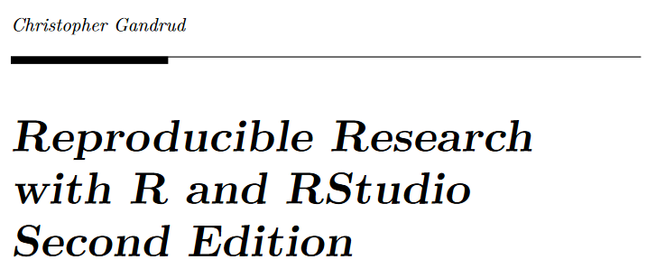

- [A crash course in reproducible research in R](http://t-redactyl.io/blog/2016/10/a-crash-course-in-reproducible-research-in-r.html)


# Word Dokumente mit R erstellen


## Ein Markdown Dokument mit Rstudio erzeugen


## Mein erstes mit R erzeugtes Word Dokument


## Erstes Beispiel


# Das Arbeiten mit Markdown

## Rmarkdown - erste Schritte

Markdown ist eine sehr einfache Syntax, die es Benutzern erlaubt, aus einfachen Textdateien gut gelayoutete Dokumente zu erstellen.

```
**fettes Beispiel**
*kursives Beispiel*
~~durchgestrichen~~
- Aufzählungspunkt
```

**fettes Beispiel**

*kursives Beispiel*

~~durchgestrichen~~

- Aufzählungspunkt

## Weitere Markdown Befehle

```
### Überschrift Ebene 3
#### Überschrift Ebene 4
[Meine Github Seite](https://github.com/Japhilko)
```

### Überschrift Ebene 3

#### Überschrift Ebene 4

[Meine Github Seite](https://github.com/Japhilko)

## Weitere Markdown Befehle

- So kann man Bilder einbinden:
- Man kann entweder einen Link angeben:

```

```

- oder einen (Unterordner) in dem das Bild liegt:

```

```

- in den eckigen Klammern steht die Bildunterschrift
- alle gängigen Formate (.png, .jpeg,.gif) können so eingebunden werden
- Man kann auch noch weitere Optionen spezifizieren (Größe, Breite etc.) - dazu später mehr

## Chunks - Erste Schritte

- Es lassen sich so genannte Chunks einfügen
- In diesen Chunks wird ganz normaler R-code geschrieben


## Button um Chunks einzufügen

- Die default Version eines Chunks ist R
- Man hat aber auch die Möglichkeit andere Programmiersprachen einzubinden


## Inline Code

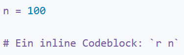


```r
n=100
```

Ein inline Codeblock: 100

## Chunk Optionen

- [Man kann den Chunks Optionen mitgeben:](https://yihui.name/knitr/options/)


Argument   Beschreibung                        
---------  ------------------------------------
eval       Soll Rcode evaluiert werden?        
warning    Sollen Warnings angezeigt werden?   
cache      Soll der Output gespeichert werden? 

- Bei eval kann ein logischer Wert angegeben werden oder eine/mehrere Nummer(n)  


## Optionen


## Optionen für Word Output

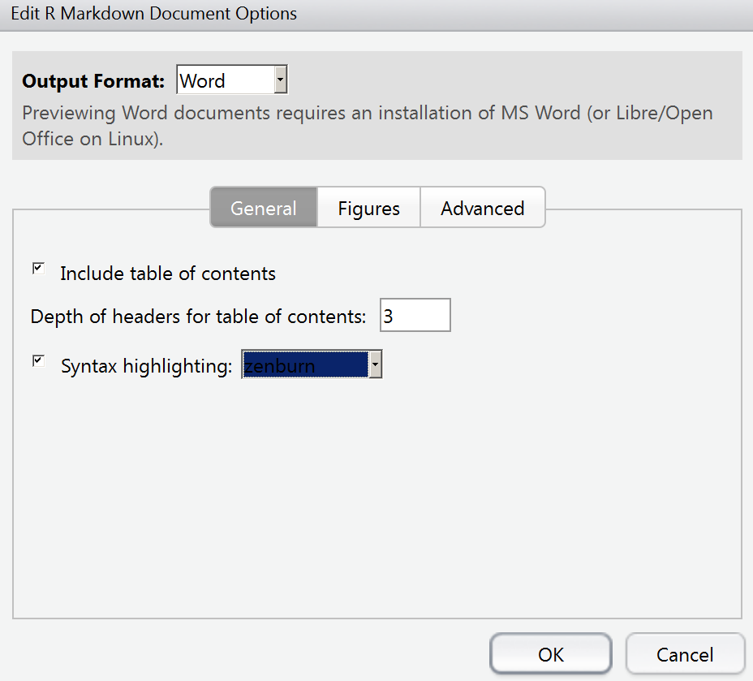

## Code Hervorhebung

- pygments Hervorhebung


- tango


## Das Paket `knitr`


```r
install.packages("knitr")
```


```r
library("knitr")
```

- Das Paket knitr enthält zahlreiche wichtige Funktionen
- Beispiel: Befehl `kable` um Tabellen zu erzeugen

## Eine Tabelle mit `kable` erzeugen


```r
a <- runif(10)
b <- rnorm(10)
ab <- cbind(a,b)
kable(ab)
```

         a            b
----------  -----------
 0.5611270    0.2488563
 0.0398190    0.2488782
 0.0136209    0.9069456
 0.6067626   -0.5155376
 0.5111370    0.0925989
 0.5834954   -1.3498267
 0.7095552    0.9639655
 0.3257896    0.0012648
 0.6230756   -1.2427838
 0.1862518    1.7444354

## [Vorlagen verwenden](http://rmarkdown.rstudio.com/articles_docx.html)

- Formatvorlagen können verändert werden

1. Ein Word Dokument mit Rmarkdown erstellen
2. Das Dokument in Word öffnen und Format verändern 
3. Vorlage als Referenz angeben

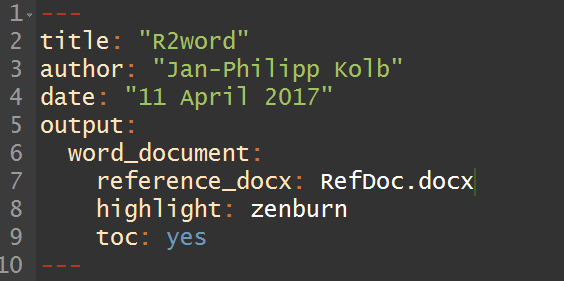


## Resourcen

- Interview - [Ein Word Dokument mit wenig Aufwand schreiben](https://www.r-statistics.com/2013/03/write-ms-word-document-using-r-with-as-little-overhead-as-possible/)

- [pander: Ein R Pandoc Wrapper](http://rapporter.github.io/pander/)

- [Ein Schummelzettel](https://www.rstudio.com/wp-content/uploads/2015/06/rmarkdown-german.pdf)

- [Einführung in Markdown](https://github.com/ctreffe/r-space/wiki/R-Markdown-Intro)

- [Warum TeX besser als Word ist](http://factorgrad.blogspot.de/2010/07/why-latex-is-superior-to-ms-word.html)


#	PDF Dokumente und Präsentationen mit LaTeX, Beamer und Sweave


## Präsentationen mit Rmarkdown - beamer Präsentationen


## Beamer Optionen

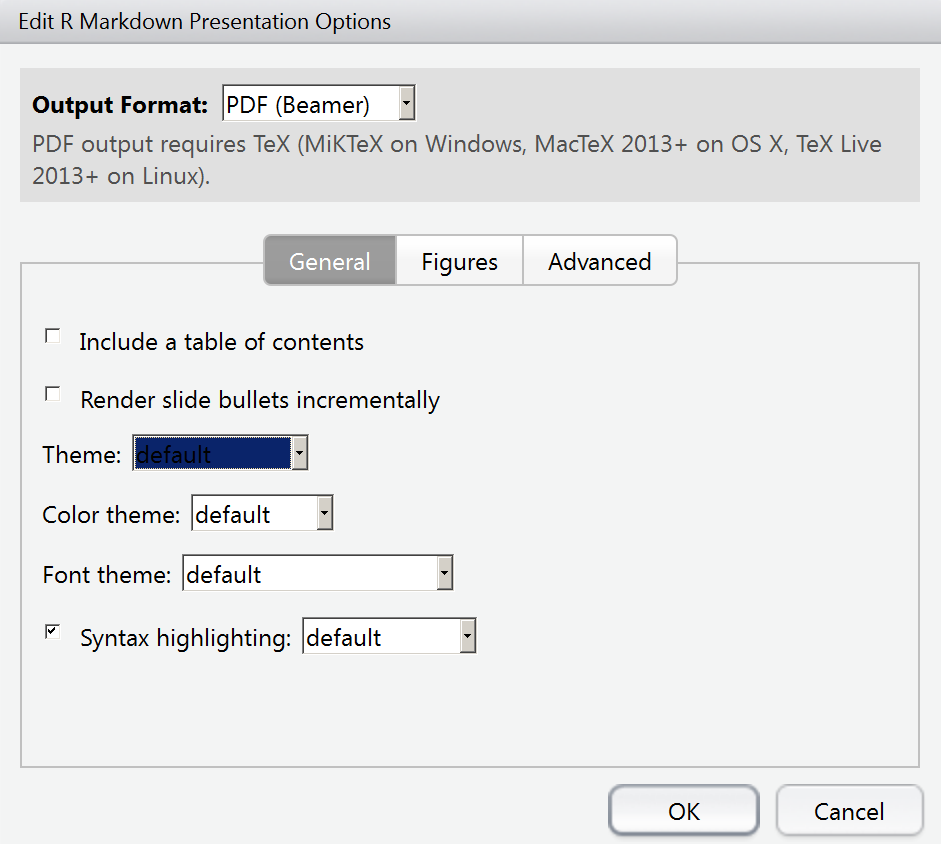

## Beamer Themen


## Chunks einfügen

- Auch hier lassen sich natürlich Chunks einfügen
- Wenn `cache=T` angegeben ist, wird das Ergebnis des Chunks abgespeichert
- Es ist sinnvoll die Chunks zu benennen, dann findet man auch das Ergebnis einfacher


## Ergebnis - Cache


## Wie man das im Header des Dokuments angibt

```
---
title: "Intro - Erste Schritte"
author: "Jan-Philipp Kolb"
date: "10 April 2017"
output:
  beamer_presentation: 
    colortheme: beaver
    theme: CambridgeUS
---
```

## Inhaltsverzeichnis I


## Inhaltsverzeichnis II

```
output: 
  beamer_presentation: 
    toc: yes
```


## Optionen für die Graphikeinbindung

- *fig_caption: false*, wenn man keine Bildunterschriften haben möchte


## Präsentationen mit Sweave

- Das Dokument erstellen

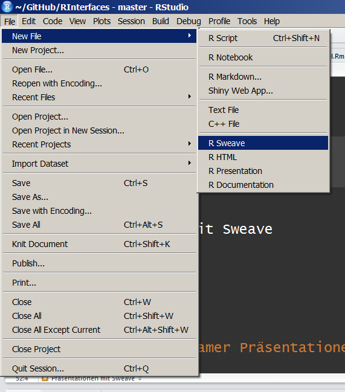

## Sweave Präsentation

- Ganz normaler LaTeX Code wird verwendet


## Chunks bei Sweave

- Auch hier kann R-code verwendet werden


## [Chunk Optionen](http://k-baeumchen.fuhlbrueck.net/R-und-LaTeX.html)

- Auch bei Sweave Chunks können Optionen mitgegeben werden

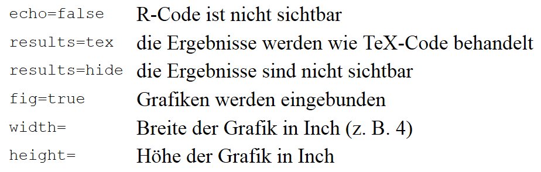

## Inline Code

- Manchmal braucht man das Ergebnis direkt auf der Folie

```
\Sexpr{}
```


## Inline Code - das Ergebnis


## PDF Paper mit R

- Mit R ist es möglich Berichte oder Paper zu erzeugen
- Dies eignet sich besonders gut, wenn man viel Code hat oder einen Bericht sehr oft erzeugen muss
- Literatur lässt sich am Besten mit einem bibtex file einbauen


## [Jabref](http://www.jabref.org/)

- Literaturverwaltungssystem

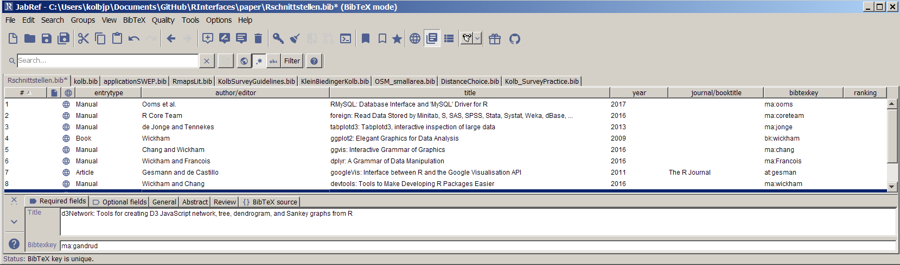

## Referenz mit R bekommen

- Mit dem Befehl `citation()` bekommt man sehr schnell die Referenz


```r
install.packages("RMySQL")
```


```r
citation("RMySQL")
```

```
## 
## To cite package 'RMySQL' in publications use:
## 
##   Jeroen Ooms, David James, Saikat DebRoy, Hadley Wickham and
##   Jeffrey Horner (2017). RMySQL: Database Interface and 'MySQL'
##   Driver for R. R package version 0.10.11.
##   https://CRAN.R-project.org/package=RMySQL
## 
## A BibTeX entry for LaTeX users is
## 
##   @Manual{,
##     title = {RMySQL: Database Interface and 'MySQL' Driver for R},
##     author = {Jeroen Ooms and David James and Saikat DebRoy and Hadley Wickham and Jeffrey Horner},
##     year = {2017},
##     note = {R package version 0.10.11},
##     url = {https://CRAN.R-project.org/package=RMySQL},
##   }
```


## Das bibtex file einbinden I


## Das bibtex file einbinden II

```
---
title: "R Schnittstellen"
author: "Jan-Philipp Kolb"
date: "21 April 2017"
output: 
  pdf_document: default
bibliography: Rschnittstellen.bib
---
```


## Das Ergebnis


## Links

- [Optionen für Beamer Präsentationen](http://rmarkdown.rstudio.com/beamer_presentation_format.html)

- [Wie R und LaTeX zusammen funktionieren](https://www.r-bloggers.com/from-openoffice-noob-to-control-freak-a-love-story-with-r-latex-and-knitr/)


# HTML Dokumente, Präsentationen und Dashboards mit Rmarkdown


## [Präsentationen - Rpres der einfachste Weg](https://rstudio-pubs-static.s3.amazonaws.com/27777_55697c3a476640caa0ad2099fe914ae5.html#/)


## Eine erste Präsentation


## Erste Daten eintragen

- Für Vergessliche:


```r
date()
```

```
## [1] "Fri May 05 15:22:39 2017"
```

## Eine Folie mit Formel

- Die Formel kann wie in LaTeX eingegeben werden

```
$$
\begin{equation}\label{eq2}
t_{i}=\sum\limits_{k=1}^{M_{i}}{y_{ik}}=M_{i}\bar{Y}_{i}. 
\end{equation}
$$
```


## Zwei Spalten

```
Folie mit zwei Spalten
====================================
Erste Spalte
***
Zweite Spalte
```

## Folienübergänge

```
transition: rotate
```


## [Weitere mögliche Folienübergänge](https://support.rstudio.com/hc/en-us/articles/200714013-Slide-Transitions-and-Navigation)


-    none
-    linear
-    rotate
-    fade
-    zoom
-    concave

## Folientypen

```
Ein neues Kapitel einfügen
====================================
type: section
```

```
Anderer Folientyp
====================================
type: prompt
```


```
Noch ein anderer Folientyp
====================================
type: alert
```

## [Die Schriftart wechseln](https://support.rstudio.com/hc/en-us/articles/200532307)

- Die [CSS Schrifttypen](https://www.w3schools.com/cssref/css_websafe_fonts.asp) können verwendet werden

```
Meine Präsentation
========================================
author: Jan-Philipp Kolb
font-family: 'Impact'
```

## Schrifttypen können auch importiert werden


```
Meine Präsentation
========================================
author: Jan-Philipp Kolb
font-import: http://fonts.googleapis.com/css?family=Risque
font-family: 'Risque'
```


## Kleineren Text

Normale Schriftgröße

```
<small>This sentence will appear smaller.</small>
```

## Die Präsentation anschauen

- Das Ergebnis ist hier zu sehen:

<http://rpubs.com/Japhilko82/FirstRpubs>


# Eine ioslides Präsentation

## Eine ioslides Präsentation


## [ioslides - Der Start](http://rmarkdown.rstudio.com/ioslides_presentation_format.html) 


## Weitere Dinge tun 


- Ein Bild einbinden

```

```

## Ein Logo hinzu

```
---
title: "ioslides Beispiel"
author: "Jan-Philipp Kolb"
date: "20 April 2017"
output: 
  ioslides_presentation:
    logo: figure/Rlogo.png
---
```


## Tabellen

- Quelle: [R Studio, and Presentations, and Git! Oh my!](https://www.r-bloggers.com/r-studio-and-presentations-and-git-oh-my/)


```r
library(knitr)
a <- data.frame(a=1:10,b=10:1)
kable(table(a))
```


  1    2    3    4    5    6    7    8    9   10
---  ---  ---  ---  ---  ---  ---  ---  ---  ---
  0    0    0    0    0    0    0    0    0    1
  0    0    0    0    0    0    0    0    1    0
  0    0    0    0    0    0    0    1    0    0
  0    0    0    0    0    0    1    0    0    0
  0    0    0    0    0    1    0    0    0    0
  0    0    0    0    1    0    0    0    0    0
  0    0    0    1    0    0    0    0    0    0
  0    0    1    0    0    0    0    0    0    0
  0    1    0    0    0    0    0    0    0    0
  1    0    0    0    0    0    0    0    0    0


## `knitr` Engines

- [knitr Language Engines](http://rmarkdown.rstudio.com/authoring_knitr_engines.html)

- [slidify](http://slidify.org/)


# Eine slidy Präsentation


## slidy Präsentationen


## [Was sind Cascading Style Files ([CSS](https://en.wikipedia.org/wiki/Cascading_Style_Sheets))?](https://de.wikipedia.org/wiki/Cascading_Style_Sheets)


- Stylesheet-Sprache für elektronische Dokumente
- eine der Kernsprachen des World Wide Webs.
- CSS wurde entworfen, um Darstellungsvorgaben weitgehend von den Inhalten zu trennen

### CSS und R

- [Custom CSS](http://rmarkdown.rstudio.com/html_document_format.html#custom_css)
- [CSS pro tipps](https://github.com/AllThingsSmitty/css-protips#use-a-css-reset)

## Beispiel CSS


## Das CSS ändern

Um den Präsentationstyp zu ändern kann man das CSS verändern

- [Cascading Style Sheets](https://de.wikipedia.org/wiki/Cascading_Style_Sheets) (CSS)

- Bspw. lässt sich die [Farbe (HTML)](http://tomheller.de/html-farben.html) ändern.
- [Man kann eine andere Schriftart wählen](https://www.mediaevent.de/css/font-family.html)
- [Es gibt zahlreiche Möglichkeiten der Schriftformatierung](https://wiki.selfhtml.org/wiki/CSS/Eigenschaften/Schriftformatierung)
- [Daneben gibt es viele weitere Dinge, die sich mit dem CSS steuern lassen](https://www.w3.org/TR/WCAG20-TECHS/C22.html)

# HTML Dokumente

## Ein HTML Dokument erzeugen

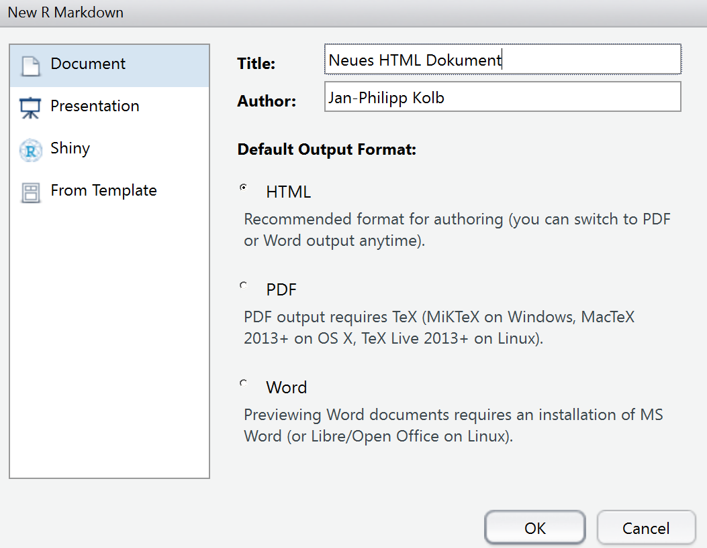

## Ein Template verwenden


## [Weitere Vorlagen nutzen](http://rmarkdown.rstudio.com/developer_document_templates.html)

- Es gibt viele Formate - [manche müssen erst aktiviert werden](https://blog.rstudio.org/2016/03/21/r-markdown-custom-formats/):


```r
install.packages("rticles")
```

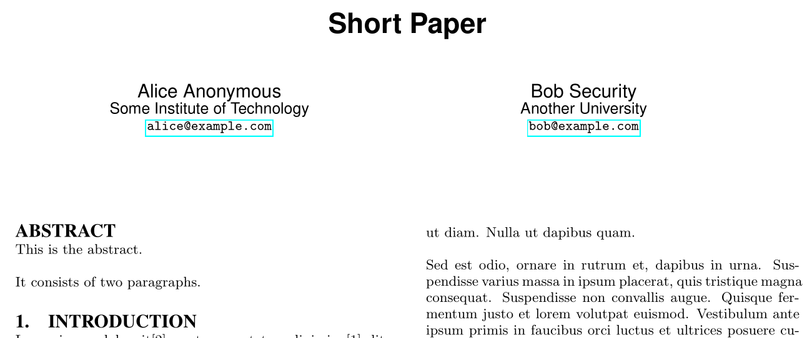


## Das Paket `rmdformats`


```r
install.packages("rmdformats")
install.packages("ProjectTemplate")
```


## [Beispiele für Templates](https://github.com/juba/rmdformats)


# Dashboards

## [Beispiel R-Pakete](https://gallery.shinyapps.io/cran-gauge/)

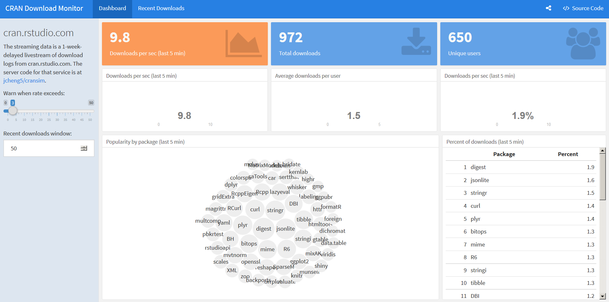


## [Paket installieren](https://blog.rstudio.org/2016/05/17/flexdashboard-easy-interactive-dashboards-for-r/)


```r
install.packages("flexdashboard", type = "source")
```

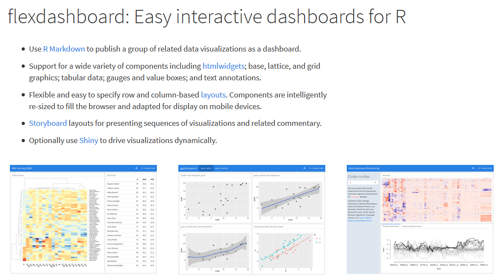

## Ein Dashboard erstellen mit Rstudio


## [Gallerie](http://rmarkdown.rstudio.com/gallery.html)


```r
install.packages("highcharter", type = "source")
```


## [Mein erstes Dashboard](http://rpubs.com/Japhilko82/whcsites)

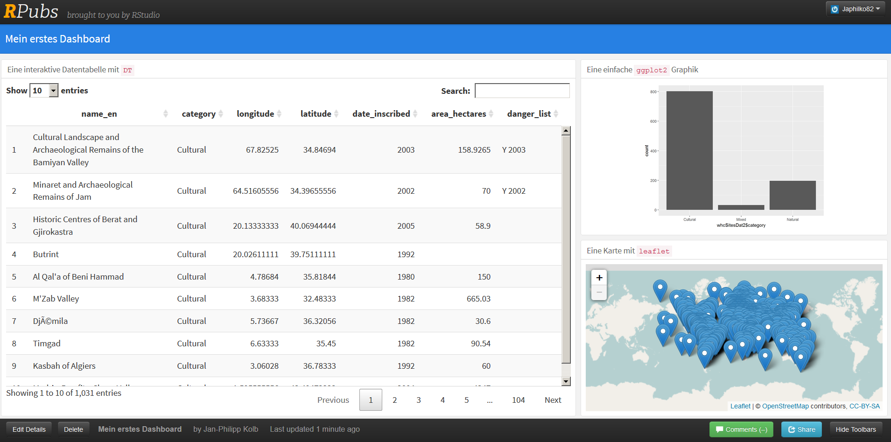

## Links 

- [Verschiedene Markdown Dokumente zusammen fügen](http://stackoverflow.com/questions/25824795/how-to-combine-two-rmarkdown-rmd-files-into-a-single-output)

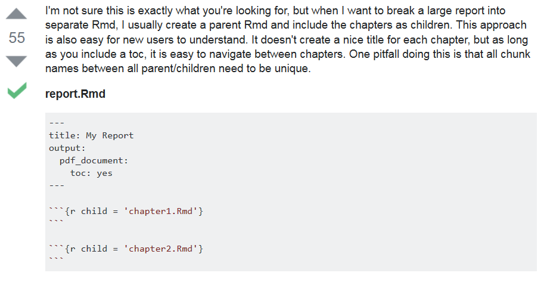


- [Verschiedene CSS Fonts](http://www.cssfontstack.com/)

# Notebooks zur Integration von anderen Programmiersprachen (Python,LaTeX,Julia)


## Notebooks

- [Warum R Notebook nutzen](https://news.ycombinator.com/item?id=12683625)


# Rnotebooks

## Ein Rnotebook anlegen


## Rnotebook - erste Schritte

- Es lassen sich so genannte Chunks einfügen
- In diesen Chunks wird ganz normaler R-code geschrieben


## Python Code integrieren

- Ebenso lässt sich [Python code implementieren](https://support.rstudio.com/hc/en-us/articles/233066128-Do-Notebooks-support-other-languages-)


```python
import sys
print(sys.version)
```

```
## 3.5.2 (v3.5.2:4def2a2901a5, Jun 25 2016, 22:01:18) [MSC v.1900 32 bit (Intel)]
```

## [LaTeX Code integieren](https://blog.rstudio.org/2016/10/05/r-notebooks/)

- LaTeX code wird mit zwei Dollarzeichen gekennzeichnet


## Notebook veröffentlichen I


## Notebook veröffentlichen II


# Andere Notebooks

## [Jupyter Notebook](http://jupyter.readthedocs.io/en/latest/install.html)


- [Anaconda installieren](https://docs.continuum.io/anaconda/install)
- folgenden Befehl in die Eingabeaufforderung eingeben
- Bei Windows findet man diese, wenn man `cmd` in Suche eingibt.

```
jupyter notebook
```
## Start Jupyter Notebook

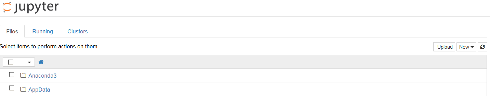

## Beispiel Eingabe Code


# Beaker Notebook

## Beaker Notebook

- Auch bei Beaker kann man R-code einbauen

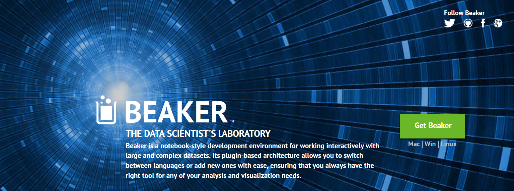

## Beaker starten

- [Beaker installieren](http://beakernotebook.com/getting-started) ...
- ... und mit `beaker.command.bat` starten


## Links

- [knitr Language Engines](http://rmarkdown.rstudio.com/authoring_knitr_engines.html)

- [More engines](https://yihui.name/knitr/demo/engines/)

- [Andere Programmiersprachen können eingebunden werden](http://rmarkdown.rstudio.com/authoring_knitr_engines.html)

- [Video - Einführung in Rnotebook](https://www.rstudio.com/resources/webinars/introducing-notebooks-with-r-markdown/)

- [R Notebooks](http://rmarkdown.rstudio.com/r_notebooks.html)

- [IPython vs knitr, or Python vs R](https://yihui.name/en/2012/11/ipython-vs-knitr/)

- [Datacamp Tutorial - Jupyter Notebook](https://www.datacamp.com/community/tutorials/tutorial-jupyter-notebook#gs.kZqvIvI)

- [Better interactive data science with Beaker and Rodeo](https://blog.dominodatalab.com/interactive-data-science/)

- [Knit directly to jupyter notebooks from RStudio](https://www.r-bloggers.com/knit-directly-to-jupyter-notebooks-from-rstudio/)

- [Python-Markdown](https://pythonhosted.org/Markdown/)

- [Podcast](https://talkpython.fm/episodes/show/96/exploring-awesome-python)


## Aufgabe: Bearbeiten Sie ein Notebook weiter

- Suchen Sie [folgendes Notebook](https://raw.githubusercontent.com/Japhilko/RInterfaces/master/misc/notebooks/Geokodierung_ggmap.Rmd) auf meinem Github Ordner:


- Lassen Sie sich die Raw Version anzeigen


- Laden Sie das Notebook herunter:


- Und bearbeiten Sie es so weiter, dass sie die Geokodierung für eine Adresse bekommen, die für Sie interessant ist (Hbf, Hotel, Restaurant etc.)


