# R Schnittstellen - Dritter Teil
Jan-Philipp Kolb  
9 Mai 2017  


## Internetresourcen und Schnittstellen nutzen


## JavaScript Object Notation


<!--


-->

## [GeoJSON](http://cannoneyed.github.io/geojson/)


## [OpenStreetMap Daten](https://rstudio.github.io/leaflet/json.html)


## Import von JSON-Objekten und XML Dateien


# Import von JSON Dateien

## [JavaScript Object Notation (JSON)](https://de.wikipedia.org/wiki/JavaScript_Object_Notation)

- Jedes gültige JSON-Dokument soll ein gültiges JavaScript sein
- JSON wird zur Übertragung und zum Speichern von strukturierten Daten eingesetzt
- Insbesondere bei Webanwendungen und mobilen Apps wird es in Verbindung mit JavaScript, Ajax oder WebSockets zum Transfer von Daten zwischen dem Client und dem Server häufig genutzt.
<!--

-->


## Das GeoJSON Format

- GeoJSON ist ein offenes Format um geografische Daten nach der Simple-Feature-Access-Spezifikation zu repräsentieren. 
- Dafür wird die JavaScript Object Notation verwendet.

Die Struktur der Daten kann man sich mit einem [JSON Viewer anschauen](http://jsonviewer.stack.hu/)


## [Download von Beispieldaten](https://overpass-turbo.eu/)

- Overpass Turbo kann verwendet werden um Beispieldaten zu bekommen

<https://overpass-turbo.eu/>


## Exkurs OpenStreetMap Daten

- Auf Overpass Turbo können Daten für Map Features exportiert werden
- Eine Liste der erhältlichen Map Features gibt es auf <http://wiki.openstreetmap.org/wiki/DE:Map_Features>


## [Beispiele für GeoJSON](https://de.wikipedia.org/wiki/GeoJSON)


## JSON importieren


```r
library("jsonlite")
```

```
## Warning: package 'jsonlite' was built under R version 3.3.3
```

```r
DRINKWATER <- fromJSON("data/RomDrinkingWater.geojson")
```


```r
names(DRINKWATER)[1:3]
```

```
## [1] "type"      "generator" "copyright"
```

```r
names(DRINKWATER)[4:5]
```

```
## [1] "timestamp" "features"
```

## Die Daten anschauen


```r
head(DRINKWATER$features)
```


```
##      type             id properties.@id properties.amenity properties.flow
## 1 Feature node/246574149 node/246574149     drinking_water     push-button
## 2 Feature node/246574150 node/246574150     drinking_water            <NA>
## 3 Feature node/246574151 node/246574151     drinking_water            <NA>
## 4 Feature node/248743324 node/248743324     drinking_water            <NA>
## 5 Feature node/251773348 node/251773348     drinking_water            <NA>
## 6 Feature node/251773551 node/251773551     drinking_water            <NA>
##   properties.type properties.name properties.name:fr properties.wheelchair
## 1          nasone            <NA>               <NA>                  <NA>
## 2            <NA>            <NA>               <NA>                  <NA>
## 3            <NA>            <NA>               <NA>                  <NA>
## 4            <NA>            <NA>               <NA>                  <NA>
## 5          nasone            <NA>               <NA>                  <NA>
## 6            <NA>    Acqua Marcia        Eau potable                   yes
##   properties.created_by properties.indoor geometry.type
## 1                  <NA>              <NA>         Point
## 2                  <NA>              <NA>         Point
## 3                  <NA>              <NA>         Point
## 4                  <NA>              <NA>         Point
## 5                  <NA>              <NA>         Point
## 6                  <NA>              <NA>         Point
##   geometry.coordinates
## 1   12.49191, 41.89479
## 2   12.49095, 41.89489
## 3   12.48774, 41.89450
## 4   12.48773, 41.89354
## 5   12.48529, 41.88539
## 6   12.48386, 41.89332
```

## [Github JSON Daten](https://cran.r-project.org/web/packages/jsonlite/vignettes/json-apis.html)

- Es lassen sich auch Dinge aus dem Web auslesen:


```r
my_repos <- fromJSON("https://api.github.com/users/japhilko/repos")
```


```r
names(my_repos)
```

```
##  [1] "id"                "name"              "full_name"        
##  [4] "owner"             "private"           "html_url"         
##  [7] "description"       "fork"              "url"              
## [10] "forks_url"         "keys_url"          "collaborators_url"
## [13] "teams_url"         "hooks_url"         "issue_events_url" 
## [16] "events_url"        "assignees_url"     "branches_url"     
## [19] "tags_url"          "blobs_url"         "git_tags_url"     
## [22] "git_refs_url"      "trees_url"         "statuses_url"     
## [25] "languages_url"     "stargazers_url"    "contributors_url" 
## [28] "subscribers_url"   "subscription_url"  "commits_url"      
## [31] "git_commits_url"   "comments_url"      "issue_comment_url"
## [34] "contents_url"      "compare_url"       "merges_url"       
## [37] "archive_url"       "downloads_url"     "issues_url"       
## [40] "pulls_url"         "milestones_url"    "notifications_url"
## [43] "labels_url"        "releases_url"      "deployments_url"  
## [46] "created_at"        "updated_at"        "pushed_at"        
## [49] "git_url"           "ssh_url"           "clone_url"        
## [52] "svn_url"           "homepage"          "size"             
## [55] "stargazers_count"  "watchers_count"    "language"         
## [58] "has_issues"        "has_projects"      "has_downloads"    
## [61] "has_wiki"          "has_pages"         "forks_count"      
## [64] "mirror_url"        "open_issues_count" "forks"            
## [67] "open_issues"       "watchers"          "default_branch"
```


## [Weiteres Beispiel für JSON Daten](https://cran.r-project.org/web/packages/jsonlite/vignettes/json-apis.html)

- Die [Ergast Developer API](http://ergast.com/mrd/) ist ein experimenteller Web Service, der eine historische Aufzeichnung von Motorsportdaten liefert.


## Ergast Daten lesen


```r
library(jsonlite)
res <- fromJSON('http://ergast.com/api/f1/2004/1/results.json')
drivers <- res$MRData$RaceTable$Races$Results[[1]]$Driver
colnames(drivers)
```

```
## [1] "driverId"        "code"            "url"             "givenName"      
## [5] "familyName"      "dateOfBirth"     "nationality"     "permanentNumber"
```

## Daten der New York Times

- Die New York Times hat mehrere APIs als Teil des NYT-Entwickler-Netzwerks.
- Es ist eine Schnittstelle zu Daten aus verschiedenen Abteilungen, wie Nachrichtenartikel, Buchbesprechungen, Immobilien, etc. 
- Registrierung ist erforderlich (aber kostenlos) und ein Schlüssel kann [hier](http://developer.nytimes.com/signup) erhalten werden. 

## New York Times Beispiel


```r
article_key <- "&api-key=c2fede7bd9aea57c898f538e5ec0a1ee:6:68700045"
url <- "http://api.nytimes.com/svc/search/v2/articlesearch.json?q=obamacare+socialism"
req <- fromJSON(paste0(url, article_key))
articles <- req$response$docs
colnames(articles)
```

```
##  [1] "web_url"           "snippet"           "lead_paragraph"   
##  [4] "abstract"          "print_page"        "blog"             
##  [7] "source"            "multimedia"        "headline"         
## [10] "keywords"          "pub_date"          "document_type"    
## [13] "news_desk"         "section_name"      "subsection_name"  
## [16] "byline"            "type_of_material"  "_id"              
## [19] "word_count"        "slideshow_credits"
```

# Import von XML Dateien

## Das `XML` Paket


```r
library(XML)
citation("XML")
```

```
## 
## To cite package 'XML' in publications use:
## 
##   Duncan Temple Lang and the CRAN Team (2016). XML: Tools for
##   Parsing and Generating XML Within R and S-Plus. R package
##   version 3.98-1.5. https://CRAN.R-project.org/package=XML
## 
## A BibTeX entry for LaTeX users is
## 
##   @Manual{,
##     title = {XML: Tools for Parsing and Generating XML Within R and S-Plus},
##     author = {Duncan Temple Lang and the CRAN Team},
##     year = {2016},
##     note = {R package version 3.98-1.5},
##     url = {https://CRAN.R-project.org/package=XML},
##   }
## 
## ATTENTION: This citation information has been auto-generated from
## the package DESCRIPTION file and may need manual editing, see
## 'help("citation")'.
```


## Erstes Beispiel


```r
url <- "http://api.openstreetmap.org/api/0.6/
relation/62422"
```


```r
library(xml2)
BE <- xmlParse(url)
```


## Das XML analysieren

- [Tobi Bosede - Working with XML Data in R](http://www.informit.com/articles/article.aspx?p=2215520)


```r
xmltop = xmlRoot(BE)
class(xmltop)
```

```
## [1] "XMLInternalElementNode" "XMLInternalNode"       
## [3] "XMLAbstractNode"
```

```r
xmlSize(xmltop)
```

```
## [1] 1
```

```r
xmlSize(xmltop[[1]])
```

```
## [1] 328
```


## Nutzung von Xpath

[Xpath](https://de.wikipedia.org/wiki/XPath), the XML Path Language, is a query language for selecting nodes from an XML document. 


```r
xpathApply(BE,"//tag[@k = 'source:population']")
```

```
## [[1]]
## <tag k="source:population" v="http://www.statistik-berlin-brandenburg.de/Publikationen/Stat_Berichte/2010/SB_A1-1_A2-4_q01-10_BE.pdf 2010-10-01"/> 
## 
## attr(,"class")
## [1] "XMLNodeSet"
```

## Node parsen


```r
url2 <- "http://api.openstreetmap.org/api/0.6/node/2923760808"
RennesBa <- xmlParse(url2)
```


## Way parsen


```r
url3 <- "http://api.openstreetmap.org/api/0.6/way/72799743"
MadCalle <- xmlParse(url3)
```


## Mehr Beispiele, wie man mit XML Daten umgeht:


- [Daten aus XML extrahieren](http://www.stat.berkeley.edu/~statcur/Workshop2/Presentations/XML.pdf)

<http://www.stat.berkeley.edu/~statcur/Workshop2/Presentations/XML.pdf>

- Duncan Temple Lang - [A Short Introduction to the XML package for R](http://www.omegahat.net/RSXML/shortIntro.pdf)

<http://www.omegahat.net/RSXML/shortIntro.pdf>

## Noch mehr Informationen

- [Web Daten manipulieren](http://www.di.fc.ul.pt/~jpn/r/web/index.html#parsing-xml)

<http://www.di.fc.ul.pt/~jpn/r/web/index.html#parsing-xml>

- [Tutorial zu xquery](http://www.w3schools.com/xml/xquery_intro.asp)

<http://www.w3schools.com/xml/xquery_intro.asp>

- [R und das Web (für Anfänger), Teil II: XML und R](http://giventhedata.blogspot.de/2012/06/r-and-web-for-beginners-part-ii-xml-in.html)

<http://giventhedata.blogspot.de/2012/06/r-and-web-for-beginners-part-ii-xml-in.html>

- [String Manipulation](http://gastonsanchez.com/Handling_and_Processing_Strings_in_R.pdf)

<http://gastonsanchez.com/Handling_and_Processing_Strings_in_R.pdf>

## Referenzen


```r
citation("XML")
```

```
## 
## To cite package 'XML' in publications use:
## 
##   Duncan Temple Lang and the CRAN Team (2016). XML: Tools for
##   Parsing and Generating XML Within R and S-Plus. R package
##   version 3.98-1.5. https://CRAN.R-project.org/package=XML
## 
## A BibTeX entry for LaTeX users is
## 
##   @Manual{,
##     title = {XML: Tools for Parsing and Generating XML Within R and S-Plus},
##     author = {Duncan Temple Lang and the CRAN Team},
##     year = {2016},
##     note = {R package version 3.98-1.5},
##     url = {https://CRAN.R-project.org/package=XML},
##   }
## 
## ATTENTION: This citation information has been auto-generated from
## the package DESCRIPTION file and may need manual editing, see
## 'help("citation")'.
```

## Links

- [XML parsen - Stackoverflow](http://stackoverflow.com/questions/17198658/how-to-parse-xml-to-r-data-frame)

- [Processing of GeoJson data in R](https://www.r-bloggers.com/processing-of-geojson-data-in-r/)

## Die Pakete rvest und RCurl


## Das Paket `rvest`


```r
library(rvest)
ht <- read_html('https://www.google.co.in/search?q=guitar+repair+workshop')
links <- ht %>% html_nodes(xpath='//h3/a') %>% html_attr('href')
gsub('/url\\?q=','',sapply(strsplit(links[as.vector(grep('url',links))],split='&'),'[',1))
```

```
##  [1] "http://theguitarrepairworkshop.com/"                                                                   
##  [2] "http://www.guitarservices.com/"                                                                        
##  [3] "http://www.guitarrepairbench.com/guitar-building-projects/guitar-workshop/guitar-workshop-project.html"
##  [4] "https://www.facebook.com/The-Guitar-Repair-Workshop-847517635259712/"                                  
##  [5] "https://www.taylorguitars.com/dealer/guitar-repair-workshop-ltd"                                       
##  [6] "http://www.laweekly.com/music/10-best-guitar-repair-shops-in-los-angeles-4647166"                      
##  [7] "https://www.justdial.com/Mumbai/Guitar-Repair-Services/nct-10988623"                                   
##  [8] "https://www.justdial.com/Delhi-NCR/Guitar-Repair-Services/nct-10988623"                                
##  [9] "http://guitarworkshopglasgow.com/pages/repairs-1"                                                      
## [10] "http://www.google.co.in/aclk?sa=l"
```

## Links

- [Scraping CRAN with rvest](https://www.r-bloggers.com/scraping-cran-with-rvest/)

## Webscraping


## Notwendige Pakete


```r
install.packages("tidyverse")
```


```r
library(tidyverse)
library(stringr)
library(forcats)
library(ggmap)
library(rvest)
```

## SCRAPE DATA FROM WIKIPEDIA


```r
html.world_ports <- read_html("https://en.wikipedia.org/wiki/List_of_busiest_container_ports")
df.world_ports <- html_table(html_nodes(html.world_ports, "table")[[2]], fill = TRUE)
```

## Die Daten anschauen


```r
glimpse(df.world_ports)
```

```
## Observations: 50
## Variables: 15
## $ Rank     <int> 1, 2, 3, 4, 5, 6, 7, 8, 9, 10, 11, 12, 13, 14, 15, 16...
## $ Port     <chr> "Shanghai", "Singapore", "Shenzhen", "Ningbo-Zhoushan...
## $ Economy  <chr> "China", "Singapore", "China", "China", "Hong Kong", ...
## $ 2015[1]  <chr> "36,516", "30,922", "24,142", "20,636", "20,073", "19...
## $ 2014[2]  <chr> "35,268", "33,869", "23,798", "19,450", "22,374", "18...
## $ 2013[3]  <chr> "33,617", "32,240", "23,280", "17,351", "22,352", "17...
## $ 2012[4]  <chr> "32,529", "31,649", "22,940", "16,670", "23,117", "17...
## $ 2011[5]  <chr> "31,700", "29,937", "22,570", "14,686", "24,384", "16...
## $ 2010[6]  <chr> "29,069", "28,431", "22,510", "13,144", "23,532", "14...
## $ 2009[7]  <chr> "25,002", "25,866", "18,250", "10,502", "20,983", "11...
## $ 2008[8]  <chr> "27,980", "29,918", "21,414", "11,226", "24,248", "13...
## $ 2007[9]  <chr> "26,150", "27,932", "21,099", "9,349", "23,881", "13,...
## $ 2006[10] <chr> "21,710", "24,792", "18,469", "7,068", "23,539", "12,...
## $ 2005[11] <chr> "18,084", "23,192", "16,197", "5,208", "22,427", "11,...
## $ 2004[12] <chr> "14,557", "21,329", "13,615", "4,006", "21,984", "11,...
```


## Das Paket `rvest`


```r
library(rvest)
ht <- read_html('https://www.google.co.in/search?q=guitar+repair+workshop')
links <- ht %>% html_nodes(xpath='//h3/a') %>% html_attr('href')
gsub('/url\\?q=','',sapply(strsplit(links[as.vector(grep('url',links))],split='&'),'[',1))
```

```
##  [1] "http://theguitarrepairworkshop.com/"                                                                   
##  [2] "http://www.guitarservices.com/"                                                                        
##  [3] "http://www.guitarrepairbench.com/guitar-building-projects/guitar-workshop/guitar-workshop-project.html"
##  [4] "https://www.facebook.com/The-Guitar-Repair-Workshop-847517635259712/"                                  
##  [5] "https://www.taylorguitars.com/dealer/guitar-repair-workshop-ltd"                                       
##  [6] "http://www.laweekly.com/music/10-best-guitar-repair-shops-in-los-angeles-4647166"                      
##  [7] "https://www.justdial.com/Mumbai/Guitar-Repair-Services/nct-10988623"                                   
##  [8] "https://www.justdial.com/Delhi-NCR/Guitar-Repair-Services/nct-10988623"                                
##  [9] "http://guitarworkshopglasgow.com/pages/repairs-1"                                                      
## [10] "http://www.google.co.in/aclk?sa=l"
```


## Links

- [How to really do an analysis in R (part 1, data manipulation)](https://www.r-bloggers.com/how-to-really-do-an-analysis-in-r-part-1-data-manipulation/)

- [Read CSV From The Web](http://www.programmingr.com/examples/read-csv-web/)

- [Scraping CRAN with rvest](https://www.r-bloggers.com/scraping-cran-with-rvest/)

## Use Case - Scraping Wikipedia


## Einleitung

Im Folgenden werde ich zeigen, wie man Textinformationen aus [Wikipedia](https://www.wikipedia.org/) herunterladen, verarbeiten und analysieren kann.


```r
install.packages("NLP")
install.packages("tm")
install.packages("FactoMineR")
```


## Die verwendeten Pakete

- Das R-Paket [`stringi`](http://stringi.rexamine.com/) von Marek Gagolewski and Bartek Tartanus bietet Möglichkeiten zur String Verarbeitung.


```r
library("stringi")
```

- [`tm`](http://www.jstatsoft.org/v25/i05/) ist ein R-Paket um Text Mining zu realisieren. Es wurde von Ingo Feinerer, Kurt Hornik, und David Meyer geschrieben.


```r
library("tm")
```

- Und schließlich brauchen wir das [`FactoMineR`](https://cran.r-project.org/web/packages/FactoMineR/vignettes/FactoMineR.pdf)-Paket, das von Sebastien Le, Julie Josse und Francois Husson zur Durchführung der Hauptkomponentenanalyse erstellt wurde.


```r
library("FactoMineR")
```


## Die Text Daten herunterladen

- Als Beispiel verwenden wir Daten zu verschiedenen Krankheiten. 
- In diesem Fall habe ich 7 deutsche Webseiten für Infektionskrankheiten ausgewählt.


```r
wiki <- "http://de.wikipedia.org/wiki/"

titles <- c("Zika-Virus", "Influenza-A-Virus_H1N1", 
            "Spanische_Grippe","Influenzavirus",
            "Vogelgrippe_H5N1",
            "Legionellose-Ausbruch_in_Warstein_2013",
            "Legionellose-Ausbruch_in_Jülich_2014")
```

## Das Herunterladen der Seiten

- Zunächst wird ein Container erstellt um die Ergebnisse abzuspeichern
- Dann wird der Text für jeden Artikel heruntergeladen und in dem Container gespeichert.


```r
articles <- character(length(titles))

for (i in 1:length(titles)){
    articles[i] <- stri_flatten(
      readLines(stri_paste(wiki, titles[i])), col = " ")
}

docs <- Corpus(VectorSource(articles))
```

## Die Daten vorbereiten

Das Folgende basiert auf einem Blogpost von Norbert Ryciak über die [automatische Kategorisierung von Wikipedia-Artikeln](http://www.rexamine.com/2014/06/text-mining-in-r-automatic-categorization-of-wikipedia-artikel/).

- Eine Fehlermeldung ist aufgetreten, als ich den Code ausgewertet habe.
- Es war möglich, dieses Problem mit Hinweisen aus einer [Diskussion auf Stackoverflow](http://stackoverflow.com/questions/24191728/documenttermmatrix-error-on-corpus-argument) zu lösen.


```r
docs2 <- tm_map(docs, function(x) stri_replace_all_regex(
  x, "<.+?>", " "))
docs3 <- tm_map(docs2, function(x) stri_replace_all_fixed(
  x, "\t", " "))
```

## Den Text weiterverarbeiten


```r
docs4 <- tm_map(docs3, PlainTextDocument)
docs5 <- tm_map(docs4, stripWhitespace)
docs6 <- tm_map(docs5, removeWords, stopwords("german"))
docs7 <- tm_map(docs6, removePunctuation)
docs8 <- tm_map(docs7, tolower)
# docs8 <- tm_map(docs8, PlainTextDocument)
```


```r
dtm <- DocumentTermMatrix(docs8)  
```


## [Principal Component Analysis](https://dzone.com/articles/manipulate-clusters-of-texts)

- Der folgende Code ist auf einem Blog post von  Arthur Charpentier über das Mining von Wikipedia basiert. 


```r
dtm2 <- as.matrix(dtm)
frequency <- colSums(dtm2)
frequency <- sort(frequency, decreasing=TRUE)
words <- frequency[frequency>20]
s <- dtm2[1,which(colnames(dtm2) %in% names(words))]

for(i in 2:nrow(dtm2)){
  s <- cbind(s,dtm2[i,which(colnames(dtm2) %in% 
                              names(words))])
} 

colnames(s) <- titles
```

## Ergebnis


```r
PCA(s)
```

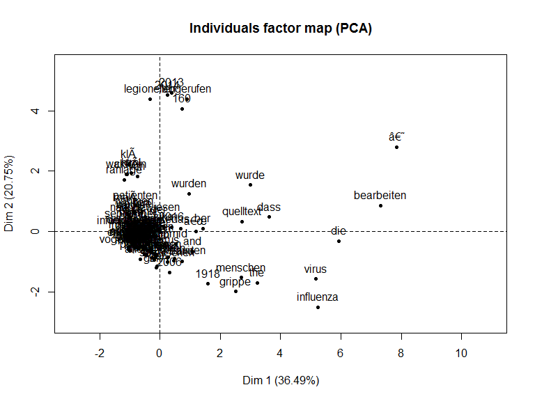<!-- -->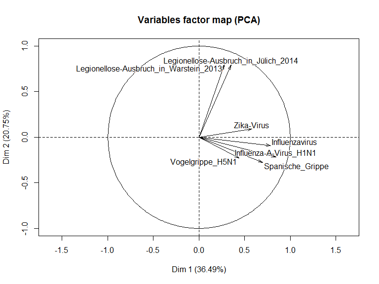<!-- -->

```
## **Results for the Principal Component Analysis (PCA)**
## The analysis was performed on 125 individuals, described by 7 variables
## *The results are available in the following objects:
## 
##    name               description                          
## 1  "$eig"             "eigenvalues"                        
## 2  "$var"             "results for the variables"          
## 3  "$var$coord"       "coord. for the variables"           
## 4  "$var$cor"         "correlations variables - dimensions"
## 5  "$var$cos2"        "cos2 for the variables"             
## 6  "$var$contrib"     "contributions of the variables"     
## 7  "$ind"             "results for the individuals"        
## 8  "$ind$coord"       "coord. for the individuals"         
## 9  "$ind$cos2"        "cos2 for the individuals"           
## 10 "$ind$contrib"     "contributions of the individuals"   
## 11 "$call"            "summary statistics"                 
## 12 "$call$centre"     "mean of the variables"              
## 13 "$call$ecart.type" "standard error of the variables"    
## 14 "$call$row.w"      "weights for the individuals"        
## 15 "$call$col.w"      "weights for the variables"
```

## Ergebnis

- In der Factor Map sehen wir das erwartete Ergebnis. 
- Die Seiten zur Legionnellen Krankheit sind  sehr nah beianander, während die Seiten zur Influenza in einem anderen Teil sind. 

## Das Dendogramm


- Im Folgenden wird die Normalisierung durchgeführt und die Ergebnisse werden geplottet. 


```r
s0 <- s/apply(s,1,sd)
h <- hclust(dist(t(s0)), method = "ward")

plot(h, labels = titles, sub = "")
```

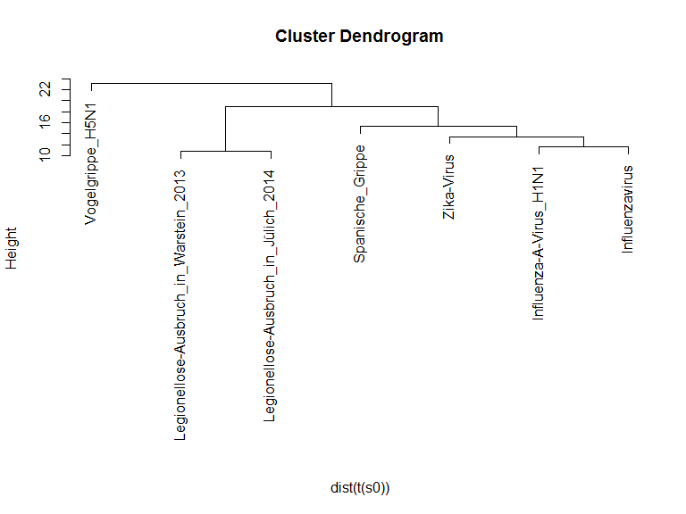<!-- -->


- [Youtube Video zu Text Mining](https://www.youtube.com/watch?v=j1V2McKbkLo)


## Applikationen und Projektverwaltung mit Rstudio und git

## Shiny Apps 


## Der Start

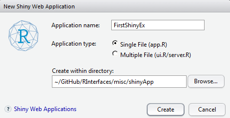

## Die erste App


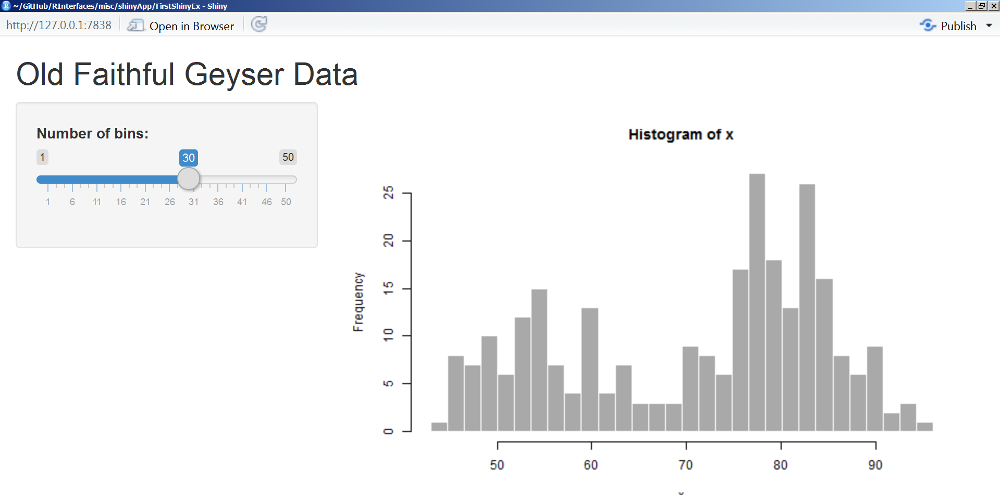

## R und Git


## Rstudio und git - ein Projekt anlegen


## Ein Projekt mit Versionskontrolle

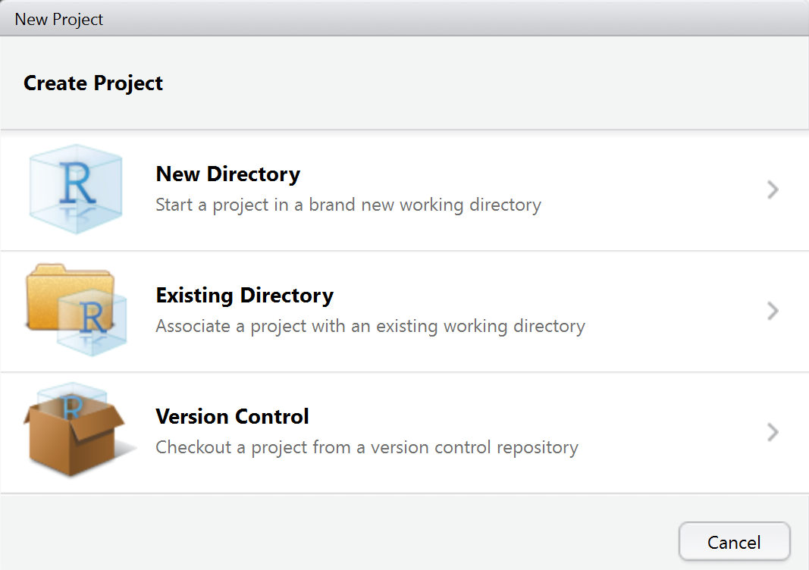

## Auswahl Versionskontrolle

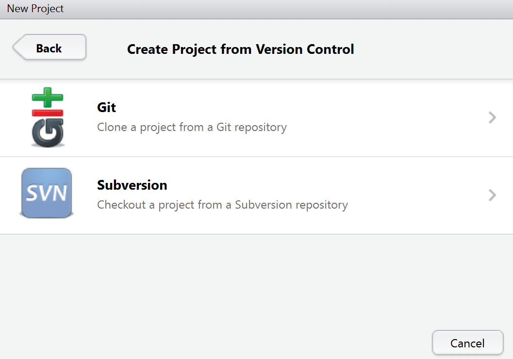

## Ein Projekt clonen

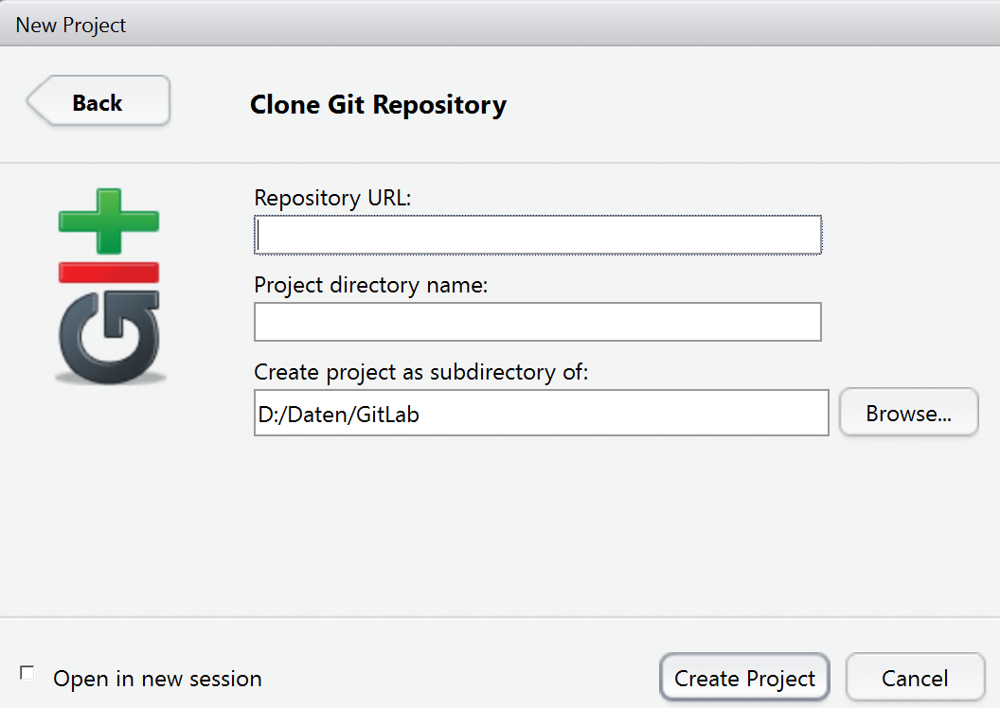

## Der git-Reiter in Rstudio

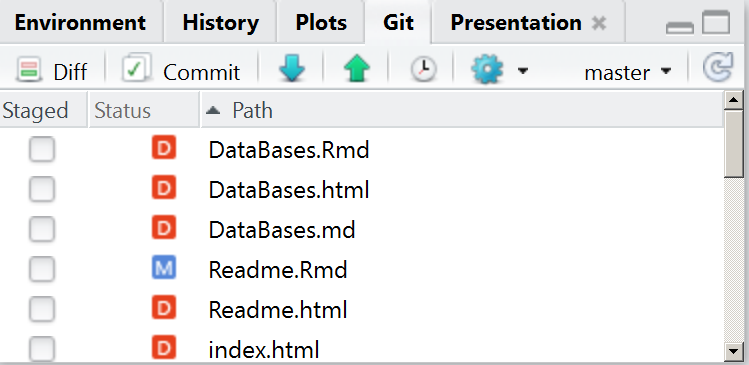

## Aktuelle eigene Änderungen committen

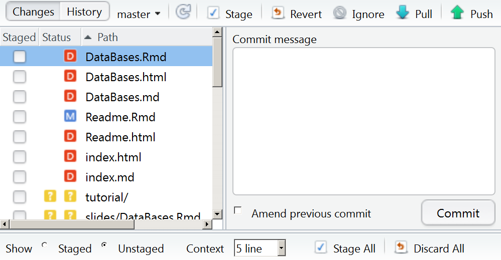


## Links

- [Commit failed - git shell](http://stackoverflow.com/questions/11229843/github-windows-commit-failed-failed-to-create-a-new-commit)

- [Git cheatsheet](https://services.github.com/on-demand/downloads/github-git-cheat-sheet.pdf)


## Commands

``` 
git commit
```

``` 
git push
```


<http://stackoverflow.com/questions/1125968/force-git-to-overwrite-local-files-on-pull>

## Problems with disk space

[WinDirStat](http://www.tecchannel.de/storage/tools/2037869/mit_windirstat_kostenlos_speicherplatz_auf_der_festplatte_visualisieren/)
<https://support.microsoft.com/de-de/kb/912997>
<http://www.pcwelt.de/tipps/Update-Dateien-loeschen-8357046.html>


## [Quelle für Pakete](https://www.researchgate.net/figure/301746965_fig1_Figure-2-Number-of-R-packages-by-source)


## Datensätze Suchfunktion

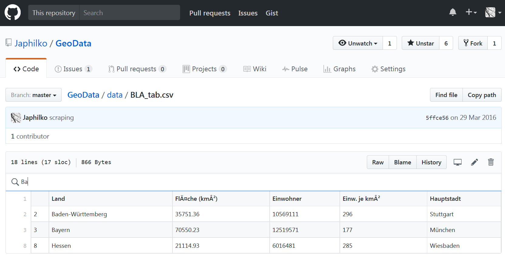


## Links

- [Using github and rstudio](https://www.r-bloggers.com/version-control-file-sharing-and-collaboration-using-github-and-rstudio/)

- [How do I tell Git for Windows where to find my private RSA key](http://serverfault.com/questions/194567/how-do-i-tell-git-for-windows-where-to-find-my-private-rsa-key)

- [Reset local repository branch to be just like remote repository HEAD](http://stackoverflow.com/questions/1628088/reset-local-repository-branch-to-be-just-like-remote-repository-head)

## Hochperfomanter Code

# C++ Integration - Überblick über das Paket rcpp


<!-- 
folgendes stammt aus dem EMBL Kurs
--> 

## Warum die Integration von c++

Robert Gentleman, in R Programming for Bioinformatics, 2008,
about R's built-in C interfaces:

> Since R is not compiled, in some situations its performance can be substantially improved by writing code in a compiled language. There are also reasons not to write code in other languages, and in particular we caution against premature optimization, prototyping in R
is often cost effective. And in our experience very few routines need to be implemented in other languages for effiiency reasons. Another substantial reason not to use an implementation in some other language is increased complexity. The use of another language almost always
results in higher maintenance costs and less stability. In addition, any extensions or enhancements of the code will require someone that is proficient in both R and the other language.


- Rcpp does make some of the above caution statements slightly less
critical.


## Warum und wann?

- Warum? - R wird langsam oder hat Probleme bei der  Speicherverwaltung: zum Beispiel bei Schleifen, die nicht vektorisiert werden können.

- Wann? - wenn man es mit Rcode nicht besser hinbekommt und man den langsamen Code identifiziert hat.

## Voraussetzung Compiler

Für Windows, Rtools

1. http://cran.r-project.org/bin/windows/Rtools/
2. http://cran.r-project.org/doc/manuals/R-admin.html#The-Windows-toolset

Für Mac, Xcode

3. http://cran.r-project.org/doc/manuals/R-admin.html#Installing-R-under-_0028Mac_0029-OS-X
4. http://cran.r-project.org/doc/manuals/R-admin.html#Mac-OS-X

## Was wir nutzen werden

Wir werden die folgenden beiden Pakete nutzen:

- `inline` und die `cfunction` um Inline C code zu schreiben, der on-the-fly kompiliert wird (Es gibt auch eine `cxxfunction` für
C++ Code).

- `Rcpp`, und die Nutzung der Funktion `cppFunction` 

## Rcpp


## Einleitung

- R ist in C geschrieben
- Die Nutzung der Schnittstelle zu C liegt nahe


## Das R-Paket CPP 

- [R Simulationsmodelle bis zu 20 mal schneller](https://www.r-bloggers.com/make-your-r-simulation-models-20-times-faster/)

- [Hohe Performanz mit Rcpp](http://adv-r.had.co.nz/Rcpp.html)


```r
install.packages("Rcpp")
```


```r
library(Rcpp)
cppFunction('int add(int x, int y, int z) {
  int sum = x + y + z;
  return sum;
}')
# add works like a regular R function
add
```


```r
add(1, 2, 3)
```


## [Rcpp](http://dirk.eddelbuettel.com/code/rcpp/Rcpp-introduction.pdf)

[Tutorial on Rcpp by Hadley Wickham](http://adv-r.had.co.nz/Rcpp.html#rcpp-intro)


```r
library(Rcpp)
```


```r
cppFunction('int add(int x, int y, int z) {
  int sum = x + y + z;
  return sum;
}')
```


```r
add(1, 2, 3)
```

## Benchmarking


```r
install.packages("microbenchmark")
```


```r
library(microbenchmark)
```

- [R-bloggers Artikel zu dem Paket `microbenchmark` ](https://www.r-bloggers.com/microbenchmarking-with-r/)

## Resourcen

- [Youtube Video with Dirk Edelbuettel](https://www.youtube.com/watch?v=ZKx5duewv-0)

- Oliver Heidmann - [Programmieren in R - 
Rcpp](https://wr.informatik.uni-hamburg.de/_media/teaching/sommersemester_2016/pir-16-oliver_heidmann-report.pdf)


##	Überblick über Möglichkeiten des Parallel Computings - Paket parallel

## Integration von Datenbanken

## Datenbanken und R

## Integration von PostgreSQL mit dem Paket 
RPostgreSQL


## PostgreSQL


- [PostgreSQL](http://wiki.openstreetmap.org/wiki/PostgreSQL)


## PostgreSQL installieren

- [Installation Windows](https://www.postgresql.org/download/windows/)
- [Installation Linux](http://postgres.de/install.html)

## PG admin installieren

- [PGadmin](https://www.pgadmin.org/)

## Wie bekomme ich Daten in die Datenbank


```r
# install.packages("RPostgreSQL")
library("RPostgreSQL")
```


## Geodaten in die Datenbank migrieren

- [Nutzung von osm2pgsql](http://www.volkerschatz.com/net/osm/osm2pgsql-usage.html)

```
sudo -u postgres createuser Japhilko
sudo -u postgres createdb -E UTF8 -O Japhilko offlgeoc
```

Die postgis Erweiterung muss für die Datenbank installiert werden:

```
CREATE EXTENSION postgis;
```

## [Erweiterung hstore](https://www.postgresql.org/docs/9.1/static/sql-createextension.html)

```
CREATE EXTENSION hstore;
```


```
osm2pgsql -s -U postgres -d offlgeoc /home/kolb/Forschung/osmData/data/saarland-latest.osm.pbf 
```

## Datenbank für Geocoding

```
sudo -u postgres createdb -E UTF8 -O Japhilko offlgeocRLP
```

```
CREATE EXTENSION postgis;
```

```
osm2pgsql -s -U postgres -d offlgeocRLP -o gazetteer /home/kolb/Forschung/osmData/data/rheinland-pfalz-latest.osm.pbf 
```

[So bekommt man alle administrativen Grenzen:](https://gist.github.com/jpetazzo/5177554)

```
SELECT name FROM planet_osm_polygon WHERE boundary='administrative'
```

## [Zurück zu R](https://datashenanigan.wordpress.com/2015/05/18/getting-started-with-postgresql-in-r/)


```r
pw <- {"1234"}
drv <- dbDriver("PostgreSQL")
con <- dbConnect(drv, dbname = "offlgeocRLP",
                 host = "localhost", port = 5432,
                 user = "postgres", password = pw)
rm(pw) # removes the password

dbExistsTable(con, "planet_osm_polygon")
```

- [Select more than one column](http://dba.stackexchange.com/questions/54011/postgres-function-assign-query-results-to-multiple-variables)


```r
df_postgres <- dbGetQuery(con, "SELECT name, admin_level FROM planet_osm_polygon WHERE boundary='administrative'")
```


```r
barplot(table(df_postgres[,2]),col="royalblue")
```

## 


```r
df_adm8 <- dbGetQuery(con, "SELECT name, admin_level FROM planet_osm_polygon WHERE boundary='administrative' AND admin_level='8'")
```


```r
library(knitr)
# kable(head(df_adm8))
```

## 


```r
df_hnr <- dbGetQuery(con, "SELECT * FROM planet_osm_line, planet_osm_point 
WHERE planet_osm_line.name='Nordring' AND planet_osm_line.highway IN ('motorway','trunk','primary')
AND planet_osm_point.name='Ludwigshafen' AND planet_osm_point.place IN ('city', 'town')
ORDER BY ST_Distance(planet_osm_line.way, planet_osm_point.way)")
```


```r
df_hnr <- dbGetQuery(con, "SELECT * FROM planet_osm_line, planet_osm_point 
WHERE planet_osm_line.name='Nordring' AND planet_osm_point.name='Ludwigshafen' 
ORDER BY ST_Distance(planet_osm_line.way, planet_osm_point.way)")
head(df_hnr)
```


```r
df_ <- dbGetQuery(con, "SELECT * FROM planet_osm_line, planet_osm_point 
WHERE planet_osm_line.name='Nordring' AND planet_osm_point.name='Ludwigshafen' 
ORDER BY ST_Distance(planet_osm_line.way, planet_osm_point.way)")
head(df_hnr)
```


```r
colnames(df_)
```


```r
table(df_$name)
```

## Adress in Sippersfeld


```r
df_sipp <- dbGetQuery(con, "SELECT * FROM planet_osm_line, planet_osm_point 
WHERE planet_osm_line.name='Rechweg' AND planet_osm_point.name='Sippersfeld' 
ORDER BY ST_Distance(planet_osm_line.way, planet_osm_point.way)")
head(df_sipp)
```


## [OpenStreetMap und Open Government Data in PostGIS](http://tud.at/linuxwochen/2013-osm-postgis/)


```r
restnam <- dbGetQuery(con, "SELECT name, COUNT(osm_id) AS anzahl
FROM planet_osm_point
WHERE amenity = 'restaurant'
  AND name <> ''
GROUP BY name
ORDER BY anzahl DESC
LIMIT 10")
head(restnam)
```


## [PostgreSQL and Leaflet](https://www.r-bloggers.com/using-postgresql-and-shiny-with-a-dynamic-leaflet-map-monitoring-trash-cans/)


```r
install.packages("plot3D")
```


```r
library(plot3D)
library(RPostgreSQL)
```

## Links

- [osm2pgsql
](https://github.com/petewarden/osm2pgsql/tree/master/gazetteer)

- Andrew Whitby - [Roll-your-own geocoding with OpenStreetMap Nominatim on Amazon EC2](https://andrewwhitby.com/2014/12/18/nominatim-on-ec2/)

- [OpenStreetMap Nominatim Server for Geocoding](http://koo.fi/blog/2015/03/19/openstreetmap-nominatim-server-for-geocoding/#Database_users)

- [Getting Started With PostGIS](http://www.bostongis.com/PrinterFriendly.aspx?content_name=postgis_tut01)

- [PostGIS geocode](http://postgis.net/docs/Geocode.html)

- [Nominatim installation](http://wiki.openstreetmap.org/wiki/Nominatim/Installation)

- [Wie bekommt man OSM Daten](https://www.azavea.com/blog/2015/12/21/tools-for-getting-data-out-of-openstreetmap-and-into-desktop-gis/)


##	Nutzung von MongoDB in R


