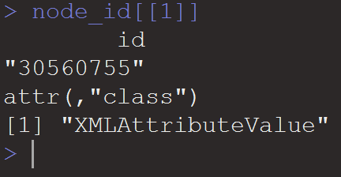
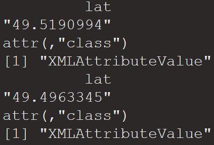

# R Schnittstellen - Internetresourcen und Schnittstellen nutzen
Jan-Philipp Kolb  
9 Mai 2017  


# Internetresourcen und Schnittstellen nutzen


## [Was sind API's?](https://de.wikipedia.org/wiki/Programmierschnittstelle)


## [Programmierschnittstellen](http://www.gruenderszene.de/lexikon/begriffe/application-programming-interface-api)

- Relevanz hat der Begriff der API vor allem durch seine Verwendung von Webdiensten erhalten.
- APIs dienen also zum Austausch und der Weiterverarbeitung von Daten und Inhalten zwischen verschiedenen Webseiten, Programmen und Content-Anbietern.


## Bedeutung

- es ist unter anderem möglich Daten von Programmierschnittstellen zu beziehen
- diese Daten sind allerdings nicht als `.xlsx`, `.csv`, `.dta` oder ähnliches abgespeichert sondern in einem der folgenden Formate: `.json`, `.xml` etc.


## JavaScript Object Notation


<!--


-->

## [GeoJSON](http://cannoneyed.github.io/geojson/)


## [OpenStreetMap Daten](https://rstudio.github.io/leaflet/json.html)


# Import von JSON-Objekten und XML Dateien


# Import von JSON Dateien

## [JavaScript Object Notation (JSON)](https://de.wikipedia.org/wiki/JavaScript_Object_Notation)

- Jedes gültige JSON-Dokument soll ein gültiges JavaScript sein
- JSON wird zur Übertragung und zum Speichern von strukturierten Daten eingesetzt
- Insbesondere bei Webanwendungen und mobilen Apps wird es in Verbindung mit JavaScript, Ajax oder WebSockets zum Transfer von Daten zwischen dem Client und dem Server häufig genutzt.
<!--

-->


## Das GeoJSON Format

- GeoJSON ist ein offenes Format um geografische Daten nach der Simple-Feature-Access-Spezifikation zu repräsentieren. 
- Dafür wird die JavaScript Object Notation verwendet.

Die Struktur der Daten kann man sich mit einem [JSON Viewer anschauen](http://jsonviewer.stack.hu/)


## [Download von Beispieldaten](https://overpass-turbo.eu/)

- Overpass Turbo kann verwendet werden um Beispieldaten zu bekommen

<https://overpass-turbo.eu/>


## Exkurs OpenStreetMap Daten

- Auf Overpass Turbo können Daten für Map Features exportiert werden
- Eine Liste der erhältlichen Map Features gibt es auf <http://wiki.openstreetmap.org/wiki/DE:Map_Features>


## [Beispiele für GeoJSON](https://de.wikipedia.org/wiki/GeoJSON)


## Das Paket `jsonlite`


```r
install.packages("jsonlite")
```


```r
library(jsonlite)
citation("jsonlite")
```

```
## 
## To cite jsonlite in publications use:
## 
##   Jeroen Ooms (2014). The jsonlite Package: A Practical and
##   Consistent Mapping Between JSON Data and R Objects.
##   arXiv:1403.2805 [stat.CO] URL http://arxiv.org/abs/1403.2805.
## 
## A BibTeX entry for LaTeX users is
## 
##   @Article{,
##     title = {The jsonlite Package: A Practical and Consistent Mapping Between JSON Data and R Objects},
##     author = {Jeroen Ooms},
##     journal = {arXiv:1403.2805 [stat.CO]},
##     year = {2014},
##     url = {http://arxiv.org/abs/1403.2805},
##   }
```


## JSON importieren


```r
library("jsonlite")
DRINKWATER <- fromJSON("data/RomDrinkingWater.geojson")
```


```r
names(DRINKWATER)[1:3]
```

```
## [1] "type"      "generator" "copyright"
```

```r
names(DRINKWATER)[4:5]
```

```
## [1] "timestamp" "features"
```

## Die Daten anschauen


```r
head(DRINKWATER$features)
```


```
##      type             id properties.@id properties.amenity properties.flow
## 1 Feature node/246574149 node/246574149     drinking_water     push-button
## 2 Feature node/246574150 node/246574150     drinking_water            <NA>
## 3 Feature node/246574151 node/246574151     drinking_water            <NA>
## 4 Feature node/248743324 node/248743324     drinking_water            <NA>
## 5 Feature node/251773348 node/251773348     drinking_water            <NA>
## 6 Feature node/251773551 node/251773551     drinking_water            <NA>
##   properties.type properties.name properties.name:fr properties.wheelchair
## 1          nasone            <NA>               <NA>                  <NA>
## 2            <NA>            <NA>               <NA>                  <NA>
## 3            <NA>            <NA>               <NA>                  <NA>
## 4            <NA>            <NA>               <NA>                  <NA>
## 5          nasone            <NA>               <NA>                  <NA>
## 6            <NA>    Acqua Marcia        Eau potable                   yes
##   properties.created_by properties.indoor geometry.type
## 1                  <NA>              <NA>         Point
## 2                  <NA>              <NA>         Point
## 3                  <NA>              <NA>         Point
## 4                  <NA>              <NA>         Point
## 5                  <NA>              <NA>         Point
## 6                  <NA>              <NA>         Point
##   geometry.coordinates
## 1   12.49191, 41.89479
## 2   12.49095, 41.89489
## 3   12.48774, 41.89450
## 4   12.48773, 41.89354
## 5   12.48529, 41.88539
## 6   12.48386, 41.89332
```

## [Github JSON Daten](https://cran.r-project.org/web/packages/jsonlite/vignettes/json-apis.html)

- Es lassen sich auch Dinge aus dem Web auslesen:


```r
my_repos <- fromJSON("https://api.github.com/users/japhilko/repos")
```


```r
names(my_repos)
```

```
##  [1] "id"                "name"              "full_name"        
##  [4] "owner"             "private"           "html_url"         
##  [7] "description"       "fork"              "url"              
## [10] "forks_url"         "keys_url"          "collaborators_url"
## [13] "teams_url"         "hooks_url"         "issue_events_url" 
## [16] "events_url"        "assignees_url"     "branches_url"     
## [19] "tags_url"          "blobs_url"         "git_tags_url"     
## [22] "git_refs_url"      "trees_url"         "statuses_url"     
## [25] "languages_url"     "stargazers_url"    "contributors_url" 
## [28] "subscribers_url"   "subscription_url"  "commits_url"      
## [31] "git_commits_url"   "comments_url"      "issue_comment_url"
## [34] "contents_url"      "compare_url"       "merges_url"       
## [37] "archive_url"       "downloads_url"     "issues_url"       
## [40] "pulls_url"         "milestones_url"    "notifications_url"
## [43] "labels_url"        "releases_url"      "deployments_url"  
## [46] "created_at"        "updated_at"        "pushed_at"        
## [49] "git_url"           "ssh_url"           "clone_url"        
## [52] "svn_url"           "homepage"          "size"             
## [55] "stargazers_count"  "watchers_count"    "language"         
## [58] "has_issues"        "has_projects"      "has_downloads"    
## [61] "has_wiki"          "has_pages"         "forks_count"      
## [64] "mirror_url"        "open_issues_count" "forks"            
## [67] "open_issues"       "watchers"          "default_branch"
```


## [Weiteres Beispiel für JSON Daten](https://cran.r-project.org/web/packages/jsonlite/vignettes/json-apis.html)

- Die [Ergast Developer API](http://ergast.com/mrd/) ist ein experimenteller Web Service, der eine historische Aufzeichnung von Motorsportdaten liefert.


## Ergast Daten lesen


```r
library(jsonlite)
res <- fromJSON('http://ergast.com/api/f1/2004/1/results.json')
drivers <- res$MRData$RaceTable$Races$Results[[1]]$Driver
colnames(drivers)
```

```
## [1] "driverId"        "code"            "url"             "givenName"      
## [5] "familyName"      "dateOfBirth"     "nationality"     "permanentNumber"
```

## Daten der New York Times

- Die New York Times hat mehrere APIs als Teil des NYT-Entwickler-Netzwerks.
- Es ist eine Schnittstelle zu Daten aus verschiedenen Abteilungen, wie Nachrichtenartikel, Buchbesprechungen, Immobilien, etc. 
- Registrierung ist erforderlich (aber kostenlos) und ein Schlüssel kann [hier](http://developer.nytimes.com/signup) erhalten werden. 

## New York Times Beispiel


```r
article_key <- "&api-key=c2fede7bd9aea57c898f538e5ec0a1ee:6:68700045"
url <- "http://api.nytimes.com/svc/search/v2/articlesearch.json?q=obamacare+socialism"
req <- fromJSON(paste0(url, article_key))
articles <- req$response$docs
colnames(articles)
```

```
##  [1] "web_url"           "snippet"           "lead_paragraph"   
##  [4] "abstract"          "print_page"        "blog"             
##  [7] "source"            "multimedia"        "headline"         
## [10] "keywords"          "pub_date"          "document_type"    
## [13] "news_desk"         "section_name"      "subsection_name"  
## [16] "byline"            "type_of_material"  "_id"              
## [19] "word_count"        "slideshow_credits"
```

# Import von XML Dateien

## Das `XML` Paket


```r
library(XML)
citation("XML")
```

```
## 
## To cite package 'XML' in publications use:
## 
##   Duncan Temple Lang and the CRAN Team (2016). XML: Tools for
##   Parsing and Generating XML Within R and S-Plus. R package
##   version 3.98-1.5. https://CRAN.R-project.org/package=XML
## 
## A BibTeX entry for LaTeX users is
## 
##   @Manual{,
##     title = {XML: Tools for Parsing and Generating XML Within R and S-Plus},
##     author = {Duncan Temple Lang and the CRAN Team},
##     year = {2016},
##     note = {R package version 3.98-1.5},
##     url = {https://CRAN.R-project.org/package=XML},
##   }
## 
## ATTENTION: This citation information has been auto-generated from
## the package DESCRIPTION file and may need manual editing, see
## 'help("citation")'.
```


## Das `xml2` Paket


```r
install.packages("xml2")
```


```r
library(xml2)
citation("xml2")
```

```
## 
## To cite package 'xml2' in publications use:
## 
##   Hadley Wickham and James Hester (2016). xml2: Parse XML. R
##   package version 1.0.0. https://CRAN.R-project.org/package=xml2
## 
## A BibTeX entry for LaTeX users is
## 
##   @Manual{,
##     title = {xml2: Parse XML},
##     author = {Hadley Wickham and James Hester},
##     year = {2016},
##     note = {R package version 1.0.0},
##     url = {https://CRAN.R-project.org/package=xml2},
##   }
```


## Erstes Beispiel


```r
url <- "http://api.openstreetmap.org/api/0.6/
relation/62422"
```


```r
library(xml2)
BE <- xmlParse(url)
```


## Das XML analysieren

- [Tobi Bosede - Working with XML Data in R](http://www.informit.com/articles/article.aspx?p=2215520)


```r
xmltop = xmlRoot(BE)
class(xmltop)
```

```
## [1] "XMLInternalElementNode" "XMLInternalNode"       
## [3] "XMLAbstractNode"
```

```r
xmlSize(xmltop)
```

```
## [1] 1
```

```r
xmlSize(xmltop[[1]])
```

```
## [1] 328
```


## Nutzung von Xpath

[Xpath](https://de.wikipedia.org/wiki/XPath), the XML Path Language, is a query language for selecting nodes from an XML document. 


```r
xpathApply(BE,"//tag[@k = 'source:population']")
```

```
## [[1]]
## <tag k="source:population" v="http://www.statistik-berlin-brandenburg.de/Publikationen/Stat_Berichte/2010/SB_A1-1_A2-4_q01-10_BE.pdf 2010-10-01"/> 
## 
## attr(,"class")
## [1] "XMLNodeSet"
```

## Node parsen


```r
url2 <- "http://api.openstreetmap.org/api/0.6/node/2923760808"
RennesBa <- xmlParse(url2)
```


## Way parsen


```r
url3 <- "http://api.openstreetmap.org/api/0.6/way/72799743"
MadCalle <- xmlParse(url3)
```


## The Overpass API


>The Overpass API is a read-only API that serves up custom selected parts of the OSM map data.

(<http://wiki.openstreetmap.org/wiki/Overpass_API>)

## Wichtige Information 

<http://wiki.openstreetmap.org/wiki/Map_Features>


## Beispiel: Nutzung der Overpass API


## Export der Rohdaten


## Import von der Overpass API zu R


```r
Link1 <- "http://www.overpass-api.de/api/interpreter?
data=[maxsize:1073741824][timeout:900];area[name=\""
```


```r
library(XML)
place <- "Mannheim"
type_obj <- "node"
object <- "leisure=playground"

InfoList <- xmlParse(paste(Link1,place,"\"];",
type_obj,"(area)[",object,"];out;",sep=""))
```


## XML Output


## Das Arbeiten mit XML Daten (xpath)

Die Liste der ID's mit dem Wert *playground*:


```r
node_id <- xpathApply(InfoList,
"//tag[@v= 'playground']/parent::node/@ id")
## node_id[[1]]
```



## latitude und longitude bekommen


```r
lat_x <- xpathApply(InfoList,
"//tag[@v= 'playground']/parent::node/@ lat")
# lat_x[[1]];lat_x[[2]]
```


```r
lat_x <- xpathApply(InfoList,
"//tag[@v= 'playground']/parent::node/@ lon")
```



## Paket auf Github


```r
library(devtools)
install_github("Japhilko/gosmd")
```


```r
library(gosmd)
```

```
## Loading required package: maptools
```

```
## Loading required package: sp
```

```
## Checking rgeos availability: TRUE
```

```
## Loading required package: RJSONIO
```

```
## 
## Attaching package: 'RJSONIO'
```

```
## The following objects are masked from 'package:jsonlite':
## 
##     fromJSON, toJSON
```

```
## Loading required package: stringr
```

```r
pg_MA <- get_osm_nodes(object="leisure=playground",
                       "Mannheim")
info <- extract_osm_nodes(OSM.Data=pg_MA,
                          value="playground")
```

## Ausschnitt der Ergebnisse


           leisure            lat        lon  note                                                     
---------  -----------  ---------  ---------  ---------------------------------------------------------
30560755   playground    49.51910   8.502807  NA                                                       
76468450   playground    49.49633   8.539396  Rutsche, Schaukel, großer Sandkasten, Tischtennis       
76468534   playground    49.49678   8.552959  NA                                                       
76468535   playground    49.49230   8.548750  NA                                                       
76468536   playground    49.50243   8.548140  Schaukel, Rutsche, Sandkasten, Spielhäuser, Tischtennis 
76468558   playground    49.49759   8.542036  NA                                                       


## Link

- [Tutorial zur Nutzung der Overpass API](http://osmlab.github.io/learnoverpass/en/exercises/intro/1/)

- [Vignette xml2](https://cran.r-project.org/web/packages/xml2/vignettes/modification.html)


## Mehr Beispiele, wie man mit XML Daten umgeht:


- [Daten aus XML extrahieren](http://www.stat.berkeley.edu/~statcur/Workshop2/Presentations/XML.pdf)

<http://www.stat.berkeley.edu/~statcur/Workshop2/Presentations/XML.pdf>

- Duncan Temple Lang - [A Short Introduction to the XML package for R](http://www.omegahat.net/RSXML/shortIntro.pdf)

<http://www.omegahat.net/RSXML/shortIntro.pdf>

## Noch mehr Informationen

- [Web Daten manipulieren](http://www.di.fc.ul.pt/~jpn/r/web/index.html#parsing-xml)

<http://www.di.fc.ul.pt/~jpn/r/web/index.html#parsing-xml>

- [Tutorial zu xquery](http://www.w3schools.com/xml/xquery_intro.asp)

<http://www.w3schools.com/xml/xquery_intro.asp>

- [R und das Web (für Anfänger), Teil II: XML und R](http://giventhedata.blogspot.de/2012/06/r-and-web-for-beginners-part-ii-xml-in.html)

<http://giventhedata.blogspot.de/2012/06/r-and-web-for-beginners-part-ii-xml-in.html>

- [String Manipulation](http://gastonsanchez.com/Handling_and_Processing_Strings_in_R.pdf)

<http://gastonsanchez.com/Handling_and_Processing_Strings_in_R.pdf>


## Das R-Paket `XML` - Gaston Sanchez


```r
library("XML")
```


Seine Arbeit sieht man [hier](http://gastonsanchez.com/).


## [Das Arbeiten mit XML Daten](https://github.com/gastonstat/tutorial-R-web-data/blob/master/04-parsing-xml/04-parsing-xml.pdf)


## Funktionen im XML Paket


Function         Description                              
---------------  -----------------------------------------
xmlName()        name of the node                         
xmlSize()        number of subnodes                       
xmlAttrs()       named character vector of all attributes 
xmlGetAttr()     value of a single attribute              
xmlValue()       contents of a leaf node                  
xmlParent()      name of parent node                      
xmlAncestors()   name of ancestor nodes                   
getSibling()     siblings to the right or to the left     
xmlNamespace()   the namespace (if there’s one)           


## [Einzelne Objekte finden](http://www.openstreetmap.org/export)

<www.openstreetmap.org/export>


## Beispiel: administrative Grenzen Berlin

[Administrative Grenzen für Deutschland](http://wiki.openstreetmap.org/wiki/DE:Grenze#Bundesl.C3.A4ndergrenze_-_admin_level.3D4)


```r
url <- "http://api.openstreetmap.org/api/0.6/relation/62422"
```


```r
BE <- xmlParse(url)
```


## Das XML analysieren

- [Tobi Bosede - Working with XML Data in R](http://www.informit.com/articles/article.aspx?p=2215520)


```r
xmltop = xmlRoot(BE)
class(xmltop)
```

```
## [1] "XMLInternalElementNode" "XMLInternalNode"       
## [3] "XMLAbstractNode"
```

```r
xmlSize(xmltop)
```

```
## [1] 1
```

```r
xmlSize(xmltop[[1]])
```

```
## [1] 328
```


## Nutzung von Xpath

> [Xpath](https://de.wikipedia.org/wiki/XPath), the XML Path Language, is a query language for selecting nodes from an XML document. 


```r
xpathApply(BE,"//tag[@k = 'population']")
```

```
## [[1]]
## <tag k="population" v="3440441"/> 
## 
## attr(,"class")
## [1] "XMLNodeSet"
```


## Quelle für die Bevölkerungsgröße


```r
xpathApply(BE,"//tag[@k = 'source:population']")
```

```
## [[1]]
## <tag k="source:population" v="http://www.statistik-berlin-brandenburg.de/Publikationen/Stat_Berichte/2010/SB_A1-1_A2-4_q01-10_BE.pdf 2010-10-01"/> 
## 
## attr(,"class")
## [1] "XMLNodeSet"
```

-[Statistik Berlin Brandenburg](https://www.statistik-berlin-brandenburg.de/datenbank/inhalt-datenbank.asp)

## Etwas überraschend: 


```r
xpathApply(BE,"//tag[@k = 'name:ta']")
```

```
## [[1]]
## <tag k="name:ta" v="<U+0BAA><U+0BC6><U+0BB0><U+0BCD><U+0BB2><U+0BBF><U+0BA9><U+0BCD>"/> 
## 
## attr(,"class")
## [1] "XMLNodeSet"
```


## Geographische Region


```r
region <- xpathApply(BE,
  "//tag[@k = 'geographical_region']")
# regular expressions
region[[1]]
```

```
## <tag k="geographical_region" v="Barnim;Berliner Urstromtal;Teltow;Nauener Platte"/>
```

```
<tag k="geographical_region" 
  v="Barnim;Berliner Urstromtal;
  Teltow;Nauener Platte"/>
```

## Landkreis


## Weiteres Beispiel


```r
url2<-"http://api.openstreetmap.org/api/0.6/node/25113879"
obj2<-xmlParse(url2)
obj_amenity<-xpathApply(obj2,"//tag[@k = 'amenity']")[[1]]
obj_amenity
```

```
## <tag k="amenity" v="university"/>
```

## Wikipedia Artikel


```r
xpathApply(obj2,"//tag[@k = 'wikipedia']")[[1]]
```

```
## <tag k="wikipedia" v="de:Universität Mannheim"/>
```


```r
xpathApply(obj2,"//tag[@k = 'wheelchair']")[[1]]
```


```r
xpathApply(obj2,"//tag[@k = 'name']")[[1]]
```


## Das C und das A


```r
url3<-"http://api.openstreetmap.org/api/0.6/node/303550876"
obj3 <- xmlParse(url3)
xpathApply(obj3,"//tag[@k = 'opening_hours']")[[1]]
```

```
## <tag k="opening_hours" v="Mo-Sa 09:00-20:00; Su,PH off"/>
```

## Hin und weg


```r
url4<-"http://api.openstreetmap.org/api/0.6/node/25439439"
obj4 <- xmlParse(url4)
xpathApply(obj4,"//tag[@k = 'railway:station_category']")[[1]]
```

```
## <tag k="railway:station_category" v="2"/>
```

- [Wikipedia Artikel Bahnhofskategorien](https://de.wikipedia.org/wiki/Bahnhofskategorie)


## Exkurs: Bahnhofskategorien

- [rvest: Easily Harvest (Scrape) Web Pages](https://cran.r-project.org/web/packages/rvest/index.html)


```r
library(rvest)
```

```
## 
## Attaching package: 'rvest'
```

```
## The following object is masked from 'package:XML':
## 
##     xml
```

```r
bhfkat<-read_html(
  "https://de.wikipedia.org/wiki/Bahnhofskategorie")
df_html_bhfkat<-html_table(
  html_nodes(bhfkat, "table")[[1]],fill = TRUE)
```

## Bahnhofskategorien Übersicht


 Stufe  Bahnsteigkanten   Bahnsteiglänge    Reisende/Tag        Zughalte/Tag 
------  ----------------  ----------------  ------------------  -------------
     6  01                > 000 bis 090 m   00000 bis 00049     000 bis 0010 
     5  02                > 090 bis 140 m   00050 bis 00299     011 bis 0050 
     4  03 bis 04         > 140 bis 170 m   00300 bis 00999     051 bis 0100 
     3  05 bis 09         > 170 bis 210 m   01000 bis 09999     101 bis 0500 
     2  10 bis 14         > 210 bis 280 m   10.000 bis 49.999   501 bis 1000 
     1  00i ab 15         > 280 m           00000i ab 50.000    000i ab 1001 

## Nur fliegen ist schöner


```r
url5<-"http://api.openstreetmap.org/api/0.6/way/162149882"
obj5<-xmlParse(url5)
xpathApply(obj5,"//tag[@k = 'name']")[[1]]
```

```
## <tag k="name" v="City-Airport Mannheim"/>
```


```r
xpathApply(obj5,"//tag[@k = 'website']")[[1]]
```

```
## <tag k="website" v="http://www.flugplatz-mannheim.de/"/>
```


```r
xpathApply(obj5,"//tag[@k = 'iata']")[[1]]
```

```
## <tag k="iata" v="MHG"/>
```


## [OSM Ausschnitte herunterladen](http://www.openstreetmap.org/export)

<www.openstreetmap.org/export>


## Mehr Beispiele, wie man mit XML Daten umgeht:


- Deborah Nolan - [Extracting data from XML](http://www.stat.berkeley.edu/~statcur/Workshop2/Presentations/XML.pdf)


- Duncan Temple Lang - [A Short Introduction to the XML package for R](http://www.omegahat.net/RSXML/shortIntro.pdf)


Noch mehr Informationen

- [Web Daten manipulieren](http://www.di.fc.ul.pt/~jpn/r/web/index.html#parsing-xml)

- [Tutorial zu xquery](http://www.w3schools.com/xml/xquery_intro.asp)

- [R und das Web (für Anfänger), Teil II: XML und R](http://giventhedata.blogspot.de/2012/06/r-and-web-for-beginners-part-ii-xml-in.html)

- [String Manipulation](http://gastonsanchez.com/Handling_and_Processing_Strings_in_R.pdf)

- [Nutzung, Vor- und Nachteile OSM](https://www.e-education.psu.edu/geog585/node/738)

- [Forschungsprojekte im Zusammenhang mit OpenStreetMap](http://wiki.openstreetmap.org/wiki/Research)

- [XML parsen - Stackoverflow](http://stackoverflow.com/questions/17198658/how-to-parse-xml-to-r-data-frame)

- [Processing of GeoJson data in R](https://www.r-bloggers.com/processing-of-geojson-data-in-r/)


# Die Pakete rvest und RCurl


## Das Paket `rvest`


```r
library(rvest)
ht <- read_html('https://www.google.co.in/search?q=guitar+repair+workshop')
links <- ht %>% html_nodes(xpath='//h3/a') %>% html_attr('href')
gsub('/url\\?q=','',sapply(strsplit(links[as.vector(grep('url',links))],split='&'),'[',1))
```

```
##  [1] "http://theguitarrepairworkshop.com/"                                                                   
##  [2] "http://www.guitarservices.com/"                                                                        
##  [3] "http://www.guitarrepairbench.com/guitar-building-projects/guitar-workshop/guitar-workshop-project.html"
##  [4] "https://www.facebook.com/The-Guitar-Repair-Workshop-847517635259712/"                                  
##  [5] "https://www.taylorguitars.com/dealer/guitar-repair-workshop-ltd"                                       
##  [6] "http://www.laweekly.com/music/10-best-guitar-repair-shops-in-los-angeles-4647166"                      
##  [7] "https://www.justdial.com/Mumbai/Guitar-Repair-Services/nct-10988623"                                   
##  [8] "https://www.justdial.com/Delhi-NCR/Guitar-Repair-Services/nct-10988623"                                
##  [9] "http://guitarworkshopglasgow.com/pages/repairs-1"                                                      
## [10] "http://www.google.co.in/aclk?sa=l"
```

## Links

- [Scraping CRAN with rvest](https://www.r-bloggers.com/scraping-cran-with-rvest/)

# Webscraping


## Notwendige Pakete


```r
install.packages("tidyverse")
```


```r
library(tidyverse)
library(stringr)
library(forcats)
library(ggmap)
library(rvest)
```

## SCRAPE DATA FROM WIKIPEDIA


```r
html.world_ports <- read_html("https://en.wikipedia.org/wiki/List_of_busiest_container_ports")
df.world_ports <- html_table(html_nodes(html.world_ports, "table")[[2]], fill = TRUE)
```

## Die Daten anschauen


```r
glimpse(df.world_ports)
```

```
## Observations: 50
## Variables: 15
## $ Rank     <int> 1, 2, 3, 4, 5, 6, 7, 8, 9, 10, 11, 12, 13, 14, 15, 16...
## $ Port     <chr> "Shanghai", "Singapore", "Shenzhen", "Ningbo-Zhoushan...
## $ Economy  <chr> "China", "Singapore", "China", "China", "Hong Kong", ...
## $ 2015[1]  <chr> "36,516", "30,922", "24,142", "20,636", "20,073", "19...
## $ 2014[2]  <chr> "35,268", "33,869", "23,798", "19,450", "22,374", "18...
## $ 2013[3]  <chr> "33,617", "32,240", "23,280", "17,351", "22,352", "17...
## $ 2012[4]  <chr> "32,529", "31,649", "22,940", "16,670", "23,117", "17...
## $ 2011[5]  <chr> "31,700", "29,937", "22,570", "14,686", "24,384", "16...
## $ 2010[6]  <chr> "29,069", "28,431", "22,510", "13,144", "23,532", "14...
## $ 2009[7]  <chr> "25,002", "25,866", "18,250", "10,502", "20,983", "11...
## $ 2008[8]  <chr> "27,980", "29,918", "21,414", "11,226", "24,248", "13...
## $ 2007[9]  <chr> "26,150", "27,932", "21,099", "9,349", "23,881", "13,...
## $ 2006[10] <chr> "21,710", "24,792", "18,469", "7,068", "23,539", "12,...
## $ 2005[11] <chr> "18,084", "23,192", "16,197", "5,208", "22,427", "11,...
## $ 2004[12] <chr> "14,557", "21,329", "13,615", "4,006", "21,984", "11,...
```


## Das Paket `rvest`


```r
library(rvest)
ht <- read_html('https://www.google.co.in/search?q=guitar+repair+workshop')
links <- ht %>% html_nodes(xpath='//h3/a') %>% html_attr('href')
gsub('/url\\?q=','',sapply(strsplit(links[as.vector(grep('url',links))],split='&'),'[',1))
```

```
##  [1] "http://theguitarrepairworkshop.com/"                                                                   
##  [2] "http://www.guitarservices.com/"                                                                        
##  [3] "http://www.guitarrepairbench.com/guitar-building-projects/guitar-workshop/guitar-workshop-project.html"
##  [4] "https://www.facebook.com/The-Guitar-Repair-Workshop-847517635259712/"                                  
##  [5] "https://www.taylorguitars.com/dealer/guitar-repair-workshop-ltd"                                       
##  [6] "http://www.laweekly.com/music/10-best-guitar-repair-shops-in-los-angeles-4647166"                      
##  [7] "https://www.justdial.com/Mumbai/Guitar-Repair-Services/nct-10988623"                                   
##  [8] "https://www.justdial.com/Delhi-NCR/Guitar-Repair-Services/nct-10988623"                                
##  [9] "http://guitarworkshopglasgow.com/pages/repairs-1"                                                      
## [10] "http://www.google.co.in/aclk?sa=l"
```


## Links

- [How to really do an analysis in R (part 1, data manipulation)](https://www.r-bloggers.com/how-to-really-do-an-analysis-in-r-part-1-data-manipulation/)

- [Read CSV From The Web](http://www.programmingr.com/examples/read-csv-web/)

- [Scraping CRAN with rvest](https://www.r-bloggers.com/scraping-cran-with-rvest/)

# Beispiel Scraping Wikipedia


## Einleitung

Im Folgenden werde ich zeigen, wie man Textinformationen aus [Wikipedia](https://www.wikipedia.org/) herunterladen, verarbeiten und analysieren kann.


```r
install.packages("NLP")
install.packages("tm")
install.packages("FactoMineR")
```


## Die verwendeten Pakete

- Das R-Paket [`stringi`](http://stringi.rexamine.com/) von Marek Gagolewski and Bartek Tartanus bietet Möglichkeiten zur String Verarbeitung.


```r
library("stringi")
```

- [`tm`](http://www.jstatsoft.org/v25/i05/) ist ein R-Paket um Text Mining zu realisieren. Es wurde von Ingo Feinerer, Kurt Hornik, und David Meyer geschrieben.


```r
library("tm")
```

- Und schließlich brauchen wir das [`FactoMineR`](https://cran.r-project.org/web/packages/FactoMineR/vignettes/FactoMineR.pdf)-Paket, das von Sebastien Le, Julie Josse und Francois Husson zur Durchführung der Hauptkomponentenanalyse erstellt wurde.


```r
library("FactoMineR")
```


## Die Text Daten herunterladen

- Als Beispiel verwenden wir Daten zu verschiedenen Krankheiten. 
- In diesem Fall habe ich 7 deutsche Webseiten für Infektionskrankheiten ausgewählt.


```r
wiki <- "http://de.wikipedia.org/wiki/"

titles <- c("Zika-Virus", "Influenza-A-Virus_H1N1", 
            "Spanische_Grippe","Influenzavirus",
            "Vogelgrippe_H5N1",
            "Legionellose-Ausbruch_in_Warstein_2013",
            "Legionellose-Ausbruch_in_Jülich_2014")
```

## Das Herunterladen der Seiten

- Zunächst wird ein Container erstellt um die Ergebnisse abzuspeichern
- Dann wird der Text für jeden Artikel heruntergeladen und in dem Container gespeichert.


```r
articles <- character(length(titles))

for (i in 1:length(titles)){
    articles[i] <- stri_flatten(
      readLines(stri_paste(wiki, titles[i])), col = " ")
}

docs <- Corpus(VectorSource(articles))
```

## Die Daten vorbereiten

Das Folgende basiert auf einem Blogpost von Norbert Ryciak über die [automatische Kategorisierung von Wikipedia-Artikeln](http://www.rexamine.com/2014/06/text-mining-in-r-automatic-categorization-of-wikipedia-artikel/).

- Eine Fehlermeldung ist aufgetreten, als ich den Code ausgewertet habe.
- Es war möglich, dieses Problem mit Hinweisen aus einer [Diskussion auf Stackoverflow](http://stackoverflow.com/questions/24191728/documenttermmatrix-error-on-corpus-argument) zu lösen.


```r
docs2 <- tm_map(docs, function(x) stri_replace_all_regex(
  x, "<.+?>", " "))
docs3 <- tm_map(docs2, function(x) stri_replace_all_fixed(
  x, "\t", " "))
```

## Den Text weiterverarbeiten


```r
docs4 <- tm_map(docs3, PlainTextDocument)
docs5 <- tm_map(docs4, stripWhitespace)
docs6 <- tm_map(docs5, removeWords, stopwords("german"))
docs7 <- tm_map(docs6, removePunctuation)
docs8 <- tm_map(docs7, tolower)
# docs8 <- tm_map(docs8, PlainTextDocument)
```


```r
dtm <- DocumentTermMatrix(docs8)  
```


## [Principal Component Analysis](https://dzone.com/articles/manipulate-clusters-of-texts)

- Der folgende Code ist auf einem Blog post von  Arthur Charpentier über das Mining von Wikipedia basiert. 


```r
dtm2 <- as.matrix(dtm)
frequency <- colSums(dtm2)
frequency <- sort(frequency, decreasing=TRUE)
words <- frequency[frequency>20]
s <- dtm2[1,which(colnames(dtm2) %in% names(words))]

for(i in 2:nrow(dtm2)){
  s <- cbind(s,dtm2[i,which(colnames(dtm2) %in% 
                              names(words))])
} 

colnames(s) <- titles
```


## Ergebnis


```r
PCA(s)
```

<!-- --><!-- -->

```
## **Results for the Principal Component Analysis (PCA)**
## The analysis was performed on 125 individuals, described by 7 variables
## *The results are available in the following objects:
## 
##    name               description                          
## 1  "$eig"             "eigenvalues"                        
## 2  "$var"             "results for the variables"          
## 3  "$var$coord"       "coord. for the variables"           
## 4  "$var$cor"         "correlations variables - dimensions"
## 5  "$var$cos2"        "cos2 for the variables"             
## 6  "$var$contrib"     "contributions of the variables"     
## 7  "$ind"             "results for the individuals"        
## 8  "$ind$coord"       "coord. for the individuals"         
## 9  "$ind$cos2"        "cos2 for the individuals"           
## 10 "$ind$contrib"     "contributions of the individuals"   
## 11 "$call"            "summary statistics"                 
## 12 "$call$centre"     "mean of the variables"              
## 13 "$call$ecart.type" "standard error of the variables"    
## 14 "$call$row.w"      "weights for the individuals"        
## 15 "$call$col.w"      "weights for the variables"
```

## Ergebnis

- In der Factor Map sehen wir das erwartete Ergebnis. 
- Die Seiten zur Legionnellen Krankheit sind  sehr nah beianander, während die Seiten zur Influenza in einem anderen Teil sind. 

## Das Dendogramm


- Im Folgenden wird die Normalisierung durchgeführt und die Ergebnisse werden geplottet. 


```r
s0 <- s/apply(s,1,sd)
h <- hclust(dist(t(s0)), method = "ward")

plot(h, labels = titles, sub = "")
```

<!-- -->


- [Youtube Video zu Text Mining](https://www.youtube.com/watch?v=j1V2McKbkLo)
