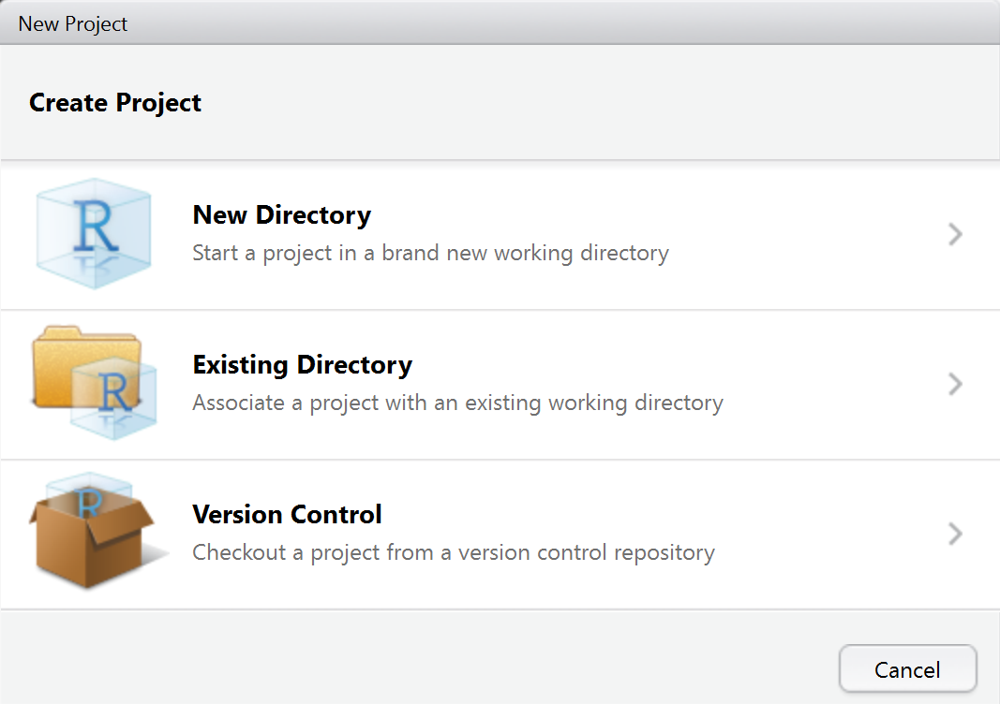

# R Schnittstellen - Versionsverwaltung und Applikationen
Jan-Philipp Kolb  
9 Mai 2017  


# Versionsverwaltung


## [Wozu überhaupt Versionskontrolle?](http://r-bio.github.io/intro-git-rstudio/)


## [Warum Versionskontrolle?](https://git-scm.com/book/de/v1/Los-geht%E2%80%99s-Wozu-Versionskontrolle%3F)

- Versionskontrollsysteme (VCS) protokollieren Änderungen an einer Datei oder einer Anzahl von Dateien über die Zeit hinweg

[Wikipedia Artikel zu Versionsverwaltung](https://de.wikipedia.org/wiki/Versionsverwaltung)


## [Gründe für die Nutzung von Versionskontrolle](http://stackoverflow.com/questions/1408450/why-should-i-use-version-control)


## [GitHub](https://github.com/)


## [GitHub Konferenz](https://githubuniverse.com/satellite/?utm_source=github&utm_medium=banner&utm_campaign=ww-satellite-20170405)

London 22 und 23 Mai 2017


## [GitLab](https://about.gitlab.com/)


## [Git installieren](https://support.rstudio.com/hc/en-us/articles/200532077-Version-Control-with-Git-and-SVN)

- Windows und OS X: 

http://git-scm.com/downloads

- Debian/Ubuntu: 

```
sudo apt-get install git-core
```

- Fedora/RedHat: 

```
sudo yum install git-core
```


## Links

- [Gründe eines Sozialwissenschaftlers Versionskontrolle zu nutzen](http://stackoverflow.com/questions/2712421/r-and-version-control-for-the-solo-data-analyst)

- [Git Bootcamp](https://help.github.com/articles/set-up-git/)


# R und Git


## Rstudio und git - ein Projekt anlegen


## Ein Projekt mit Versionskontrolle



## Auswahl Versionskontrolle


## Ein Projekt clonen


## Der git-Reiter in Rstudio


## Aktuelle eigene Änderungen committen


## Der übliche Ablauf

- Datei bearbeiten und speichern
- Änderungen commiten
- Änderungen von anderen ziehen (pull)
- Eigene Änderung hochladen (push)

## Links

- [Commit failed - git shell](http://stackoverflow.com/questions/11229843/github-windows-commit-failed-failed-to-create-a-new-commit)

- [Git cheatsheet](https://services.github.com/on-demand/downloads/github-git-cheat-sheet.pdf)


## Commands

``` 
git commit
```

``` 
git push
```


<http://stackoverflow.com/questions/1125968/force-git-to-overwrite-local-files-on-pull>

## Problems with disk space

[WinDirStat](http://www.tecchannel.de/storage/tools/2037869/mit_windirstat_kostenlos_speicherplatz_auf_der_festplatte_visualisieren/)
<https://support.microsoft.com/de-de/kb/912997>
<http://www.pcwelt.de/tipps/Update-Dateien-loeschen-8357046.html>


## [Quelle für Pakete](https://www.researchgate.net/figure/301746965_fig1_Figure-2-Number-of-R-packages-by-source)


## Ein Paket von Github installieren


```r
install.packages("devtools")
library(devtools)
install_github("Japhilko/gosmd")
```


## Datensätze Suchfunktion


## [Git und Rstudio](https://www.r-bloggers.com/version-control-file-sharing-and-collaboration-using-github-and-rstudio/)


## Links

- [Using github and rstudio](https://www.r-bloggers.com/version-control-file-sharing-and-collaboration-using-github-and-rstudio/)

- [How do I tell Git for Windows where to find my private RSA key](http://serverfault.com/questions/194567/how-do-i-tell-git-for-windows-where-to-find-my-private-rsa-key)

- [Reset local repository branch to be just like remote repository HEAD](http://stackoverflow.com/questions/1628088/reset-local-repository-branch-to-be-just-like-remote-repository-head)

- [How I Manage Data Analysis Projects with RStudio and Git - Part 1](http://christianlemp.com/blog/2014/02/05/How-I-Manage-Data-Projects-with-RStudio-and-Git.html)

- [How do I force “git pull” to overwrite local files?](http://stackoverflow.com/questions/1125968/how-do-i-force-git-pull-to-overwrite-local-files)

# Shiny Apps 


## Das `shiny` Paket installieren


```r
install.packages("shiny")
```


## Wer hat's erfunden?


```r
citation("shiny")
```

```
## 
## To cite package 'shiny' in publications use:
## 
##   Winston Chang, Joe Cheng, JJ Allaire, Yihui Xie and Jonathan
##   McPherson (2017). shiny: Web Application Framework for R. R
##   package version 1.0.1. https://CRAN.R-project.org/package=shiny
## 
## A BibTeX entry for LaTeX users is
## 
##   @Manual{,
##     title = {shiny: Web Application Framework for R},
##     author = {Winston Chang and Joe Cheng and JJ Allaire and Yihui Xie and Jonathan McPherson},
##     year = {2017},
##     note = {R package version 1.0.1},
##     url = {https://CRAN.R-project.org/package=shiny},
##   }
```


## Eine erste Beispielapp


```r
library(shiny)
runExample("01_hello")
```


## Der Start


## Dem Kind einen Namen geben


## Die erste App

- man muss den Run App Button drücken


- Das Ergebnis:


## Zur Erklärung

- Zumeist arbeitet man mit mindestens zwei Dateien
- Das user interface wird mit einer Datei erzeugt werden, die `ui.R` genannt werden muss
- Für die Server Seite brauchen wir auch ein eigenes File, dieses bennenen wir mit `server.R`

## Eine zweite Beispiel App


```r
library(shiny)
runExample("02_text")
```


## [Einführung in Shiny](https://shiny.rstudio.com/tutorial/)


## Links 

- [Eine Dashboard App erzeugen](https://shiny.rstudio.com/tutorial/js-lesson1/#creating-a-dashboard-app)

