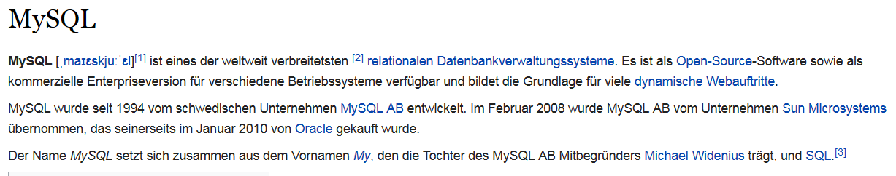
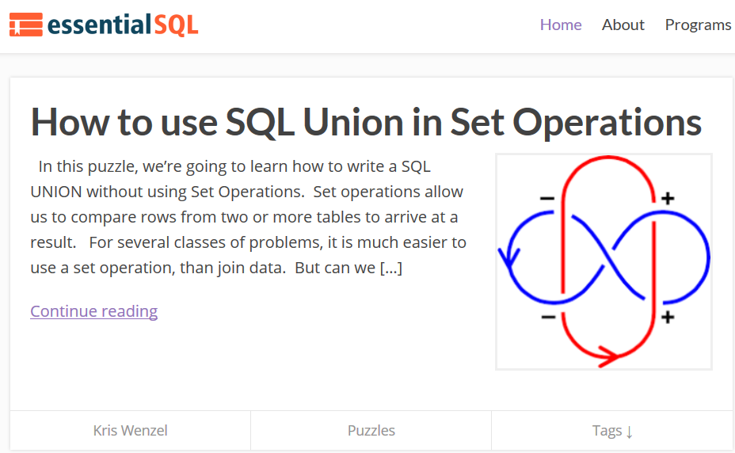
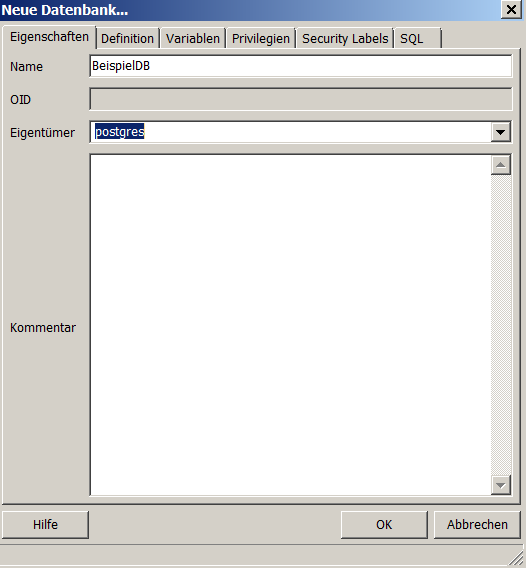

# R Schnittstellen - Integration von Datenbanken
Jan-Philipp Kolb  
9 Mai 2017  


## Datenbanken und R


## [Was sind Datenbanken?](https://de.wikipedia.org/wiki/Datenbank)

- Eine Datenbank, auch Datenbanksystem (DBS) genannt, ist ein System zur elektronischen Datenverwaltung. 
- Die wesentliche Aufgabe eines DBS ist es, große Datenmengen effizient, widerspruchsfrei und dauerhaft zu speichern.

## [Wann sollte man R um Datenbanken ergänzen?](https://cran.r-project.org/web/packages/dplyr/vignettes/databases.html)

- Wenn ein Datensatz in den Arbeitsspeicher passt, gibt es keinen Grund eine Datenbank zu nutzen.

Man nutzt die Schnittstelle zu Datenbanken,...

- weil die Daten bereits in einer Datenbank vorgehalten werden
- oder weil der Datensatz nicht in den Arbeitsspeicher passt


## Die drei großen Open-Source Datenbanken

- sqlite, mysql and postgresql
- für alle drei gibt es Anbindungen in R
- und auf diese Anbindungen soll in der Folge der Fokus liegen

## [sqlite](https://www.sqlite.org/)


- [SQLite](https://de.wikipedia.org/wiki/SQLite) - Open Source Programmbibliothek mit relationalem Datenbanksystem 
- [es ist eine schlanke Datenbank](https://chemnitzer.linux-tage.de/2015/media/vortraege/folien/144_sqlite.pdf)

## [mysql Datenbank](https://de.wikipedia.org/wiki/MySQL)




- Grundlage für dynamische Webauftritte
- am meisten verbreitete Datenbanksystem

## [PostgreSQL](http://www.postgresql.de/)


- [PostgreSQL](https://de.wikipedia.org/wiki/PostgreSQL) ist in den meisten Linux-Distributionen enthalten.
- Schnittstellen zu vielen Programmiersprachen

## [Vergleich zwischen MySQL und PostgreSQL](http://www.torsten-horn.de/techdocs/sql.htm)


## [Beispiel zu relationalen Datenbanken](https://ab.inf.uni-tuebingen.de/teaching/ss03/asa/db_intro.pdf)


## [Was ist der Unterschied zwischen SQL und NoSQL](https://www.r-bloggers.com/database-interfaces/)


- [NoSQL steht für not only SQL](https://www.consol.de/presse/presse-meldungen/details/was-sie-schon-immer-ueber-nosql-wissen-wollten/)

- Key-Value-Stores (bspw. [CouchDB](https://de.wikipedia.org/wiki/CouchDB), MongoDB) und Speicherung unstrukturierter Daten wird durch Schema Evolution ermöglicht

- mit NoSQL lassen sich deutlich gößere Datenmengen händeln

- Horizontale Skalierbarkeit - wichtig bei Daten wie Video, Audio oder Bild-Dateien

- NoSQL-Bewegung ist nicht proprietär an einen Hersteller gebunden

## [MongoDB](https://de.wikipedia.org/wiki/MongoDB)

- MongoDB - sehr schnell und einfach installiert und benutzt.
-  Schema-freie, dokumentenorientierte NoSQL-Datenbank
- kann Sammlungen von JSON-ähnlichen Dokumenten verwalten


## [CouchDB](https://de.wikipedia.org/wiki/CouchDB)

-  dokumentenorientierte Datenbank
- [zur Interaktion mit CouchDB kann das Paket `sofa` verwendet werden](https://github.com/ropensci/sofa)

### [Podcast zu CouchDB](https://cre.fm/cre125-couchdb)


## [Quick-R zur Integration von Datenbanken](http://www.statmethods.net/input/dbinterface.html)


## SQL lernen...

- [...mit W3School](https://www.w3schools.com/sql/default.asp)

- [...mit SQLzoo](http://sqlzoo.net/)

- [...SQL lernen mit tutorialspoint](http://www.tutorialspoint.com/sql/)

- [... mit Beispielen von sql tutorial](http://www.sql-tutorial.ru/en/book_database_airport.html)


## [Weitergehendes Lernen](https://www.essentialsql.com/)




## Weitere Resourcen

- [Video um NoSQL zu verstehen](https://www.youtube.com/watch?v=TvRDOLiadtg&list=PLxcWHsmHykmWlXorl8rm-2Ux4HP1sFkub)

- [Datenbanken in R](https://cran.r-project.org/web/packages/dplyr/vignettes/databases.html)

- [Database basics - dplyr and DBI](https://shiny.rstudio.com/articles/overview.html)

- [Frühe Entwicklung zu Integration von Datenbanken](https://cran.r-project.org/web/packages/DBI/vignettes/DBI-proposal.html)

## Das R-Paket `dplyr`


## [Das Paket `dplyr`](https://cran.rstudio.com/web/packages/dplyr/vignettes/introduction.html)


```r
install.packages("nycflights13")
```


```r
library(nycflights13)
dim(flights)
```

```
## [1] 336776     19
```

```r
head(flights)
```

```
## # A tibble: 6 × 19
##    year month   day dep_time sched_dep_time dep_delay arr_time
##   <int> <int> <int>    <int>          <int>     <dbl>    <int>
## 1  2013     1     1      517            515         2      830
## 2  2013     1     1      533            529         4      850
## 3  2013     1     1      542            540         2      923
## 4  2013     1     1      544            545        -1     1004
## 5  2013     1     1      554            600        -6      812
## 6  2013     1     1      554            558        -4      740
## # ... with 12 more variables: sched_arr_time <int>, arr_delay <dbl>,
## #   carrier <chr>, flight <int>, tailnum <chr>, origin <chr>, dest <chr>,
## #   air_time <dbl>, distance <dbl>, hour <dbl>, minute <dbl>,
## #   time_hour <dttm>
```

## Die Reihen filtern mit `filter()`


```r
library(dplyr)
head(filter(flights, month == 1,day==1))
```

```
## # A tibble: 6 × 19
##    year month   day dep_time sched_dep_time dep_delay arr_time
##   <int> <int> <int>    <int>          <int>     <dbl>    <int>
## 1  2013     1     1      517            515         2      830
## 2  2013     1     1      533            529         4      850
## 3  2013     1     1      542            540         2      923
## 4  2013     1     1      544            545        -1     1004
## 5  2013     1     1      554            600        -6      812
## 6  2013     1     1      554            558        -4      740
## # ... with 12 more variables: sched_arr_time <int>, arr_delay <dbl>,
## #   carrier <chr>, flight <int>, tailnum <chr>, origin <chr>, dest <chr>,
## #   air_time <dbl>, distance <dbl>, hour <dbl>, minute <dbl>,
## #   time_hour <dttm>
```

## [Erste Schritte mit `dplyr`](http://genomicsclass.github.io/book/pages/dplyr_tutorial.html)


```r
install.packages("downloader")
```


```r
library(downloader)
url <- "https://raw.githubusercontent.com/genomicsclass/dagdata/master/inst/extdata/msleep_ggplot2.csv"
filename <- "msleep_ggplot2.csv"
if (!file.exists(filename)) download(url,filename)
msleep <- read.csv("msleep_ggplot2.csv")
head(msleep)
```

```
##                         name      genus  vore        order conservation
## 1                    Cheetah   Acinonyx carni    Carnivora           lc
## 2                 Owl monkey      Aotus  omni     Primates         <NA>
## 3            Mountain beaver Aplodontia herbi     Rodentia           nt
## 4 Greater short-tailed shrew    Blarina  omni Soricomorpha           lc
## 5                        Cow        Bos herbi Artiodactyla domesticated
## 6           Three-toed sloth   Bradypus herbi       Pilosa         <NA>
##   sleep_total sleep_rem sleep_cycle awake brainwt  bodywt
## 1        12.1        NA          NA  11.9      NA  50.000
## 2        17.0       1.8          NA   7.0 0.01550   0.480
## 3        14.4       2.4          NA   9.6      NA   1.350
## 4        14.9       2.3   0.1333333   9.1 0.00029   0.019
## 5         4.0       0.7   0.6666667  20.0 0.42300 600.000
## 6        14.4       2.2   0.7666667   9.6      NA   3.850
```


```r
sleepData <- select(msleep, name, sleep_total)
head(sleepData)
```

```
##                         name sleep_total
## 1                    Cheetah        12.1
## 2                 Owl monkey        17.0
## 3            Mountain beaver        14.4
## 4 Greater short-tailed shrew        14.9
## 5                        Cow         4.0
## 6           Three-toed sloth        14.4
```


## Integration von PostgreSQL mit dem Paket RPostgreSQL


## Die Nutzung von [RPostgreSQL](http://wiki.openstreetmap.org/wiki/PostgreSQL)


PostgreSQL installieren

- [Installation Windows](https://www.postgresql.org/download/windows/)
- [Installation Linux](http://postgres.de/install.html)

## PG admin installieren


- [PGadmin](https://www.pgadmin.org/)
- [Tutorial zur Nutzung von PGadmin](https://www.enterprisedb.com/resources/videos/how-create-postgres-database-using-pgadmin)


## Neue Datenbank anlegen


## Eine neue Datenbank



- Unter Linux kann man auch in der Kommandozeile einen neuen Nutzer anlegen:

```
sudo -u postgres createuser Japhilko
```
- und auch eine neue Datenbank anlegen:

```
sudo -u postgres createdb -E UTF8 -O Japhilko offlgeoc
```

## Wie bekomme ich Daten in die Datenbank


```r
install.packages("RPostgreSQL")
```


```r
library("RPostgreSQL")
```

## [Datenbank mit R verbinden](https://datashenanigan.wordpress.com/2015/05/18/getting-started-with-postgresql-in-r/)


```r
pw <- {"1234"}
drv <- dbDriver("PostgreSQL")
con <- dbConnect(drv, dbname = "BeispielDB",
                 host = "localhost", port = 5432,
                 user = "postgres", password = pw)
rm(pw) # removes the password

dbExistsTable(con, "BeispielDB")
```

## Daten an Datenbank schicken


```r
data(mtcars)
df <- data.frame(carname = rownames(mtcars), 
                 mtcars, 
                 row.names = NULL)
df$carname <- as.character(df$carname)
rm(mtcars)
 
dbWriteTable(con, "cartable", 
             value = df, append = TRUE, row.names = FALSE)
```

- eine Abfrage machen:


```r
df_postgres <- dbGetQuery(con, "SELECT * from cartable")
```

- die beiden Tabellen müssten gleich sein


```r
identical(df, df_postgres)
```


## Anwendung - Geodaten in die Datenbank migrieren

- Zunächst muss für die Datenbank die [postgis Erweiterung](http://postgis.net/install/) installiert werden:

```
CREATE EXTENSION postgis;
```

## Programm zum Import der OSM Daten in PostgreSQL- osm2pgsql

- [Nutzung von osm2pgsql](http://www.volkerschatz.com/net/osm/osm2pgsql-usage.html)
- Läuft unter Linux deutlich besser
- so könnte bspw. ein Import in PostgreSQL aussehen:

```
osm2pgsql -c -d osmBerlin --slim -C  -k  berlin-latest.osm.pbf
```

```
osm2pgsql -s -U postgres -d offlgeoc /home/kolb/Forschung/osmData/data/saarland-latest.osm.pbf 
```

```
osm2pgsql -s -U postgres -d offlgeocRLP -o gazetteer /home/kolb/Forschung/osmData/data/rheinland-pfalz-latest.osm.pbf 
```

## Mögliche Abfragen

[So bekommt man alle administrativen Grenzen:](https://gist.github.com/jpetazzo/5177554)

```
SELECT name FROM planet_osm_polygon WHERE boundary='administrative'
```


- [mehr als eine Spalte auswählen](http://dba.stackexchange.com/questions/54011/postgres-function-assign-query-results-to-multiple-variables)


```r
df_postgres <- dbGetQuery(con, "SELECT name, admin_level FROM planet_osm_polygon WHERE boundary='administrative'")
```


```r
barplot(table(df_postgres[,2]),col="royalblue")
```

## Eine Abfrage zu administrativen Grenzen


```r
df_adm8 <- dbGetQuery(con, "SELECT name, admin_level FROM planet_osm_polygon WHERE boundary='administrative' AND admin_level='8'")
```


## Mögliche Abfragen


```r
df_hnr <- dbGetQuery(con, "SELECT * FROM planet_osm_line, planet_osm_point 
WHERE planet_osm_line.name='Nordring' AND planet_osm_line.highway IN ('motorway','trunk','primary')
AND planet_osm_point.name='Ludwigshafen' AND planet_osm_point.place IN ('city', 'town')
ORDER BY ST_Distance(planet_osm_line.way, planet_osm_point.way)")
```


```r
df_hnr <- dbGetQuery(con, "SELECT * FROM planet_osm_line, planet_osm_point 
WHERE planet_osm_line.name='Nordring' AND planet_osm_point.name='Ludwigshafen' 
ORDER BY ST_Distance(planet_osm_line.way, planet_osm_point.way)")
head(df_hnr)
```


```r
df_ <- dbGetQuery(con, "SELECT * FROM planet_osm_line, planet_osm_point 
WHERE planet_osm_line.name='Nordring' AND planet_osm_point.name='Ludwigshafen' 
ORDER BY ST_Distance(planet_osm_line.way, planet_osm_point.way)")
head(df_hnr)
```


```r
colnames(df_)
```


```r
table(df_$name)
```

## Adresse in einem Ort


```r
df_sipp <- dbGetQuery(con, "SELECT * FROM planet_osm_line, planet_osm_point 
WHERE planet_osm_line.name='Rechweg' AND planet_osm_point.name='Sippersfeld' 
ORDER BY ST_Distance(planet_osm_line.way, planet_osm_point.way)")
head(df_sipp)
```


## [OpenStreetMap und Open Government Data in PostGIS](http://tud.at/linuxwochen/2013-osm-postgis/)

- [Der Anfang mit PostGIS](http://www.bostongis.com/?content_name=postgis_tut01)
- [PostGIS und R](https://gis.stackexchange.com/questions/64950/working-with-postgis-data-in-r)


```r
restnam <- dbGetQuery(con, "SELECT name, COUNT(osm_id) AS anzahl
FROM planet_osm_point
WHERE amenity = 'restaurant'
  AND name <> ''
GROUP BY name
ORDER BY anzahl DESC
LIMIT 10")
head(restnam)
```


## [PostgreSQL and Leaflet](https://www.r-bloggers.com/using-postgresql-and-shiny-with-a-dynamic-leaflet-map-monitoring-trash-cans/)


```r
install.packages("plot3D")
```


```r
library(plot3D)
library(RPostgreSQL)
```

## Links

- [osm2pgsql
](https://github.com/petewarden/osm2pgsql/tree/master/gazetteer)

- Andrew Whitby - [Roll-your-own geocoding with OpenStreetMap Nominatim on Amazon EC2](https://andrewwhitby.com/2014/12/18/nominatim-on-ec2/)

- [OpenStreetMap Nominatim Server for Geocoding](http://koo.fi/blog/2015/03/19/openstreetmap-nominatim-server-for-geocoding/#Database_users)

- [Getting Started With PostGIS](http://www.bostongis.com/PrinterFriendly.aspx?content_name=postgis_tut01)

- [PostGIS geocode](http://postgis.net/docs/Geocode.html)

- [Nominatim installation](http://wiki.openstreetmap.org/wiki/Nominatim/Installation)

- [Wie bekommt man OSM Daten](https://www.azavea.com/blog/2015/12/21/tools-for-getting-data-out-of-openstreetmap-and-into-desktop-gis/)


## [`RMySQL`](https://cran.r-project.org/web/packages/RMySQL/index.html)


```r
install.packages("RMySQL")
```

## Nutzung von weiteren Datenbanken (MongoDB, MySQL)


