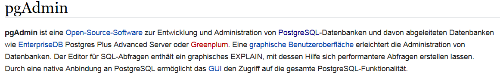
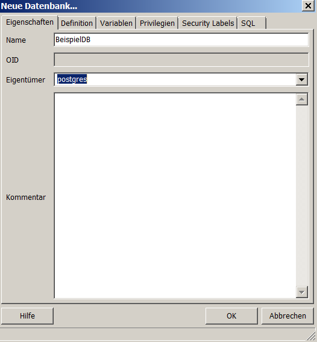

```{r, include=FALSE}
knitr::opts_chunk$set(echo = TRUE,eval=F)
```

## Die Nutzung von [RPostgreSQL](http://wiki.openstreetmap.org/wiki/PostgreSQL)


### PostgreSQL installieren

- [Installation Windows](https://www.postgresql.org/download/windows/)
- [Installation Linux](http://postgres.de/install.html)

## PG admin installieren



- [PGadmin](https://www.pgadmin.org/)
- [Tutorial zur Nutzung von PGadmin](https://www.enterprisedb.com/resources/videos/how-create-postgres-database-using-pgadmin)


## Neue Datenbank anlegen


## Eine neue Datenbank



- Unter Linux kann man auch in der Kommandozeile einen neuen Nutzer anlegen:

```
sudo -u postgres createuser Japhilko
```
- und auch eine neue Datenbank anlegen:

```
sudo -u postgres createdb -E UTF8 -O Japhilko offlgeoc
```

## Wie bekomme ich Daten in die Datenbank

```{r,eval=F}
install.packages("RPostgreSQL")
```


```{r,background='#FA58F4'}
library("RPostgreSQL")
```

```{r}
citation("RPostgreSQL")
```


## [Datenbank mit R verbinden](https://datashenanigan.wordpress.com/2015/05/18/getting-started-with-postgresql-in-r/)

```{r,eval=F}
pw <- {"1234"}
drv <- dbDriver("PostgreSQL")
con <- dbConnect(drv, dbname = "BeispielDB",
                 host = "localhost", port = 5432,
                 user = "postgres", password = pw)
rm(pw) # removes the password

dbExistsTable(con, "BeispielDB")
```

## Daten an Datenbank schicken

```{r}
data(mtcars)
df <- data.frame(carname = rownames(mtcars), 
                 mtcars, 
                 row.names = NULL)
df$carname <- as.character(df$carname)
rm(mtcars)
 
dbWriteTable(con, "cartable", 
             value = df, append = TRUE, row.names = FALSE)
```

- eine Abfrage machen:

```{r}
df_postgres <- dbGetQuery(con, "SELECT * from cartable")
```

- die beiden Tabellen müssten gleich sein

```{r}
identical(df, df_postgres)
```


## Anwendung - Geodaten in die Datenbank migrieren

- Zunächst muss für die Datenbank die [postgis Erweiterung](http://postgis.net/install/) installiert werden:

```
CREATE EXTENSION postgis;
```

- [Der Anfang mit PostGIS](http://www.bostongis.com/?content_name=postgis_tut01)
- [PostGIS und R](https://gis.stackexchange.com/questions/64950/working-with-postgis-data-in-r)


## Programm zum Import der OpenStreetMap Daten in PostgreSQL- [osm2pgsql](http://wiki.openstreetmap.org/wiki/Osm2pgsql)

- Ausschnitte der OpenStreetMap Daten können bei der Geofabrik heruntergeladen werden

- [Nutzung von osm2pgsql](http://www.volkerschatz.com/net/osm/osm2pgsql-usage.html)
- Läuft unter Linux deutlich besser
- so könnte bspw. ein Import in PostgreSQL aussehen:

```
osm2pgsql -c -d osmBerlin --slim -C  -k  berlin-latest.osm.pbf
```

```
osm2pgsql -s -U postgres -d offlgeoc /home/kolb/Forschung/osmData/data/saarland-latest.osm.pbf 
```

```
osm2pgsql -s -U postgres -d offlgeocRLP -o gazetteer /home/kolb/Forschung/osmData/data/rheinland-pfalz-latest.osm.pbf 
```

## Mögliche Abfragen

[So bekommt man alle administrativen Grenzen:](https://gist.github.com/jpetazzo/5177554)

```
SELECT name FROM planet_osm_polygon WHERE boundary='administrative'
```


- [mehr als eine Spalte auswählen](http://dba.stackexchange.com/questions/54011/postgres-function-assign-query-results-to-multiple-variables)

```{r,eval=F}
df_postgres <- dbGetQuery(con, "SELECT name, admin_level FROM planet_osm_polygon WHERE boundary='administrative'")
```


## Eine Abfrage zu administrativen Grenzen (ein spezielles Level) 

```{r,eval=F}
df_adm8 <- dbGetQuery(con, "SELECT name, admin_level FROM planet_osm_polygon WHERE boundary='administrative' AND admin_level='8'")
```

## Mögliche Abfragen

```{r,eval=F}
df_hnr <- dbGetQuery(con, "SELECT * FROM planet_osm_line, planet_osm_point 
WHERE planet_osm_line.name='Nordring' AND planet_osm_line.highway IN ('motorway','trunk','primary')
AND planet_osm_point.name='Ludwigshafen' AND planet_osm_point.place IN ('city', 'town')
ORDER BY ST_Distance(planet_osm_line.way, planet_osm_point.way)")
```

```{r,eval=F}
df_hnr <- dbGetQuery(con, "SELECT * FROM planet_osm_line, planet_osm_point 
WHERE planet_osm_line.name='Nordring' AND planet_osm_point.name='Ludwigshafen' 
ORDER BY ST_Distance(planet_osm_line.way, planet_osm_point.way)")
head(df_hnr)
```

```{r,eval=F}
df_ <- dbGetQuery(con, "SELECT * FROM planet_osm_line, planet_osm_point 
WHERE planet_osm_line.name='Nordring' AND planet_osm_point.name='Ludwigshafen' 
ORDER BY ST_Distance(planet_osm_line.way, planet_osm_point.way)")
head(df_hnr)
```

```{r,eval=F}
colnames(df_)
```

```{r,eval=F}
table(df_$name)
```

## Adresse in einem Ort

```{r,eval=F}
df_sipp <- dbGetQuery(con, "SELECT * FROM planet_osm_line, planet_osm_point 
WHERE planet_osm_line.name='Rechweg' AND planet_osm_point.name='Sippersfeld' 
ORDER BY ST_Distance(planet_osm_line.way, planet_osm_point.way)")
head(df_sipp)
```


## [PostgreSQL and Leaflet](https://www.r-bloggers.com/using-postgresql-and-shiny-with-a-dynamic-leaflet-map-monitoring-trash-cans/)

```{r,eval=F}
install.packages("plot3D")
```


```{r}
library(plot3D)
library(RPostgreSQL)
```

## Links

- [osm2pgsql
](https://github.com/petewarden/osm2pgsql/tree/master/gazetteer)

- Andrew Whitby - [Roll-your-own geocoding with OpenStreetMap Nominatim on Amazon EC2](https://andrewwhitby.com/2014/12/18/nominatim-on-ec2/)

- [OpenStreetMap Nominatim Server for Geocoding](http://koo.fi/blog/2015/03/19/openstreetmap-nominatim-server-for-geocoding/#Database_users)

- [Getting Started With PostGIS](http://www.bostongis.com/PrinterFriendly.aspx?content_name=postgis_tut01)

- [PostGIS geocode](http://postgis.net/docs/Geocode.html)

- [Nominatim installation](http://wiki.openstreetmap.org/wiki/Nominatim/Installation)

- [Wie bekommt man OSM Daten](https://www.azavea.com/blog/2015/12/21/tools-for-getting-data-out-of-openstreetmap-and-into-desktop-gis/)


- [PostgreSQL](http://wiki.openstreetmap.org/wiki/PostgreSQL)
