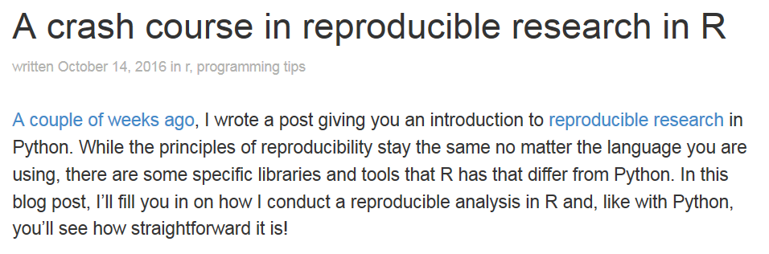

```{r setup, include=FALSE}
knitr::opts_chunk$set(echo = TRUE)
```

## [CRAN Taskview zu reproducible research](https://cran.r-project.org/web/views/ReproducibleResearch.html)


## [Reproducible Research
with R and RStudio](https://englianhu.files.wordpress.com/2016/01/reproducible-research-with-r-and-studio-2nd-edition.pdf)


- Ein Online Buch mit vielen nützlichen Tipps

## [Ein Crash Kurs in Reproducible Research mit R](http://t-redactyl.io/blog/2016/10/a-crash-course-in-reproducible-research-in-r.html)



## [Umsetzung in R](http://chance.amstat.org/2015/11/reproducible-reporting/)


