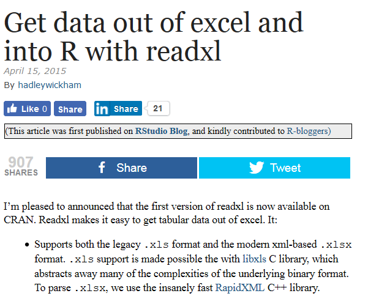

```{r, include=FALSE}
knitr::opts_chunk$set(echo = TRUE,message=F,warnings=F)
```

## Das Paket `xlsx`

- Eine wichtige Datenquelle - [Eurostat](http://appsso.eurostat.ec.europa.eu/nui/setupDownloads.do)

```{r,eval=F}
library("xlsx")
dat <- read.xlsx("cult_emp_sex.xls",1)
```

## [Einige Schritte um R und Excel zu verbinden](http://www.milanor.net/blog/steps-connect-r-excel-xlconnect/)

- [Die Excel-Verbindung](https://www.r-bloggers.com/r-the-excel-connection/)

```{r,eval=F}
install.packages("XLConnect")
```

```{r}
library("XLConnect")
```

](figure/XLconnect.PNG)

## [Eine Excel Datei aus R erzeugen](http://www.milanor.net/blog/steps-connect-r-excel-xlconnect/)

```{r,eval=F}
fileXls <- "data/newFile.xlsx"
unlink(fileXls, recursive = FALSE, force = FALSE)
exc <- loadWorkbook(fileXls, create = TRUE)
createSheet(exc,'Input')
saveWorkbook(exc)
```

## Das Arbeitsblatt mit Daten befüllen

```{r,eval=F}
input <- data.frame('inputType'=c('Day','Month'),'inputValue'=c(2,5))
writeWorksheet(exc, input, sheet = "input", startRow = 1, startCol = 2)
saveWorkbook(exc)
```

## [BERT - Eine weitere Verbindung zwischen R und Excel](https://www.r-bloggers.com/bert-a-newcomer-in-the-r-excel-connection/)

- [Schnellstart mit Excel](https://bert-toolkit.com/bert-quick-start)


```{r}
myFunction <- function(){
 aa <- rnorm(200)
 bb <- rnorm(200)
 res <- lm(aa~bb)$res
 return(res)
}
```


## Link `BERT`

- [BERT: a newcomer in the R Excel connection](https://www.r-bloggers.com/bert-a-newcomer-in-the-r-excel-connection/)


## Das Paket readxl

- [readxl](https://www.r-bloggers.com/get-data-out-of-excel-and-into-r-with-readxl/)

```{r,eval=F}
install.packages("readxl")
```

```{r}
library(readxl)
```


