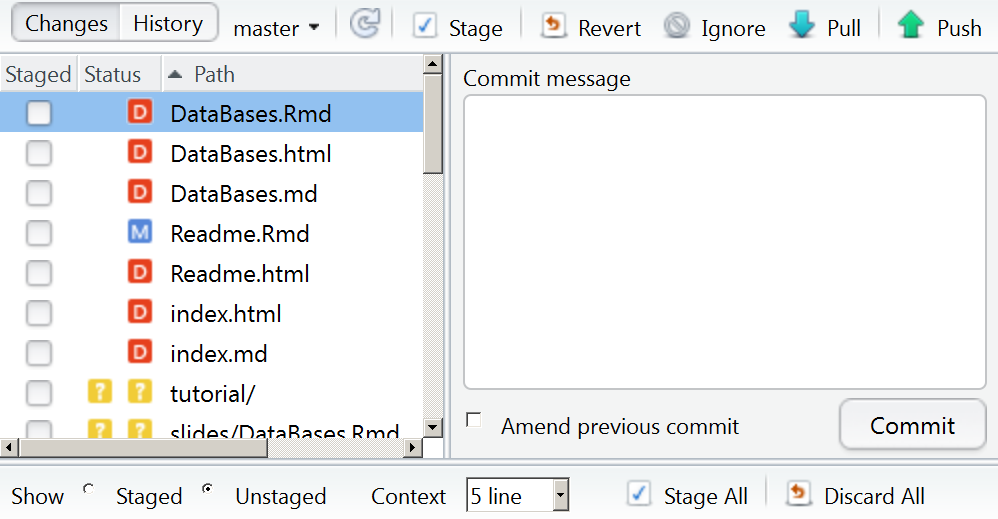
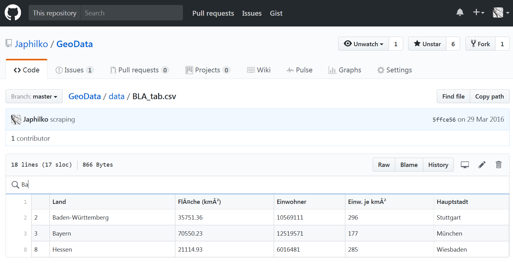

```{r, include=FALSE}
knitr::opts_chunk$set(echo = TRUE)
```


## Rstudio und git - ein Projekt anlegen


## Ein Projekt mit Versionskontrolle


## Auswahl Versionskontrolle


## Ein Projekt clonen


## Der git-Reiter in Rstudio


## Aktuelle eigene Änderungen committen




## Links

- [Commit failed - git shell](http://stackoverflow.com/questions/11229843/github-windows-commit-failed-failed-to-create-a-new-commit)

- [Git cheatsheet](https://services.github.com/on-demand/downloads/github-git-cheat-sheet.pdf)


## Commands

``` 
git commit
```

``` 
git push
```


<http://stackoverflow.com/questions/1125968/force-git-to-overwrite-local-files-on-pull>

## Problems with disk space

[WinDirStat](http://www.tecchannel.de/storage/tools/2037869/mit_windirstat_kostenlos_speicherplatz_auf_der_festplatte_visualisieren/)
<https://support.microsoft.com/de-de/kb/912997>
<http://www.pcwelt.de/tipps/Update-Dateien-loeschen-8357046.html>


## [Quelle für Pakete](https://www.researchgate.net/figure/301746965_fig1_Figure-2-Number-of-R-packages-by-source)


## Datensätze Suchfunktion




## Links

- [Using github and rstudio](https://www.r-bloggers.com/version-control-file-sharing-and-collaboration-using-github-and-rstudio/)

- [How do I tell Git for Windows where to find my private RSA key](http://serverfault.com/questions/194567/how-do-i-tell-git-for-windows-where-to-find-my-private-rsa-key)

- [Reset local repository branch to be just like remote repository HEAD](http://stackoverflow.com/questions/1628088/reset-local-repository-branch-to-be-just-like-remote-repository-head)
