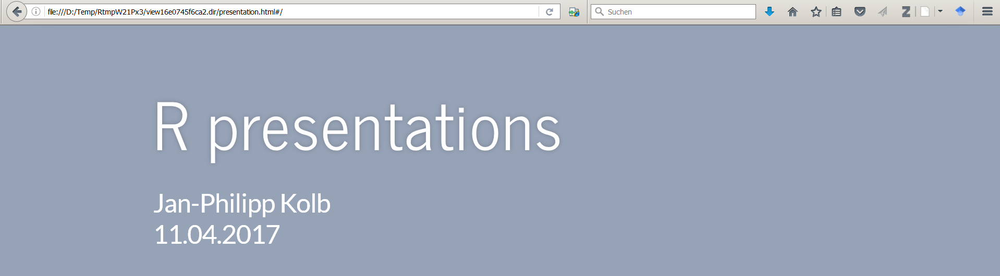
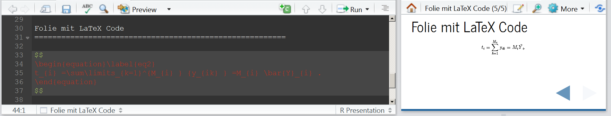
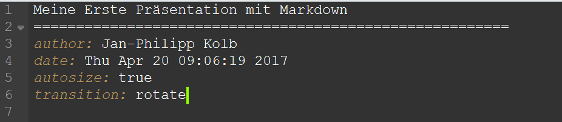

```{r setup, include=FALSE}
knitr::opts_chunk$set(echo = FALSE)
```

# Präsentationen mit Rpres

## [Der einfachste Weg - Rpres](https://rstudio-pubs-static.s3.amazonaws.com/27777_55697c3a476640caa0ad2099fe914ae5.html#/)



## Eine erste Präsentation


## Erste Daten eintragen

- Für Vergessliche:

```{r}
date()
```

## Eine Folie mit Formel

- Die Formel kann wie in LaTeX eingegeben werden

```
$$
\begin{equation}\label{eq2}
t_{i}=\sum\limits_{k=1}^{M_{i}}{y_{ik}}=M_{i}\bar{Y}_{i}. 
\end{equation}
$$
```



## Zwei Spalten

```
Folie mit zwei Spalten
====================================
Erste Spalte
***
Zweite Spalte
```

## Folienübergänge

```
transition: rotate
```



## [Weitere mögliche Folienübergänge](https://support.rstudio.com/hc/en-us/articles/200714013-Slide-Transitions-and-Navigation)


-    none
-    linear
-    rotate
-    fade
-    zoom
-    concave

## Folientypen

```
Ein neues Kapitel einfügen
====================================
type: section
```

```
Anderer Folientyp
====================================
type: prompt
```


```
Noch ein anderer Folientyp
====================================
type: alert
```

