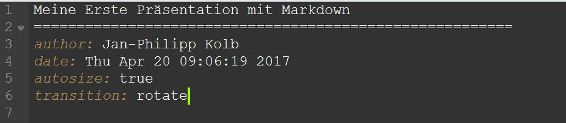
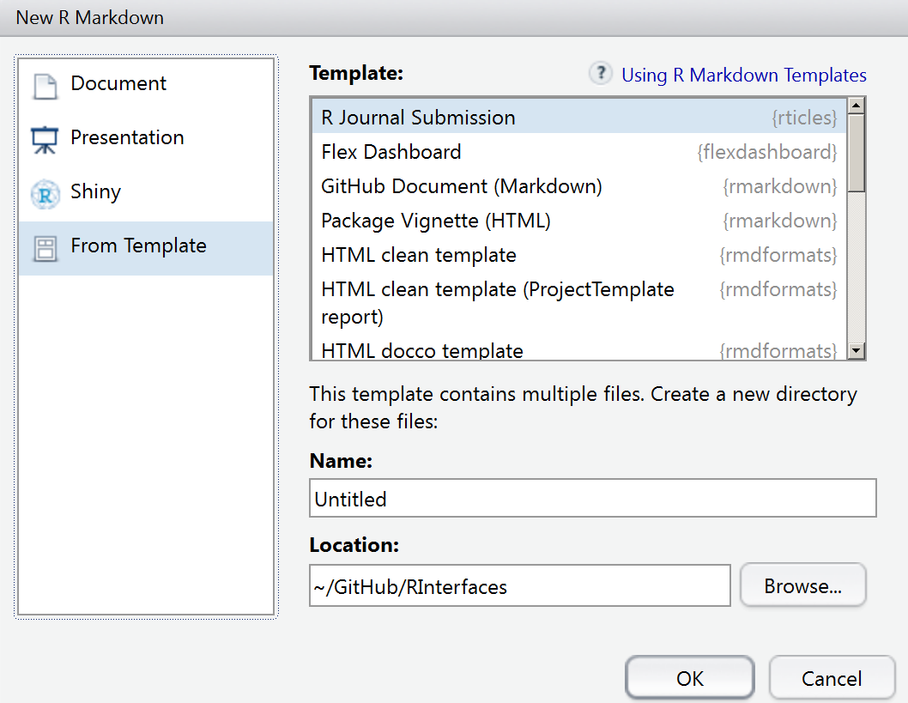
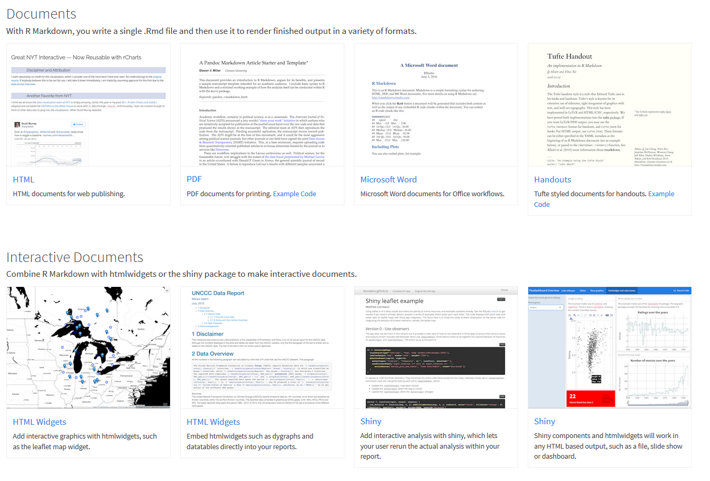

# HTML Dokumente Präsentationen und Dashboards
Jan-Philipp Kolb  
8 Mai 2017  


# Präsentationen mit Rpres

## [Der einfachste Weg - Rpres](https://rstudio-pubs-static.s3.amazonaws.com/27777_55697c3a476640caa0ad2099fe914ae5.html#/)


## Eine erste Präsentation


## Erste Daten eintragen

- Für Vergessliche:


```
## [1] "Fri Apr 21 16:17:32 2017"
```

## Eine Folie mit Formel

- Die Formel kann wie in LaTeX eingegeben werden

```
$$
\begin{equation}\label{eq2}
t_{i}=\sum\limits_{k=1}^{M_{i}}{y_{ik}}=M_{i}\bar{Y}_{i}. 
\end{equation}
$$
```


## Zwei Spalten

```
Folie mit zwei Spalten
====================================
Erste Spalte
***
Zweite Spalte
```

## Folienübergänge

```
transition: rotate
```



## [Weitere mögliche Folienübergänge](https://support.rstudio.com/hc/en-us/articles/200714013-Slide-Transitions-and-Navigation)


-    none
-    linear
-    rotate
-    fade
-    zoom
-    concave

## Folientypen

```
Ein neues Kapitel einfügen
====================================
type: section
```

```
Anderer Folientyp
====================================
type: prompt
```


```
Noch ein anderer Folientyp
====================================
type: alert
```

## [Die Schriftart wechseln](https://support.rstudio.com/hc/en-us/articles/200532307)

- Die [CSS Schrifttypen](https://www.w3schools.com/cssref/css_websafe_fonts.asp) können verwendet werden

```
Meine Präsentation
========================================
author: Jan-Philipp Kolb
font-family: 'Impact'
```

## Schrifttypen können auch importiert werden


```
Meine Präsentation
========================================
author: Jan-Philipp Kolb
font-import: http://fonts.googleapis.com/css?family=Risque
font-family: 'Risque'
```


## Kleineren Text

Normale Schriftgröße

```
<small>This sentence will appear smaller.</small>
```

## Die Präsentation anschauen

- Das Ergebnis ist hier zu sehen:

<http://rpubs.com/Japhilko82/FirstRpubs>


# Eine ioslides Präsentation

## Eine ioslides Präsentation


## [ioslides - Der Start](http://rmarkdown.rstudio.com/ioslides_presentation_format.html) 


## Weitere Dinge tun 


- Ein Bild einbinden

```

```

## Ein Logo hinzu

```
---
title: "ioslides Beispiel"
author: "Jan-Philipp Kolb"
date: "20 April 2017"
output: 
  ioslides_presentation:
    logo: figure/Rlogo.png
---
```


# Eine slidy Präsentation


## slidy Präsentationen


## [Was ist CSS?](https://de.wikipedia.org/wiki/Cascading_Style_Sheets)


- Stylesheet-Sprache für elektronische Dokumente
- eine der Kernsprachen des World Wide Webs.
- CSS wurde entworfen, um Darstellungsvorgaben weitgehend von den Inhalten zu trennen


## Cascading Style Files

- [Custom CSS](http://rmarkdown.rstudio.com/html_document_format.html#custom_css)

- [CSS](https://en.wikipedia.org/wiki/Cascading_Style_Sheets)

- [CSS pro tipps](https://github.com/AllThingsSmitty/css-protips#use-a-css-reset)

## knitr Engines

- [knitr Language Engines](http://rmarkdown.rstudio.com/authoring_knitr_engines.html)

- [slidify](http://slidify.org/)

## Tabellen

- Quelle: [R Studio, and Presentations, and Git! Oh my!](https://www.r-bloggers.com/r-studio-and-presentations-and-git-oh-my/)


  1    2    3    4    5    6    7    8    9   10
---  ---  ---  ---  ---  ---  ---  ---  ---  ---
  0    0    0    0    0    0    0    0    0    1
  0    0    0    0    0    0    0    0    1    0
  0    0    0    0    0    0    0    1    0    0
  0    0    0    0    0    0    1    0    0    0
  0    0    0    0    0    1    0    0    0    0
  0    0    0    0    1    0    0    0    0    0
  0    0    0    1    0    0    0    0    0    0
  0    0    1    0    0    0    0    0    0    0
  0    1    0    0    0    0    0    0    0    0
  1    0    0    0    0    0    0    0    0    0


## Das CSS ändern

Um den Präsentationstyp zu ändern kann man das CSS verändern

- [Cascading Style Sheets](https://de.wikipedia.org/wiki/Cascading_Style_Sheets) (CSS)

- Bspw. lässt sich die [Farbe (HTML)](http://tomheller.de/html-farben.html) ändern.
- [Man kann eine andere Schriftart wählen](https://www.mediaevent.de/css/font-family.html)
- [Es gibt zahlreiche Möglichkeiten der Schriftformatierung](https://wiki.selfhtml.org/wiki/CSS/Eigenschaften/Schriftformatierung)
- [Daneben gibt es viele weitere Dinge, die sich mit dem CSS steuern lassen](https://www.w3.org/TR/WCAG20-TECHS/C22.html)

# HTML Dokumente

## Ein HTML Dokument erzeugen


## Ein Template verwenden



## [Weitere Vorlagen nutzen](http://rmarkdown.rstudio.com/developer_document_templates.html)

- Es gibt viele Formate - [manche müssen erst aktiviert werden](https://blog.rstudio.org/2016/03/21/r-markdown-custom-formats/:


## [Beispiele für Templates](https://github.com/juba/rmdformats)


# Dashboards

## [Beispiel R-Pakete](https://gallery.shinyapps.io/cran-gauge/)


## [Paket installieren](https://blog.rstudio.org/2016/05/17/flexdashboard-easy-interactive-dashboards-for-r/)


```r
install.packages("flexdashboard", type = "source")
```


## Ein Dashboard erstellen mit Rstudio


## [Gallerie](http://rmarkdown.rstudio.com/gallery.html)


```r
install.packages("highcharter", type = "source")
```


