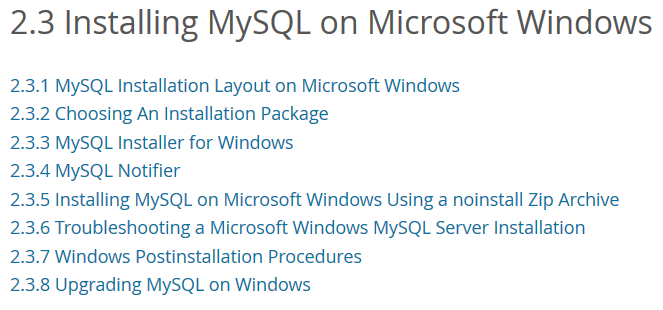
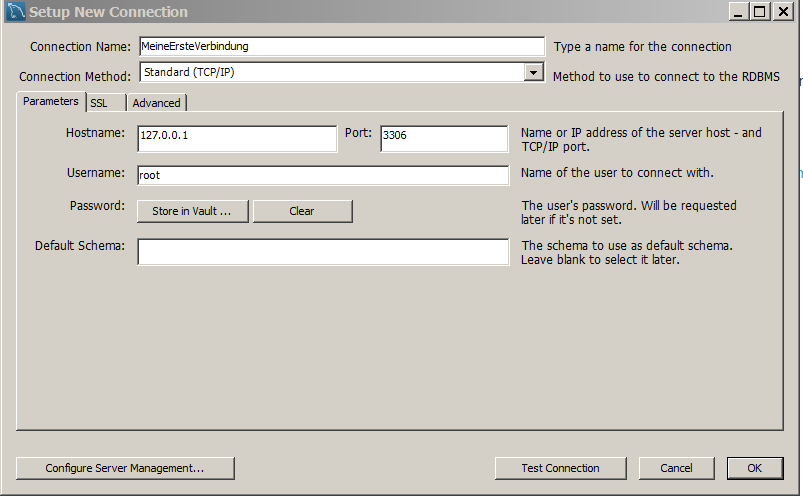

```{r, include=FALSE}
knitr::opts_chunk$set(echo = FALSE,eval=F)
```


## [MySQL Eine erste Verbindung einrichten](https://dev.mysql.com/doc/workbench/en/wb-getting-started-tutorial-create-connection.html)

- [Was ist MySQL](https://www.proggen.org/doku.php?id=php:mysql:start)

- [MySQL installieren](https://dev.mysql.com/doc/refman/5.7/en/windows-installation.html)



## [Der Start mit MySQL](https://dev.mysql.com/doc/mysql-getting-started/en/)



- - [PC Magazin - MySQL Datenbankserver](http://www.pc-magazin.de/ratgeber/grundlagen-zum-datenbankserver-mysql-1039293.html)


## [RmySQL](https://www.r-bloggers.com/rmysql-version-0-10-2-full-ssl-support/)

- Das Paket [RMySQL](https://cran.r-project.org/web/packages/RMySQL/index.html) auf dem CRAN Server

```{r,eval=F}
install.packages("RMySQL")
```

```{r,eval=F}
library(RMySQL)
mydb = dbConnect(MySQL(), user='user', password='password', dbname='database_name', host='host')
```


- Das Paket [RmySQL](https://github.com/rstats-db/RMySQL) auf Github
- [Auf MySQL mit R zugreifen](https://www.r-bloggers.com/accessing-mysql-through-r/)


## Weitere Möglichkeit die Schnittstelle zwischen [R und MySQL Datenbank nutzen](http://www.jason-french.com/blog/2014/07/03/using-r-with-mysql-databases/)


```{r,eval=F}
library(DBI)
con <- dbConnect(RMySQL::MySQL(), group = "my-db")
```

- [Youtube Video zu PHP & MySQL - Einführung und Installation](https://www.youtube.com/watch?v=2AVnuu4Ty_A)

## Mongodb

- [Installation von MongoDB unter Windows](https://docs.mongodb.com/manual/tutorial/install-mongodb-on-windows/)


## Hello World

- [Getting started with MongoDB in R](https://cran.r-project.org/web/packages/mongolite/vignettes/intro.html)

```{r,eval=F}
install.packages("mongolite")
```


```{r,eval=F}
library(mongolite)
m <- mongo(collection = "diamonds")
```


- [R und Mongodb](https://cran.r-project.org/web/packages/rmongodb/vignettes/rmongodb_introduction.html)
- [Cheatsheet zur Nutzung von Rmongodb](https://blog.codecentric.de/files/2012/12/MongoDB-CheatSheet-v1_0.pdf)
- [Rpubs - mongoDB](https://rpubs.com/davparker/32742)


## CouchDB

- [Installation von CouchDB auf Windows](http://docs.couchdb.org/en/stable/install/windows.html)
- [zur Interaktion mit CouchDB kann das Paket `sofa` verwendet werden](https://github.com/ropensci/sofa)


```{r,eval=F}
install.packages("jsonlite")
devtools::install_github("ropensci/sofa")
```

- [CouchDB und OpenStreetMap](http://wiki.openstreetmap.org/wiki/OSMCouch)

```{r,eval=F}
library("sofa")
```


## Links

- [Eine Liste aller NoSQL Datenbanken](http://bigdata-madesimple.com/a-deep-dive-into-nosql-a-complete-list-of-nosql-databases/)

- [Azure in R nutzen](http://www.r-bloggers.com/using-azure-as-an-r-datasource-part-2-pulling-data-from-mysqlmariadb/)

- [Datenbanken in R](https://cran.r-project.org/web/packages/dplyr/vignettes/databases.html)

- [Grundlagen Datenbanken - `dplyr` und `DBI`](https://shiny.rstudio.com/articles/overview.html)

- [Frühe Entwicklung zu Integration von Datenbanken in R](https://cran.r-project.org/web/packages/DBI/vignettes/DBI-proposal.html)

- [Full SSL Support](https://www.r-bloggers.com/rmysql-version-0-10-2-full-ssl-support/) [2nd link](https://www.opencpu.org/posts/rmysql-release-0-10-2/)

