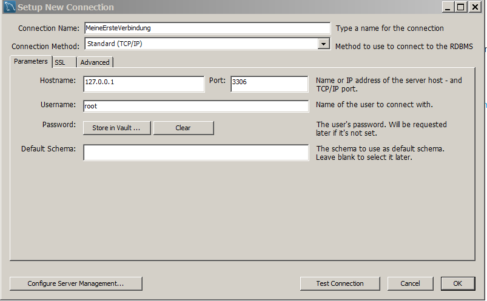

```{r setup, include=FALSE}
knitr::opts_chunk$set(echo = TRUE)
```

## [Eine erste Verbindung einrichten](https://dev.mysql.com/doc/workbench/en/wb-getting-started-tutorial-create-connection.html)




## [RmySQL](https://www.r-bloggers.com/rmysql-version-0-10-2-full-ssl-support/)


```{r,eval=F}
install.packages("RMySQL")
```

```{r}
library(RMySQL)
mydb = dbConnect(MySQL(), user='user', password='password', dbname='database_name', host='host')
```


## Links

- [Full SSL Support](https://www.r-bloggers.com/rmysql-version-0-10-2-full-ssl-support/) [2nd link](https://www.opencpu.org/posts/rmysql-release-0-10-2/)

- [Der Start mit MySQL](https://dev.mysql.com/doc/mysql-getting-started/en/)

- [PC Magazin - MySQL Datenbankserver](http://www.pc-magazin.de/ratgeber/grundlagen-zum-datenbankserver-mysql-1039293.html)

- [Accessing MySQL through R](https://www.r-bloggers.com/accessing-mysql-through-r/)

- [Was ist MySQL](https://www.proggen.org/doku.php?id=php:mysql:start)