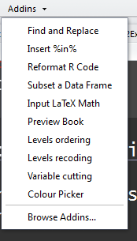

```{r setup, include=FALSE}
knitr::opts_chunk$set(echo = TRUE)
```

## [Rstudio AddIns](https://rstudio.github.io/rstudioaddins/#overview)

- Man kann kleine Erweiterungen für Rstudio installieren
- Einige dieser Erweiterungen beruhen auf Javascript
- Um die AddIns zu nutzen muss die neueste Version von Rstudio installiert sein




## [Ein AddIn um Farben auszuwählen](https://www.r-bloggers.com/an-awesome-rstudio-addin-for-selecting-colours-and-another-for-adding-marginal-density-plots-to-ggplot2/)

```{r,eval=F}
install.packages("shinyjs")
```


## Das Paket `shinyjs`

```{r}
citation("shinyjs")
```

