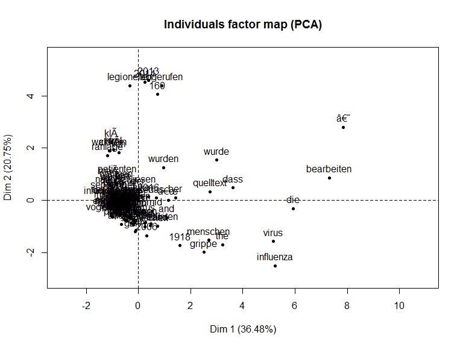
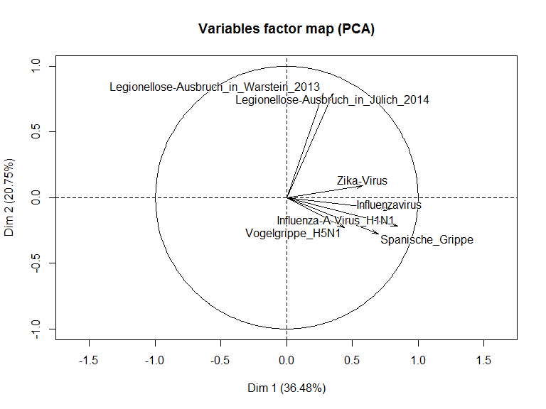
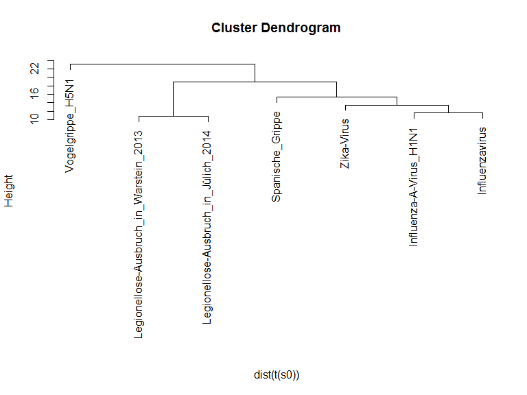

# Scraping Wikipedia
Jan-Philipp Kolb  
09 Mai 2017  


## Einleitung

Im Folgenden werde ich zeigen, wie man Textinformationen aus [Wikipedia](https://www.wikipedia.org/) herunterladen, verarbeiten und analysieren kann.


```r
install.packages("NLP")
install.packages("tm")
install.packages("FactoMineR")
```


## Die verwendeten Pakete

- Das R-Paket [`stringi`](http://stringi.rexamine.com/) von Marek Gagolewski and Bartek Tartanus bietet Möglichkeiten zur String Verarbeitung.


```r
library("stringi")
```

- [`tm`](http://www.jstatsoft.org/v25/i05/) ist ein R-Paket um Text Mining zu realisieren. Es wurde von Ingo Feinerer, Kurt Hornik, und David Meyer geschrieben.


```r
library("tm")
```

- Und schließlich brauchen wir das [`FactoMineR`](https://cran.r-project.org/web/packages/FactoMineR/vignettes/FactoMineR.pdf)-Paket, das von Sebastien Le, Julie Josse und Francois Husson zur Durchführung der Hauptkomponentenanalyse erstellt wurde.


```r
library("FactoMineR")
```


## Die Text Daten herunterladen

- Als Beispiel verwenden wir Daten zu verschiedenen Krankheiten. 
- In diesem Fall habe ich 7 deutsche Webseiten für Infektionskrankheiten ausgewählt.


```r
wiki <- "http://de.wikipedia.org/wiki/"

titles <- c("Zika-Virus", "Influenza-A-Virus_H1N1", 
            "Spanische_Grippe","Influenzavirus",
            "Vogelgrippe_H5N1",
            "Legionellose-Ausbruch_in_Warstein_2013",
            "Legionellose-Ausbruch_in_Jülich_2014")
```

## Das Herunterladen der Seiten

- Zunächst wird ein Container erstellt um die Ergebnisse abzuspeichern
- Dann wird der Text für jeden Artikel heruntergeladen und in dem Container gespeichert.


```r
articles <- character(length(titles))

for (i in 1:length(titles)){
    articles[i] <- stri_flatten(
      readLines(stri_paste(wiki, titles[i])), col = " ")
}

docs <- Corpus(VectorSource(articles))
```

## Die Daten vorbereiten

Das Folgende basiert auf einem Blogpost von Norbert Ryciak über die [automatische Kategorisierung von Wikipedia-Artikeln](http://www.rexamine.com/2014/06/text-mining-in-r-automatic-categorization-of-wikipedia-artikel/).

- Eine Fehlermeldung ist aufgetreten, als ich den Code ausgewertet habe.
- Es war möglich, dieses Problem mit Hinweisen aus einer [Diskussion auf Stackoverflow](http://stackoverflow.com/questions/24191728/documenttermmatrix-error-on-corpus-argument) zu lösen.


```r
docs2 <- tm_map(docs, function(x) stri_replace_all_regex(
  x, "<.+?>", " "))
docs3 <- tm_map(docs2, function(x) stri_replace_all_fixed(
  x, "\t", " "))
```

## Den Text weiterverarbeiten


```r
docs4 <- tm_map(docs3, PlainTextDocument)
docs5 <- tm_map(docs4, stripWhitespace)
docs6 <- tm_map(docs5, removeWords, stopwords("german"))
docs7 <- tm_map(docs6, removePunctuation)
docs8 <- tm_map(docs7, tolower)
# docs8 <- tm_map(docs8, PlainTextDocument)
```


```r
dtm <- DocumentTermMatrix(docs8)  
```


## [Principal Component Analysis](https://dzone.com/articles/manipulate-clusters-of-texts)

- Der folgende Code ist auf einem Blog post von  Arthur Charpentier über das Mining von Wikipedia basiert. 


```r
dtm2 <- as.matrix(dtm)
frequency <- colSums(dtm2)
frequency <- sort(frequency, decreasing=TRUE)
words <- frequency[frequency>20]
s <- dtm2[1,which(colnames(dtm2) %in% names(words))]

for(i in 2:nrow(dtm2)){
  s <- cbind(s,dtm2[i,which(colnames(dtm2) %in% 
                              names(words))])
} 

colnames(s) <- titles
```

## Ergebnis


```r
PCA(s)
```

<!-- --><!-- -->

```
## **Results for the Principal Component Analysis (PCA)**
## The analysis was performed on 125 individuals, described by 7 variables
## *The results are available in the following objects:
## 
##    name               description                          
## 1  "$eig"             "eigenvalues"                        
## 2  "$var"             "results for the variables"          
## 3  "$var$coord"       "coord. for the variables"           
## 4  "$var$cor"         "correlations variables - dimensions"
## 5  "$var$cos2"        "cos2 for the variables"             
## 6  "$var$contrib"     "contributions of the variables"     
## 7  "$ind"             "results for the individuals"        
## 8  "$ind$coord"       "coord. for the individuals"         
## 9  "$ind$cos2"        "cos2 for the individuals"           
## 10 "$ind$contrib"     "contributions of the individuals"   
## 11 "$call"            "summary statistics"                 
## 12 "$call$centre"     "mean of the variables"              
## 13 "$call$ecart.type" "standard error of the variables"    
## 14 "$call$row.w"      "weights for the individuals"        
## 15 "$call$col.w"      "weights for the variables"
```

## Ergebnis

- In der Factor Map sehen wir das erwartete Ergebnis. 
- Die Seiten zur Legionnellen Krankheit sind  sehr nah beianander, während die Seiten zur Influenza in einem anderen Teil sind. 

## Das Dendogramm


- Im Folgenden wird die Normalisierung durchgeführt und die Ergebnisse werden geplottet. 


```r
s0 <- s/apply(s,1,sd)
h <- hclust(dist(t(s0)), method = "ward")

plot(h, labels = titles, sub = "")
```

<!-- -->


- [Youtube Video zu Text Mining](https://www.youtube.com/watch?v=j1V2McKbkLo)
