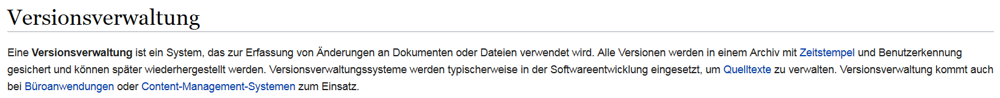
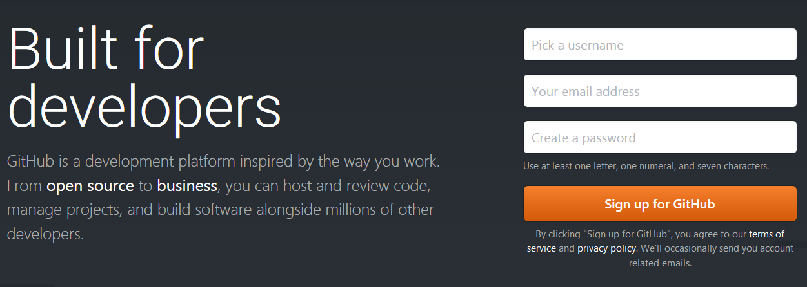

```{r setup, include=FALSE}
knitr::opts_chunk$set(echo = FALSE)
```

## [Warum Versionskontrolle](https://git-scm.com/book/de/v1/Los-geht%E2%80%99s-Wozu-Versionskontrolle%3F)

- Versionskontrollsysteme (VCS) protokollieren Änderungen an einer Datei oder einer Anzahl von Dateien über die Zeit hinweg

[Wikipedia Artikel zu Versionsverwaltung](https://de.wikipedia.org/wiki/Versionsverwaltung)



## [GitHub](https://github.com/)



## [GitHub Konferenz](https://githubuniverse.com/satellite/?utm_source=github&utm_medium=banner&utm_campaign=ww-satellite-20170405)

London 22 und 23 Mai 2017


## [GitLab](https://about.gitlab.com/)


