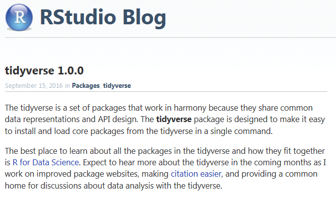

```{r, include=FALSE}
knitr::opts_chunk$set(echo = TRUE,message = F,warning=F)
```


## Notwendige Pakete

```{r,eval=F}
install.packages("tidyverse")
```


```{r}
library(tidyverse)
```



- [R für DataScience](http://r4ds.had.co.nz/)


## Weitere benötigte Pakete

- Das Paket `stringr`

```{r}
library(stringr)
```


```{r}
library(forcats)
library(ggmap)
library(rvest)
```


## Daten von Wikipedia einsammeln

```{r,cache=T}
html.world_ports <- read_html("https://en.wikipedia.org/wiki/List_of_busiest_container_ports")
df.world_ports <- html_table(html_nodes(html.world_ports, "table")[[2]], fill = TRUE)
```

```{r}
library(DT)
datatable(df.world_ports)
```


## Die Daten anschauen

```{r}
glimpse(df.world_ports)
```


## Das Paket `rvest`

```{r}
library(rvest)
ht <- read_html('https://www.google.co.in/search?q=guitar+repair+workshop')
links <- ht %>% html_nodes(xpath='//h3/a') %>% html_attr('href')
gsub('/url\\?q=','',sapply(strsplit(links[as.vector(grep('url',links))],split='&'),'[',1))
```


## Links

- [How to really do an analysis in R (part 1, data manipulation)](https://www.r-bloggers.com/how-to-really-do-an-analysis-in-r-part-1-data-manipulation/)

- [Read CSV From The Web](http://www.programmingr.com/examples/read-csv-web/)

- [Scraping CRAN with rvest](https://www.r-bloggers.com/scraping-cran-with-rvest/)
