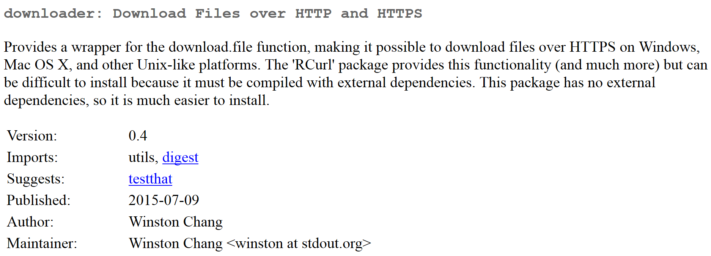
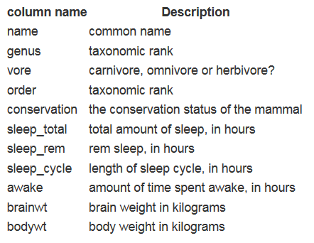
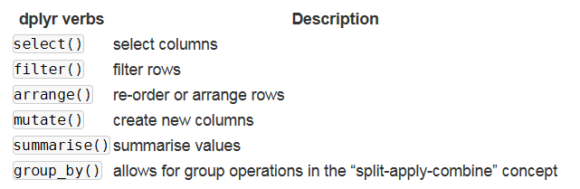
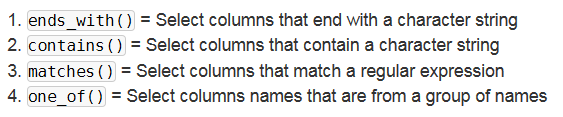
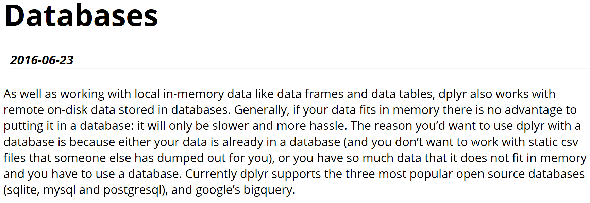

```{r, include=FALSE}
knitr::opts_chunk$set(echo = T)
```

## [Das Paket `dplyr`](https://cran.rstudio.com/web/packages/dplyr/vignettes/introduction.html)

```{r,eval=F}
install.packages("nycflights13")
```


```{r}
library(nycflights13)
dim(flights)
head(flights)
```

## Die Reihen filtern mit `filter()`

```{r}
library(dplyr)
head(filter(flights, month == 1,day==1))
```

## [Das Paket `downloader`](http://genomicsclass.github.io/book/pages/dplyr_tutorial.html)

```{r,eval=F}
install.packages("downloader")
```

```{r}
library(downloader)
```



## Einen Beispieldatensatz herunterladen und importieren


```{r}
url <- "https://raw.githubusercontent.com/genomicsclass/dagdata/master/inst/extdata/msleep_ggplot2.csv"
filename <- "msleep_ggplot2.csv"
```

- folgender Code sagt, dass das File nur heruntergeladen wird, wenn es noch nicht existiert

```{r}
setwd("data/")
if (!file.exists(filename)) download(url,filename)
msleep <- read.csv("msleep_ggplot2.csv")
```


## Den Datensatz anschauen

- die ersten Zeilen des Datensatzes anschauen

```{r}
head(msleep)
```

## Eine erste Auswahl treffen

- die Befehle erinnern schon an die SQL Sprache 

```{r}
sleepData <- select(msleep, name, sleep_total)
head(sleepData)
```

## [Was bedeuten die Splaten](http://genomicsclass.github.io/book/pages/dplyr_tutorial.html)



## Die verschiedenen `dplyr` Befehle



## Spalten auswählen

```{r}
sleepData <- select(msleep, name, sleep_total)
head(sleepData)
```

## Das Gegenteil

- mit dem ´-´ Zeichen kann man sich alle Spalten bis auf die entsprechende anzeigen lassen

```{r}
head(select(msleep, -name))
```

## Auswahl treffen

- alle Spalten anzeigen lassen, die mit einer Kombination von Buchstaben anfangen

```{r}
head(select(msleep, starts_with("sl")))
```



## Zeilen auswählen

```{r}
filter(msleep, sleep_total >= 16)
```

## Mehrere logische Abfragen um Zeilen auszuwählen

```{r}
filter(msleep, sleep_total >= 16, bodywt >= 1)
```

## Neue Spalten erzeugen mit `mutate`

```{r}
msleep %>% 
    mutate(rem_proportion = sleep_rem / sleep_total) %>%
    head
```

## Die Anweisung `group_by`

```{r}
msleep %>% 
    group_by(order) %>%
    summarise(avg_sleep = mean(sleep_total), 
              min_sleep = min(sleep_total), 
              max_sleep = max(sleep_total),
              total = n())
```

## [Vignette zur Datenbankintegration mit `dplyr`](https://cran.r-project.org/web/packages/dplyr/vignettes/databases.html)




## Am Besten funktionierts mit SQLite

- alles was man braucht wird quasi schon mit R mitgeliefert 

```{r,eval=F}
library(dplyr)
my_db <- src_sqlite("my_db.sqlite3", create = T)
```

## Ein Beispieldatensatz

```{r,eval=F}
library(nycflights13)
flights_sqlite <- copy_to(my_db, flights, temporary = FALSE, indexes = list(
  c("year", "month", "day"), "carrier", "tailnum"))
```

```{r,eval=F}
flights_sqlite <- tbl(nycflights13_sqlite(), "flights")
```

```{r,eval=F}
tbl(my_db, sql("SELECT * FROM flights"))
```

