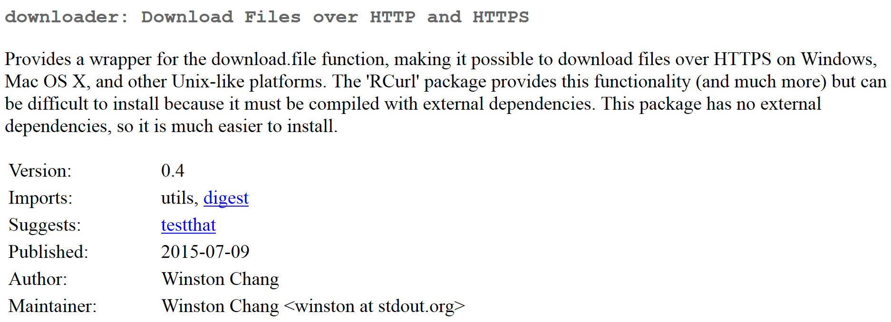
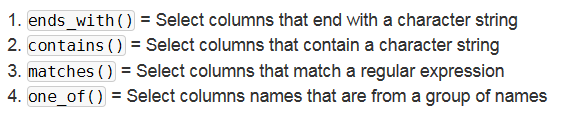
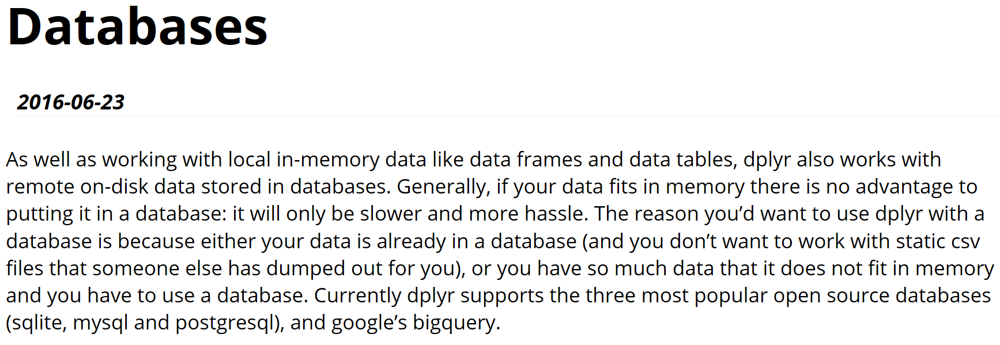

# Eine Annährung an Datenbankkonzepte - Das Paket `dplyr`
Jan-Philipp Kolb  
5 Mai 2017  


## [Das Paket `dplyr`](https://cran.rstudio.com/web/packages/dplyr/vignettes/introduction.html)


```r
install.packages("nycflights13")
```


```r
library(nycflights13)
```

```
## Warning: package 'nycflights13' was built under R version 3.3.3
```

```r
dim(flights)
```

```
## [1] 336776     19
```

```r
head(flights)
```

```
## # A tibble: 6 × 19
##    year month   day dep_time sched_dep_time dep_delay arr_time
##   <int> <int> <int>    <int>          <int>     <dbl>    <int>
## 1  2013     1     1      517            515         2      830
## 2  2013     1     1      533            529         4      850
## 3  2013     1     1      542            540         2      923
## 4  2013     1     1      544            545        -1     1004
## 5  2013     1     1      554            600        -6      812
## 6  2013     1     1      554            558        -4      740
## # ... with 12 more variables: sched_arr_time <int>, arr_delay <dbl>,
## #   carrier <chr>, flight <int>, tailnum <chr>, origin <chr>, dest <chr>,
## #   air_time <dbl>, distance <dbl>, hour <dbl>, minute <dbl>,
## #   time_hour <dttm>
```

## Die Reihen filtern mit `filter()`


```r
library(dplyr)
```

```
## 
## Attaching package: 'dplyr'
```

```
## The following objects are masked from 'package:stats':
## 
##     filter, lag
```

```
## The following objects are masked from 'package:base':
## 
##     intersect, setdiff, setequal, union
```

```r
head(filter(flights, month == 1,day==1))
```

```
## # A tibble: 6 × 19
##    year month   day dep_time sched_dep_time dep_delay arr_time
##   <int> <int> <int>    <int>          <int>     <dbl>    <int>
## 1  2013     1     1      517            515         2      830
## 2  2013     1     1      533            529         4      850
## 3  2013     1     1      542            540         2      923
## 4  2013     1     1      544            545        -1     1004
## 5  2013     1     1      554            600        -6      812
## 6  2013     1     1      554            558        -4      740
## # ... with 12 more variables: sched_arr_time <int>, arr_delay <dbl>,
## #   carrier <chr>, flight <int>, tailnum <chr>, origin <chr>, dest <chr>,
## #   air_time <dbl>, distance <dbl>, hour <dbl>, minute <dbl>,
## #   time_hour <dttm>
```

## [Das Paket `downloader`](http://genomicsclass.github.io/book/pages/dplyr_tutorial.html)


```r
install.packages("downloader")
```


```r
library(downloader)
```

```
## Warning: package 'downloader' was built under R version 3.3.3
```



## Einen Beispieldatensatz herunterladen und importieren


```r
url <- "https://raw.githubusercontent.com/genomicsclass/dagdata/master/inst/extdata/msleep_ggplot2.csv"
filename <- "msleep_ggplot2.csv"
```

- folgender Code sagt, dass das File nur heruntergeladen wird, wenn es noch nicht existiert


```r
setwd("data/")
if (!file.exists(filename)) download(url,filename)
msleep <- read.csv("msleep_ggplot2.csv")
```


## Den Datensatz anschauen

- die ersten Zeilen des Datensatzes anschauen


```r
head(msleep)
```

```
##                         name      genus  vore        order conservation
## 1                    Cheetah   Acinonyx carni    Carnivora           lc
## 2                 Owl monkey      Aotus  omni     Primates         <NA>
## 3            Mountain beaver Aplodontia herbi     Rodentia           nt
## 4 Greater short-tailed shrew    Blarina  omni Soricomorpha           lc
## 5                        Cow        Bos herbi Artiodactyla domesticated
## 6           Three-toed sloth   Bradypus herbi       Pilosa         <NA>
##   sleep_total sleep_rem sleep_cycle awake brainwt  bodywt
## 1        12.1        NA          NA  11.9      NA  50.000
## 2        17.0       1.8          NA   7.0 0.01550   0.480
## 3        14.4       2.4          NA   9.6      NA   1.350
## 4        14.9       2.3   0.1333333   9.1 0.00029   0.019
## 5         4.0       0.7   0.6666667  20.0 0.42300 600.000
## 6        14.4       2.2   0.7666667   9.6      NA   3.850
```

## Eine erste Auswahl treffen

- die Befehle erinnern schon an die SQL Sprache 


```r
sleepData <- select(msleep, name, sleep_total)
head(sleepData)
```

```
##                         name sleep_total
## 1                    Cheetah        12.1
## 2                 Owl monkey        17.0
## 3            Mountain beaver        14.4
## 4 Greater short-tailed shrew        14.9
## 5                        Cow         4.0
## 6           Three-toed sloth        14.4
```

## [Was bedeuten die Splaten](http://genomicsclass.github.io/book/pages/dplyr_tutorial.html)


## Die verschiedenen `dplyr` Befehle


## Spalten auswählen


```r
sleepData <- select(msleep, name, sleep_total)
head(sleepData)
```

```
##                         name sleep_total
## 1                    Cheetah        12.1
## 2                 Owl monkey        17.0
## 3            Mountain beaver        14.4
## 4 Greater short-tailed shrew        14.9
## 5                        Cow         4.0
## 6           Three-toed sloth        14.4
```

## Das Gegenteil

- mit dem ´-´ Zeichen kann man sich alle Spalten bis auf die entsprechende anzeigen lassen


```r
head(select(msleep, -name))
```

```
##        genus  vore        order conservation sleep_total sleep_rem
## 1   Acinonyx carni    Carnivora           lc        12.1        NA
## 2      Aotus  omni     Primates         <NA>        17.0       1.8
## 3 Aplodontia herbi     Rodentia           nt        14.4       2.4
## 4    Blarina  omni Soricomorpha           lc        14.9       2.3
## 5        Bos herbi Artiodactyla domesticated         4.0       0.7
## 6   Bradypus herbi       Pilosa         <NA>        14.4       2.2
##   sleep_cycle awake brainwt  bodywt
## 1          NA  11.9      NA  50.000
## 2          NA   7.0 0.01550   0.480
## 3          NA   9.6      NA   1.350
## 4   0.1333333   9.1 0.00029   0.019
## 5   0.6666667  20.0 0.42300 600.000
## 6   0.7666667   9.6      NA   3.850
```

## Auswahl treffen

- alle Spalten anzeigen lassen, die mit einer Kombination von Buchstaben anfangen


```r
head(select(msleep, starts_with("sl")))
```

```
##   sleep_total sleep_rem sleep_cycle
## 1        12.1        NA          NA
## 2        17.0       1.8          NA
## 3        14.4       2.4          NA
## 4        14.9       2.3   0.1333333
## 5         4.0       0.7   0.6666667
## 6        14.4       2.2   0.7666667
```



## Zeilen auswählen


```r
filter(msleep, sleep_total >= 16)
```

```
##                     name        genus    vore           order conservation
## 1             Owl monkey        Aotus    omni        Primates         <NA>
## 2   Long-nosed armadillo      Dasypus   carni       Cingulata           lc
## 3 North American Opossum    Didelphis    omni Didelphimorphia           lc
## 4          Big brown bat    Eptesicus insecti      Chiroptera           lc
## 5   Thick-tailed opposum   Lutreolina   carni Didelphimorphia           lc
## 6       Little brown bat       Myotis insecti      Chiroptera         <NA>
## 7        Giant armadillo   Priodontes insecti       Cingulata           en
## 8 Arctic ground squirrel Spermophilus   herbi        Rodentia           lc
##   sleep_total sleep_rem sleep_cycle awake brainwt bodywt
## 1        17.0       1.8          NA   7.0 0.01550  0.480
## 2        17.4       3.1   0.3833333   6.6 0.01080  3.500
## 3        18.0       4.9   0.3333333   6.0 0.00630  1.700
## 4        19.7       3.9   0.1166667   4.3 0.00030  0.023
## 5        19.4       6.6          NA   4.6      NA  0.370
## 6        19.9       2.0   0.2000000   4.1 0.00025  0.010
## 7        18.1       6.1          NA   5.9 0.08100 60.000
## 8        16.6        NA          NA   7.4 0.00570  0.920
```

## Mehrere logische Abfragen um Zeilen auszuwählen


```r
filter(msleep, sleep_total >= 16, bodywt >= 1)
```

```
##                     name      genus    vore           order conservation
## 1   Long-nosed armadillo    Dasypus   carni       Cingulata           lc
## 2 North American Opossum  Didelphis    omni Didelphimorphia           lc
## 3        Giant armadillo Priodontes insecti       Cingulata           en
##   sleep_total sleep_rem sleep_cycle awake brainwt bodywt
## 1        17.4       3.1   0.3833333   6.6  0.0108    3.5
## 2        18.0       4.9   0.3333333   6.0  0.0063    1.7
## 3        18.1       6.1          NA   5.9  0.0810   60.0
```

## Neue Spalten erzeugen mit `mutate`


```r
msleep %>% 
    mutate(rem_proportion = sleep_rem / sleep_total) %>%
    head
```

```
##                         name      genus  vore        order conservation
## 1                    Cheetah   Acinonyx carni    Carnivora           lc
## 2                 Owl monkey      Aotus  omni     Primates         <NA>
## 3            Mountain beaver Aplodontia herbi     Rodentia           nt
## 4 Greater short-tailed shrew    Blarina  omni Soricomorpha           lc
## 5                        Cow        Bos herbi Artiodactyla domesticated
## 6           Three-toed sloth   Bradypus herbi       Pilosa         <NA>
##   sleep_total sleep_rem sleep_cycle awake brainwt  bodywt rem_proportion
## 1        12.1        NA          NA  11.9      NA  50.000             NA
## 2        17.0       1.8          NA   7.0 0.01550   0.480      0.1058824
## 3        14.4       2.4          NA   9.6      NA   1.350      0.1666667
## 4        14.9       2.3   0.1333333   9.1 0.00029   0.019      0.1543624
## 5         4.0       0.7   0.6666667  20.0 0.42300 600.000      0.1750000
## 6        14.4       2.2   0.7666667   9.6      NA   3.850      0.1527778
```

## Die Anweisung `group_by`


```r
msleep %>% 
    group_by(order) %>%
    summarise(avg_sleep = mean(sleep_total), 
              min_sleep = min(sleep_total), 
              max_sleep = max(sleep_total),
              total = n())
```

```
## # A tibble: 19 × 5
##              order avg_sleep min_sleep max_sleep total
##             <fctr>     <dbl>     <dbl>     <dbl> <int>
## 1     Afrosoricida 15.600000      15.6      15.6     1
## 2     Artiodactyla  4.516667       1.9       9.1     6
## 3        Carnivora 10.116667       3.5      15.8    12
## 4          Cetacea  4.500000       2.7       5.6     3
## 5       Chiroptera 19.800000      19.7      19.9     2
## 6        Cingulata 17.750000      17.4      18.1     2
## 7  Didelphimorphia 18.700000      18.0      19.4     2
## 8    Diprotodontia 12.400000      11.1      13.7     2
## 9   Erinaceomorpha 10.200000      10.1      10.3     2
## 10      Hyracoidea  5.666667       5.3       6.3     3
## 11      Lagomorpha  8.400000       8.4       8.4     1
## 12     Monotremata  8.600000       8.6       8.6     1
## 13  Perissodactyla  3.466667       2.9       4.4     3
## 14          Pilosa 14.400000      14.4      14.4     1
## 15        Primates 10.500000       8.0      17.0    12
## 16     Proboscidea  3.600000       3.3       3.9     2
## 17        Rodentia 12.468182       7.0      16.6    22
## 18      Scandentia  8.900000       8.9       8.9     1
## 19    Soricomorpha 11.100000       8.4      14.9     5
```

## [Vignette zur Datenbankintegration mit `dplyr`](https://cran.r-project.org/web/packages/dplyr/vignettes/databases.html)




## Am Besten funktionierts mit SQLite

- alles was man braucht wird quasi schon mit R mitgeliefert 
- der Befehl `src_sqlite` kann genutzt werden um sich mit einer Datenbank zu verbinden
- bei Verwendung von `create=T` wird eine neue Datenbank erzeugt
- bei `create=F` muss man den Pfad zur Datenbenk angeben


```r
library(dplyr)
setwd("data")
my_db <- src_sqlite("my_db.sqlite3", create = T)
```

## Erste Datenbank mit Beispieldatensatz befüllen


```r
library(nycflights13)
flights_sqlite <- copy_to(my_db, flights, temporary = FALSE, indexes = list(
  c("year", "month", "day"), "carrier", "tailnum"))
```


## Den Datensatz wieder heraus bekommen

- mit dem Befehl `tbl` kann man sich mit Tabellen innerhalb einer Datenbank verbinden


```r
flights_sqlite <- tbl(nycflights13_sqlite(), "flights")
```

- das gleiche Ergebnis:


```r
tbl(my_db, sql("SELECT * FROM flights"))
```

## Eine weitere Abfrage


```r
tbl(my_db, sql("SELECT * FROM flights WHERE month = 1 AND dep_time = 517"))
```
