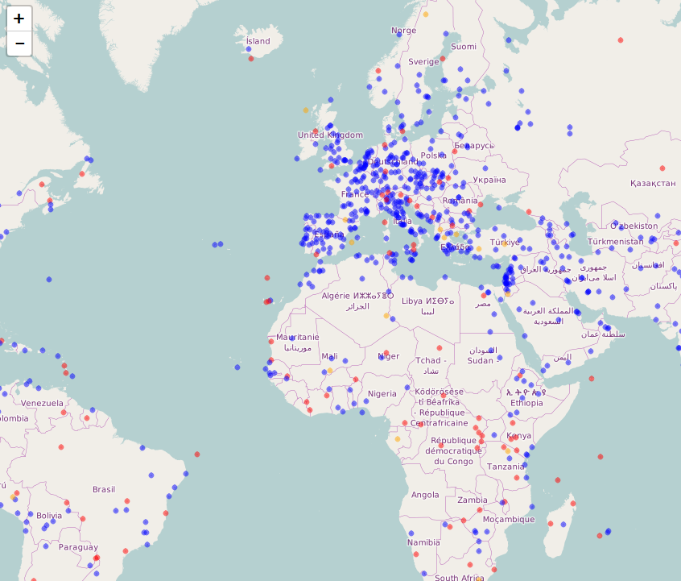

```{r, include=FALSE}
knitr::opts_chunk$set(echo = TRUE,warning=F,message=F)
pdf<-F
web <- !pdf
```

## Die Daten - Weltkulturerbe

```{r}
url <- "https://raw.githubusercontent.com/Japhilko/
GeoData/master/2015/data/whcSites.csv"

whcSites <- read.csv(url) 
```

```{r,echo=F,eval=pdf}
library(knitr)
kable(head(whcSites))
```

```{r,echo=F,eval=web}
library('DT')
datatable(whcSites)
```


## Notwendige Pakete

[magrittr](https://cran.r-project.org/web/packages/magrittr/index.html) - für den Pipe Operator in R:

```{r,warning=F}
library("magrittr")
```


[leaflet](https://rstudio.github.io/leaflet/) - um  interaktive Karten mit der JavaScript Bibliothek 'Leaflet' zu erzeugen

```{r,warning=F}
library("leaflet")
```


## Eine interaktive Karte erstellen

```{r,eval=F}
m <- leaflet() %>%
  addTiles() %>%  # Add default OpenStreetMap map tiles
  addMarkers(lng=whcSites$lon, 
             lat=whcSites$lat, 
             popup=whcSites$name_en)
m
```

## Die Karte zeigen

 

## Farbe hinzu

```{r}
whcSites$color <- "red"
whcSites$color[whcSites$category=="Cultural"] <- "blue"
whcSites$color[whcSites$category=="Mixed"] <- "orange"
```

## Eine Karte mit Farbe erzeugen

```{r,eval=F}
m1 <- leaflet() %>%
  addTiles() %>%  
  addCircles(lng=whcSites$lon, 
             lat=whcSites$lat, 
             popup=whcSites$name_en,
             color=whcSites$color)
```

## Die Karte zeigen

 

## [Die Karte abspeichern](http://www.r-bloggers.com/interactive-mapping-with-leaflet-in-r-2/)


## [Layers ein- und ausblenden](https://rstudio.github.io/leaflet/showhide.html)

```{r,eval=F}
leaflet() %>%
  addTiles() %>%
  addMarkers(data = coffee_shops, group = "Food & Drink") %>%
  addMarkers(data = restaurants, group = "Food & Drink") %>%
  addMarkers(data = restrooms, group = "Restrooms")
```

## [Karte mit Polygonen erzeugen](https://rstudio.github.io/leaflet/map_widget.html)

```{r}
library(sp)
Sr1 = Polygon(cbind(c(2, 4, 4, 1, 2), c(2, 3, 5, 4, 2)))
Sr2 = Polygon(cbind(c(5, 4, 2, 5), c(2, 3, 2, 2)))
Sr3 = Polygon(cbind(c(4, 4, 5, 10, 4), c(5, 3, 2, 5, 5)))
Sr4 = Polygon(cbind(c(5, 6, 6, 5, 5), c(4, 4, 3, 3, 4)), hole = TRUE)
Srs1 = Polygons(list(Sr1), "s1")
Srs2 = Polygons(list(Sr2), "s2")
Srs3 = Polygons(list(Sr4, Sr3), "s3/4")
SpP = SpatialPolygons(list(Srs1, Srs2, Srs3), 1:3)
leaflet(height = "300px") %>% addPolygons(data = SpP)
```

## Beispiel US Staaten

```{r}
library(maps)
mapStates = map("state", fill = TRUE, plot = FALSE)
leaflet(data = mapStates) %>% addTiles() %>%
  addPolygons(fillColor = topo.colors(10, alpha = NULL), stroke = FALSE)
```

## Die Basiskarte ändern

- Neben der Default Basiskarte kann man auch [andere Hintergründe aktivieren](http://leaflet-extras.github.io/leaflet-providers/preview/index.html)

```{r}
m <- leaflet() %>% setView(lng = -71.0589, lat = 42.3601, zoom = 12)
m %>% addTiles()
m %>% addProviderTiles("Stamen.Toner")
```

## Basiskarte - CartoDB

```{r}
m %>% addProviderTiles("CartoDB.Positron")
```

## Esri.NatGeoWorldMap

```{r}
m %>% addProviderTiles("Esri.NatGeoWorldMap")
```

## OpenTopoMap

```{r}
m %>% addProviderTiles("OpenTopoMap")
```


## Thunderforest.OpenCycleMap

```{r}
m %>% addProviderTiles("Thunderforest.OpenCycleMap")
```


## WMS Tiles hinzufügen

```{r}
leaflet() %>% addTiles() %>% setView(-93.65, 42.0285, zoom = 4) %>%
  addWMSTiles(
    "http://mesonet.agron.iastate.edu/cgi-bin/wms/nexrad/n0r.cgi",
    layers = "nexrad-n0r-900913",
    options = WMSTileOptions(format = "image/png", transparent = TRUE),
    attribution = "Weather data © 2012 IEM Nexrad"
  )
```

## Mehrere Layer miteinander kombinieren

```{r}
m %>% addProviderTiles("MtbMap") %>%
  addProviderTiles("Stamen.TonerLines",
    options = providerTileOptions(opacity = 0.35)) %>%
  addProviderTiles("Stamen.TonerLabels")
```

## Andere Marker benutzen

```{r}
greenLeafIcon <- makeIcon(
  iconUrl = "http://leafletjs.com/examples/custom-icons/leaf-green.png",
  iconWidth = 38, iconHeight = 95,
  iconAnchorX = 22, iconAnchorY = 94,
  shadowUrl = "http://leafletjs.com/examples/custom-icons/leaf-shadow.png",
  shadowWidth = 50, shadowHeight = 64,
  shadowAnchorX = 4, shadowAnchorY = 62
)

leaflet(data = quakes[1:4,]) %>% addTiles() %>%
  addMarkers(~long, ~lat, icon = greenLeafIcon)
```

## Cluster Optionen für Marker

```{r}
leaflet(quakes) %>% addTiles() %>% addMarkers(
  clusterOptions = markerClusterOptions()
)
```

## [Ein Rechteck hinzufügen](https://rstudio.github.io/leaflet/shapes.html)


```{r}
leaflet() %>% addTiles() %>%
  addRectangles(
    lng1=-118.456554, lat1=34.078039,
    lng2=-118.436383, lat2=34.062717,
    fillColor = "transparent"
  )
```


## Links und Quellen

- [4 Tricks zum Arbeiten mit Leaflet](https://www.r-bloggers.com/4-tricks-for-working-with-r-leaflet-and-shiny/)

- <http://www.r-bloggers.com/the-leaflet-package-for-online-mapping-in-r/>
- <https://rstudio.github.io/leaflet/>


