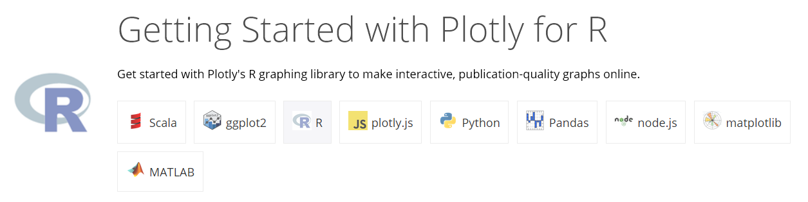
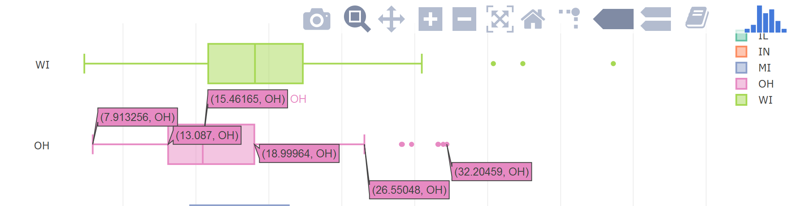
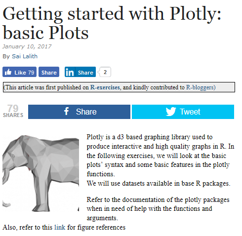

```{r, include=FALSE}
knitr::opts_chunk$set(echo = TRUE,message=F,warning=F)
```

## [plotly ](https://plot.ly/)


- plotly ist ein Online Analyse und Visualisierungstool
- es gibt Pakete für verschiedene Programmiersprachen

## plotly und R



## `plotly` Installieren

```{r,eval=F}
install.packages("plotly")
```


```{r}
library("plotly")
```


## [Der Anfang mit `plotly` für R](https://plot.ly/r/getting-started/)

```{r}
plot_ly(midwest, x = ~percollege, color = ~state, type = "box")
```

<!--

-->

## plotly Beispiel mit eigenen Daten

```{r}
url <- "https://raw.githubusercontent.com/Japhilko/GeoData/master/2015/data/whcSites.csv"
whcSites <- read.csv(url) 
```

```{r}
plot_ly(whcSites, x = ~date_inscribed, color = ~category_short, type = "box")
```


## Links

- [der Start mit Plotly: einfache Grafiken](https://www.r-bloggers.com/getting-started-with-plotly-basic-plots/)

