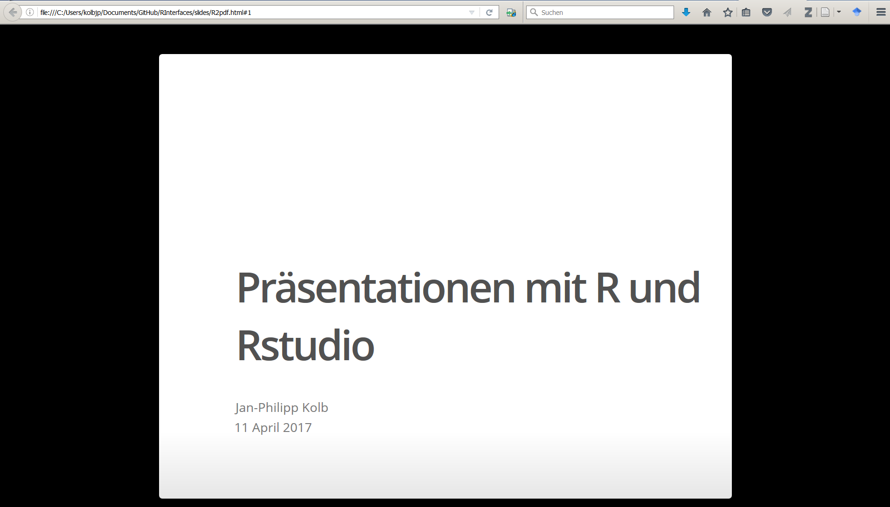
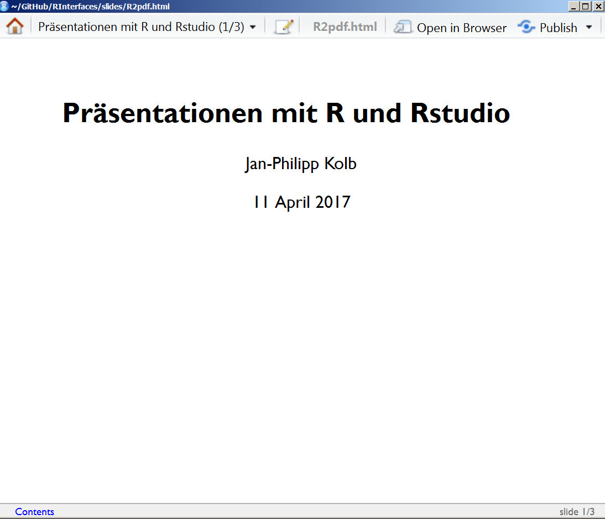

```{r setup, include=FALSE}
knitr::opts_chunk$set(echo = TRUE,eval=F)
```


# Rpres Presentations

## [Presentations with Rpres](https://rstudio-pubs-static.s3.amazonaws.com/27777_55697c3a476640caa0ad2099fe914ae5.html#/)


# ioslides presentations

## ioslides presentations



- [Presentations with ioslides](http://rmarkdown.rstudio.com/ioslides_presentation_format.html)


## slidy presentations




## Cascading Style Files

- [Custom CSS](http://rmarkdown.rstudio.com/html_document_format.html#custom_css)

- [CSS](https://en.wikipedia.org/wiki/Cascading_Style_Sheets)

- [CSS pro tipps](https://github.com/AllThingsSmitty/css-protips#use-a-css-reset)

## knitr Engines

- [knitr Language Engines](http://rmarkdown.rstudio.com/authoring_knitr_engines.html)

- [slidify](http://slidify.org/)

## Tables

```{r}
library(knitr)
a <- data.frame(a=1:10,b=10:1)
kable(table(a))
```

- [R Studio, and Presentations, and Git! Oh my!](https://www.r-bloggers.com/r-studio-and-presentations-and-git-oh-my/)

## Das CSS ändern

- [Farbe in HTML](http://tomheller.de/html-farben.html)
- [Eine Schriftart wählen](https://www.mediaevent.de/css/font-family.html)
- [Schriftformatierung](https://wiki.selfhtml.org/wiki/CSS/Eigenschaften/Schriftformatierung)
- [Weitere CSS Beispiele](https://www.w3.org/TR/WCAG20-TECHS/C22.html)

```{css}
body {
  color: red;
  background: #fff8dc;
  font-family:"Verdana";
  font-size:"xx-large";
  text-transform:uppercase;
  line-height:2em;
}
```


## [Beispiel R-Pakete](https://gallery.shinyapps.io/cran-gauge/)


## [Paket installieren](https://blog.rstudio.org/2016/05/17/flexdashboard-easy-interactive-dashboards-for-r/)

```{r, eval=F}
install.packages("flexdashboard", type = "source")
```

## Ein Dashboard erstellen mit Rstudio


## [Gallerie](http://rmarkdown.rstudio.com/gallery.html)


```{r, eval=F}
install.packages("highcharter", type = "source")
```


```{r setup, include=FALSE}
library(highcharter)
library(dplyr)
library(viridisLite)
library(forecast)
library(treemap)
library(flexdashboard)

thm <- 
  hc_theme(
    colors = c("#1a6ecc", "#434348", "#90ed7d"),
    chart = list(
      backgroundColor = "transparent",
      style = list(fontFamily = "Source Sans Pro")
    ),
    xAxis = list(
      gridLineWidth = 1
    )
  )

```

## Links

- [CSS Eigenschaften](https://wiki.selfhtml.org/wiki/CSS/Eigenschaften/Schriftformatierung/font-size)

- [CSS Schrifteigenschaften](https://wiki.selfhtml.org/wiki/CSS/Eigenschaften/Schriftformatierung)

- [HTML5 Folien](http://bashooka.com/coding/html-css-based-presentation-slides/)


### Links zu Dashboards

- [R Dashboards](https://plot.ly/r/dashboard/)
- [flexdashboards](https://blog.rstudio.org/2016/05/17/flexdashboard-easy-interactive-dashboards-for-r/)

- [Dashboard Beispiel](https://beta.rstudioconnect.com/jjallaire/htmlwidgets-highcharter/htmlwidgets-highcharter.html)
