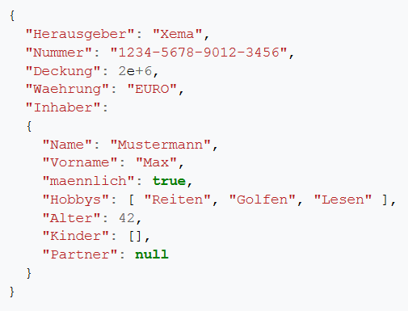
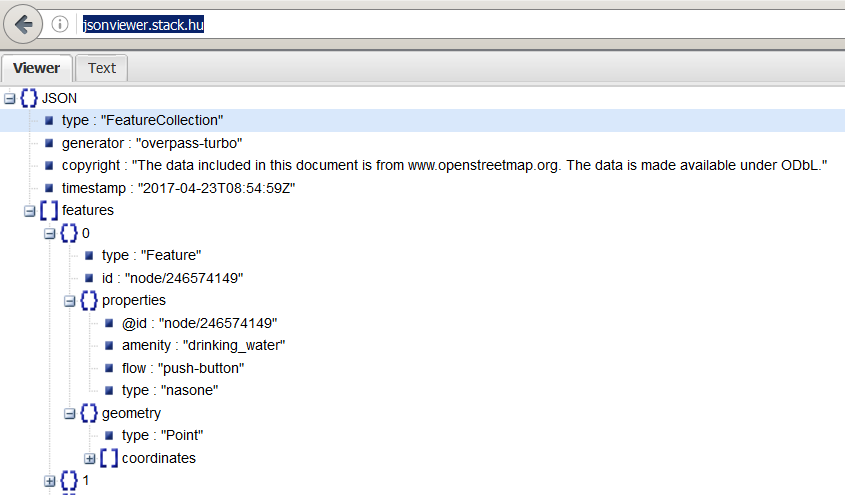
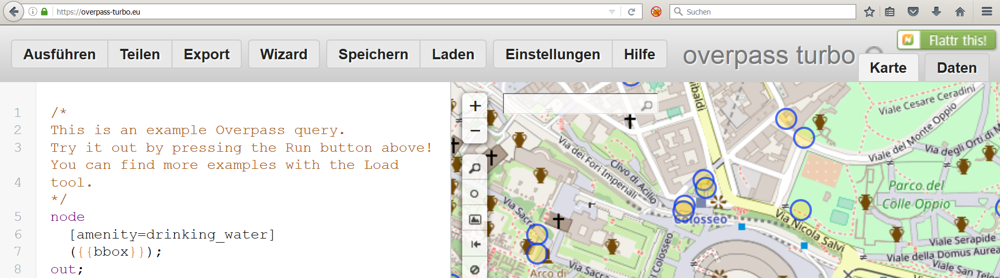
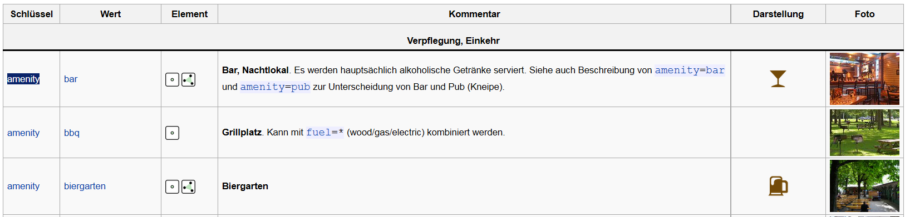
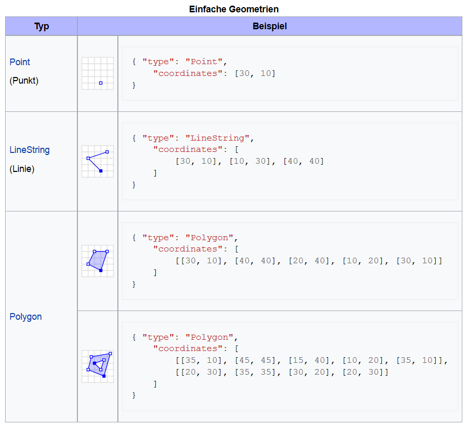

```{r setup, include=FALSE}
knitr::opts_chunk$set(echo = TRUE,eval=T)
```


# Import von JSON Dateien

## [JavaScript Object Notation (JSON)](https://de.wikipedia.org/wiki/JavaScript_Object_Notation)

- Jedes gültige JSON-Dokument soll ein gültiges JavaScript sein
- JSON wird zur Übertragung und zum Speichern von strukturierten Daten eingesetzt
- Insbesondere bei Webanwendungen und mobilen Apps wird es in Verbindung mit JavaScript, Ajax oder WebSockets zum Transfer von Daten zwischen dem Client und dem Server häufig genutzt.
<!--

-->



## Das GeoJSON Format

- GeoJSON ist ein offenes Format um geografische Daten nach der Simple-Feature-Access-Spezifikation zu repräsentieren. 
- Dafür wird die JavaScript Object Notation verwendet.

Die Struktur der Daten kann man sich mit einem [JSON Viewer anschauen](http://jsonviewer.stack.hu/)



## [Download von Beispieldaten](https://overpass-turbo.eu/)

- Overpass Turbo kann verwendet werden um Beispieldaten zu bekommen

<https://overpass-turbo.eu/>



## Exkurs OpenStreetMap Daten

- Auf Overpass Turbo können Daten für Map Features exportiert werden
- Eine Liste der erhältlichen Map Features gibt es auf <http://wiki.openstreetmap.org/wiki/DE:Map_Features>




## [Beispiele für GeoJSON](https://de.wikipedia.org/wiki/GeoJSON)



## JSON importieren

```{r}
library("jsonlite")
DRINKWATER <- fromJSON("data/RomDrinkingWater.geojson")
```

```{r}
names(DRINKWATER)[1:3]
names(DRINKWATER)[4:5]
```

## Die Daten anschauen

```{r,eval=F}
head(DRINKWATER$features)
```


```{r,echo=F}
library(knitr)
head(DRINKWATER$features)
```

## [Github JSON Daten](https://cran.r-project.org/web/packages/jsonlite/vignettes/json-apis.html)

- Es lassen sich auch Dinge aus dem Web auslesen:

```{r}
my_repos <- fromJSON("https://api.github.com/users/japhilko/repos")
```

```{r}
names(my_repos)
```


## [Weiteres Beispiel für JSON Daten](https://cran.r-project.org/web/packages/jsonlite/vignettes/json-apis.html)

- Die [Ergast Developer API](http://ergast.com/mrd/) ist ein experimenteller Web Service, der eine historische Aufzeichnung von Motorsportdaten liefert.


## Ergast Daten lesen

```{r}
library(jsonlite)
res <- fromJSON('http://ergast.com/api/f1/2004/1/results.json')
drivers <- res$MRData$RaceTable$Races$Results[[1]]$Driver
colnames(drivers)
```

## Daten der New York Times

- Die New York Times hat mehrere APIs als Teil des NYT-Entwickler-Netzwerks.
- Es ist eine Schnittstelle zu Daten aus verschiedenen Abteilungen, wie Nachrichtenartikel, Buchbesprechungen, Immobilien, etc. 
- Registrierung ist erforderlich (aber kostenlos) und ein Schlüssel kann [hier](http://developer.nytimes.com/signup) erhalten werden. 

## New York Times Beispiel

```{r}
article_key <- "&api-key=c2fede7bd9aea57c898f538e5ec0a1ee:6:68700045"
url <- "http://api.nytimes.com/svc/search/v2/articlesearch.json?q=obamacare+socialism"
req <- fromJSON(paste0(url, article_key))
articles <- req$response$docs
colnames(articles)
```

# Import von XML Dateien

## Das `XML` Paket

```{r}
library(XML)
citation("XML")
```


## Erstes Beispiel

```{r,eval=F}
url <- "http://api.openstreetmap.org/api/0.6/
relation/62422"
```

```{r,echo=F}
url <- "http://api.openstreetmap.org/api/0.6/relation/62422"
```


```{r}
library(xml2)
BE <- xmlParse(url)
```


## Das XML analysieren

- [Tobi Bosede - Working with XML Data in R](http://www.informit.com/articles/article.aspx?p=2215520)

```{r}
xmltop = xmlRoot(BE)
class(xmltop)
xmlSize(xmltop)
xmlSize(xmltop[[1]])
```


## Nutzung von Xpath

[Xpath](https://de.wikipedia.org/wiki/XPath), the XML Path Language, is a query language for selecting nodes from an XML document. 


```{r}
xpathApply(BE,"//tag[@k = 'source:population']")
```

## Node parsen

```{r parseNode}
url2 <- "http://api.openstreetmap.org/api/0.6/node/2923760808"
RennesBa <- xmlParse(url2)
```


## Way parsen

```{r MadCalle}
url3 <- "http://api.openstreetmap.org/api/0.6/way/72799743"
MadCalle <- xmlParse(url3)
```


## Mehr Beispiele, wie man mit XML Daten umgeht:


- [Daten aus XML extrahieren](http://www.stat.berkeley.edu/~statcur/Workshop2/Presentations/XML.pdf)

<http://www.stat.berkeley.edu/~statcur/Workshop2/Presentations/XML.pdf>

- Duncan Temple Lang - [A Short Introduction to the XML package for R](http://www.omegahat.net/RSXML/shortIntro.pdf)

<http://www.omegahat.net/RSXML/shortIntro.pdf>

## Noch mehr Informationen

- [Web Daten manipulieren](http://www.di.fc.ul.pt/~jpn/r/web/index.html#parsing-xml)

<http://www.di.fc.ul.pt/~jpn/r/web/index.html#parsing-xml>

- [Tutorial zu xquery](http://www.w3schools.com/xml/xquery_intro.asp)

<http://www.w3schools.com/xml/xquery_intro.asp>

- [R und das Web (für Anfänger), Teil II: XML und R](http://giventhedata.blogspot.de/2012/06/r-and-web-for-beginners-part-ii-xml-in.html)

<http://giventhedata.blogspot.de/2012/06/r-and-web-for-beginners-part-ii-xml-in.html>

- [String Manipulation](http://gastonsanchez.com/Handling_and_Processing_Strings_in_R.pdf)

<http://gastonsanchez.com/Handling_and_Processing_Strings_in_R.pdf>

## Referenzen

```{r}
citation("XML")
```

## Links

- [XML parsen - Stackoverflow](http://stackoverflow.com/questions/17198658/how-to-parse-xml-to-r-data-frame)

- [Processing of GeoJson data in R](https://www.r-bloggers.com/processing-of-geojson-data-in-r/)