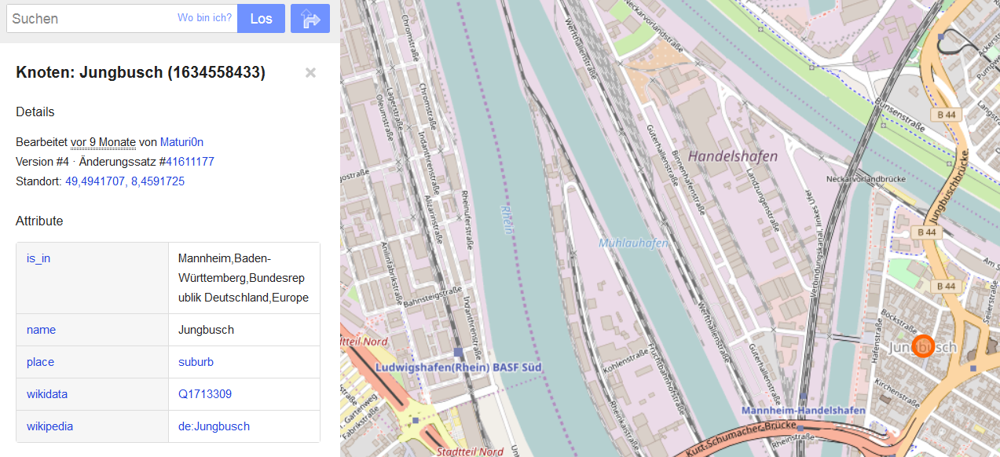
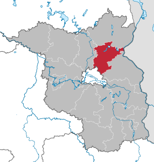

```{r, include=FALSE}
knitr::opts_chunk$set(echo = TRUE,eval=T)
```


## Import von [JavaScript Object Notation (JSON)](https://de.wikipedia.org/wiki/JavaScript_Object_Notation)

- Jedes gültige JSON-Dokument soll ein gültiges JavaScript sein
- JSON wird zur Übertragung und zum Speichern von strukturierten Daten eingesetzt
- Insbesondere bei Webanwendungen und mobilen Apps wird es in Verbindung mit JavaScript, Ajax oder WebSockets zum Transfer von Daten zwischen dem Client und dem Server häufig genutzt.
<!--

-->


## [Download von Beispieldaten](https://overpass-turbo.eu/)

- Overpass Turbo kann verwendet werden um Beispieldaten zu bekommen

<https://overpass-turbo.eu/>


## Exkurs OpenStreetMap Daten

- Auf Overpass Turbo können Daten für Map Features exportiert werden
- Eine Liste der erhältlichen Map Features gibt es auf <http://wiki.openstreetmap.org/wiki/DE:Map_Features>


## Das Paket `jsonlite`

```{r,eval=F}
install.packages("jsonlite")
```

```{r}
library(jsonlite)
citation("jsonlite")
```


## JSON importieren

- die Daten für die Trinkstationen in Rom habe ich mit Overpass Turbo exportiert

```{r}
library("jsonlite")
DRINKWATER <- fromJSON("data/RomDrinkingWater.geojson")
```

```{r}
names(DRINKWATER)[1:3]
names(DRINKWATER)[4:5]
```

## Die Daten anschauen

```{r,eval=F}
head(DRINKWATER$features)
```


```{r,echo=F}
library(knitr)
head(DRINKWATER$features)
```

## [Github JSON Daten](https://cran.r-project.org/web/packages/jsonlite/vignettes/json-apis.html)

- Es lassen sich auch Dinge aus dem Web auslesen:

```{r}
my_repos <- fromJSON("https://api.github.com/users/japhilko/repos")
```

```{r}
head(my_repos)
```


## [Weiteres Beispiel für JSON Daten](https://cran.r-project.org/web/packages/jsonlite/vignettes/json-apis.html)

- Die [Ergast Developer API](http://ergast.com/mrd/) ist ein experimenteller Web Service, der eine historische Aufzeichnung von Motorsportdaten liefert.


## Ergast Daten lesen

```{r}
library(jsonlite)
res <- fromJSON('http://ergast.com/api/f1/2004/1/results.json')
drivers <- res$MRData$RaceTable$Races$Results[[1]]$Driver
library(DT)
datatable(drivers)
```

## Daten der New York Times

- Die New York Times hat mehrere APIs als Teil des NYT-Entwickler-Netzwerks.
- Es ist eine Schnittstelle zu Daten aus verschiedenen Abteilungen, wie Nachrichtenartikel, Buchbesprechungen, Immobilien, etc. 
- Registrierung ist erforderlich (aber kostenlos) und ein Schlüssel kann [hier](http://developer.nytimes.com/signup) erhalten werden. 

## New York Times Beispiel

```{r}
article_key <- "&api-key=c2fede7bd9aea57c898f538e5ec0a1ee:6:68700045"
url <- "http://api.nytimes.com/svc/search/v2/articlesearch.json?q=obamacare+socialism"
req <- fromJSON(paste0(url, article_key))
articles <- req$response$docs
datatable(articles)
```


## `XML` Dateien einlesen


## Import von `XML` Dateien

```{r,eval=F}
install.packages("XML")
```


```{r}
library(XML)
citation("XML")
```


## Das R-Paket `XML` - Gaston Sanchez

```{r}
library("XML")
```


Seine Arbeit sieht man [hier](http://gastonsanchez.com/).


## [Das Arbeiten mit XML Daten](https://github.com/gastonstat/tutorial-R-web-data/blob/master/04-parsing-xml/04-parsing-xml.pdf)


## Funktionen im XML Paket

```{r,echo=F,eval=T}
names <- c("xmlName()","name of the node","xmlSize()","number of subnodes","xmlAttrs()","named character vector of all attributes","xmlGetAttr()","value of a single attribute","xmlValue()","contents of a leaf node","xmlParent()","name of parent node","xmlAncestors()","name of ancestor nodes","getSibling()","siblings to the right or to the left","xmlNamespace()","the namespace (if there’s one)")
tab <- data.frame(t(array(names,dim=c(2,length(names)/2))))
colnames(tab) <- c("Function","Description")
kable(tab)
```


## Das neuere `xml2` Paket

```{r,eval=F}
install.packages("xml2")
```


```{r}
library(xml2)
citation("xml2")
```

## Beispiel Daten - [die OpenStreetMap API](http://wiki.openstreetmap.org/wiki/DE:API)

- OpenStreetMap hat eine Editier-API welche zum Lesen und Speichern von Rohen Geodaten von bzw. auf die OpenStreetMap Datenbank benutzt werden kann.


## Die OpenStreetMap ID herausfinden




## [Einzelne Objekte finden](http://www.openstreetmap.org/export)

<www.openstreetmap.org/export>


## [OSM Ausschnitte herunterladen](http://www.openstreetmap.org/export)

<www.openstreetmap.org/export>


## Erstes Beispiel

```{r,eval=F}
url <- "http://api.openstreetmap.org/api/0.6/
relation/62422"
```

```{r,echo=F}
url <- "http://api.openstreetmap.org/api/0.6/relation/62422"
```


```{r}
library(xml2)
BE <- xmlParse(url)
```


## Das XML analysieren

- [Tobi Bosede - Working with XML Data in R](http://www.informit.com/articles/article.aspx?p=2215520)

```{r}
xmltop = xmlRoot(BE)
class(xmltop)
xmlSize(xmltop)
xmlSize(xmltop[[1]])
```


## Nutzung von Xpath

[Xpath](https://de.wikipedia.org/wiki/XPath), the XML Path Language, is a query language for selecting nodes from an XML document. 


```{r}
xpathApply(BE,"//tag[@k = 'source:population']")
```


```{r,echo=F}
library("knitr")
```


## Beispiel: administrative Grenzen Berlin

[Administrative Grenzen für Deutschland](http://wiki.openstreetmap.org/wiki/DE:Grenze#Bundesl.C3.A4ndergrenze_-_admin_level.3D4)

```{r,echo=T}
url <- "http://api.openstreetmap.org/api/0.6/relation/62422"
```

```{r,echo=F}
# library(xml2)
# BE <- read_xml.raw(url)
```


```{r}
BE <- xmlParse(url)
```


## Quelle für die Bevölkerungsgröße

```{r}
xpathApply(BE,"//tag[@k = 'source:population']")
```

-[Statistik Berlin Brandenburg](https://www.statistik-berlin-brandenburg.de/datenbank/inhalt-datenbank.asp)

## Etwas überraschend: 

```{r}
xpathApply(BE,"//tag[@k = 'name:ta']")
```


## Geographische Region

```{r}
region <- xpathApply(BE,
  "//tag[@k = 'geographical_region']")
# regular expressions
region[[1]]
```

```
<tag k="geographical_region" 
  v="Barnim;Berliner Urstromtal;
  Teltow;Nauener Platte"/>
```

## Landkreis




## Weiteres Beispiel

```{r}
url2<-"http://api.openstreetmap.org/api/0.6/node/25113879"
obj2<-xmlParse(url2)
obj_amenity<-xpathApply(obj2,"//tag[@k = 'amenity']")[[1]]
obj_amenity
```

## Wikipedia Artikel

```{r}
xpathApply(obj2,"//tag[@k = 'wikipedia']")[[1]]
```

```{r}
xpathApply(obj2,"//tag[@k = 'wheelchair']")[[1]]
```

```{r}
xpathApply(obj2,"//tag[@k = 'name']")[[1]]
```


## Das C und das A

```{r}
url3<-"http://api.openstreetmap.org/api/0.6/node/303550876"
obj3 <- xmlParse(url3)
xpathApply(obj3,"//tag[@k = 'opening_hours']")[[1]]
```

## Nur Fliegen ist schöner

```{r }
url5<-"http://api.openstreetmap.org/api/0.6/way/162149882"
obj5<-xmlParse(url5)
xpathApply(obj5,"//tag[@k = 'name']")[[1]]
```


```{r}
xpathApply(obj5,"//tag[@k = 'website']")[[1]]
```


```{r}
xpathApply(obj5,"//tag[@k = 'iata']")[[1]]
```


## Einen Punkt parsen

```{r parseNode}
url2 <- "http://api.openstreetmap.org/api/0.6/node/2923760808"
RennesBa <- xmlParse(url2)
RennesBa
```


## Einen Weg parsen

```{r MadCalle}
url3 <- "http://api.openstreetmap.org/api/0.6/way/72799743"
MadCalle <- xmlParse(url3)
MadCalle
```


## The Overpass API


> The Overpass API is a read-only API that serves up custom selected parts of the OSM map data.

(<http://wiki.openstreetmap.org/wiki/Overpass_API>)

## Wichtige Information 

<http://wiki.openstreetmap.org/wiki/Map_Features>


## Beispiel: Nutzung der Overpass API


## Export der Rohdaten


## Import von der Overpass API zu R

```{r,echo=F}
Link1 <- "http://www.overpass-api.de/api/interpreter?data=[maxsize:1073741824][timeout:900];area[name=\""
```


```{r}
library(XML)
place <- "Mannheim"
type_obj <- "node"
object <- "leisure=playground"

InfoList <- xmlParse(paste(Link1,place,"\"];",
type_obj,"(area)[",object,"];out;",sep=""))
```


```{r,echo=F,eval=F}
saveXML(InfoList,file="../data/saveXML.xml")
```

## XML Output


## Das Arbeiten mit XML Daten (xpath)

Die Liste der ID's mit dem Wert *playground*:

```{r,eval=F}
node_id <- xpathApply(InfoList,
"//tag[@v= 'playground']/parent::node/@ id")
## node_id[[1]]
```


## latitude und longitude bekommen

```{r,eval=F}
lat_x <- xpathApply(InfoList,
"//tag[@v= 'playground']/parent::node/@ lat")
# lat_x[[1]];lat_x[[2]]
```

```{r,eval=F}
lat_x <- xpathApply(InfoList,
"//tag[@v= 'playground']/parent::node/@ lon")
```


## Paket auf Github

```{r,eval=F}
library(devtools)
install_github("Japhilko/gosmd")
```

```{r getplaygrounds,eval=T}
library(gosmd)
pg_MA <- get_osm_nodes(object="leisure=playground",
                       "Mannheim")
info <- extract_osm_nodes(OSM.Data=pg_MA,
                          value="playground")
```

## Ausschnitt der Ergebnisse

```{r produceinttable,echo=F}
library(knitr)
kable(head(info[,c("leisure","lat","lon","note")]))
```


## Link

- [Tutorial zur Nutzung der Overpass API](http://osmlab.github.io/learnoverpass/en/exercises/intro/1/)

- [Vignette xml2](https://cran.r-project.org/web/packages/xml2/vignettes/modification.html)


## Mehr Beispiele, wie man mit XML Daten umgeht:


- Deborah Nolan - [Extracting data from XML](http://www.stat.berkeley.edu/~statcur/Workshop2/Presentations/XML.pdf)


- Duncan Temple Lang - [A Short Introduction to the XML package for R](http://www.omegahat.net/RSXML/shortIntro.pdf)


Noch mehr Informationen

- [Web Daten manipulieren](http://www.di.fc.ul.pt/~jpn/r/web/index.html#parsing-xml)

- [Tutorial zu xquery](http://www.w3schools.com/xml/xquery_intro.asp)

- [R und das Web (für Anfänger), Teil II: XML und R](http://giventhedata.blogspot.de/2012/06/r-and-web-for-beginners-part-ii-xml-in.html)

- [String Manipulation](http://gastonsanchez.com/Handling_and_Processing_Strings_in_R.pdf)

- [Nutzung, Vor- und Nachteile OSM](https://www.e-education.psu.edu/geog585/node/738)

- [Forschungsprojekte im Zusammenhang mit OpenStreetMap](http://wiki.openstreetmap.org/wiki/Research)

- [XML parsen - Stackoverflow](http://stackoverflow.com/questions/17198658/how-to-parse-xml-to-r-data-frame)

- [Processing of GeoJson data in R](https://www.r-bloggers.com/processing-of-geojson-data-in-r/)

