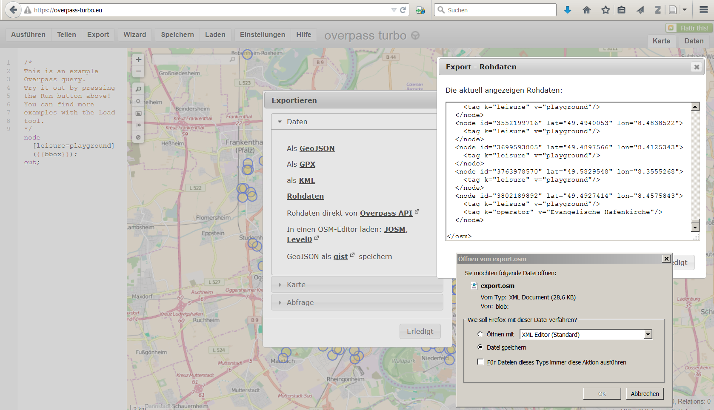

# Import von Webdaten
Jan-Philipp Kolb  
8 Mai 2017  


## Import von [JavaScript Object Notation (JSON)](https://de.wikipedia.org/wiki/JavaScript_Object_Notation)

- Jedes gültige JSON-Dokument soll ein gültiges JavaScript sein
- JSON wird zur Übertragung und zum Speichern von strukturierten Daten eingesetzt
- Insbesondere bei Webanwendungen und mobilen Apps wird es in Verbindung mit JavaScript, Ajax oder WebSockets zum Transfer von Daten zwischen dem Client und dem Server häufig genutzt.
<!--

-->


## [Download von Beispieldaten](https://overpass-turbo.eu/)

- Overpass Turbo kann verwendet werden um Beispieldaten zu bekommen

<https://overpass-turbo.eu/>


## Exkurs OpenStreetMap Daten

- Auf Overpass Turbo können Daten für Map Features exportiert werden
- Eine Liste der erhältlichen Map Features gibt es auf <http://wiki.openstreetmap.org/wiki/DE:Map_Features>


## Das Paket `jsonlite`


```r
install.packages("jsonlite")
```


```r
library(jsonlite)
citation("jsonlite")
```

```
## 
## To cite jsonlite in publications use:
## 
##   Jeroen Ooms (2014). The jsonlite Package: A Practical and
##   Consistent Mapping Between JSON Data and R Objects.
##   arXiv:1403.2805 [stat.CO] URL http://arxiv.org/abs/1403.2805.
## 
## A BibTeX entry for LaTeX users is
## 
##   @Article{,
##     title = {The jsonlite Package: A Practical and Consistent Mapping Between JSON Data and R Objects},
##     author = {Jeroen Ooms},
##     journal = {arXiv:1403.2805 [stat.CO]},
##     year = {2014},
##     url = {http://arxiv.org/abs/1403.2805},
##   }
```


## JSON importieren

- die Daten für die Trinkstationen in Rom habe ich mit Overpass Turbo exportiert


```r
library("jsonlite")
DRINKWATER <- fromJSON("data/RomDrinkingWater.geojson")
```


```r
names(DRINKWATER)[1:3]
```

```
## [1] "type"      "generator" "copyright"
```

```r
names(DRINKWATER)[4:5]
```

```
## [1] "timestamp" "features"
```

## Die Daten anschauen


```r
head(DRINKWATER$features)
```


```
##      type             id properties.@id properties.amenity properties.flow
## 1 Feature node/246574149 node/246574149     drinking_water     push-button
## 2 Feature node/246574150 node/246574150     drinking_water            <NA>
## 3 Feature node/246574151 node/246574151     drinking_water            <NA>
## 4 Feature node/248743324 node/248743324     drinking_water            <NA>
## 5 Feature node/251773348 node/251773348     drinking_water            <NA>
## 6 Feature node/251773551 node/251773551     drinking_water            <NA>
##   properties.type properties.name properties.name:fr properties.wheelchair
## 1          nasone            <NA>               <NA>                  <NA>
## 2            <NA>            <NA>               <NA>                  <NA>
## 3            <NA>            <NA>               <NA>                  <NA>
## 4            <NA>            <NA>               <NA>                  <NA>
## 5          nasone            <NA>               <NA>                  <NA>
## 6            <NA>    Acqua Marcia        Eau potable                   yes
##   properties.created_by properties.indoor geometry.type
## 1                  <NA>              <NA>         Point
## 2                  <NA>              <NA>         Point
## 3                  <NA>              <NA>         Point
## 4                  <NA>              <NA>         Point
## 5                  <NA>              <NA>         Point
## 6                  <NA>              <NA>         Point
##   geometry.coordinates
## 1   12.49191, 41.89479
## 2   12.49095, 41.89489
## 3   12.48774, 41.89450
## 4   12.48773, 41.89354
## 5   12.48529, 41.88539
## 6   12.48386, 41.89332
```

## [Github JSON Daten](https://cran.r-project.org/web/packages/jsonlite/vignettes/json-apis.html)

- Es lassen sich auch Dinge aus dem Web auslesen:


```r
my_repos <- fromJSON("https://api.github.com/users/japhilko/repos")
```


```r
head(my_repos)
```

```
##         id                      name                          full_name
## 1 29143362 2015-01-15-EMBLHeidelberg Japhilko/2015-01-15-EMBLHeidelberg
## 2 39427013              DataAnalysis              Japhilko/DataAnalysis
## 3 26485588            DataGeneration            Japhilko/DataGeneration
## 4 26164276                DLR_IntroR                Japhilko/DLR_IntroR
## 5 20760765                   GeoData                   Japhilko/GeoData
## 6 55756271                 geosmdata                 Japhilko/geosmdata
##   owner.login owner.id
## 1    Japhilko  7593396
## 2    Japhilko  7593396
## 3    Japhilko  7593396
## 4    Japhilko  7593396
## 5    Japhilko  7593396
## 6    Japhilko  7593396
##                                       owner.avatar_url owner.gravatar_id
## 1 https://avatars2.githubusercontent.com/u/7593396?v=3                  
## 2 https://avatars2.githubusercontent.com/u/7593396?v=3                  
## 3 https://avatars2.githubusercontent.com/u/7593396?v=3                  
## 4 https://avatars2.githubusercontent.com/u/7593396?v=3                  
## 5 https://avatars2.githubusercontent.com/u/7593396?v=3                  
## 6 https://avatars2.githubusercontent.com/u/7593396?v=3                  
##                               owner.url              owner.html_url
## 1 https://api.github.com/users/Japhilko https://github.com/Japhilko
## 2 https://api.github.com/users/Japhilko https://github.com/Japhilko
## 3 https://api.github.com/users/Japhilko https://github.com/Japhilko
## 4 https://api.github.com/users/Japhilko https://github.com/Japhilko
## 5 https://api.github.com/users/Japhilko https://github.com/Japhilko
## 6 https://api.github.com/users/Japhilko https://github.com/Japhilko
##                               owner.followers_url
## 1 https://api.github.com/users/Japhilko/followers
## 2 https://api.github.com/users/Japhilko/followers
## 3 https://api.github.com/users/Japhilko/followers
## 4 https://api.github.com/users/Japhilko/followers
## 5 https://api.github.com/users/Japhilko/followers
## 6 https://api.github.com/users/Japhilko/followers
##                                            owner.following_url
## 1 https://api.github.com/users/Japhilko/following{/other_user}
## 2 https://api.github.com/users/Japhilko/following{/other_user}
## 3 https://api.github.com/users/Japhilko/following{/other_user}
## 4 https://api.github.com/users/Japhilko/following{/other_user}
## 5 https://api.github.com/users/Japhilko/following{/other_user}
## 6 https://api.github.com/users/Japhilko/following{/other_user}
##                                         owner.gists_url
## 1 https://api.github.com/users/Japhilko/gists{/gist_id}
## 2 https://api.github.com/users/Japhilko/gists{/gist_id}
## 3 https://api.github.com/users/Japhilko/gists{/gist_id}
## 4 https://api.github.com/users/Japhilko/gists{/gist_id}
## 5 https://api.github.com/users/Japhilko/gists{/gist_id}
## 6 https://api.github.com/users/Japhilko/gists{/gist_id}
##                                              owner.starred_url
## 1 https://api.github.com/users/Japhilko/starred{/owner}{/repo}
## 2 https://api.github.com/users/Japhilko/starred{/owner}{/repo}
## 3 https://api.github.com/users/Japhilko/starred{/owner}{/repo}
## 4 https://api.github.com/users/Japhilko/starred{/owner}{/repo}
## 5 https://api.github.com/users/Japhilko/starred{/owner}{/repo}
## 6 https://api.github.com/users/Japhilko/starred{/owner}{/repo}
##                               owner.subscriptions_url
## 1 https://api.github.com/users/Japhilko/subscriptions
## 2 https://api.github.com/users/Japhilko/subscriptions
## 3 https://api.github.com/users/Japhilko/subscriptions
## 4 https://api.github.com/users/Japhilko/subscriptions
## 5 https://api.github.com/users/Japhilko/subscriptions
## 6 https://api.github.com/users/Japhilko/subscriptions
##                      owner.organizations_url
## 1 https://api.github.com/users/Japhilko/orgs
## 2 https://api.github.com/users/Japhilko/orgs
## 3 https://api.github.com/users/Japhilko/orgs
## 4 https://api.github.com/users/Japhilko/orgs
## 5 https://api.github.com/users/Japhilko/orgs
## 6 https://api.github.com/users/Japhilko/orgs
##                               owner.repos_url
## 1 https://api.github.com/users/Japhilko/repos
## 2 https://api.github.com/users/Japhilko/repos
## 3 https://api.github.com/users/Japhilko/repos
## 4 https://api.github.com/users/Japhilko/repos
## 5 https://api.github.com/users/Japhilko/repos
## 6 https://api.github.com/users/Japhilko/repos
##                                         owner.events_url
## 1 https://api.github.com/users/Japhilko/events{/privacy}
## 2 https://api.github.com/users/Japhilko/events{/privacy}
## 3 https://api.github.com/users/Japhilko/events{/privacy}
## 4 https://api.github.com/users/Japhilko/events{/privacy}
## 5 https://api.github.com/users/Japhilko/events{/privacy}
## 6 https://api.github.com/users/Japhilko/events{/privacy}
##                               owner.received_events_url owner.type
## 1 https://api.github.com/users/Japhilko/received_events       User
## 2 https://api.github.com/users/Japhilko/received_events       User
## 3 https://api.github.com/users/Japhilko/received_events       User
## 4 https://api.github.com/users/Japhilko/received_events       User
## 5 https://api.github.com/users/Japhilko/received_events       User
## 6 https://api.github.com/users/Japhilko/received_events       User
##   owner.site_admin private
## 1            FALSE   FALSE
## 2            FALSE   FALSE
## 3            FALSE   FALSE
## 4            FALSE   FALSE
## 5            FALSE   FALSE
## 6            FALSE   FALSE
##                                                html_url
## 1 https://github.com/Japhilko/2015-01-15-EMBLHeidelberg
## 2              https://github.com/Japhilko/DataAnalysis
## 3            https://github.com/Japhilko/DataGeneration
## 4                https://github.com/Japhilko/DLR_IntroR
## 5                   https://github.com/Japhilko/GeoData
## 6                 https://github.com/Japhilko/geosmdata
##                                        description  fork
## 1  R programming and development (EMBL, Jan 2015)   TRUE
## 2                     My research on data analysis FALSE
## 3              Rcode for generating synthatic data FALSE
## 4                      Unterlagen für DLR Workshop FALSE
## 5               Research on statistics and geodata FALSE
## 6             package to import OpenstreetMap data FALSE
##                                                               url
## 1 https://api.github.com/repos/Japhilko/2015-01-15-EMBLHeidelberg
## 2              https://api.github.com/repos/Japhilko/DataAnalysis
## 3            https://api.github.com/repos/Japhilko/DataGeneration
## 4                https://api.github.com/repos/Japhilko/DLR_IntroR
## 5                   https://api.github.com/repos/Japhilko/GeoData
## 6                 https://api.github.com/repos/Japhilko/geosmdata
##                                                               forks_url
## 1 https://api.github.com/repos/Japhilko/2015-01-15-EMBLHeidelberg/forks
## 2              https://api.github.com/repos/Japhilko/DataAnalysis/forks
## 3            https://api.github.com/repos/Japhilko/DataGeneration/forks
## 4                https://api.github.com/repos/Japhilko/DLR_IntroR/forks
## 5                   https://api.github.com/repos/Japhilko/GeoData/forks
## 6                 https://api.github.com/repos/Japhilko/geosmdata/forks
##                                                                        keys_url
## 1 https://api.github.com/repos/Japhilko/2015-01-15-EMBLHeidelberg/keys{/key_id}
## 2              https://api.github.com/repos/Japhilko/DataAnalysis/keys{/key_id}
## 3            https://api.github.com/repos/Japhilko/DataGeneration/keys{/key_id}
## 4                https://api.github.com/repos/Japhilko/DLR_IntroR/keys{/key_id}
## 5                   https://api.github.com/repos/Japhilko/GeoData/keys{/key_id}
## 6                 https://api.github.com/repos/Japhilko/geosmdata/keys{/key_id}
##                                                                              collaborators_url
## 1 https://api.github.com/repos/Japhilko/2015-01-15-EMBLHeidelberg/collaborators{/collaborator}
## 2              https://api.github.com/repos/Japhilko/DataAnalysis/collaborators{/collaborator}
## 3            https://api.github.com/repos/Japhilko/DataGeneration/collaborators{/collaborator}
## 4                https://api.github.com/repos/Japhilko/DLR_IntroR/collaborators{/collaborator}
## 5                   https://api.github.com/repos/Japhilko/GeoData/collaborators{/collaborator}
## 6                 https://api.github.com/repos/Japhilko/geosmdata/collaborators{/collaborator}
##                                                               teams_url
## 1 https://api.github.com/repos/Japhilko/2015-01-15-EMBLHeidelberg/teams
## 2              https://api.github.com/repos/Japhilko/DataAnalysis/teams
## 3            https://api.github.com/repos/Japhilko/DataGeneration/teams
## 4                https://api.github.com/repos/Japhilko/DLR_IntroR/teams
## 5                   https://api.github.com/repos/Japhilko/GeoData/teams
## 6                 https://api.github.com/repos/Japhilko/geosmdata/teams
##                                                               hooks_url
## 1 https://api.github.com/repos/Japhilko/2015-01-15-EMBLHeidelberg/hooks
## 2              https://api.github.com/repos/Japhilko/DataAnalysis/hooks
## 3            https://api.github.com/repos/Japhilko/DataGeneration/hooks
## 4                https://api.github.com/repos/Japhilko/DLR_IntroR/hooks
## 5                   https://api.github.com/repos/Japhilko/GeoData/hooks
## 6                 https://api.github.com/repos/Japhilko/geosmdata/hooks
##                                                                         issue_events_url
## 1 https://api.github.com/repos/Japhilko/2015-01-15-EMBLHeidelberg/issues/events{/number}
## 2              https://api.github.com/repos/Japhilko/DataAnalysis/issues/events{/number}
## 3            https://api.github.com/repos/Japhilko/DataGeneration/issues/events{/number}
## 4                https://api.github.com/repos/Japhilko/DLR_IntroR/issues/events{/number}
## 5                   https://api.github.com/repos/Japhilko/GeoData/issues/events{/number}
## 6                 https://api.github.com/repos/Japhilko/geosmdata/issues/events{/number}
##                                                               events_url
## 1 https://api.github.com/repos/Japhilko/2015-01-15-EMBLHeidelberg/events
## 2              https://api.github.com/repos/Japhilko/DataAnalysis/events
## 3            https://api.github.com/repos/Japhilko/DataGeneration/events
## 4                https://api.github.com/repos/Japhilko/DLR_IntroR/events
## 5                   https://api.github.com/repos/Japhilko/GeoData/events
## 6                 https://api.github.com/repos/Japhilko/geosmdata/events
##                                                                      assignees_url
## 1 https://api.github.com/repos/Japhilko/2015-01-15-EMBLHeidelberg/assignees{/user}
## 2              https://api.github.com/repos/Japhilko/DataAnalysis/assignees{/user}
## 3            https://api.github.com/repos/Japhilko/DataGeneration/assignees{/user}
## 4                https://api.github.com/repos/Japhilko/DLR_IntroR/assignees{/user}
## 5                   https://api.github.com/repos/Japhilko/GeoData/assignees{/user}
## 6                 https://api.github.com/repos/Japhilko/geosmdata/assignees{/user}
##                                                                        branches_url
## 1 https://api.github.com/repos/Japhilko/2015-01-15-EMBLHeidelberg/branches{/branch}
## 2              https://api.github.com/repos/Japhilko/DataAnalysis/branches{/branch}
## 3            https://api.github.com/repos/Japhilko/DataGeneration/branches{/branch}
## 4                https://api.github.com/repos/Japhilko/DLR_IntroR/branches{/branch}
## 5                   https://api.github.com/repos/Japhilko/GeoData/branches{/branch}
## 6                 https://api.github.com/repos/Japhilko/geosmdata/branches{/branch}
##                                                               tags_url
## 1 https://api.github.com/repos/Japhilko/2015-01-15-EMBLHeidelberg/tags
## 2              https://api.github.com/repos/Japhilko/DataAnalysis/tags
## 3            https://api.github.com/repos/Japhilko/DataGeneration/tags
## 4                https://api.github.com/repos/Japhilko/DLR_IntroR/tags
## 5                   https://api.github.com/repos/Japhilko/GeoData/tags
## 6                 https://api.github.com/repos/Japhilko/geosmdata/tags
##                                                                         blobs_url
## 1 https://api.github.com/repos/Japhilko/2015-01-15-EMBLHeidelberg/git/blobs{/sha}
## 2              https://api.github.com/repos/Japhilko/DataAnalysis/git/blobs{/sha}
## 3            https://api.github.com/repos/Japhilko/DataGeneration/git/blobs{/sha}
## 4                https://api.github.com/repos/Japhilko/DLR_IntroR/git/blobs{/sha}
## 5                   https://api.github.com/repos/Japhilko/GeoData/git/blobs{/sha}
## 6                 https://api.github.com/repos/Japhilko/geosmdata/git/blobs{/sha}
##                                                                     git_tags_url
## 1 https://api.github.com/repos/Japhilko/2015-01-15-EMBLHeidelberg/git/tags{/sha}
## 2              https://api.github.com/repos/Japhilko/DataAnalysis/git/tags{/sha}
## 3            https://api.github.com/repos/Japhilko/DataGeneration/git/tags{/sha}
## 4                https://api.github.com/repos/Japhilko/DLR_IntroR/git/tags{/sha}
## 5                   https://api.github.com/repos/Japhilko/GeoData/git/tags{/sha}
## 6                 https://api.github.com/repos/Japhilko/geosmdata/git/tags{/sha}
##                                                                     git_refs_url
## 1 https://api.github.com/repos/Japhilko/2015-01-15-EMBLHeidelberg/git/refs{/sha}
## 2              https://api.github.com/repos/Japhilko/DataAnalysis/git/refs{/sha}
## 3            https://api.github.com/repos/Japhilko/DataGeneration/git/refs{/sha}
## 4                https://api.github.com/repos/Japhilko/DLR_IntroR/git/refs{/sha}
## 5                   https://api.github.com/repos/Japhilko/GeoData/git/refs{/sha}
## 6                 https://api.github.com/repos/Japhilko/geosmdata/git/refs{/sha}
##                                                                         trees_url
## 1 https://api.github.com/repos/Japhilko/2015-01-15-EMBLHeidelberg/git/trees{/sha}
## 2              https://api.github.com/repos/Japhilko/DataAnalysis/git/trees{/sha}
## 3            https://api.github.com/repos/Japhilko/DataGeneration/git/trees{/sha}
## 4                https://api.github.com/repos/Japhilko/DLR_IntroR/git/trees{/sha}
## 5                   https://api.github.com/repos/Japhilko/GeoData/git/trees{/sha}
## 6                 https://api.github.com/repos/Japhilko/geosmdata/git/trees{/sha}
##                                                                     statuses_url
## 1 https://api.github.com/repos/Japhilko/2015-01-15-EMBLHeidelberg/statuses/{sha}
## 2              https://api.github.com/repos/Japhilko/DataAnalysis/statuses/{sha}
## 3            https://api.github.com/repos/Japhilko/DataGeneration/statuses/{sha}
## 4                https://api.github.com/repos/Japhilko/DLR_IntroR/statuses/{sha}
## 5                   https://api.github.com/repos/Japhilko/GeoData/statuses/{sha}
## 6                 https://api.github.com/repos/Japhilko/geosmdata/statuses/{sha}
##                                                               languages_url
## 1 https://api.github.com/repos/Japhilko/2015-01-15-EMBLHeidelberg/languages
## 2              https://api.github.com/repos/Japhilko/DataAnalysis/languages
## 3            https://api.github.com/repos/Japhilko/DataGeneration/languages
## 4                https://api.github.com/repos/Japhilko/DLR_IntroR/languages
## 5                   https://api.github.com/repos/Japhilko/GeoData/languages
## 6                 https://api.github.com/repos/Japhilko/geosmdata/languages
##                                                               stargazers_url
## 1 https://api.github.com/repos/Japhilko/2015-01-15-EMBLHeidelberg/stargazers
## 2              https://api.github.com/repos/Japhilko/DataAnalysis/stargazers
## 3            https://api.github.com/repos/Japhilko/DataGeneration/stargazers
## 4                https://api.github.com/repos/Japhilko/DLR_IntroR/stargazers
## 5                   https://api.github.com/repos/Japhilko/GeoData/stargazers
## 6                 https://api.github.com/repos/Japhilko/geosmdata/stargazers
##                                                               contributors_url
## 1 https://api.github.com/repos/Japhilko/2015-01-15-EMBLHeidelberg/contributors
## 2              https://api.github.com/repos/Japhilko/DataAnalysis/contributors
## 3            https://api.github.com/repos/Japhilko/DataGeneration/contributors
## 4                https://api.github.com/repos/Japhilko/DLR_IntroR/contributors
## 5                   https://api.github.com/repos/Japhilko/GeoData/contributors
## 6                 https://api.github.com/repos/Japhilko/geosmdata/contributors
##                                                               subscribers_url
## 1 https://api.github.com/repos/Japhilko/2015-01-15-EMBLHeidelberg/subscribers
## 2              https://api.github.com/repos/Japhilko/DataAnalysis/subscribers
## 3            https://api.github.com/repos/Japhilko/DataGeneration/subscribers
## 4                https://api.github.com/repos/Japhilko/DLR_IntroR/subscribers
## 5                   https://api.github.com/repos/Japhilko/GeoData/subscribers
## 6                 https://api.github.com/repos/Japhilko/geosmdata/subscribers
##                                                               subscription_url
## 1 https://api.github.com/repos/Japhilko/2015-01-15-EMBLHeidelberg/subscription
## 2              https://api.github.com/repos/Japhilko/DataAnalysis/subscription
## 3            https://api.github.com/repos/Japhilko/DataGeneration/subscription
## 4                https://api.github.com/repos/Japhilko/DLR_IntroR/subscription
## 5                   https://api.github.com/repos/Japhilko/GeoData/subscription
## 6                 https://api.github.com/repos/Japhilko/geosmdata/subscription
##                                                                     commits_url
## 1 https://api.github.com/repos/Japhilko/2015-01-15-EMBLHeidelberg/commits{/sha}
## 2              https://api.github.com/repos/Japhilko/DataAnalysis/commits{/sha}
## 3            https://api.github.com/repos/Japhilko/DataGeneration/commits{/sha}
## 4                https://api.github.com/repos/Japhilko/DLR_IntroR/commits{/sha}
## 5                   https://api.github.com/repos/Japhilko/GeoData/commits{/sha}
## 6                 https://api.github.com/repos/Japhilko/geosmdata/commits{/sha}
##                                                                     git_commits_url
## 1 https://api.github.com/repos/Japhilko/2015-01-15-EMBLHeidelberg/git/commits{/sha}
## 2              https://api.github.com/repos/Japhilko/DataAnalysis/git/commits{/sha}
## 3            https://api.github.com/repos/Japhilko/DataGeneration/git/commits{/sha}
## 4                https://api.github.com/repos/Japhilko/DLR_IntroR/git/commits{/sha}
## 5                   https://api.github.com/repos/Japhilko/GeoData/git/commits{/sha}
## 6                 https://api.github.com/repos/Japhilko/geosmdata/git/commits{/sha}
##                                                                        comments_url
## 1 https://api.github.com/repos/Japhilko/2015-01-15-EMBLHeidelberg/comments{/number}
## 2              https://api.github.com/repos/Japhilko/DataAnalysis/comments{/number}
## 3            https://api.github.com/repos/Japhilko/DataGeneration/comments{/number}
## 4                https://api.github.com/repos/Japhilko/DLR_IntroR/comments{/number}
## 5                   https://api.github.com/repos/Japhilko/GeoData/comments{/number}
## 6                 https://api.github.com/repos/Japhilko/geosmdata/comments{/number}
##                                                                          issue_comment_url
## 1 https://api.github.com/repos/Japhilko/2015-01-15-EMBLHeidelberg/issues/comments{/number}
## 2              https://api.github.com/repos/Japhilko/DataAnalysis/issues/comments{/number}
## 3            https://api.github.com/repos/Japhilko/DataGeneration/issues/comments{/number}
## 4                https://api.github.com/repos/Japhilko/DLR_IntroR/issues/comments{/number}
## 5                   https://api.github.com/repos/Japhilko/GeoData/issues/comments{/number}
## 6                 https://api.github.com/repos/Japhilko/geosmdata/issues/comments{/number}
##                                                                       contents_url
## 1 https://api.github.com/repos/Japhilko/2015-01-15-EMBLHeidelberg/contents/{+path}
## 2              https://api.github.com/repos/Japhilko/DataAnalysis/contents/{+path}
## 3            https://api.github.com/repos/Japhilko/DataGeneration/contents/{+path}
## 4                https://api.github.com/repos/Japhilko/DLR_IntroR/contents/{+path}
## 5                   https://api.github.com/repos/Japhilko/GeoData/contents/{+path}
## 6                 https://api.github.com/repos/Japhilko/geosmdata/contents/{+path}
##                                                                               compare_url
## 1 https://api.github.com/repos/Japhilko/2015-01-15-EMBLHeidelberg/compare/{base}...{head}
## 2              https://api.github.com/repos/Japhilko/DataAnalysis/compare/{base}...{head}
## 3            https://api.github.com/repos/Japhilko/DataGeneration/compare/{base}...{head}
## 4                https://api.github.com/repos/Japhilko/DLR_IntroR/compare/{base}...{head}
## 5                   https://api.github.com/repos/Japhilko/GeoData/compare/{base}...{head}
## 6                 https://api.github.com/repos/Japhilko/geosmdata/compare/{base}...{head}
##                                                               merges_url
## 1 https://api.github.com/repos/Japhilko/2015-01-15-EMBLHeidelberg/merges
## 2              https://api.github.com/repos/Japhilko/DataAnalysis/merges
## 3            https://api.github.com/repos/Japhilko/DataGeneration/merges
## 4                https://api.github.com/repos/Japhilko/DLR_IntroR/merges
## 5                   https://api.github.com/repos/Japhilko/GeoData/merges
## 6                 https://api.github.com/repos/Japhilko/geosmdata/merges
##                                                                              archive_url
## 1 https://api.github.com/repos/Japhilko/2015-01-15-EMBLHeidelberg/{archive_format}{/ref}
## 2              https://api.github.com/repos/Japhilko/DataAnalysis/{archive_format}{/ref}
## 3            https://api.github.com/repos/Japhilko/DataGeneration/{archive_format}{/ref}
## 4                https://api.github.com/repos/Japhilko/DLR_IntroR/{archive_format}{/ref}
## 5                   https://api.github.com/repos/Japhilko/GeoData/{archive_format}{/ref}
## 6                 https://api.github.com/repos/Japhilko/geosmdata/{archive_format}{/ref}
##                                                               downloads_url
## 1 https://api.github.com/repos/Japhilko/2015-01-15-EMBLHeidelberg/downloads
## 2              https://api.github.com/repos/Japhilko/DataAnalysis/downloads
## 3            https://api.github.com/repos/Japhilko/DataGeneration/downloads
## 4                https://api.github.com/repos/Japhilko/DLR_IntroR/downloads
## 5                   https://api.github.com/repos/Japhilko/GeoData/downloads
## 6                 https://api.github.com/repos/Japhilko/geosmdata/downloads
##                                                                        issues_url
## 1 https://api.github.com/repos/Japhilko/2015-01-15-EMBLHeidelberg/issues{/number}
## 2              https://api.github.com/repos/Japhilko/DataAnalysis/issues{/number}
## 3            https://api.github.com/repos/Japhilko/DataGeneration/issues{/number}
## 4                https://api.github.com/repos/Japhilko/DLR_IntroR/issues{/number}
## 5                   https://api.github.com/repos/Japhilko/GeoData/issues{/number}
## 6                 https://api.github.com/repos/Japhilko/geosmdata/issues{/number}
##                                                                        pulls_url
## 1 https://api.github.com/repos/Japhilko/2015-01-15-EMBLHeidelberg/pulls{/number}
## 2              https://api.github.com/repos/Japhilko/DataAnalysis/pulls{/number}
## 3            https://api.github.com/repos/Japhilko/DataGeneration/pulls{/number}
## 4                https://api.github.com/repos/Japhilko/DLR_IntroR/pulls{/number}
## 5                   https://api.github.com/repos/Japhilko/GeoData/pulls{/number}
## 6                 https://api.github.com/repos/Japhilko/geosmdata/pulls{/number}
##                                                                        milestones_url
## 1 https://api.github.com/repos/Japhilko/2015-01-15-EMBLHeidelberg/milestones{/number}
## 2              https://api.github.com/repos/Japhilko/DataAnalysis/milestones{/number}
## 3            https://api.github.com/repos/Japhilko/DataGeneration/milestones{/number}
## 4                https://api.github.com/repos/Japhilko/DLR_IntroR/milestones{/number}
## 5                   https://api.github.com/repos/Japhilko/GeoData/milestones{/number}
## 6                 https://api.github.com/repos/Japhilko/geosmdata/milestones{/number}
##                                                                                         notifications_url
## 1 https://api.github.com/repos/Japhilko/2015-01-15-EMBLHeidelberg/notifications{?since,all,participating}
## 2              https://api.github.com/repos/Japhilko/DataAnalysis/notifications{?since,all,participating}
## 3            https://api.github.com/repos/Japhilko/DataGeneration/notifications{?since,all,participating}
## 4                https://api.github.com/repos/Japhilko/DLR_IntroR/notifications{?since,all,participating}
## 5                   https://api.github.com/repos/Japhilko/GeoData/notifications{?since,all,participating}
## 6                 https://api.github.com/repos/Japhilko/geosmdata/notifications{?since,all,participating}
##                                                                      labels_url
## 1 https://api.github.com/repos/Japhilko/2015-01-15-EMBLHeidelberg/labels{/name}
## 2              https://api.github.com/repos/Japhilko/DataAnalysis/labels{/name}
## 3            https://api.github.com/repos/Japhilko/DataGeneration/labels{/name}
## 4                https://api.github.com/repos/Japhilko/DLR_IntroR/labels{/name}
## 5                   https://api.github.com/repos/Japhilko/GeoData/labels{/name}
## 6                 https://api.github.com/repos/Japhilko/geosmdata/labels{/name}
##                                                                    releases_url
## 1 https://api.github.com/repos/Japhilko/2015-01-15-EMBLHeidelberg/releases{/id}
## 2              https://api.github.com/repos/Japhilko/DataAnalysis/releases{/id}
## 3            https://api.github.com/repos/Japhilko/DataGeneration/releases{/id}
## 4                https://api.github.com/repos/Japhilko/DLR_IntroR/releases{/id}
## 5                   https://api.github.com/repos/Japhilko/GeoData/releases{/id}
## 6                 https://api.github.com/repos/Japhilko/geosmdata/releases{/id}
##                                                               deployments_url
## 1 https://api.github.com/repos/Japhilko/2015-01-15-EMBLHeidelberg/deployments
## 2              https://api.github.com/repos/Japhilko/DataAnalysis/deployments
## 3            https://api.github.com/repos/Japhilko/DataGeneration/deployments
## 4                https://api.github.com/repos/Japhilko/DLR_IntroR/deployments
## 5                   https://api.github.com/repos/Japhilko/GeoData/deployments
## 6                 https://api.github.com/repos/Japhilko/geosmdata/deployments
##             created_at           updated_at            pushed_at
## 1 2015-01-12T15:59:33Z 2015-01-12T15:59:34Z 2015-01-10T22:26:12Z
## 2 2015-07-21T06:00:37Z 2016-02-04T13:01:54Z 2017-04-24T14:20:11Z
## 3 2014-11-11T13:14:01Z 2015-04-21T14:51:01Z 2015-07-27T13:59:39Z
## 4 2014-11-04T10:34:17Z 2016-07-26T08:22:47Z 2016-08-11T13:23:54Z
## 5 2014-06-12T08:51:41Z 2017-03-23T06:00:42Z 2017-03-23T15:31:16Z
## 6 2016-04-08T06:35:45Z 2016-06-06T10:36:01Z 2016-06-08T11:06:58Z
##                                                   git_url
## 1 git://github.com/Japhilko/2015-01-15-EMBLHeidelberg.git
## 2              git://github.com/Japhilko/DataAnalysis.git
## 3            git://github.com/Japhilko/DataGeneration.git
## 4                git://github.com/Japhilko/DLR_IntroR.git
## 5                   git://github.com/Japhilko/GeoData.git
## 6                 git://github.com/Japhilko/geosmdata.git
##                                                 ssh_url
## 1 git@github.com:Japhilko/2015-01-15-EMBLHeidelberg.git
## 2              git@github.com:Japhilko/DataAnalysis.git
## 3            git@github.com:Japhilko/DataGeneration.git
## 4                git@github.com:Japhilko/DLR_IntroR.git
## 5                   git@github.com:Japhilko/GeoData.git
## 6                 git@github.com:Japhilko/geosmdata.git
##                                                   clone_url
## 1 https://github.com/Japhilko/2015-01-15-EMBLHeidelberg.git
## 2              https://github.com/Japhilko/DataAnalysis.git
## 3            https://github.com/Japhilko/DataGeneration.git
## 4                https://github.com/Japhilko/DLR_IntroR.git
## 5                   https://github.com/Japhilko/GeoData.git
## 6                 https://github.com/Japhilko/geosmdata.git
##                                                 svn_url homepage    size
## 1 https://github.com/Japhilko/2015-01-15-EMBLHeidelberg     <NA>    5667
## 2              https://github.com/Japhilko/DataAnalysis     <NA>   55636
## 3            https://github.com/Japhilko/DataGeneration     <NA>     336
## 4                https://github.com/Japhilko/DLR_IntroR     <NA>   32546
## 5                   https://github.com/Japhilko/GeoData     <NA> 1589706
## 6                 https://github.com/Japhilko/geosmdata     <NA>   19931
##   stargazers_count watchers_count     language has_issues has_projects
## 1                0              0          TeX      FALSE         TRUE
## 2                0              0         HTML       TRUE         TRUE
## 3                0              0            R       TRUE         TRUE
## 4                2              2            R       TRUE         TRUE
## 5                6              6         HTML       TRUE         TRUE
## 6                0              0 ActionScript       TRUE         TRUE
##   has_downloads has_wiki has_pages forks_count mirror_url
## 1          TRUE     TRUE     FALSE           0         NA
## 2          TRUE     TRUE     FALSE           1         NA
## 3          TRUE     TRUE      TRUE           0         NA
## 4          TRUE     TRUE     FALSE           0         NA
## 5          TRUE     TRUE      TRUE           1         NA
## 6          TRUE     TRUE     FALSE           0         NA
##   open_issues_count forks open_issues watchers default_branch
## 1                 0     0           0        0         master
## 2                 0     1           0        0         master
## 3                 0     0           0        0         master
## 4                 0     0           0        2         master
## 5                 1     1           1        6         master
## 6                 0     0           0        0         master
```


## [Weiteres Beispiel für JSON Daten](https://cran.r-project.org/web/packages/jsonlite/vignettes/json-apis.html)

- Die [Ergast Developer API](http://ergast.com/mrd/) ist ein experimenteller Web Service, der eine historische Aufzeichnung von Motorsportdaten liefert.


## Ergast Daten lesen


```r
library(jsonlite)
res <- fromJSON('http://ergast.com/api/f1/2004/1/results.json')
drivers <- res$MRData$RaceTable$Races$Results[[1]]$Driver
library(DT)
datatable(drivers)
```

<!--html_preserve--><div id="htmlwidget-38e08222e8734e78661d" style="width:100%;height:auto;" class="datatables html-widget"></div>
<script type="application/json" data-for="htmlwidget-38e08222e8734e78661d">{"x":{"filter":"none","data":[["1","2","3","4","5","6","7","8","9","10","11","12","13","14","15","16","17","18","19","20"],["michael_schumacher","barrichello","alonso","ralf_schumacher","montoya","button","trulli","coulthard","sato","fisichella","klien","matta","panis","pantano","massa","heidfeld","bruni","webber","baumgartner","raikkonen"],["MSC","BAR","ALO","SCH","MON","BUT","TRU","COU","SAT","FIS","KLI",null,null,null,"MAS","HEI",null,"WEB",null,"RAI"],["http://en.wikipedia.org/wiki/Michael_Schumacher","http://en.wikipedia.org/wiki/Rubens_Barrichello","http://en.wikipedia.org/wiki/Fernando_Alonso","http://en.wikipedia.org/wiki/Ralf_Schumacher","http://en.wikipedia.org/wiki/Juan_Pablo_Montoya","http://en.wikipedia.org/wiki/Jenson_Button","http://en.wikipedia.org/wiki/Jarno_Trulli","http://en.wikipedia.org/wiki/David_Coulthard","http://en.wikipedia.org/wiki/Takuma_Sato","http://en.wikipedia.org/wiki/Giancarlo_Fisichella","http://en.wikipedia.org/wiki/Christian_Klien","http://en.wikipedia.org/wiki/Cristiano_da_Matta","http://en.wikipedia.org/wiki/Olivier_Panis","http://en.wikipedia.org/wiki/Giorgio_Pantano","http://en.wikipedia.org/wiki/Felipe_Massa","http://en.wikipedia.org/wiki/Nick_Heidfeld","http://en.wikipedia.org/wiki/Gianmaria_Bruni","http://en.wikipedia.org/wiki/Mark_Webber","http://en.wikipedia.org/wiki/Zsolt_Baumgartner","http://en.wikipedia.org/wiki/Kimi_R%C3%A4ikk%C3%B6nen"],["Michael","Rubens","Fernando","Ralf","Juan","Jenson","Jarno","David","Takuma","Giancarlo","Christian","Cristiano","Olivier","Giorgio","Felipe","Nick","Gianmaria","Mark","Zsolt","Kimi"],["Schumacher","Barrichello","Alonso","Schumacher","Pablo Montoya","Button","Trulli","Coulthard","Sato","Fisichella","Klien","da Matta","Panis","Pantano","Massa","Heidfeld","Bruni","Webber","Baumgartner","Räikkönen"],["1969-01-03","1972-05-23","1981-07-29","1975-06-30","1975-09-20","1980-01-19","1974-07-13","1971-03-27","1977-01-28","1973-01-14","1983-02-07","1973-09-19","1966-09-02","1979-02-04","1981-04-25","1977-05-10","1981-05-30","1976-08-27","1981-01-01","1979-10-17"],["German","Brazilian","Spanish","German","Colombian","British","Italian","British","Japanese","Italian","Austrian","Brazilian","French","Italian","Brazilian","German","Italian","Australian","Hungarian","Finnish"],[null,null,"14",null,null,"22",null,null,null,null,null,null,null,null,"19",null,null,null,null,"7"]],"container":"<table class=\"display\">\n  <thead>\n    <tr>\n      <th> \u003c/th>\n      <th>driverId\u003c/th>\n      <th>code\u003c/th>\n      <th>url\u003c/th>\n      <th>givenName\u003c/th>\n      <th>familyName\u003c/th>\n      <th>dateOfBirth\u003c/th>\n      <th>nationality\u003c/th>\n      <th>permanentNumber\u003c/th>\n    \u003c/tr>\n  \u003c/thead>\n\u003c/table>","options":{"order":[],"autoWidth":false,"orderClasses":false,"columnDefs":[{"orderable":false,"targets":0}]}},"evals":[],"jsHooks":[]}</script><!--/html_preserve-->

## Daten der New York Times

- Die New York Times hat mehrere APIs als Teil des NYT-Entwickler-Netzwerks.
- Es ist eine Schnittstelle zu Daten aus verschiedenen Abteilungen, wie Nachrichtenartikel, Buchbesprechungen, Immobilien, etc. 
- Registrierung ist erforderlich (aber kostenlos) und ein Schlüssel kann [hier](http://developer.nytimes.com/signup) erhalten werden. 

## New York Times Beispiel


```r
article_key <- "&api-key=c2fede7bd9aea57c898f538e5ec0a1ee:6:68700045"
url <- "http://api.nytimes.com/svc/search/v2/articlesearch.json?q=obamacare+socialism"
req <- fromJSON(paste0(url, article_key))
articles <- req$response$docs
datatable(articles)
```

<!--html_preserve--><div id="htmlwidget-2f68cd2e91be19d604f0" style="width:100%;height:auto;" class="datatables html-widget"></div>
<script type="application/json" data-for="htmlwidget-2f68cd2e91be19d604f0">{"x":{"filter":"none","data":[["1","2","3","4","5","6","7","8","9","10"],["https://www.nytimes.com/2017/03/11/opinion/sunday/the-moral-failing-of-obamacare-repeal.html","https://www.nytimes.com/2017/02/14/magazine/will-obamacare-really-go-under-the-knife.html","https://www.nytimes.com/2014/10/21/us/obamacare-losing-power-as-a-campaign-weapon.html","https://www.nytimes.com/2012/07/11/opinion/obama-the-socialist-not-even-close.html","https://www.nytimes.com/2015/06/28/upshot/why-undoing-social-safety-net-expansions-is-so-hard.html","https://www.nytimes.com/reuters/2014/09/26/us/politics/26reuters-usa-healthcare-medicaid.html","https://www.nytimes.com/2015/10/20/upshot/bernie-sanders-democratic-socialist-capitalist.html","https://thecaucus.blogs.nytimes.com/2011/02/10/bachmann-opens-conservative-conference/","https://query.nytimes.com/gst/fullpage.html?res=9801E1D7103AF93AA25750C0A9649D8B63","https://thecaucus.blogs.nytimes.com/2012/03/19/health-care-debate-returns-with-intensity/"],["The logical conclusion of the Republicans’ efforts is to cut off people who need care....","Republicans spent almost seven years waging a battle to repeal the Affordable Care Act. Finally, they are set up for victory — or a new kind of disappointment....","As the health care initiative proves to be a success, Republicans are rolling back attack ads, and Democrats are staying quiet....","Our democracy, a miraculous gathering of diverse players, needs participants to play fair....","Once a program begins protecting elderly people from poverty or letting cancer patients receive treatment, the politics are transformed....","President Barack Obama&amp;#8217;s plan to extend health coverage to millions of poor Americans remains highly contentious, yet it is gaining momentum among several initially reluctant states where financial pragmatism is trumping ideology....","The senator from Vermont calls himself a socialist, but he doesn’t want to nationalize the steel mills. Or anything else, actually....","In opening the Conservative Political Action Conference, Representative Michele Bachmann accused President Obama of ushering in \"socialism under his watch.\"...","For months, Mitt Romney has tried to deflect attention from his rivals' accusations that his health care plan was the inspiration for President Obama's overhaul. That task will be harder in the coming days.     This week is the two-year anniversar...","The health care reform law's two-year anniversary and Supreme Court arguments on its constitutionality will push the subject to the front of political agenda in the coming weeks...."],["The logical conclusion of the Republicans’ efforts is to cut off people who need care.","Republicans spent almost seven years waging a battle to repeal the Affordable Care Act. Finally, they are set up for victory — or a new kind of disappointment.","As the health care initiative proves to be a success, Republicans are rolling back attack ads, and Democrats are staying quiet.","Our democracy, a miraculous gathering of diverse players, needs participants to play fair.","Once a program begins protecting elderly people from poverty or letting cancer patients receive treatment, the politics are transformed.","President Barack Obama&amp;#8217;s plan to extend health coverage to millions of poor Americans remains highly contentious, yet it is gaining momentum among several initially reluctant states where financial pragmatism is trumping ideology.","The senator from Vermont calls himself a socialist, but he doesn’t want to nationalize the steel mills. Or anything else, actually.","The Conservative Political Action Conference opened Thursday morning with an address by Representative Michele Bachmann of Minnesota, who accused President Obama of being a socialist and urged the conservative faithful to focus on \"making Barack Obama a one-term president.\"","For months, Mitt Romney has tried to deflect attention from his rivals' accusations that his health care plan was the inspiration for President Obama's overhaul. That task will be harder in the coming days. This week is the two-year anniversary of Mr. Obama's health care law, and Republicans in Washington are planning to celebrate with a series of attacks. Next week, the Supreme Court will hear three days of arguments about whether the law is constitutional. The hoopla will be enormous.",null],[null,null,null,"Op-Ed article by filmmaker Milos Forman disputes those who accuse Pres Obama of being a socialist; contends that such claims cheapen the experience of millions who lived and continue to live under brutal forms of socialism.","The Upshot; many Republican lawmakers are expressing quiet relief after Supreme Court decision upholding key aspects of Affordable Care Act, noting that different outcome would have been political liability; compares situation to Ronald Reagan's famous critique of Medicare, which he saw as gateway to socialism but later embraced once program became popular among elderly and others.",null,"The Upshot; Democratic presidential candidate Bernie Sanders describes himself as democratic socialist, who believes in mixed economy, in which capitalist institutions are controlled through taxes and regulation; analysts say Sanders is not true socialist and that his use of term is causing more confusion among voters without adding value to his presidential campaign. ","In opening the Conservative Political Action Conference, Representative Michele Bachmann accused President Obama of ushering in \"socialism under his watch.\"","Caucus column; Republicans are planning a broad media assault on the Affordable Care Act at the national, state and local levels, occasioned by the law's two-year anniversary and its upcoming review by the Supreme Court; assault will grant Mitt Romney's presidential opponents a fresh opportunity to draw comparisons to the health care laws he introduced as governor of Massachusetts. (M)","The health care reform law's two-year anniversary and Supreme Court arguments on its constitutionality will push the subject to the front of political agenda in the coming weeks."],["9","33","","25","3",null,"3",null,"11",null],[[],[],[],[],[],[],[],[],[],[]],["The New York Times","The New York Times","The New York Times","The New York Times","The New York Times","Reuters","The New York Times","The New York Times","The New York Times","The New York Times"],[{},{"width":[75,600,190],"url":["images/2017/02/19/magazine/19cover/19cover-thumbStandard-v2.jpg","images/2017/02/19/magazine/19cover/19cover-articleLarge-v5.jpg","images/2017/02/19/magazine/19cover/19cover-thumbWide-v10.jpg"],"rank":[0,0,0],"height":[75,356,126],"subtype":["thumbnail","xlarge","wide"],"legacy":{"thumbnailheight":[75,null,null],"thumbnail":["images/2017/02/19/magazine/19cover/19cover-thumbStandard-v2.jpg",null,null],"thumbnailwidth":[75,null,null],"xlargewidth":[null,600,null],"xlarge":[null,"images/2017/02/19/magazine/19cover/19cover-articleLarge-v5.jpg",null],"xlargeheight":[null,356,null],"wide":[null,null,"images/2017/02/19/magazine/19cover/19cover-thumbWide-v10.jpg"],"widewidth":[null,null,190],"wideheight":[null,null,126]},"type":["image","image","image"]},{},{},{"width":[190,600,75],"url":["images/2015/06/27/upshot/28UP-Leonhardt/28UP-Leonhardt-thumbWide.jpg","images/2015/06/27/upshot/28UP-Leonhardt/28UP-Leonhardt-articleLarge.jpg","images/2015/06/27/upshot/28UP-Leonhardt/28UP-Leonhardt-thumbStandard.jpg"],"height":[126,576,75],"subtype":["wide","xlarge","thumbnail"],"legacy":{"wide":["images/2015/06/27/upshot/28UP-Leonhardt/28UP-Leonhardt-thumbWide.jpg",null,null],"wideheight":["126",null,null],"widewidth":["190",null,null],"xlargewidth":[null,"600",null],"xlarge":[null,"images/2015/06/27/upshot/28UP-Leonhardt/28UP-Leonhardt-articleLarge.jpg",null],"xlargeheight":[null,"576",null],"thumbnailheight":[null,null,"75"],"thumbnail":[null,null,"images/2015/06/27/upshot/28UP-Leonhardt/28UP-Leonhardt-thumbStandard.jpg"],"thumbnailwidth":[null,null,"75"]},"type":["image","image","image"]},{},{"width":[190,600,75],"url":["images/2015/10/20/business/20UP-Socialist/20UP-Socialist-thumbWide.jpg","images/2015/10/20/business/20UP-Socialist/20UP-Socialist-articleLarge.jpg","images/2015/10/20/business/20UP-Socialist/20UP-Socialist-thumbStandard.jpg"],"height":[126,400,75],"subtype":["wide","xlarge","thumbnail"],"legacy":{"wide":["images/2015/10/20/business/20UP-Socialist/20UP-Socialist-thumbWide.jpg",null,null],"wideheight":["126",null,null],"widewidth":["190",null,null],"xlargewidth":[null,"600",null],"xlarge":[null,"images/2015/10/20/business/20UP-Socialist/20UP-Socialist-articleLarge.jpg",null],"xlargeheight":[null,"400",null],"thumbnailheight":[null,null,"75"],"thumbnail":[null,null,"images/2015/10/20/business/20UP-Socialist/20UP-Socialist-thumbStandard.jpg"],"thumbnailwidth":[null,null,"75"]},"type":["image","image","image"]},{},{},{}],{"main":["The Moral Failing of Obamacare Repeal","Will Obamacare Really Go Under the Knife?","Obamacare Losing Power as a Campaign Weapon","Obama the Socialist? Not Even Close","Obamacare and Reagan","Money Talks: Obamacare Initiative Makes Headway in Republican States","Bernie Sanders, Democratic Socialist Capitalist","Bachmann Opens Conservative Conference","Debate on Health Care Returns With Intensity","Health Care Debate Returns With Intensity"],"kicker":["Opinion","Feature",null,"Op-Ed Contributor","The Upshot",null,"The Upshot","The Caucus","THE CAUCUS",""],"print_headline":["What ‘Repeal’ Really Means","The Obamacare Operation","Obamacare Losing Power as a Campaign Weapon","Obama the Socialist? Not Even Close","A Ruling Even Reagan Could Embrace","Money Talks: Obamacare Initiative Makes Headway in Republican States","What Does Sanders Mean by ‘Democratic Socialist’?",null,null,"Debate on Health Care Returns With Intensity"],"content_kicker":["Opinion","Feature","Letter From America","Op-Ed Contributor",null,null,"The Road to 2016",null,null,null],"seo":[null,null,null,"Obama the Socialist? Not Even Close",null,null,null,null,null,null]},[{"isMajor":["N","N","N","N","N","N","N","N"],"rank":[1,2,3,4,5,6,7,8],"name":["subject","subject","subject","subject","organizations","persons","persons","subject"],"value":["Health Insurance and Managed Care","Patient Protection and Affordable Care Act (2010)","Medicaid","Hospitals","Republican Party","Trump, Donald J","Ryan, Paul D Jr","United States Politics and Government"]},{"isMajor":["N","N","N","N","N","N","N","N","N"],"rank":[1,2,3,4,5,6,7,8,9],"name":["subject","subject","organizations","organizations","organizations","subject","persons","organizations","persons"],"value":["Patient Protection and Affordable Care Act (2010)","Health Insurance and Managed Care","Heritage Action for America","Republican Party","Americans for Tax Reform","Medicaid","Needham, Michael A","Heritage Foundation","Obama, Barack"]},{"value":["Patient Protection and Affordable Care Act (2010)","Midterm Elections (2014)","Health Insurance and Managed Care","Republican Party"],"is_major":["N","N","N","N"],"rank":["1","2","3","4"],"name":["subject","subject","subject","organizations"]},{"rank":["1","2","3","4","5","6"],"is_major":["Y","Y","N","N","N","N"],"value":["Socialism (Theory and Philosophy)","Obama, Barack","Presidential Election of 2012","Czechoslovakia","Communist Party of Czechoslovakia","USSR (Former Soviet Union)"],"name":["subject","persons","subject","glocations","organizations","glocations"]},{"rank":["1","2","3","4","5","6","7"],"is_major":["Y","Y","Y","Y","N","N","N"],"name":["organizations","subject","subject","persons","persons","subject","subject"],"value":["Supreme Court (US)","Patient Protection and Affordable Care Act (2010)","Medicare","Reagan, Ronald Wilson","Obama, Barack","United States Politics and Government","Social Conditions and Trends"]},{},{"rank":["1","2","3","4","5"],"is_major":["Y","Y","N","N","N"],"name":["persons","subject","subject","subject","organizations"],"value":["Sanders, Bernard","Presidential Election of 2016","Socialism (Theory and Philosophy)","United States Politics and Government","Democratic Party"]},{"rank":["1"],"name":["type_of_material"],"value":["News"]},{"name":["persons","organizations","subject","subject","subject"],"value":["ROMNEY, MITT","SUPREME COURT","HEALTH INSURANCE AND MANAGED CARE","PRESIDENTIAL ELECTION OF 2012","PATIENT PROTECTION AND AFFORDABLE CARE ACT (2010)"]},{}],["2017-03-11T19:43:50+0000","2017-02-14T10:00:24+0000","2014-10-21T20:40:00Z","2012-07-11T00:00:00Z","2015-06-28T00:00:00Z","2014-09-26T01:04:29Z","2015-10-20T00:00:00Z","2011-02-10T09:55:28Z","2012-03-19T00:00:00Z","2012-03-19T01:43:08Z"],["article","article","article","article","article","article","article","blogpost","article","blogpost"],["OpEd","Magazine","Foreign","OpEd","Upshot",null,"Business",null,"National Desk",null],["Opinion","Magazine","U.S.","Opinion","The Upshot","U.S.","The Upshot","U.S.","Health; U.S.","U.S."],["Sunday Review",null,null,null,null,"Politics",null,null,null,"Politics"],{"person":[{"organization":[""],"role":["reported"],"rank":[1],"firstname":["Theresa"],"lastname":["BROWN"]},{"organization":[""],"role":["reported"],"rank":[1],"firstname":["Robert"],"lastname":["DRAPER"]},{"organization":[""],"role":["reported"],"rank":[1],"firstname":["Celestine"],"lastname":["BOHLEN"]},{"organization":[""],"role":["reported"],"firstname":["Milos"],"rank":[1],"lastname":["FORMAN"]},{"organization":[""],"role":["reported"],"firstname":["David"],"rank":[1],"lastname":["LEONHARDT"]},{},{"organization":[""],"role":["reported"],"firstname":["Josh"],"rank":[1],"lastname":["BARRO"]},{"organization":[""],"role":["reported"],"rank":[1]},{"organization":[""],"role":["reported"],"rank":[1]},{"organization":[""],"role":["reported"],"firstname":["Michael"],"rank":[1]}],"original":["By THERESA BROWN","By ROBERT DRAPER","By CELESTINE BOHLEN","By MILOS FORMAN","By DAVID LEONHARDT","By REUTERS","By JOSH BARRO","By MICHAEL D. SHEAR","By MICHAEL D. SHEAR","By MICHAEL D. SHEAR"],"contributor":[null,null,"","","",null,null,null,null,null],"organization":[null,null,null,null,null,"REUTERS",null,null,null,null]},["Op-Ed","News","News","Op-Ed","News","News","News","Blog","News","Blog"],["58c453797c459f247a912d75","58a2d5427c459f2525d1c3df","54453fe538f0d832c813e814","53f8b00338f0d835538dce27","558d901f38f0d8123efd2c47","5424f47238f0d8525e453e80","5625ed8638f0d837bee93b55","4fd39eac8eb7c8105d8e196b","4fd2a7c78eb7c8105d89115c","4fd3a3dc8eb7c8105d8ed993"],["1005","7174","695","890","950","986","1052","444","634","616"],[null,null,null,null,null,null,null,null,null,null]],"container":"<table class=\"display\">\n  <thead>\n    <tr>\n      <th> \u003c/th>\n      <th>web_url\u003c/th>\n      <th>snippet\u003c/th>\n      <th>lead_paragraph\u003c/th>\n      <th>abstract\u003c/th>\n      <th>print_page\u003c/th>\n      <th>blog\u003c/th>\n      <th>source\u003c/th>\n      <th>multimedia\u003c/th>\n      <th>headline\u003c/th>\n      <th>keywords\u003c/th>\n      <th>pub_date\u003c/th>\n      <th>document_type\u003c/th>\n      <th>news_desk\u003c/th>\n      <th>section_name\u003c/th>\n      <th>subsection_name\u003c/th>\n      <th>byline\u003c/th>\n      <th>type_of_material\u003c/th>\n      <th>_id\u003c/th>\n      <th>word_count\u003c/th>\n      <th>slideshow_credits\u003c/th>\n    \u003c/tr>\n  \u003c/thead>\n\u003c/table>","options":{"order":[],"autoWidth":false,"orderClasses":false,"columnDefs":[{"orderable":false,"targets":0}]}},"evals":[],"jsHooks":[]}</script><!--/html_preserve-->


## `XML` Dateien einlesen


## Import von `XML` Dateien


```r
install.packages("XML")
```


```r
library(XML)
citation("XML")
```

```
## 
## To cite package 'XML' in publications use:
## 
##   Duncan Temple Lang and the CRAN Team (2016). XML: Tools for
##   Parsing and Generating XML Within R and S-Plus. R package
##   version 3.98-1.5. https://CRAN.R-project.org/package=XML
## 
## A BibTeX entry for LaTeX users is
## 
##   @Manual{,
##     title = {XML: Tools for Parsing and Generating XML Within R and S-Plus},
##     author = {Duncan Temple Lang and the CRAN Team},
##     year = {2016},
##     note = {R package version 3.98-1.5},
##     url = {https://CRAN.R-project.org/package=XML},
##   }
## 
## ATTENTION: This citation information has been auto-generated from
## the package DESCRIPTION file and may need manual editing, see
## 'help("citation")'.
```


## Das R-Paket `XML` - Gaston Sanchez


```r
library("XML")
```


Seine Arbeit sieht man [hier](http://gastonsanchez.com/).


## [Das Arbeiten mit XML Daten](https://github.com/gastonstat/tutorial-R-web-data/blob/master/04-parsing-xml/04-parsing-xml.pdf)


## Funktionen im XML Paket


Function         Description                              
---------------  -----------------------------------------
xmlName()        name of the node                         
xmlSize()        number of subnodes                       
xmlAttrs()       named character vector of all attributes 
xmlGetAttr()     value of a single attribute              
xmlValue()       contents of a leaf node                  
xmlParent()      name of parent node                      
xmlAncestors()   name of ancestor nodes                   
getSibling()     siblings to the right or to the left     
xmlNamespace()   the namespace (if there’s one)           


## Das neuere `xml2` Paket


```r
install.packages("xml2")
```


```r
library(xml2)
citation("xml2")
```

```
## 
## To cite package 'xml2' in publications use:
## 
##   Hadley Wickham and James Hester (2016). xml2: Parse XML. R
##   package version 1.0.0. https://CRAN.R-project.org/package=xml2
## 
## A BibTeX entry for LaTeX users is
## 
##   @Manual{,
##     title = {xml2: Parse XML},
##     author = {Hadley Wickham and James Hester},
##     year = {2016},
##     note = {R package version 1.0.0},
##     url = {https://CRAN.R-project.org/package=xml2},
##   }
```

## Beispiel Daten - [die OpenStreetMap API](http://wiki.openstreetmap.org/wiki/DE:API)

- OpenStreetMap hat eine Editier-API welche zum Lesen und Speichern von Rohen Geodaten von bzw. auf die OpenStreetMap Datenbank benutzt werden kann.


## Die OpenStreetMap ID herausfinden


## [Einzelne Objekte finden](http://www.openstreetmap.org/export)

<www.openstreetmap.org/export>


## [OSM Ausschnitte herunterladen](http://www.openstreetmap.org/export)

<www.openstreetmap.org/export>


## Erstes Beispiel


```r
url <- "http://api.openstreetmap.org/api/0.6/
relation/62422"
```


```r
library(xml2)
BE <- xmlParse(url)
```


## Das XML analysieren

- [Tobi Bosede - Working with XML Data in R](http://www.informit.com/articles/article.aspx?p=2215520)


```r
xmltop = xmlRoot(BE)
class(xmltop)
```

```
## [1] "XMLInternalElementNode" "XMLInternalNode"       
## [3] "XMLAbstractNode"
```

```r
xmlSize(xmltop)
```

```
## [1] 1
```

```r
xmlSize(xmltop[[1]])
```

```
## [1] 328
```


## Nutzung von Xpath

[Xpath](https://de.wikipedia.org/wiki/XPath), the XML Path Language, is a query language for selecting nodes from an XML document. 


```r
xpathApply(BE,"//tag[@k = 'source:population']")
```

```
## [[1]]
## <tag k="source:population" v="http://www.statistik-berlin-brandenburg.de/Publikationen/Stat_Berichte/2010/SB_A1-1_A2-4_q01-10_BE.pdf 2010-10-01"/> 
## 
## attr(,"class")
## [1] "XMLNodeSet"
```

## Einen Punkt parsen


```r
url2 <- "http://api.openstreetmap.org/api/0.6/node/2923760808"
RennesBa <- xmlParse(url2)
RennesBa
```

```
## <?xml version="1.0" encoding="UTF-8"?>
## <osm version="0.6" generator="CGImap 0.6.0 (17096 thorn-02.openstreetmap.org)" copyright="OpenStreetMap and contributors" attribution="http://www.openstreetmap.org/copyright" license="http://opendatacommons.org/licenses/odbl/1-0/">
##   <node id="2923760808" visible="true" version="7" changeset="47392918" timestamp="2017-04-02T20:42:05Z" user="FrShaft" uid="2377664" lat="48.1068780" lon="-1.6730415">
##     <tag k="addr:city" v="Rennes"/>
##     <tag k="addr:country" v="FR"/>
##     <tag k="addr:housenumber" v="25"/>
##     <tag k="addr:postcode" v="35000"/>
##     <tag k="addr:street" v="Avenue Jean Janvier"/>
##     <tag k="amenity" v="restaurant"/>
##     <tag k="capacity" v="90"/>
##     <tag k="name" v="Il Basilico"/>
##     <tag k="source:addr:housenumber" v="Rennes Métropole"/>
##     <tag k="source:addr:housenumber:ref" v="66075"/>
##     <tag k="source:addr:housenumber:version" v="2013-04-02"/>
##     <tag k="website" v="http://ilbasilico.fr"/>
##     <tag k="wheelchair" v="limited"/>
##     <tag k="wheelchair:description" v="Aucune sonnette pour indiquer sa présence mais une rampe d'accès peut être déployée."/>
##   </node>
## </osm>
## 
```


## Einen Weg parsen


```r
url3 <- "http://api.openstreetmap.org/api/0.6/way/72799743"
MadCalle <- xmlParse(url3)
MadCalle
```

```
## <?xml version="1.0" encoding="UTF-8"?>
## <osm version="0.6" generator="CGImap 0.6.0 (2964 thorn-02.openstreetmap.org)" copyright="OpenStreetMap and contributors" attribution="http://www.openstreetmap.org/copyright" license="http://opendatacommons.org/licenses/odbl/1-0/">
##   <way id="72799743" visible="true" version="5" changeset="11915713" timestamp="2012-06-16T14:49:40Z" user="Montgomery" uid="211405">
##     <nd ref="869268876"/>
##     <nd ref="1790008568"/>
##     <nd ref="864117544"/>
##     <nd ref="1790008571"/>
##     <nd ref="1790008601"/>
##     <nd ref="864117511"/>
##     <nd ref="1790008612"/>
##     <nd ref="1790008618"/>
##     <nd ref="864117819"/>
##     <tag k="highway" v="residential"/>
##     <tag k="name" v="Calle Alfonso Ercilla"/>
##     <tag k="oneway" v="yes"/>
##     <tag k="surface" v="asphalt"/>
##   </way>
## </osm>
## 
```


## The Overpass API


> The Overpass API is a read-only API that serves up custom selected parts of the OSM map data.

(<http://wiki.openstreetmap.org/wiki/Overpass_API>)

## Wichtige Information 

<http://wiki.openstreetmap.org/wiki/Map_Features>


## Beispiel: Nutzung der Overpass API


## Export der Rohdaten




## Import von der Overpass API zu R


```r
library(XML)
place <- "Mannheim"
type_obj <- "node"
object <- "leisure=playground"

InfoList <- xmlParse(paste(Link1,place,"\"];",
type_obj,"(area)[",object,"];out;",sep=""))
```


## XML Output


## Das Arbeiten mit XML Daten (xpath)

Die Liste der ID's mit dem Wert *playground*:


```r
node_id <- xpathApply(InfoList,
"//tag[@v= 'playground']/parent::node/@ id")
## node_id[[1]]
```


## latitude und longitude bekommen


```r
lat_x <- xpathApply(InfoList,
"//tag[@v= 'playground']/parent::node/@ lat")
# lat_x[[1]];lat_x[[2]]
```


```r
lat_x <- xpathApply(InfoList,
"//tag[@v= 'playground']/parent::node/@ lon")
```


## Paket auf Github


```r
library(devtools)
install_github("Japhilko/gosmd")
```


```r
library(gosmd)
```

```
## Loading required package: maptools
```

```
## Loading required package: sp
```

```
## Checking rgeos availability: TRUE
```

```
## Loading required package: RJSONIO
```

```
## 
## Attaching package: 'RJSONIO'
```

```
## The following objects are masked from 'package:jsonlite':
## 
##     fromJSON, toJSON
```

```
## Loading required package: stringr
```

```r
pg_MA <- get_osm_nodes(object="leisure=playground",
                       "Mannheim")
info <- extract_osm_nodes(OSM.Data=pg_MA,
                          value="playground")
```

## Ausschnitt der Ergebnisse


           leisure            lat        lon  note                                                     
---------  -----------  ---------  ---------  ---------------------------------------------------------
30560755   playground    49.51910   8.502807  NA                                                       
76468450   playground    49.49633   8.539396  Rutsche, Schaukel, großer Sandkasten, Tischtennis       
76468534   playground    49.49678   8.552959  NA                                                       
76468535   playground    49.49230   8.548750  NA                                                       
76468536   playground    49.50243   8.548140  Schaukel, Rutsche, Sandkasten, Spielhäuser, Tischtennis 
76468558   playground    49.49759   8.542036  NA                                                       


## Link

- [Tutorial zur Nutzung der Overpass API](http://osmlab.github.io/learnoverpass/en/exercises/intro/1/)

- [Vignette xml2](https://cran.r-project.org/web/packages/xml2/vignettes/modification.html)


## Beispiel: administrative Grenzen Berlin

[Administrative Grenzen für Deutschland](http://wiki.openstreetmap.org/wiki/DE:Grenze#Bundesl.C3.A4ndergrenze_-_admin_level.3D4)


```r
url <- "http://api.openstreetmap.org/api/0.6/relation/62422"
```


```r
BE <- xmlParse(url)
```


## Quelle für die Bevölkerungsgröße


```r
xpathApply(BE,"//tag[@k = 'source:population']")
```

```
## [[1]]
## <tag k="source:population" v="http://www.statistik-berlin-brandenburg.de/Publikationen/Stat_Berichte/2010/SB_A1-1_A2-4_q01-10_BE.pdf 2010-10-01"/> 
## 
## attr(,"class")
## [1] "XMLNodeSet"
```

-[Statistik Berlin Brandenburg](https://www.statistik-berlin-brandenburg.de/datenbank/inhalt-datenbank.asp)

## Etwas überraschend: 


```r
xpathApply(BE,"//tag[@k = 'name:ta']")
```

```
## [[1]]
## <tag k="name:ta" v="<U+0BAA><U+0BC6><U+0BB0><U+0BCD><U+0BB2><U+0BBF><U+0BA9><U+0BCD>"/> 
## 
## attr(,"class")
## [1] "XMLNodeSet"
```


## Geographische Region


```r
region <- xpathApply(BE,
  "//tag[@k = 'geographical_region']")
# regular expressions
region[[1]]
```

```
## <tag k="geographical_region" v="Barnim;Berliner Urstromtal;Teltow;Nauener Platte"/>
```

```
<tag k="geographical_region" 
  v="Barnim;Berliner Urstromtal;
  Teltow;Nauener Platte"/>
```

## Landkreis


## Weiteres Beispiel


```r
url2<-"http://api.openstreetmap.org/api/0.6/node/25113879"
obj2<-xmlParse(url2)
obj_amenity<-xpathApply(obj2,"//tag[@k = 'amenity']")[[1]]
obj_amenity
```

```
## <tag k="amenity" v="university"/>
```

## Wikipedia Artikel


```r
xpathApply(obj2,"//tag[@k = 'wikipedia']")[[1]]
```

```
## <tag k="wikipedia" v="de:Universität Mannheim"/>
```


```r
xpathApply(obj2,"//tag[@k = 'wheelchair']")[[1]]
```


```r
xpathApply(obj2,"//tag[@k = 'name']")[[1]]
```


## Das C und das A


```r
url3<-"http://api.openstreetmap.org/api/0.6/node/303550876"
obj3 <- xmlParse(url3)
xpathApply(obj3,"//tag[@k = 'opening_hours']")[[1]]
```

```
## <tag k="opening_hours" v="Mo-Sa 09:00-20:00; Su,PH off"/>
```

## Hin und weg


```r
url4<-"http://api.openstreetmap.org/api/0.6/node/25439439"
obj4 <- xmlParse(url4)
xpathApply(obj4,"//tag[@k = 'railway:station_category']")[[1]]
```

```
## <tag k="railway:station_category" v="2"/>
```

- [Wikipedia Artikel Bahnhofskategorien](https://de.wikipedia.org/wiki/Bahnhofskategorie)


## Exkurs: Bahnhofskategorien

- [rvest: Easily Harvest (Scrape) Web Pages](https://cran.r-project.org/web/packages/rvest/index.html)


```r
library(rvest)
```

```
## 
## Attaching package: 'rvest'
```

```
## The following object is masked from 'package:XML':
## 
##     xml
```

```r
bhfkat<-read_html(
  "https://de.wikipedia.org/wiki/Bahnhofskategorie")
df_html_bhfkat<-html_table(
  html_nodes(bhfkat, "table")[[1]],fill = TRUE)
```

## Bahnhofskategorien Übersicht


 Stufe  Bahnsteigkanten   Bahnsteiglänge    Reisende/Tag        Zughalte/Tag 
------  ----------------  ----------------  ------------------  -------------
     6  01                > 000 bis 090 m   00000 bis 00049     000 bis 0010 
     5  02                > 090 bis 140 m   00050 bis 00299     011 bis 0050 
     4  03 bis 04         > 140 bis 170 m   00300 bis 00999     051 bis 0100 
     3  05 bis 09         > 170 bis 210 m   01000 bis 09999     101 bis 0500 
     2  10 bis 14         > 210 bis 280 m   10.000 bis 49.999   501 bis 1000 
     1  00i ab 15         > 280 m           00000i ab 50.000    000i ab 1001 

## Nur Fliegen ist schöner


```r
url5<-"http://api.openstreetmap.org/api/0.6/way/162149882"
obj5<-xmlParse(url5)
xpathApply(obj5,"//tag[@k = 'name']")[[1]]
```

```
## <tag k="name" v="City-Airport Mannheim"/>
```


```r
xpathApply(obj5,"//tag[@k = 'website']")[[1]]
```

```
## <tag k="website" v="http://www.flugplatz-mannheim.de/"/>
```


```r
xpathApply(obj5,"//tag[@k = 'iata']")[[1]]
```

```
## <tag k="iata" v="MHG"/>
```


## Mehr Beispiele, wie man mit XML Daten umgeht:


- Deborah Nolan - [Extracting data from XML](http://www.stat.berkeley.edu/~statcur/Workshop2/Presentations/XML.pdf)


- Duncan Temple Lang - [A Short Introduction to the XML package for R](http://www.omegahat.net/RSXML/shortIntro.pdf)


Noch mehr Informationen

- [Web Daten manipulieren](http://www.di.fc.ul.pt/~jpn/r/web/index.html#parsing-xml)

- [Tutorial zu xquery](http://www.w3schools.com/xml/xquery_intro.asp)

- [R und das Web (für Anfänger), Teil II: XML und R](http://giventhedata.blogspot.de/2012/06/r-and-web-for-beginners-part-ii-xml-in.html)

- [String Manipulation](http://gastonsanchez.com/Handling_and_Processing_Strings_in_R.pdf)

- [Nutzung, Vor- und Nachteile OSM](https://www.e-education.psu.edu/geog585/node/738)

- [Forschungsprojekte im Zusammenhang mit OpenStreetMap](http://wiki.openstreetmap.org/wiki/Research)

- [XML parsen - Stackoverflow](http://stackoverflow.com/questions/17198658/how-to-parse-xml-to-r-data-frame)

- [Processing of GeoJson data in R](https://www.r-bloggers.com/processing-of-geojson-data-in-r/)

