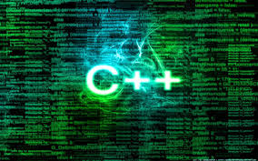

```{r, include=FALSE}
knitr::opts_chunk$set(echo = TRUE)
```


## Rcpp



## Einleitung

- R ist in C geschrieben
- Die Nutzung der Schnittstelle zu C liegt nahe


## Das R-Paket CPP 

- [R Simulationsmodelle bis zu 20 mal schneller](https://www.r-bloggers.com/make-your-r-simulation-models-20-times-faster/)

- [Hohe Performanz mit Rcpp](http://adv-r.had.co.nz/Rcpp.html)


```{r,eval=F}
install.packages("Rcpp")
```

```{r,eval=F}
library(Rcpp)
cppFunction('int add(int x, int y, int z) {
  int sum = x + y + z;
  return sum;
}')
# add works like a regular R function
add
```

```{r,eval=F}
add(1, 2, 3)
```


## [Rcpp](http://dirk.eddelbuettel.com/code/rcpp/Rcpp-introduction.pdf)

[Tutorial on Rcpp by Hadley Wickham](http://adv-r.had.co.nz/Rcpp.html#rcpp-intro)

```{r}
library(Rcpp)
```

```{r,eval=F}
cppFunction('int add(int x, int y, int z) {
  int sum = x + y + z;
  return sum;
}')
```


```{r,eval=F}
add(1, 2, 3)
```


[Youtube Video with Dirk Edelbuettel](https://www.youtube.com/watch?v=ZKx5duewv-0)


