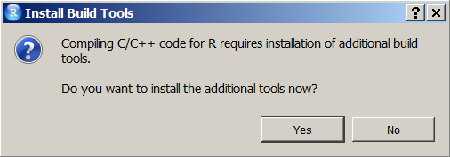
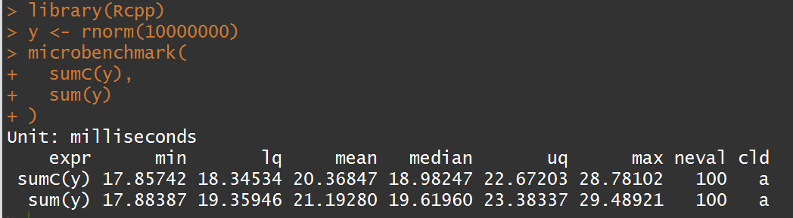

```{r, include=FALSE}
knitr::opts_chunk$set(echo = TRUE)
```

<!-- 
folgendes stammt aus dem EMBL Kurs
--> 

## Warum die Integration von c++

Robert Gentleman, in R Programming for Bioinformatics, 2008,
about R's built-in C interfaces:

> Since R is not compiled, in some situations its performance can be substantially improved by writing code in a compiled language. There are also reasons not to write code in other languages, and in particular we caution against premature optimization, prototyping in R
is often cost effective. And in our experience very few routines need to be implemented in other languages for effiiency reasons. Another substantial reason not to use an implementation in some other language is increased complexity. The use of another language almost always
results in higher maintenance costs and less stability. In addition, any extensions or enhancements of the code will require someone that is proficient in both R and the other language.


- Rcpp does make some of the above caution statements slightly less
critical.


## Warum und wann?

- Warum? - R wird langsam oder hat Probleme bei der  Speicherverwaltung: zum Beispiel bei Schleifen, die nicht vektorisiert werden können.

- Wann? - wenn man es mit Rcode nicht besser hinbekommt und man den langsamen Code identifiziert hat.

## Voraussetzung Compiler

Für Windows, Rtools

1. http://cran.r-project.org/bin/windows/Rtools/
2. http://cran.r-project.org/doc/manuals/R-admin.html#The-Windows-toolset

Für Mac, Xcode

3. http://cran.r-project.org/doc/manuals/R-admin.html#Installing-R-under-_0028Mac_0029-OS-X
4. http://cran.r-project.org/doc/manuals/R-admin.html#Mac-OS-X

## Was wir nutzen werden

Wir werden die folgenden beiden Pakete nutzen:

- `inline` und die `cfunction` um Inline C code zu schreiben, der on-the-fly kompiliert wird (Es gibt auch eine `cxxfunction` für
C++ Code).

- `Rcpp`, und die Nutzung der Funktion `cppFunction` 

## [`Rcpp` ist das am meisten heruntergeladene Paket](http://www.kdnuggets.com/2015/06/top-20-r-packages.html)


## Das Paket `inline`

```{r,eval=F}
install.packages("inline")
```

```{r}
library(inline)
citation("inline")
```


## Das `Rcpp` Paket


- Dirk Eddelbuettel und Romain Francois, unter Mitwirkung von Douglas Bates, John Chambers und JJ Allaire.
- Eine flexible Umgebung das die Integration von R und C/C++ ermöglicht
- http://www.rcpp.org/
- Mit dabei ist die Dokumentation und Beispiele:

```{r,eval=F}
vignette(package = "Rcpp")
```

- Alle Basis R Typen sind als C++ Klassen integriert.
- Man muss sich keine Sorgen über garbage collection machen.

## Was ist garbage collection

- [Mit dem Befehl `gc()`](http://stackoverflow.com/questions/8813753/what-is-the-difference-between-gc-and-rm) werden Variablen gelöscht, die nicht mehr benötigt werden/auf die man keinen Zugriff mehr hat.
- Keine Variablen werden gelöscht, die man noch benötigt

## Verwandte Pakete

- `RcppArmadillo` - Armadillo basiert auf einem C++ Paket für lineare
Algebra.
- `RcppEigen` - hoch-performante Eigen lineare Algebra Bibliothek.
- `RInside` - R aus C++ heraus nutzen.


## Einleitung

- R ist in C geschrieben
- Die Nutzung der Schnittstelle zu C liegt nahe
<!--

-->


## Das R-Paket CPP 

- [R Simulationsmodelle bis zu 20 mal schneller](https://www.r-bloggers.com/make-your-r-simulation-models-20-times-faster/)

- [Hohe Performanz mit Rcpp](http://adv-r.had.co.nz/Rcpp.html)


```{r,eval=F}
install.packages("Rcpp")
```

```{r,eval=F}
library(Rcpp)
cppFunction('int add(int x, int y, int z) {
  int sum = x + y + z;
  return sum;
}')
# add works like a regular R function
add
```

```{r,eval=F}
add(1, 2, 3)
```


## [Rcpp](http://dirk.eddelbuettel.com/code/rcpp/Rcpp-introduction.pdf)

[Tutorial on Rcpp by Hadley Wickham](http://adv-r.had.co.nz/Rcpp.html#rcpp-intro)

```{r}
library(Rcpp)
```



```{r,eval=F}
cppFunction('int add(int x, int y, int z) {
  int sum = x + y + z;
  return sum;
}')
```


```{r,eval=F}
add(1, 2, 3)
```

## Benchmarking

```{r,eval=F}
install.packages("microbenchmark")
```


```{r}
library(microbenchmark)
```

- [R-bloggers Artikel zu dem Paket `microbenchmark` ](https://www.r-bloggers.com/microbenchmarking-with-r/)

## Das Paket `rbenchmark`

```{r,eval=F}
install.packages("rbenchmark")
```


```{r}
library(rbenchmark)
```

## Eine cpp Funktion zum aufsummieren 

```{r,eval=F}
library(Rcpp)
cppFunction('
  double sumC(NumericVector x) {
    int n = x.size();
    double total = 0;
    for(int i = 0; i < n; ++i) {
      total += x[i];
    }
    return total;
  }
')
```

## [Ein erster Vergleich](http://www.quantide.com/ramarro-chapter-10/)

```{r,eval=F}
y <- rnorm(10000000)
microbenchmark(
  sumC(y),
  sum(y)
)
```




## Resourcen

Youtube Videos

- [... mit Dirk Edelbuettel](https://www.youtube.com/watch?v=ZKx5duewv-0)

- [... R mit C++: Rcpp, RInside, und RProtobuf](https://www.youtube.com/watch?v=UZkaZhsOfT4#t=232)

- Oliver Heidmann - [Programmieren in R - 
Rcpp](https://wr.informatik.uni-hamburg.de/_media/teaching/sommersemester_2016/pir-16-oliver_heidmann-report.pdf)

- [Das Paket `cxxfunplus`](https://cran.r-project.org/web/packages/cxxfunplus/cxxfunplus.pdf)

```{r,eval=F}
install.packages("cxxfunplus")
```

- [Rcpp: Seamless R and C++ Integration](www.quantide.com/R/ramarro-chapter-10/)

- [Rcpp Honig](https://www.r-bloggers.com/rcpphoney-introduction/)

- [Advanced R on Memory](http://adv-r.had.co.nz/memory.html)

- [C++ sugar](https://cran.r-project.org/web/packages/Rcpp/vignettes/Rcpp-sugar.pdf)