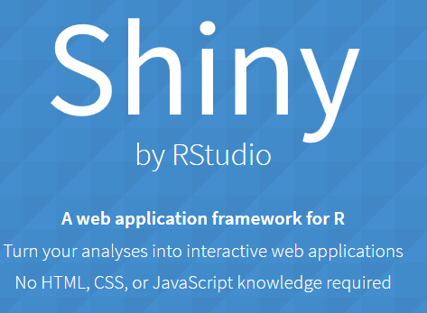
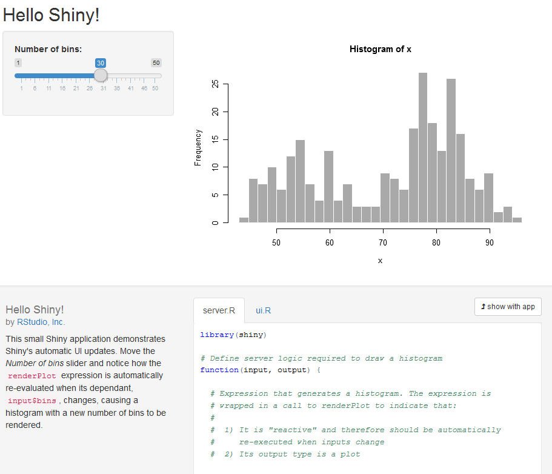
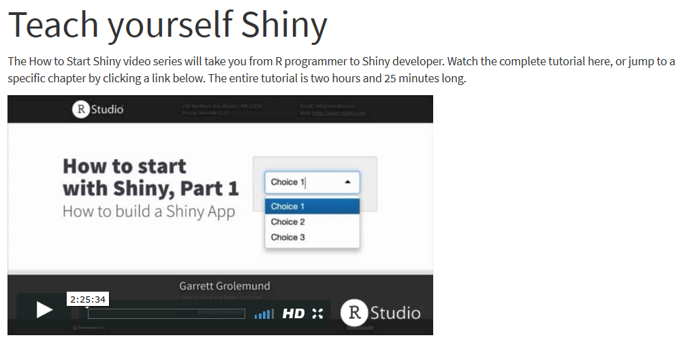

```{r, include=FALSE}
knitr::opts_chunk$set(echo = TRUE)
```

## Das `shiny` Paket installieren

```{r,eval=F}
install.packages("shiny")
```



## Wer hat's erfunden?

```{r}
citation("shiny")
```


## Eine erste Beispielapp

```{r,eval=F}
library(shiny)
runExample("01_hello")
```



## Der Start


## Dem Kind einen Namen geben


## Die erste App

- man muss den Run App Button drücken


- Das Ergebnis:


## Zur Erklärung

- Zumeist arbeitet man mit mindestens zwei Dateien
- Das user interface wird mit einer Datei erzeugt werden, die `ui.R` genannt werden muss
- Für die Server Seite brauchen wir auch ein eigenes File, dieses bennenen wir mit `server.R`

## Eine zweite Beispiel App

```{r,eval=F}
library(shiny)
runExample("02_text")
```


## [Einführung in Shiny](https://shiny.rstudio.com/tutorial/)



## Links 

- [Eine Dashboard App erzeugen](https://shiny.rstudio.com/tutorial/js-lesson1/#creating-a-dashboard-app)

