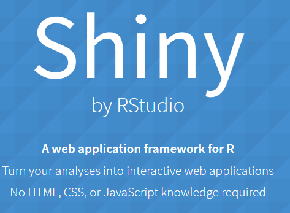

# Applikationen erstellen mit Shiny
Jan-Philipp Kolb  
24 April 2017  


## Das `shiny` Paket installieren


```r
install.packages("shiny")
```



## Wer hat's erfunden?


```r
citation("shiny")
```

```
## 
## To cite package 'shiny' in publications use:
## 
##   Winston Chang, Joe Cheng, JJ Allaire, Yihui Xie and Jonathan
##   McPherson (2017). shiny: Web Application Framework for R. R
##   package version 1.0.1. https://CRAN.R-project.org/package=shiny
## 
## A BibTeX entry for LaTeX users is
## 
##   @Manual{,
##     title = {shiny: Web Application Framework for R},
##     author = {Winston Chang and Joe Cheng and JJ Allaire and Yihui Xie and Jonathan McPherson},
##     year = {2017},
##     note = {R package version 1.0.1},
##     url = {https://CRAN.R-project.org/package=shiny},
##   }
```


## Eine erste Beispielapp


```r
library(shiny)
runExample("01_hello")
```


## Der Start


## Dem Kind einen Namen geben


## Die erste App

- man muss den Run App Button drücken


- Das Ergebnis:


## Zur Erklärung

- Zumeist arbeitet man mit mindestens zwei Dateien
- Das user interface wird mit einer Datei erzeugt werden, die `ui.R` genannt werden muss
- Für die Server Seite brauchen wir auch ein eigenes File, dieses bennenen wir mit `server.R`

## Eine zweite Beispiel App


```r
library(shiny)
runExample("02_text")
```


## [Einführung in Shiny](https://shiny.rstudio.com/tutorial/)


## Links 

- [Eine Dashboard App erzeugen](https://shiny.rstudio.com/tutorial/js-lesson1/#creating-a-dashboard-app)

